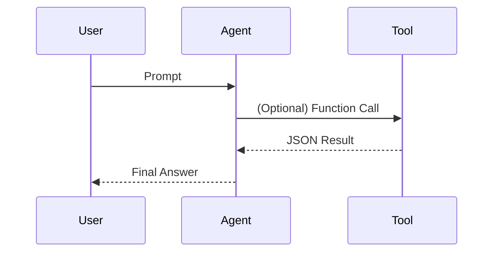
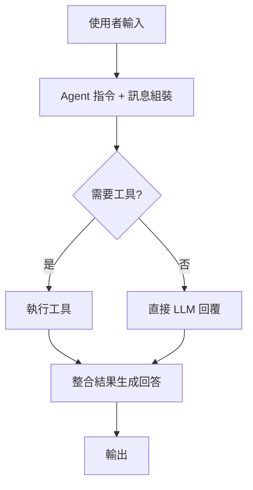

# 教學 XX：<主題名稱>

## 目標 (Goal / Objective)

列出學完後的 3–5 個可衡量成果或能力。

- 範例：能建立一個使用 OpenAPI Toolset 的查詢代理
- 範例：理解並運用 ParallelAgent + SequentialAgent 的扇出/收集模式

## 先決條件 (Prerequisites)

- 已完成前置教學：00 / 01 / 02 ...（依需求列出）
- Python 版本需求：3.9+
- 已安裝套件：`pip install google-adk`
- API / 金鑰：GEMINI_API_KEY 或 VertexAI ADC
- 無則寫：無

## 完成時間 (Estimated Time)

20–40 分鐘（依實際內容調整）。

## 總覽 (Overview)

用 1–2 段說明：此主題要解決的問題 + 為何重要 + 和其他教學的銜接。

### 程式碼實現 (Code Implementation)

- {xx_example}：[程式碼連結](../workspace/python/agents/{xx_example}/README.md)

## 核心概念 (Core Concepts)

| 概念                           | 一句話說明                           | 何時使用               |
| ------------------------------ | ------------------------------------ | ---------------------- |
| ConceptA (e.g. Agent)          | 定義行為與工具的容器                 | 建立任何互動邏輯時     |
| ConceptB (e.g. Function Tools) | 以 Python 函式提供外部能力           | 需要執行程式計算或查詢 |
| ConceptC (e.g. OpenAPIToolset) | 由 OpenAPI 規範自動產生 API 呼叫工具 | 加速 REST 整合         |
| ConceptD (e.g. ParallelAgent)  | 同時執行多個子任務                   | 任務獨立且追求速度     |
| ConceptE (e.g. LoopAgent)      | 迭代改進直到達成品質                 | 需要審查與優化         |

## 使用案例 (Use Case)

敘述一個真實場景：使用者需求 / 輸入 / 預期輸出 / 價值。例：財務助理計算複利、貸款、儲蓄建議。

## 專案結構 (Project Structure)

```
<project_name>/
  __init__.py        # 套件入口匯入 root_agent
  agent.py           # 主要代理定義與工具/工作流程
  .env               # 驗證與環境變數 (不進版控)
  tools/             # (選用) 自訂工具函式模組
  workflows/         # (選用) 複合代理組裝 (Sequential/Parallel/Loop)
  tests/             # (選用) 單元 / 行為測試
  README.md          # (選用) 專案說明
```

## 快速入門 (Quick Start)

```bash
# 1. 安裝
pip install google-adk

# 2. 建立專案目錄
mkdir <project_name> && cd <project_name>

# 3. 建立基礎檔案
printf 'from . import agent\n' > __init__.py
touch agent.py .env

# 4. 設定環境變數 (.env)
# GOOGLE_GENAI_USE_VERTEXAI=FALSE
# GOOGLE_API_KEY=your-api-key-here

# 5. 啟動開發介面（父層目錄）
cd ..
adk web
```

## 步驟教學 (Step-by-Step Implementation)

### 步驟 1：初始化專案

說明檔案用途與命名約定：`root_agent` 必須存在。

### 步驟 2：驗證 / 環境設定

- 區分 Gemini API vs VertexAI
- 安全：API 金鑰不提交；可用 Secret Manager

### 步驟 3：核心程式碼

放入最小可行 Agent 範例：

```python
from __future__ import annotations
from google.adk.agents import Agent

root_agent = Agent(
    name="demo_agent",
    model="gemini-2.0-flash",
    description="示範用代理",
    instruction="你是一個友善助理，清楚回答並保持簡潔。"
)
```

或工作流程 / 工具註冊示例：

```python
# 函式工具範例
def calculate_compound_interest(principal: float, annual_rate: float, years: int) -> dict:
    """計算複利。principal>0, annual_rate 0~1"""
    if principal <= 0:
        return {"status": "error", "report": "本金必須大於 0"}
    final = principal * (1 + annual_rate) ** years
    return {"status": "success", "final_amount": round(final, 2), "report": f"{years} 年後金額 {final:.2f}"}

root_agent = Agent(
    name="finance_assistant",
    model="gemini-2.0-flash",
    instruction="使用工具回答財務問題並清楚解釋。",
    tools=[calculate_compound_interest]
)
```

### 步驟 4：執行與互動

- Web UI：啟動後選擇專案下拉選單
- CLI：`adk run <project_name>`
- 推薦提示：`Hello`, `幫我計算 10000 本金 6% 5 年複利`

### 步驟 5：進階能力 (可選)

- 使用 SequentialAgent 串接多階段
- 使用 ParallelAgent 平行收集
- 使用 LoopAgent 迭代優化（含 exit_loop 安全終止）
- 整合 OpenAPIToolset / MCPToolset / 內建工具 (google_search / google_maps_grounding)

## 運作原理 (How It Works)

1. 使用者輸入與指令封裝
2. 模型檢視工具 schema → 決定是否呼叫
3. 工具執行回傳結構化結果
4. 模型整合輸出生成回應
5. （工作流程）Sequential/Parallel/Loop 按定義協調子代理

可視化：



## 預期行為 (Expected Behavior)

範例互動：

```
User: 幫我計算 10000 投資 6% 5 年後多少？
Agent: 經過 5 年後約 13382.26。複利公式應用：本金 * (1+年利率)^年數。
```

## 工作流程圖 (Workflow Diagram) (可選)



## 最佳實踐 (Best Practices)

**應該**：

- 工具函式保持單一責任、回傳 {status, report, ...}
- 使用型別提示 + 清楚 docstring
- 指令 (instruction) 明確列行為與限制
- 使用 `output_key` 管理狀態流動（工作流程）
- 迴圈代理加上 max_iterations + exit 工具雙保險

**避免**：

- 所有功能擠成一個函式
- 在指令中混雜多語且冗長無結構
- 忽略錯誤處理與安全（金鑰硬編碼）

## 疑難排解 / 常見問題 (Troubleshooting / FAQ)

| 問題                   | 原因                   | 解法                             |
| ---------------------- | ---------------------- | -------------------------------- |
| Agent 未出現在下拉選單 | 啟動目錄錯誤           | 從包含子目錄的父層執行 `adk web` |
| 工具不呼叫             | 函式描述或型別不明     | 增加 docstring + 明確型別        |
| API Key 無效           | 未載入環境變數         | 重新 export，確認 `.env` 正確    |
| 狀態未傳遞             | output_key 缺失或拼錯  | 檢查鍵名與 `{key}` 佔位符        |
| 循環不停止             | 未實作 exit 或迭代上限 | 增加退出工具 + max_iterations    |

## 重點摘要 (Key Takeaways)

- Agent 是設定容器，`root_agent` 必須存在。
- 工具可為函式/OpenAPI/MCP/內建搜尋。
- 工作流程：Sequential → 確定順序；Parallel → 加速；Loop → 迭代品質。
- 狀態流動靠 `output_key` 與 `{placeholder}` 注入。
- 安全：環境變數與最小權限，避免硬編碼金鑰。

## 資源 (Resources)

- 官方文件：https://google.github.io/adk-docs/
- Gemini API：https://ai.google.dev/gemini-api/docs
- VertexAI：https://cloud.google.com/vertex-ai
- MCP 生態系統：https://modelcontextprotocol.io

## 附錄 (Appendix) (依需要啟用)

### 成本與配額 (Cost / Quota)

### 安全與權限 (Security / IAM)

### 測試樣板 (Testing Skeleton)

```python
# tests/test_agent_basic.py
from google.adk.agents import Agent

def test_agent_exists():
    from <project_name>.agent import root_agent
    assert isinstance(root_agent, Agent)
```
