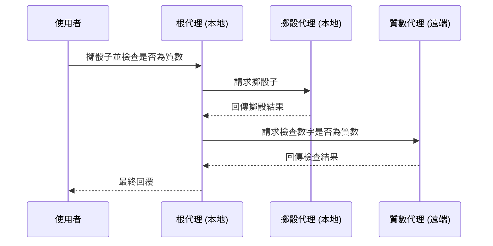

# 快速入門：透過 A2A 使用遠端代理 (Remote Agent)

> 🔔 `更新日期：2026-01-30`
>
> 🔗 `資料來源`：https://google.github.io/adk-docs/a2a/quickstart-consuming-go/

[`ADK 支援`: `Go` | `實驗性功能`]

本快速入門涵蓋了任何開發人員最常見的起點：**「已有一個遠端代理，我該如何讓我的 ADK 代理透過 A2A 使用它？」**。這對於建立複雜的多代理系統至關重要，其中不同的代理需要進行協作和互動。

## 概覽

此範例演示了代理開發套件 (ADK) 中的 **代理對代理 (Agent-to-Agent, A2A)** 架構，展示了多個代理如何協作處理複雜任務。該範例實現了一個可以擲骰子並檢查數字是否為質數的代理。



A2A 基礎範例由以下部分組成：

- **根代理 (Root Agent)** (`root_agent`)：主要協調者，負責將任務分配給專門的子代理。
- **擲骰代理 (Roll Agent)** (`roll_agent`)：一個本地子代理，負責擲骰子操作。
- **質數代理 (Prime Agent)** (`prime_agent`)：一個遠端 A2A 代理，負責檢查數字是否為質數，該代理運行在獨立的 A2A 伺服器上。

## 使用 ADK 伺服器公開您的代理

  在 `a2a_basic` 範例中，您首先需要透過 A2A 伺服器公開 `check_prime_agent`，以便本地根代理可以使用它。

### 1. 取得範例程式碼 { #getting-the-sample-code }

首先，請確保您已安裝 Go 並且環境已設置完成。

您可以克隆並導航到此處的 [**`a2a_basic`** 範例](https://github.com/google/adk-docs/tree/main/examples/go/a2a_basic)：

```bash
# 切換至範例目錄
cd examples/go/a2a_basic
```

如您所見，資料夾結構如下：

```text
a2a_basic/
├── remote_a2a/
│   └── check_prime_agent/
│       └── main.go
├── go.mod
├── go.sum
└── main.go # 本地根代理
```

#### 主代理 (`a2a_basic/main.go`)

- **`rollDieTool`**：用於擲骰子的功能工具
- **`newRollAgent`**：專門負責擲骰子的本地代理
- **`newPrimeAgent`**：遠端 A2A 代理配置
- **`newRootAgent`**：具有委派邏輯的主要協調者

#### 遠端質數代理 (`a2a_basic/remote_a2a/check_prime_agent/main.go`)

- **`checkPrimeTool`**：質數檢查演算法
- **`main`**：質數檢查服務和 A2A 伺服器的實現。

### 2. 啟動遠端質數代理伺服器

為了展示您的 ADK 代理如何透過 A2A 使用遠端代理，您首先需要啟動一個遠端代理伺服器，該伺服器將託管質數代理（位於 `check_prime_agent` 下）。

```bash
# 啟動遠端 a2a 伺服器，在連接埠 8001 上提供 check_prime_agent 服務
go run remote_a2a/check_prime_agent/main.go
```

執行後，您應該會看到如下內容：

``` shell
2025/11/06 11:00:19 Starting A2A prime checker server on port 8001
2025/11/06 11:00:19 Starting the web server: &{port:8001}
2025/11/06 11:00:19
2025/11/06 11:00:19 Web servers starts on http://localhost:8001
2025/11/06 11:00:19        a2a:  you can access A2A using jsonrpc protocol: http://localhost:8001
```

### 3. 查看遠端代理所需的代理卡

A2A 協定要求每個代理都必須有一個描述其功能的代理卡。

在 Go ADK 中，當您使用 A2A 啟動器公開代理時，會動態生成代理卡。您可以造訪 `http://localhost:8001/.well-known/agent-card.json` 查看生成的代理卡。

### 4. 執行主（使用端）代理

  ```bash
  # 在另一個終端機中，執行主代理
  go run main.go
  ```

#### 運作原理

主代理使用 `remoteagent.New` 來使用遠端代理（在我們的範例中為 `prime_agent`）。如下所示，它需要 `Name`、`Description` 和 `AgentCardSource` URL。

`a2a_basic/main.go`
```go title="a2a_basic/main.go"
// 使用 remoteagent.NewA2A 初始化遠端代理
func newPrimeAgent() (agent.Agent, error) {
  remoteAgent, err := remoteagent.NewA2A(remoteagent.A2AConfig{
    Name:            "prime_agent",
    Description:     "處理檢查數字是否為質數的代理。",
    AgentCardSource: "http://localhost:8001",
  })
  if err != nil {
    return nil, fmt.Errorf("無法建立遠端質數代理：%w", err)
  }
  return remoteAgent, nil
}
```

然後，您只需在根代理中使用遠端代理即可。在這種情況下，`primeAgent` 被用作下方 `root_agent` 的子代理之一：

`a2a_basic/main.go`
```go title="a2a_basic/main.go"
// 將遠端代理加入到根代理的子代理列表中
func newRootAgent(ctx context.Context, rollAgent, primeAgent agent.Agent) (agent.Agent, error) {
  model, err := gemini.NewModel(ctx, "gemini-2.0-flash", &genai.ClientConfig{})
  if err != nil {
    return nil, err
  }
  return llmagent.New(llmagent.Config{
    Name:  "root_agent",
    Model: model,
    Instruction: `
    你是一個能夠擲骰子並檢查質數的助理。
    你會將擲骰子的任務委派給 roll_agent，將質數檢查的任務委派給 prime_agent。
    請依照以下步驟操作：
    1. 若使用者要求擲骰子，請委派給 roll_agent。
    2. 若使用者要求檢查質數，請委派給 prime_agent。
    3. 若使用者要求擲骰子後檢查結果是否為質數，請先呼叫 roll_agent，再將結果傳給 prime_agent。
    每次操作前請先確認結果再繼續。
    `,
    SubAgents: []agent.Agent{rollAgent, primeAgent},
    Tools:     []tool.Tool{},
  })
}
```

## 互動範例

當您的主代理和遠端代理都在運行後，您可以與根代理進行互動，觀察它如何透過 A2A 呼叫遠端代理：

**簡單擲骰：**
此互動使用本地代理「擲骰代理」：

```text
使用者：擲一個 6 面骰子
機器人呼叫工具：transfer_to_agent，參數：map[agent_name:roll_agent]
機器人呼叫工具：roll_die，參數：map[sides:6]
機器人：我擲了一個 6 面骰子，結果是 6。
```

**質數檢查：**

此互動透過 A2A 使用遠端代理「質數代理」：

```text
使用者：7 是質數嗎？
機器人呼叫工具：transfer_to_agent，參數：map[agent_name:prime_agent]
機器人呼叫工具：prime_checking，參數：map[nums:[7]]
機器人：是的，7 是一個質數。
```

**組合操作：**

此互動同時使用本地「擲骰代理」和遠端「質數代理」：

```text
使用者：擲一個骰子並檢查它是否為質數
機器人：好的，我會先擲一個骰子，然後檢查結果是否為質數。

機器人呼叫工具：transfer_to_agent，參數：map[agent_name:roll_agent]
機器人呼叫工具：roll_die，參數：map[sides:6]
機器人呼叫工具：transfer_to_agent，參數：map[agent_name:prime_agent]
機器人呼叫工具：prime_checking，參數：map[nums:[3]]
機器人：3 是一個質數。
```

## 下一步

現在您已經建立了一個透過 A2A 伺服器使用遠端代理的代理，下一步是學習如何公開您自己的代理。

- [**A2A 快速入門 (公開端)**](../a2a-quickstart%20(exposing)/quickstart-exposing-go.md)：學習如何公開您現有的代理，以便其他代理可以透過 A2A 協定使用它。
