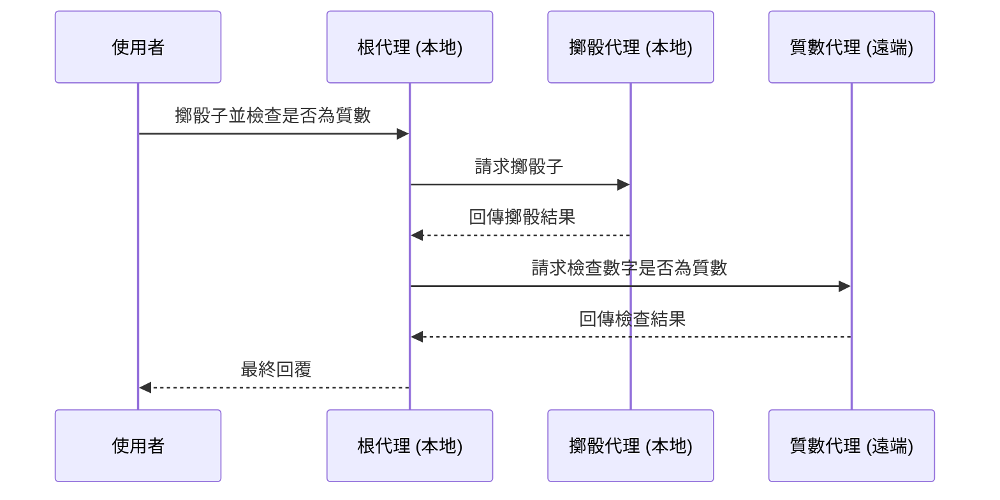

# 快速入門：透過 A2A 使用遠端代理
🔔 `更新日期：2026-01-15`

[`ADK 支援`: `Python` | `實驗性預覽`]

本快速入門涵蓋了任何開發者最常見的起點：**「有一個遠端代理，我該如何讓我的 ADK 代理透過 A2A 使用它？」**。這對於構建複雜的多代理系統至關重要，在這些系統中，不同的代理需要進行協作與互動。

## 總覽

本範例展示了代理開發套件 (ADK) 中的 **代理對代理 (Agent2Agent, A2A)** 架構，說明了多個代理如何協同工作以處理複雜任務。該範例實現了一個可以擲骰子並檢查數字是否為質數的代理。



A2A 基礎範例包含：

- **根代理** (`root_agent`)：主要協調者，負責將任務分配給專門的子代理
- **擲骰代理** (`roll_agent`)：處理擲骰子操作的本地子代理
- **質數代理** (`prime_agent`)：檢查數字是否為質數的遠端 A2A 代理，該代理運行在獨立的 A2A 伺服器上

## 使用 ADK 伺服器公開您的代理

  ADK 內置了 CLI 命令 `adk api_server --a2a`，用於透過 A2A 協定公開您的代理。

  在 `a2a_basic` 範例中，您首先需要透過 A2A 伺服器公開 `check_prime_agent`，以便本地根代理可以使用它。

### 1. 獲取範例程式碼

首先，確保您已安裝必要的依賴項：

```bash
# 安裝支援 A2A 功能的 google-adk
pip install google-adk[a2a]
```

您可以在此處克隆並導航到 [**`a2a_basic`** 範例](https://github.com/google/adk-python/tree/main/contributing/samples/a2a_basic)：

```bash
# 克隆 ADK Python 專案存儲庫
git clone https://github.com/google/adk-python.git
```

如您所見，資料夾結構如下：

```text
a2a_basic/
├── remote_a2a/
│   └── check_prime_agent/
│       ├── __init__.py
│       ├── agent.json
│       └── agent.py
├── README.md
├── __init__.py
└── agent.py # 本地根代理
```

#### 主代理 (`a2a_basic/agent.py`)

- **`roll_die(sides: int)`**：用於擲骰子的函式工具
- **`roll_agent`**：專門從事擲骰子的本地代理
- **`prime_agent`**：遠端 A2A 代理配置
- **`root_agent`**：帶有分配邏輯的主要協調者

#### 遠端質數代理 (`a2a_basic/remote_a2a/check_prime_agent/`)

- **`agent.py`**：質數檢查服務的實現
- **`agent.json`**：A2A 代理的代理卡 (Agent card)
- **`check_prime(nums: list[int])`**：質數檢查演算法

### 2. 啟動遠端質數代理伺服器

為了展示您的 ADK 代理如何透過 A2A 使用遠端代理，您首先需要啟動一個遠端代理伺服器，該伺服器將託管質數代理（位於 `check_prime_agent` 下）。

```bash
# 啟動遠端 a2a 伺服器，在連接埠 8001 上提供 check_prime_agent
adk api_server --a2a --port 8001 contributing/samples/a2a_basic/remote_a2a
```

> [!NOTE] 使用 `--log_level debug` 添加日誌以進行偵錯
  要啟用除錯級別的日誌記錄，您可以在 `adk api_server` 中添加 `--log_level debug`，例如：
  ```bash
  # 使用 debug 模式啟動 api_server 以獲取更詳細的日誌
  adk api_server --a2a --port 8001 contributing/samples/a2a_basic/remote_a2a --log_level debug
  ```
  這將為您提供更豐富的日誌，以便在測試代理時進行檢查。

> [!NOTE] 為什麼使用連接埠 8001？
  在此快速入門中，在本地進行測試時，您的代理將使用 localhost，因此公開代理（遠端質數代理）的 A2A 伺服器 `port` 必須與使用方代理的連接埠不同。您將與使用方代理互動的 `adk web` 預設連接埠是 `8000`，這就是為什麼 A2A 伺服器使用單獨的連接埠 `8001` 創建的原因。

執行後，您應該會看到類似以下的內容：

``` shell
# 伺服器啟動成功後的輸出範例
INFO:     Started server process [56558]
INFO:     Waiting for application startup.
INFO:     Application startup complete.
INFO:     Uvicorn running on http://127.0.0.1:8001 (Press CTRL+C to quit)
```

### 3. 注意遠端代理所需的代理卡 (`agent-card.json`)

A2A 協定要求每個代理都必須有一張描述其功能的代理卡 (Agent card)。

如果其他人已經構建了您想要在代理中使用的遠端 A2A 代理，那麼您應該確認他們有一張代理卡 (`agent-card.json`)。

在範例中，`check_prime_agent` 已經提供了一張代理卡：

`a2a_basic/remote_a2a/check_prime_agent/agent-card.json`
```json title="a2a_basic/remote_a2a/check_prime_agent/agent-card.json"
{
  "capabilities": {},
  "defaultInputModes": ["text/plain"],
  "defaultOutputModes": ["application/json"],
  "description": "專門檢查數字是否為質數的代理。它可以有效地確定單個數字或數字列表的質數性。",
  "name": "check_prime_agent",
  "skills": [
    {
      "id": "prime_checking",
      "name": "質數檢查",
      "description": "使用高效的數學演算法檢查列表中的數字是否為質數",
      "tags": ["數學", "計算", "質數", "數字"]
    }
  ],
  "url": "http://localhost:8001/a2a/check_prime_agent",
  "version": "1.0.0"
}
```

> [!NOTE] 關於 ADK 中代理卡的更多資訊
  在 ADK 中，您可以使用 `to_a2a(root_agent)` 包裝器，它會自動為您生成代理卡。如果您有興趣了解更多關於如何公開現有代理以便他人使用的資訊，請參閱 [A2A 快速入門（公開）](../a2a-quickstart%20(exposing)/quickstart-exposing.md) 教程。

### 4. 運行主（使用方）代理

  ```bash
  # 在另一個終端機中，執行 adk web 伺服器
  adk web contributing/samples/
  ```

#### 運作方式

主代理使用 `RemoteA2aAgent()` 函式來使用遠端代理（在我們的範例中為 `prime_agent`）。如下所示，`RemoteA2aAgent()` 需要 `name`、`description` 以及 `agent_card` 的 URL。

`a2a_basic/agent.py`
```python title="a2a_basic/agent.py"
# <...代碼已省略...>

# 從 ADK 遠端 A2A 模組導入必要路徑與類別
from google.adk.agents.remote_a2a_agent import AGENT_CARD_WELL_KNOWN_PATH
from google.adk.agents.remote_a2a_agent import RemoteA2aAgent

# 配置遠端質數代理
prime_agent = RemoteA2aAgent(
    name="prime_agent",
    description="負責檢查數字是否為質數的代理。",
    agent_card=(
        f"http://localhost:8001/a2a/check_prime_agent{AGENT_CARD_WELL_KNOWN_PATH}"
    ),
)

# <...代碼已省略...>
```

接著，您就可以在您的代理中簡單地使用 `RemoteA2aAgent`。在這種情況下，`prime_agent` 被用作下方 `root_agent` 的子代理之一：

`a2a_basic/agent.py`
```python title="a2a_basic/agent.py"
from google.adk.agents.llm_agent import Agent
from google.genai import types

# 定義主要的根代理
root_agent = Agent(
    model="gemini-2.0-flash",
    name="root_agent",
    instruction="""
      <你是一個樂於助人的助手，可以擲骰子並檢查數字是否為質數。
      你將擲骰子任務分配給 roll_agent，將質數檢查任務分配給 prime_agent。
      請遵循以下步驟：
      1. 如果使用者要求擲骰子，請分配給 roll_agent。
      2. 如果使用者要求檢查質數，請分配給 prime_agent。
      3. 如果使用者要求擲骰子然後檢查結果是否為質數，請先呼叫 roll_agent，然後將結果傳遞給 prime_agent。
      在繼續之前務必澄清結果。>
    """,
    global_instruction=(
        "你是 DicePrimeBot，隨時準備擲骰子並檢查質數。"
    ),
    sub_agents=[roll_agent, prime_agent], # 註冊子代理
    tools=[example_tool],
    generate_content_config=types.GenerateContentConfig(
        safety_settings=[
            types.SafetySetting(  # 避免關於擲骰子的誤報。
                category=types.HarmCategory.HARM_CATEGORY_DANGEROUS_CONTENT,
                threshold=types.HarmBlockThreshold.OFF,
            ),
        ]
    ),
)
```

## 互動範例

當主代理和遠端代理都運行後，您可以與根代理互動，查看它如何透過 A2A 呼叫遠端代理：

**簡單的擲骰子：**
此互動使用本地代理 Roll Agent：

```text
使用者：擲一個 6 面骰子
機器人：我為你擲出了 4。
```

**質數檢查：**

此互動透過 A2A 使用遠端代理 Prime Agent：

```text
使用者：7 是質數嗎？
機器人：是的，7 是質數。
```

**組合操作：**

此互動同時使用本地 Roll Agent 和遠端 Prime Agent：

```text
使用者：擲一個 10 面骰子並檢查它是否為質數
機器人：我為你擲出了 8。
機器人：8 不是質數。
```

## 下一步

如需如何使用及測試內容快取功能的完整實作，請參閱以下範例：

-   [`a2a-basic`](../../../python/agents/a2a-basic/)： 。

現在您已經創建了一個透過 A2A 伺服器使用遠端代理的代理，下一步是學習如何從另一個代理連接到它。

- [**A2A 快速入門（公開）**](../a2a-quickstart%20(exposing)/quickstart-exposing.md)：學習如何公開現有代理，以便其他代理可以透過 A2A 協定使用它。
