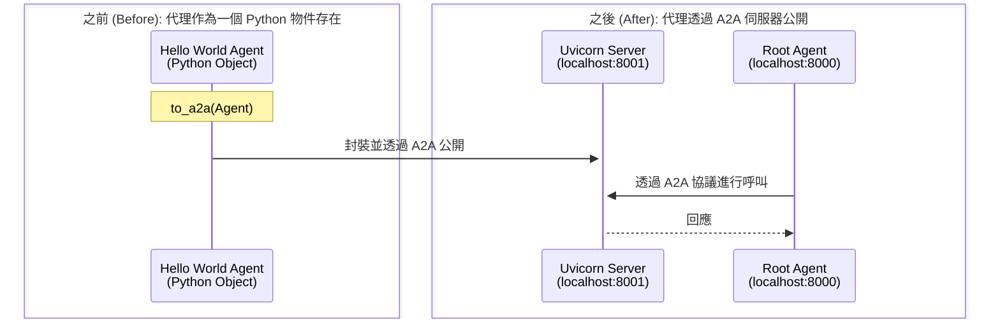

# 快速入門：透過 A2A 公開遠端 Agent
🔔 `更新日期：2026-01-15`

[`ADK 支援`: `Go`]

本快速入門涵蓋了任何開發者最常見的起點：**「我有一個 Agent。我該如何公開它，以便其他 Agent 可以透過 A2A 使用我的 Agent？」**。這對於構建複雜的多 Agent 系統至關重要，在這些系統中，不同的 Agent 需要進行協作與互動。

## 概覽

本範例示範了如何輕鬆公開一個 ADK Agent，使其隨後能被另一個使用 A2A 協定（A2A Protocol）的 Agent 所取用。

在 Go 中，您可以使用 A2A 啟動器（launcher）來公開 Agent，它會為您動態生成一份 Agent 卡片（agent card）。



本範例包含：

- **遠端質數 Agent** (`remote_a2a/check_prime_agent/main.go`)：這是您想要公開以便其他 Agent 透過 A2A 使用的 Agent。它是一個處理質數檢查的 Agent。它使用 A2A 啟動器來進行公開。
- **根 Agent (Root Agent)** (`main.go`)：一個僅僅是呼叫遠端質數 Agent 的簡單 Agent。

## 使用 A2A 啟動器公開遠端 Agent

您可以使用 A2A 啟動器將現有的 Go ADK Agent 轉化為相容 A2A 的 Agent。

### 1. 取得範例程式碼

首先，請確保您已安裝 Go 並且環境已設置完成。

您可以複製並切換到 [**`a2a_basic`** 範例](https://github.com/google/adk-docs/tree/main/examples/go/a2a_basic)：

```bash
cd examples/go/a2a_basic
```

如您所見，資料夾結構如下：

```text
a2a_basic/
├── remote_a2a/
│   └── check_prime_agent/
│       └── main.go    # 遠端質數 Agent
├── go.mod
├── go.sum
└── main.go            # 根 Agent
```

#### 根 Agent (`a2a_basic/main.go`)

- **`newRootAgent`**：連線到遠端 A2A 服務的本地 Agent。

#### 遠端質數 Agent (`a2a_basic/remote_a2a/check_prime_agent/main.go`)

- **`checkPrimeTool`**：用於質數檢查的函式。
- **`main`**：建立 Agent 並啟動 A2A 伺服器的主函式。

### 2. 啟動遠端 A2A Agent 伺服器 { #start-the-remote-a2a-agent-server }

您現在可以啟動遠端 Agent 伺服器，它將託管 `check_prime_agent`：

```bash
# 啟動遠端 Agent
go run remote_a2a/check_prime_agent/main.go
```

執行後，您應該會看到類似以下的內容：

```shell
2025/11/06 11:00:19 Starting A2A prime checker server on port 8001
2025/11/06 11:00:19 Starting the web server: &{port:8001}
2025/11/06 11:00:19
2025/11/06 11:00:19 Web servers starts on http://localhost:8001
2025/11/06 11:00:19        a2a:  you can access A2A using jsonrpc protocol: http://localhost:8001
```

### 3. 檢查您的遠端 Agent 是否正在執行

您可以透過造訪 A2A 啟動器自動生成的 Agent 卡片來檢查您的 Agent 是否已啟動並運行：

[http://localhost:8001/.well-known/agent-card.json](http://localhost:8001/.well-known/agent-card.json)

您應該能看到 Agent 卡片的內容。

### 4. 執行主（消費者）Agent

現在您的遠端 Agent 正在執行，您可以執行主 Agent。

```bash
# 在另一個終端機中，執行主 Agent
go run main.go
```

#### 運作原理

遠端 Agent 是在 `main` 函式中使用 A2A 啟動器公開的。啟動器負責啟動伺服器並生成 Agent 卡片。

`remote_a2a/check_prime_agent/main.go`
```go title="remote_a2a/check_prime_agent/main.go"
func main() {
  ctx := context.Background()
  primeTool, err := functiontool.New(functiontool.Config{
    Name:        "prime_checking",
    Description: "使用高效的數學演算法檢查列表中的數字是否為質數",
  }, checkPrimeTool)
  if err != nil {
    log.Fatalf("無法建立 prime_checking 工具: %v", err)
  }

  model, err := gemini.NewModel(ctx, "gemini-2.0-flash", &genai.ClientConfig{})
  if err != nil {
    log.Fatalf("無法建立模型: %v", err)
  }

  primeAgent, err := llmagent.New(llmagent.Config{
    Name:        "check_prime_agent",
    Description: "一個可以檢查數字是否為質數的質數檢查 Agent。",
    Instruction: `
      您負責檢查數字是否為質數。
      在檢查質數時，請使用一個整數列表呼叫 check_prime 工具。請務必傳入一個整數列表。您不應該傳入字串。
      您不應該依賴先前歷史中的質數結果。
    `,
    Model: model,
    Tools: []tool.Tool{primeTool},
  })
  if err != nil {
    log.Fatalf("無法建立 Agent: %v", err)
  }

  // 建立啟動器。a2a.NewLauncher() 將動態生成 Agent 卡片。
  port := 8001
  webLauncher := web.NewLauncher(a2a.NewLauncher())
  _, err = webLauncher.Parse([]string{
    "--port", strconv.Itoa(port),
    "a2a", "--a2a_agent_url", "http://localhost:" + strconv.Itoa(port),
  })
  if err != nil {
    log.Fatalf("launcher.Parse() 發生錯誤 = %v", err)
  }

  // 建立 ADK 設定
  config := &launcher.Config{
    AgentLoader:    agent.NewSingleLoader(primeAgent),
    SessionService: session.InMemoryService(),
  }

  log.Printf("在通訊埠 %d 上啟動 A2A 質數檢查器伺服器\n", port)
  // 執行啟動器
  if err := webLauncher.Run(context.Background(), config); err != nil {
    log.Fatalf("webLauncher.Run() 發生錯誤 = %v", err)
  }
}
```

## 互動範例

當兩個服務都啟動後，您可以與根 Agent 互動，查看它如何透過 A2A 呼叫遠端 Agent：

**質數檢查：**

此互動使用了一個透過 A2A 提供的遠端 Agent，即質數 Agent (Prime Agent)：

```text
使用者：擲一個骰子並檢查它是否為質數
機器人：好的，我會先擲一個骰子，然後檢查結果是否為質數。

機器人呼叫工具：transfer_to_agent，參數：map[agent_name:roll_agent]
機器人呼叫工具：roll_die，參數：map[sides:6]
機器人呼叫工具：transfer_to_agent，參數：map[agent_name:prime_agent]
機器人呼叫工具：prime_checking，參數：map[nums:[3]]
機器人：3 是一個質數。
...
```

## 後續步驟

現在您已經建立了一個透過 A2A 伺服器公開遠端 Agent 的 Agent，下一步是學習如何從另一個 Agent 取用它。

- [**A2A 快速入門 (取用)**](../a2a-quickstart%20(consuming)/quickstart-consuming-go.md)：了解您的 Agent 如何使用 A2A 協定來取用其他 Agent。
