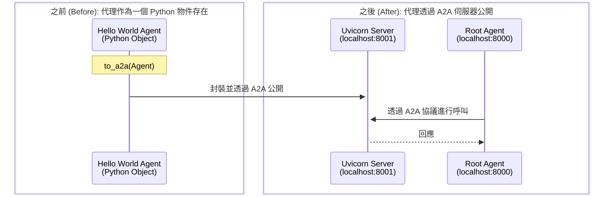

# 快速入門：透過 A2A 公開遠端代理
🔔 `更新日期：2026-01-15`

[`ADK 支援`: `Python` | `Experimental`]

本快速入門涵蓋了任何開發者最常見的起點：**「我有一個代理。我該如何公開它，以便其他代理可以透過 A2A 使用我的代理？」**。這對於構建複雜的多代理系統至關重要，在這種系統中，不同的代理需要協作和互動。

## 概覽 (Overview)

此範例演示了您如何輕鬆公開一個 ADK 代理，使其隨後可以由另一個使用 A2A 協議的代理使用。

透過 A2A 公開 ADK 代理主要有兩種方式。

* **透過使用 `to_a2a(root_agent)` 函數**：如果您只想將現有的代理轉換為與 A2A 配合使用，並能夠透過 `uvicorn` 而不是 `adk deploy api_server` 透過伺服器公開它，請使用此函數。這意味著當您想要將代理產品化時，您可以更緊密地控制想要透過 `uvicorn` 公開的內容。此外，`to_a2a()` 函數會根據您的代理程式碼自動生成代理卡 (agent card)。
* **透過建立您自己的代理卡 (`agent.json`) 並使用 `adk api_server --a2a` 託管它**：使用此方法有兩個主要好處。首先，`adk api_server --a2a` 可以與 `adk web` 配合使用，方便使用、除錯和測試您的代理。其次，使用 `adk api_server`，您可以指定一個包含多個獨立代理的父資料夾。那些擁有代理卡 (`agent.json`) 的代理將自動透過同一伺服器供其他代理透過 A2A 使用。但是，您需要建立自己的代理卡。要建立代理卡，您可以參考 [A2A Python 教學](https://a2a-protocol.org/latest/tutorials/python/1-introduction/)。

本快速入門將重點介紹 `to_a2a()`，因為它是公開代理最簡單的方法，並且還會在幕後自動生成代理卡。如果您想使用 `adk api_server` 方法，可以在 [A2A 快速入門（消耗端）文件](quickstart-consuming.md) 中查看其用法。



範例包含：

- **遠端 Hello World 代理** (`remote_a2a/hello_world/agent.py`)：這是您想要公開以便其他代理可以透過 A2A 使用的代理。它是一個處理擲骰子和質數檢查的代理。它使用 `to_a2a()` 函數公開，並使用 `uvicorn` 進行服務。
- **根代理 (Root Agent)** (`agent.py`)：一個簡單的代理，僅僅是在呼叫遠端 Hello World 代理。

## 使用 `to_a2a(root_agent)` 函數公開遠端代理

您可以採用使用 ADK 構建的現有代理，只需使用 `to_a2a()` 函數對其進行封裝，即可使其與 A2A 相容。例如，如果您在 `root_agent` 中定義了如下代理：

```python
# 您的代理程式碼
root_agent = Agent(
    model='gemini-2.0-flash', # 使用的模型
    name='hello_world_agent', # 代理名稱

    <...您的代理程式碼...>
)
```

那麼您只需使用 `to_a2a(root_agent)` 即可使其與 A2A 相容：

```python
from google.adk.a2a.utils.agent_to_a2a import to_a2a

# 使您的代理與 A2A 相容
a2a_app = to_a2a(root_agent, port=8001)
```

`to_a2a()` 函數甚至會透過 [從 ADK 代理中提取技能、能力和元數據](https://github.com/google/adk-python/blob/main/src/google/adk/a2a/utils/agent_card_builder.py)，在幕後記憶體中自動生成代理卡，以便當代理端點使用 `uvicorn` 服務時，可以提供著名的代理卡。

您也可以透過使用 `agent_card` 參數提供您自己的代理卡。該值可以是一個 `AgentCard` 物件或代理卡 JSON 檔案的路徑。

**使用 `AgentCard` 物件的範例：**

```python
from google.adk.a2a.utils.agent_to_a2a import to_a2a
from a2a.types import AgentCard

# 定義 A2A 代理卡
my_agent_card = AgentCard(
    name="file_agent", # 代理名稱
    url="http://example.com", # 代理 URL
    description="Test agent from file", # 代理描述
    version="1.0.0", # 版本
    capabilities={}, # 能力
    skills=[], # 技能
    defaultInputModes=["text/plain"], # 預設輸入模式
    defaultOutputModes=["text/plain"], # 預設輸出模式
    supportsAuthenticatedExtendedCard=False, # 是否支援驗證擴展卡
)
# 建立 A2A 應用程式
a2a_app = to_a2a(root_agent, port=8001, agent_card=my_agent_card)
```

**使用 JSON 檔案路徑的範例：**

```python
from google.adk.a2a.utils.agent_to_a2a import to_a2a

# 從檔案載入 A2A 代理卡
a2a_app = to_a2a(root_agent, port=8001, agent_card="/path/to/your/agent-card.json")
```

現在讓我們深入了解範例程式碼。

### 1. 取得範例程式碼

首先，確保您已安裝必要的依賴項：

```bash
pip install google-adk[a2a]
```

您可以在此處複製並導航至 [**a2a_root** 範例](https://github.com/google/adk-python/tree/main/contributing/samples/a2a_root)：

```bash
git clone https://github.com/google/adk-python.git
```

如您所見，資料夾結構如下：

```text
a2a_root/
├── remote_a2a/
│   └── hello_world/
│       ├── __init__.py
│       └── agent.py    # 遠端 Hello World 代理
├── README.md
└── agent.py            # 根代理
```

#### 根代理 (`a2a_root/agent.py`)

- **`root_agent`**：一個 `RemoteA2aAgent`，連線到遠端 A2A 服務
- **Agent Card URL**：指向遠端伺服器上著名的代理卡端點

#### 遠端 Hello World 代理 (`a2a_root/remote_a2a/hello_world/agent.py`)

- **`roll_die(sides: int)`**：用於擲骰子的功能工具，具有狀態管理功能
- **`check_prime(nums: list[int])`**：用於質數檢查的非同步函數
- **`root_agent`**：具有全面指令的主代理
- **`a2a_app`**：使用 `to_a2a()` 工具建立的 A2A 應用程式

### 2. 啟動遠端 A2A 代理伺服器

您現在可以啟動遠端代理伺服器，它將託管 hello_world 代理中的 `a2a_app`：

```bash
# 確保當前工作目錄為 adk-python/
# 使用 uvicorn 啟動遠端代理
uvicorn contributing.samples.a2a_root.remote_a2a.hello_world.agent:a2a_app --host localhost --port 8001
```

> [!NOTE] 為什麼使用連接埠 8001？
    在此快速入門中，當在本地進行測試時，您的代理將使用 localhost，因此公開代理（遠端質數代理）的 A2A 伺服器 `連接埠 (port)` 必須與消耗代理的連接埠不同。您將與消耗代理進行互動的 `adk web` 預設連接埠是 `8000`，這就是為什麼 A2A 伺服器使用單獨的連接埠 `8001` 建立。

執行後，您應該會看到如下內容：

```shell
INFO:     Started server process [10615]
INFO:     Waiting for application startup.
INFO:     Application startup complete.
INFO:     Uvicorn running on http://localhost:8001 (Press CTRL+C to quit)
```

### 3. 檢查您的遠端代理是否正在運行

您可以透過訪問之前在 `a2a_root/remote_a2a/hello_world/agent.py` 中的 `to_a2a()` 函數中自動產生的代理卡，來檢查您的代理是否已啟動並運行：

[http://localhost:8001/.well-known/agent-card.json](http://localhost:8001/.well-known/agent-card.json)

您應該會看到代理卡的內容，看起來如下：

```json
{"capabilities":{},"defaultInputModes":["text/plain"],"defaultOutputModes":["text/plain"],"description":"hello world agent that can roll a dice of 8 sides and check prime numbers.","name":"hello_world_agent","protocolVersion":"0.2.6","skills":[{"description":"hello world agent that can roll a dice of 8 sides and check prime numbers. \n      I roll dice and answer questions about the outcome of the dice rolls.\n      I can roll dice of different sizes.\n      I can use multiple tools in parallel by calling functions in parallel(in one request and in one round).\n      It is ok to discuss previous dice roles, and comment on the dice rolls.\n      When I are asked to roll a die, I must call the roll_die tool with the number of sides. Be sure to pass in an integer. Do not pass in a string.\n      I should never roll a die on my own.\n      When checking prime numbers, call the check_prime tool with a list of integers. Be sure to pass in a list of integers. I should never pass in a string.\n      I should not check prime numbers before calling the tool.\n      When I are asked to roll a die and check prime numbers, I should always make the following two function calls:\n      1. I should first call the roll_die tool to get a roll. Wait for the function response before calling the check_prime tool.\n      2. After I get the function response from roll_die tool, I should call the check_prime tool with the roll_die result.\n        2.1 If user asks I to check primes based on previous rolls, make sure I include the previous rolls in the list.\n      3. When I respond, I must include the roll_die result from step 1.\n      I should always perform the previous 3 steps when asking for a roll and checking prime numbers.\n      I should not rely on the previous history on prime results.\n    ","id":"hello_world_agent","name":"model","tags":["llm"]},{"description":"Roll a die and return the rolled result.\n\nArgs:\n  sides: The integer number of sides the die has.\n  tool_context: the tool context\nReturns:\n  An integer of the result of rolling the die.","id":"hello_world_agent-roll_die","name":"roll_die","tags":["llm","tools"]},{"description":"Check if a given list of numbers are prime.\n\nArgs:\n  nums: The list of numbers to check.\n\nReturns:\n  A str indicating which number is prime.","id":"hello_world_agent-check_prime","name":"check_prime","tags":["llm","tools"]}],"supportsAuthenticatedExtendedCard":false,"url":"http://localhost:8001","version":"0.0.1"}
```

### 4. 運行主（消耗端 Consuming）代理

現在您的遠端代理已運行，您可以啟動開發 UI 並選擇 "a2a_root" 作為您的代理。

```bash
# 在另一個終端機中，執行 adk web 伺服器
adk web contributing/samples/
```

要打開 adk web 伺服器，請訪問：[http://localhost:8000](http://localhost:8000)。

## 互動範例 (Example Interactions)

一旦兩個服務都在運行，您就可以與根代理進行互動，看看它如何透過 A2A 呼叫遠端代理：

**簡單擲骰子：**
此互動使用本地代理 Roll Agent：

```text
使用者：擲一個 6 面骰子
機器人：我為你擲出了 4。
```

**質數檢查：**

此互動透過 A2A 使用遠端代理 Prime Agent：

```text
使用者：7 是質數嗎？
機器人：是的，7 是質數。
```

**組合操作：**

此互動同時使用本地 Roll Agent 和遠端 Prime Agent：

```text
使用者：擲一個 10 面骰子並檢查它是否為質數
機器人：我為你擲出了 8。
機器人：8 不是質數。
```

## 下一步 (Next Steps)

既然您已經建立了一個透過 A2A 伺服器公開遠端代理的代理，下一步就是學習如何從另一個代理中使用它。

- [**A2A 快速入門（消耗端）**](../a2a-quickstart%20(consuming)/quickstart-consuming.md )：了解您的代理如何使用 A2A 協議來使用其他代理。

## 重點整理 (Summary)

### 主要概念和指令
| 主題 | 重點說明 | 範例/指令 |
| --- | --- | --- |
| **核心目標** | 將一個現有的 ADK 代理公開，使其能透過 A2A 協議被其他代理使用。 | `to_a2a(my_agent)` |
| **主要方法 (1): `to_a2a()`** | - **最簡單** 的方法，用一個函數封裝現有代理。<br>- **自動生成** 代理卡 (Agent Card)。<br>- 使用 `uvicorn` 啟動伺服器，提供更精細的部署控制。<br>- 可選擇傳入自訂的 `AgentCard` 物件或 JSON 檔案路徑。 | `a2a_app = to_a2a(root_agent, port=8001)` |
| **主要方法 (2): `adk api_server`** | - 需要 **手動建立** `agent.json` (代理卡)。<br>- 與 `adk web` 整合良好，方便測試和除錯。<br>- 可在單一伺服器上託管多個代理。 | `adk api_server --a2a` |
| **範例步驟** | 1. **安裝依賴**: `pip install google-adk[a2a]`<br>2. **啟動遠端代理**: 使用 `uvicorn` 在獨立埠 (如 `8001`) 啟動 A2A 伺服器。<br>3. **驗證**: 透過瀏覽器訪問 `.well-known/agent-card.json` 確認代理卡是否生成。<br>4. **啟動消耗端代理**: 使用 `adk web` 在預設埠 (`8000`) 啟動主代理。 | `uvicorn ...agent:a2a_app --port 8001` |
| **關鍵概念** | - **代理卡 (Agent Card)**: 一個 JSON 檔案，描述代理的元數據、能力和技能。<br>- **Uvicorn**: 用於運行 A2A 應用程式的 ASGI 伺服器。<br>- **埠號分離**: 消耗端代理 (e.g., `8000`) 和公開端代理 (e.g., `8001`) 需使用不同埠號。 | `http://localhost:8001/.well-known/agent-card.json` |
---
### 方法比較 (Method Comparison)
| 特性 | `to_a2a(root_agent)` 函數 | `adk api_server --a2a` |
| :--- | :--- | :--- |
| **核心方法** | 使用 Python 函數將現有 ADK 代理物件封裝成 A2A 相容的 ASGI 應用程式。 | 使用 ADK 的 CLI 指令來託管一個或多個基於 `agent.json` 的代理。 |
| **優點** | - **簡單快速**：只需一行程式碼即可轉換現有代理。<br>- **部署控制**：可與 `uvicorn` 等 ASGI 伺服器整合，提供更精細的產品化部署選項。<br>- **自動化**：自動從代理程式碼生成代理卡 (Agent Card)。 | - **開發便利**：與 `adk web` 整合良好，方便本地測試、除錯。<br>- **多代理託管**：可在單一伺服器上輕鬆託管多個獨立代理。 |
| **限制/權衡** | - 需要自行管理 `uvicorn` 伺服器的啟動。 | - **手動工作**：需要您手動建立並維護 `agent.json` (代理卡) 檔案。 |
| **代理卡生成** | **自動**，基於代理的程式碼結構。 | **手動**，需要自行建立 `agent.json` 檔案。 |
| **使用時機** | 當您想快速將**單一**現有代理公開，並希望對其部署方式有**更多控制權**時 (例如在生產環境中)。 | 當您需要一個方便的**本地開發和測試**環境，或者想要在**單一伺服器**上託管**多個**代理時。 |
| **啟動方式** | `uvicorn your_module:a2a_app` | `adk api_server --a2a` |
