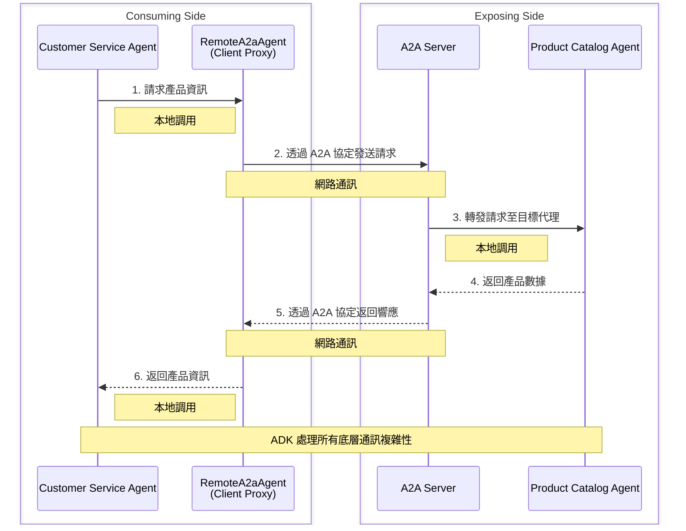

# A2A 簡介
🔔 `更新日期：2026-01-15`

當你建立更複雜的代理系統時，你會發現單一代理通常是不夠的。你會想要建立專門的代理，以便協作解決問題。[**Agent2Agent (A2A) 協定**](https://a2a-protocol.org) 是允許這些代理彼此通訊的標準。

## 何時使用 A2A 與本地子代理 (Local Sub-Agents)

- **本地子代理 (Local Sub-Agents)：** 這些是在 *與主代理相同的應用程式進程內* 運行的代理。它們就像內部模組或函式庫，用於將你的程式碼組織成邏輯、可重用的組件。主代理與其本地子代理之間的通訊非常快，因為它是直接在記憶體中進行，沒有網路開銷。

- **遠端代理 (Remote Agents, A2A)：** 這些是作為獨立服務運行的獨立代理，透過網路進行通訊。A2A 定義了這種通訊的標準協定。

在以下情況考慮使用 **A2A**：

- 你需要與之對話的代理是一個 **獨立的、單機服務** (例如，專門的財務建模代理)。
- 代理是由 **不同的團隊或組織** 維護。
- 你需要連接使用 **不同程式語言或代理框架** 編寫的代理。
- 你想在系統組件之間強制執行 **強大、正式的合約** (A2A 協定)。

### 何時使用 A2A：具體範例

- **與第三方服務整合：** 你的主代理需要從外部金融數據提供者獲取即時股票價格。該提供者透過支援 A2A 的代理公開其數據。
- **微服務架構：** 你有一個分解為更小、獨立服務的大型系統 (例如，訂單處理代理、庫存管理代理、貨運代理)。A2A 是這些服務跨網路邊界相互通訊的理想選擇。
- **跨語言通訊：** 你的核心業務邏輯是用 Python 代理編寫的，但你有一個用 Java 編寫的舊系統或專門組件，你想將其作為代理整合。A2A 提供了標準化的通訊層。
- **正式 API 強制執行：** 你正在構建一個平台，不同的團隊在其中貢獻代理，你需要一個嚴格的合約來規範這些代理如何互動，以確保相容性和穩定性。

### 何時不應使用 A2A：具體範例 (優先選擇本地子代理)

- **內部程式碼組織：** 你正在將單一代理中的複雜任務分解為較小的、易於管理的函式或模組 (例如，在處理之前清理輸入數據的 `DataValidator` 子代理)。出於性能和簡單性考慮，這些最好作為本地子代理處理。
- **性能關鍵型內部操作：** 子代理負責與主代理的執行緊密耦合的高頻、低延遲操作 (例如，在同一應用程式內處理數據流的 `RealTimeAnalytics` 子代理)。
- **共享記憶體/內容 (Context)：** 當子代理需要直接存取主代理的內部狀態或共享記憶體以提高效率時，A2A 的網路開銷和序列化/反序列化會適得其反。
- **簡單的輔助函式：** 對於不需要獨立部署或複雜狀態管理的小型、可重用邏輯片段，在同一代理中使用簡單的函式或類別更為合適，而不是單獨的 A2A 代理。

### 表格整理

#### A2A vs 本地子代理對比表

| 類型 | 定義 | 通訊方式 | 部署方式 |
|------|------|----------|----------|
| **本地子代理** | 在與主代理相同的應用程式進程內運行的代理 | 記憶體直接通訊，無網路開銷 | 內部模組或函式庫 |
| **遠端代理 (A2A)** | 作為獨立服務運行的獨立代理 | 透過網路通訊，使用 A2A 協定 | 獨立的單機服務 |

#### 何時使用 A2A：使用情境

| 使用情境 | 說明 | 範例 |
|----------|------|------|
| **獨立服務** | 代理是獨立的、單機服務 | 專門的財務建模代理 |
| **跨團隊協作** | 代理由不同團隊或組織維護 | - |
| **跨語言整合** | 需要連接不同程式語言或代理框架 | Python 主代理整合 Java 舊系統 |
| **正式合約** | 需要強制執行強大、正式的合約 | 多團隊貢獻代理的平台 |
| **第三方整合** | 與外部服務整合 | 從外部金融數據提供者獲取即時股票價格 |
| **微服務架構** | 大型系統分解為獨立服務 | 訂單處理、庫存管理、貨運代理 |

#### 何時使用本地子代理：使用情境

| 使用情境 | 說明 | 範例 |
|----------|------|------|
| **內部程式碼組織** | 將複雜任務分解為較小函式或模組 | `DataValidator` 子代理清理輸入數據 |
| **性能關鍵操作** | 高頻、低延遲的內部操作 | `RealTimeAnalytics` 子代理處理數據流 |
| **共享記憶體** | 需要直接存取主代理的內部狀態 | 避免 A2A 的網路開銷和序列化 |
| **簡單輔助函式** | 小型、可重用邏輯片段 | 不需要獨立部署的函式或類別 |

這樣的表格格式能更清楚地對比兩種方式的差異和適用場景。

## ADK 中的 A2A 工作流程：簡化檢視

代理開發套件 (ADK) 簡化了使用 A2A 協定建立和連接代理的過程。以下是其運作方式的直接分解：

1. **使代理可存取 (公開)：** 你從現有的 ADK 代理開始，你希望其他代理能夠與之互動。ADK 提供了一種簡單的方法來「公開」此代理，將其轉變為 **A2AServer**。此伺服器充當公共介面，允許其他代理透過網路向你的代理發送請求。這就像為你的代理設置一個 Web 伺服器。

2. **連接到可存取的代理 (使用)：** 在一個單獨的代理中 (可以運行在同一台機器或不同的機器上)，你將使用名為 `RemoteA2aAgent` 的特殊 ADK 組件。這個 `RemoteA2aAgent` 充當客戶端，知道如何與你之前公開的 **A2AServer** 通訊。它在幕後處理網路通訊、身份驗證和數據格式的所有複雜性。

從你作為開發者的角度來看，一旦設置好這種連接，與遠端代理的互動就感覺像與本地工具或函式互動一樣。ADK 抽象化了網路層，使分散式代理系統像本地系統一樣易於使用。

## 視覺化 A2A 工作流程

為了進一步釐清 A2A 工作流程，讓我們看看公開和使用代理的「之前和之後」，以及組合後的系統。

### 公開代理 (Exposing an Agent)

**公開前 (Before Exposing)：**
你的代理程式碼作為獨立組件運行，但在這種情況下，你希望公開它，以便其他遠端代理可以與你的代理進行互動。

```text
+-------------------+
| Your Agent Code   |
|   (Standalone)    |
+-------------------+
```

**公開後 (After Exposing)：**
你的代理程式碼與 `A2AServer` (ADK 組件) 整合，使其可以透過網路供其他遠端代理存取。

```text
+-----------------+
|   A2A Server    |
| (ADK Component) |<--------+
+-----------------+         |
        |                   |
        v                   |
+-------------------+       |
| Your Agent Code   |       |
| (Now Accessible)  |       |
+-------------------+       |
                            |
                            | (Network Communication)
                            v
+-----------------------------+
|       Remote Agent(s)       |
|    (Can now communicate)    |
+-----------------------------+
```

### 使用代理 (Consuming an Agent)

**使用前：**
你的代理 (在此內容中稱為「根代理」(Root Agent)) 是你正在開發的應用程式，需要與遠端代理進行互動。在開始使用之前，它缺乏直接的機制來執行此操作。

```text
+----------------------+         +-------------------------------------------------------------+
|      Root Agent      |         |                        Remote Agent                         |
| (Your existing code) |         | (External Service that you want your Root Agent to talk to) |
+----------------------+         +-------------------------------------------------------------+
```

**使用後：**
你的根代理使用 `RemoteA2aAgent` (一個 ADK 組件，充當遠端代理的客戶端代理程式 (Proxy)) 來建立與遠端代理的通訊。

```text
+----------------------+         +-----------------------------------+
|      Root Agent      |         |         RemoteA2aAgent            |
| (Your existing code) |<------->|         (ADK Client Proxy)        |
+----------------------+         |                                   |
                                 |  +-----------------------------+  |
                                 |  |         Remote Agent        |  |
                                 |  |      (External Service)     |  |
                                 |  +-----------------------------+  |
                                 +-----------------------------------+
      (Now talks to remote agent via RemoteA2aAgent)
```

### 最終系統 (組合圖)

此圖顯示了使用端和公開端如何連接以形成完整的 A2A 系統。

```text
Consuming Side:
+----------------------+         +-----------------------------------+
|      Root Agent      |         |         RemoteA2aAgent            |
| (Your existing code) |<------->|         (ADK Client Proxy)        |
+----------------------+         |                                   |
                                 |  +-----------------------------+  |
                                 |  |         Remote Agent        |  |
                                 |  |      (External Service)     |  |
                                 |  +-----------------------------+  |
                                 +-----------------------------------+
                                                 |
                                                 | (Network Communication)
                                                 v
Exposing Side:
                                               +-----------------+
                                               |   A2A Server    |
                                               | (ADK Component) |
                                               +-----------------+
                                                       |
                                                       v
                                               +-------------------+
                                               | Your Agent Code   |
                                               | (Exposed Service) |
                                               +-------------------+
```

## 具體案例：客戶服務代理與產品目錄代理

讓我們考慮一個實際範例：一個 **客戶服務代理** 需要從一個單獨的 **產品目錄代理** 檢索產品資訊。

### A2A 之前

最初，你的客戶服務代理可能沒有直接、標準化的方式來查詢產品目錄代理，特別是如果它是一個單獨的服務或由不同的團隊管理。

```text
+-------------------------+         +--------------------------+
| Customer Service Agent  |         |  Product Catalog Agent   |
| (Needs Product Info)    |         | (Contains Product Data)  |
+-------------------------+         +--------------------------+
      (No direct, standardized communication)
```

### A2A 之後

透過使用 A2A 協定，產品目錄代理可以將其功能公開為 A2A 服務。然後，你的客戶服務代理可以使用 ADK 的 `RemoteA2aAgent` 輕鬆使用此服務。

```text
+-------------------------+         +-----------------------------------+
| Customer Service Agent  |         |         RemoteA2aAgent            |
| (Your Root Agent)       |<------->|         (ADK Client Proxy)        |
+-------------------------+         |                                   |
                                    |  +-----------------------------+  |
                                    |  |     Product Catalog Agent   |  |
                                    |  |      (External Service)     |  |
                                    |  +-----------------------------+  |
                                    +-----------------------------------+
                                                 |
                                                 | (Network Communication)
                                                 v
                                               +-----------------+
                                               |   A2A Server    |
                                               | (ADK Component) |
                                               +-----------------+
                                                       |
                                                       v
                                               +------------------------+
                                               | Product Catalog Agent  |
                                               | (Exposed Service)      |
                                               +------------------------+
```

在此設定中，首先，產品目錄代理需要透過 A2A Server 公開。然後，客戶服務代理只需像使用工具一樣呼叫 `RemoteA2aAgent` 上的方法，ADK 就會處理所有與產品目錄代理的底層通訊。這實現了關注點的分離，並便於專門代理的整合。

### 整合時序圖


在此設定中，首先，產品目錄代理需要透過 A2A Server 公開。然後，客戶服務代理只需像使用工具一樣呼叫 `RemoteA2aAgent` 上的方法，ADK 就會處理所有與產品目錄代理的底層通訊。這實現了關注點的分離，並便於專門代理的整合。

## 下一步

現在你已經了解了 A2A 的「原因」，讓我們深入了解「如何執行」。

- **繼續閱讀下一篇指南：**
  [快速入門：公開你的代理](./a2a-quickstart%20(exposing)/quickstart-exposing.md)
