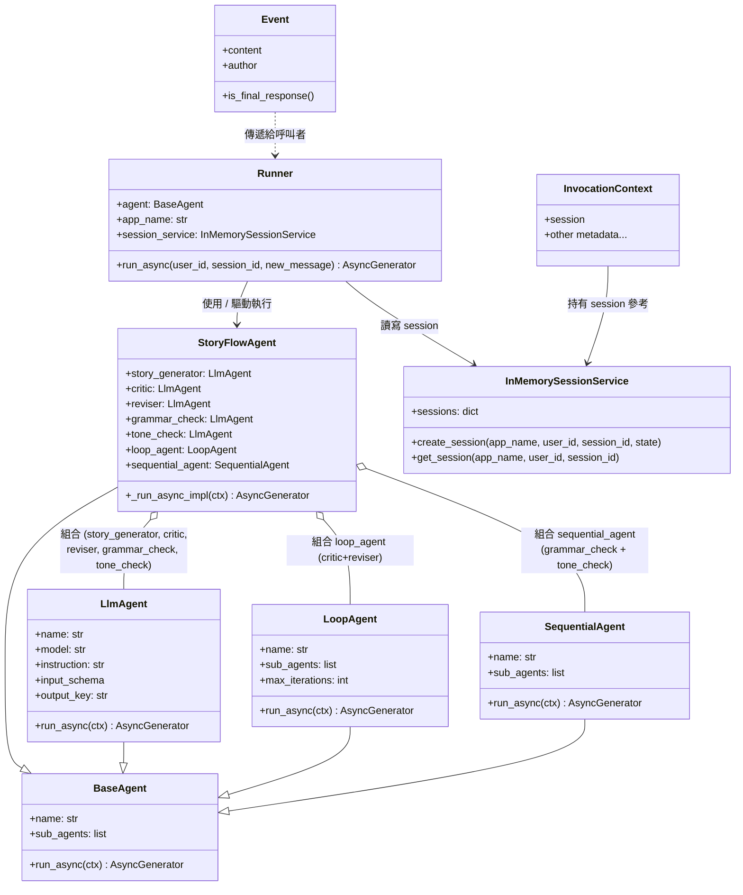
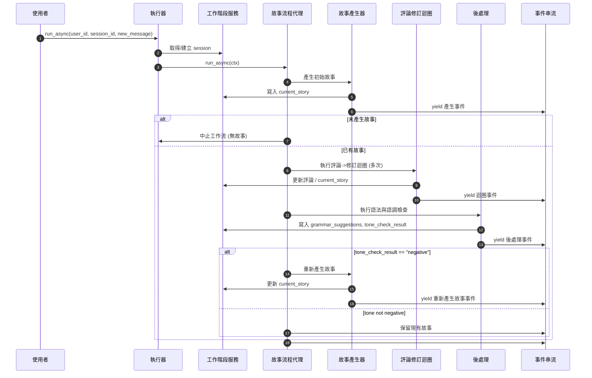

# 恢復停止的代理 (Resume stopped agents)

🔔 `更新日期：2026 年 1 月 22 日`

[`ADK 支援`: `Python v1.14.0`]

ADK 代理的執行可能會因為各種因素而中斷，包括網路連接斷開、電源故障或所需的外部系統離線。ADK 的恢復 (Resume) 功能允許代理工作流從上次中斷的地方繼續執行，從而避免需要重新啟動整個工作流。在 ADK Python 1.16 及更高版本中，您可以將 ADK 工作流配置為可恢復，以便它追蹤工作流的執行，並允許您在意外中斷後恢復執行。

本指南說明如何將您的 ADK 代理工作流配置為可恢復。如果您使用自訂代理 (Custom Agents)，您可以將其更新為可恢復。欲了解更多資訊，請參閱[自訂代理新增恢復功能](./resume.md#為自訂代理新增恢復功能-add-resume-to-custom-agents)。

## 新增可恢復配置 (Add resumable configuration)

透過將 `Resumability` 配置應用於 ADK 工作流的 `App` 物件來啟用代理工作流的恢復功能，如下列程式碼範例所示：

```python
app = App(
    name='my_resumable_agent',
    root_agent=root_agent,
    # 設定可恢復性配置以啟用恢復功能。
    resumability_config=ResumabilityConfig(
        is_resumable=True,
    ),
)
```

> [!WARNING] 注意：長時間運行的函數、確認、身分驗證 (Caution: Long Running Functions, Confirmations, Authentication)
對於使用[長時間運行函數 (Long Running Functions)](../custom-tools/function-tools/overview.md#長時間執行功能工具-long-running-function-tools)、[確認 (Confirmations)](../custom-tools/function-tools/confirmation.md) 或需要使用者輸入的[身分驗證 (Authentication)](../custom-tools/authentication.md) 的代理，新增可恢復確認會改變這些功能的運作方式。欲了解更多資訊，請參閱這些功能的說明文件。

> [!NOTE] 附註：自訂代理 (Note: Custom Agents)
自訂代理預設不支援恢復功能。您必須更新自訂代理的程式碼以支援恢復功能。有關修改自訂代理以支援增量恢復功能的資訊，請參閱[為自訂代理新增恢復功能](../agent-runtime/resume.md#新增可恢復配置-add-resumable-configuration)。

## 恢復停止的工作流 (Resume a stopped workflow)

當 ADK 工作流停止執行時，您可以使用包含工作流實例調用 ID (Invocation ID) 的命令來恢復工作流，該 ID 可以在工作流的[事件 (Event)](https://google.github.io/adk-docs/events/#understanding-and-using-events) 歷史記錄中找到。請確保 ADK API 伺服器正在運行（以防它被中斷或關閉），然後運行下列命令來恢復工作流，如下列 API 請求範例所示。

```shell
# 如果需要，重新啟動 API 伺服器：
adk api_server my_resumable_agent/

# 恢復代理：
curl -X POST http://localhost:8000/run_sse \
 -H "Content-Type: application/json" \
 -d '{
        "app_name": "my_resumable_agent",
        "user_id": "u_123",
        "session_id": "s_abc",
        "invocation_id": "invocation-123",
    }'
```

您也可以使用 Runner 物件的 Run Async 方法來恢復工作流，如下所示：

```python
# 使用指定的 user_id, session_id 和 invocation_id 非同步執行工作流以恢復執行
runner.run_async(user_id='u_123', session_id='s_abc',
    invocation_id='invocation-123')

# 當 new_message 被設定為函數回應時，
# 我們正嘗試恢復一個長時間運行的函數。
```

> [!NOTE] 附註 (Note)
目前不支援從 ADK Web 使用者介面或使用 ADK 命令列 (CLI) 工具恢復工作流。

## 運作原理 (How it works)

恢復功能透過記錄已完成的代理工作流任務來運作，包括使用[事件 (Events)](https://google.github.io/adk-docs/events/) 和[事件動作 (Event Actions)](https://google.github.io/adk-docs/events/#detecting-actions-and-side-effects) 的增量步驟。追蹤可恢復工作流中代理任務的完成情況。如果工作流被中斷並隨後重新啟動，系統會透過設定每個代理的完成狀態來恢復工作流。如果某個代理未完成，工作流系統將恢復該代理任何已完成的事件，並從部分完成的狀態重新啟動工作流。對於多代理工作流，具體的恢復行為取決於工作流中的多代理類別，如下所述：

-   **順序代理 (Sequential Agent)**：從其保存的狀態中讀取 `current_sub_agent`，以找到序列中下一個要運行的子代理。
-   **迴圈代理 (Loop Agent)**：使用 `current_sub_agent` 和 `times_looped` 的值從上次完成的迭代和子代理繼續迴圈。
-   **並行代理 (Parallel Agent)**：確定哪些子代理已經完成，並僅運行那些尚未完成的子代理。

事件記錄包括成功返回結果的工具 (Tools) 結果。因此，如果代理成功執行了功能工具 A 和 B，然後在執行工具 C 期間失敗，系統會恢復工具 A 和 B 的結果，並透過重新執行工具 C 請求來恢復工作流。

> [!WARNING] 注意：工具執行行為 (Caution: Tool execution behavior)
在恢復帶有工具的工作流時，恢復功能可確保代理中的工具***至少運行一次***，並且在恢復工作流時可能會運行多次。如果您的代理使用的工具中重複運行會產生負面影響（例如購買），則應修改該工具以檢查並防止重複運行。

> [!NOTE] 附註：不支援在恢復時修改工作流 (Note: Workflow modification with Resume not supported)
在恢復停止的代理工作流之前，請勿對其進行修改。例如，不支援在工作流停止後向其新增或從中移除代理，然後恢復該工作流。

## 為自訂代理新增恢復功能 (Add resume to custom Agents)

自訂代理有特定的實作要求，以支援可恢復性。您必須在自訂代理中決定並定義工作流步驟，這些步驟會產生一個結果，該結果可以在移交到下一個處理步驟之前被保留。以下步驟概述了如何修改自訂代理以支援工作流恢復。

-   **建立 CustomAgentState 類別**：擴充 `BaseAgentState` 以建立一個保留代理狀態的物件。
    -   **（選用）建立 WorkFlowStep 類別**：如果您的自訂代理具有順序步驟，請考慮建立一個 `WorkFlowStep` 列表物件，用於定義代理的離散、可保存步驟。
-   **新增初始代理狀態**：修改代理的非同步運行函數 (`async run`) 以設定代理的初始狀態。
-   **新增代理狀態檢查點**：修改代理的非同步運行函數，以為代理整體任務的每個已完成步驟生成並保存代理狀態。
-   **新增代理結束狀態以追蹤代理狀態**：修改代理的非同步運行函數，以便在成功完成代理的全部任務時包含 `end_of_agent=True` 狀態。

下列範例顯示了對[自訂代理 (Custom Agents)](../agents/custom-agents.md#完整範例程式碼) 指南中所示的 `StoryFlowAgent` 類別範例所需的程式碼修改：

```python
class WorkflowStep(int, Enum):
 # 定義工作流的各個階段
 INITIAL_STORY_GENERATION = 1 # 初始故事生成
 CRITIC_REVISER_LOOP = 2      # 評論與修訂迴圈
 POST_PROCESSING = 3          # 後處理
 CONDITIONAL_REGENERATION = 4 # 條件式重新生成

# 擴充 BaseAgentState

### class StoryFlowAgentState(BaseAgentState):

###   step = WorkflowStep

@override
async def _run_async_impl(
    self, ctx: InvocationContext
) -> AsyncGenerator[Event, None]:
    """
    實作故事工作流的自訂編排邏輯。
    使用 Pydantic 指派的實例屬性（例如 self.story_generator）。
    """
    # 載入代理狀態
    agent_state = self._load_agent_state(ctx, WorkflowStep)

    if agent_state is None:
      # 記錄代理的開始
      agent_state = StoryFlowAgentState(step=WorkflowStep.INITIAL_STORY_GENERATION)
      yield self._create_agent_state_event(ctx, agent_state)

    next_step = agent_state.step
    logger.info(f"[{self.name}] Starting story generation workflow.")

    # 步驟 1. 初始故事生成
    if next_step <= WorkflowStep.INITIAL_STORY_GENERATION:
      logger.info(f"[{self.name}] Running StoryGenerator...")
      async for event in self.story_generator.run_async(ctx):
          yield event

      # 檢查在繼續之前是否已生成故事
      if "current_story" not in ctx.session.state or not ctx.session.state[
          "current_story"
      ]:
          return  # 如果初始故事失敗，則停止處理

    # 更新狀態至評論與修訂迴圈
    agent_state = StoryFlowAgentState(step=WorkflowStep.CRITIC_REVISER_LOOP)
    yield self._create_agent_state_event(ctx, agent_state)

    # 步驟 2. 評論與修訂迴圈
    if next_step <= WorkflowStep.CRITIC_REVISER_LOOP:
      logger.info(f"[{self.name}] Running CriticReviserLoop...")
      async for event in self.loop_agent.run_async(ctx):
          logger.info(
              f"[{self.name}] Event from CriticReviserLoop: "
              f"{event.model_dump_json(indent=2, exclude_none=True)}"
          )
          yield event

    # 更新狀態至後處理
    agent_state = StoryFlowAgentState(step=WorkflowStep.POST_PROCESSING)
    yield self._create_agent_state_event(ctx, agent_state)

    # 步驟 3. 順序後處理（語法和語調檢查）
    if next_step <= WorkflowStep.POST_PROCESSING:
      logger.info(f"[{self.name}] Running PostProcessing...")
      async for event in self.sequential_agent.run_async(ctx):
          logger.info(
              f"[{self.name}] Event from PostProcessing: "
              f"{event.model_dump_json(indent=2, exclude_none=True)}"
          )
          yield event

    # 更新狀態至條件式重新生成
    agent_state = StoryFlowAgentState(step=WorkflowStep.CONDITIONAL_REGENERATION)
    yield self._create_agent_state_event(ctx, agent_state)

    # 步驟 4. 基於語調的條件邏輯
    if next_step <= WorkflowStep.CONDITIONAL_REGENERATION:
      tone_check_result = ctx.session.state.get("tone_check_result")
      if tone_check_result == "negative":
          logger.info(f"[{self.name}] Tone is negative. Regenerating story...")
          async for event in self.story_generator.run_async(ctx):
              logger.info(
                  f"[{self.name}] Event from StoryGenerator (Regen): "
                  f"{event.model_dump_json(indent=2, exclude_none=True)}"
              )
              yield event
      else:
          logger.info(f"[{self.name}] Tone is not negative. Keeping current story.")

    logger.info(f"[{self.name}] Workflow finished.")
    # 傳回代理結束事件
    yield self._create_agent_state_event(ctx, end_of_agent=True)
```

---

## 更多說明

### StoryFlowAgent 完整類別圖


### StoryFlowAgent 流程時序圖
