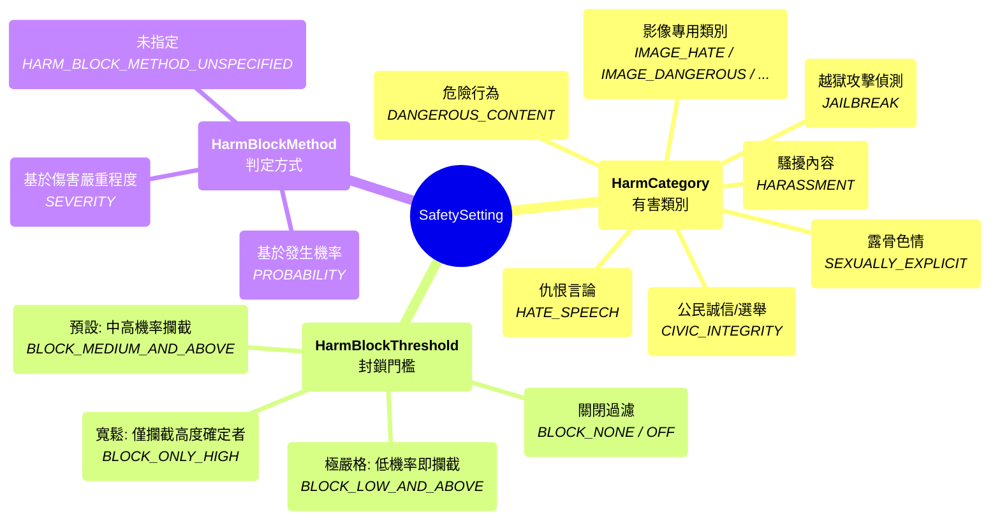

# LLM Agent
🔔 `更新日期：2026-01-14`

[`ADK 支援`: `Python v0.1.0` | `Typescript v0.2.0` | `Go v0.1.0` | `Java v0.1.0`]

`LlmAgent`（通常簡稱為 `Agent`）是 ADK 中的核心組件，充當應用程式中「思考」的部分。它利用大型語言模型 (LLM) 的力量進行推理、理解自然語言、做出決策、生成回應以及與工具進行互動。

與遵循預定義執行路徑的確定性 [Workflow Agents](workflow-agents/index.md) 不同，`LlmAgent` 的行為是非確定性的。它使用 LLM 來解釋指令和上下文，動態決定如何進行、使用哪些工具（如果有的話），或者是否將控制權轉移給另一個代理程式。

構建一個有效的 `LlmAgent` 涉及定義其身份、透過指令清楚地引導其行為，並為其配備必要的工具和能力。

## 定義代理程式的身份與目的

首先，你需要確立代理程式「是什麼」以及它是「為了什麼」。

* **`name` (必填):** 每個代理程式都需要一個唯一的字串識別碼。這個 `name` 對於內部操作至關重要，特別是在多代理程式系統中，代理程式需要相互引用或委派任務。選擇一個反映代理程式功能的描述性名稱（例如 `customer_support_router`、`billing_inquiry_agent`）。避免使用像 `user` 這樣的保留名稱。

* **`description` (選填，建議用於多代理程式):** 提供代理程式能力的簡要摘要。此描述主要由 *其他* LLM 代理程式用來判斷是否應將任務路由給此代理程式。使其足夠具體以區別於同儕（例如「處理有關當前帳單明細的查詢」，而不僅僅是「帳單代理程式」）。

* **`model` (必填):** 指定將驅動此代理程式推理的底層 LLM。這是一個字串識別碼，例如 `"gemini-2.5-flash"`。模型的選擇會影響代理程式的能力、成本和效能。請參閱 [Models](models.md) 頁面以了解可用的選項和考慮因素。

<details>
<summary>範例說明</summary>

> Python

```python
# 範例：定義基本身份
capital_agent = LlmAgent(
    model="gemini-2.5-flash",
    name="capital_agent",
    description="回答使用者關於給定國家首都的問題。"
    # 接下來將添加指令和工具
)
```

> Typescript

```typescript
// 範例：定義基本身份
const capitalAgent = new LlmAgent({
    model: 'gemini-2.5-flash',
    name: 'capital_agent',
    description: '回答使用者關於給定國家首都的問題。',
    // 接下來將添加指令和工具
});
```

> Go

```go
// 範例：定義基本身份
agent, err := llmagent.New(llmagent.Config{
    Name:        "capital_agent",
    Model:       model,
    Description: "回答使用者關於給定國家首都的問題。",
    // 接下來將添加指令和工具
})
```

> Java

```java
// 範例：定義基本身份
LlmAgent capitalAgent =
    LlmAgent.builder()
        .model("gemini-2.5-flash")
        .name("capital_agent")
        .description("回答使用者關於給定國家首都的問題。")
        // 接下來將添加指令和工具
        .build();
```

</details>

## 引導代理程式：指令 (`instruction`)

`instruction` 參數可以說是塑造 `LlmAgent` 行為最關鍵的參數。它是一個字串（或返回字串的函式），告訴代理程式：

* 它的核心任務或目標。
* 它的個性或角色（例如，「你是一個樂於助人的助手」、「你是一個幽默的海盜」）。
* 對其行為的約束（例如，「僅回答關於 X 的問題」、「永遠不要透露 Y」）。
* 如何以及何時使用其 `tools`。你應該解釋每個工具的目的以及應呼叫它的情況，補充工具本身內部的任何描述。
* 其輸出的理想格式（例如，「以 JSON 格式回應」、「提供列點清單」）。

**有效指令的提示：**

* **清晰且具體：** 避免模稜兩可。清楚陳述期望的操作和結果。
* **使用 Markdown：** 使用標題、列表等提高複雜指令的可讀性。
* **提供範例 (Few-Shot)：** 對於複雜任務或特定輸出格式，直接在指令中包含範例。
* **引導工具使用：** 不要只是列出工具；解釋代理程式 *何時* 以及 *為什麼* 應該使用它們。

**狀態 (State)：**

* 指令是一個字串範本，你可以使用 `{var}` 語法將動態值插入到指令中。
* `{var}` 用於插入名為 var 的狀態變數的值。
* `{artifact.var}` 用於插入名為 var 的成品 (artifact) 的文字內容。
* 如果狀態變數或成品不存在，代理程式將引發錯誤。如果你想忽略該錯誤，可以在變數名稱後附加 `?`，例如 `{var?}`。

<details>
<summary>範例說明</summary>

> Python

```python
# 範例：添加指令
capital_agent = LlmAgent(
    model="gemini-2.5-flash",
    name="capital_agent",
    description="回答使用者關於給定國家首都的問題。",
    instruction="""你是一個提供國家首都資訊的代理程式。
    當使用者詢問某個國家的首都時：
    1. 從使用者的查詢中識別國家名稱。
    2. 使用 `get_capital_city` 工具查找首都。
    3. 清楚地回應使用者，說明該首都城市。
    查詢範例："What's the capital of {country}?"
    回應範例："The capital of France is Paris."
    """,
    # 接下來將添加工具
)
```

> Typescript

```typescript
// 範例：添加指令
const capitalAgent = new LlmAgent({
    model: 'gemini-2.5-flash',
    name: 'capital_agent',
    description: '回答使用者關於給定國家首都的問題。',
    instruction: `你是一個提供國家首都資訊的代理程式。
        當使用者詢問某個國家的首都時：
        1. 從使用者的查詢中識別國家名稱。
        2. 使用 \`getCapitalCity\` 工具查找首都。
        3. 清楚地回應使用者，說明該首都城市。
        查詢範例："What's the capital of {country}?"
        回應範例："The capital of France is Paris."
        `,
    // 接下來將添加工具
});
```

> Go
>
```go
// 範例：添加指令
agent, err := llmagent.New(llmagent.Config{
    Name:        "capital_agent",
    Model:       model,
    Description: "回答使用者關於給定國家首都的問題。",
    Instruction: `你是一個提供國家首都資訊的代理程式。
    當使用者詢問某個國家的首都時：
    1. 從使用者的查詢中識別國家名稱。
    2. 使用 'get_capital_city' 工具查找首都。
    3. 清楚地回應使用者，說明該首都城市。
    查詢範例："What's the capital of {country}?"
    回應範例："The capital of France is Paris."`,
        // 接下來將添加工具
})
```

> Java

```java
// 範例：添加指令
LlmAgent capitalAgent =
    LlmAgent.builder()
        .model("gemini-2.5-flash")
        .name("capital_agent")
        .description("回答使用者關於給定國家首都的問題。")
        .instruction(
            """
            你是一個提供國家首都資訊的代理程式。
            當使用者詢問某個國家的首都時：
            1. 從使用者的查詢中識別國家名稱。
            2. 使用 `get_capital_city` 工具查找首都。
            3. 清楚地回應使用者，說明該首都城市。
            查詢範例："What's the capital of {country}?"
            回應範例："The capital of France is Paris."
            """)
        // 接下來將添加工具
        .build();
```

</details>

*(注意：對於適用於系統中 *所有* 代理程式的指令，請考慮在根代理程式上使用 `global_instruction`，詳情請參閱 [Multi-Agents](multi-agents.md) 章節。)*

## 為代理程式配備能力：工具 (`tools`)

工具賦予你的 `LlmAgent` 超越 LLM 內建知識或推理的能力。它們允許代理程式與外部世界互動、執行計算、獲取即時數據或執行特定操作。

* **`tools` (選填):** 提供代理程式可以使用的工具列表。列表中的每一項可以是：
    * 原生函式或方法（包裝為 `FunctionTool`）。Python ADK 會自動將原生函式包裝成 `FunctionTool`，而在 Java 中，你必須使用 `FunctionTool.create(...)` 明確包裝你的方法。
    * 繼承自 `BaseTool` 的類別實例。
    * 另一個代理程式的實例（`AgentTool`，實現代理程式對代理程式的委派 - 參見 [Multi-Agents](multi-agents.md)）。

LLM 根據對話及其指令，使用函式/工具名稱、描述（來自 docstring 或 `description` 欄位）以及參數架構 (schema) 來決定要呼叫哪個工具。

<details>
<summary>範例說明</summary>

> Python

```python
# 定義一個工具函式
def get_capital_city(country: str) -> str:
  """檢索給定國家的首都城市。"""
  # 替換為實際邏輯（例如 API 呼叫、資料庫查詢）
  capitals = {"france": "Paris", "japan": "Tokyo", "canada": "Ottawa"}
  return capitals.get(country.lower(), f"抱歉，我不知道 {country} 的首都。")

# 將工具添加到代理程式
capital_agent = LlmAgent(
    model="gemini-2.5-flash",
    name="capital_agent",
    description="回答使用者關於給定國家首都的問題。",
    instruction="""你是一個提供國家首都資訊的代理程式...（之前的指令文本）""",
    tools=[get_capital_city] # 直接提供函式
)
```

> Typescript

```typescript
import {z} from 'zod';
import { LlmAgent, FunctionTool } from '@google/adk';

// 定義工具輸入參數的結構 (schema)
const getCapitalCityParamsSchema = z.object({
    country: z.string().describe('要獲取首都的國家。'),
});

// 定義工具函式本身
async function getCapitalCity(params: z.infer<typeof getCapitalCityParamsSchema>): Promise<{ capitalCity: string }> {
    const capitals: Record<string, string> = {
        'france': 'Paris',
        'japan': 'Tokyo',
        'canada': 'Ottawa',
    };
    const result = capitals[params.country.toLowerCase()] ??
        `抱歉，我不知道 ${params.country} 的首都。`;
    return {capitalCity: result}; // 工具必須返回一個物件
}

// 建立 FunctionTool 的實例
const getCapitalCityTool = new FunctionTool({
    name: 'getCapitalCity',
    description: '檢索給定國家的首都城市。',
    parameters: getCapitalCityParamsSchema,
    execute: getCapitalCity,
});

// 將工具添加到代理程式
const capitalAgent = new LlmAgent({
    model: 'gemini-2.5-flash',
    name: 'capitalAgent',
    description: '回答使用者關於給定國家首都的問題。',
    instruction: '你是一個提供國家首都資訊的代理程式...', // 注意：為簡潔起見省略了完整指令
    tools: [getCapitalCityTool], // 在陣列中提供 FunctionTool 實例
});
```

> Go

```go
// 定義一個工具函式
type getCapitalCityArgs struct {
    Country string `json:"country" jsonschema:"要獲取首都的國家。"`
}
getCapitalCity := func(ctx tool.Context, args getCapitalCityArgs) (map[string]any, error) {
    // 替換為實際邏輯（例如 API 呼叫、資料庫查詢）
    capitals := map[string]string{"france": "Paris", "japan": "Tokyo", "canada": "Ottawa"}
    capital, ok := capitals[strings.ToLower(args.Country)]
    if !ok {
        return nil, fmt.Errorf("抱歉，我不知道 %s 的首都。", args.Country)
    }
    return map[string]any{"result": capital}, nil
}

// 將工具添加到代理程式
capitalTool, err := functiontool.New(
    functiontool.Config{
        Name:        "get_capital_city",
        Description: "檢索給定國家的首都城市。",
    },
    getCapitalCity,
)
if err != nil {
    log.Fatal(err)
}
agent, err := llmagent.New(llmagent.Config{
    Name:        "capital_agent",
    Model:       model,
    Description: "回答使用者關於給定國家首都的問題。",
    Instruction: "你是一個提供國家首都資訊的代理程式...（之前的指令文本）",
    Tools:       []tool.Tool{capitalTool},
})
```

> Java

```java

// 定義一個工具函式
// 檢索給定國家的首都城市。
public static Map<String, Object> getCapitalCity(
        @Schema(name = "country", description = "要獲取首都的國家")
        String country) {
  // 替換為實際邏輯（例如 API 呼叫、資料庫查詢）
  Map<String, String> countryCapitals = new HashMap<>();
  countryCapitals.put("canada", "Ottawa");
  countryCapitals.put("france", "Paris");
  countryCapitals.put("japan", "Tokyo");

  String result =
          countryCapitals.getOrDefault(
                  country.toLowerCase(), "抱歉，我找不到 " + country + " 的首都。");
  return Map.of("result", result); // 工具必須返回一個 Map
}

// 將工具添加到代理程式
FunctionTool capitalTool = FunctionTool.create(experiment.getClass(), "getCapitalCity");
LlmAgent capitalAgent =
    LlmAgent.builder()
        .model("gemini-2.5-flash")
        .name("capital_agent")
        .description("回答使用者關於給定國家首都的問題。")
        .instruction("你是一個提供國家首都資訊的代理程式...（之前的指令文本）")
        .tools(capitalTool) // 提供包裝為 FunctionTool 的函式
        .build();
```

</details>

在 [Tools](https://google.github.io/adk-docs/tools/) 章節了解更多關於工具的資訊。

## 進階配置與控制

除了核心參數外，`LlmAgent` 還提供了幾個用於精細控制的選項：

### 微調 LLM 生成 (`generate_content_config`)

你可以使用 `generate_content_config` 調整底層 LLM 如何生成回應。

* **`generate_content_config` (選填):** 傳遞一個 [`google.genai.types.GenerateContentConfig`](https://googleapis.github.io/python-genai/genai.html#genai.types.GenerateContentConfig) 實例來控制 `temperature`（隨機性）、`max_output_tokens`（回應長度）、`top_p`、`top_k` 和安全設置等參數。

* **`safety_settings` (選填):** 在 `GenerateContentConfig` 中，你可以指定一組 [`google.genai.types.SafetySetting`](https://googleapis.github.io/python-genai/genai.html#genai.types.SafetySetting) 來定義內容安全策略。例如，你可以設定代理程式阻止生成危險內容，更多補充可見：[`safety-settings-補充說明`](#safety-settings-補充說明)。

<details>
<summary>範例說明</summary>

> Python

```python
from google.genai import types

agent = LlmAgent(
    # ... 其他參數
    generate_content_config=types.GenerateContentConfig(
        temperature=0.2, # 更確定性的輸出
        max_output_tokens=250,
        safety_settings=[
            types.SafetySetting(
                category=types.HarmCategory.HARM_CATEGORY_DANGEROUS_CONTENT,
                threshold=types.HarmBlockThreshold.BLOCK_LOW_AND_ABOVE,
            )
        ]
    )
)
```

> Typescript

```typescript
import { GenerateContentConfig } from '@google/genai';

const generateContentConfig: GenerateContentConfig = {
    temperature: 0.2, // 更確定性的輸出
    maxOutputTokens: 250,
};

const agent = new LlmAgent({
    // ... 其他參數
    generateContentConfig,
});
```

> Go

```go
import "google.golang.org/genai"

temperature := float32(0.2)
agent, err := llmagent.New(llmagent.Config{
    Name:  "gen_config_agent",
    Model: model,
    GenerateContentConfig: &genai.GenerateContentConfig{
        Temperature:     &temperature,
        MaxOutputTokens: 250,
    },
})
```

> Java

```java
import com.google.genai.types.GenerateContentConfig;

LlmAgent agent =
    LlmAgent.builder()
        // ... 其他參數
        .generateContentConfig(GenerateContentConfig.builder()
            .temperature(0.2F) // 更確定性的輸出
            .maxOutputTokens(250)
            .build())
        .build();
```

</details>

### 結構化數據 (`input_schema`, `output_schema`, `output_key`)

對於需要與 `LLM Agent` 進行結構化數據交換的場景，ADK 提供了使用結構 (schema) 定義來定義預期輸入和期望輸出格式的機制。

* **`input_schema` (選填):** 定義代表預期輸入結構的架構。如果設置了此項，傳遞給此代理程式的使用者訊息內容 *必須* 是符合此架構的 JSON 字串。你的指令應相應地引導使用者或前一個代理程式。

* **`output_schema` (選填):** 定義代表期望輸出結構的架構。如果設置了此項，代理程式的最終回應 *必須* 是符合此架構的 JSON 字串。

* **`output_key` (選填):** 提供一個字串鍵。如果設置了此項，代理程式 *最終* 回應的文字內容將自動保存到工作階段 (session) 的狀態字典中該鍵之下。這對於在工作流中的代理程式或步驟之間傳遞結果非常有用。
    * 在 Python 中，這可能看起來像：`session.state[output_key] = agent_response_text`
    * 在 Java 中：`session.state().put(outputKey, agentResponseText)`
    * 在 Golang 中，在回呼處理常式內：`ctx.State().Set(output_key, agentResponseText)`

<details>
<summary>範例說明</summary>

> Python

輸入和輸出架構通常是一個 `Pydantic` 的 BaseModel。

```python
from pydantic import BaseModel, Field

class CapitalOutput(BaseModel):
    capital: str = Field(description="國家的首都。")

structured_capital_agent = LlmAgent(
    # ... name, model, description
    instruction="""你是一個首都資訊代理程式。給定一個國家，僅回應包含首都的 JSON 物件。格式：{"capital": "capital_name"}""",
    output_schema=CapitalOutput, # 強制要求 JSON 輸出
    output_key="found_capital"  # 將結果存儲在 state['found_capital'] 中
    # 在這裡無法有效地使用 tools=[get_capital_city]
)
```

> Typescript

```typescript
import {z} from 'zod';
import { Schema, Type } from '@google/genai';

// 定義輸出的結構 (schema)
const CapitalOutputSchema: Schema = {
    type: Type.OBJECT,
    properties: {
        capital: {
            type: Type.STRING,
            description: '國家的首都。',
        },
    },
    required: ['capital'],
};

// 建立 LlmAgent 實例
const structuredCapitalAgent = new LlmAgent({
    // ... name, model, description
    instruction: `你是一個首都資訊代理程式。給定一個國家，僅回應包含首都的 JSON 物件。格式：{"capital": "capital_name"}`,
    outputSchema: CapitalOutputSchema, // 強制要求 JSON 輸出
    outputKey: 'found_capital', // 將結果存儲在 state['found_capital'] 中
    // 在這裡無法有效地使用工具
});
```

> Go

輸入和輸出架構是一個 `google.genai.types.Schema` 物件。

```go
capitalOutput := &genai.Schema{
    Type:        genai.TypeObject,
    Description: "首都城市資訊的架構。",
    Properties: map[string]*genai.Schema{
        "capital": {
            Type:        genai.TypeString,
            Description: "國家的首都城市。",
        },
    },
}

agent, err := llmagent.New(llmagent.Config{
    Name:         "structured_capital_agent",
    Model:        model,
    Description:  "以結構化格式提供首都資訊。",
    Instruction:  `你是一個首都資訊代理程式。給定一個國家，僅回應包含首都的 JSON 物件。格式：{"capital": "capital_name"}`,
    OutputSchema: capitalOutput,
    OutputKey:    "found_capital",
    // 在這裡無法有效地使用工具 capitalTool
})
```

> Java

輸入和輸出架構是一個 `google.genai.types.Schema` 物件。

```java
private static final Schema CAPITAL_OUTPUT =
    Schema.builder()
        .type("OBJECT")
        .description("首都城市資訊的架構。")
        .properties(
            Map.of(
                "capital",
                Schema.builder()
                    .type("STRING")
                    .description("國家的首都城市。")
                    .build()))
        .build();

LlmAgent structuredCapitalAgent =
    LlmAgent.builder()
        // ... name, model, description
        .instruction(
                "你是一個首都資訊代理程式。給定一個國家，僅回應包含首都的 JSON 物件。格式：{\"capital\": \"capital_name\"}")
        .outputSchema(capitalOutput) // 強制要求 JSON 輸出
        .outputKey("found_capital") // 將結果存儲在 state.get("found_capital") 中
        // 在這裡無法有效地使用 tools(getCapitalCity)
        .build();
```

</details>

### 管理上下文 (`include_contents`)

控制代理程式是否接收之前的對話歷史。

* **`include_contents` (選填，預設值：`'default'`):** 決定 `contents` (歷史紀錄) 是否發送到 LLM。
    * `'default'`: 代理程式接收相關的對話歷史。
    * `'none'`: 代理程式不接收先前的 `contents`。它僅基於其當前指令和 *當前* 輪次中提供的任何輸入運行（適用於無狀態任務或強制執行特定上下文）。

<details>
<summary>範例說明</summary>

> Python

```python
stateless_agent = LlmAgent(
    # ... 其他參數
    include_contents='none'
)
```

> Typescript

```typescript
const statelessAgent = new LlmAgent({
    // ... 其他參數
    includeContents: 'none',
});
```

> Go

```go
import "google.golang.org/adk/agent/llmagent"

agent, err := llmagent.New(llmagent.Config{
    Name:            "stateless_agent",
    Model:           model,
    IncludeContents: llmagent.IncludeContentsNone,
})
```

> Java

```java
import com.google.adk.agents.LlmAgent.IncludeContents;

LlmAgent statelessAgent =
    LlmAgent.builder()
        // ... 其他參數
        .includeContents(IncludeContents.NONE)
        .build();
```

</details>

### 規劃器 (Planner)

[`ADK 支援`: `Python v0.1.0`]

**`planner` (選填):** 分配一個 `BasePlanner` 實例，以便在執行前實現多步推理和規劃。有兩種主要的規劃器：

* **`BuiltInPlanner`:** 利用模型的內建規劃能力（例如 Gemini 的思考功能）。詳情和範例請參閱 [Gemini Thinking](https://ai.google.dev/gemini-api/docs/thinking)。

    在這裡，`thinking_budget` 參數引導模型在生成回應時要使用的思考權杖 (token) 數量。`include_thoughts` 參數控制模型是否應在回應中包含其原始想法和內部推理過程。

    ```python
    from google.adk import Agent
    from google.adk.planners import BuiltInPlanner
    from google.genai import types

    # 建立具有內建規劃器的代理程式
    my_agent = Agent(
        model="gemini-2.5-flash",
        planner=BuiltInPlanner(
            thinking_config=types.ThinkingConfig(
                include_thoughts=True,
                thinking_budget=1024,
            )
        ),
        # ... 在這裡放置你的工具
    )
    ```

* **`PlanReActPlanner`:** 此規劃器指示模型在其輸出中遵循特定結構：首先建立計劃，然後執行操作（如呼叫工具），並為其步驟提供推理。*這對於沒有內建「思考」功能的模型特別有用*。

    ```python
    from google.adk import Agent
    from google.adk.planners import PlanReActPlanner

    # 建立具有 PlanReAct 規劃器的代理程式
    my_agent = Agent(
        model="gemini-2.5-flash",
        planner=PlanReActPlanner(),
        # ... 在這裡放置你的工具
    )
    ```

    代理程式的回應將遵循結構化格式：

    ```
    [user]: ai news
    [google_search_agent]: /*PLANNING*/
    1. 執行 Google 搜尋 "latest AI news" 以獲取與人工智慧相關的當前更新和標題。
    2. 綜合搜尋結果中的資訊，提供近期 AI 新聞的摘要。

    /*ACTION*/
    /*REASONING*/
    搜尋結果提供了近期 AI 新聞的全面概述，涵蓋了公司發展、研究突破和應用等各個方面。我有足夠的資訊來回答使用者的請求。

    /*FINAL_ANSWER*/
    這是近期 AI 新聞的摘要：
    ....
    ```

使用內建規劃器的範例：

```python
from dotenv import load_dotenv


import asyncio
import os

from google.genai import types
from google.adk.agents.llm_agent import LlmAgent
from google.adk.runners import Runner
from google.adk.sessions import InMemorySessionService
from google.adk.artifacts.in_memory_artifact_service import InMemoryArtifactService # 選填
from google.adk.planners import BasePlanner, BuiltInPlanner, PlanReActPlanner
from google.adk.models import LlmRequest

from google.genai.types import ThinkingConfig
from google.genai.types import GenerateContentConfig

import datetime
from zoneinfo import ZoneInfo

APP_NAME = "weather_app"
USER_ID = "1234"
SESSION_ID = "session1234"

# 獲取天氣資訊的工具函式
def get_weather(city: str) -> dict:
    """檢索指定城市的當前天氣報告。

    參數:
        city (str): 要檢索天氣報告的城市名稱。

    返回:
        dict: 狀態和結果或錯誤訊息。
    """
    if city.lower() == "new york":
        return {
            "status": "success",
            "report": (
                "紐約的天氣晴朗，氣溫為攝氏 25 度（華氏 77 度）。"
            ),
        }
    else:
        return {
            "status": "error",
            "error_message": f"無法取得 '{city}' 的天氣資訊。",
        }

# 獲取目前時間的工具函式
def get_current_time(city: str) -> dict:
    """返回指定城市的當前時間。

    參數:
        city (str): 要檢索當前時間的城市名稱。

    返回:
        dict: 狀態和結果或錯誤訊息。
    """

    if city.lower() == "new york":
        tz_identifier = "America/New_York"
    else:
        return {
            "status": "error",
            "error_message": (
                f"抱歉，我沒有 {city} 的時區資訊。"
            ),
        }

    tz = ZoneInfo(tz_identifier)
    now = datetime.datetime.now(tz)
    report = (
        f'{city} 的當前時間是 {now.strftime("%Y-%m-%d %H:%M:%S %Z%z")}'
    )
    return {"status": "success", "report": report}

# 步驟 1：建立 ThinkingConfig
thinking_config = ThinkingConfig(
    include_thoughts=True,   # 要求模型在回應中包含其想法
    thinking_budget=256      # 將「思考」限制為 256 個權杖（根據需要調整）
)
print("ThinkingConfig:", thinking_config)

# 步驟 2：實例化 BuiltInPlanner
planner = BuiltInPlanner(
    thinking_config=thinking_config
)
print("BuiltInPlanner created.")

# 步驟 3：將規劃器包裝在 LlmAgent 中
agent = LlmAgent(
    model="gemini-2.5-pro-preview-03-25",  # 設置你的模型名稱
    name="weather_and_time_agent",
    instruction="你是一個返回時間和天氣的代理程式",
    planner=planner,
    tools=[get_weather, get_current_time]
)

# 工作階段與執行器 (Session and Runner)
session_service = InMemorySessionService()
session = session_service.create_session(app_name=APP_NAME, user_id=USER_ID, session_id=SESSION_ID)
runner = Runner(agent=agent, app_name=APP_NAME, session_service=session_service)

# 代理程式互動
def call_agent(query):
    content = types.Content(role='user', parts=[types.Part(text=query)])
    events = runner.run(user_id=USER_ID, session_id=SESSION_ID, new_message=content)

    for event in events:
        print(f"\nDEBUG EVENT: {event}\n")
        if event.is_final_response() and event.content:
            final_answer = event.content.parts[0].text.strip()
            print("\n🟢 FINAL ANSWER\n", final_answer, "\n")

# 呼叫代理程式進行測試
call_agent("如果現在紐約在下雨，現在的溫度是多少？")

```

### 程式碼執行 (Code Execution)

[`ADK 支援`: `Python v0.1.0` | `Java v0.1.0`]

- **`code_executor` (選填):** 提供一個 `BaseCodeExecutor` 實例，允許代理程式執行在 LLM 回應中找到的程式碼區塊。如需更多資訊，請參閱 [使用 Gemini API 進行程式碼執行](https://google.github.io/adk-docs/tools/gemini-api/code-execution/)。

<details>
<summary>範例說明</summary>

> Python

```python
# 程式碼執行範例：Python 計算代理程式
import asyncio
from google.adk.agents import LlmAgent
from google.adk.runners import Runner
from google.adk.sessions import InMemorySessionService
from google.adk.code_executors import BuiltInCodeExecutor
from google.genai import types

AGENT_NAME = "calculator_agent"
APP_NAME = "calculator"
USER_ID = "user1234"
SESSION_ID = "session_code_exec_async"
GEMINI_MODEL = "gemini-2.0-flash"

# 代理程式定義
code_agent = LlmAgent(
    name=AGENT_NAME,
    model=GEMINI_MODEL,
    code_executor=BuiltInCodeExecutor(),
    instruction="""你是一個計算器代理程式。
    當收到數學表達式時，請撰寫並執行 Python 程式碼以計算結果。
    僅以純文字回傳最終數值結果，不要使用 markdown 或程式碼區塊。
    """,
    description="執行 Python 程式碼以進行計算。",
)

# 工作階段與 Runner
session_service = InMemorySessionService()
session = asyncio.run(session_service.create_session(
    app_name=APP_NAME, user_id=USER_ID, session_id=SESSION_ID
))
runner = Runner(agent=code_agent, app_name=APP_NAME,
                session_service=session_service)

# 代理程式互動（非同步）
async def call_agent_async(query):
    content = types.Content(role="user", parts=[types.Part(text=query)])
    print(f"\n--- 執行查詢: {query} ---")
    final_response_text = "未取得最終文字回應。"
    try:
        # 使用 run_async
        async for event in runner.run_async(
            user_id=USER_ID, session_id=SESSION_ID, new_message=content
        ):
            print(f"事件 ID: {event.id}, 作者: {event.author}")

            # --- 優先檢查特定內容 ---
            has_specific_part = False
            if event.content and event.content.parts:
                for part in event.content.parts:  # 逐一檢查所有 parts
                    if part.executable_code:
                        # 取得實際程式碼字串
                        print(
                            f"  除錯：代理程式產生程式碼：\n```python\n{part.executable_code.code}\n```"
                        )
                        has_specific_part = True
                    elif part.code_execution_result:
                        # 正確取得執行結果與輸出
                        print(
                            f"  除錯：程式碼執行結果: {part.code_execution_result.outcome} - 輸出:\n{part.code_execution_result.output}"
                        )
                        has_specific_part = True
                    # 額外印出任何文字內容以利除錯
                    elif part.text and not part.text.isspace():
                        print(f"  文字: '{part.text.strip()}'")
                        # 不在此設 has_specific_part=True，保留最終回應邏輯

            # --- 最後檢查是否為最終回應 ---
            # 僅在未有上述特定內容時才視為最終回應
            if not has_specific_part and event.is_final_response():
                if (
                    event.content
                    and event.content.parts
                    and event.content.parts[0].text
                ):
                    final_response_text = event.content.parts[0].text.strip()
                    print(f"==> 最終代理程式回應: {final_response_text}")
                else:
                    print(
                        "==> 最終代理程式回應: [最終事件無文字內容]")

    except Exception as e:
        print(f"代理程式執行錯誤: {e}")
    print("-" * 30)


# 主非同步函式執行範例
async def main():
    await call_agent_async("計算 (5 + 7) * 3 的值")
    await call_agent_async("10 的階乘是多少？")


# 執行主函式
try:
    asyncio.run(main())
except RuntimeError as e:
    # 處理在已運行事件迴圈（如 Jupyter/Colab）中執行 asyncio.run 的錯誤
    if "cannot be called from a running event loop" in str(e):
        print("\n偵測到現有事件迴圈（如 Colab/Jupyter）。")
        print("請在 notebook cell 中執行 `await main()`。")
        # 在互動式環境下可直接執行：await main()
    else:
        raise e  # 重新拋出其他執行時錯誤
```

> Java

```java
// 程式碼執行範例：Java 計算代理程式
import com.google.adk.agents.BaseAgent;
import com.google.adk.agents.LlmAgent;
import com.google.adk.runner.Runner;
import com.google.adk.sessions.InMemorySessionService;
import com.google.adk.sessions.Session;
import com.google.adk.tools.BuiltInCodeExecutionTool;
import com.google.common.collect.ImmutableList;
import com.google.genai.types.Content;
import com.google.genai.types.Part;

public class CodeExecutionAgentApp {

    private static final String AGENT_NAME = "calculator_agent";
    private static final String APP_NAME = "calculator";
    private static final String USER_ID = "user1234";
    private static final String SESSION_ID = "session_code_exec_sync";
    private static final String GEMINI_MODEL = "gemini-2.0-flash";

    /**
     * 呼叫代理程式並印出互動事件與最終回應。
     *
     * @param runner 代理程式 Runner 實例
     * @param query  要傳送給代理程式的查詢
     */
    public static void callAgent(Runner runner, String query) {
        Content content =
                Content.builder().role("user").parts(ImmutableList.of(Part.fromText(query))).build();

        InMemorySessionService sessionService = (InMemorySessionService) runner.sessionService();
        Session session =
                sessionService
                        .createSession(APP_NAME, USER_ID, /* state= */ null, SESSION_ID)
                        .blockingGet();

        System.out.println("\n--- 執行查詢: " + query + " ---");
        final String[] finalResponseText = {"未取得最終文字回應。"};

        try {
            runner
                    .runAsync(session.userId(), session.id(), content)
                    .forEach(
                            event -> {
                                System.out.println("事件 ID: " + event.id() + ", 作者: " + event.author());

                                boolean hasSpecificPart = false;
                                if (event.content().isPresent() && event.content().get().parts().isPresent()) {
                                    for (Part part : event.content().get().parts().get()) {
                                        if (part.executableCode().isPresent()) {
                                            System.out.println(
                                                    "  除錯：代理程式產生程式碼：\n```python\n"
                                                            + part.executableCode().get().code()
                                                            + "\n```");
                                            hasSpecificPart = true;
                                        } else if (part.codeExecutionResult().isPresent()) {
                                            System.out.println(
                                                    "  除錯：程式碼執行結果: "
                                                            + part.codeExecutionResult().get().outcome()
                                                            + " - 輸出:\n"
                                                            + part.codeExecutionResult().get().output());
                                            hasSpecificPart = true;
                                        } else if (part.text().isPresent() && !part.text().get().trim().isEmpty()) {
                                            System.out.println("  文字: '" + part.text().get().trim() + "'");
                                        }
                                    }
                                }

                                if (!hasSpecificPart && event.finalResponse()) {
                                    if (event.content().isPresent()
                                            && event.content().get().parts().isPresent()
                                            && !event.content().get().parts().get().isEmpty()
                                            && event.content().get().parts().get().get(0).text().isPresent()) {
                                        finalResponseText[0] =
                                                event.content().get().parts().get().get(0).text().get().trim();
                                        System.out.println("==> 最終代理程式回應: " + finalResponseText[0]);
                                    } else {
                                        System.out.println(
                                                "==> 最終代理程式回應: [最終事件無文字內容]");
                                    }
                                }
                            });
        } catch (Exception e) {
            System.err.println("代理程式執行錯誤: " + e.getMessage());
            e.printStackTrace();
        }
        System.out.println("------------------------------");
    }

    public static void main(String[] args) {
        BuiltInCodeExecutionTool codeExecutionTool = new BuiltInCodeExecutionTool();

        BaseAgent codeAgent =
                LlmAgent.builder()
                        .name(AGENT_NAME)
                        .model(GEMINI_MODEL)
                        .tools(ImmutableList.of(codeExecutionTool))
                        .instruction(
                                """
                                你是一個計算器代理程式。
                                當收到數學表達式時，請撰寫並執行 Python 程式碼以計算結果。
                                僅以純文字回傳最終數值結果，不要使用 markdown 或程式碼區塊。
                                """)
                        .description("執行 Python 程式碼以進行計算。")
                        .build();

        InMemorySessionService sessionService = new InMemorySessionService();
        Runner runner = new Runner(codeAgent, APP_NAME, null, sessionService);

        callAgent(runner, "計算 (5 + 7) * 3 的值");
        callAgent(runner, "10 的階乘是多少？");
    }
}
```

</details>

## 綜合應用：範例

> [!TIP] 完整範例程式碼
> 以下提供各語言的 `capital_agent` 完整實作，方便參考與實作：
>
> **Python**
> → [查看範例程式碼](https://github.com/google/adk-docs/blob/main/examples/python/snippets/agents/llm-agent/capital_agent.py)
>
> **TypeScript**
> → [查看範例程式碼](https://github.com/google/adk-docs/blob/main/examples/typescript/snippets/agents/llm-agent/capital_agent.ts)
>
> **Go**
> → [查看範例程式碼](https://github.com/google/adk-docs/blob/main/examples/go/snippets/agents/llm-agents/main.go)
>
> **Java**
> → [查看範例程式碼](https://github.com/google/adk-docs/blob/main/examples/java/snippets/src/main/java/agents/LlmAgentExample.java)

*(此範例演示了核心概念。更複雜的代理程式可能會結合架構、上下文控制、規劃等。)*

---
### [程式碼] 重點說明 (以 Python 為例)

根據您提供的範例程式碼以及 `llm-agents.md` 文件內容，我為您整理了以下 **LlmAgent 實作重點說明**：

#### 1. LlmAgent 的核心定位
`LlmAgent` 是 ADK 的核心組件，負責「思考」與「決策」。
*   **非確定性行為**：與預定義路徑的 Workflow 不同，`LlmAgent` 動態決定如何處理任務、使用哪些工具，或是否轉移控制權。
*   **身份定義**：範例中透過 `name`（唯一識別碼）、`model`（驅動模型，如 `gemini-2.0-flash`）以及 `description`（供其他 Agent 參考的能力摘要）來建立代理程式。

#### 2. 關鍵配置解析

##### A. 指令與引導 (Instruction)
文件指出 `instruction` 是塑造行為最關鍵的參數。
*   **工具導向**：在 `capital_agent_tool` 中，指令明確列出步驟：1. 提取國家 -> 2. 使用 `get_capital_city` 工具 -> 3. 回應。
*   **格式導向**：在 `structured_info_agent_schema` 中，指令結合 `json.dumps` 直接將 Schema 注入 Prompt，強制模型遵守特定格式。

##### B. 結構化數據處理 (Input/Output Schema)
範例展示了如何利用 Pydantic 模型定義數據交換契約：
*   **`input_schema`**：確保輸入符合 `CountryInput` 格式。
*   **`output_schema`**：強制模型返回符合 `CapitalInfoOutput` 的 JSON 物件。
*   **重點限制**：如文件範例與註釋所述，**當設定 `output_schema` 時，通常無法有效併用 `tools`**。模型會專注於生成符合結構的回應，而非進行多輪的工具呼叫。

##### C. 工具賦能 (Tools)
*   **外部互動**：`get_capital_city` 讓 Agent 具備獲取即時或特定數據的能力，超越模型本身的內建知識。
*   **自動封裝**：Python ADK 會自動將原生函式封裝為工具，模型根據函式的 Docstring 和參數類型決定何時呼叫。

#### 3. 運行機制與狀態管理

##### 執行器 (Runner)
*   `Runner` 是 Agent 的執行環境。範例中為每個 Agent 建立獨立的 `Runner`實例，透過 `run_async` 方法以非同步串流方式獲取回應。

##### Session 與狀態 (Session & output_key)
*   **`InMemorySessionService`**：用於在記憶體中維護對話狀態與歷史。
*   **`output_key` 的自動化**：這是一個極其便利的功能。範例中設置了 `output_key="capital_tool_result"`，這意味著 Agent 的**最終回應內容會自動被保存**到 Session 的 `state` 字典中，方便後續工作流提取使用。

#### 4. 模式對比總結

| 特性 | 工具模式 (`capital_agent_tool`) | 架構模式 (`structured_info_agent_schema`) |
| :--- | :--- | :--- |
| **主要能力** | 擴展外部功能 (Tool Calling) | 確保資料結構穩定性 (JSON) |
| **適用場景** | 需要查詢 API、資料庫或計算時 | 需要將結果串接後端系統或 API 時 |
| **知識來源** | 工具回傳的即時數據 | 模型內建知識 (或預估值) |
| **Session 保存** | 保存最終對話文字 | 保存結構化 JSON 物件 |

**開發提示**：
*   若需要精確的數據（如正確的首都名稱），應優先選擇 **工具模式**。
*   若需要機器可讀的結果（如自動化串接），應選擇 **架構模式**。
*   若要兩者兼顧，建議採用多代理程式架構（Multi-Agents），由一個 Agent 負責查資料，另一個 Agent 負責整理成結構化格式。

---
## 相關概念（遞延主題）

雖然本頁介紹了 `LlmAgent` 的核心配置，但其他幾個相關概念提供了更進階的控制，並在其他地方有詳細說明：

* **回呼 (Callbacks):** 使用 `before_model_callback`、`after_model_callback` 等攔截執行點（模型呼叫前後、工具呼叫前後）。參見 [Callbacks](https://google.github.io/adk-docs/callbacks/types-of-callbacks/)。
* **多代理程式控制：** 代理程式互動的進階策略，包括規劃 (`planner`)、控制代理程式轉移 (`disallow_transfer_to_parent`、`disallow_transfer_to_peers`) 以及系統範圍的指令 (`global_instruction`)。參見 [Multi-Agents](multi-agents.md)。

## 更多補充

###  Safety Settings 補充說明

