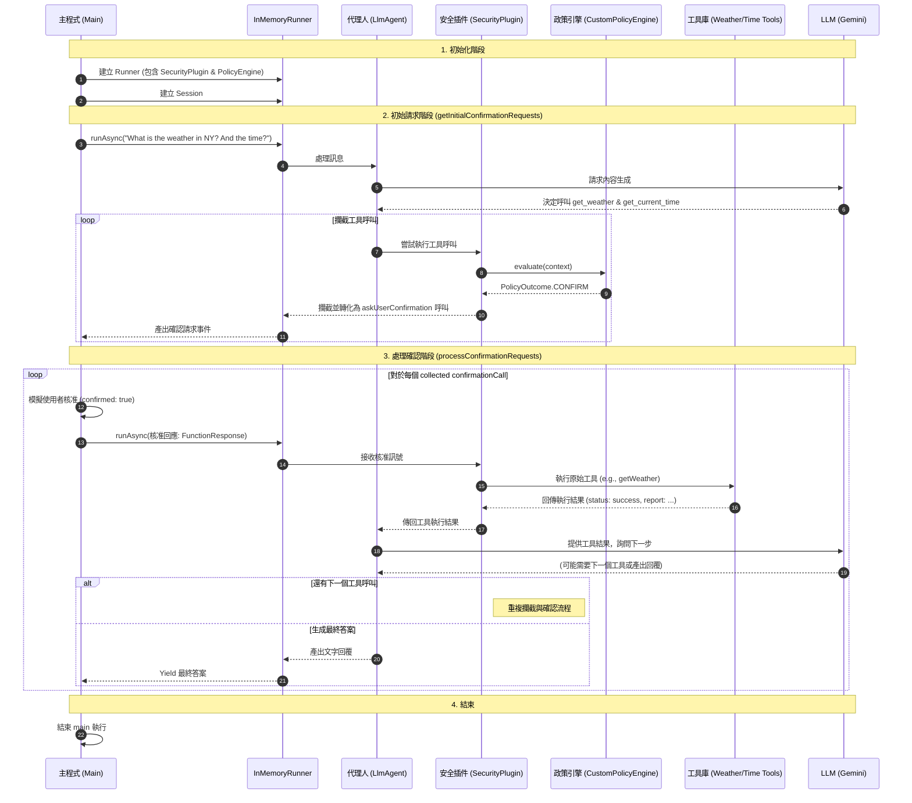

# ADK 中的多代理系統 (Multi-Agent Systems)
🔔 `更新日期：2026-01-14`

[`ADK 支援`: `Python v0.1.0` | `Typescript v0.2.0` | `Go v0.1.0` | `Java v0.1.0`]

隨著代理應用程式的複雜度增加，將其構建為單一、龐大的代理可能會在開發、維護和邏輯推理方面變得具有挑戰性。代理開發套件 (Agent Development Kit, ADK) 支援透過將多個不同的 `BaseAgent` 實例組合成一個**多代理系統 (Multi-Agent System, MAS)** 來構建複雜的應用程式。

在 ADK 中，多代理系統是指不同代理（通常形成層次結構）協作或協調以實現更大目標的應用程式。以這種方式建構應用程式具有顯著優勢，包括增強模組化、專業化、可重用性、可維護性，以及使用專用工作流代理定義結構化控制流的能力。

您可以組合各種類型的代理（衍生自 `BaseAgent`）來構建這些系統：

* **LLM 代理 (LLM Agents)：** 由大型語言模型驅動的代理。（參見 [LLM 代理](llm-agents.md)）
* **工作流代理 (Workflow Agents)：** 專門的代理（`SequentialAgent`、`ParallelAgent`、`LoopAgent`），旨在管理其子代理的執行流程。（參見 [工作流代理](workflow-agents/index.md)）
* **自定義代理 (Custom agents)：** 您自己繼承自 `BaseAgent` 並具有專門、非 LLM 邏輯的代理。（參見 [自定義代理](custom-agents.md)）

以下各節詳細介紹了核心 ADK 原生內建（例如代理層次結構、工作流代理和交互機制），這些原生內建使您能夠有效地構建和管理這些多代理系統。

## 1. 代理組合的 ADK 原生內建 (ADK Primitives for Agent Composition)

ADK 提供核心構建塊（原生內建），使您能夠在多代理系統中結構化並管理交互。

> [!NOTE]
    原生內建的特定參數或方法名稱可能會因 SDK 語言而異（例如 Python 中的 `sub_agents`，Java 中的 `subAgents`）。詳情請參考特定語言的 API 文件。

### 1.1. 代理層次結構（父代理、子代理） (Agent Hierarchy (Parent agent, Sub Agents))

構建多代理系統的基礎是在 `BaseAgent` 中定義的父子關係。

* **建立層次結構：** 在初始化父代理時，透過將代理實例列表傳遞給 `sub_agents` 參數來創建樹狀結構。ADK 在初始化期間會自動在每個子代理上設置 `parent_agent` 屬性。
* **單一父代理規則：** 一個代理實例只能作為子代理被添加一次。嘗試分配第二個父代理將導致 `ValueError`。
* **重要性：** 此層次結構定義了 [工作流代理](#12-作為編排者的工作流代理-workflow-agents-as-orchestrators) 的範圍，並影響 LLM 驅動委派的潛在目標。您可以使用 `agent.parent_agent` 導航層次結構，或使用 `agent.find_agent(name)` 查找後代。

<details>
<summary>Python</summary>

```python
# 概念範例：定義層次結構
from google.adk.agents import LlmAgent, BaseAgent

# 定義個別代理
greeter = LlmAgent(name="Greeter", model="gemini-2.0-flash")
task_doer = BaseAgent(name="TaskExecutor") # 自定義非 LLM 代理

# 創建父代理並透過 sub_agents 分配子代理
coordinator = LlmAgent(
    name="Coordinator",
    model="gemini-2.0-flash",
    description="我負責協調問候和任務。",
    sub_agents=[ # 在此處分配子代理 (sub_agents)
        greeter,
        task_doer
    ]
)

# 框架會自動設置：
# assert greeter.parent_agent == coordinator
# assert task_doer.parent_agent == coordinator
```
</details>

<details>
<summary>TypeScript</summary>

```typescript
// 概念範例：定義層次結構
import { LlmAgent, BaseAgent, InvocationContext } from '@google/adk';
import type { Event, createEventActions } from '@google/adk';

class TaskExecutorAgent extends BaseAgent {
  async *runAsyncImpl(context: InvocationContext): AsyncGenerator<Event, void, void> {
    // 產生任務完成事件
    yield {
      id: 'event-1',
      invocationId: context.invocationId,
      author: this.name,
      content: { parts: [{ text: '任務已完成！' }] },
      actions: createEventActions(),
      timestamp: Date.now(),
    };
  }
  async *runLiveImpl(context: InvocationContext): AsyncGenerator<Event, void, void> {
    // 呼叫非同步實現
    this.runAsyncImpl(context);
  }
}

// 定義個別代理
const greeter = new LlmAgent({name: 'Greeter', model: 'gemini-2.5-flash'});
const taskDoer = new TaskExecutorAgent({name: 'TaskExecutor'}); // 自定義非 LLM 代理

// 創建父代理並透過 subAgents 分配子代理
const coordinator = new LlmAgent({
    name: 'Coordinator',
    model: 'gemini-2.5-flash',
    description: '我負責協調問候和任務。',
    subAgents: [ // 在此處分配子代理 (subAgents)
        greeter,
        taskDoer
    ],
});

// 框架會自動設置：
// console.assert(greeter.parentAgent === coordinator);
// console.assert(taskDoer.parentAgent === coordinator);
```
</details>

<details>
<summary>Go</summary>

```go
import (
    "google.golang.org/adk/agent"
    "google.golang.org/adk/agent/llmagent"
)

// 概念範例：定義層次結構
// 定義個別代理
greeter, _ := llmagent.New(llmagent.Config{Name: "Greeter", Model: m})
taskDoer, _ := agent.New(agent.Config{Name: "TaskExecutor"}) // 自定義非 LLM 代理

// 創建父代理並透過 sub_agents 分配子代理
coordinator, _ := llmagent.New(llmagent.Config{
    Name:        "Coordinator",
    Model:       m,
    Description: "我負責協調問候和任務。",
    SubAgents:   []agent.Agent{greeter, taskDoer}, // 在此處分配子代理 (sub_agents)
})
```
</details>

<details>
<summary>Java</summary>

```java
// 概念範例：定義層次結構
import com.google.adk.agents.SequentialAgent;
import com.google.adk.agents.LlmAgent;

// 定義個別代理
LlmAgent greeter = LlmAgent.builder().name("Greeter").model("gemini-2.0-flash").build();
SequentialAgent taskDoer = SequentialAgent.builder().name("TaskExecutor").subAgents(...).build(); // 順序代理

// 創建父代理並分配子代理 (subAgents)
LlmAgent coordinator = LlmAgent.builder()
    .name("Coordinator")
    .model("gemini-2.0-flash")
    .description("我負責協調問候和任務")
    .subAgents(greeter, taskDoer) // 在此處分配子代理
    .build();

// 框架會自動設置：
// assert greeter.parentAgent().equals(coordinator);
// assert taskDoer.parentAgent().equals(coordinator);
```
</details>

### 1.2. 作為編排者的工作流代理 (Workflow Agents as Orchestrators)

ADK 包含衍生自 `BaseAgent` 的專門代理，它們本身不執行任務，而是編排其 `sub_agents` 的執行流程。

* **[`SequentialAgent`](workflow-agents/sequential-agents.md)：** 按列表順序一個接一個地執行其 `sub_agents`。
    * **上下文：** 順序傳遞*同一個* [`InvocationContext`](../agent-runtime/index.md)，允許代理透過共享狀態輕鬆傳遞結果。

<details>
<summary>Python</summary>

```python
# 概念範例：順序管線 (Sequential Pipeline)
from google.adk.agents import SequentialAgent, LlmAgent

# 第一步：獲取數據並保存到 state['data']
step1 = LlmAgent(name="Step1_Fetch", output_key="data")
# 第二步：處理數據
step2 = LlmAgent(name="Step2_Process", instruction="處理來自 {data} 的數據。")

# 定義順序管線
pipeline = SequentialAgent(name="MyPipeline", sub_agents=[step1, step2])
# 當管線運行時，Step2 可以訪問由 Step1 設置的 state['data']。
```
</details>

<details>
<summary>Typescript</summary>

```typescript
// 概念範例：順序管線 (Sequential Pipeline)
import { SequentialAgent, LlmAgent } from '@google/adk';

// 第一步：獲取數據並保存到 state['data']
const step1 = new LlmAgent({name: 'Step1_Fetch', outputKey: 'data'});
// 第二步：處理數據
const step2 = new LlmAgent({name: 'Step2_Process', instruction: '處理來自 {data} 的數據。'});

// 定義順序管線
const pipeline = new SequentialAgent({name: 'MyPipeline', subAgents: [step1, step2]});
// 當管線運行時，Step2 可以訪問由 Step1 設置的 state['data']。
```
</details>

<details>
<summary>Go</summary>

```go
import (
    "google.golang.org/adk/agent"
    "google.golang.org/adk/agent/llmagent"
    "google.golang.org/adk/agent/workflowagents/sequentialagent"
)

// 概念範例：順序管線 (Sequential Pipeline)
step1, _ := llmagent.New(llmagent.Config{Name: "Step1_Fetch", OutputKey: "data", Model: m}) // 將輸出儲存到 state["data"]
step2, _ := llmagent.New(llmagent.Config{Name: "Step2_Process", Instruction: "處理來自 {data} 的數據。", Model: m})

pipeline, _ := sequentialagent.New(sequentialagent.Config{
    AgentConfig: agent.Config{Name: "MyPipeline", SubAgents: []agent.Agent{step1, step2}},
})
// 當管線運行時，Step2 可以存取由 Step1 設定的 state["data"]。
```
</details>

<details>
<summary>Java</summary>

```java
// 概念範例：順序管線 (Sequential Pipeline)
import com.google.adk.agents.SequentialAgent;
import com.google.adk.agents.LlmAgent;

// 第一步：獲取數據並保存到 state.get("data")
LlmAgent step1 = LlmAgent.builder().name("Step1_Fetch").outputKey("data").build();
// 第二步：處理數據
LlmAgent step2 = LlmAgent.builder().name("Step2_Process").instruction("處理來自 {data} 的數據。").build();

// 建立順序代理管線
SequentialAgent pipeline = SequentialAgent.builder().name("MyPipeline").subAgents(step1, step2).build();
// 當管線運行時，Step2 可以訪問由 Step1 設置的 state.get("data")。
```
</details>

* **[`ParallelAgent`](workflow-agents/parallel-agents.md)：** 並行執行其 `sub_agents`。來自子代理的事件可能會交錯出現。
    * **上下文：** 為每個子代理修改 `InvocationContext.branch`（例如 `ParentBranch.ChildName`），提供獨特的上下文路徑，這對於在某些記憶體實現中隔離歷史記錄非常有用。
    * **狀態：** 儘管分支不同，所有並行子代理仍訪問*同一個共享的* `session.state`，使它們能夠讀取初始狀態並寫入結果（建議使用不同的鍵以避免競爭條件）。

<details>
<summary>Python</summary>

```python
# 概念範例：並行執行
from google.adk.agents import ParallelAgent, LlmAgent

# 獲取天氣和新聞的代理
fetch_weather = LlmAgent(name="WeatherFetcher", output_key="weather")
fetch_news = LlmAgent(name="NewsFetcher", output_key="news")

# 定義並行代理
gatherer = ParallelAgent(name="InfoGatherer", sub_agents=[fetch_weather, fetch_news])
# 當 gatherer 運行時，WeatherFetcher 和 NewsFetcher 會同時運行。
# 後續的代理可以讀取 state['weather'] 和 state['news']。
```
</details>

<details>
<summary>Typescript</summary>

```typescript
// 概念範例：並行執行
import { ParallelAgent, LlmAgent } from '@google/adk';

// 獲取天氣和新聞的代理
const fetchWeather = new LlmAgent({name: 'WeatherFetcher', outputKey: 'weather'});
const fetchNews = new LlmAgent({name: 'NewsFetcher', outputKey: 'news'});

// 定義並行代理
const gatherer = new ParallelAgent({name: 'InfoGatherer', subAgents: [fetchWeather, fetchNews]});
// 當 gatherer 運行時，WeatherFetcher 和 NewsFetcher 會同時運行。
// 後續的代理可以讀取 state['weather'] 和 state['news']。
```
</details>

<details>
<summary>Go</summary>

```go
import (
    "google.golang.org/adk/agent"
    "google.golang.org/adk/agent/llmagent"
    "google.golang.org/adk/agent/workflowagents/parallelagent"
)

// 概念範例：並行執行
fetchWeather, _ := llmagent.New(llmagent.Config{Name: "WeatherFetcher", OutputKey: "weather", Model: m})
fetchNews, _ := llmagent.New(llmagent.Config{Name: "NewsFetcher", OutputKey: "news", Model: m})

gatherer, _ := parallelagent.New(parallelagent.Config{
    AgentConfig: agent.Config{Name: "InfoGatherer", SubAgents: []agent.Agent{fetchWeather, fetchNews}},
})
// 當 gatherer 運行時，WeatherFetcher 和 NewsFetcher 會同時運行。
// 後續的代理可以讀取 state["weather"] 和 state["news"]。
```
</details>

<details>
<summary>Java</summary>

```java
// 概念範例：並行執行
import com.google.adk.agents.LlmAgent;
import com.google.adk.agents.ParallelAgent;

LlmAgent fetchWeather = LlmAgent.builder()
    .name("WeatherFetcher")
    .outputKey("weather")
    .build();

LlmAgent fetchNews = LlmAgent.builder()
    .name("NewsFetcher")
    .instruction("news")
    .build();

ParallelAgent gatherer = ParallelAgent.builder()
    .name("InfoGatherer")
    .subAgents(fetchWeather, fetchNews)
    .build();

// 當 gatherer 運行時，WeatherFetcher 和 NewsFetcher 會同時運行。
// 後續的代理可以讀取 state['weather'] 和 state['news']。
```
</details>

  * **[`LoopAgent`](workflow-agents/loop-agents.md)：** 在循環中順序執行其 `sub_agents`。
    <details>
    <summary>Python</summary>

    ```python
    # 概念範例：帶條件的循環
    from google.adk.agents import LoopAgent, LlmAgent, BaseAgent
    from google.adk.events import Event, EventActions
    from google.adk.agents.invocation_context import InvocationContext
    from typing import AsyncGenerator

    class CheckCondition(BaseAgent): # 檢查狀態的自定義代理
        async def _run_async_impl(self, ctx: InvocationContext) -> AsyncGenerator[Event, None]:
            status = ctx.session.state.get("status", "pending")
            is_done = (status == "completed")
            # 如果完成則升級 (escalate)，終止循環
            yield Event(author=self.name, actions=EventActions(escalate=is_done))

    # 可能會更新 state['status'] 的代理
    process_step = LlmAgent(name="ProcessingStep")

    poller = LoopAgent(
        name="StatusPoller",
        max_iterations=10,
        sub_agents=[process_step, CheckCondition(name="Checker")]
    )
    # 當 poller 運行時，它會重複執行 process_step 然後是 Checker
    # 直到 Checker 升級 (state['status'] == 'completed') 或達到 10 次迭代。
    ```
    </details>

    <details>
    <summary>Typescript</summary>

    ```typescript
    // 概念範例：帶條件的循環
    import { LoopAgent, LlmAgent, BaseAgent, InvocationContext } from '@google/adk';
    import type { Event, createEventActions } from '@google/adk';

    class CheckConditionAgent extends BaseAgent { // 檢查狀態的自定義代理
        async *runAsyncImpl(ctx: InvocationContext): AsyncGenerator<Event> {
            const status = ctx.session.state['status'] || 'pending';
            const isDone = status === 'completed';
            // 產生升級事件以終止循環
            yield createEvent({ author: 'check_condition', actions: createEventActions({ escalate: isDone }) });
        }

        async *runLiveImpl(ctx: InvocationContext): AsyncGenerator<Event> {
            // 此代理未實現即時運行邏輯
        }
    };

    const processStep = new LlmAgent({name: 'ProcessingStep'}); // 可能會更新 state['status'] 的代理

    const poller = new LoopAgent({
        name: 'StatusPoller',
        maxIterations: 10,
        // 在循環中順序執行其子代理
        subAgents: [processStep, new CheckConditionAgent ({name: 'Checker'})]
    });
    // 當 poller 運行時，它會重複執行 processStep 然後是 Checker
    // 直到 Checker 升級 (state['status'] === 'completed') 或達到 10 次迭代。
    ```
    </details>

    <details>
    <summary>Go</summary>

    ```go
    import (
        "iter"
        "google.golang.org/adk/agent"
        "google.golang.org/adk/agent/llmagent"
        "google.golang.org/adk/agent/workflowagents/loopagent"
        "google.golang.org/adk/session"
    )

    // 概念範例：帶條件的循環
    // 自定義代理：檢查狀態
    checkCondition, _ := agent.New(agent.Config{
        Name: "Checker",
        Run: func(ctx agent.InvocationContext) iter.Seq2[*session.Event, error] {
            return func(yield func(*session.Event, error) bool) {
                status, err := ctx.Session().State().Get("status")
                // 如果 state 中沒有 "status"，預設為 "pending"
                if err != nil {
                    status = "pending"
                }
                isDone := status == "completed"
                yield(&session.Event{Author: "Checker", Actions: session.EventActions{Escalate: isDone}}, nil)
            }
        },
    })

    processStep, _ := llmagent.New(llmagent.Config{Name: "ProcessingStep", Model: m}) // 可能會更新 state["status"] 的代理

    poller, _ := loopagent.New(loopagent.Config{
        MaxIterations: 10,
        AgentConfig:   agent.Config{Name: "StatusPoller", SubAgents: []agent.Agent{processStep, checkCondition}},
    })
    // 當 poller 執行時，會重複執行 processStep 然後 Checker
    // 直到 Checker 升級（state["status"] == "completed"）或達到 10 次迭代。
    ```
    </details>

    <details>
    <summary>Java</summary>

    ```java
    // 概念範例：帶條件的循環
    // 檢查狀態並可能升級的自定義代理
    public static class CheckConditionAgent extends BaseAgent {
      public CheckConditionAgent(String name, String description) {
        super(name, description, List.of(), null, null);
      }

      @Override
      protected Flowable<Event> runAsyncImpl(InvocationContext ctx) {
        String status = (String) ctx.session().state().getOrDefault("status", "pending");
        boolean isDone = "completed".equalsIgnoreCase(status);

        // 如果滿足條件，則發出信號升級（退出循環）的事件。
        // 如果未完成，escalate 旗標將為 false 或不存在，循環繼續。
        Event checkEvent = Event.builder()
                .author(name())
                .id(Event.generateEventId()) // 為事件分配唯一 ID 非常重要
                .actions(EventActions.builder().escalate(isDone).build()) // 如果完成則升級
                .build();
        return Flowable.just(checkEvent);
      }
    }

    // 可能更新 state.put("status") 的代理
    LlmAgent processingStepAgent = LlmAgent.builder().name("ProcessingStep").build();
    // 檢查條件的自定義代理實例
    CheckConditionAgent conditionCheckerAgent = new CheckConditionAgent(
        "ConditionChecker",
        "檢查狀態是否為 'completed'。"
    );
    LoopAgent poller = LoopAgent.builder().name("StatusPoller").maxIterations(10).subAgents(processingStepAgent, conditionCheckerAgent).build();
    // 當 poller 運行時，它會重複執行 processingStepAgent 然後是 conditionCheckerAgent
    // 直到 Checker 升級 (state.get("status") == "completed") 或達到 10 次迭代。
    ```
    </details>

### 1.3. 交互與通訊機制 (Interaction & Communication Mechanisms)

系統內的代理通常需要交換數據或觸發彼此的操作。ADK 透過以下方式促進這一點：

#### a) 共享會話狀態 (`session.state`) (Shared Session State (`session.state`))

對於在同一個調用中運行的代理（因此透過 `InvocationContext` 共享同一個 [`Session`](../sessions&memory/session/overview.md) 對象），這是最基礎的被動通訊方式。

* **機制：** 一個代理（或其工具/回調）寫入一個值 (`context.state['data_key'] = processed_data`)，後續代理讀取它 (`data = context.state.get('data_key')`)。狀態更改透過 [`CallbackContext`](../callbacks/index.md) 進行追蹤。
* **便利性：** [`LlmAgent`](llm-agents.md) 上的 `output_key` 屬性會自動將代理的最終響應文本（或結構化輸出）保存到指定的狀態鍵中。
* **本質：** 異步、被動通訊。非常適合由 `SequentialAgent` 編排的管線或跨 `LoopAgent` 迭代傳遞數據。
* **參見：** [狀態管理](../sessions&memory/state.md)

> [!NOTE] 調用上下文與 `temp:` 狀態
    當父代理調用子代理時，它會傳遞相同的 `InvocationContext`。這意味著它們共享相同的臨時 (`temp:`) 狀態，這對於傳遞僅與當前輪次相關的數據非常理想。

<details>
<summary>Python</summary>

```python
# 概念範例：使用 output_key 並讀取狀態
from google.adk.agents import LlmAgent, SequentialAgent

# 代理 A：尋找法國首都並保存到 capital_city
agent_A = LlmAgent(name="AgentA", instruction="尋找法國的首都。", output_key="capital_city")
# 代理 B：使用 state 中的 capital_city 進行描述
agent_B = LlmAgent(name="AgentB", instruction="告訴我關於存儲在 {capital_city} 中的城市的資訊。")

pipeline = SequentialAgent(name="CityInfo", sub_agents=[agent_A, agent_B])
# AgentA 運行，將 "巴黎" 保存到 state['capital_city']。
# AgentB 運行，其指令處理器讀取 state['capital_city'] 以獲取 "巴黎"。
```
</details>

<details>
<summary>Typescript</summary>

```typescript
// 概念範例：使用 outputKey 並讀取狀態
import { LlmAgent, SequentialAgent } from '@google/adk';

// 代理 A：尋找法國首都並保存到 capital_city
const agentA = new LlmAgent({name: 'AgentA', instruction: '尋找法國的首都。', outputKey: 'capital_city'});
// 代理 B：使用 state 中的 capital_city 進行描述
const agentB = new LlmAgent({name: 'AgentB', instruction: '告訴我關於存儲在 {capital_city} 中的城市的資訊。'});

const pipeline = new SequentialAgent({name: 'CityInfo', subAgents: [agentA, agentB]});
// AgentA 運行，將 "巴黎" 保存到 state['capital_city']。
// AgentB 運行，其指令處理器讀取 state['capital_city'] 以獲取 "巴黎"。
```
</details>

<details>
<summary>Go</summary>

```go
import (
    "google.golang.org/adk/agent"
    "google.golang.org/adk/agent/llmagent"
    "google.golang.org/adk/agent/workflowagents/sequentialagent"
)

// 概念範例：使用 output_key 並讀取狀態
agentA, _ := llmagent.New(llmagent.Config{Name: "AgentA", Instruction: "尋找法國的首都。", OutputKey: "capital_city", Model: m})
agentB, _ := llmagent.New(llmagent.Config{Name: "AgentB", Instruction: "告訴我關於存儲在 {capital_city} 中的城市的資訊。", Model: m})

pipeline2, _ := sequentialagent.New(sequentialagent.Config{
    AgentConfig: agent.Config{Name: "CityInfo", SubAgents: []agent.Agent{agentA, agentB}},
})
// AgentA 運行，將 "巴黎" 保存到 state["capital_city"]。
// AgentB 運行，其指令處理器讀取 state["capital_city"] 以獲取 "巴黎"。
```
</details>

<details>
<summary>Java</summary>

```java
// 概念範例：使用 outputKey 並讀取狀態
import com.google.adk.agents.LlmAgent;
import com.google.adk.agents.SequentialAgent;

LlmAgent agentA = LlmAgent.builder()
    .name("AgentA")
    .instruction("尋找法國的首都。")
    .outputKey("capital_city")
    .build();

LlmAgent agentB = LlmAgent.builder()
    .name("AgentB")
    .instruction("告訴我關於存儲在 {capital_city} 中的城市的資訊。")
    .outputKey("capital_city")
    .build();

SequentialAgent pipeline = SequentialAgent.builder().name("CityInfo").subAgents(agentA, agentB).build();
// AgentA 運行，將 "巴黎" 保存到 state('capital_city')。
// AgentB 運行，其指令處理器讀取 state.get("capital_city") 以獲取 "巴黎"。
```
</details>

#### b) LLM 驅動委派（代理轉移） (LLM-Driven Delegation (Agent Transfer))

利用 [`LlmAgent`](llm-agents.md) 的理解能力，動態地將任務路由到層次結構中其他合適的代理。

* **機制：** 代理的 LLM 生成特定的函數調用：`transfer_to_agent(agent_name='target_agent_name')`。
* **處理：** 默認情況下，當存在子代理且未禁用轉移時，`AutoFlow` 會攔截此調用。它使用 `root_agent.find_agent()` 識別目標代理，並更新 `InvocationContext` 以切換執行焦點。
* **要求：** 發起調用的 `LlmAgent` 需要明確的 `instructions` (指令) 說明何時轉移，而潛在的目標代理需要獨特的 `description` (描述) 以供 LLM 做出明智決策。轉移範圍（父代理、子代理、同級代理）可以在 `LlmAgent` 上配置。
* **本質：** 基於 LLM 解釋的動態、靈活路由。

<details>
<summary>Python</summary>

```python
# 概念設置：LLM 轉移
from google.adk.agents import LlmAgent

# 定義專門的代理
booking_agent = LlmAgent(name="Booker", description="處理機票和酒店預訂。")
info_agent = LlmAgent(name="Info", description="提供一般資訊並回答問題。")

coordinator = LlmAgent(
    name="Coordinator",
    model="gemini-2.0-flash",
    instruction="你是一個助手。將預訂任務委派給 Booker，將資訊查詢委派給 Info。",
    description="主協調員。",
    # 此處通常隱式使用 AutoFlow
    sub_agents=[booking_agent, info_agent]
)
# 如果協調員收到 "預訂機票"，其 LLM 應生成：
# FunctionCall(name='transfer_to_agent', args={'agent_name': 'Booker'})
# ADK 框架隨後將執行路由到 booking_agent。
```
</details>

<details>
<summary>Typescript</summary>

```typescript
// 概念設置：LLM 轉移
import { LlmAgent } from '@google/adk';

// 定義專門的代理
const bookingAgent = new LlmAgent({name: 'Booker', description: '處理機票和酒店預訂。'});
const infoAgent = new LlmAgent({name: 'Info', description: '提供一般資訊並回答問題。'});

const coordinator = new LlmAgent({
    name: 'Coordinator',
    model: 'gemini-2.5-flash',
    instruction: '你是一個助手。將預訂任務委派給 Booker，將資訊查詢委派給 Info。',
    description: '主協調員。',
    // 此處通常隱式使用 AutoFlow
    subAgents: [bookingAgent, infoAgent]
});
// 如果協調員收到 "預訂機票"，其 LLM 應生成：
// {functionCall: {name: 'transfer_to_agent', args: {agent_name: 'Booker'}}}
// ADK 框架隨後將執行路由到 bookingAgent。
```
</details>

<details>
<summary>Go</summary>

```go
import (
    "google.golang.org/adk/agent"
    "google.golang.org/adk/agent/llmagent"
)

// 概念設置：LLM 轉移
bookingAgent, _ := llmagent.New(llmagent.Config{Name: "Booker", Description: "處理機票和酒店預訂。", Model: m})
infoAgent, _ := llmagent.New(llmagent.Config{Name: "Info", Description: "提供一般資訊並回答問題。", Model: m})

coordinator, _ = llmagent.New(llmagent.Config{
    Name:        "Coordinator",
    Model:       m,
    Instruction: "你是一個助手。將預訂任務委派給 Booker，將資訊查詢委派給 Info。",
    Description: "主協調員。",
    SubAgents:   []agent.Agent{bookingAgent, infoAgent},
})

// 如果協調員收到「預訂機票」，其 LLM 應生成：
// FunctionCall{Name: "transfer_to_agent", Args: map[string]any{"agent_name": "Booker"}}
// ADK 框架隨後將執行路由到 bookingAgent。
```
</details>

<details>
<summary>Java</summary>

```java
// 概念設置：LLM 轉移
import com.google.adk.agents.LlmAgent;

LlmAgent bookingAgent = LlmAgent.builder()
    .name("Booker")
    .description("處理機票和酒店預訂。")
    .build();

LlmAgent infoAgent = LlmAgent.builder()
    .name("Info")
    .description("提供一般資訊並回答問題。")
    .build();

// 定義協調員代理
LlmAgent coordinator = LlmAgent.builder()
    .name("Coordinator")
    .model("gemini-2.0-flash") // 或您所需的模型
    .instruction("你是一個助手。將預訂任務委派給 Booker，將資訊查詢委派給 Info。")
    .description("主協調員。")
    // 由於存在 subAgents 且未禁用轉移，默認情況下（隱式）將使用 AutoFlow。
    .subAgents(bookingAgent, infoAgent)
    .build();

// 如果協調員收到 "預訂機票"，其 LLM 應生成：
// FunctionCall.builder.name("transferToAgent").args(ImmutableMap.of("agent_name", "Booker")).build()
// ADK 框架隨後將執行路由到 bookingAgent。
```
</details>

#### c) 顯式調用 (`AgentTool`) (Explicit Invocation (`AgentTool`))

允許 [`LlmAgent`](llm-agents.md) 將另一個 `BaseAgent` 實例視為可調用的函數或 [工具 (Tool)](https://google.github.io/adk-docs/tools/)。

* **機制：** 將目標代理實例封裝在 `AgentTool` 中，並將其包含在父 `LlmAgent` 的 `tools` 列表中。`AgentTool` 會為 LLM 生成相應的函數聲明。
* **處理：** 當父 LLM 生成針對 `AgentTool` 的函數調用時，框架執行 `AgentTool.run_async`。此方法運行目標代理，捕獲其最終響應，將任何狀態/工件 (artifact) 更改轉發回父代理的上下文，並將響應作為工具的結果返回。
* **本質：** 同步（在父代理的流程內），像任何其他工具一樣進行顯式、受控的調用。
* **（注意：** `AgentTool` 需要顯式導入並使用）。

<details>
<summary>Python</summary>

```python
# 概念設置：代理作為工具
from google.adk.agents import LlmAgent, BaseAgent
from google.adk.tools import agent_tool
from pydantic import BaseModel

# 定義目標代理（可以是 LlmAgent 或自定義 BaseAgent）
class ImageGeneratorAgent(BaseAgent): # 自定義代理範例
    name: str = "ImageGen"
    description: str = "根據提示生成圖像。"
    # ... 內部邏輯 ...
    async def _run_async_impl(self, ctx): # 簡化的運行邏輯
        prompt = ctx.session.state.get("image_prompt", "默認提示")
        # ... 生成圖像字節 ...
        image_bytes = b"..."
        yield Event(author=self.name, content=types.Content(parts=[types.Part.from_bytes(image_bytes, "image/png")]))

image_agent = ImageGeneratorAgent()
image_tool = agent_tool.AgentTool(agent=image_agent) # 封裝代理

# 父代理使用 AgentTool
artist_agent = LlmAgent(
    name="Artist",
    model="gemini-2.0-flash",
    instruction="創建一個提示並使用 ImageGen 工具生成圖像。",
    tools=[image_tool] # 包含 AgentTool
)
# Artist LLM 生成提示，然後調用：
# FunctionCall(name='ImageGen', args={'image_prompt': '一隻戴著帽子的貓'})
# 框架調用 image_tool.run_async(...)，隨後運行 ImageGeneratorAgent。
# 生成的圖像 Part 作為工具結果返回給 Artist 代理。
```

</details>

<details>
<summary>Typescript</summary>

```typescript
// 概念設置：代理作為工具
import { LlmAgent, BaseAgent, AgentTool, InvocationContext } from '@google/adk';
import type { Part, createEvent, Event } from '@google/genai';

// 定義目標代理（可以是 LlmAgent 或自定義 BaseAgent）
class ImageGeneratorAgent extends BaseAgent { // 自定義代理範例
    constructor() {
        super({name: 'ImageGen', description: '根據提示生成圖像。'});
    }
    // ... 內部邏輯 ...
    async *runAsyncImpl(ctx: InvocationContext): AsyncGenerator<Event> { // 簡化的運行邏輯
        const prompt = ctx.session.state['image_prompt'] || '默認提示';
        // ... 生成圖像字節 ...
        const imageBytes = new Uint8Array(); // 佔位符
        const imagePart: Part = {inlineData: {data: Buffer.from(imageBytes).toString('base64'), mimeType: 'image/png'}};
        yield createEvent({content: {parts: [imagePart]}});
    }

    async *runLiveImpl(ctx: InvocationContext): AsyncGenerator<Event, void, void> {
        // 此代理未實現即時運行邏輯
    }
}

const imageAgent = new ImageGeneratorAgent();
const imageTool = new AgentTool({agent: imageAgent}); // 封裝代理

// 父代理使用 AgentTool
const artistAgent = new LlmAgent({
    name: 'Artist',
    model: 'gemini-2.5-flash',
    instruction: '創建一個提示並使用 ImageGen 工具生成圖像。',
    tools: [imageTool] // 包含 AgentTool
});
// Artist LLM 生成提示，然後調用：
// {functionCall: {name: 'ImageGen', args: {image_prompt: '一隻戴著帽子的貓'}}}
// 框架調用 imageTool.runAsync(...)，隨後運行 ImageGeneratorAgent。
// 生成的圖像 Part 作為工具結果返回給 Artist 代理。
```

</details>

<details>
<summary>Go</summary>

```go
import (
    "fmt"
    "iter"
    "google.golang.org/adk/agent"
    "google.golang.org/adk/agent/llmagent"
    "google.golang.org/adk/model"
    "google.golang.org/adk/session"
    "google.golang.org/adk/tool"
    "google.golang.org/adk/tool/agenttool"
    "google.golang.org/genai"
)

// 概念設置：代理作為工具
// 定義目標代理（可以是 LlmAgent 或自定義 BaseAgent）
imageAgent, _ := agent.New(agent.Config{
    Name:        "ImageGen",
    Description: "根據提示生成圖像。",
    Run: func(ctx agent.InvocationContext) iter.Seq2[*session.Event, error] {
        return func(yield func(*session.Event, error) bool) {
            prompt, _ := ctx.Session().State().Get("image_prompt")
            fmt.Printf("正在根據提示生成圖像: %v\n", prompt)
            imageBytes := []byte("...") // 模擬圖像位元組
            yield(&session.Event{
                Author: "ImageGen",
                LLMResponse: model.LLMResponse{
                    Content: &genai.Content{
                        Parts: []*genai.Part{genai.NewPartFromBytes(imageBytes, "image/png")},
                    },
                },
            }, nil)
        }
    },
})

// 封裝代理
imageTool := agenttool.New(imageAgent, nil)

// 現在 imageTool 可以被其他代理作為工具使用。

// 父代理使用 AgentTool
artistAgent, _ := llmagent.New(llmagent.Config{
    Name:        "Artist",
    Model:       m,
    Instruction: "創建一個提示並使用 ImageGen 工具生成圖像。",
    Tools:       []tool.Tool{imageTool}, // 包含 AgentTool
})
// Artist LLM 生成提示，然後調用：
// FunctionCall{Name: "ImageGen", Args: map[string]any{"image_prompt": "一隻戴著帽子的貓"}}
// 框架調用 imageTool.Run(...)，隨後運行 ImageGeneratorAgent。
// 生成的圖像 Part 作為工具結果返回給 Artist 代理。
```

</details>

<details>
<summary>Java</summary>

```java
// 概念設置：代理作為工具
import com.google.adk.agents.BaseAgent;
import com.google.adk.agents.LlmAgent;
import com.google.adk.tools.AgentTool;

// 自定義代理範例（可以是 LlmAgent 或自定義 BaseAgent）
public class ImageGeneratorAgent extends BaseAgent  {

  public ImageGeneratorAgent(String name, String description) {
    super(name, description, List.of(), null, null);
  }

  // ... 內部邏輯 ...
  @Override
  protected Flowable<Event> runAsyncImpl(InvocationContext invocationContext) { // 簡化的運行邏輯
    invocationContext.session().state().get("image_prompt");
    // 生成圖像字節
    // ...

    Event responseEvent = Event.builder()
        .author(this.name())
        .content(Content.fromParts(Part.fromText("...")))
        .build();

    return Flowable.just(responseEvent);
  }

  @Override
  protected Flowable<Event> runLiveImpl(InvocationContext invocationContext) {
    return null;
  }
}

// 使用 AgentTool 封裝代理
ImageGeneratorAgent imageAgent = new ImageGeneratorAgent("image_agent", "生成圖像");
AgentTool imageTool = AgentTool.create(imageAgent);

// 父代理使用 AgentTool
LlmAgent artistAgent = LlmAgent.builder()
        .name("Artist")
        .model("gemini-2.0-flash")
        .instruction(
                "你是一個藝術家。為圖像創建一個詳細的提示，然後 " +
                        "使用 'ImageGen' 工具生成圖像。 " +
                        "'ImageGen' 工具期望一個名為 'request' 的單一字符串參數 " +
                        "包含圖像提示。該工具將在其 'result' 字段中返回一個 JSON 字符串， " +
                        "包含 'image_base64'、'mime_type' 和 'status'。"
        )
        .description("可以使用生成工具創建圖像的代理。")
        .tools(imageTool) // 包含 AgentTool
        .build();

// Artist LLM 生成提示，然後調用：
// FunctionCall(name='ImageGen', args={'imagePrompt': '一隻戴著帽子的貓'})
// 框架調用 imageTool.runAsync(...)，隨後運行 ImageGeneratorAgent。
// 生成的圖像 Part 作為工具結果返回給 Artist 代理。
```

</details>

這些原生內建提供了設計多代理交互的靈活性，範圍從緊密耦合的順序工作流到動態的、LLM 驅動的委派網絡。

## 2. 使用 ADK 原生內建的常見多代理模式 (Common Multi-Agent Patterns using ADK Primitives)

透過結合 ADK 的組合原生內建，您可以實現各種成熟的多代理協作模式。

### 協調員/派遣員模式 (Coordinator/Dispatcher Pattern)

* **結構：** 一個中心 [`LlmAgent`](llm-agents.md) (協調員) 管理多個專業的 `sub_agents`。
* **目標：** 將傳入的請求路由到適當的專家代理。
* **使用的 ADK 原生內建：**
    * **層次結構：** 協調員在 `sub_agents` 中列出專家代理。
    * **交互：** 主要使用 **LLM 驅動委派**（需要子代理上有明確的 `description`，協調員上有適當的 `instruction`）或 **顯式調用 (`AgentTool`)**（協調員在其 `tools` 中包含封裝了 `AgentTool` 的專家代理）。

<details>
<summary>Python</summary>

```python
# 概念代碼：使用 LLM 轉移的協調員
from google.adk.agents import LlmAgent

# 定義賬單和支援代理
billing_agent = LlmAgent(name="Billing", description="處理賬單查詢。")
support_agent = LlmAgent(name="Support", description="處理技術支援請求。")

coordinator = LlmAgent(
    name="HelpDeskCoordinator",
    model="gemini-2.0-flash",
    instruction="路由用戶請求：對於付款問題使用 Billing 代理，對於技術問題使用 Support 代理。",
    description="主服務台路由器。",
    # allow_transfer=True 在 AutoFlow 中與 sub_agents 配合時通常是隱式的
    sub_agents=[billing_agent, support_agent]
)
# 用戶詢問 "我的付款失敗了" -> 協調員的 LLM 應調用 transfer_to_agent(agent_name='Billing')
# 用戶詢問 "我無法登錄" -> 協調員的 LLM 應調用 transfer_to_agent(agent_name='Support')
```
</details>

<details>
<summary>Typescript</summary>

```typescript
// 概念代碼：使用 LLM 轉移的協調員
import { LlmAgent } from '@google/adk';

// 定義賬單和支援代理
const billingAgent = new LlmAgent({name: 'Billing', description: '處理賬單查詢。'});
const supportAgent = new LlmAgent({name: 'Support', description: '處理技術支援請求。'});

const coordinator = new LlmAgent({
    name: 'HelpDeskCoordinator',
    model: 'gemini-2.5-flash',
    instruction: '路由用戶請求：對於付款問題使用 Billing 代理，對於技術問題使用 Support 代理。',
    description: '主服務台路由器。',
    // allowTransfer=true 在 AutoFlow 中與 subAgents 配合時通常是隱式的
    subAgents: [billingAgent, supportAgent]
});
// 用戶詢問 "我的付款失敗了" -> 協調員的 LLM 應調用 {functionCall: {name: 'transfer_to_agent', args: {agent_name: 'Billing'}}}
// 用戶詢問 "我無法登錄" -> 協調員的 LLM 應調用 {functionCall: {name: 'transfer_to_agent', args: {agent_name: 'Support'}}}
```
</details>

<details>
<summary>Go</summary>

```go
import (
    "google.golang.org/adk/agent"
    "google.golang.org/adk/agent/llmagent"
)

// 概念代碼：使用 LLM 轉移的協調員
billingAgent, _ := llmagent.New(llmagent.Config{Name: "Billing", Description: "處理賬單查詢。", Model: m})
supportAgent, _ := llmagent.New(llmagent.Config{Name: "Support", Description: "處理技術支援請求。", Model: m})

coordinator, _ := llmagent.New(llmagent.Config{
    Name:        "HelpDeskCoordinator",
    Model:       m,
    Instruction: "路由用戶請求：對於付款問題使用 Billing 代理，對於技術問題使用 Support 代理。",
    Description: "主服務台路由器。",
    SubAgents:   []agent.Agent{billingAgent, supportAgent},
})
// 用戶詢問「我的付款失敗了」 -> 協調員的 LLM 應調用 transfer_to_agent(agent_name='Billing')
// 用戶詢問「我無法登入」 -> 協調員的 LLM 應調用 transfer_to_agent(agent_name='Support')
```
</details>

<details>
<summary>Java</summary>

```java
// 概念代碼：使用 LLM 轉移的協調員
import com.google.adk.agents.LlmAgent;

LlmAgent billingAgent = LlmAgent.builder()
    .name("Billing")
    .description("處理賬單查詢和付款問題。")
    .build();

LlmAgent supportAgent = LlmAgent.builder()
    .name("Support")
    .description("處理技術支援請求和登錄問題。")
    .build();

LlmAgent coordinator = LlmAgent.builder()
    .name("HelpDeskCoordinator")
    .model("gemini-2.0-flash")
    .instruction("路由用戶請求：對於付款問題使用 Billing 代理，對於技術問題使用 Support 代理。")
    .description("主服務台路由器。")
    .subAgents(billingAgent, supportAgent)
    // 在 Autoflow 中，除非另行指定（使用 .disallowTransferToParent 或 disallowTransferToPeers），否則代理轉移在子代理中是隱式的
    .build();

// 用戶詢問 "我的付款失敗了" -> 協調員的 LLM 應調用 transferToAgent(agentName='Billing')
// 用戶詢問 "我無法登錄" -> 協調員的 LLM 應調用 transferToAgent(agentName='Support')
```
</details>

### 順序管線模式 (Sequential Pipeline Pattern)

* **結構：** 一個 [`SequentialAgent`](workflow-agents/sequential-agents.md) 包含按固定順序執行的 `sub_agents`。
* **目標：** 實現一個多步驟流程，其中一步的輸出饋送到下一步。
* **使用的 ADK 原生內建：**
    * **工作流：** `SequentialAgent` 定義順序。
    * **通訊：** 主要使用 **共享會話狀態**。先前的代理寫入結果（通常透過 `output_key`），後續代理從 `context.state` 讀取這些結果。

<details>
<summary>Python</summary>

```python
# 概念代碼：順序數據管線
from google.adk.agents import SequentialAgent, LlmAgent

# 定義驗證、處理和報告代理
validator = LlmAgent(name="ValidateInput", instruction="驗證輸入。", output_key="validation_status")
processor = LlmAgent(name="ProcessData", instruction="如果 {validation_status} 為 'valid'，則處理數據。", output_key="result")
reporter = LlmAgent(name="ReportResult", instruction="報告來自 {result} 的結果。")

data_pipeline = SequentialAgent(
    name="DataPipeline",
    sub_agents=[validator, processor, reporter]
)
# validator 運行 -> 保存到 state['validation_status']
# processor 運行 -> 讀取 state['validation_status']，保存到 state['result']
# reporter 運行 -> 讀取 state['result']
```

</details>

<details>
<summary>Typescript</summary>

```typescript
// 概念代碼：順序數據管線
import { SequentialAgent, LlmAgent } from '@google/adk';

// 定義驗證、處理和報告代理
const validator = new LlmAgent({name: 'ValidateInput', instruction: '驗證輸入。', outputKey: 'validation_status'});
const processor = new LlmAgent({name: 'ProcessData', instruction: '如果 {validation_status} 為 "valid"，則處理數據。', outputKey: 'result'});
const reporter = new LlmAgent({name: 'ReportResult', instruction: '報告來自 {result} 的結果。'});

const dataPipeline = new SequentialAgent({
    name: 'DataPipeline',
    subAgents: [validator, processor, reporter]
});
// validator 運行 -> 保存到 state['validation_status']
// processor 運行 -> 讀取 state['validation_status']，保存到 state['result']
// reporter 運行 -> 讀取 state['result']
```

</details>

<details>
<summary>Go</summary>

```go
import (
    "google.golang.org/adk/agent"
    "google.golang.org/adk/agent/llmagent"
    "google.golang.org/adk/agent/workflowagents/sequentialagent"
)

// 概念代碼：順序數據管線
validator, _ := llmagent.New(llmagent.Config{Name: "ValidateInput", Instruction: "驗證輸入。", OutputKey: "validation_status", Model: m})
processor, _ := llmagent.New(llmagent.Config{Name: "ProcessData", Instruction: "如果 {validation_status} 為 'valid'，則處理數據。", OutputKey: "result", Model: m})
reporter, _ := llmagent.New(llmagent.Config{Name: "ReportResult", Instruction: "報告來自 {result} 的結果。", Model: m})

dataPipeline, _ := sequentialagent.New(sequentialagent.Config{
    AgentConfig: agent.Config{Name: "DataPipeline", SubAgents: []agent.Agent{validator, processor, reporter}},
})
// validator 運行 -> 保存到 state["validation_status"]
// processor 運行 -> 讀取 state["validation_status"]，保存到 state["result"]
// reporter 運行 -> 讀取 state["result"]
```

</details>

<details>
<summary>Java</summary>

```java
// 概念代碼：順序數據管線
import com.google.adk.agents.SequentialAgent;

LlmAgent validator = LlmAgent.builder()
    .name("ValidateInput")
    .instruction("驗證輸入")
    .outputKey("validation_status") // 將其主要文本輸出保存到 session.state["validation_status"]
    .build();

LlmAgent processor = LlmAgent.builder()
    .name("ProcessData")
    .instruction("如果 {validation_status} 為 'valid'，則處理數據")
    .outputKey("result") // 將其主要文本輸出保存到 session.state["result"]
    .build();

LlmAgent reporter = LlmAgent.builder()
    .name("ReportResult")
    .instruction("報告來自 {result} 的結果")
    .build();

SequentialAgent dataPipeline = SequentialAgent.builder()
    .name("DataPipeline")
    .subAgents(validator, processor, reporter)
    .build();

// validator 運行 -> 保存到 state['validation_status']
// processor 運行 -> 讀取 state['validation_status']，保存到 state['result']
// reporter 運行 -> 讀取 state['result']
```

</details>

### 並行展開/收集模式 (Parallel Fan-Out/Gather Pattern)

* **結構：** 一個 [`ParallelAgent`](workflow-agents/parallel-agents.md) 同時運行多個 `sub_agents`，通常隨後跟著一個（在 `SequentialAgent` 中的）代理來匯總結果。
* **目標：** 同時執行獨立任務以減少延遲，然後組合它們的輸出。
* **使用的 ADK 原生內建：**
    * **工作流：** 使用 `ParallelAgent` 進行並發執行（展開）。通常嵌套在 `SequentialAgent` 中以處理後續的聚合步驟（收集）。
    * **通訊：** 子代理將結果寫入 **共享會話狀態** 中的不同鍵。隨後的 "收集" 代理讀取多個狀態鍵。

<details>
<summary>Python</summary>

```python
# 概念代碼：並行資訊收集
from google.adk.agents import SequentialAgent, ParallelAgent, LlmAgent

# 獲取不同 API 數據的代理
fetch_api1 = LlmAgent(name="API1Fetcher", instruction="從 API 1 獲取數據。", output_key="api1_data")
fetch_api2 = LlmAgent(name="API2Fetcher", instruction="從 API 2 獲取數據。", output_key="api2_data")

# 並行執行獲取任務
gather_concurrently = ParallelAgent(
    name="ConcurrentFetch",
    sub_agents=[fetch_api1, fetch_api2]
)

# 合成結果的代理
synthesizer = LlmAgent(
    name="Synthesizer",
    instruction="結合來自 {api1_data} 和 {api2_data} 的結果。"
)

# 整體工作流：先並行獲取，再合成
overall_workflow = SequentialAgent(
    name="FetchAndSynthesize",
    sub_agents=[gather_concurrently, synthesizer]
)
# fetch_api1 和 fetch_api2 同時運行並保存到 state。
# synthesizer 隨後運行，讀取 state['api1_data'] 和 state['api2_data']。
```

</details>

<details>
<summary>Typescript</summary>

```typescript
// 概念代碼：並行資訊收集
import { SequentialAgent, ParallelAgent, LlmAgent } from '@google/adk';

// 獲取不同 API 數據的代理
const fetchApi1 = new LlmAgent({name: 'API1Fetcher', instruction: '從 API 1 獲取數據。', outputKey: 'api1_data'});
const fetchApi2 = new LlmAgent({name: 'API2Fetcher', instruction: '從 API 2 獲取數據。', outputKey: 'api2_data'});

// 並行執行獲取任務
const gatherConcurrently = new ParallelAgent({
    name: 'ConcurrentFetch',
    subAgents: [fetchApi1, fetchApi2]
});

// 合成結果的代理
const synthesizer = new LlmAgent({
    name: 'Synthesizer',
    instruction: '結合來自 {api1_data} 和 {api2_data} 的結果。'
});

// 整體工作流：先並行獲取，再合成
const overallWorkflow = new SequentialAgent({
    name: 'FetchAndSynthesize',
    subAgents: [gatherConcurrently, synthesizer]
});
// fetchApi1 和 fetchApi2 同時運行並保存到 state。
// synthesizer 隨後運行，讀取 state['api1_data'] 和 state['api2_data']。
```

</details>

<details>
<summary>Go</summary>

```go
import (
    "google.golang.org/adk/agent"
    "google.golang.org/adk/agent/llmagent"
    "google.golang.org/adk/agent/workflowagents/parallelagent"
    "google.golang.org/adk/agent/workflowagents/sequentialagent"
)

// 概念代碼：並行資訊收集
fetchAPI1, _ := llmagent.New(llmagent.Config{Name: "API1Fetcher", Instruction: "從 API 1 獲取數據。", OutputKey: "api1_data", Model: m})
fetchAPI2, _ := llmagent.New(llmagent.Config{Name: "API2Fetcher", Instruction: "從 API 2 獲取數據。", OutputKey: "api2_data", Model: m})

gatherConcurrently, _ := parallelagent.New(parallelagent.Config{
    AgentConfig: agent.Config{Name: "ConcurrentFetch", SubAgents: []agent.Agent{fetchAPI1, fetchAPI2}},
})

synthesizer, _ := llmagent.New(llmagent.Config{Name: "Synthesizer", Instruction: "結合來自 {api1_data} 和 {api2_data} 的結果。", Model: m})

overallWorkflow, _ := sequentialagent.New(sequentialagent.Config{
    AgentConfig: agent.Config{Name: "FetchAndSynthesize", SubAgents: []agent.Agent{gatherConcurrently, synthesizer}},
})
// fetch_api1 和 fetch_api2 同時運行並保存到 state。
// synthesizer 隨後運行，讀取 state["api1_data"] 和 state["api2_data"]。
```

</details>

<details>
<summary>Java</summary>

```java
// 概念代碼：並行資訊收集
import com.google.adk.agents.LlmAgent;
import com.google.adk.agents.ParallelAgent;
import com.google.adk.agents.SequentialAgent;

LlmAgent fetchApi1 = LlmAgent.builder()
    .name("API1Fetcher")
    .instruction("從 API 1 獲取數據。")
    .outputKey("api1_data")
    .build();

LlmAgent fetchApi2 = LlmAgent.builder()
    .name("API2Fetcher")
    .instruction("從 API 2 獲取數據。")
    .outputKey("api2_data")
    .build();

ParallelAgent gatherConcurrently = ParallelAgent.builder()
    .name("ConcurrentFetcher")
    .subAgents(fetchApi2, fetchApi1)
    .build();

LlmAgent synthesizer = LlmAgent.builder()
    .name("Synthesizer")
    .instruction("結合來自 {api1_data} 和 {api2_data} 的結果。")
    .build();

SequentialAgent overallWorfklow = SequentialAgent.builder()
    .name("FetchAndSynthesize") // 先並行獲取，再合成
    .subAgents(gatherConcurrently, synthesizer)
    .build();

// fetch_api1 和 fetch_api2 同時運行並保存到 state。
// synthesizer 隨後運行，讀取 state['api1_data'] 和 state['api2_data']。
```

</details>

### 層次化任務分解 (Hierarchical Task Decomposition)

* **結構：** 一個多層級的代理樹，其中高級代理分解複雜目標，並將子任務委派給低級代理。
* **目標：** 透過遞歸地將複雜問題分解為更簡單、可執行的步驟來解決問題。
* **使用的 ADK 原生內建：**
    * **層次結構：** 多層級的 `parent_agent`/`sub_agents` 結構。
    * **交互：** 主要使用 **LLM 驅動委派** 或父代理使用的 **顯式調用 (`AgentTool`)** 來分配任務給子代理。結果沿層次結構向上返回（透過工具響應或狀態）。

<details>
<summary>Python</summary>

```python
# 概念代碼：層次化研究任務
from google.adk.agents import LlmAgent
from google.adk.tools import agent_tool

# 低級工具類代理
web_searcher = LlmAgent(name="WebSearch", description="執行網絡搜索以獲取事實。")
summarizer = LlmAgent(name="Summarizer", description="總結文本。")

# 結合工具的中級代理
research_assistant = LlmAgent(
    name="ResearchAssistant",
    model="gemini-2.0-flash",
    description="查找並總結關於某個主題的資訊。",
    tools=[agent_tool.AgentTool(agent=web_searcher), agent_tool.AgentTool(agent=summarizer)]
)

# 委派研究任務的高級代理
report_writer = LlmAgent(
    name="ReportWriter",
    model="gemini-2.0-flash",
    instruction="撰寫關於主題 X 的報告。使用 ResearchAssistant 收集資訊。",
    tools=[agent_tool.AgentTool(agent=research_assistant)]
    # 或者，如果 research_assistant 是 sub_agent，可以使用 LLM 轉移
)
# 用戶與 ReportWriter 交互。
# ReportWriter 調用 ResearchAssistant 工具。
# ResearchAssistant 調用 WebSearch 和 Summarizer 工具。
# 結果向上流動。
```

</details>

<details>
<summary>Typescript</summary>

```typescript
// 概念代碼：層次化研究任務
import { LlmAgent, AgentTool } from '@google/adk';

// 低級工具類代理
const webSearcher = new LlmAgent({name: 'WebSearch', description: '執行網絡搜索以獲取事實。'});
const summarizer = new LlmAgent({name: 'Summarizer', description: '總結文本。'});

// 結合工具的中級代理
const researchAssistant = new LlmAgent({
    name: 'ResearchAssistant',
    model: 'gemini-2.5-flash',
    description: '查找並總結關於某個主題的資訊。',
    tools: [new AgentTool({agent: webSearcher}), new AgentTool({agent: summarizer})]
});

// 委派研究任務的高級代理
const reportWriter = new LlmAgent({
    name: 'ReportWriter',
    model: 'gemini-2.5-flash',
    instruction: '撰寫關於主題 X 的報告。使用 ResearchAssistant 收集資訊。',
    tools: [new AgentTool({agent: researchAssistant})]
    // 或者，如果 researchAssistant 是 subAgent，可以使用 LLM 轉移
});
// 用戶與 ReportWriter 交互。
// ReportWriter 調用 ResearchAssistant 工具。
// ResearchAssistant 調用 WebSearch 和 Summarizer 工具。
// 結果向上流動。
```

</details>

<details>
<summary>Go</summary>

```go
import (
    "google.golang.org/adk/agent/llmagent"
    "google.golang.org/adk/tool"
    "google.golang.org/adk/tool/agenttool"
)

// 概念代碼：層次化研究任務
// 低級工具型代理
webSearcher, _ := llmagent.New(llmagent.Config{Name: "WebSearch", Description: "執行網路搜尋以獲取事實。", Model: m})
summarizer, _ := llmagent.New(llmagent.Config{Name: "Summarizer", Description: "總結文本。", Model: m})

// 中級代理，結合工具
webSearcherTool := agenttool.New(webSearcher, nil)
summarizerTool := agenttool.New(summarizer, nil)
researchAssistant, _ := llmagent.New(llmagent.Config{
    Name:        "ResearchAssistant",
    Model:       m,
    Description: "查找並總結某主題的資訊。",
    Tools:       []tool.Tool{webSearcherTool, summarizerTool},
})

// 高級代理，委派研究任務
researchAssistantTool := agenttool.New(researchAssistant, nil)
reportWriter, _ := llmagent.New(llmagent.Config{
    Name:        "ReportWriter",
    Model:       m,
    Instruction: "撰寫主題 X 的報告。使用 ResearchAssistant 收集資訊。",
    Tools:       []tool.Tool{researchAssistantTool},
})
// 使用者與 ReportWriter 互動。
// ReportWriter 調用 ResearchAssistant 工具。
// ResearchAssistant 調用 WebSearch 和 Summarizer 工具。
// 結果向上回傳。
```

</details>

<details>
<summary>Java</summary>

```java
// 概念代碼：層次化研究任務
import com.google.adk.agents.LlmAgent;
import com.google.adk.tools.AgentTool;

// 低級工具類代理
LlmAgent webSearcher = LlmAgent.builder()
    .name("WebSearch")
    .description("執行網絡搜索以獲取事實。")
    .build();

LlmAgent summarizer = LlmAgent.builder()
    .name("Summarizer")
    .description("總結文本。")
    .build();

// 結合工具的中級代理
LlmAgent researchAssistant = LlmAgent.builder()
    .name("ResearchAssistant")
    .model("gemini-2.0-flash")
    .description("查找並總結關於某個主題的資訊。")
    .tools(AgentTool.create(webSearcher), AgentTool.create(summarizer))
    .build();

// 委派研究任務的高級代理
LlmAgent reportWriter = LlmAgent.builder()
    .name("ReportWriter")
    .model("gemini-2.0-flash")
    .instruction("撰寫關於主題 X 的報告。使用 ResearchAssistant 收集資訊。")
    .tools(AgentTool.create(researchAssistant))
    // 或者，如果 research_assistant 是 subAgent，可以使用 LLM 轉移
    .build();

// 用戶與 ReportWriter 交互。
// ReportWriter 調用 ResearchAssistant 工具。
// ResearchAssistant 調用 WebSearch 和 Summarizer 工具。
// 結果向上流動。
```

</details>

### 審查/批評模式 (生成器-批評者) (Review/Critique Pattern (Generator-Critic))

* **結構：** 通常涉及 [`SequentialAgent`](workflow-agents/sequential-agents.md) 中的兩個代理：生成器 (Generator) 和批評者/審查員 (Critic/Reviewer)。
* **目標：** 透過專用代理審查生成內容來提高生成輸出的質量或有效性。
* **使用的 ADK 原生內建：**
    * **工作流：** `SequentialAgent` 確保在審查之前進行生成。
    * **通訊：** **共享會話狀態**（生成器使用 `output_key` 保存輸出；審查員讀取該狀態鍵）。審查員可能會將其反饋保存到另一個狀態鍵以供後續步驟使用。

<details>
<summary>Python</summary>

```python
# 概念代碼：生成器-批評者
from google.adk.agents import SequentialAgent, LlmAgent

# 生成草稿的代理
generator = LlmAgent(
    name="DraftWriter",
    instruction="撰寫一段關於主題 X 的短文。",
    output_key="draft_text"
)

# 審查事實準確性的代理
reviewer = LlmAgent(
    name="FactChecker",
    instruction="審查 {draft_text} 中的文本，確認事實準確性。輸出 'valid' 或 'invalid' 並說明理由。",
    output_key="review_status"
)

# 可選：基於 review_status 的後續步驟

review_pipeline = SequentialAgent(
    name="WriteAndReview",
    sub_agents=[generator, reviewer]
)
# generator 運行 -> 將草稿保存到 state['draft_text']
# reviewer 運行 -> 讀取 state['draft_text']，將狀態保存到 state['review_status']
```

</details>

<details>
<summary>Typescript</summary>

```typescript
// 概念代碼：生成器-批評者
import { SequentialAgent, LlmAgent } from '@google/adk';

// 生成草稿的代理
const generator = new LlmAgent({
    name: 'DraftWriter',
    instruction: '撰寫一段關於主題 X 的短文。',
    outputKey: 'draft_text'
});

// 審查事實準確性的代理
const reviewer = new LlmAgent({
    name: 'FactChecker',
    instruction: '審查 {draft_text} 中的文本，確認事實準確性。輸出 "valid" 或 "invalid" 並說明理由。',
    outputKey: 'review_status'
});

// 可選：基於 review_status 的後續步驟

const reviewPipeline = new SequentialAgent({
    name: 'WriteAndReview',
    subAgents: [generator, reviewer]
});
// generator 運行 -> 將草稿保存到 state['draft_text']
// reviewer 運行 -> 讀取 state['draft_text']，將狀態保存到 state['review_status']
```

</details>

<details>
<summary>Go</summary>

```go
import (
    "google.golang.org/adk/agent"
    "google.golang.org/adk/agent/llmagent"
    "google.golang.org/adk/agent/workflowagents/sequentialagent"
)

// 概念代碼：生成器-批評者
generator, _ := llmagent.New(llmagent.Config{
    Name:        "DraftWriter",
    Instruction: "撰寫一段關於主題 X 的短文。",
    OutputKey:   "draft_text",
    Model:       m,
})

reviewer, _ := llmagent.New(llmagent.Config{
    Name:        "FactChecker",
    Instruction: "審查 {draft_text} 中的文本，確認事實準確性。輸出 'valid' 或 'invalid' 並說明理由。",
    OutputKey:   "review_status",
    Model:       m,
})

reviewPipeline, _ := sequentialagent.New(sequentialagent.Config{
    AgentConfig: agent.Config{Name: "WriteAndReview", SubAgents: []agent.Agent{generator, reviewer}},
})
// generator 運行 -> 將草稿保存到 state["draft_text"]
// reviewer 運行 -> 讀取 state["draft_text"]，將狀態保存到 state["review_status"]
```

</details>

<details>
<summary>Java</summary>

```java
// 概念代碼：生成器-批評者
import com.google.adk.agents.LlmAgent;
import com.google.adk.agents.SequentialAgent;

LlmAgent generator = LlmAgent.builder()
    .name("DraftWriter")
    .instruction("撰寫一段關於主題 X 的短文。")
    .outputKey("draft_text")
    .build();

LlmAgent reviewer = LlmAgent.builder()
    .name("FactChecker")
    .instruction("審查 {draft_text} 中的文本，確認事實準確性。輸出 'valid' 或 'invalid' 並說明理由。")
    .outputKey("review_status")
    .build();

// 可選：基於 review_status 的後續步驟

SequentialAgent reviewPipeline = SequentialAgent.builder()
    .name("WriteAndReview")
    .subAgents(generator, reviewer)
    .build();

// generator 運行 -> 將草稿保存到 state['draft_text']
// reviewer 運行 -> 讀取 state['draft_text']，將狀態保存到 state['review_status']
```

</details>

### 迭代改進模式 (Iterative Refinement Pattern)

* **結構：** 使用 [`LoopAgent`](workflow-agents/loop-agents.md) 包含一個或多個代理，它們在多個迭代中處理一項任務。
* **目標：** 逐步改進存儲在會話狀態中的結果（例如代碼、文本、計劃），直到達到質量閾值或達到最大迭代次數。
* **使用的 ADK 原生內建：**
    * **工作流：** `LoopAgent` 管理重複。
    * **通訊：** **共享會話狀態** 對於代理讀取上一次迭代的輸出並保存改進版本至關重要。
    * **終止：** 循環通常基於 `max_iterations` 或當結果令人滿意時，由專用的檢查代理在 `Event Actions` 中設置 `escalate=True` 來結束。

<details>
<summary>Python</summary>

```python
# 概念代碼：迭代代碼改進
from google.adk.agents import LoopAgent, LlmAgent, BaseAgent
from google.adk.events import Event, EventActions
from google.adk.agents.invocation_context import InvocationContext
from typing import AsyncGenerator

# 代理：基於 state['current_code'] 和 state['requirements'] 生成/改進代碼
code_refiner = LlmAgent(
    name="CodeRefiner",
    instruction="讀取 state['current_code']（如果存在）和 state['requirements']。生成/改進 Python 代碼以滿足要求。保存到 state['current_code']。",
    output_key="current_code" # 覆寫 state 中之前的代碼
)

# 代理：檢查代碼是否符合質量標準
quality_checker = LlmAgent(
    name="QualityChecker",
    instruction="根據 state['requirements'] 評估 state['current_code'] 中的代碼。輸出 'pass' 或 'fail'。",
    output_key="quality_status"
)

# 自定義代理：檢查狀態並在 'pass' 時升級
class CheckStatusAndEscalate(BaseAgent):
    async def _run_async_impl(self, ctx: InvocationContext) -> AsyncGenerator[Event, None]:
        status = ctx.session.state.get("quality_status", "fail")
        should_stop = (status == "pass")
        # 如果質量合格，發出升級事件以退出循環
        yield Event(author=self.name, actions=EventActions(escalate=should_stop))

refinement_loop = LoopAgent(
    name="CodeRefinementLoop",
    max_iterations=5,
    sub_agents=[code_refiner, quality_checker, CheckStatusAndEscalate(name="StopChecker")]
)
# 循環運行：Refiner -> Checker -> StopChecker
# 每次迭代都會更新 State['current_code']。
# 如果 QualityChecker 輸出 'pass'（導致 StopChecker 升級）或迭代 5 次後，循環停止。
```

</details>

<details>
<summary>Typescript</summary>

```typescript
// 概念代碼：迭代代碼改進
import { LoopAgent, LlmAgent, BaseAgent, InvocationContext } from '@google/adk';
import type { Event, createEvent, createEventActions } from '@google/genai';

// 代理：基於 state['current_code'] 和 state['requirements'] 生成/改進代碼
const codeRefiner = new LlmAgent({
    name: 'CodeRefiner',
    instruction: '讀取 state["current_code"]（如果存在）和 state["requirements"]。生成/改進 Typescript 代碼以滿足要求。保存到 state["current_code"]。',
    outputKey: 'current_code' // 覆寫 state 中之前的代碼
});

// 代理：檢查代碼是否符合質量標準
const qualityChecker = new LlmAgent({
    name: 'QualityChecker',
    instruction: '根據 state["requirements"] 評估 state["current_code"] 中的代碼。輸出 "pass" 或 "fail"。',
    outputKey: 'quality_status'
});

// 自定義代理：檢查狀態並在 'pass' 時升級
class CheckStatusAndEscalate extends BaseAgent {
    async *runAsyncImpl(ctx: InvocationContext): AsyncGenerator<Event> {
        const status = ctx.session.state.quality_status;
        const shouldStop = status === 'pass';
        // 發出升級信號以停止循環
        yield createEvent({
            author: this.name,
            actions: createEventActions({ escalate: shouldStop }),
        });
    }
    async *runLiveImpl(ctx: InvocationContext): AsyncGenerator<Event> {
        // 此代理沒有即時實現
    }
}

// 循環運行：Refiner -> Checker -> StopChecker
// 每次迭代都會更新 State['current_code']。
// 如果 QualityChecker 輸出 'pass'（導致 StopChecker 升級）或迭代 5 次後，循環停止。
const refinementLoop = new LoopAgent({
    name: 'CodeRefinementLoop',
    maxIterations: 5,
    subAgents: [codeRefiner, qualityChecker, new CheckStatusAndEscalate({name: 'StopChecker'})]
});
```

</details>

<details>
<summary>Go</summary>

```go
import (
    "iter"
    "google.golang.org/adk/agent"
    "google.golang.org/adk/agent/llmagent"
    "google.golang.org/adk/agent/workflowagents/loopagent"
    "google.golang.org/adk/session"
)

// 概念代碼：迭代代碼改進
codeRefiner, _ := llmagent.New(llmagent.Config{
    Name:        "CodeRefiner",
    Instruction: "讀取 state['current_code']（如果存在）和 state['requirements']。生成/改進 Python 代碼以滿足要求。保存到 state['current_code']。",
    OutputKey:   "current_code",
    Model:       m,
})

qualityChecker, _ := llmagent.New(llmagent.Config{
    Name:        "QualityChecker",
    Instruction: "根據 state['requirements'] 評估 state['current_code'] 中的代碼。輸出 'pass' 或 'fail'。",
    OutputKey:   "quality_status",
    Model:       m,
})

checkStatusAndEscalate, _ := agent.New(agent.Config{
    Name: "StopChecker",
    Run: func(ctx agent.InvocationContext) iter.Seq2[*session.Event, error] {
        return func(yield func(*session.Event, error) bool) {
            status, _ := ctx.Session().State().Get("quality_status")
            shouldStop := status == "pass"
            yield(&session.Event{Author: "StopChecker", Actions: session.EventActions{Escalate: shouldStop}}, nil)
        }
    },
})

refinementLoop, _ := loopagent.New(loopagent.Config{
    MaxIterations: 5,
    AgentConfig:   agent.Config{Name: "CodeRefinementLoop", SubAgents: []agent.Agent{codeRefiner, qualityChecker, checkStatusAndEscalate}},
})
// 循環運行：Refiner -> Checker -> StopChecker
// 每次迭代都會更新 State["current_code"]。
// 如果 QualityChecker 輸出 'pass'（導致 StopChecker 升級）或迭代 5 次後，循環停止。
```

</details>

<details>
<summary>Java</summary>

```java
// 概念代碼：迭代代碼改進
import com.google.adk.agents.BaseAgent;
import com.google.adk.agents.LlmAgent;
import com.google.adk.agents.LoopAgent;
import com.google.adk.events.Event;
import com.google.adk.events.EventActions;
import com.google.adk.agents.InvocationContext;
import io.reactivex.rxjava3.core.Flowable;
import java.util.List;

// 代理：基於 state['current_code'] 和 state['requirements'] 生成/改進代碼
LlmAgent codeRefiner = LlmAgent.builder()
    .name("CodeRefiner")
    .instruction("讀取 state['current_code']（如果存在）和 state['requirements']。生成/改進 Java 代碼以滿足要求。保存到 state['current_code']。")
    .outputKey("current_code") // 覆寫 state 中之前的代碼
    .build();

// 代理：檢查代碼是否符合質量標準
LlmAgent qualityChecker = LlmAgent.builder()
    .name("QualityChecker")
    .instruction("根據 state['requirements'] 評估 state['current_code'] 中的代碼。輸出 'pass' 或 'fail'。")
    .outputKey("quality_status")
    .build();

BaseAgent checkStatusAndEscalate = new BaseAgent(
    "StopChecker","檢查 quality_status 並在 'pass' 時升級。", List.of(), null, null) {

  @Override
  protected Flowable<Event> runAsyncImpl(InvocationContext invocationContext) {
    String status = (String) invocationContext.session().state().getOrDefault("quality_status", "fail");
    boolean shouldStop = "pass".equals(status);

    EventActions actions = EventActions.builder().escalate(shouldStop).build();
    Event event = Event.builder()
        .author(this.name())
        .actions(actions)
        .build();
    return Flowable.just(event);
  }
};

LoopAgent refinementLoop = LoopAgent.builder()
    .name("CodeRefinementLoop")
    .maxIterations(5)
    .subAgents(codeRefiner, qualityChecker, checkStatusAndEscalate)
    .build();

// 循環運行：Refiner -> Checker -> StopChecker
// 每次迭代都會更新 State['current_code']。
// 如果 QualityChecker 輸出 'pass'（導致 StopChecker 升級）或迭代 5 次後，循環停止。
```

</details>

### 人機協同模式 (Human-in-the-Loop Pattern)

* **結構：** 在代理工作流中整合人工干預點。
* **目標：** 允許人工監督、批准、糾正，或處理 AI 無法執行的任務。
* **使用的 ADK 原生內建（概念性）：**
    * **交互：** 可以使用自定義 **工具 (Tool)** 來實現，該工具暫停執行並向外部系統（例如 UI、工單系統）發送請求，等待人工輸入。工具隨後將人工響應返回給代理。
    * **工作流：** 可以使用針對觸發外部工作流的虛擬 "人工代理" 的 **LLM 驅動委派** (`transfer_to_agent`)，或者在 `LlmAgent` 內使用自定義工具。
    * **狀態/回調：** 狀態可以保存人工所需的任務詳情；回調可以管理交互流程。
    * **注意：** ADK 沒有內建的 "人工代理" 類型，因此這需要自定義集成。

<details>
<summary>Python</summary>

```python
# 概念代碼：使用工具進行人工批准
from google.adk.agents import LlmAgent, SequentialAgent
from google.adk.tools import FunctionTool

# --- 假設 external_approval_tool 存在 ---
# 此工具會：
# 1. 接收詳情（例如 request_id, amount, reason）。
# 2. 將這些詳情發送到人工審核系統（例如透過 API）。
# 3. 輪詢或等待人工響應（批准/拒絕）。
# 4. 返回人工的決定。
# async def external_approval_tool(amount: float, reason: str) -> str: ...
approval_tool = FunctionTool(func=external_approval_tool)

# 準備請求的代理
prepare_request = LlmAgent(
    name="PrepareApproval",
    instruction="根據用戶輸入準備批准請求詳情。在狀態中存儲金額和原因。",
    # ... 可能設置 state['approval_amount'] 和 state['approval_reason'] ...
)

# 調用人工批准工具的代理
request_approval = LlmAgent(
    name="RequestHumanApproval",
    instruction="使用 external_approval_tool，參數來自 state['approval_amount'] 和 state['approval_reason']。",
    tools=[approval_tool],
    output_key="human_decision"
)

# 根據人工決定進行後續處理的代理
process_decision = LlmAgent(
    name="ProcessDecision",
    instruction="檢查 {human_decision}。如果為 'approved'，則繼續。如果為 'rejected'，則告知用戶。"
)

approval_workflow = SequentialAgent(
    name="HumanApprovalWorkflow",
    sub_agents=[prepare_request, request_approval, process_decision]
)
```
</details>

<details>
<summary>Typescript</summary>

```typescript
// 概念代碼：使用工具進行人工批准
import { LlmAgent, SequentialAgent, FunctionTool } from '@google/adk';
import { z } from 'zod';

// --- 假設 externalApprovalTool 存在 ---
// 此工具會：
// 1. 接收詳情（例如 request_id, amount, reason）。
// 2. 將這些詳情發送到人工審核系統（例如透過 API）。
// 3. 輪詢或等待人工響應（批准/拒絕）。
// 4. 返回人工的決定。
async function externalApprovalTool(params: {amount: number, reason: string}): Promise<{decision: string}> {
  // ... 調用外部系統的實現
  return {decision: 'approved'}; // 或 'rejected'
}

const approvalTool = new FunctionTool({
  name: 'external_approval_tool',
  description: '發送人工批准請求。',
  parameters: z.object({
    amount: z.number(),
    reason: z.string(),
  }),
  execute: externalApprovalTool,
});

// 準備請求的代理
const prepareRequest = new LlmAgent({
    name: 'PrepareApproval',
    instruction: '根據用戶輸入準備批准請求詳情。在狀態中存儲金額和原因。',
    // ... 可能設置 state['approval_amount'] 和 state['approval_reason'] ...
});

// 調用人工批准工具的代理
const requestApproval = new LlmAgent({
    name: 'RequestHumanApproval',
    instruction: '使用 external_approval_tool，參數來自 state["approval_amount"] 和 state["approval_reason"]。',
    tools: [approvalTool],
    outputKey: 'human_decision'
});

// 根據人工決定進行後續處理的代理
const processDecision = new LlmAgent({
    name: 'ProcessDecision',
    instruction: '檢查 {human_decision}。如果為 "approved"，則繼續。如果為 "rejected"，則告知用戶。'
});

const approvalWorkflow = new SequentialAgent({
    name: 'HumanApprovalWorkflow',
    subAgents: [prepareRequest, requestApproval, processDecision]
});
```
</details>

<details>
<summary>Go</summary>

```go
import (
    "google.golang.org/adk/agent"
    "google.golang.org/adk/agent/llmagent"
    "google.golang.org/adk/agent/workflowagents/sequentialagent"
    "google.golang.org/adk/tool"
)

// 概念代碼：使用工具進行人工批准
// --- 假設 externalApprovalTool 已存在 ---
// func externalApprovalTool(amount float64, reason string) (string, error) { ... }
type externalApprovalToolArgs struct {
    Amount float64 `json:"amount" jsonschema:"申請批准的金額。"`
    Reason string  `json:"reason" jsonschema:"申請批准的原因。"`
}
var externalApprovalTool func(tool.Context, externalApprovalToolArgs) (string, error)
approvalTool, _ := functiontool.New(
    functiontool.Config{
        Name:        "external_approval_tool",
        Description: "發送人工批准請求。",
    },
    externalApprovalTool,
)

prepareRequest, _ := llmagent.New(llmagent.Config{
    Name:        "PrepareApproval",
    Instruction: "根據用戶輸入準備批准請求詳情。在狀態中存儲金額和原因。",
    Model:       m,
})

requestApproval, _ := llmagent.New(llmagent.Config{
    Name:        "RequestHumanApproval",
    Instruction: "使用 external_approval_tool，參數來自 state['approval_amount'] 和 state['approval_reason']。",
    Tools:       []tool.Tool{approvalTool},
    OutputKey:   "human_decision",
    Model:       m,
})

processDecision, _ := llmagent.New(llmagent.Config{
    Name:        "ProcessDecision",
    Instruction: "檢查 {human_decision}。如果為 'approved'，則繼續。如果為 'rejected'，則告知用戶。",
    Model:       m,
})

approvalWorkflow, _ := sequentialagent.New(sequentialagent.Config{
    AgentConfig: agent.Config{Name: "HumanApprovalWorkflow", SubAgents: []agent.Agent{prepareRequest, requestApproval, processDecision}},
})
```
</details>

<details>
<summary>Java</summary>

```java
// 概念代碼：使用工具進行人工批准
import com.google.adk.agents.LlmAgent;
import com.google.adk.agents.SequentialAgent;
import com.google.adk.tools.FunctionTool;

// --- 假設 external_approval_tool 存在 ---
// 此工具會：
// 1. 接收詳情（例如 request_id, amount, reason）。
// 2. 將這些詳情發送到人工審核系統（例如透過 API）。
// 3. 輪詢或等待人工響應（批准/拒絕）。
// 4. 返回人工的決定。
// public boolean externalApprovalTool(float amount, String reason) { ... }
FunctionTool approvalTool = FunctionTool.create(externalApprovalTool);

// 準備請求的代理
LlmAgent prepareRequest = LlmAgent.builder()
    .name("PrepareApproval")
    .instruction("根據用戶輸入準備批准請求詳情。在狀態中存儲金額和原因。")
    // ... 可能設置 state['approval_amount'] 和 state['approval_reason'] ...
    .build();

// 調用人工批准工具的代理
LlmAgent requestApproval = LlmAgent.builder()
    .name("RequestHumanApproval")
    .instruction("使用 external_approval_tool，參數來自 state['approval_amount'] 和 state['approval_reason']。")
    .tools(approvalTool)
    .outputKey("human_decision")
    .build();

// 根據人工決定進行後續處理的代理
LlmAgent processDecision = LlmAgent.builder()
    .name("ProcessDecision")
    .instruction("檢查 {human_decision}。如果為 'approved'，則繼續。如果為 'rejected'，則告知用戶。")
    .build();

SequentialAgent approvalWorkflow = SequentialAgent.builder()
    .name("HumanApprovalWorkflow")
    .subAgents(prepareRequest, requestApproval, processDecision)
    .build();
```
</details>

#### 帶策略的人機協同 (Human in the Loop with Policy)

實現人機協同的一種更高級且結構化的方式是使用 `PolicyEngine` (策略引擎)。這種方法允許您定義可以在執行工具之前觸發用戶確認步驟的策略。`SecurityPlugin` 攔截工具調用，諮詢 `PolicyEngine`，如果策略規定需要，它將自動請求用戶確認。這種模式對於執行治理和安全規則更為穩健。

其運作方式如下：

1.  **`SecurityPlugin`**：您將此插件添加到您的 `Runner` 中。它充當所有工具調用的攔截器。
2.  **`BasePolicyEngine`**：您創建一個實現此接口的自定義類別。其 `evaluate()` 方法包含您的邏輯，用於決定工具調用是否需要確認。
3.  **`PolicyOutcome.CONFIRM`**：當您的 `evaluate()` 方法返回此結果時，`SecurityPlugin` 會暫停工具執行，並使用 `getAskUserConfirmationFunctionCalls` 生成一個特殊的 `FunctionCall`。
4.  **應用程序處理**：您的應用程序代碼接收此特殊的函數調用，並向用戶呈現確認請求。
5.  **用戶確認**：用戶確認後，您的應用程序將 `FunctionResponse` 發送回代理，這允許 `SecurityPlugin` 繼續執行原始工具。

> [!NOTE] TypeScript 推薦模式
    策略驅動模式是在 TypeScript 中實現人機協同工作流的推薦方法。其他 ADK 語言的支持計劃在未來的版本中推出。

下面顯示了使用 `CustomPolicyEngine` 在執行任何工具之前要求用戶確認的概念範例。

<details>
<summary>TypeScript</summary>

```typescript
// 定義根代理
const rootAgent = new LlmAgent({
    name: 'weather_time_agent',
    model: 'gemini-2.5-flash',
    description:
            '回答有關城市時間和天氣問題的代理。',
    instruction:
            '你是一個樂於助人的助手，可以回答用戶關於城市時間和天氣的問題。',
    tools: [getWeatherTool],
});

// 自定義策略引擎
class CustomPolicyEngine implements BasePolicyEngine {
    async evaluate(_context: ToolCallPolicyContext): Promise<PolicyCheckResult> {
        // 默認返回需要確認的結果
        return Promise.resolve({
            outcome: PolicyOutcome.CONFIRM,
            reason: '工具調用需要確認',
        });
    }
}

// 創建帶有安全插件的運行器
const runner = new InMemoryRunner({
        agent: rootAgent,
        appName,
        plugins: [new SecurityPlugin({policyEngine: new CustomPolicyEngine()})]
});
```

</details>

    您可以在[此處](https://github.com/google/adk-docs/blob/main/examples/typescript/snippets/agents/workflow-agents/hitl_confirmation_agent.ts)找到完整的代碼示例。

#### 程式碼呼叫時序圖

##### 時序圖亮點：
*   **攔截機制**：詳細展示了 `SecurityPlugin` 如何攔截 `Agent` 的工具呼叫。
*   **決策路徑**：呈現了 `CustomPolicyEngine` 回傳 `CONFIRM` 後，如何將原本的工具執行轉化為向使用者的確認請求。
*   **核准流程**：標註了 `processConfirmationRequests` 如何透過二次 `runAsync` 傳回核准訊號，進而驅動原始工具的執行。



### 結合模式 (Combining Patterns)

這些模式為構建您的多代理系統提供了起點。您可以根據需要混合搭配它們，以便為您的特定應用程序創建最有效的架構。

### 更多參考 (Additional References)

- 有關代理工作流模式的更詳細示例，請參閱 [工作流代理補充](./multi-agents_appendix.md)