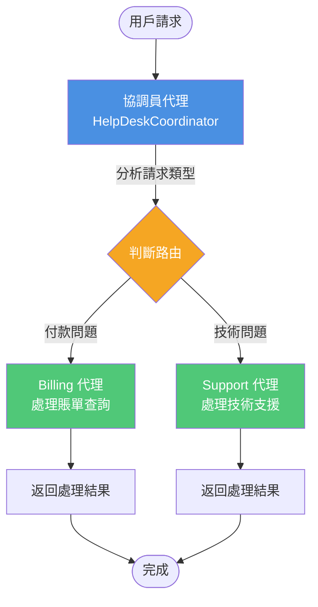
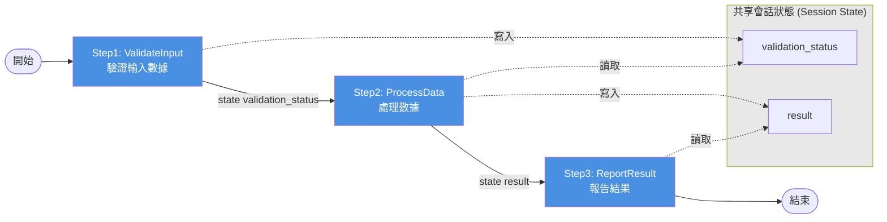
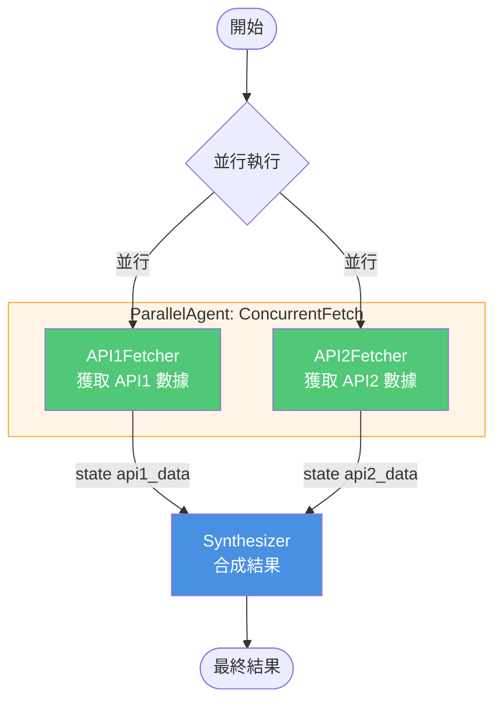
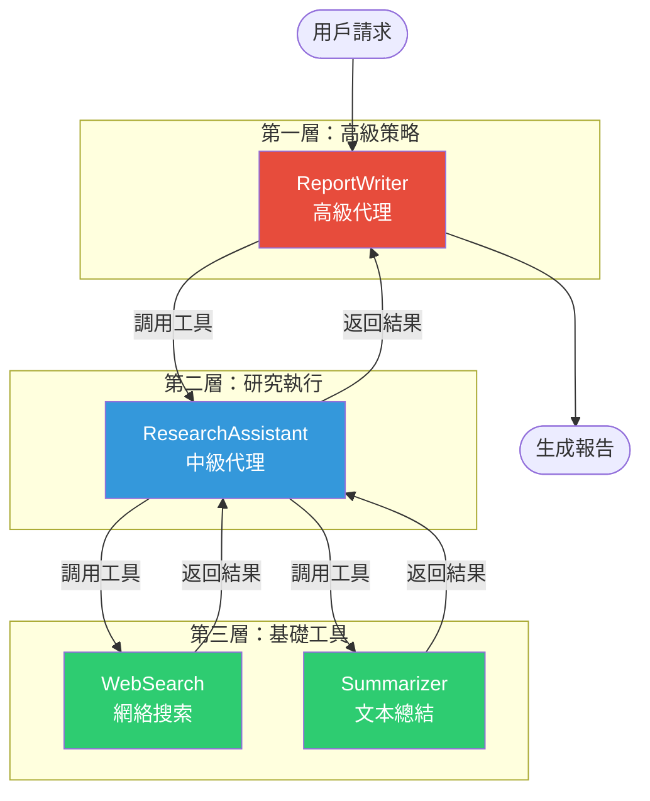
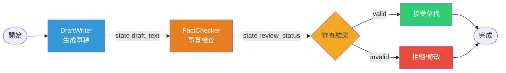
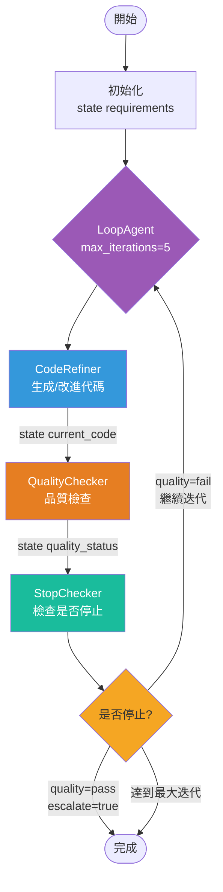
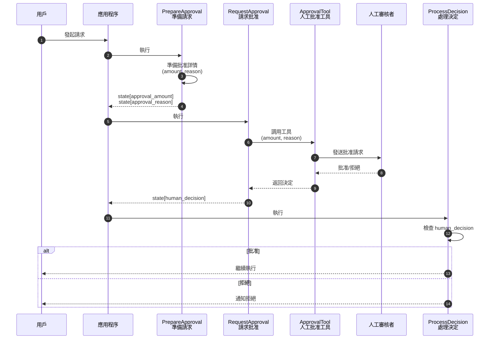
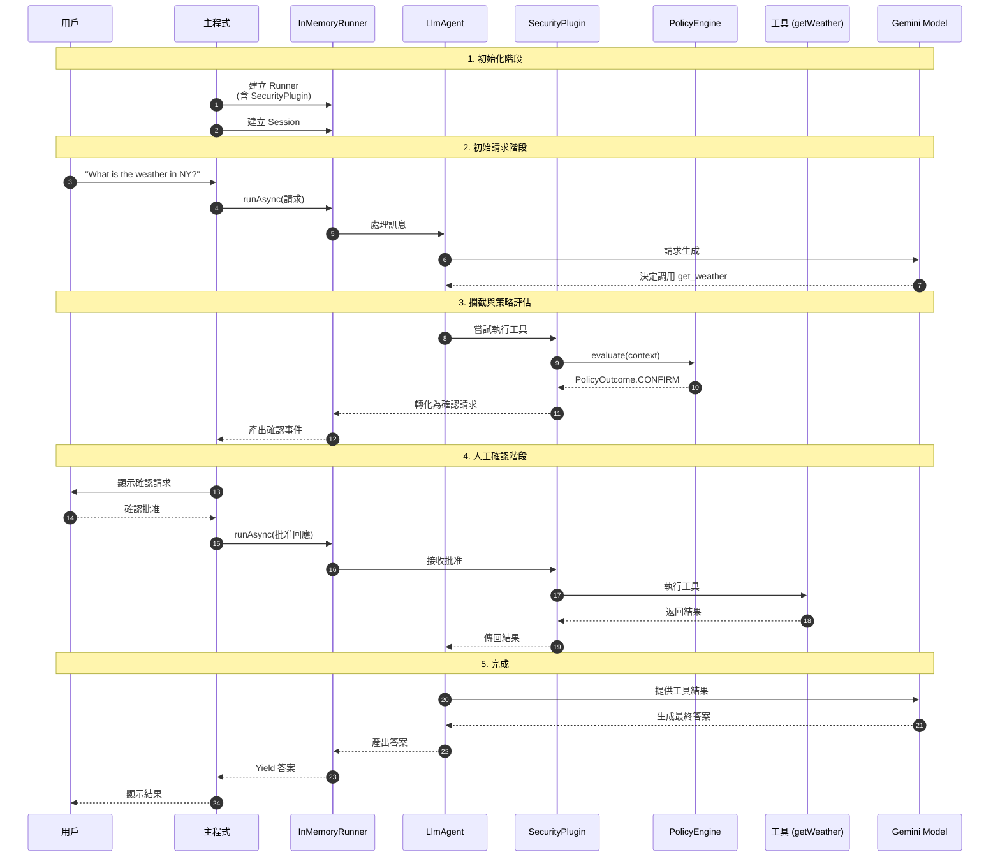

# Mutli-Agent System 模式總覽

## ✏️ 說明
本附錄彙整並分析了 Google ADK 中常見的 Multi-Agent System 模式，涵蓋其核心目標、應用場景及所使用的 ADK 原生內建組件。每個模式均附有 Mermaid 流程圖，幫助理解其運作機制。

### 📊 **應用情境總覽表**

| 群組 | 模式名稱 | 核心目標 | 使用的 ADK 原生內建 | 適用場景 |
|------|---------|---------|------------------|---------|
| **路由類** | 協調員/派遣員模式 (Coordinator/Dispatcher) | 將傳入請求路由到適當的專家代理 | • 層次結構 • LLM 驅動委派 • AgentTool | 客服系統、多功能助手、服務台路由 |
| **流程類** | 順序管線模式 (Sequential Pipeline) | 實現多步驟流程，步驟間傳遞數據 | • SequentialAgent • 共享會話狀態 • output_key | 數據處理管線、多階段驗證、ETL 流程 |
| **並行類** | 並行展開/收集模式 (Parallel Fan-Out/Gather) | 同時執行獨立任務並組合結果 | • ParallelAgent • SequentialAgent • 共享會話狀態 | 多源數據收集、並行 API 查詢、資訊聚合 |
| **分解類** | 層次化任務分解 (Hierarchical Task Decomposition) | 將複雜問題分解為可執行的子任務 | • 多層級層次結構 • LLM 驅動委派 • AgentTool | 研究任務、複雜問題求解、項目規劃 |
| **品質類** | 審查/批評模式 (Review/Critique) | 透過專用代理提高輸出質量 | • SequentialAgent • 共享會話狀態 | 內容審核、品質檢查、事實驗證 |
| **迭代類** | 迭代改進模式 (Iterative Refinement) | 逐步改進結果直到達標 | • LoopAgent • 共享會話狀態 • EventActions.escalate | 代碼優化、文本修訂、持續改進 |
| **協作類** | 人機協同模式 (Human-in-the-Loop) | 整合人工監督與決策 | • 自定義工具 • PolicyEngine • SecurityPlugin | 審批流程、人工覆核、決策支持 |

---

### 🔄 **各模式 Mermaid 流程圖**

#### 1. 協調員/派遣員模式 (Coordinator/Dispatcher Pattern)

#### 2. 順序管線模式 (Sequential Pipeline Pattern)

#### 3. 並行展開/收集模式 (Parallel Fan-Out/Gather Pattern)

#### 4. 層次化任務分解 (Hierarchical Task Decomposition)

#### 5. 審查/批評模式 (Review/Critique Pattern)

#### 6. 迭代改進模式 (Iterative Refinement Pattern)

#### 7. 人機協同模式 (Human-in-the-Loop Pattern)

#### 8. 人機協同模式（策略引擎版本）

---

### 📝 **核心機制說明**

#### **ADK 原生內建組件**

| 組件 | 類型 | 功能 | 應用 |
|------|------|------|------|
| `SequentialAgent` | 工作流代理 | 順序執行子代理 | 管線、流程控制 |
| `ParallelAgent` | 工作流代理 | 並行執行子代理 | 並發處理、資訊收集 |
| `LoopAgent` | 工作流代理 | 循環執行子代理 | 迭代優化、輪詢 |
| `LlmAgent` | LLM 代理 | LLM 驅動的智能代理 | 決策、生成、推理 |
| `AgentTool` | 工具 | 將代理封裝為工具 | 顯式調用、層次結構 |
| `session.state` | 狀態管理 | 共享會話狀態 | 數據傳遞 |
| `transfer_to_agent` | 委派機制 | LLM 驅動的代理轉移 | 動態路由 |
| `PolicyEngine` | 安全機制 | 策略驅動的確認流程 | 人機協同 |

##  Q & A

### **1️⃣ 問：在多代理系統中，使用 `sub_agents` 層次結構與將 Agent 作為 Tool (`AgentTool`) 有何不同？何時應使用哪一種方式？**

在多代理系統中，**使用 `sub_agents` 層次結構**與**將 Agent 作為 Tool (`AgentTool`)** 是兩種不同的設計模式，各自適用於不同的應用場景和需求。以下是它們的主要區別及建議使用情境：

#### 1. 定義與基本概念

*   **使用 `sub_agents` (代理層次結構)**：
    *   這是構建多代理系統的基礎，透過在初始化父代理時傳入 `sub_agents` 列表來建立**樹狀結構**。
    *   此層次結構定義了父代理可以「看見」並進行委派的範圍。
    *   **適用對象**：通常用於「工作流代理」（如順序、並行執行）或「協調員模式」。

*   **將 Agent 作為 Tool (`AgentTool`)**：
    *   這是一種**顯式調用**機制，將一個代理實例封裝在 `AgentTool` 中，並將其放入父代理的 `tools` 列表中。
    *   父代理（必須是 `LlmAgent`）會將該子代理視為一個可以呼叫的**函數或工具**。
    *   **適用對象**：當父代理需要在其當前推理流程中，同步獲取另一個專業代理的執行結果時。
#### 2. 核心差異對比

| 特性 | 使用 `sub_agents` (層次結構) | 將 Agent 作為 Tool (`AgentTool`) |
| :--- | :--- | :--- |
| **控制權轉移** | **控制權切換**：通常透過 `transfer_to_agent` 進行委派，執行焦點會切換到子代理。 | **同步調用**：父代理在自己的流程內運行工具，執行後控制權仍留在父代理手中。 |
| **觸發方式** | **LLM 驅動委派**：LLM 生成 `transfer_to_agent` 呼叫；或由**工作流代理**按邏輯自動觸發。 | **工具呼叫 (Function Calling)**：LLM 生成針對該工具的函數調用（如 `ImageGen(prompt=...)`）。 |
| **互動本質** | **動態與靈活**：適合用於需要將整個任務完全移交給另一個專家處理的情況。 | **受控與明確**：父代理將子代理視為獲取特定資訊或執行特定任務的「組件」。 |
| **通訊方式** | 主要透過**共享會話狀態 (`session.state`)** 進行異步通訊。 | 透過**工具參數與回傳結果**通訊。框架會自動將子代理的狀態更改轉發回父代理。 |
| **角色定義** | 子代理需要有獨特的 `description` 供協調員做出明智的委派決策。 | `AgentTool` 會為 LLM 生成函數聲明，LLM 根據工具描述來判斷何時調用。 |

---

#### 3. 典型應用場景

##### 使用 `sub_agents` 的情境：
*   **協調員模式 (Coordinator/Dispatcher)**：一個主代理接收請求，並將任務**轉移**給專門的帳單或技術支援代理。
*   **工作流編排**：使用 `SequentialAgent` 或 `ParallelAgent` 按固定順序或並行管理多個子代理的執行。
*   **層次化任務分解**：高級代理將複雜目標分解，並透過委派交給低級代理執行。

##### 使用 `AgentTool` 的情境：
*   **整合專門能力**：例如，一個「藝術家代理」調用一個「圖像生成代理」作為工具。藝術家代理撰寫提示詞，呼叫工具後，直接在回傳結果中取得圖像。
*   **層次化研究**：高級代理（如報告撰寫員）使用中級代理（如研究助手）作為工具，並在獲得研究摘要後繼續撰寫報告。

#### 總結建議
*   如果您希望**切換執行焦點**並讓另一個代理接手對話，請使用 **`sub_agents`** 搭配 LLM 委派。
*   如果您希望父代理**保持主導**，僅將另一個代理當作功能擴充來獲取特定結果，請使用 **`AgentTool`**。

---
### **2️⃣ 問：SequentialAgent 與 ParallelAgent 在上下文共享上有何不同？**

在 ADK（Agent Development Kit）中，`SequentialAgent`（順序代理）與 `ParallelAgent`（並行代理）雖然都是用來管理子代理執行流程的「工作流代理」，但它們在**上下文（Context）共享與隔離**的機制上有顯著不同：

#### 1. SequentialAgent：同一個上下文的鏈式傳遞
*   **共享機制：** `SequentialAgent` 會按列表順序一個接一個地執行其子代理，並**順序傳遞「同一個」 `InvocationContext`**。
*   **結果傳遞：** 這種方式允許子代理透過**共享狀態**輕鬆傳遞結果。例如，第一個代理將處理後的數據寫入 `context.state['data']`，後續的代理就能直接讀取並使用該數據。
*   **典型應用：** 非常適合**順序管線模式（Sequential Pipeline）**，例如「驗證數據」→「處理數據」→「生成報告」，其中下一步的執行高度依賴上一步的輸出。

#### 2. ParallelAgent：分支隔離與共享狀態的平衡
*   **上下文分支（Branching）：** 與順序代理不同，`ParallelAgent` 在並行執行子代理時，會為每個子代理**修改 `InvocationContext.branch`**（例如：`ParentBranch.ChildName`）。
*   **歷史記錄隔離：** 這種分支機制提供了**獨特的上下文路徑**，這對於在某些記憶體實現中**隔離各個代理的對話歷史記錄**非常有用，避免多個並行任務的歷史交錯干擾。
*   **共享狀態：** 儘管上下文分支不同，所有並行子代理仍訪問**「同一個共享的」 `session.state`**。這使它們能同時讀取初始狀態並寫入結果。
*   **競爭條件預防：** 來源建議在並行執行時，子代理應**使用不同的狀態鍵（Key）**來存儲結果，以避免寫入時產生競爭條件（Race Condition）。
*   **典型應用：** 適用於**並行展開/收集模式（Parallel Fan-Out/Gather）**，例如同時向多個 API 獲取數據，最後再由一個後續代理彙整存儲在不同鍵值的結果。

#### 差異總結表

| 特性 | SequentialAgent (順序代理) | ParallelAgent (並行代理) |
| :--- | :--- | :--- |
| **上下文傳遞** | 傳遞**完全相同**的 `InvocationContext`。 | 為每個子代理創建**獨立的 `branch` 路徑**。 |
| **主要目的** | 實現**鏈式數據流**，方便後續代理讀取前序結果。 | 實現**執行隔離**，防止並行任務的對話歷史混淆。 |
| **狀態寫入建議** | 可覆蓋或累加同一組鍵值。 | 務必**使用不同鍵值**以避免競爭條件。 |
| **通訊本質** | 異步、被動的管線通訊。 | 同步並發執行，事後匯總結果。 |

簡言之，**`SequentialAgent` 強調「傳承」**，讓數據像接力賽一樣傳遞；而 **`ParallelAgent` 強調「分工與隔離」**，在各自的分支路徑上執行任務，但最終仍將成果匯總到同一個共享儲存區（Session State）中。

---

### **3️⃣ 問：代理如何透過 session.state 達成異步且被動的通訊？**

在 ADK 中，代理透過 `session.state` 達成**異步且被動**的通訊，主要是利用一個**共享的鍵值對（Key-Value）儲存區**，讓不同代理在不同時間點存取相同的數據，而不需要直接互相呼叫或等待。

#### 1. 核心運作機制：寫入與讀取
*   **被動通訊的本質**：通訊並非透過直接的指令發送，而是由一個代理（或其工具）將處理後的數據寫入狀態（例如：`context.state['data_key'] = value`），隨後執行的另一個代理再從中讀取（例如：`data = context.state.get('data_key')`）。
*   **自動化寫入**：`LlmAgent` 提供了一個便捷的 `output_key` 屬性，能自動將代理的最終回應文本或結構化輸出保存到指定的狀態鍵（Key）中，供後續流程使用。

#### 2. 在不同工作流中的應用
*   **順序管線 (Sequential Pipeline)**：這是最典型的應用場景。在 `SequentialAgent` 編排下，多個代理共享同一個 `InvocationContext`。前一個代理透過 `output_key` 存儲結果，後一個代理則在指令中引用該鍵值（例如使用 `{key_name}` 佔位符）來獲取資訊。
*   **並行展開與收集 (Parallel Fan-Out/Gather)**：在 `ParallelAgent` 中，多個子代理雖然在不同的分支路徑執行，但仍存取**同一個共享的 `session.state`**。它們可以同時將各自的結果寫入不同的鍵，隨後的「匯總代理」再統一從狀態中讀取這些數據進行合成。
*   **迭代改進 (Iterative Refinement)**：在 `LoopAgent` 循環中，代理可以讀取上一次迭代存留在 `session.state` 中的輸出，並將改進後的版本覆寫回同一個鍵值，實現跨迭代的數據傳遞。

#### 3. 通訊的層次與隔離
*   **調用上下文共享**：當父代理調用子代理時，會傳遞相同的 `InvocationContext`，這意味著它們共享相同的**臨時狀態 (`temp:`)**，非常適合傳遞僅與當前輪次相關的數據。
*   **避免競爭條件**：在並行執行模式下，雖然狀態是共享的，但來源建議子代理應**使用不同的狀態鍵**來寫入結果，以防止資料競爭（Race Condition）。

#### 總結
這種通訊方式之所以被稱為「被動」，是因為**發送者不指定接收者**，只是將資訊「遺留」在環境中；而稱為「異步」，是因為**數據的產生與消費在時間上是解耦的**，非常適合由工作流代理（如 `SequentialAgent` 或 `LoopAgent`）所管理的結構化協作。

---
### **4️⃣ 問：什麼是 LLM 驅動委派（LLM-Driven Delegation）？它如何運作？**

**LLM 驅動委派（LLM-Driven Delegation）**，在 ADK 中也稱為**代理轉移（Agent Transfer）**，是一種利用大型語言模型的理解能力，動態地將任務路由到層次結構中其他合適代理的機制。

這種機制的核心在於**「控制權的切換」**，讓系統能像人類組織一樣，由一個協調者判斷需求後，將工作交接給特定的專家處理。

以下是其運作機制的詳細說明：

#### 1. 觸發機制：特定的函數調用
當一個 `LlmAgent` 判定當前任務應由另一個代理處理時，它的 LLM 會生成一個特定的**函數調用（Function Call）**：`transfer_to_agent(agent_name='目標代理名稱')`。這並非硬編碼的邏輯，而是 LLM 根據對話上下文做出的自發性決策。

#### 2. 核心運作流程 (透過 AutoFlow)
當 LLM 發出轉移請求後，框架會依序執行以下步驟：
*   **攔截調用**：預設情況下，只要父代理定義了子代理（`sub_agents`）且未禁用轉移功能，ADK 的 `AutoFlow` 機制就會攔截這個 `transfer_to_agent` 呼叫。
*   **識別目標**：框架會使用 `root_agent.find_agent()` 在代理層次結構中尋找匹配名稱的目標代理。
*   **切換執行焦點**：一旦找到目標，框架會**更新 `InvocationContext`（調用上下文）**，將執行焦點從當前代理正式切換到目標代理。

#### 3. 成功的關鍵要素
為了讓 LLM 驅動委派準確運作，開發者必須提供兩項關鍵資訊：
*   **明確的指令 (Instructions)**：發起調用的代理（通常是父代理）需要有清楚的指令，說明**在什麼情況下**應該轉移任務給誰。
*   **獨特的描述 (Descriptions)**：潛在的目標子代理必須具備**獨特且詳盡的描述**，以便父代理的 LLM 能判斷該代理是否具備處理特定任務的專業能力。

#### 4. 委派範圍與配置
轉移的範圍是靈活且可配置的。開發者可以決定代理是否有權將任務轉移給其**父代理、子代理或同級代理（Peers）**。例如，在 Java 實作中，除非特別指定 `disallowTransferToPeers`，否則子代理之間的轉移通常是允許的。

#### 5. 典型應用：協調員模式 (Coordinator Pattern)
這是最常見的應用情境。一個中心協調員（Coordinator）負責接收所有用戶請求，並根據其指令將任務「路由」給專業代理。例如：
*   用戶詢問「付款失敗」，協調員生成 `transfer_to_agent(agent_name='Billing')`。
*   用戶詢問「無法登入」，協調員生成 `transfer_to_agent(agent_name='Support')`。

總結來說，LLM 驅動委派的本質是**基於 LLM 解釋的動態、靈活路由**，它與預先定義好的硬性工作流不同，能更好地處理充滿不確定性的用戶請求。

---

### **5️⃣ 問：在迭代改進模式中，LoopAgent 如何決定何時終止循環？**

在實作「迭代改進模式」（Iterative Refinement Pattern）時，根據來源說明，終止 `LoopAgent` 循環執行主要有兩種機制：一種是**預設的安全閥**，另一種是**基於邏輯的動態跳出**。

以下是詳細的終止方式：

#### 1. 設置最大迭代次數 (`max_iterations`)
這是最基礎的終止保障。在初始化 `LoopAgent` 時，可以透過 `max_iterations` 參數指定循環執行的上限次數。
*   **作用：** 當循環次數達到設定值（例如 5 次或 10 次）時，系統會自動終止，防止因條件始終無法滿足而進入無限循環。
*   **範例：** `LoopAgent(name="...", max_iterations=10, ...)`。

#### 2. 使用「升級」機制動態終止 (`escalate=True`)
這是實現「達到品質閾值即停止」的核心方法。通常會在循環中加入一個專門的**檢查代理（Checker Agent）**，其運作邏輯如下：

*   **檢查狀態：** 檢查代理會從共享的 `session.state` 中讀取當前任務的狀態或品質評估結果（例如：`quality_status == "pass"` 或 `status == "completed"`）。
*   **發送升級事件：** 如果滿足終止條件，該代理會產出一個帶有 `escalate=True` 旗標的 **`Event`（事件）**。
*   **終止流程：** 一旦 `LoopAgent` 接收到 `escalate` 為 `True` 的動作，它會立即停止後續子代理的執行並退出循環。

#### 各語言實作概念參考
*   **Python:** 在自定義代理中 `yield Event(..., actions=EventActions(escalate=True))`。
*   **TypeScript:** 使用 `yield createEvent({ ..., actions: createEventActions({ escalate: true }) })`。
*   **Go:** 回傳 `session.Event{Actions: session.EventActions{Escalate: true}}`。
*   **Java:** 透過 `EventActions.builder().escalate(true).build()` 構建事件並發出。

總結來說，實務上通常會**兩者並行**：由專門的檢查代理負責在任務完成時「主動升級」以跳出循環，並設定 `max_iterations` 作為最後的「被動防線」。