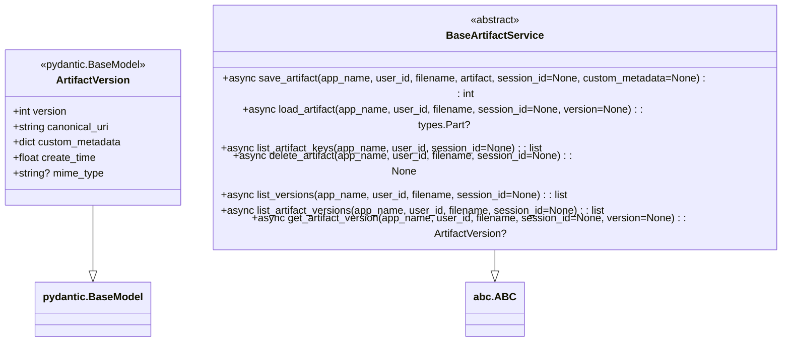

# Artifacts

🔔 `更新日期：2026-01-18`

  [`ADK 支援`: `Python v0.1.0` | `TypeScript v0.2.0` | `Go v0.1.0` | `Java v0.1.0`]

在 ADK 中，**Artifacts** 代表了一種關鍵機制，用於管理與特定使用者互動工作階段 (session) 相關聯，或跨多個工作階段與使用者持續關聯的具名、版本化二進位資料。它們允許您的 Agent 和工具處理簡單字串以外的資料，實現涉及檔案、影像、音訊和其他二進位格式的更豐富互動。

> [!NOTE]
    原生應用 (primitives) 的具體參數或方法名稱可能因 SDK 語言而略有不同（例如，Python 中的 `save_artifact`，Java 中的 `saveArtifact`）。請參閱特定語言的 API 文件以獲取詳細資訊。

## Overview (目錄)

| 章節                       | 說明                                                                                   |
| :------------------------- | :------------------------------------------------------------------------------------- |
| **什麼是 Artifacts？**     | 定義 Artifacts 為具名、版本化的二進位資料，並說明其在 ADK 中的表示方式。               |
| **Artifacts 的範圍**       | 解釋 Artifacts 如何與特定工作階段或使用者關聯，以及 `scope` 參數的作用。               |
| **儲存 Artifacts**         | 說明如何使用 `save_artifact` 函式儲存新的 Artifact 或建立現有 Artifact 的新版本。      |
| **列出與擷取 Artifacts**   | 描述如何使用 `list_artifacts` 查詢可用 Artifacts，並使用 `get_artifact` 擷取特定版本。 |
| **刪除 Artifacts**         | 說明如何使用 `delete_artifact` 永久刪除 Artifact 及其所有版本。                        |
| **在工具中使用 Artifacts** | 展示如何在自訂工具中接收、處理及回傳 Artifacts，以實現更複雜的互動。                   |
| **使用案例**               | 提供 Artifacts 在實際應用中的範例，例如處理上傳的檔案或產生圖表。                      |
| **API 參考**               | 提供與 Artifacts 相關的核心函式簽章和參數說明。                                        |


## 什麼是 Artifacts？

*   **定義：** Artifact 本質上是一塊二進位資料（如檔案內容），在特定範圍（工作階段或使用者）內由唯一的 `filename` 字串識別。每次儲存具有相同檔名的 Artifact 時，都會建立一個新版本。

*   **表示法：** Artifacts 一律使用標準的 `google.genai.types.Part` 物件表示。核心資料通常儲存在 `Part` 的內聯資料結構中（透過 `inline_data` 存取），該結構本身包含：
    *   `data`：作為位元組的原始二進位內容。
    *   `mime_type`：表示資料類型的字串（例如 `"image/png"`、`"application/pdf"`）。這對於日後正確解讀資料至關重要。

<details>
<summary>範例說明</summary>

> Python

```py
# Artifact 如何表示為 types.Part 的範例
import google.genai.types as types

# 假設 'image_bytes' 包含 PNG 圖片的二進位資料
image_bytes = b'\x89PNG\r\n\x1a\n...' # 實際圖片位元組的佔位符

image_artifact = types.Part(
    inline_data=types.Blob(
        mime_type="image/png",
        data=image_bytes
    )
)

# 您也可以使用便利建構函數：
# image_artifact_alt = types.Part.from_bytes(data=image_bytes, mime_type="image/png")

print(f"Artifact MIME 類型: {image_artifact.inline_data.mime_type}")
print(f"Artifact 資料 (前 10 個位元組): {image_artifact.inline_data.data[:10]}...")
```

> TypeScript

```typescript
import type { Part } from '@google/genai';
import { createPartFromBase64 } from '@google/genai';

// 假設 'imageBytes' 包含 PNG 圖片的二進位資料
const imageBytes = new Uint8Array([0x89, 0x50, 0x4e, 0x47, 0x0d, 0x0a, 0x1a, 0x0a]); // 佔位符

const imageArtifact: Part = createPartFromBase64(imageBytes.toString('base64'), "image/png");

console.log(`Artifact MIME 類型: ${imageArtifact.inlineData?.mimeType}`);
// 注意：存取原始位元組需要從 base64 解碼。
```

> Go

```go
import (
  "log"

  "google.golang.org/genai"
)

// 建立包含影像資料的位元組切片。
imageBytes, err := os.ReadFile("image.png")
if err != nil {
    log.Fatalf("讀取影像檔案失敗: %v", err)
}

// 使用影像資料建立新的 artifact。
imageArtifact := &genai.Part{
    InlineData: &genai.Blob{
        MIMEType: "image/png",
        Data:     imageBytes,
    },
}
log.Printf("Artifact MIME 類型: %s", imageArtifact.InlineData.MIMEType)
log.Printf("Artifact 資料 (前 8 個位元組): %x...", imageArtifact.InlineData.Data[:8])
```

> Java

```java
import com.google.genai.types.Part;
import java.nio.charset.StandardCharsets;

public class ArtifactExample {
    public static void main(String[] args) {
        // 假設 'imageBytes' 包含 PNG 圖片的二進位資料
        byte[] imageBytes = {(byte) 0x89, (byte) 0x50, (byte) 0x4E, (byte) 0x47, (byte) 0x0D, (byte) 0x0A, (byte) 0x1A, (byte) 0x0A, (byte) 0x01, (byte) 0x02}; // 實際圖片位元組的佔位符

        // 使用 Part.fromBytes 建立影像 artifact
        Part imageArtifact = Part.fromBytes(imageBytes, "image/png");

        System.out.println("Artifact MIME 類型: " + imageArtifact.inlineData().get().mimeType().get());
        System.out.println(
            "Artifact 資料 (前 10 個位元組): "
                + new String(imageArtifact.inlineData().get().data().get(), 0, 10, StandardCharsets.UTF_8)
                + "...");
    }
}
```

</details>

*   **持久性與管理：** Artifacts 不直接儲存在 Agent 或工作階段狀態 (state) 中。它們的儲存和檢索由專用的 **Artifact Service**（`BaseArtifactService` 的實作，定義於 `google.adk.artifacts`）管理。ADK 提供了各種實作，例如：
    *   用於測試或暫存的記憶體內服務（例如 Python 中的 `InMemoryArtifactService`，定義於 `google.adk.artifacts.in_memory_artifact_service.py`）。
    *   使用 Google Cloud Storage (GCS) 進行持久儲存的服務（例如 Python 中的 `GcsArtifactService`，定義於 `google.adk.artifacts.gcs_artifact_service.py`）。
    所選的服務實作會在您儲存資料時自動處理版本控制。

## 為何使用 Artifacts？

雖然工作階段 `state` 適合儲存少量的組態設定或對話上下文（如字串、數字、布林值或小型字典/列表），但 Artifacts 專為涉及二進位或大型資料的情境而設計：

1.  **處理非文字資料：** 輕鬆儲存和檢索影像、音訊片段、影片片段、PDF、試算表或任何其他與您的 Agent 功能相關的檔案格式。
2.  **持久化大型資料：** 工作階段狀態通常未針對儲存大量資料進行最佳化。Artifacts 提供了一種專用機制來持久化較大的二進位大型物件 (blobs)，而不會讓工作階段狀態變得雜亂。
3.  **使用者檔案管理：** 提供功能讓使用者上傳檔案（可儲存為 Artifacts）並檢索或下載由 Agent 產生的檔案（從 Artifacts 載入）。
4.  **分享輸出：** 啟用工具或 Agent 產生二進位輸出（如 PDF 報告或生成的影像），這些輸出可透過 `save_artifact` 儲存，並由應用程式的其他部分，甚至在後續的工作階段中存取（如果使用使用者命名空間）。
5.  **快取二進位資料：** 將產生二進位資料的計算昂貴操作的結果（例如渲染複雜的圖表影像）儲存為 Artifacts，以避免在後續請求中重新產生它們。

本質上，每當您的 Agent 需要處理需要持久化、版本化或共享的類檔案二進位資料時，由 `ArtifactService` 管理的 Artifacts 是 ADK 中的適當機制。

## 常見使用案例

Artifacts 提供了一種靈活的方式來處理 ADK 應用程式中的二進位資料。

以下是一些證明其價值的典型場景：

*   **生成的報告/檔案：**
    *   工具或 Agent 產生報告（例如 PDF 分析、CSV 資料匯出、影像圖表）。

*   **處理使用者上傳：**
    *   使用者透過前端介面其上傳檔案（例如用於分析的影像、用於摘要的文件）。

*   **儲存中間二進位結果：**
    *   Agent 執行複雜的多步驟流程，其中一個步驟會產生中間二進位資料（例如音訊合成、模擬結果）。

*   **持久性使用者資料：**
    *   儲存非簡單鍵值狀態的使用者特定組態或資料。

*   **快取生成的二進位內容：**
    *   Agent 根據特定輸入頻繁產生相同的二進位輸出（例如公司標誌影像、標準音訊問候語）。

## 核心概念

理解 Artifacts 涉及掌握幾個關鍵組件：管理它們的服務、用於保存它們的資料結構，以及它們如何被識別和版本化。

### Artifact Service (`BaseArtifactService`)

*   **角色：** 負責 Artifacts 實際儲存和檢索邏輯的中心組件。它定義了 *如何* 以及 *在哪裡* 持久化 Artifacts。

*   **介面：** 由抽象基底類別 `BaseArtifactService` 定義。任何具體實作都必須提供以下方法：
    *   `Save Artifact`：儲存 Artifact 資料並傳回其分配的版本號。
    *   `Load Artifact`：檢索特定版本（或最新版本）的 Artifact。
    *   `List Artifact keys`：列出給定範圍內的 Artifact 之唯一檔名。
    *   `Delete Artifact`：移除 Artifact（可能包括其所有版本，取決於實作）。
    *   `List versions`：列出特定 Artifact 檔名的所有可用版本號。

*   **組態：** 您在初始化 `Runner` 時提供一個 Artifact Service 的實例（例如 `InMemoryArtifactService`、`GcsArtifactService`）。`Runner` 隨後透過 `InvocationContext` 將此服務提供給 Agent 和工具。

#### 詳細類別說明：可參考 [base_artifact_service.py](https://github.com/google/adk-python/blob/main/src/google/adk/artifacts/base_artifact_service.py)

---
<details>
<summary>範例說明</summary>

> Python

```py
from google.adk.runners import Runner
from google.adk.artifacts import InMemoryArtifactService # 或 GcsArtifactService
from google.adk.agents import LlmAgent # 任何 agent
from google.adk.sessions import InMemorySessionService

# 範例：使用 Artifact Service 配置 Runner
my_agent = LlmAgent(name="artifact_user_agent", model="gemini-2.0-flash")
artifact_service = InMemoryArtifactService() # 選擇一個實作
session_service = InMemorySessionService()

runner = Runner(
    agent=my_agent,
    app_name="my_artifact_app",
    session_service=session_service,
    artifact_service=artifact_service # 在此提供服務實例
)
# 現在，由此 runner 管理的執行 (runs) 中的 context 可以使用 artifact 方法
```

> TypeScript

```typescript
import { InMemoryRunner } from '@google/adk';
import { LlmAgent } from '@google/adk';
import { InMemoryArtifactService } from '@google/adk';

// 範例：使用 Artifact Service 配置 Runner
const myAgent = new LlmAgent({name: "artifact_user_agent", model: "gemini-2.5-flash"});
const artifactService = new InMemoryArtifactService(); // 選擇一個實作
const sessionService = new InMemoryArtifactService();

const runner = new InMemoryRunner({
    agent: myAgent,
    appName: "my_artifact_app",
    sessionService: sessionService,
    artifactService: artifactService, // 在此提供服務實例
});
// 現在，由此 runner 管理的執行 (runs) 中的 context 可以使用 artifact 方法
```

> Go

```go
import (
  "context"
  "log"

  "google.golang.org/adk/agent/llmagent"
  "google.golang.org/adk/artifactservice"
  "google.golang.org/adk/llm/gemini"
  "google.golang.org/adk/runner"
  "google.golang.org/adk/sessionservice"
  "google.golang.org/genai"
)

// 建立新的 context。
ctx := context.Background()
// 設定應用程式名稱。
const appName = "my_artifact_app"
// 建立新的 Gemini 模型。
model, err := gemini.NewModel(ctx, "gemini-2.5-flash", &genai.ClientConfig{})
if err != nil {
    log.Fatalf("建立模型失敗: %v", err)
}

// 建立新的 LLM agent。
myAgent, err := llmagent.New(llmagent.Config{
    Model:       model,
    Name:        "artifact_user_agent",
    Instruction: "你是一個描述影像的 agent。",
    BeforeModelCallbacks: []llmagent.BeforeModelCallback{
        BeforeModelCallback,
    },
})
if err != nil {
    log.Fatalf("建立 agent 失敗: %v", err)
}

// 建立記憶體內 artifact 服務。
artifactService := artifact.InMemoryService()
// 建立記憶體內 session 服務。
sessionService := session.InMemoryService()

// 建立新的 runner。
r, err := runner.New(runner.Config{
    Agent:           myAgent,
    AppName:         appName,
    SessionService:  sessionService,
    ArtifactService: artifactService, // 在此提供 artifact 服務實例
})
if err != nil {
    log.Fatalf("建立 runner 失敗: %v", err)
}
log.Printf("Runner 建立成功: %v", r)
```

> Java

```java
import com.google.adk.agents.LlmAgent;
import com.google.adk.runner.Runner;
import com.google.adk.sessions.InMemorySessionService;
import com.google.adk.artifacts.InMemoryArtifactService;

// 範例：使用 Artifact Service 配置 Runner
LlmAgent myAgent =  LlmAgent.builder()
  .name("artifact_user_agent")
  .model("gemini-2.0-flash")
  .build();
InMemoryArtifactService artifactService = new InMemoryArtifactService(); // 選擇一個實作
InMemorySessionService sessionService = new InMemorySessionService();

Runner runner = new Runner(myAgent, "my_artifact_app", artifactService, sessionService); // 在此提供服務實例
// 現在，由此 runner 管理的執行 (runs) 中的 context 可以使用 artifact 方法
```

</details>

### Artifact 資料

*   **標準表示法：** Artifact 內容一律使用 `google.genai.types.Part` 物件表示，這與 LLM 訊息部分的結構相同。

*   **關鍵屬性 (`inline_data`)：** 對於 Artifacts，最相關的屬性是 `inline_data`，這是一個 `google.genai.types.Blob` 物件，包含：

    *   `data` (`bytes`)：Artifact 的原始二進位內容。
    *   `mime_type` (`str`)：描述二進位資料性質的標準 MIME 類型字串（例如 `'application/pdf'`、`'image/png'`、`'audio/mpeg'`）。**這對於載入 Artifact 時的正確解讀至關重要。**

<details>
<summary>範例說明</summary>

> Python

```python
import google.genai.types as types

# 範例：從原始位元組建立 artifact Part
pdf_bytes = b'%PDF-1.4...' # 您的原始 PDF 資料
pdf_mime_type = "application/pdf"

# 使用建構函數
pdf_artifact_py = types.Part(
    inline_data=types.Blob(data=pdf_bytes, mime_type=pdf_mime_type)
)

# 使用便利類別方法（等效）
pdf_artifact_alt_py = types.Part.from_bytes(data=pdf_bytes, mime_type=pdf_mime_type)

print(f"已建立具有 MIME 類型的 Python artifact: {pdf_artifact_py.inline_data.mime_type}")
```

> TypeScript

```typescript
import type { Part } from '@google/genai';
import { createPartFromBase64 } from '@google/genai';

# 範例：從原始位元組建立 artifact Part
const pdfBytes = new Uint8Array([0x25, 0x50, 0x44, 0x46, 0x2d, 0x31, 0x2e, 0x34]); // 您的原始 PDF 資料
const pdfMimeType = "application/pdf";

const pdfArtifact: Part = createPartFromBase64(pdfBytes.toString('base64'), pdfMimeType);
console.log(`已建立具有 MIME 類型的 TypeScript artifact: ${pdfArtifact.inlineData?.mimeType}`);
```

> Go

```go
import (
    "log"
    "os"

    "google.golang.org/genai"
)

// 從檔案讀取 imageBytes
imageBytes, err := os.ReadFile("image.png")
if err != nil {
        log.Fatalf("讀取影像檔案失敗: %v", err)
}

// genai.NewPartFromBytes 是一個便利函式，可快速建立帶有 InlineData 欄位的 &genai.Part。
// 使用影像資料建立新的 artifact。
imageArtifact := genai.NewPartFromBytes([]byte(imageBytes), "image/png")

log.Printf("Artifact MIME 類型: %s", imageArtifact.InlineData.MIMEType)
```

> Java

```java
import com.google.genai.types.Blob;
import com.google.genai.types.Part;
import java.nio.charset.StandardCharsets;

public class ArtifactDataExample {
  public static void main(String[] args) {
    // Example: Creating an artifact Part from raw bytes
    byte[] pdfBytes = "%PDF-1.4...".getBytes(StandardCharsets.UTF_8); // Your raw PDF data
    String pdfMimeType = "application/pdf";

    // Using the Part.fromBlob() constructor with a Blob
    Blob pdfBlob = Blob.builder()
        .data(pdfBytes)
        .mimeType(pdfMimeType)
        .build();
    Part pdfArtifactJava = Part.builder().inlineData(pdfBlob).build();

    // Using the convenience static method Part.fromBytes() (equivalent)
    Part pdfArtifactAltJava = Part.fromBytes(pdfBytes, pdfMimeType);

    // Accessing mimeType, note the use of Optional
    String mimeType = pdfArtifactJava.inlineData()
        .flatMap(Blob::mimeType)
        .orElse("unknown");
    System.out.println("Created Java artifact with MIME type: " + mimeType);

    // Accessing data
    byte[] data = pdfArtifactJava.inlineData()
        .flatMap(Blob::data)
        .orElse(new byte[0]);
    System.out.println("Java artifact data (first 10 bytes): "
        + new String(data, 0, Math.min(data.length, 10), StandardCharsets.UTF_8) + "...");
  }
}
```

</details>

### 檔名 (Filename)

*   **識別符 (Identifier)：** 用於在其特定命名空間內命名和檢索 Artifact 的簡單字串。
*   **唯一性 (Uniqueness)：** 檔名在其範圍內（工作階段或使用者命名空間）必須是唯一的。
*   **最佳實務 (Best Practice)：** 使用具描述性的名稱，可能包含副檔名（例如 `"monthly_report.pdf"`、`"user_avatar.jpg"`），儘管副檔名本身並不決定行為——`mime_type` 才是決定的關鍵。

### 版本控制 (Versioning)

*   **自動版本控制 (Automatic Versioning)：** Artifact Service 自動處理版本控制。當您呼叫 `save_artifact` 時，服務會為該特定檔名和範圍確定下一個可用的版本號（通常從 0 開始遞增）。
*   **由 `save_artifact` 傳回：** `save_artifact` 方法傳回分配給新儲存的 Artifact 的整數版本號。
*   **檢索 (Retrieval)：**
  *   `load_artifact(..., version=None)`（預設）：檢索 Artifact 的 *最新* 可用版本。
  *   `load_artifact(..., version=N)`：檢索特定版本 `N`。
*   **列出版本 (Listing Versions)：** `list_versions` 方法（在服務上，而非 context）可用於尋找 Artifact 檔名的所有現有版本號。

### 命名空間 (工作階段 (Session) vs. 使用者 (User))

*   **概念：** Artifacts 的範圍可以限定於特定工作階段，或更廣泛地跨應用程式內的所有工作階段與使用者關聯。此範圍由 `filename` 格式決定，並由 `ArtifactService` 內部處理。

*   **預設（工作階段範圍）：** 如果您使用像 `"report.pdf"` 這樣的純檔名，該 Artifact 將與特定的 `app_name`、`user_id` *和* `session_id` 相關聯。它只能在該確切的工作階段 context 中存取。

*   **使用者範圍（`"user:"` 前綴）：** 如果您在檔名前加上 `"user:"`，例如 `"user:profile.png"`，該 Artifact 僅與 `app_name` 和 `user_id` 相關聯。它可以從該使用者在應用程式內的 *任何* 工作階段存取或更新。

<details>
<summary>範例說明</summary>

> Python

```python
# 說明命名空間差異的範例（概念性）

# 工作階段特定 artifact 檔名
session_report_filename = "summary.txt"

# 使用者特定 artifact 檔名
user_config_filename = "user:settings.json"

# 當透過 context.save_artifact 儲存 'summary.txt' 時，
# 它與當前的 app_name、user_id 和 session_id 綁定。

# 當透過 context.save_artifact 儲存 'user:settings.json' 時，
# ArtifactService 實作應識別 "user:" 前綴
# 並將其範圍限定為 app_name 和 user_id，使其可供該使用者的跨工作階段存取。
```

> TypeScript

```typescript
// 說明命名空間差異的範例（概念性）

// 工作階段特定 artifact 檔名
const sessionReportFilename = "summary.txt";

// 使用者特定 artifact 檔名
const userConfigFilename = "user:settings.json";

// 當透過 context.saveArtifact 儲存 'summary.txt' 時，它與當前的 appName、userId 和 sessionId 綁定。
// 當透過 context.saveArtifact 儲存 'user:settings.json' 時，ArtifactService 實作識別 "user:" 前綴並將其範圍限定為 appName 和 userId，使其可供該使用者的跨工作階段存取。
```

> Go

```go
import (
    "log"
)

// 注意：命名空間僅在使用 GCS ArtifactService 實作時支援。
// 工作階段範圍的 artifact 僅能在當前工作階段中存取。
sessionReportFilename := "summary.txt"
// 使用者範圍的 artifact 可在該使用者的所有工作階段中存取。
userConfigFilename := "user:settings.json"

// 當透過 ctx.Artifacts().Save 儲存 'summary.txt' 時，
// 它會綁定至當前的 app_name、user_id 和 session_id。
// ctx.Artifacts().Save(sessionReportFilename, *artifact);

// 當透過 ctx.Artifacts().Save 儲存 'user:settings.json' 時，
// ArtifactService 實作應識別 "user:" 前綴，
// 並將其範圍限定為 app_name 和 user_id，使其可供該使用者跨工作階段存取。
// ctx.Artifacts().Save(userConfigFilename, *artifact);
```

> Java

```java
// 說明命名空間差異的範例（概念性）

// 工作階段特定 artifact 檔名
String sessionReportFilename = "summary.txt";

// 使用者特定 artifact 檔名
String userConfigFilename = "user:settings.json"; // "user:" 前綴是關鍵

// 當透過 context.save_artifact 儲存 'summary.txt' 時，
// 它與當前的 app_name、user_id 和 session_id 綁定。
// artifactService.saveArtifact(appName, userId, sessionId1, sessionReportFilename, someData);

// 當透過 context.save_artifact 儲存 'user:settings.json' 時，
// ArtifactService 實作應識別 "user:" 前綴
// 並將其範圍限定為 app_name 和 user_id，使其可供該使用者的跨工作階段存取。
// artifactService.saveArtifact(appName, userId, sessionId1, userConfigFilename, someData);
```

</details>

這些核心概念共同提供了一個靈活的系統，用於在 ADK 框架內管理二進位資料。

## 與 Artifacts 互動 (透過 Context 物件)

在 Agent 邏輯中（特別是在回調或工具中）與 Artifacts 互動的主要方式，是透過 `CallbackContext` 和 `ToolContext` 物件提供的方法。這些方法抽象化了由 `ArtifactService` 管理的底層儲存細節。

### 先決條件：配置 `ArtifactService`

在您能夠透過 context 物件使用任何 artifact 方法之前，您 **必須** 在初始化 `Runner` 時提供 [`BaseArtifactService` 實作](#可用的實作) 的實例（如 [`InMemoryArtifactService`](#inmemoryartifactservice) 或 [`GcsArtifactService`](#gcsartifactservice)）。

<details>
<summary>範例說明</summary>

> Python

在 Python 中，您在初始化 `Runner` 時提供此實例。

```python
from google.adk.runners import Runner
from google.adk.artifacts import InMemoryArtifactService # 或 GcsArtifactService
from google.adk.agents import LlmAgent
from google.adk.sessions import InMemorySessionService

# 您的 agent 定義
agent = LlmAgent(name="my_agent", model="gemini-2.0-flash")

# 實例化所需的 artifact service
artifact_service = InMemoryArtifactService()

# 提供給 Runner
runner = Runner(
    agent=agent,
    app_name="artifact_app",
    session_service=InMemorySessionService(),
    artifact_service=artifact_service # 必須在此提供服務
)
```
如果在 `InvocationContext` 中未配置 `artifact_service`（如果未傳遞給 `Runner` 就會發生這種情況），在 context 物件上呼叫 `save_artifact`、`load_artifact` 或 `list_artifacts` 將引發 `ValueError`。

> TypeScript

```typescript
import { LlmAgent, InMemoryRunner, InMemoryArtifactService } from '@google/adk';

// 您的 agent 定義
const agent = new LlmAgent({name: "my_agent", model: "gemini-2.5-flash"});

// 實例化所需的 artifact service
const artifactService = new InMemoryArtifactService();

// 提供給 Runner
const runner = new InMemoryRunner({
    agent: agent,
    appName: "artifact_app",
    sessionService: new InMemoryArtifactService(),
    artifactService: artifactService, // 必須在此提供服務
});
// 如果未配置 artifactService，在 context 物件上呼叫 artifact 方法將拋出錯誤。
```


> Go

```go
import (
  "context"
  "log"

  "google.golang.org/adk/agent/llmagent"
  "google.golang.org/adk/artifactservice"
  "google.golang.org/adk/llm/gemini"
  "google.golang.org/adk/runner"
  "google.golang.org/adk/sessionservice"
  "google.golang.org/genai"
)

// 建立新的 context。
ctx := context.Background()
// 設定應用程式名稱。
const appName = "my_artifact_app"
// 建立新的 Gemini 模型。
model, err := gemini.NewModel(ctx, "gemini-2.5-flash", &genai.ClientConfig{})
if err != nil {
    log.Fatalf("建立模型失敗: %v", err)
}

// 建立新的 LLM agent。
myAgent, err := llmagent.New(llmagent.Config{
    Model:       model,
    Name:        "artifact_user_agent",
    Instruction: "你是一個描述影像的 agent。",
    BeforeModelCallbacks: []llmagent.BeforeModelCallback{
        BeforeModelCallback,
    },
})
if err != nil {
    log.Fatalf("建立 agent 失敗: %v", err)
}

// 建立記憶體內 artifact 服務。
artifactService := artifact.InMemoryService()
// 建立記憶體內 session 服務。
sessionService := session.InMemoryService()

// 建立新的 runner。
r, err := runner.New(runner.Config{
    Agent:           myAgent,
    AppName:         appName,
    SessionService:  sessionService,
    ArtifactService: artifactService, // 在此提供 artifact 服務實例
})
if err != nil {
    log.Fatalf("建立 runner 失敗: %v", err)
}
log.Printf("Runner 建立成功: %v", r)
```

> Java

在 Java 中，您將實例化 `BaseArtifactService` 實作，然後確保管理 Artifacts 的應用程式部分可以存取它。這通常透過依賴注入或明確傳遞服務實例來完成。

```java
import com.google.adk.agents.LlmAgent;
import com.google.adk.artifacts.InMemoryArtifactService; // 或 GcsArtifactService
import com.google.adk.runner.Runner;
import com.google.adk.sessions.InMemorySessionService;

public class SampleArtifactAgent {

  public static void main(String[] args) {

    // 您的 agent 定義
    LlmAgent agent = LlmAgent.builder()
        .name("my_agent")
        .model("gemini-2.0-flash")
        .build();

    // 實例化所需的 artifact service
    InMemoryArtifactService artifactService = new InMemoryArtifactService();

    // 提供給 Runner
    Runner runner = new Runner(agent,
        "APP_NAME",
        artifactService, // 必須在此提供服務
        new InMemorySessionService());

  }
}
```
在 Java 中，如果嘗試進行 artifact 操作時 `ArtifactService` 實例不可用（例如 `null`），通常會導致 `NullPointerException` 或自訂錯誤，具體取決於您的應用程式結構。穩健的應用程式通常使用依賴注入框架來管理服務生命週期並確保可用性。
</details>

### 存取方法

Artifact 互動方法可直接在 `CallbackContext`（傳遞給 Agent 和模型回調）和 `ToolContext`（傳遞給工具回調）的實例上使用。請記住，`ToolContext` 繼承自 `CallbackContext`。

#### 儲存 Artifacts

*   **程式碼範例：**

<details>
<summary>範例說明</summary>

> Python

```python
import google.genai.types as types
from google.adk.agents.callback_context import CallbackContext # 或 ToolContext

async def save_generated_report_py(context: CallbackContext, report_bytes: bytes):
    """將產生的 PDF 報告位元組儲存為 artifact。"""
    report_artifact = types.Part.from_bytes(
        data=report_bytes,
        mime_type="application/pdf"
    )
    filename = "generated_report.pdf"

    try:
        version = await context.save_artifact(filename=filename,        artifact=report_artifact)
        print(f"成功將 Python artifact '{filename}' 儲存為版本 {version}。")
        # 此回調後產生的事件將包含：
        # event.actions.artifact_delta == {"generated_report.pdf": version}
    except ValueError as e:
        print(f"儲存 Python artifact 時發生錯誤：{e}。Runner 中是否配置了 ArtifactService？")
    except Exception as e:
        # 處理潛在的儲存錯誤（例如 GCS 權限）
        print(f"儲存 Python artifact 期間發生意外錯誤：{e}")

# --- 範例使用概念 (Python) ---
# async def main_py():
#   callback_context: CallbackContext = ... # 取得 context
#   report_data = b'...' # 假設這保存了 PDF 位元組
#   await save_generated_report_py(callback_context, report_data)
```

> TypeScript

```typescript
import type { Part } from '@google/genai';
import { createPartFromBase64 } from '@google/genai';
import { CallbackContext } from '@google/adk';

async function saveGeneratedReport(context: CallbackContext, reportBytes: Uint8Array): Promise<void> {
    /**將產生的 PDF 報告位元組儲存為 artifact。*/
    const reportArtifact: Part = createPartFromBase64(reportBytes.toString('base64'), "application/pdf");

    const filename = "generated_report.pdf";

    try {
        const version = await context.saveArtifact(filename, reportArtifact);
        console.log(`成功將 TypeScript artifact '{filename}' 儲存為版本 {version}。`);
    } catch (e: any) {
        console.error(`儲存 TypeScript artifact 時發生錯誤：{e.message}。Runner 中是否配置了 ArtifactService？`);
    }
}
```

> Go

```go
import (
  "log"

  "google.golang.org/adk/agent"
  "google.golang.org/adk/llm"
  "google.golang.org/genai"
)

// saveReportCallback 是一個 BeforeModel 回呼，用於從 session 狀態儲存報告。
func saveReportCallback(ctx agent.CallbackContext, req *model.LLMRequest) (*model.LLMResponse, error) {
    // 從 session 狀態取得報告資料。
    reportData, err := ctx.State().Get("report_bytes")
    if err != nil {
        log.Printf("在 session 狀態中找不到報告資料: %v", err)
        return nil, nil // 沒有報告可儲存，正常繼續。
    }

    // 檢查報告資料是否為預期格式。
    reportBytes, ok := reportData.([]byte)
    if !ok {
        log.Printf("session 狀態中的報告資料不是預期的位元組格式。")
        return nil, nil
    }

    // 使用報告資料建立新的 artifact。
    reportArtifact := &genai.Part{
        InlineData: &genai.Blob{
            MIMEType: "application/pdf",
            Data:     reportBytes,
        },
    }
    // 設定 artifact 的檔名。
    filename := "generated_report.pdf"
    // 將 artifact 儲存到 artifact service。
    _, err = ctx.Artifacts().Save(ctx, filename, reportArtifact)
    if err != nil {
        log.Printf("Go artifact 儲存期間發生非預期錯誤: %v", err)
        // 根據需求，您可能需要回傳錯誤給使用者。
        return nil, nil
    }
    log.Printf("成功儲存 Go artifact '%s'。", filename)
    // 回傳 nil 以繼續下一個回呼或模型。
    return nil, nil
}
```

> Java

```java
import com.google.adk.agents.CallbackContext;
import com.google.adk.artifacts.BaseArtifactService;
import com.google.adk.artifacts.InMemoryArtifactService;
import com.google.genai.types.Part;
import java.nio.charset.StandardCharsets;

public class SaveArtifactExample {

public void saveGeneratedReport(CallbackContext callbackContext, byte[] reportBytes) {
// 將產生的 PDF 報告位元組儲存為 artifact。
Part reportArtifact = Part.fromBytes(reportBytes, "application/pdf");
String filename = "generatedReport.pdf";

    callbackContext.saveArtifact(filename, reportArtifact);
    System.out.println("成功儲存 Java artifact '" + filename);
    // 此回調後產生的事件將包含：
    // event().actions().artifactDelta == {"generated_report.pdf": version}
}

// --- 範例使用概念 (Java) ---
public static void main(String[] args) {
    BaseArtifactService service = new InMemoryArtifactService(); // 或 GcsArtifactService
    SaveArtifactExample myTool = new SaveArtifactExample();
    byte[] reportData = "...".getBytes(StandardCharsets.UTF_8); // PDF bytes
    CallbackContext callbackContext; // ... 從您的應用程式取得 callback context
    myTool.saveGeneratedReport(callbackContext, reportData);
    // 由於非同步特性，在真實應用程式中，確保程式等待或處理完成。
  }
}
```

</details>

#### 載入 Artifacts

*   **程式碼範例：**

<details>
<summary>範例說明</summary>

> Python

```python
import google.genai.types as types
from google.adk.agents.callback_context import CallbackContext # 或 ToolContext

async def process_latest_report_py(context: CallbackContext):
    """載入最新的報告 artifact 並處理其資料。"""
    filename = "generated_report.pdf"
    try:
        # 載入最新版本
        report_artifact = await context.load_artifact(filename=filename)

        if report_artifact and report_artifact.inline_data:
            print(f"成功載入最新的 Python artifact '{filename}'。")
            print(f"MIME 類型: {report_artifact.inline_data.mime_type}")
            # 處理 report_artifact.inline_data.data (位元組)
            pdf_bytes = report_artifact.inline_data.data
            print(f"報告大小: {len(pdf_bytes)} bytes。")
            # ... 進一步處理 ...
        else:
            print(f"找不到 Python artifact '{filename}'。")

        # 範例：載入特定版本（如果版本 0 存在）
        # specific_version_artifact = await context.load_artifact(filename=filename, version=0)
        # if specific_version_artifact:
        #     print(f"已載入 '{filename}' 的版本 0。")

    except ValueError as e:
        print(f"載入 Python artifact 時發生錯誤：{e}。是否配置了 ArtifactService？")
    except Exception as e:
        # 處理潛在的儲存錯誤
        print(f"載入 Python artifact 期間發生意外錯誤：{e}")

# --- 範例使用概念 (Python) ---
# async def main_py():
#   callback_context: CallbackContext = ... # 取得 context
#   await process_latest_report_py(callback_context)
```

> TypeScript

```typescript
import { CallbackContext } from '@google/adk';

async function processLatestReport(context: CallbackContext): Promise<void> {
    /**載入最新的報告 artifact 並處理其資料。*/
    const filename = "generated_report.pdf";
    try {
        // 載入最新版本
        const reportArtifact = await context.loadArtifact(filename);

        if (reportArtifact?.inlineData) {
            console.log(`成功載入最新的 TypeScript artifact '{filename}'。`);
            console.log(`MIME 類型: {reportArtifact.inlineData.mimeType}`);
            // 處理 reportArtifact.inlineData.data (base64 字串)
            const pdfData = Buffer.from(reportArtifact.inlineData.data, 'base64');
            console.log(`報告大小: {pdfData.length} bytes。`);
            // ... 進一步處理 ...
        } else {
            console.log(`找不到 TypeScript artifact '{filename}'。`);
        }

    } catch (e: any) {
        console.error(`載入 TypeScript artifact 時發生錯誤：{e.message}。是否配置了 ArtifactService？`);
    }
}
```

> Go

```go
import (
  "log"

  "google.golang.org/adk/agent"
  "google.golang.org/adk/llm"
)

// loadArtifactsCallback 是一個 BeforeModel 回呼，用於載入特定 artifact 並將其內容加入 LLM 請求。
func loadArtifactsCallback(ctx agent.CallbackContext, req *model.LLMRequest) (*model.LLMResponse, error) {
    log.Println("[Callback] loadArtifactsCallback 觸發。")
    // 在真實應用中，您會解析使用者請求以取得檔名。
    // 此範例為展示，直接指定檔名。
    const filenameToLoad = "generated_report.pdf"

    // 從 artifact service 載入 artifact。
    loadedPartResponse, err := ctx.Artifacts().Load(ctx, filenameToLoad)
    if err != nil {
        log.Printf("回呼無法載入 artifact '%s': %v", filenameToLoad, err)
        return nil, nil // 找不到檔案或錯誤，繼續模型流程。
    }

    loadedPart := loadedPartResponse.Part

    log.Printf("回呼成功載入 artifact '%s'。", filenameToLoad)

    // 確保請求至少有一個 content 可供加入 artifact。
    if len(req.Contents) == 0 {
        req.Contents = []*genai.Content{{Parts: []*genai.Part{
            genai.NewPartFromText("SYSTEM: 以下檔案已提供作為上下文：\n"),
        }}}
    }

    // 將載入的 artifact 加入模型請求。
    lastContent := req.Contents[len(req.Contents)-1]
    lastContent.Parts = append(lastContent.Parts, loadedPart)
    log.Printf("已將 artifact '%s' 加入 LLM 請求。", filenameToLoad)

    // 回傳 nil 以繼續下一個回呼或模型。
    return nil, nil // 繼續下一個回呼或 LLM 呼叫
}
```

> Java

```java
import com.google.adk.artifacts.BaseArtifactService;
import com.google.genai.types.Part;
import io.reactivex.rxjava3.core.MaybeObserver;
import io.reactivex.rxjava3.disposables.Disposable;
import java.util.Optional;

public class MyArtifactLoaderService {

    private final BaseArtifactService artifactService;
    private final String appName;

    public MyArtifactLoaderService(BaseArtifactService artifactService, String appName) {
        this.artifactService = artifactService;
        this.appName = appName;
    }

    public void processLatestReportJava(String userId, String sessionId, String filename) {
        // 透過傳遞 Optional.empty() 作為版本來載入最新版本
        artifactService
                .loadArtifact(appName, userId, sessionId, filename, Optional.empty())
                .subscribe(
                        new MaybeObserver<Part>() {
                            @Override
                            public void onSubscribe(Disposable d) {
                                // 可選：處理訂閱
                            }

                            @Override
                            public void onSuccess(Part reportArtifact) {
                                System.out.println(
                                        "成功載入最新的 Java artifact '" + filename + "'。");
                                reportArtifact
                                        .inlineData()
                                        .ifPresent(
                                                blob -> {
                                                    System.out.println(
                                                            "MIME 類型: " + blob.mimeType().orElse("N/A"));
                                                    byte[] pdfBytes = blob.data().orElse(new byte[0]);
                                                    System.out.println("報告大小: " + pdfBytes.length + " bytes。");
                                                    // ... 進一步處理 pdfBytes ...
                                                });
                            }

                            @Override
                            public void onError(Throwable e) {
                                // 處理潛在的儲存錯誤或其他異常
                                System.err.println(
                                        "載入 Java artifact '"
                                                + filename
                                                + "' 期間發生錯誤: "
                                                + e.getMessage());
                            }

                            @Override
                            public void onComplete() {
                                // 如果找不到 artifact（最新版本）則呼叫
                                System.out.println("找不到 Java artifact '" + filename + "'。");
                            }
                        });

        // 範例：載入特定版本（例如版本 0）
        /*
        artifactService.loadArtifact(appName, userId, sessionId, filename, Optional.of(0))
            .subscribe(part -> {
                System.out.println("Loaded version 0 of Java artifact '" + filename + "'.");
            }, throwable -> {
                System.err.println("Error loading version 0 of '" + filename + "': " + throwable.getMessage());
            }, () -> {
                System.out.println("Version 0 of Java artifact '" + filename + "' not found.");
            });
        */
    }

    // --- 範例使用概念 (Java) ---
    public static void main(String[] args) {
        // BaseArtifactService service = new InMemoryArtifactService(); // 或 GcsArtifactService
        // MyArtifactLoaderService loader = new MyArtifactLoaderService(service, "myJavaApp");
        // loader.processLatestReportJava("user123", "sessionABC", "java_report.pdf");
        // 由於非同步特性，在真實應用程式中，確保程式等待或處理完成。
    }
}
```

</details>

#### 列出 Artifact 檔名

*   **程式碼範例：**

<details>
<summary>範例說明</summary>

> Python

```python
from google.adk.tools.tool_context import ToolContext

def list_user_files_py(tool_context: ToolContext) -> str:
    """列出使用者可用 artifact 的工具。"""
    try:
        available_files = await tool_context.list_artifacts()
        if not available_files:
            return "您沒有已儲存的 artifacts。"
        else:
            # 為使用者/LLM 格式化列表
            file_list_str = "\n".join([f"- {fname}" for fname in available_files])
            return f"這是您可用的 Python artifacts：\n{file_list_str}"
    except ValueError as e:
        print(f"列出 Python artifacts 時發生錯誤：{e}。是否配置了 ArtifactService？")
        return "錯誤：無法列出 Python artifacts。"
    except Exception as e:
        print(f"列出 Python artifacts 期間發生意外錯誤：{e}")
        return "錯誤：列出 Python artifacts 時發生意外錯誤。"

# 此函數通常會被包裝在 FunctionTool 中
# from google.adk.tools import FunctionTool
# list_files_tool = FunctionTool(func=list_user_files_py)
```

> TypeScript

```typescript
import { ToolContext } from '@google/adk';

async function listUserFiles(toolContext: ToolContext): Promise<string> {
    /**列出使用者可用 artifact 的工具。*/
    try {
        const availableFiles = await toolContext.listArtifacts();
        if (!availableFiles || availableFiles.length === 0) {
            return "您沒有已儲存的 artifacts。";
        } else {
            # 為使用者/LLM 格式化列表
            const fileListStr = availableFiles.map(fname => `- ${fname}`).join("\n");
            return `這是您可用的 TypeScript artifacts：\n${fileListStr}`;
        }
    } catch (e: any) {
        console.error(`列出 TypeScript artifacts 時發生錯誤：{e.message}。是否配置了 ArtifactService？`);
        return "錯誤：無法列出 TypeScript artifacts。";
    }
}
```

> Go

```go
import (
  "fmt"
  "log"
  "strings"

  "google.golang.org/adk/agent"
  "google.golang.org/adk/llm"
  "google.golang.org/genai"
)

// listUserFilesCallback 是一個 BeforeModel 回呼，用於列出可用的 artifacts
// 並將檔案列表作為 context 加入 LLM 請求。
func listUserFilesCallback(ctx agent.CallbackContext, req *model.LLMRequest) (*model.LLMResponse, error) {
    log.Println("[Callback] listUserFilesCallback 觸發。")
    // 從 artifact service 列出可用的 artifacts。
    listResponse, err := ctx.Artifacts().List(ctx)
    if err != nil {
        log.Printf("Go artifact 列表期間發生非預期錯誤: %v", err)
        return nil, nil // 繼續，但記錄錯誤。
    }

    availableFiles := listResponse.FileNames

    log.Printf("找到 %d 個可用檔案。", len(availableFiles))

    // 如果有可用檔案，則將其加入 LLM 請求。
    if len(availableFiles) > 0 {
        var fileListStr strings.Builder
        fileListStr.WriteString("SYSTEM: 以下檔案可用：\n")
        for _, fname := range availableFiles {
            fileListStr.WriteString(fmt.Sprintf("- %s\n", fname))
        }
        // 將此資訊加到使用者的模型請求前面。
        if len(req.Contents) > 0 {
            lastContent := req.Contents[len(req.Contents)-1]
            if len(lastContent.Parts) > 0 {
                fileListStr.WriteString("\n") // 加一個換行分隔。
                lastContent.Parts[0] = genai.NewPartFromText(fileListStr.String() + lastContent.Parts[0].Text)
                log.Println("已將檔案列表加入 LLM 請求 context。")
            }
        }
        log.Printf("可用檔案：\n%s", fileListStr.String())
    } else {
        log.Println("沒有找到可列出的檔案。")
    }

    // 回傳 nil 以繼續下一個回呼或模型。
    return nil, nil // 繼續下一個回呼或 LLM 呼叫
}
```

> Java

```java
import com.google.adk.artifacts.BaseArtifactService;
import com.google.adk.artifacts.ListArtifactsResponse;
import com.google.common.collect.ImmutableList;
import io.reactivex.rxjava3.core.SingleObserver;
import io.reactivex.rxjava3.disposables.Disposable;

public class MyArtifactListerService {

    private final BaseArtifactService artifactService;
    private final String appName;

    public MyArtifactListerService(BaseArtifactService artifactService, String appName) {
        this.artifactService = artifactService;
        this.appName = appName;
    }

    // 可能由工具或 agent 邏輯呼叫的範例方法
    public void listUserFilesJava(String userId, String sessionId) {
        artifactService
                .listArtifactKeys(appName, userId, sessionId)
                .subscribe(
                        new SingleObserver<ListArtifactsResponse>() {
                            @Override
                            public void onSubscribe(Disposable d) {
                                // 可選：處理訂閱
                            }

                            @Override
                            public void onSuccess(ListArtifactsResponse response) {
                                ImmutableList<String> availableFiles = response.filenames();
                                if (availableFiles.isEmpty()) {
                                    System.out.println(
                                            "使用者 "
                                                    + userId
                                                    + " 在工作階段 "
                                                    + sessionId
                                                    + " 中沒有已儲存的 Java artifacts。");
                                } else {
                                    StringBuilder fileListStr =
                                            new StringBuilder(
                                                    "這是使用者 "
                                                            + userId
                                                            + " 在工作階段 "
                                                            + sessionId
                                                            + " 中可用的 Java artifacts：\n");
                                    for (String fname : availableFiles) {
                                        fileListStr.append("- ").append(fname).append("\n");
                                    }
                                    System.out.println(fileListStr.toString());
                                }
                            }

                            @Override
                            public void onError(Throwable e) {
                                System.err.println(
                                        "列出使用者 "
                                                + userId
                                                + " 在工作階段 "
                                                + sessionId
                                                + " 的 Java artifacts 時發生錯誤: "
                                                + e.getMessage());
                                // 在真實應用程式中，您可能會向使用者/LLM 傳回錯誤訊息
                            }
                        });
    }

    // --- 範例使用概念 (Java) ---
    public static void main(String[] args) {
        // BaseArtifactService service = new InMemoryArtifactService(); // 或 GcsArtifactService
        // MyArtifactListerService lister = new MyArtifactListerService(service, "myJavaApp");
        // lister.listUserFilesJava("user123", "sessionABC");
        // 由於非同步特性，在真實應用程式中，確保程式等待或處理完成。
    }
}
```

</details>

## 可用的實作

ADK 提供了 `BaseArtifactService` 介面的具體實作，提供適合各種開發階段和部署需求的後端儲存。這些實作根據 `app_name`、`user_id`、`session_id` 和 `filename`（包括 `user:` 命名空間前綴）處理 Artifact 資料的儲存、版本控制和檢索細節。

### InMemoryArtifactService

*   **儲存機制：**
    *   Python：使用保存在應用程式記憶體中的 Python 字典 (`self.artifacts`)。字典鍵代表 artifact 路徑，值是 `types.Part` 的列表，其中每個列表元素都是一個版本。
    *   Java：使用保存在記憶體中的巢狀 `HashMap` 實例 (`private final Map<String, Map<String, Map<String, Map<String, List<Part>>>>> artifacts;`)。每個層級的鍵分別是 `appName`、`userId`、`sessionId` 和 `filename`。最內層的 `List<Part>` 儲存 artifact 的版本，其中列表索引對應於版本號。
*   **主要特點：**
    *   **簡單：** 除了核心 ADK 函式庫外，不需要外部設定或相依性。
    *   **速度：** 操作通常非常快，因為涉及記憶體內映射/字典查詢和列表操作。
    *   **短暫：** 當應用程式程序終止時，所有儲存的 artifacts 都會 **遺失**。資料不會在應用程式重新啟動之間持久保存。
*   **使用案例：**
    *   非常適合不需要持久性的本地開發和測試。
    *   適用於短期演示或 artifact 資料在應用程式單次執行中純粹是暫時的場景。
*   **實例化：**

<details>
<summary>範例說明</summary>

> Python

```python
from google.adk.artifacts import InMemoryArtifactService

# 簡單地實例化類別
in_memory_service_py = InMemoryArtifactService()

# 然後將其傳遞給 Runner
# runner = Runner(..., artifact_service=in_memory_service_py)
```

> TypeScript

```typescript
import { InMemoryArtifactService } from '@google/adk';

# 簡單地實例化類別
const inMemoryService = new InMemoryArtifactService();

# 然後將此實例提供給您的 Runner。
# const runner = new InMemoryRunner({
#     /* 其他服務 */,
#     artifactService: inMemoryService
# });
```

> Go

```go
import (
    "google.golang.org/adk/artifactservice"
)


// 簡單地實例化服務
artifactService := artifact.InMemoryService()
log.Printf("InMemoryArtifactService (Go) 已實例化: %T", artifactService)

// 在您的 runner 中使用此服務
// r, _ := runner.New(runner.Config{
//  Agent:           agent,
//  AppName:         "my_app",
//  SessionService:  sessionService,
//  ArtifactService: artifactService,
// })
```

> Java

```java
import com.google.adk.artifacts.BaseArtifactService;
import com.google.adk.artifacts.InMemoryArtifactService;

public class InMemoryServiceSetup {
    public static void main(String[] args) {
        // 簡單地實例化類別
        BaseArtifactService inMemoryServiceJava = new InMemoryArtifactService();

        System.out.println("InMemoryArtifactService (Java) 已實例化: " + inMemoryServiceJava.getClass().getName());

        // 然後將此實例提供給您的 Runner。
        // Runner runner = new Runner(
        //     /* 其他服務 */,
        //     inMemoryServiceJava
        // );
    }
}
```

</details>

### GcsArtifactService


*   **儲存機制：** 利用 Google Cloud Storage (GCS) 進行持久的 artifact 儲存。每個版本的 artifact 都作為單獨的物件 (blob) 儲存在指定的 GCS bucket 中。
*   **物件命名約定：** 它使用分層路徑結構建構 GCS 物件名稱 (blob 名稱)。
*   **主要特點：**
    *   **持久性：** 儲存在 GCS 中的 Artifacts 在應用程式重新啟動和部署之間持續存在。
    *   **可擴展性：** 利用 Google Cloud Storage 的可擴展性和耐用性。
    *   **版本控制：** 明確地將每個版本儲存為不同的 GCS 物件。`GcsArtifactService` 中的 `saveArtifact` 方法。
    *   **所需權限：** 應用程式環境需要適當的憑證（例如 Application Default Credentials）和 IAM 權限才能讀取和寫入指定的 GCS bucket。
*   **使用案例：**
    *   需要持久 artifact 儲存的生產環境。
    *   需要在不同應用程式實例或服務之間共享 artifacts 的場景（透過存取相同的 GCS bucket）。
    *   需要長期儲存和檢索使用者或工作階段資料的應用程式。
*   **實例化：**

<details>
<summary>範例說明</summary>

> Python

```python
from google.adk.artifacts import GcsArtifactService

# 指定 GCS bucket 名稱
gcs_bucket_name_py = "your-gcs-bucket-for-adk-artifacts" # 替換為您的 bucket 名稱

try:
    gcs_service_py = GcsArtifactService(bucket_name=gcs_bucket_name_py)
    print(f"Python GcsArtifactService 已為 bucket 初始化: {gcs_bucket_name_py}")
    # 確保您的環境有權限存取此 bucket。
    # 例如，透過 Application Default Credentials (ADC)

    # 然後將其傳遞給 Runner
    # runner = Runner(..., artifact_service=gcs_service_py)

except Exception as e:
    # 捕捉 GCS 客戶端初始化期間的潛在錯誤（例如 auth 問題）
    print(f"初始化 Python GcsArtifactService 時發生錯誤: {e}")
    # 適當地處理錯誤 - 可能是回退到 InMemory 或拋出異常
```

> Java

```java
import com.google.adk.artifacts.BaseArtifactService;
import com.google.adk.artifacts.GcsArtifactService;
import com.google.cloud.storage.Storage;
import com.google.cloud.storage.StorageOptions;

public class GcsServiceSetup {
    public static void main(String[] args) {
        // 指定 GCS bucket 名稱
        String gcsBucketNameJava = "your-gcs-bucket-for-adk-artifacts"; // 請替換為您的 bucket 名稱

        try {
            // 初始化 GCS Storage 客戶端。
            // 預設會使用 Application Default Credentials。
            // 請確保環境已正確設定（例如設置 GOOGLE_APPLICATION_CREDENTIALS）。
            Storage storageClient = StorageOptions.getDefaultInstance().getService();

            // 實例化 GcsArtifactService
            BaseArtifactService gcsServiceJava =
                    new GcsArtifactService(gcsBucketNameJava, storageClient);

            System.out.println(
                    "Java GcsArtifactService 已初始化，bucket 名稱: " + gcsBucketNameJava);

            // 此實例可提供給您的 Runner。
            // Runner runner = new Runner(
            //     /* 其他服務 */,
            //     gcsServiceJava
            // );

        } catch (Exception e) {
            // 捕捉 GCS 客戶端初始化期間的潛在錯誤（例如認證、權限）
            System.err.println("初始化 Java GcsArtifactService 時發生錯誤: " + e.getMessage());
            e.printStackTrace();
            // 請適當處理錯誤
        }
    }
}
```

</details>

選擇適當的 `ArtifactService` 實作取決於您的應用程式對資料持久性、可擴展性和操作環境的需求。

## 最佳實務

為了有效且可維護地使用 artifacts：

*   **選擇正確的服務：** 用 `InMemoryArtifactService` 進行快速原型製作、測試以及不需要持久性的場景。用 `GcsArtifactService`（或您自己實作的 `BaseArtifactService` 以用於其他後端）於需要資料持久性和可擴展性的生產環境。
*   **有意義的檔名：** 使用清晰、具描述性的檔名。包含相關的副檔名（`.pdf`、`.png`、`.wav`）有助於人類理解內容，儘管 `mime_type` 決定了程式處理方式。建立臨時與持久 artifact 名稱的約定。
*   **指定正確的 MIME 類型：** 在為 `save_artifact` 建立 `types.Part` 時，務必提供準確的 `mime_type`。這對於稍後 `load_artifact` 以正確解讀 `bytes` 資料的應用程式或工具至關重要。盡可能使用標準 IANA MIME 類型。
*   **了解版本控制：** 記住，沒有特定 `version` 參數的 `load_artifact()` 會檢索 *最新* 版本。如果您的邏輯依賴於 artifact 的特定歷史版本，請務必在載入時提供整數版本號。
*   **謹慎使用命名空間 (`user:`)：** 僅當資料真正屬於使用者且應跨所有工作階段存取時，才對檔名使用 `"user:"` 前綴。對於特定於單個對話或工作階段的資料，使用沒有前綴的常規檔名。
*   **錯誤處理：**
    *   在呼叫 context 方法（`save_artifact`、`load_artifact`、`list_artifacts`）之前，務必檢查是否實際配置了 `artifact_service`——如果服務為 `None`，它們將引發 `ValueError`。
    *   檢查 `load_artifact` 的返回值，因為如果 artifact 或版本不存在，它將是 `None`。不要假設它總是傳回 `Part`。
    *   準備好處理來自底層儲存服務的異常，特別是 `GcsArtifactService`（例如權限問題的 `google.api_core.exceptions.Forbidden`，如果 bucket 不存在則為 `NotFound`，網路錯誤）。
*   **大小考量：** Artifacts 適用於典型的檔案大小，但要注意極大檔案的潛在成本和效能影響，特別是在雲端儲存方面。如果儲存許多大型 artifacts，`InMemoryArtifactService` 可能會消耗大量記憶體。評估非常大的資料是否最好透過直接 GCS 連結或其他專門的儲存解決方案處理，而不是在記憶體中傳遞整個位元組陣列。
*   **清理策略：** 對於像 `GcsArtifactService` 這樣的持久儲存，artifacts 會一直保留直到被明確刪除。如果 artifacts 代表臨時資料或壽命有限，請實作清理策略。這可能涉及：
    *   在 bucket 上使用 GCS 生命週期策略。
    *   建構利用 `artifact_service.delete_artifact` 方法的特定工具或管理功能（注意：為了安全起見，刪除 *未* 透過 context 物件公開）。
    *   仔細管理檔名以允許基於模式的刪除（如果需要）。
