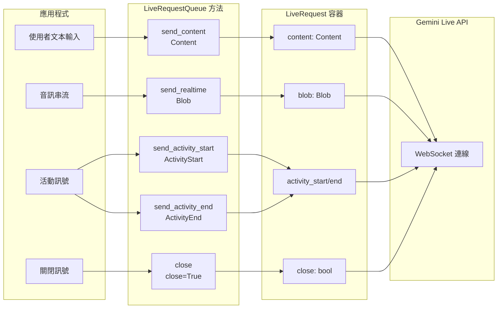

# 第 2 部分：使用 LiveRequestQueue 發送訊息

> 🔔 `更新日期：2026-02-01`
>
> 🔗 `資料來源`：https://google.github.io/adk-docs/streaming/dev-guide/part2/

在第 1 部分中，您了解了 ADK 雙向串流（Bidi-streaming）應用程式的四階段生命週期。本部分將重點放在上游流程——您的應用程式如何使用 `LiveRequestQueue` 向 Agent 發送訊息。

與傳統 API 中不同訊息類型需要不同端點或通道的情況不同，ADK 通過 `LiveRequestQueue` 及其 `LiveRequest` 訊息模型提供了一個統一的介面。本部分涵蓋：

- **訊息類型**：通過 `send_content()` 發送文本，通過 `send_realtime()` 串流音訊/影像/視訊，使用活動訊號控制對話輪次，以及使用控制訊號優雅地終止會話
- **並發模式**：了解非同步隊列管理和事件迴圈（event-loop）線程安全性
- **最佳實踐**：在非同步上下文中創建隊列，確保正確的資源清理，並了解訊息排序保證
- **故障排除**：診斷常見問題，如訊息未被處理和隊列生命週期問題

了解 `LiveRequestQueue` 對於建構反應迅速的串流應用程式至關重要，這些應用程式可以在非同步事件迴圈中無縫處理多模態輸入。

## LiveRequestQueue 與 LiveRequest

`LiveRequestQueue` 是您在串流對話中向 Agent 發送訊息的主要介面。ADK 不需管理單獨的文本、音訊和控制訊號通道，而是提供了一個統一的 `LiveRequest` 容器，通過一個簡潔的 API 處理所有訊息類型：

原始碼參考：[live_request_queue.py](https://github.com/google/adk-python/blob/29c1115959b0084ac1169748863b35323da3cf50/src/google/adk/agents/live_request_queue.py)

```python
class LiveRequest(BaseModel):
    content: Optional[Content] = None           # 基於文本的內容和結構化數據
    blob: Optional[Blob] = None                 # 音訊/視訊數據和二進位串流
    activity_start: Optional[ActivityStart] = None  # 信號：使用者活動開始
    activity_end: Optional[ActivityEnd] = None      # 信號：使用者活動結束
    close: bool = False                         # 優雅連線終止訊號
```

這種流線型設計可以處理您會遇到的所有串流情景。`content` 和 `blob` 欄位處理不同的數據類型，`activity_start` 和 `activity_end` 欄位啟用活動信號，而 `close` 標誌提供優雅的終止語義。

`content` 和 `blob` 欄位是互斥的——每個 LiveRequest 只能設置其中一個。雖然 ADK 在用戶端不強制執行此操作，並且如果設置了兩個欄位也會嘗試發送，但 Live API 後端將拒絕並返回驗證錯誤。ADK 的便利方法 `send_content()` 和 `send_realtime()` 通過僅設置一個欄位自動確保滿足此約束，因此 **建議使用這些方法（而不是手動創建 `LiveRequest` 對象）**。

下圖說明了不同類型的訊息如何從您的應用程式通過 `LiveRequestQueue` 方法流向 `LiveRequest` 容器，最後流向 Live API：



## 發送不同的訊息類型

`LiveRequestQueue` 提供了發送不同訊息類型給 Agent 的便利方法。本節展示了文本訊息、音訊/視訊串流、手動輪次控制的活動訊號以及會話終止的實際模式。

### send_content()：發送輪次對話文本

`send_content()` 方法以輪次模式發送文本訊息，其中每條訊息代表一個離散的對話輪次。這向模型發出一個完整輪次的訊號，觸發立即生成回應。

範例實作：[main.py:194-199](https://github.com/google/adk-samples/blob/31847c0723fbf16ddf6eed411eb070d1c76afd1a/python/agents/bidi-demo/app/main.py#L194-L199)


```python
# 建立 Content 物件，包含來自 json_message 的文本
content = types.Content(parts=[types.Part(text=json_message["text"])])
# 透過隊列發送內容
live_request_queue.send_content(content)
```

**在 ADK 雙向串流中使用 Content 和 Part：**

- **`Content`** (`google.genai.types.Content`)：代表對話中單個訊息或輪次的容器。它保存一個 `Part` 物件陣列，共同構成完整的訊息。
- **`Part`** (`google.genai.types.Part`)：訊息中的各個內容片段。對於使用 Live API 的 ADK 雙向串流，您將使用：
- `text`：您發送給模型的文本內容（包括程式碼）

在實踐中，大多數訊息在 ADK 雙向串流中僅使用單個文本 Part。多部分結構適用於以下情景：

- 將文本與函式回應（由 ADK 自動處理）混合
- 將文本說明與結構化數據結合
- 未來對新內容類型的擴展性

對於 Live API，多模態輸入（音訊/視訊）使用不同的機制（參見下文 `send_realtime()`），而不是多部分 Content。

> [!NOTE] ADK 雙向串流中的 Content 和 Part 使用
雖然 Gemini API 的 `Part` 類型支援許多欄位（`inline_data`、`file_data`、`function_call`、`function_response` 等），但大多數欄位要麼由 ADK 自動處理，要麼在 Live API 中使用不同的機制：
> - **函式呼叫**：ADK 自動處理函式呼叫迴圈——從模型接收函式呼叫、執行您註冊的函式並將回應發回。您不需要手動建構這些。
> - **影像/視訊**：請勿將 `send_content()` 與 `inline_data` 一起使用。相反，請使用 `send_realtimez(Blob(mime_type="image/jpeg", data=...))` 進行持續串流。參見 [第 5 部分：如何使用影像和視訊](part5.md#如何使用圖片與影片)。

### send_realtime()：發送即時音訊、影像和視訊

`send_realtime()` 方法發送二進位數據串流——主要是音訊、影像和視訊——通過 `Blob` 類型進行傳輸，該類型以即時模式處理傳輸。與在輪次模式下處理的文本內容不同，Blob 專為數據以分塊形式到達的持續串流情景而設計。您提供原始位元組（bytes），Pydantic 在 JSON 序列化期間會自動處理 base64 編碼，以確保安全的網路傳輸（在 `LiveRequest.model_config` 中配置）。MIME 類型幫助模型理解內容格式。

範例實作：[main.py:181-184](https://github.com/google/adk-samples/blob/31847c0723fbf16ddf6eed411eb070d1c76afd1a/python/agents/bidi-demo/app/main.py#L181-L184)

```python
# 建立包含音訊數據的 Blob 物件
audio_blob = types.Blob(
    mime_type="audio/pcm;rate=16000",
    data=audio_data
)
# 透過隊列發送即時音訊
live_request_queue.send_realtime(audio_blob)
```

> [!NOTE] 了解更多
有關音訊、影像和視訊規格、格式和最佳實踐的完整詳細資訊，請參見 [第 5 部分：如何使用音訊、影像和視訊](https://google.github.io/adk-docs/streaming/dev-guide/part5/index.md)。

### 活動訊號 (Activity Signals)

活動訊號（`ActivityStart`/`ActivityEnd`）**只能**在您的 `RunConfig` 中**明確停用**自動（伺服器端）語音活動檢測（VAD）時發送。當您的應用程式需要手動控制語音活動時，請使用它們，例如：

- **一鍵通（Push-to-talk）介面**：使用者明確控制他們說話的時間（例如，按住按鈕）
- **喧鬧環境**：背景雜訊使自動 VAD 不可靠，因此您使用用戶端 VAD 或手動控制
- **用戶端 VAD**：您在用戶端實作自己的 VAD 演算法，僅在檢測到語音時發送音訊，以減少網路開銷
- **自定義交互模式**：非語音情景，如手勢觸發的交互或定時音訊片段

**活動訊號告訴模型什麼：**

- `ActivityStart`：「使用者現在正在說話——開始累積音訊以便處理」
- `ActivityEnd`：「使用者已說完——處理累積的音訊並生成回應」

如果沒有這些訊號（當停用 VAD 時），模型不知道何時開始/停止聽取語音，因此您必須明確標記輪次邊界。

**發送活動訊號：**

```python
from google.genai import types

# 手動活動訊號模式（例如，一鍵通）
live_request_queue.send_activity_start()  # 訊號：使用者開始說話

# 當使用者按住通話按鈕時串流音訊塊
while user_is_holding_button:
    audio_blob = types.Blob(mime_type="audio/pcm;rate=16000", data=audio_chunk)
    live_request_queue.send_realtime(audio_blob)

live_request_queue.send_activity_end()  # 訊號：使用者停止說話
```

**預設行為（自動 VAD）：** 如果您不發送活動訊號，Live API 的內置 VAD 會自動在您通過 `send_realtime()` 發送的音訊串流中檢測語音邊界。這是大多數應用程式的推薦做法。

> [!NOTE] 了解更多
有關自動 VAD 與手動活動訊號的詳細比較，包括何時停用 VAD 和最佳實踐，請參見 [第 5 部分：語音活動檢測 (VAD)](part5.md#語音活動偵測-vad)。

### 控制訊號

`close` 訊號為串流會話提供優雅的終止語義。它通知系統乾淨地關閉模型連線並結束雙向串流。在 ADK 雙向串流中，您的應用程式負責明確發送 `close` 訊號：

**在 BIDI 模式下進行手動關閉：** 當使用 `StreamingMode.BIDI`（雙向串流）時，您的應用程式應在會話終止或發生錯誤時手動呼叫 `close()`。這種做法可以最大限度地減少會話資源使用量。

**在 SSE 模式下自動關閉：** 當使用舊版的 `StreamingMode.SSE`（非雙向串流）時，ADK 在收到來自模型的 `turn_complete=True` 事件時會自動對隊列呼叫 `close()`（參見 [`base_llm_flow.py:781`](https://github.com/google/adk-python/blob/fd2c0f556b786417a9f6add744827b07e7a06b7d/src/google/adk/flows/llm_flows/base_llm_flow.py#L780)）。

參見 [第 4 部分：了解 RunConfig](https://google.github.io/adk-docs/streaming/dev-guide/part4/#streamingmode-bidi-or-sse) 以獲取詳細比較以及何時使用各個模式。

範例實作：[main.py:238-253](https://github.com/google/adk-samples/blob/31847c0723fbf16ddf6eed411eb070d1c76afd1a/python/agents/bidi-demo/app/main.py#L238-L253)

```python
try:
    logger.debug("開始為上游和下游任務啟動 asyncio.gather")
    await asyncio.gather(
        upstream_task(),
        downstream_task()
    )
    logger.debug("asyncio.gather 正常完成")
except WebSocketDisconnect:
    logger.debug("客戶端正常斷開連線")
except Exception as e:
    logger.error(f"串流任務中發生非預期錯誤: {e}", exc_info=True)
finally:
    # 即使發生異常，也務必關閉隊列
    logger.debug("正在關閉 live_request_queue")
    live_request_queue.close()
```

**如果您不呼叫 close() 會發生什麼？**

雖然 ADK 會自動清理本地資源，但在 BIDI 模式下未能呼叫 `close()` 會導致無法向 Live API 發送優雅終止訊號，隨後 Live API 將在一定的超時期限後收到意外斷開連線。這可能導致「殭屍」Live API 會話在雲端服務上保持開啟狀態，即使您的應用程式已經處理完畢。這些滯留的會話可能會顯著減少您的應用程式可以處理的並發會話數量，因為它們會繼續計入您的配額限制，直到最終超時。

> [!NOTE] 了解更多
有關串流期間完整的錯誤處理模式，包括何時使用 `break` 與 `continue` 以及處理不同的錯誤類型，請參見 [第 3 部分：錯誤事件](part3.md#錯誤事件)。

## 並發與線程安全

了解 `LiveRequestQueue` 如何處理並發對於建構可靠的串流應用程式至關重要。該隊列建構在 `asyncio.Queue` 之上，這意味著它在**同一個事件迴圈線程內**（常見情況）併發存取是安全的，但在從**不同線程**呼叫時需要特殊處理（進階情況）。本節說明了 `LiveRequestQueue` API 背後的設計選擇、何時可以安全地使用它而無需額外預防措施，以及何時需要線程安全機制（如 `loop.call_soon_threadsafe()`）。

### 非同步隊列管理

`LiveRequestQueue` 使用同步方法（`send_content()`、`send_realtime()`）而不是非同步方法，儘管底層隊列是被非同步消耗的。這種設計選擇使用了 `asyncio.Queue.put_nowait()`——這是一個不需要 `await` 的非阻塞操作。

**為什麼使用同步發送方法？** 為了方便和簡單。您可以從非同步程式碼中的任何地方呼叫它們而無需 `await`：

範例實作：[main.py:169-199](https://github.com/google/adk-samples/blob/31847c0723fbf16ddf6eed411eb070d1c76afd1a/python/agents/bidi-demo/app/main.py#L169-L199)

```python
async def upstream_task() -> None:
    """從 WebSocket 接收訊息並發送到 LiveRequestQueue。"""
    while True:
        message = await websocket.receive()

        if "bytes" in message:
            # 處理二進位數據 (音訊)
            audio_data = message["bytes"]
            audio_blob = types.Blob(
                mime_type="audio/pcm;rate=16000",
                data=audio_data
            )
            live_request_queue.send_realtime(audio_blob)

        elif "text" in message:
            # 處理文本數據
            text_data = message["text"]
            json_message = json.loads(text_data)

            if json_message.get("type") == "text":
                content = types.Content(parts=[types.Part(text=json_message["text"])])
                live_request_queue.send_content(content)
```

這種模式自然地將非同步 I/O 操作與同步 CPU 操作混合在一起。發送方法立即返回而不阻塞，讓您的應用程式保持反應迅速。

#### 最佳實踐：在非同步上下文中創建隊列

始終在非同步上下文（非同步函式或協程）中創建 `LiveRequestQueue`，以確保它使用正確的事件迴圈：

```python
# ✅ 推薦 - 在非同步上下文中創建
async def main():
    queue = LiveRequestQueue()  # 使用來自非同步上下文的現有事件迴圈
    # 這是偏好的模式 - 確保隊列使用將運行您的串流操作的正確事件迴圈

# ❌ 不推薦 - 會自動創建事件迴圈
queue = LiveRequestQueue()  # 雖然可行，但 ADK 會自動創建新迴圈
# 這能運作是因為 ADK 的安全機制，但在複雜應用或多線程場景中可能會導致迴圈協調問題
```

**為什麼這很重要：** `LiveRequestQueue` 在實例化時需要存在一個事件迴圈。ADK 包含一個安全機制，如果不存在迴圈則會自動創建一個，但在多線程場景或使用自定義事件迴圈配置時，依賴此機制可能會導致非預期的行為。

## 訊息排序保證

`LiveRequestQueue` 提供可預測的訊息傳遞行為：

| 保證 | 說明 | 影響 |
| :--- | :--- | :--- |
| **FIFO 排序** | 訊息按發送順序處理（由底層 `asyncio.Queue` 保證） | 維持對話上下文和交互一致性 |
| **無合併（No coalescing）** | 每條訊息獨立傳遞 | 無自動批處理——每次發送操作創建一個請求 |
| **預設無限制** | 隊列接受無限量的訊息而不會阻塞 | **優點**：簡化客戶端程式碼（發送時不阻塞）<br>**風險**：如果發送速度快於處理速度，記憶體會增長<br>**緩解措施**：在生產環境中監控隊列深度 |

> **生產提示**：對於高吞吐量的音訊/視訊串流，請監控 `live_request_queue._queue.qsize()` 以檢測背壓。如果隊列深度持續增長，請降低發送速率或實作批處理。注意：`_queue` 是內部屬性，可能會在未來版本中更改；請謹慎使用。

## 總結

在本部分中，您了解了 `LiveRequestQueue` 如何在非同步事件迴圈中為向 ADK 串流 Agent 發送訊息提供統一介面。我們介紹了 `LiveRequest` 訊息模型，並探索了如何發送不同類型的訊息：通過 `send_content()` 發送文本內容、通過 `send_realtime()` 發送音訊/視訊 Blob、用於手動輪次控制的活動訊號，以及通過 `close()` 進行優雅終止的控制訊號。您還學習了非同步隊列管理、在非同步上下文中創建隊列、資源清理和訊息排序的最佳實踐。您現在了解了如何將 `LiveRequestQueue` 用作雙向串流應用程式中的上游通信通道，使用戶能夠在接收 Agent 回應的同時並發地發送訊息。接下來，您將學習如何處理下游流程——處理 Agent 為回應這些訊息而產生的事件。

___


← [上一個：第 1 部分：ADK 雙向串流簡介](part1.md) | [下一個：第 3 部分：使用 run_live() 處理事件](part3.md) →
