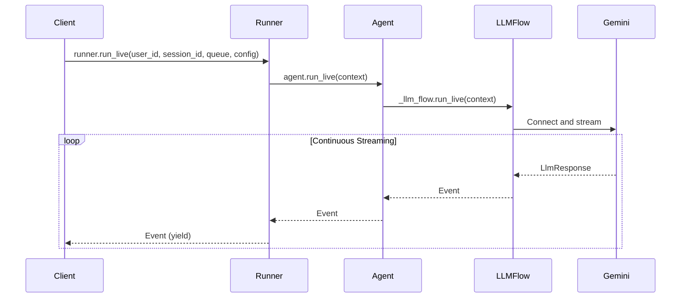

# 第 3 部分：使用 run_live() 進行事件處理

> 🔔 `更新日期：2026-02-01`
>
> 🔗 `資料來源`：https://google.github.io/adk-docs/streaming/dev-guide/part3/

`run_live()` 方法是 ADK 進行串流對話的主要進入點，它實作了一個非同步產生器（async generator），會在對話展開時產生事件。本部分重點在於理解與處理這些事件——這是實現應用程式、使用者與 AI 模型之間即時互動的核心通訊機制。

您將學習如何處理不同的事件類型（文字、音訊、逐字稿、工具調用）、透過中斷和回合完成訊號管理對話流程、為網路傳輸序列化事件，以及利用 ADK 的自動工具執行功能。理解事件處理對於建立讓使用者感到自然且即時的反應式串流應用程式至關重要。

> [!NOTE] 需要非同步上下文（Async Context Required）
所有 `run_live()` 程式碼都需要非同步上下文。詳情與實際範例請參閱 [第 1 部分：FastAPI 應用程式範例](part1.md#fastapi-應用程式範例)。

## run_live() 的工作原理

`run_live()` 是一個非同步產生器，能即時串流對話事件。它在事件產生時立即輸出——無需緩衝、無需輪詢、無需回呼（callbacks）。事件在串流時不進行內部緩衝。整體記憶體使用量取決於工作階段持久化（例如，記憶體內 vs 資料庫），使其適用於快速交流和長時間對話。

### 方法簽署與流程

**用法：**

原始碼參考：[runners.py](https://github.com/google/adk-python/blob/29c1115959b0084ac1169748863b35323da3cf50/src/google/adk/runners.py)

```python
# 方法簽署揭示了深思熟慮的設計
async def run_live(
    self,
    *,                                      # 僅限關鍵字參數
    user_id: Optional[str] = None,          # 使用者識別碼（除非提供 session，否則為必填）
    session_id: Optional[str] = None,       # 工作階段追蹤（除非提供 session，否則為必填）
    live_request_queue: LiveRequestQueue,   # 雙向通訊通道
    run_config: Optional[RunConfig] = None, # 串流行為配置
    session: Optional[Session] = None,      # 已棄用：請改用 user_id 和 session_id
) -> AsyncGenerator[Event, None]:           # 產生對話事件的產生器
```

如其簽署所示，每個串流對話都需要身份（user_id）、連續性（session_id）、通訊（live_request_queue）和配置（run_config）。回傳類型——事件的非同步產生器——承諾在不耗盡系統資源的情況下進行即時傳遞。



### 基本使用模式

從 `run_live()` 接收事件最簡單的方法是使用 for 迴圈遍歷非同步產生器：

示範實作：[main.py:225-233](https://github.com/google/adk-samples/blob/31847c0723fbf16ddf6eed411eb070d1c76afd1a/python/agents/bidi-demo/app/main.py#L225-L233)

```python
# 遍歷 runner.run_live 產生的事件
async for event in runner.run_live(
    user_id=user_id,
    session_id=session_id,
    live_request_queue=live_request_queue,
    run_config=run_config
):
    # 將事件轉換為 JSON 格式，排除空值並使用別名
    event_json = event.model_dump_json(exclude_none=True, by_alias=True)
    # 記錄除錯訊息
    logger.debug(f"[SERVER] Event: {event_json}")
    # 透過 WebSocket 傳送文字
    await websocket.send_text(event_json)
```

> [!TIP] 工作階段識別碼（Session Identifiers）
`user_id` 和 `session_id` 兩者必須與您透過 `SessionService.create_session()` 建立工作階段時使用的識別碼相符。這些可以是根據您的應用程式需求設定的任何字串值（例如 UUID、電子郵件地址、自訂權杖）。詳細指南請參閱 [第 1 部分：取得或建立工作階段](part1.md#獲取或建立對話-session)。

### run_live() 中的連線生命週期

`run_live()` 方法會自動管理底層 Live API 的連線生命週期：

**連線狀態：**

1. **初始化**：呼叫 `run_live()` 時建立連線。
1. **活動串流**：透過 `LiveRequestQueue`（向上游傳送至模型）和 `run_live()`（從模型向下游接收）進行雙向通訊。
1. **優雅關閉**：呼叫 `LiveRequestQueue.close()` 時連線關閉。
1. **錯誤恢復**：ADK 支援透明的工作階段恢復；透過 `RunConfig.session_resumption` 啟用以處理暫時性故障。詳情請參閱 [第 4 部分：Live API 工作階段恢復](https://google.github.io/adk-docs/streaming/dev-guide/part4/#live-api-session-resumption)。

#### run_live() 產生的內容

當代理程式處理使用者輸入並產生回應時，`run_live()` 方法會即時產生 `Event` 物件串流。理解不同的事件類型有助於您建立能適當處理文字、音訊、逐字稿、工具調用、中繼資料和錯誤的響應式 UI。各個事件類型將在下文詳細說明。

| 事件類型                                                 | 說明                                                                                                                                                        |
| -------------------------------------------------------- | ----------------------------------------------------------------------------------------------------------------------------------------------------------- |
| **[文字事件](#文字事件)**                             | 使用 `response_modalities=["TEXT"]` 時模型的文字回應；包含用於串流 UI 管理的 `partial`（部分）、`turn_complete`（回合完成）和 `interrupted`（已中斷）標記。 |
| **[含內嵌資料的音訊事件](#音訊事件)**                | 使用 `response_modalities=["AUDIO"]` 時即時串流的原始音訊位元組（`inline_data`）；具備暫時性（不儲存至工作階段）。                                          |
| **[含檔案資料的音訊事件](#含檔案資料的音訊事件)** | 彙整成檔案並儲存在成品（artifacts）中的音訊；包含 `file_data` 引用而非原始位元組；可持久化至工作階段歷史紀錄。                                              |
| **[中繼資料事件](#中繼資料事件)**                     | 用於成本監控和配額追蹤的權杖（token）使用資訊（`prompt_token_count`、`candidates_token_count`、`total_token_count`）。                                      |
| **[逐字稿事件](#逐字稿事件)**                  | 在 `RunConfig` 中啟用逐字稿功能時，使用者輸入（`input_transcription`）和模型輸出（`output_transcription`）的語音轉文字結果。                                |
| **[工具調用事件](#工具調用事件)**                    | 來自模型的函式調用請求；ADK 會自動處理執行。                                                                                                                |
| **[錯誤事件](#錯誤事件)**                            | 模型錯誤和連線問題，包含 `error_code` 和 `error_message` 欄位。                                                                                             |

> [!NOTE] 原始碼參考
請參閱 [`runners.py`](https://github.com/google/adk-python/blob/29c1115959b0084ac1169748863b35323da3cf50/src/google/adk/runners.py) 中完整的事件類型處理實作。

#### run_live() 何時結束

`run_live()` 事件迴圈可能在多種條件下結束。理解這些結束情境對於適當的資源清理和錯誤處理至關重要：

| 結束條件             | 觸發原因                                                      | 是否優雅關閉？ | 說明                                                      |
| -------------------- | ------------------------------------------------------------- | -------------- | --------------------------------------------------------- |
| **手動關閉**         | `live_request_queue.close()`                                  | ✅ 是           | 使用者明確關閉佇列，傳送 `LiveRequest(close=True)` 訊號。 |
| **所有代理程式完成** | `SequentialAgent` 中的最後一個代理程式呼叫 `task_completed()` | ✅ 是           | 當所有順序代理程式完成其任務後。                          |
| **工作階段逾時**     | 達到 Live API 持續時間限制                                    | ⚠️ 連線關閉     | 工作階段超過最大持續時間（參見下方的限制）。              |
| **提前結束**         | 設定了 `end_invocation` 標記                                  | ✅ 是           | 在預處理期間或由工具/回呼設定以提早結束。                 |
| **空事件**           | 佇列關閉訊號                                                  | ✅ 是           | 指示事件串流已結束的內部訊號。                            |
| **錯誤**             | 連線錯誤、異常                                                | ❌ 否           | 未處理的異常或連線失敗。                                  |

> [!WARNING] SequentialAgent 行為
在使用 `SequentialAgent` 時，`task_completed()` 函式**不會**結束應用程式的 `run_live()` 迴圈。它僅表示當前代理程式的工作已完成，並觸發無縫切換到序列中的下一個代理程式。您的事件迴圈將繼續接收來自後續代理程式的事件。迴圈僅在序列中的**最後一個**代理程式完成時才會結束。

> [!NOTE] 了解更多
關於工作階段恢復和連線修復的詳情，請參閱 [第 4 部分：Live API 工作階段恢復](https://google.github.io/adk-docs/streaming/dev-guide/part4/#live-api-session-resumption)。關於多代理程式工作流程，請參閱 [多代理程式工作流程的最佳實踐](#最佳實踐總結表)。

#### 儲存至 ADK `Session` 的事件

並非 `run_live()` 產生的所有事件都會持久化到 ADK `Session` 中。當 `run_live()` 結束時，只有特定事件會儲存到工作階段，其他事件則是暫時性的。對於使用工作階段持久化、恢復功能或需要回顧對話歷史的應用程式來說，理解哪些事件會被儲存、哪些是暫時性的至關重要。

> [!NOTE] 原始碼參考
請參閱 [`runners.py`](https://github.com/google/adk-python/blob/29c1115959b0084ac1169748863b35323da3cf50/src/google/adk/runners.py) 中的工作階段事件持久化邏輯。

**儲存至 ADK `Session` 的事件：**

這些事件會持久化到 ADK `Session` 並可在工作階段歷史紀錄中取得：

- **含檔案資料的音訊事件**：僅在 `RunConfig.save_live_blob` 為 `True` 時儲存至 ADK `Session`；音訊資料會彙整成成品中的檔案，並附帶 `file_data` 引用。
- **使用量中繼資料事件**：一律儲存，以追蹤整個 ADK `Session` 的權杖消耗情況。
- **非部分逐字稿事件**：儲存最終逐字稿；不持久化部分（partial）逐字稿。
- **函式調用與回應事件**：一律儲存，以維護工具執行歷史。
- **其他控制事件**：大多數控制事件（例如 `turn_complete`、`finish_reason`）都會儲存。

**不儲存至 ADK `Session` 的事件：**

這些事件是暫時性的，僅在活動串流期間傳遞給呼叫者：

- **含內嵌資料的音訊事件**：`inline_data` 中的原始音訊 `Blob` 資料從不儲存至 ADK `Session`（僅用於即時播放）。
- **部分逐字稿事件**：僅用於即時顯示；儲存的是最終逐字稿。

> [!NOTE] 音訊持久化
若要儲存音訊對話到 ADK `Session` 以供回顧或恢復，請啟用 `RunConfig.save_live_blob = True`。這會將音訊串流持久化至成品中。配置詳情請參閱 [第 4 部分：save_live_blob](https://google.github.io/adk-docs/streaming/dev-guide/part4/#save_live_blob)。

## 理解事件

事件是 ADK 雙向串流系統中的核心通訊機制。本節探討事件的完整生命週期——從它們如何透過多層管線產生，到支援真正即時互動的並行處理模式，以及對中斷和回合完成的實際處理。您將了解事件類型（文字、音訊、逐字稿、工具調用）、網路傳輸的序列化策略，以及管理跨 Gemini Live API 和 Vertex AI Live API 平台串流工作階段的連線生命週期。

### Event 類別

ADK 的 `Event` 類別是一個 Pydantic 模型，代表串流對話中的所有通訊。它繼承自 `LlmResponse`，作為模型回應、使用者輸入、逐字稿和控制訊號的統一容器。

> [!NOTE] 原始碼參考
請參閱 [`event.py:30-128`](https://github.com/google/adk-python/blob/29c1115959b0084ac1169748863b35323da3cf50/src/google/adk/events/event.py#L30-L128) 和 [`llm_response.py:28-200`](https://github.com/google/adk-python/blob/29c1115959b0084ac1169748863b35323da3cf50/src/google/adk/models/llm_response.py#L28-L200) 中的 `Event` 類別實作。

#### 關鍵欄位

**所有應用程式的基本欄位：**

- `content`：包含文字、音訊或函式調用（以 `Content.parts` 形式呈現）。
- `author`：識別誰建立了事件（`"user"` 或代理程式名稱）。
- `partial`：區分增量區塊與完整文字。
- `turn_complete`：訊號指示何時可再次啟用使用者輸入。
- `interrupted`：指示何時停止呈現當前輸出。

**音訊/語音應用程式欄位：**

- `input_transcription`：使用者的說話內容（在 `RunConfig` 中啟用時）。
- `output_transcription`：模型的說話內容（在 `RunConfig` 中啟用時）。
- `content.parts[].inline_data`：用於播放的音訊資料。

**工具執行欄位：**

- `content.parts[].function_call`：模型的工具調用請求。
- `content.parts[].function_response`：工具執行結果。
- `long_running_tool_ids`：追蹤非同步工具執行。

**除錯與診斷欄位：**

- `usage_metadata`：權杖計數和計費資訊。
- `cache_metadata`：上下文快取命中/遺失統計。
- `finish_reason`：模型停止產生的原因（例如 STOP、MAX_TOKENS、SAFETY）。
- `error_code` / `error_message`：失敗診斷。

> [!NOTE] 作者語意
逐字稿事件的作者為 `"user"`；模型回應/事件使用代理程式名稱作為 `author`（而非 `"model"`）。詳情請參閱 [事件作者身份](#事件作者身份)。

#### 理解事件識別碼

事件有兩個重要的 ID 欄位：

- **`event.id`**：此特定事件的唯一識別碼（格式：UUID）。每個事件都會獲得一個新 ID，即使是部分文字區塊也是如此。
- **`event.invocation_id`**：當前調用中所有事件共享的識別碼（格式：`"e-" + UUID`）。在 `run_live()` 中，單個串流工作階段中的所有事件共享同一個 `invocation_id`。（關於調用的更多資訊，請參閱 [InvocationContext：執行狀態容器](#invocationcontext執行狀態容器)）

**用法：**

```python
# 此串流工作階段中的所有事件將具有相同的 invocation_id
async for event in runner.run_live(...):
    print(f"事件 ID: {event.id}")              # 每個事件唯一
    print(f"調用 ID: {event.invocation_id}")  # 工作階段中的所有事件皆相同
```

**使用案例：**

- **event.id**：在日誌中追蹤單個事件，移除重複事件。
- **event.invocation_id**：依對話工作階段分組事件，過濾工作階段特定事件。

### 事件作者身份

在即時串流模式下，`Event.author` 欄位遵循特殊語意以維持對話清晰度：

**模型回應**：作者為**代理程式名稱**（例如 `"my_agent"`），而非字面字串 `"model"`。

- 這使得在多代理程式場景中能夠追蹤是由哪個代理程式產生回應。
- 範例：`Event(author="customer_service_agent", content=...)`

**使用者逐字稿**：當事件包含轉錄的使用者音訊時，作者為 `"user"`。

**運作原理**：

1. Gemini Live API 回傳使用者音訊逐字稿，其 `content.role == 'user'`。
1. ADK 的 `get_author_for_event()` 函式會檢查此角色標記。
1. 若 `content.role == 'user'`，ADK 將 `Event.author` 設為 `"user"`。
1. 否則，ADK 將 `Event.author` 設為代理程式名稱（例如 `"my_agent"`）。

此轉換確保轉錄的使用者輸入在應用程式的對話歷史紀錄中被正確歸因於使用者，儘管它流經模型的回應串流。

- 範例：輸入音訊逐字稿 → `Event(author="user", input_transcription=..., content.role="user")`

**為何這很重要**：

- 在多代理程式應用程式中，您可以依代理程式過濾事件：`events = [e for e in stream if e.author == "my_agent"]`。
- 顯示對話歷史時，使用 `event.author` 顯示是誰說了什麼。
- 逐字稿事件會正確歸因於使用者，即使它們流經模型。

> [!NOTE] 原始碼參考
請參閱 [`base_llm_flow.py:292-326`](https://github.com/google/adk-python/blob/fd2c0f556b786417a9f6add744827b07e7a06b7d/src/google/adk/flows/llm_flows/base_llm_flow.py#L287-L321) 中的作者歸屬邏輯。

### 事件類型與處理

ADK 透過 `runner.run_live()` 串流不同的事件類型，以支援不同的互動形式：傳統聊天的文字回應、語音輸出的音訊區塊、用於無障礙和日誌記錄的逐字稿，以及用於函式執行的工具調用通知。每個事件都包含控制 UI 狀態轉換並實現自然、類人對話流程的中繼資料標記（`partial`、`turn_complete`、`interrupted`）。理解如何識別與處理這些事件類型對於建立響應式串流應用程式至關重要。

### 文字事件

最常見的事件類型，當您在 `RunConfig` 中指定 `response_modalities` 為 `["TEXT"]` 模式時，包含模型的文字回應：

**用法：**

```python
async for event in runner.run_live(...):
    # 檢查事件是否包含內容與組件
    if event.content and event.content.parts:
        # 檢查第一個組件是否包含文字
        if event.content.parts[0].text:
            text = event.content.parts[0].text

            # 如果不是部分內容（即為完整區塊）
            if not event.partial:
                # 更新串流顯示的邏輯
                update_streaming_display(text)
```
#### 預設回應形式行為

當 `response_modalities` 未明確設定（即為 `None`）時，ADK 會在 `run_live()` 開始時自動預設為 `["AUDIO"]` 模式。這意味著：

- **如果您不提供 RunConfig**：預設為 `["AUDIO"]`。
- **如果您提供不含 response_modalities 的 RunConfig**：預設為 `["AUDIO"]`。
- **如果您明確設定 response_modalities**：使用您的設定（不套用預設值）。

**為何存在此預設值**：某些原生音訊模型要求明確設定回應形式。為了確保與所有模型相容，ADK 預設為 `["AUDIO"]`。

**對於純文字應用程式**：請務必在 `RunConfig` 中明確設定 `response_modalities=["TEXT"]`，以避免接收到非預期的音訊事件。

**範例：**

```python
# 明確的文字模式
run_config = RunConfig(
    response_modalities=["TEXT"],
    streaming_mode=StreamingMode.BIDI
)
```

**關鍵事件標記：**

這些標記有助於您在 UI 中管理串流文字顯示和對話流程：

- `event.partial`：串流期間增量文字區塊為 `True`；完整合併文字為 `False`。
- `event.turn_complete`：當模型完成其完整回應時為 `True`。
- `event.interrupted`：當使用者中斷模型回應時為 `True`。

> [!NOTE] 了解更多
關於使用 `partial`、`turn_complete` 和 `interrupted` 標記來管理對話流程與 UI 狀態的詳細指南，請參閱 [處理文字事件](#文字事件)。

### 音訊事件

當 `RunConfig` 中的 `response_modalities` 配置為 `["AUDIO"]` 時，模型會產生音訊輸出而非文字，您將在事件串流中接收音訊資料：

**配置：**

```python
# 為音訊回應配置 RunConfig
run_config = RunConfig(
    response_modalities=["AUDIO"],
    streaming_mode=StreamingMode.BIDI
)

# 音訊以 inline_data 形式存在於 event.content.parts 中
async for event in runner.run_live(..., run_config=run_config):
    if event.content and event.content.parts:
        part = event.content.parts[0]
        if part.inline_data:
            # 音訊事件結構：
            # part.inline_data.data: bytes (原始 PCM 音訊)
            # part.inline_data.mime_type: str (例如 "audio/pcm")
            audio_data = part.inline_data.data
            mime_type = part.inline_data.mime_type

            print(f"收到 {len(audio_data)} 位元組的 {mime_type}")
            # 播放音訊的邏輯
            await play_audio(audio_data)
```

> [!NOTE] 了解更多
> - **`response_modalities` 控制模型如何產生輸出**——每個工作階段您必須選擇 `["TEXT"]`（文字回應）或 `["AUDIO"]`（音訊回應）之一。您不能同時使用兩種形式。配置詳情請參閱 [第 4 部分：回應形式](https://google.github.io/adk-docs/streaming/dev-guide/part4/#response-modalities)。
> - 關於音訊格式、傳送/接收音訊及音訊處理流程的全面介紹，請參閱 [第 5 部分：如何使用音訊、圖片與影片](part5.md)。

### 含檔案資料的音訊事件

當音訊資料被彙整並以檔案形式儲存在成品中時，ADK 會產生包含 `file_data` 引用而非原始 `inline_data` 的事件。這對於將音訊持久化到工作階段歷史紀錄非常有用。

> [!NOTE] 原始碼參考
請參閱 [`audio_cache_manager.py:156-178`](https://github.com/google/adk-python/blob/29c1115959b0084ac1169748863b35323da3cf50/src/google/adk/flows/llm_flows/audio_cache_manager.py#L156-L178) 中的音訊檔案彙整邏輯。

**接收音訊檔案引用：**

```python
# 接收包含檔案引用的音訊事件
async for event in runner.run_live(
    user_id=user_id,
    session_id=session_id,
    live_request_queue=queue,
    run_config=run_config
):
    if event.content and event.content.parts:
        for part in event.content.parts:
            if part.file_data:
                # 音訊已彙整為檔案並儲存在 Artifact 中
                file_uri = part.file_data.file_uri
                mime_type = part.file_data.mime_type

                print(f"音訊檔案已儲存：{file_uri} ({mime_type})")
                # 從 Artifact Service 取得音訊檔案以供播放
```

**檔案資料（File Data）vs 內嵌資料（Inline Data）：**

- **內嵌資料**（`part.inline_data`）：即時串流的原始音訊位元組；具暫時性且不儲存至工作階段。
- **檔案資料**（`part.file_data`）：儲存在成品中的音訊檔案引用；可持久化至工作階段歷史紀錄。

輸入與輸出的音訊資料都會被彙整成音訊檔案並儲存在成品服務中。檔案引用以 `file_data` 形式包含在事件中，讓您稍後能檢索音訊。

> [!NOTE] 工作階段持久化
若要將含檔案資料的音訊事件儲存至工作階段歷史紀錄，請啟用 `RunConfig.save_live_blob = True`。這允許從持久化工作階段回顧或重播音訊對話。

### 中繼資料事件

使用量中繼資料事件包含用於監控成本和配額消耗的權杖使用資訊。`run_live()` 方法會將這些事件與內容事件分開產生。

> [!NOTE] 原始碼參考
請參閱 [`llm_response.py:105`](https://github.com/google/adk-python/blob/29c1115959b0084ac1169748863b35323da3cf50/src/google/adk/models/llm_response.py#L105) 中的使用量中繼資料結構。

**存取權杖使用量 (Accessing Token Usage)：**

```python
# 存取權杖使用資訊
async for event in runner.run_live(
    user_id=user_id,
    session_id=session_id,
    live_request_queue=queue,
    run_config=run_config
):
    if event.usage_metadata:
        print(f"提示（Prompt）權杖：{event.usage_metadata.prompt_token_count}")
        print(f"回應（Response）權杖：{event.usage_metadata.candidates_token_count}")
        print(f"總權杖：{event.usage_metadata.total_token_count}")

        # 追蹤工作階段中的累積使用量
        total_tokens += event.usage_metadata.total_token_count or 0
```

**可用的中繼資料欄位：**

- `prompt_token_count`：輸入中的權杖數（提示詞與上下文）。
- `candidates_token_count`：模型回應中的權杖數。
- `total_token_count`：提示詞與回應權杖的總和。
- `cached_content_token_count`：從快取中服務的權杖數（使用上下文快取時）。

> [!NOTE] 成本監控
使用量中繼資料事件允許在串流工作階段期間進行即時成本追蹤。您可以實作配額限制、向使用者顯示使用量，或為計費和分析記錄指標。

### 逐字稿事件

當在 `RunConfig` 中啟用逐字稿功能時，您會收到獨立的逐字稿事件：

**配置：**

```python
async for event in runner.run_live(...):
    # 使用者的說話內容（當啟用 input_audio_transcription 時）
    if event.input_transcription:
        # 顯示使用者逐字稿的邏輯
        display_user_transcription(event.input_transcription)

    # 模型的說話內容（當啟用 output_audio_transcription 時）
    if event.output_transcription:
        # 顯示模型逐字稿的邏輯
        display_model_transcription(event.output_transcription)
```

這些事件可在無需額外逐字稿服務的情況下實現無障礙功能和對話日誌。

> [!NOTE] 了解更多
關於在 `RunConfig` 中啟用逐字稿及理解逐字稿傳遞的詳情，請參閱 [第 5 部分：音訊逐字稿](part5.md#音訊逐字稿-audio-transcription)。

### 工具調用事件

當模型請求執行工具時：

**用法：**

```python
async for event in runner.run_live(...):
    if event.content and event.content.parts:
        for part in event.content.parts:
            if part.function_call:
                # 模型正在請求工具執行
                tool_name = part.function_call.name
                tool_args = part.function_call.args
                # ADK 會自動處理執行
```

ADK 會自動處理工具調用——除非要實作自訂工具執行邏輯，否則您通常不需要直接處理這些事件。

> [!NOTE] 了解更多
關於 ADK 如何自動執行工具、處理函式回應以及支援長時間執行和串流工具的詳情，請參閱 [run_live() 中的自動工具執行](#run_live-中的自動工具執行)。

### 錯誤事件

正式生產環境的應用程式需要強健的錯誤處理，以優雅地處理模型錯誤與連線問題。ADK 透過 `error_code` 和 `error_message` 欄位呈現錯誤：

**用法：**

```python
import logging

logger = logging.getLogger(__name__)

try:
    async for event in runner.run_live(...):
        # 處理來自模型或連線的錯誤
        if event.error_code:
            logger.error(f"模型錯誤：{event.error_code} - {event.error_message}")

            # 傳送錯誤通知給用戶端
            await websocket.send_json({
                "type": "error",
                "code": event.error_code,
                "message": event.error_message
            })

            # 根據錯誤嚴重性決定是否繼續或中斷
            if event.error_code in ["SAFETY", "PROHIBITED_CONTENT", "BLOCKLIST"]:
                # 違反內容原則 - 通常無法重試
                break  # 終端錯誤 - 結束迴圈
            elif event.error_code == "MAX_TOKENS":
                # 達到權杖限制 - 可能需要調整配置
                break
            # 對於其他錯誤，您可能會繼續或實作重試邏輯
            continue  # 暫時性錯誤 - 繼續處理

        # 僅在無錯誤時處理正常事件內容
        if event.content and event.content.parts:
            # ... 處理內容
            pass
finally:
    queue.close()  # 務必清理連線
```

>[!NOTE] 注意
上述範例顯示了檢查 `error_code` 和 `error_message` 的基本結構。關於包含使用者通知、重試邏輯和上下文記錄的生產級錯誤處理，請參閱下方的實際場景。

**何時使用 `break` vs `continue`：**

關鍵決策點在於：*模型的回答能否有意義地繼續？*

**場景 1：違反內容原則（使用 `break`）**

您正在建立一個客戶支援聊天機器人。使用者問了一個不恰當的問題，觸發了安全（SAFETY）過濾器：

**範例：**

```python
if event.error_code in ["SAFETY", "PROHIBITED_CONTENT", "BLOCKLIST"]:
    # 模型已停止產生 - 無法繼續
    await websocket.send_json({
        "type": "error",
        "message": "我無法協助處理該請求。請詢問其他問題。"
    })
    break  # 結束迴圈 - 模型不會再針對此回合傳送更多事件
```

**為何使用 `break`？** 模型已終止回應。此回合不會再有更多事件。繼續等待只會浪費資源。

---

**場景 2：串流期間的網路小問題（使用 `continue`）**

您正在建立一個語音逐字稿服務。在轉錄中途，網路出現短暫閃斷：

**範例：**

```python
if event.error_code == "UNAVAILABLE":
    # 暫時性網路問題
    logger.warning(f"網路瞬斷：{event.error_message}")
    # 對於可能自行恢復的短暫暫時性問題，不要通知使用者
    continue  # 繼續監聽 - 連線可能恢復並繼續
```

**為何使用 `continue`？** 這是一個暫時性錯誤。連線可能會恢復，且模型可能繼續串流逐字稿。使用 `break` 會過早結束一個可能可恢復的串流。

> [!NOTE] 使用者通知
對於短暫的暫時性錯誤（持續時間 < 1 秒），不要通知使用者——他們不會察覺到閃斷。但若錯誤持續存在或影響使用者體驗（例如串流暫停 > 3 秒），請優雅地通知他們：「連線出現問題，正在重試中...」

---

**場景 3：達到權杖限制（使用 `break`）**

您正在產生長篇文章並達到了最大權杖限制：

**範例：**

```python
if event.error_code == "MAX_TOKENS":
    # 模型已達到輸出限制
    await websocket.send_json({
        "type": "complete",
        "message": "回應已達最大長度",
        "truncated": True
    })
    break  # 模型已結束 - 不會再產生更多權杖
```

**為何使用 `break`？** 模型已達到輸出限制並停止。繼續等待不會產生更多權杖。

---

**場景 4：帶重試邏輯的速率限制（搭配倒退機制使用 `continue`）**

您正在運作一個高流量應用程式，偶爾會遇到速率限制：

**範例：**

```python
retry_count = 0
max_retries = 3

async for event in runner.run_live(...):
    if event.error_code == "RESOURCE_EXHAUSTED":
        retry_count += 1
        if retry_count > max_retries:
            logger.error("超過最大重試次數")
            break  # 多次失敗後放棄

        # 等待並重試
        await asyncio.sleep(2 ** retry_count)  # 指數倒退（Exponential backoff）
        continue  # 繼續監聽 - 速率限制可能會解除

    # 成功收到事件後重設計數器
    retry_count = 0
```

**為何最初使用 `continue`？** 速率限制通常是暫時的。透過指數倒退機制，串流可能會恢復。但在多次失敗後，請使用 `break` 以避免無限期等待。

---

**決策框架：**

| 錯誤類型                           | 動作                    | 原因                |
| ---------------------------------- | ----------------------- | ------------------- |
| `SAFETY`, `PROHIBITED_CONTENT`     | `break`                 | 模型終止了回應      |
| `MAX_TOKENS`                       | `break`                 | 模型完成了產生      |
| `UNAVAILABLE`, `DEADLINE_EXCEEDED` | `continue`              | 暫時性網路/逾時問題 |
| `RESOURCE_EXHAUSTED` (速率限制)    | 帶重試邏輯的 `continue` | 短暫等待後可能恢復  |
| 未知錯誤                           | `continue` (記錄日誌)   | 採取審慎態度        |

**至關重要：務必使用 `finally` 進行清理**

**用法：**

```python
try:
    async for event in runner.run_live(...):
        # ... 錯誤處理 ...
finally:
    queue.close()  # 無論是中斷或正常結束，都會執行清理
```

無論是使用 `break` 或是迴圈正常結束，`finally` 都能確保連線被正確關閉。

**錯誤代碼參考：**

ADK 錯誤代碼來自底層的 Gemini API。以下是您會遇到的最常見錯誤代碼：

| 錯誤代碼             | 類別     | 說明                 | 建議動作                             |
| -------------------- | -------- | -------------------- | ------------------------------------ |
| `SAFETY`             | 內容原則 | 內容違反安全原則     | `break` - 通知使用者，記錄事件       |
| `PROHIBITED_CONTENT` | 內容原則 | 內容包含受禁內容     | `break` - 顯示原則違反訊息           |
| `BLOCKLIST`          | 內容原則 | 內容符合黑名單       | `break` - 警示使用者，不要重試       |
| `MAX_TOKENS`         | 限制     | 輸出達到最大權杖限制 | `break` - 優雅截斷，進行摘要         |
| `RESOURCE_EXHAUSTED` | 速率限制 | 配額或速率限制已滿   | `continue` 帶倒退機制 - 延遲後重試   |
| `UNAVAILABLE`        | 暫時性   | 服務暫時不可用       | `continue` - 重試，可能自行恢復      |
| `DEADLINE_EXCEEDED`  | 暫時性   | 請求逾時             | `continue` - 考慮帶倒退機制的重試    |
| `CANCELLED`          | 用戶端   | 用戶端取消了請求     | `break` - 清理資源                   |
| `UNKNOWN`            | 系統     | 發生未指定錯誤       | `continue` 帶日誌記錄 - 記錄以供分析 |

如需完整的錯誤代碼清單與說明，請參考官方文件：

> [!NOTE] 官方文件
> - **FinishReason**（模型停止產生權杖時）：[Google AI for Developers](https://ai.google.dev/api/python/google/ai/generativelanguage/Candidate/FinishReason) | [Vertex AI](https://cloud.google.com/vertex-ai/generative-ai/docs/model-reference/gemini)
> - **BlockedReason**（提示詞因內容過濾而被封鎖時）：[Google AI for Developers](https://ai.google.dev/api/python/google/ai/generativelanguage/GenerateContentResponse/PromptFeedback/BlockReason) | [Vertex AI](https://cloud.google.com/vertex-ai/generative-ai/docs/multimodal/configure-safety-attributes)
> - **ADK 實作**：[`llm_response.py:145-200`](https://github.com/google/adk-python/blob/29c1115959b0084ac1169748863b35323da3cf50/src/google/adk/models/llm_response.py#L145-L200)

**錯誤處理最佳實踐：**

- **務必先檢查錯誤**：在處理內容之前先處理 `error_code`，以避免處理無效事件。
- **附帶上下文記錄錯誤**：在錯誤日誌中包含 `session_id` 和 `user_id` 以便除錯。
- **將錯誤分類**：區分可重試錯誤（暫時性失敗）與終端錯誤（違反內容原則）。
- **優雅地通知使用者**：顯示易於理解的錯誤訊息，而非原始錯誤代碼。
- **實作重試邏輯**：對於暫時性錯誤，考慮使用自動的指數倒退重試。
- **監控錯誤率**：追蹤錯誤類型與頻率，以識別系統性問題。
- **處理內容原則錯誤**：對於 `SAFETY`、`PROHIBITED_CONTENT` 和 `BLOCKLIST` 錯誤，告知使用者其內容違反了原則。

## 處理文字事件

理解 `partial`、`interrupted` 和 `turn_complete` 標記對於建立響應式串流 UI 至關重要。這些標記讓您能在串流期間提供即時反饋、優雅地處理使用者中斷，並偵測對話邊界以進行適當的狀態管理。

### 處理 `partial`

此標記有助於您區分增量文字區塊與完整的合併文字，實現平滑的串流顯示並配合正確的最終確認。

**用法：**

```python
async for event in runner.run_live(...):
    if event.content and event.content.parts:
        if event.content.parts[0].text:
            text = event.content.parts[0].text

            if event.partial:
                # 您的串流 UI 更新邏輯
                update_streaming_display(text)
            else:
                # 您的完整訊息顯示邏輯
                display_complete_message(text)
```

**`partial` 標記語意：**

- `partial=True`：此事件中的文字是**增量**的——它僅包含自上個事件以來的新文字。
- `partial=False`：此事件中的文字是**完整**的——它包含此回應段落的完整合併文字。

注意

`partial` 標記僅對文字內容（`event.content.parts[].text`）有意義。對於其他內容類型：

- **音訊事件**：`inline_data` 中的每個音訊區塊都是獨立的（不進行合併）。
- **工具調用**：函式調用與回應一律是完整的（不套用 `partial`）。
- **逐字稿**：產生時，逐字稿事件一律是完整的。

**串流範例：**

```text
事件 1: partial=True,  text="Hello",        turn_complete=False
事件 2: partial=True,  text=" world",       turn_complete=False
事件 3: partial=False, text="Hello world",  turn_complete=False
事件 4: partial=False, text="",             turn_complete=True  # 回合完成
```

**重要的時序關係：**

- `partial=False` 可能在一個回合中出現**多次**（例如，在每個句子後）。
- `turn_complete=True` 在模型完整回應的最末端出現**一次**，且是在**獨立的事件**中。
- 您可能會收到：`partial=False`（第 1 句）→ `partial=False`（第 2 句）→ `turn_complete=True`。
- 合併文字事件（含內容的 `partial=False`）一律在 `turn_complete=True` 事件**之前**產生。

> [!NOTE] 注意
ADK 內部會累積所有來自 `partial=True` 事件的文字。當您收到 `partial=False` 的事件時，文字內容等於之前所有 `partial=True` 區塊的總和。這意味著：
>
> - 如果您不需要串流顯示，可以安全地忽略所有 `partial=True` 事件，僅處理 `partial=False` 事件。
> - 如果您顯示 `partial=True` 事件，`partial=False` 事件可提供完整的合併文字用於驗證或儲存。
> - 此累積過程由 ADK 的 `StreamingResponseAggregator` 自動處理——您不需要手動串接部分文字區塊。

#### 處理 `interrupted` 標記

這透過偵測使用者何時在中途切斷模型回應來實現自然的對話流程，讓您可以立即停止呈現過時的內容。

當使用者在模型仍在產生回應時傳送新輸入（語音對話中常見的情況），您會收到一個 `interrupted=True` 的事件：

**用法：**

```python
async for event in runner.run_live(...):
    if event.interrupted:
        # 停止顯示部分文字並清除輸入指示器的邏輯
        stop_streaming_display()

        # 在 UI 中顯示中斷指示的邏輯（選填）
        show_user_interruption_indicator()
```

**範例 - 中斷情境：**

```text
模型："舊金山的目前天氣是..."
使用者：[中斷] "事實上，我指的是聖地牙哥"
→ 收到 event.interrupted=True
→ 您的應用程式：停止呈現模型回應，清除 UI
→ 模型處理新輸入
模型："聖地牙哥的天氣是..."
```

**何時使用中斷處理：**

- **語音對話**：當使用者開始說話時，立即停止音訊播放。
- **清除 UI 狀態**：移除輸入指示器（typing indicators）與部分文字顯示。
- **對話日誌記錄**：標記哪些回應是被中斷的（不完整的）。
- **使用者反饋**：提供視覺指示，顯示已辨識到中斷。

#### 處理 `turn_complete` 標記

這指示了對話邊界，讓您可以更新 UI 狀態（啟用輸入控制、隱藏指示器），並在日誌與分析中標記正確的回合邊界。

當模型完成其完整回應後，您會收到一個 `turn_complete=True` 的事件：

**用法：**

```python
async for event in runner.run_live(...):
    if event.turn_complete:
        # 更新 UI 以顯示「準備好接收輸入」狀態的邏輯
        enable_user_input()
        # 隱藏輸入指示器的邏輯
        hide_typing_indicator()

        # 在日誌中標記對話邊界的邏輯
        log_turn_boundary()
```

**事件標記組合：**

理解 `turn_complete` 與 `interrupted` 的組合有助於您處理所有對話狀態：

| 情境                   | turn_complete | interrupted | 您的應用程式應...            |
| ---------------------- | ------------- | ----------- | ---------------------------- |
| 正常完成               | True          | False       | 啟用輸入，顯示「就緒」狀態。 |
| 使用者在中途回應時中斷 | False         | True        | 停止顯示，清除部分內容。     |
| 在結束時中斷           | True          | True        | 同正常完成（回合已結束）。   |
| 回應中（部分文字）     | False         | False       | 繼續顯示串流文字。           |

**實作：**

```python
async for event in runner.run_live(...):
    # 處理串流文字
    if event.content and event.content.parts and event.content.parts[0].text:
        if event.partial:
            # 顯示輸入指示器並更新部分文字的邏輯
            update_streaming_text(event.content.parts[0].text)
        else:
            # 顯示完整文字區塊的邏輯
            display_text(event.content.parts[0].text)

    # 處理中斷
    if event.interrupted:
        # 停止音訊播放並清除指示器的邏輯
        stop_audio_playback()
        clear_streaming_indicators()

    # 處理回合完成
    if event.turn_complete:
        # 啟用使用者輸入的邏輯
        show_input_ready_state()
        enable_microphone()
```

**常見使用案例：**

- **UI 狀態管理**：顯示/隱藏「準備輸入」指示器、輸入動畫、麥克風狀態。
- **音訊播放控制**：得知何時停止呈現來自模型的音訊區塊。
- **對話日誌記錄**：在歷史紀錄/分析中標記清楚的回合邊界。
- **串流最佳化**：當回合完成時停止緩衝。

**回合完成與快取**：音訊/逐字稿快取會在串流期間的特定點自動排空（flush）：

- **當回合完成時**（`turn_complete=True`）：使用者與模型的音訊快取都會被排空。
- **當中斷時**（`interrupted=True`）：模型的音訊快取會被排空。
- **當產生完成時**：模型的音訊快取會被排空。

## 將事件序列化為 JSON

ADK 的 `Event` 物件是 Pydantic 模型，這意味著它們具備強大的序列化能力。`model_dump_json()` 方法對於透過 WebSocket 或伺服器傳送事件（SSE）等網路協定串流事件特別有用。

### 使用 event.model_dump_json()

這提供了簡單的一行程式碼，將 ADK 事件轉換為 JSON 格式，以便透過 WebSocket 或 SSE 等網路協定傳送。

`model_dump_json()` 方法將 `Event` 物件序列化為 JSON 字串：

示範實作：[main.py:219-234](https://github.com/google/adk-samples/blob/31847c0723fbf16ddf6eed411eb070d1c76afd1a/python/agents/bidi-demo/app/main.py#L219-L234)

```python
async def downstream_task() -> None:
    """接收來自 run_live() 的事件並傳送至 WebSocket。"""
    async for event in runner.run_live(
        user_id=user_id,
        session_id=session_id,
        live_request_queue=live_request_queue,
        run_config=run_config
    ):
        # 序列化事件
        event_json = event.model_dump_json(exclude_none=True, by_alias=True)
        await websocket.send_text(event_json)
```

**會被序列化的內容：**

- 事件中繼資料（author、server_content 欄位）。
- 內容（文字、音訊資料、函式調用）。
- 事件標記（partial、turn_complete、interrupted）。
- 逐字稿資料（input_transcription、output_transcription）。
- 工具執行資訊。

**何時使用 `model_dump_json()`：**

- ✅ 透過網路串流事件（WebSocket、SSE）。
- ✅ 記錄日誌/持久化到 JSON 檔案。
- ✅ 除錯與檢查。
- ✅ 與基於 JSON 的 API 整合。

**何時「不」使用它：**

- ❌ 記憶體內處理（直接使用事件物件）。
- ❌ 序列化開銷會造成影響的高頻事件。
- ❌ 當您只需要少數欄位時（直接擷取所需欄位）。

> [!WARNING] 效能警告
`event.content.parts[].inline_data` 中的二進位音訊資料在序列化為 JSON 時會被 base64 編碼，這會顯著增加酬載大小（約 133% 的開銷）。對於包含音訊的生產環境應用程式，請使用 WebSocket 二進位框架或 multipart HTTP 分開傳送二進位資料。詳情請參閱 [音訊傳輸優化](#音訊傳輸優化)。

### 序列化選項

這允許您透過排除不需要的欄位來縮減酬載大小，進而提升網路效能與用戶端處理速度。

Pydantic 的 `model_dump_json()` 支援多個實用的參數：

**用法：**

```python
# 排除空值以縮減酬載（並使用 camelCase 欄位名稱）
event_json = event.model_dump_json(exclude_none=True, by_alias=True)

# 自訂排除（例如：跳過龐大的二進位音訊）
event_json = event.model_dump_json(
    exclude={'content': {'parts': {'__all__': {'inline_data'}}}},
    by_alias=True
)

# 僅包含特定欄位
event_json = event.model_dump_json(
    include={'content', 'author', 'turn_complete', 'interrupted'},
    by_alias=True
)

# 縮排 JSON（用於除錯）
event_json = event.model_dump_json(indent=2, by_alias=True)
```

bidi-demo 使用 `exclude_none=True`，藉由省略 None 值的欄位來最小化 payload 大小。

### 在用戶端進行反序列化

這展示了如何在用戶端解析並處理序列化的事件，進而根據回合完成和中斷等事件屬性進行響應式 UI 更新。

在用戶端（JavaScript/TypeScript），將 JSON 解析回物件：

示範實作：[app.js:339-688](https://github.com/google/adk-samples/blob/2f7b82f182659e0990bfb86f6ef400dd82633c07/python/agents/bidi-demo/app/static/js/app.js#L341-L690)

```javascript
// 處理傳入訊息
websocket.onmessage = function (event) {
    // 解析傳入的 ADK 事件
    const adkEvent = JSON.parse(event.data);

    // 處理回合完成事件
    if (adkEvent.turnComplete === true) {
        // 從當前訊息移除輸入指示器
        if (currentBubbleElement) {
            const textElement = currentBubbleElement.querySelector(".bubble-text");
            const typingIndicator = textElement.querySelector(".typing-indicator");
            if (typingIndicator) {
                typingIndicator.remove();
            }
        }
        currentMessageId = null;
        currentBubbleElement = null;
        return;
    }

    // 處理中斷事件
    if (adkEvent.interrupted === true) {
        // 如果正在播放音訊，則停止播放
        if (audioPlayerNode) {
            audioPlayerNode.port.postMessage({ command: "endOfAudio" });
        }

        // 保留部分訊息但標記為已中斷
        if (currentBubbleElement) {
            const textElement = currentBubbleElement.querySelector(".bubble-text");

            // 移除輸入指示器
            const typingIndicator = textElement.querySelector(".typing-indicator");
            if (typingIndicator) {
                typingIndicator.remove();
            }

            // 加入中斷標記
            currentBubbleElement.classList.add("interrupted");
        }

        currentMessageId = null;
        currentBubbleElement = null;
        return;
    }

    // 處理內容事件（文字或音訊）
    if (adkEvent.content && adkEvent.content.parts) {
        const parts = adkEvent.content.parts;

        for (const part of parts) {
            // 處理文字
            if (part.text) {
                // 為新回合加入新的訊息對話泡泡
                if (currentMessageId == null) {
                    currentMessageId = Math.random().toString(36).substring(7);
                    currentBubbleElement = createMessageBubble(part.text, false, true);
                    currentBubbleElement.id = currentMessageId;
                    messagesDiv.appendChild(currentBubbleElement);
                } else {
                    // 以累積文字更新現有的訊息對話泡泡
                    const existingText = currentBubbleElement.querySelector(".bubble-text").textContent;
                    const cleanText = existingText.replace(/\.\.\.$/, '');
                    updateMessageBubble(currentBubbleElement, cleanText + part.text, true);
                }

                scrollToBottom();
            }
        }
    }
};
```

> [!NOTE] 示範實作
請參閱 [`app.js:339-688`](https://github.com/google/adk-samples/blob/2f7b82f182659e0990bfb86f6ef400dd82633c07/python/agents/bidi-demo/app/static/js/app.js#L341-L690) 中完整的 WebSocket 訊息處理器。

### 音訊傳輸優化

JSON 中的 Base64 編碼二進位音訊會顯著增加酬載。對於生產環境應用程式，請使用單個 WebSocket 連線，同時包含二進位框架（用於音訊）和文字框架（用於中繼資料）：

**用法：**

```python
async for event in runner.run_live(...):
    # 檢查是否含有二進位音訊
    has_audio = (
        event.content and
        event.content.parts and
        any(p.inline_data for p in event.content.parts)
    )

    if has_audio:
        # 透過 WebSocket 二進位框架傳送音訊
        for part in event.content.parts:
            if part.inline_data:
                await websocket.send_bytes(part.inline_data.data)

        # 僅傳送中繼資料（體積小得多）
        metadata_json = event.model_dump_json(
            exclude={'content': {'parts': {'__all__': {'inline_data'}}}},
            by_alias=True
        )
        await websocket.send_text(metadata_json)
    else:
        # 純文字事件可直接以 JSON 傳送
        await websocket.send_text(event.model_dump_json(exclude_none=True, by_alias=True))
```

此方法可為音訊密集型串流節省約 75% 的頻寬，同時維持完整的事件中繼資料。

## run_live() 中的自動工具執行

> [!NOTE] 原始碼參考
請參閱 [`functions.py`](https://github.com/google/adk-python/blob/29c1115959b0084ac1169748863b35323da3cf50/src/google/adk/flows/llm_flows/functions.py) 中的自動工具執行實作。

ADK `run_live()` 最強大的功能之一就是**自動工具執行**。與原始的 Gemini Live API 不同（後者需要您手動處理工具調用與回應），ADK 完全抽象化了此複雜性。

### 原始 Live API 的挑戰

直接使用 Gemini Live API（不使用 ADK）時，工具使用需要手動編排：

1. **接收**來自模型的函式調用。
1. **自行執行**工具。
1. **正確格式化**函式回應。
1. **將回應傳回**模型。

這會造成巨大的實作開銷，尤其是在串流情境中，您需要處理多個並發的工具調用、管理錯誤，並與進行中的音訊/文字串流進行協調。

### ADK 如何簡化工具使用

使用 ADK，工具執行變得宣告式。只需在代理程式上定義工具即可：

示範實作：[agent.py:11-16](https://github.com/google/adk-samples/blob/31847c0723fbf16ddf6eed411eb070d1c76afd1a/python/agents/bidi-demo/app/google_search_agent/agent.py#L11-L16)


```python
import os
from google.adk.agents import Agent
from google.adk.tools import google_search

# 定義具有搜尋功能的代理程式
agent = Agent(
    name="google_search_agent",
    model=os.getenv("DEMO_AGENT_MODEL", "gemini-2.5-flash-native-audio-preview-12-2025"),
    tools=[google_search],
    instruction="您是一個能搜尋網頁的得力助手。"
)
```

當您呼叫 `runner.run_live()` 時，ADK 會自動：

- **(Detects) 偵測**模型何時在串流回應中回傳函式調用。
- **(Executes) 並行執行**工具以獲得最佳效能。
- **(Handles) 處理**工具執行前後的回呼，以執行自訂邏輯。
- **(Formats) 根據 Live API 要求格式化**函式回應。
- **(Sends) 無縫地將回應傳回**模型。
- **(Yields) 將函式調用與回應事件都產生**給您的應用程式。

### 工具執行事件

當工具執行時，您會透過 `run_live()` 非同步產生器接收事件：

**用法：**

```python
async for event in runner.run_live(...):
    # 函式調用事件 - 模型請求執行工具
    if event.get_function_calls():
        print(f"模型正在調用：{event.get_function_calls()[0].name}")

    # 函式回應事件 - 工具執行結果
    if event.get_function_responses():
        print(f"工具結果：{event.get_function_responses()[0].response}")
```

您不需要親自處理執行——ADK 會自動完成。您只需觀察隨著對話流動的事件即可。

> [!NOTE] 了解更多
bidi-demo 會將所有事件（包括函式調用與回應）直接傳送到 WebSocket 用戶端，不進行伺服器端過濾。這讓用戶端能透過事件串流即時觀察工具執行情況。請參閱 [`main.py:219-234`](https://github.com/google/adk-samples/blob/31847c0723fbf16ddf6eed411eb070d1c76afd1a/python/agents/bidi-demo/app/main.py#L219-L234) 中的下游任務。

### 長時間執行與串流工具

ADK 支援與 `run_live()` 無縫整合的高階工具模式：

**長時間執行工具**：需要人工審核或需較長時間完成的工具。請標記 `is_long_running=True`。在可恢復的非同步流中，ADK 可在長時調用後暫停。在即時流中，串流會繼續；`long_running_tool_ids` 指示待處理的操作，用戶端可顯示相應的 UI。

**串流工具**：接受類型為 `LiveRequestQueue` 的 `input_stream` 參數的工具，可在執行期間將即時更新傳回模型，進而實現漸進式回應。

> [!NOTE] 串流工具的工作原理
> 當您呼叫 `runner.run_live()` 時，ADK 會在初始化時（`runners.py` 第 828-865 行）檢查代理程式的工具，透過參數類型註解來識別具有 `LiveRequestQueue` 的串流工具。
>
> **佇列建立與生命週期**：
> 1. **建立**：ADK 會在 `run_live()` 開始時（處理任何事件之前），為每個串流工具建立一個專用的 `ActiveStreamingTool` 及其 `LiveRequestQueue`。
> 2. **儲存**：這些佇列在調用期間儲存在 `invocation_context.active_streaming_tools[tool_name]` 中。
> 3. **注入**：當模型調用該工具時，ADK 會自動將該工具的佇列注入為 `input_stream` 參數（`function_tool.py` 第 238-253 行）。
> 4. **使用**：工具可在執行期間使用此佇列將即時更新傳回模型。
> 5. **生命週期**：這些佇列在整個 `run_live()` 調用期間持續存在（一個 InvocationContext = 一次 `run_live()` 呼叫），並在 `run_live()` 結束時銷毀。
>
> **佇列區分**：
>
> - **主佇列**（`live_request_queue` 參數）：由您的應用程式建立，用於用戶端到模型的通訊。
> - **工具佇列**（`active_streaming_tools[tool_name].stream`）：由 ADK 自動建立，用於執行期間工具到模型的通訊。
> 兩種類型的佇列皆為 `LiveRequestQueue` 實例，但它們在串流架構中擔負不同的職責。
> 這讓工具能在長時間運行的操作期間提供增量更新、進度通知或部分結果。
> **程式碼參考**：實作細節請參閱 `runners.py:828-865`（工具偵測）與 `function_tool.py:238-253`（參數注入）。
>
> 實作範例請參閱 [工具指南](../../tools-for-agents/index.md)。

### 關鍵要點

原始 Live API 工具使用與 ADK 的區別顯而易見：

| 面向           | 原始 Live API           | ADK `run_live()`       |
| -------------- | ----------------------- | ---------------------- |
| **工具宣告**   | 手動定義 Schema         | 從 Python 函式自動產生 |
| **工具執行**   | 在應用程式中手動處理    | 自動並行執行           |
| **回應格式化** | 手動建構 JSON           | 自動處理               |
| **錯誤處理**   | 手動 try/catch 與格式化 | 自動擷取並回報         |
| **串流整合**   | 手動協調                | 自動產生事件           |
| **開發者體驗** | 複雜且易出錯            | 宣告式且簡單           |

這種自動處理是 ADK 的核心價值主張之一——它將 Live API 工具使用的複雜性轉換為簡單、宣告式的開發體驗。

## InvocationContext：執行狀態容器

原始碼參考

請參閱 [`invocation_context.py`](https://github.com/google/adk-python/blob/29c1115959b0084ac1169748863b35323da3cf50/src/google/adk/agents/invocation_context.py) 中的 `InvocationContext` 實作。

雖然 `run_live()` 回傳用於接收事件的 `AsyncGenerator`，但其內部會建立並管理 `InvocationContext`——這是 ADK 統一的狀態載體，封裝了完整對話調用所需的一切。**一個 InvocationContext 對應一個 `run_live()` 迴圈**——它在您呼叫 `run_live()` 時建立，並在整個串流工作階段期間持續存在。

您可以將其想像成一本隨對話從頭到尾隨行的筆記本，在過程中收集資訊、追蹤進度並為每個組件提供上下文。它是 ADK 對「Context」概念的運行時實作，提供了即時對話期間所需的執行時狀態與服務。關於 ADK 中 Context 的更廣泛概述，請參閱 [ADK 中的 Context](../../context/index.md)。

### 什麼是「調用」（Invocation）？

一個**調用**代表一個完整的互動週期：

- 以使用者輸入（文字、音訊或控制訊號）開始。
- 可能涉及一或多次代理程式調用。
- 當產生最終回應或明確終止時結束。
- 由 `runner.run_live()` 或 `runner.run_async()` 編排。

這有別於**代理程式調用**（執行單個代理程式的邏輯）與**步驟**（單次 LLM 呼叫加上任何產生的工具執行）。

層級結構如下：

```text
   ┌─────────────────────── 調用 (invocation) ──────────────────────────┐
   ┌──────────── 代理程式調用_1 ────────────┐ ┌─ 代理程式調用_2 ─┐
   ┌──── 步驟_1 ────────┐ ┌───── 步驟_2 ──────┐
   [呼叫 LLM] [呼叫工具] [呼叫 LLM] [轉移]
```

### 誰使用 InvocationContext？

InvocationContext 服務於不同層級的對象：

- **ADK 內部組件**（主要使用者）：Runner、Agent、LLMFlow 與 GeminiLlmConnection 都在其流經堆疊時接收、讀取並寫入 InvocationContext。此共享上下文實現了無縫協作而無需緊密耦合。
- **應用程式開發者**（間接受益者）：您通常不需要在應用程式程式碼中直接建立或操作 `InvocationContext`。相反地，您受益於 `InvocationContext` 在幕後實現的簡潔、優雅的 API——例如 `async for event in runner.run_live()` 模式。
- **工具與回呼開發者**（直接存取）：當您實作自訂工具或回呼時，會接收到 `InvocationContext` 作為參數。這讓您能直接存取對話狀態、工作階段服務與控制標記（如 `end_invocation`）以實現複雜的行為。

#### InvocationContext 包含什麼

當您實作自訂工具或回呼時，會接收到 `InvocationContext` 作為參數。以下是您可以取得的資訊：

**工具/回呼開發者的重要欄位：**

- **`context.invocation_id`**：當前調用識別碼（每次 `run_live()` 呼叫唯一）。
- **`context.session`**：
- **`context.session.events`**：工作階段歷史中的所有事件（跨所有調用）。
- **`context.session.state`**：工作階段資料的持久性鍵值儲存。
- **`context.session.user_id`**：使用者身份。
- **`context.run_config`**：當前串流配置（回應形式、逐字稿設定、成本限制）。
- **`context.end_invocation`**：將此設為 `True` 可立即終止對話（用於錯誤處理或原則執行）。

**工具開發中的範例案例：**

```python
# 示範常見 InvocationContext 模式的綜合工具實作範例
def my_tool(context: InvocationContext, query: str):
    # 存取使用者身份
    user_id = context.session.user_id

    # 檢查這是否為使用者的第一則訊息
    event_count = len(context.session.events)
    if event_count == 0:
        return "歡迎！這是您的第一則訊息。"

    # 存取對話歷史
    recent_events = context.session.events[-5:]  # 最後 5 個事件

    # 存取持久性的工作階段狀態
    # 工作階段狀態會跨調用持久化（而不僅僅是此次串流工作階段）
    user_preferences = context.session.state.get('user_preferences', {})

    # 更新工作階段狀態（將會被持久化）
    context.session.state['last_query_time'] = datetime.now().isoformat()

    # 存取持久化服務
    if context.artifact_service:
        # 儲存大型檔案/音訊
        await context.artifact_service.save_artifact(
            app_name=context.session.app_name,
            user_id=context.session.user_id,
            session_id=context.session.id,
            filename="result.bin",
            artifact=types.Part(inline_data=types.Blob(mime_type="application/octet-stream", data=data)),
        )

    # 結合上下文處理查詢
    result = process_query(query, context=recent_events, preferences=user_preferences)

    # 在特定場景下終止對話
    if result.get('error'):
        # 處理錯誤 - 停止對話
        context.end_invocation = True

    return result
```

理解 `InvocationContext` 對於掌握 ADK 如何維持狀態、協調執行以及實現多代理程式工作流程與可恢復性等進階功能至關重要。即使您從不直接觸碰它，了解其在應用程式中的流動也能幫助您設計出更好的代理程式並更有效地排除問題。

## 多代理程式工作流程的最佳實踐

ADK 的雙向串流支援三種代理程式架構：**單代理程式**（由一個代理程式處理整個對話）、**具子代理程式的多代理程式**（協調員代理程式使用 `transfer_to_agent` 動態路由至專家代理程式），以及**順序工作流程代理程式**（代理程式使用 `task_completed` 在固定管線中執行）。本節重點介紹順序工作流程的最佳實踐，其中理解代理程式切換與狀態共享對於順暢的 BIDI 通訊至關重要。

> [!NOTE] 了解更多
關於多代理程式模式的全面介紹，請參閱 ADK 文件中的 [作為編排者的工作流程代理程式](../../agents/multi-agents.md#12-作為編排者的工作流代理-workflow-agents-as-orchestrators)。

在建立多代理程式系統時，理解代理程式如何在即時串流期間切換與共享狀態，對於確保順暢的 BIDI 通訊至關重要。

### 結合 BIDI 串流的 SequentialAgent

`SequentialAgent` 讓工作流程管線中的代理程式能接續執行。每個代理程式在下一個代理程式開始前完成其任務。即時串流的挑戰在於判斷代理程式何時已完成對連續音訊或影片輸入的處理。

> [!NOTE] 原始碼參考
請參閱 [`sequential_agent.py:119-158`](https://github.com/google/adk-python/blob/29c1115959b0084ac1169748863b35323da3cf50/src/google/adk/agents/sequential_agent.py#L119-L158) 中的 `SequentialAgent` 實作。

**運作原理：**

ADK 會自動為序列中的每個代理程式加入 `task_completed()` 函式。當模型呼叫此函式時，它表示完成並觸發切換到下一個代理程式：

**用法：**

```python
# SequentialAgent 自動為每個子代理程式加入此工具
def task_completed():
    """
    表示代理程式已成功完成使用者的問題或任務。
    """
    return '已收到任務完成訊號。'
```

### 建議模式：透明的順序流

關鍵點在於，**代理程式切換是在同一個 `run_live()` 事件串流中透明地發生**。您的應用程式不需要手動管理切換——只需統一接收事件即可：

**用法：**

```python
async def handle_sequential_workflow():
    """結合 BIDI 串流使用 SequentialAgent 的建議模式。"""

    # 1. 序列中所有代理程式共用單一佇列
    queue = LiveRequestQueue()

    # 2. 背景任務持續擷取使用者輸入
    async def capture_user_input():
        while True:
            # 讀取麥克風音訊的邏輯
            audio_chunk = await microphone.read()
            queue.send_realtime(
                blob=types.Blob(data=audio_chunk, mime_type="audio/pcm")
            )

    input_task = asyncio.create_task(capture_user_input())

    try:
        # 3. 單一事件迴圈無縫處理「所有」代理程式
        async for event in runner.run_live(
            user_id="user_123",
            session_id="session_456",
            live_request_queue=queue,
        ):
            # 事件在代理程式切換間無縫流動
            current_agent = event.author

            # 處理音訊與文字輸出
            if event.content and event.content.parts:
                for part in event.content.parts:
                    # 檢查音訊資料
                    if part.inline_data and part.inline_data.mime_type.startswith("audio/"):
                        # 播放音訊的邏輯
                        await play_audio(part.inline_data.data)

                    # 檢查文字資料
                    if part.text:
                        await display_text(f"[{current_agent}] {part.text}")

            # 不需要特殊的切換處理！

    finally:
        input_task.cancel()
        queue.close()
```

### 代理程式切換期間的事件流

以下是您的應用程式在代理程式切換時會看到的內容：

```text
# 代理程式 1 (研究員) 完成工作
事件: author="researcher", text="我已蒐集所有資料。"
事件: author="researcher", function_call: task_completed()
事件: author="researcher", function_response: task_completed

# --- 自動切換（對您的程式碼是透明的） ---

# 代理程式 2 (撰稿員) 開始
事件: author="writer", text="讓我根據研究內容撰寫報告..."
事件: author="writer", text=" 研究結果顯示..."
事件: author="writer", function_call: task_completed()
事件: author="writer", function_response: task_completed

# --- 自動切換 ---

# 代理程式 3 (審核員) 開始 - 序列中的最後一個代理程式
事件: author="reviewer", text="讓我審核這份報告..."
事件: author="reviewer", text="報告看起來不錯。全部完成！"
事件: author="reviewer", function_call: task_completed()
事件: author="reviewer", function_response: task_completed

# --- 最後一個代理程式完成：run_live() 結束 ---
# 您的 async for 迴圈在此結束
```

### 設計原則

#### 1. 單一事件迴圈

對序列中的所有代理程式使用同一個事件迴圈：

**用法：**

```python
# ✅ 正確：單一迴圈處理所有代理程式
async for event in runner.run_live(...):
    # 您的事件處理邏輯
    await handle_event(event)  # 適用於 Agent1, Agent2, Agent3...

# ❌ 錯誤：不要中斷迴圈或建立多個迴圈
for agent in agents:
    async for event in runner.run_live(...):  # 錯誤！
        ...
```

#### 2. 持久性佇列

同一個 `LiveRequestQueue` 為所有代理程式服務：

```text
# 使用者輸入流向當前活動的代理程式
使用者說話 → 佇列 → 代理程式 1 (研究員)
                ↓
使用者說話 → 佇列 → 代理程式 2 (撰稿員)
                ↓
使用者說話 → 佇列 → 代理程式 3 (審核員)
```

**不要為每個代理程式建立新佇列：**

```python
# ❌ 錯誤：每個代理程式一個新佇列
for agent in agents:
    new_queue = LiveRequestQueue()  # 錯誤！

# ✅ 正確：整個工作流程使用單一佇列
queue = LiveRequestQueue()
async for event in runner.run_live(live_request_queue=queue):
    ...
```

#### 3. 具備代理程式意識的 UI（選填）

追蹤當前活動的代理程式，以提供更好的使用者體驗：

**用法：**

```python
current_agent_name = None

async for event in runner.run_live(...):
    # 偵測代理程式切換
    if event.author and event.author != current_agent_name:
        current_agent_name = event.author
        # 更新 UI 指示器的邏輯
        await update_ui_indicator(f"當前代理程式：{current_agent_name}")

    # 您的事件處理邏輯
    await handle_event(event)
```

#### 4. 切換通知

選擇性地在代理程式交接時通知使用者：

**用法：**

```python
async for event in runner.run_live(...):
    # 偵測任務完成（切換訊號）
    if event.content and event.content.parts:
        for part in event.content.parts:
            if (part.function_response and
                part.function_response.name == "task_completed"):
                # 顯示切換通知的邏輯
                await display_notification(
                    f"✓ {event.author} 已完成。交接給下一個代理程式..."
                )
                continue

    # 您的事件處理邏輯
    await handle_event(event)
```

### 關鍵差異：transfer_to_agent vs task_completed

理解這兩個函式有助於您選擇正確的多代理程式模式：

| 函式                | 代理程式模式       | `run_live()` 何時結束                                                  | 使用案例                         |
| ------------------- | ------------------ | ---------------------------------------------------------------------- | -------------------------------- |
| `transfer_to_agent` | 協調員（動態路由） | `LiveRequestQueue.close()`                                             | 根據意圖將使用者路由至專家       |
| `task_completed`    | 順序（管線）       | `LiveRequestQueue.close()` 或序列中最後一個代理程式的 `task_completed` | 固定工作流程：研究 → 撰寫 → 審核 |

**transfer_to_agent 範例：**

```text
# 協調員根據使用者意圖進行路由
使用者："我需要帳務方面的協助"
事件: author="coordinator", function_call: transfer_to_agent(agent_name="billing")
# 串流繼續，由帳務代理程式接手 - 同一個 run_live() 迴圈
事件: author="billing", text="我可以協助您的帳務問題..."
```

**task_completed 範例：**

```text
# 順序工作流程依管線進展
事件: author="researcher", function_call: task_completed()
# 當前代理程式結束，序列中的下一個代理程式開始
事件: author="writer", text="根據研究內容..."
```

### 最佳實踐總結表

| 實踐                             | 原因                           |
| -------------------------------- | ------------------------------ |
| 使用單一事件迴圈                 | ADK 在內部處理切換             |
| 佇列在代理程式間保持啟用         | 同一佇列服務於所有順序代理程式 |
| 追蹤 `event.author`              | 得知當前是由哪個代理程式回應   |
| 不要重設工作階段/上下文          | 對話狀態跨代理程式持久化       |
| 統一處理事件                     | 所有代理程式產生相同的事件類型 |
| 讓 `task_completed` 發送切換訊號 | 不要手動管理順序流             |

`SequentialAgent` 的設計確保了順暢的切換——您的應用程式只需看到來自不同代理程式按順序產生的連續事件流，自動交接由 ADK 管理。

## 總結

在本部分中，您掌握了 ADK 雙向串流架構中的事件處理。我們探討了代理程式產生的不同事件類型——文字回應、音訊區塊、逐字稿、工具調用和控制訊號——並學習了如何有效處理每種事件。您現在了解如何處理中斷和回合完成訊號以實現自然的對話流、使用 Pydantic 的模型序列化為網路傳輸進行事件序列化、利用 ADK 的自動工具執行來簡化代理程式工作流程，以及在進階狀態管理場景下存取 `InvocationContext`。有了這些事件處理模式，您已具備建立能向使用者提供即時反饋的響應式串流應用程式的能力。接下來，您將學習如何透過 `RunConfig` 配置複雜的串流行為，包括多模態互動、工作階段恢復以及成本控制。

---

← [上一頁：第 2 部分：使用 LiveRequestQueue 傳送訊息](part2.md) | [下一頁：第 4 部分：理解 RunConfig](part4.md) →
