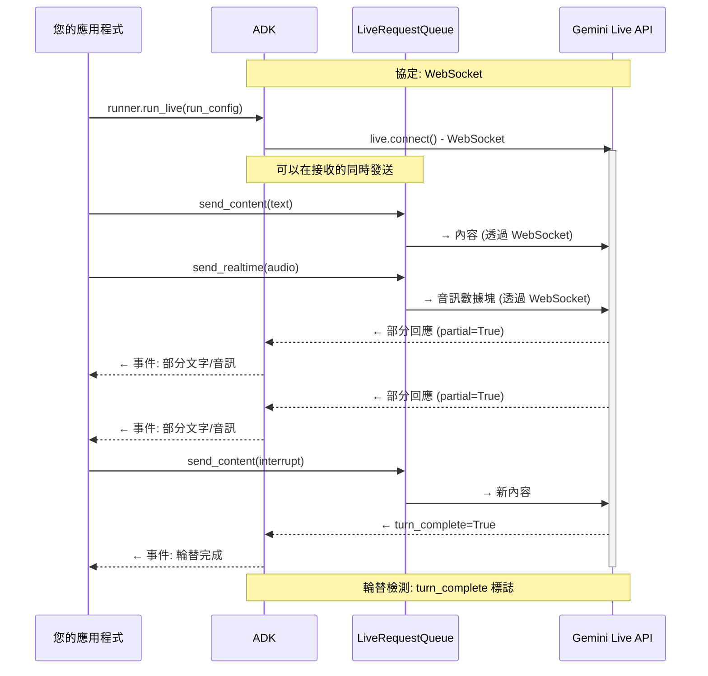
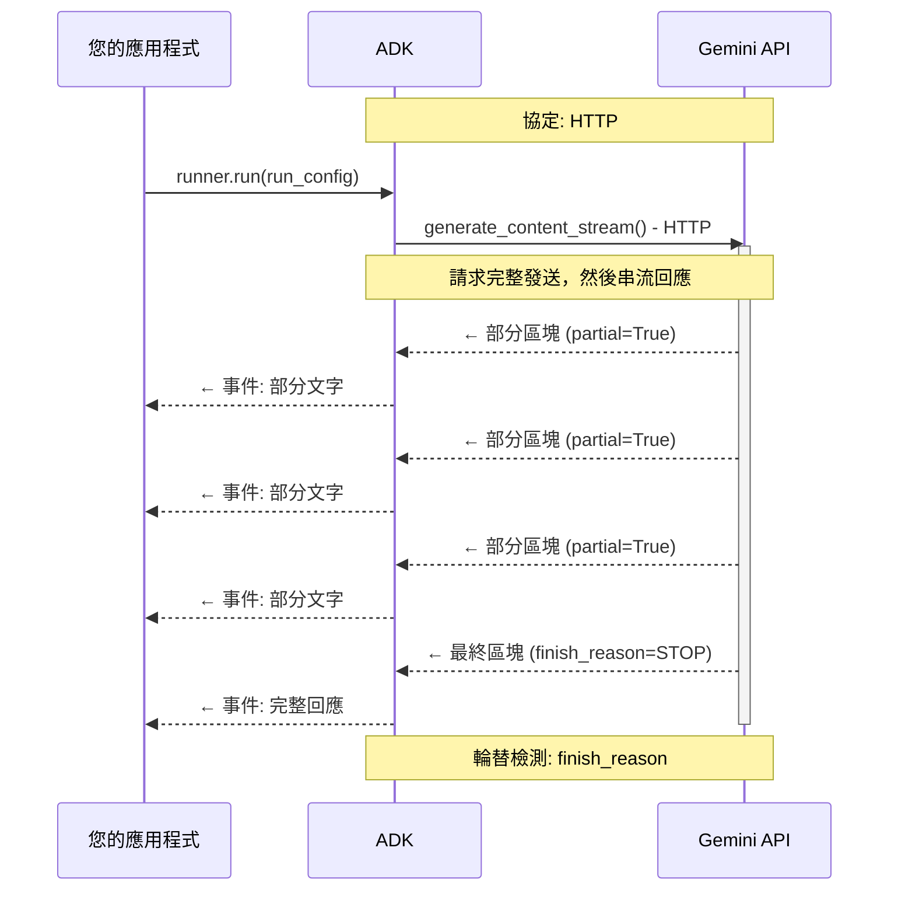
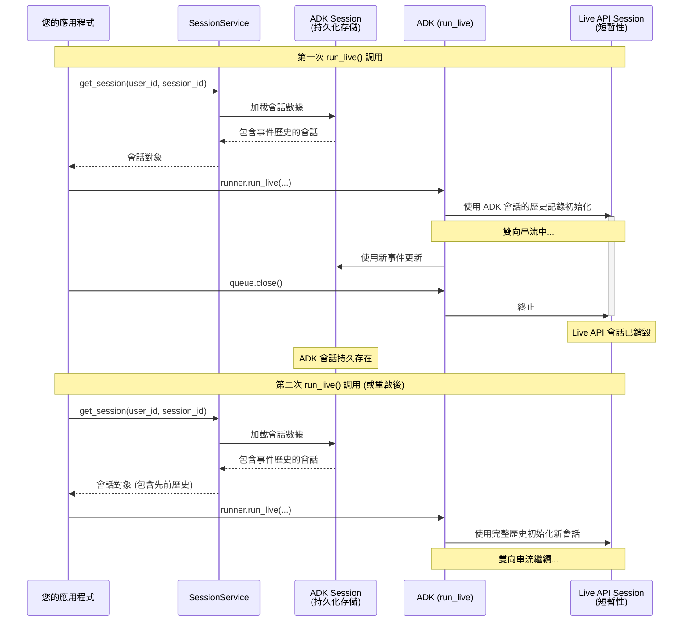
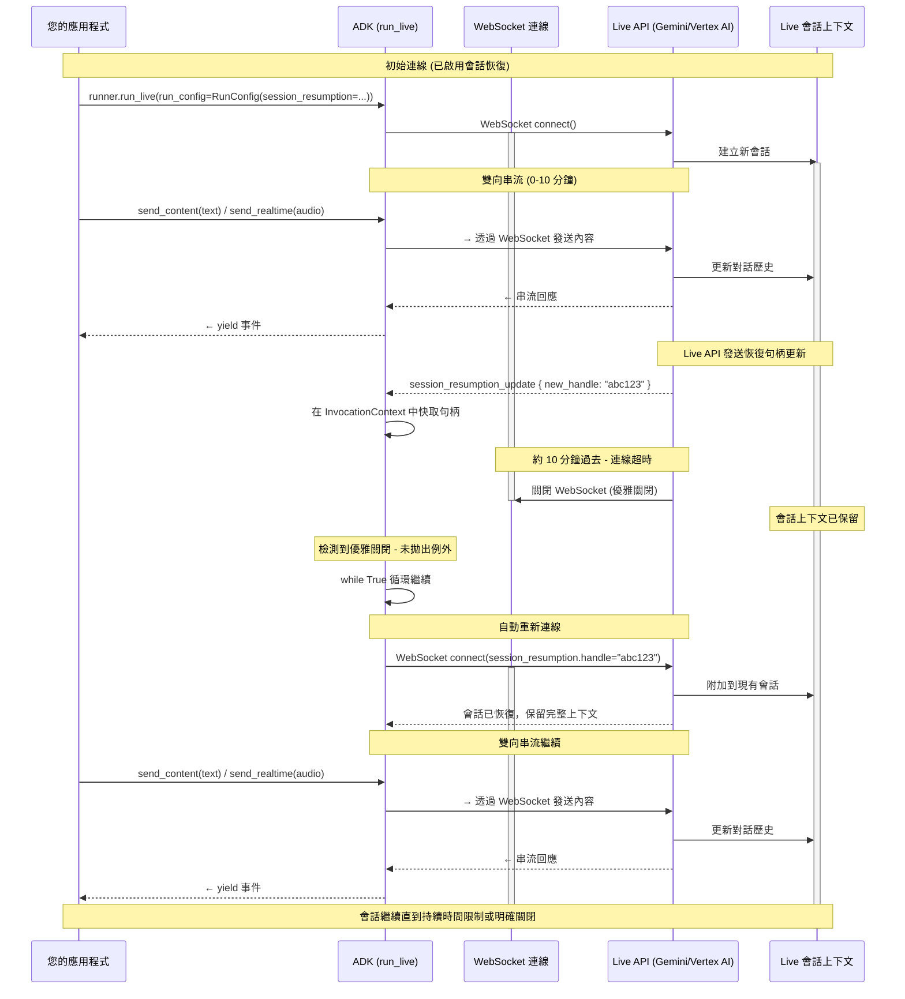

# 第 4 部分：理解 RunConfig

> 🔔 `更新日期：2026-02-01`
>
> 🔗 `資料來源`：https://google.github.io/adk-docs/streaming/dev-guide/part4/

在第 3 部分中，您學習了如何處理來自 `run_live()` 的事件，以處理模型回應、工具調用和串流更新。本部分將向您展示如何透過 `RunConfig` 設定這些串流會話——控制回應形式、管理會話生命週期以及實施生產限制。

**您將學到什麼**：本部分涵蓋了回應型態及其約束、探索 BIDI 和 SSE 串流模式之間的差異、檢查 ADK 會話 (Sessions) 與 Live API 會話之間的關係，並展示如何透過會話恢復 (session resumption) 和上下文視窗壓縮 (context window compression) 來管理會話持續時間。您將了解如何處理並行會話配額、實施配額管理的架構模式，以及透過 `max_llm_calls` 和音訊持久化選項設定成本控制。掌握 RunConfig 後，您可以構建生產級別的串流應用程式，在功能豐富性與運作約束之間取得平衡。

> [!NOTE] 了解更多
有關音訊/影片相關 `RunConfig` 設定的詳細資訊，請參閱 [第 5 部分：Live API 中的音訊、影像和影片](part5.md)。

## RunConfig 參數快速參考

此表格提供了本部分涵蓋的所有 RunConfig 參數的快速參考：

| 參數                           | 類型                           | 用途                                                | 平台支援               | 參考                                                                                                                         |
| :----------------------------- | :----------------------------- | :-------------------------------------------------- | :--------------------- | :--------------------------------------------------------------------------------------------------------------------------- |
| **response_modalities**        | list[str]                      | 控制輸出格式（TEXT 或 AUDIO）                       | 兩者                   | [詳情](#回應型態-response-modalities)                                                                                                 |
| **streaming_mode**             | StreamingMode                  | 選擇 BIDI 或 SSE 模式                               | 兩者                   | [詳情](#streamingmodebidi-或-sse)                                                                                           |
| **session_resumption**         | SessionResumptionConfig        | 啟用自動重新連線                                    | 兩者                   | [詳情](#live-api-會話恢復-session-resumption)                                                                                         |
| **context_window_compression** | ContextWindowCompressionConfig | 無限制的會話持續時間                                | 兩者                   | [詳情](#建議啟用上下文視窗壓縮以實現無限會話)                                                                                 |
| **max_llm_calls**              | int                            | 限制每個會話的總 LLM 調用次數                       | 兩者                   | [詳情](#max_llm_calls)                                                                                                       |
| **save_live_blob**             | bool                           | 持久化音訊/影片流                                   | 兩者                   | [詳情](#save_live_blob)                                                                                                      |
| **custom_metadata**            | dict[str, Any]                 | 將元數據附加到調用事件                              | 兩者                   | [詳情](#custom_metadata)                                                                                                     |
| **support_cfc**                | bool                           | 啟用組合式工具調用 (Compositional function calling) | Gemini (僅限 2.x 模型) | [詳情](#support_cfc-實驗性功能)                                                                                            |
| **speech_config**              | SpeechConfig                   | 語音和語言設定                                      | 兩者                   | [第 5 部分：語音設定](part5.md#音訊逐字稿-audio-transcription)        |
| **input_audio_transcription**  | AudioTranscriptionConfig       | 轉錄使用者語音                                      | 兩者                   | [第 5 部分：音訊轉錄](part5.md#音訊逐字稿-audio-transcription)                      |
| **output_audio_transcription** | AudioTranscriptionConfig       | 轉錄模型語音                                        | 兩者                   | [第 5 部分：音訊轉錄](part5.md#audio-transcription)                      |
| **realtime_input_config**      | RealtimeInputConfig            | VAD (語音活動檢測) 設定                             | 兩者                   | [第 5 部分：語音活動檢測](part5.md#voice-activity-detection-vad)         |
| **proactivity**                | ProactivityConfig              | 啟用主動音訊                                        | Gemini (僅限原生音訊)  | [第 5 部分：主動性和情感對話](part5.md#proactivity-and-affective-dialog) |
| **enable_affective_dialog**    | bool                           | 情感適應                                            | Gemini (僅限原生音訊)  | [第 5 部分：主動性和情感對話](part5.md#proactivity-and-affective-dialog) |

> [!NOTE] 原始碼參考
[`run_config.py`](https://github.com/google/adk-python/blob/29c1115959b0084ac1169748863b35323da3cf50/src/google/adk/agents/run_config.py)

**平台支援說明：**

- **兩者**：Gemini Live API 和 Vertex AI Live API 均支援
- **Gemini**：僅 Gemini Live API 支援
- **特定模型**：需要特定的模型架構（例如原生音訊）

**匯入路徑：**

上表引用的所有設定類型類別均從 `google.genai.types` 匯入：

```python
from google.genai import types
from google.adk.agents.run_config import RunConfig, StreamingMode

# 透過 types 模組訪問設定類型
run_config = RunConfig(
    # 啟用會話恢復設定
    session_resumption=types.SessionResumptionConfig(),
    # 設定上下文視窗壓縮
    context_window_compression=types.ContextWindowCompressionConfig(...),
    # 設定語音參數
    speech_config=types.SpeechConfig(...),
    # 等等
)
```

`RunConfig` 類別本身和 `StreamingMode` 列舉是從 `google.adk.agents.run_config` 匯入的。

## 回應型態 (Response Modalities)

回應型態控制模型生成輸出的方式——作為文字或音訊。Gemini Live API 和 Vertex AI Live API 都有相同的限制：每個會話只能有一種回應型態。

**設定：**

```python
# 第 2 階段：會話初始化 - RunConfig 決定串流行為

# 預設行為：當未指定時，ADK 會自動將 response_modalities 設置為 ["AUDIO"]
# (這是原生音訊模型所要求的)
run_config = RunConfig(
    streaming_mode=StreamingMode.BIDI  # 雙向 WebSocket 通訊
)

# 上述程式碼等同於：
run_config = RunConfig(
    response_modalities=["AUDIO"],  # 由 ADK 在 run_live() 中自動設置
    streaming_mode=StreamingMode.BIDI  # 雙向 WebSocket 通訊
)

# ✅ 正確：僅文字回應
run_config = RunConfig(
    response_modalities=["TEXT"],  # 模型僅以文字回應
    streaming_mode=StreamingMode.BIDI  # 仍使用雙向串流
)

# ✅ 正確：僅音訊回應（明確指定）
run_config = RunConfig(
    response_modalities=["AUDIO"],  # 模型僅以音訊回應
    streaming_mode=StreamingMode.BIDI  # 雙向 WebSocket 通訊
)
```

Gemini Live API 和 Vertex AI Live API 都將會話限制為單一回應型態。嘗試同時使用兩者將導致 API 錯誤：


```python
# ❌ 錯誤：不支援同時使用兩種型態
run_config = RunConfig(
    response_modalities=["TEXT", "AUDIO"],  # 錯誤：不能同時使用
    streaming_mode=StreamingMode.BIDI
)
# 來自 Live API 的錯誤："每個會話僅支援一種回應型態 (Only one response modality is supported per session)"
```

**預設行為：**

當未指定 `response_modalities` 時，ADK 的 `run_live()` 方法會自動將其設置為 `["AUDIO"]`，因為原生音訊模型需要明確的回應型態。如果需要，您可以透過明確設置 `response_modalities=["TEXT"]` 來覆蓋此設置。

**關鍵約束：**

- 您必須在會話開始時選擇 `TEXT` 或 `AUDIO`。**無法在會話中途切換型態**。
- 對於[原生音訊模型](part5.md#understanding-audio-model-architectures)，您必須選擇 `AUDIO`。如果您想從原生音訊模型同時接收音訊和文字回應，請使用音訊逐字稿 (Audio Transcript) 功能，它提供音訊輸出的文字逐字稿。詳情請參閱[音訊轉錄](part5.md#audio-transcription)。
- 回應型態僅影響模型輸出——**您始終可以發送文字、語音或影片輸入（如果模型支援這些輸入型態）**，無論選擇哪種回應型態。

## StreamingMode：BIDI 或 SSE

ADK 支援兩種不同的串流模式，使用不同的 API 端點和協定：

- `StreamingMode.BIDI`：ADK 使用 WebSocket 連接到 **Live API**（透過 `live.connect()` 的雙向串流端點）。
- `StreamingMode.SSE`：ADK 使用 HTTP 串流連接到 **標準 Gemini API**（透過 `generate_content_async()` 的單向/串流端點）。

"Live API" 特別指雙向 WebSocket 端點 (`live.connect()`)，而 "Gemini API" 或 "標準 Gemini API" 指傳統的基於 HTTP 的端點 (`generate_content()` / `generate_content_async()`)。兩者都是廣泛的 Gemini API 平台的一部分，但使用不同的協定和功能。

**注意**：這些模式指的是 **ADK 與 Gemini API 之間的通訊協定**，而不是您應用程式面向用戶端的架構。您可以使用任一模式為您的用戶端構建 WebSocket 伺服器、REST API、SSE 端點或任何其他架構。

本指南重點介紹 `StreamingMode.BIDI`，這是即時音訊/影片互動和 Live API 功能所必需的。然而，了解 BIDI 和 SSE 模式之間的差異對於為您的使用案例選擇正確的方法很有幫助。

**設定：**

```python
from google.adk.agents.run_config import RunConfig, StreamingMode

# 用於即時音訊/影片的 BIDI 串流
run_config = RunConfig(
    streaming_mode=StreamingMode.BIDI,
    response_modalities=["AUDIO"]  # 支援音訊/影片型態
)

# 用於基於文字互動的 SSE 串流
run_config = RunConfig(
    streaming_mode=StreamingMode.SSE,
    response_modalities=["TEXT"]  # 僅文字型態
)
```

### 協定與實作差異

這兩種串流模式在通訊模式和功能上有着根本的不同。BIDI 模式實現了真正的雙向通訊，您可以在接收模型回應的同時發送新輸入，而 SSE 模式遵循傳統的「請求-然後-回應」模式，即發送完整請求並回傳串流回應。

**StreamingMode.BIDI - 雙向 WebSocket 通訊：**

BIDI 模式建立一個持久的 WebSocket 連線，允許同時發送和接收。這啟用了即時功能，如插話、即時音訊串流和立即輪替：



**StreamingMode.SSE - 單向 HTTP 串流：**

SSE (Server-Sent Events) 模式使用 HTTP 串流，您預先發送完整請求，然後以區塊串流的形式接收回應。這是一種更簡單、更傳統的模式，適用於基於文字的聊天應用程式：



### 漸進式 SSE 串流 (Progressive SSE Streaming)

**漸進式 SSE 串流**是一項增強 SSE 模式傳遞串流回應方式的功能。此功能透過以下方式改進回應聚合：

- **內容順序保留**：維持混合內容類型（文字、工具調用、內聯數據）的原始順序。
- **智慧文字合併**：僅合併相同類型的連續文字部分（普通文字與思考文字）。
- **漸進式傳遞**：將所有中間區塊標記為 `partial=True`，最後只有一個最終的聚合回應。
- **延遲工具執行**：跳過在部分事件中執行工具調用，僅在最終聚合事件中執行，以確保並行工具調用是一起執行的，而不是順序執行。
- **工具調用參數串流**：支援透過 `partial_args` 漸進式構建工具調用參數，實現工具調用建構的即時顯示。

**預設行為：**

當您使用 `StreamingMode.SSE` 時，漸進式 SSE 串流是 **預設啟用的**。這意味着您無需任何額外設定即可自動從這些改進中受益。

**禁用此功能（如果需要）：**

如果您需要恢復到舊版的 SSE 串流行為（簡單的文字累加），您可以透過環境變數禁用它：

```bash
export ADK_DISABLE_PROGRESSIVE_SSE_STREAMING=1
```

> [!WARNING] 舊版行為權衡
> 禁用漸進式 SSE 串流會恢復為簡單的文字累加，這會：
>
> - 在混合文字和工具調用時可能會丟失原始內容順序
> - 不支援透過 `partial_args` 進行工具調用參數串流
> - 僅為了向後相容性而提供——新應用程式應使用預設的漸進式模式

**何時漸進式 SSE 串流會有所幫助：**

- 您正在使用 `StreamingMode.SSE` 且有混合內容類型（文字 + 工具調用）。
- 您的回應中包含混合了普通文字的思考文字（擴展思考）。
- 您希望確保工具調用在完整回應聚合後僅執行一次。
- 您需要在參數串流進入時即時顯示工具調用的建構過程。

**注意**：此功能僅影響 `StreamingMode.SSE`。它不適用於 `StreamingMode.BIDI`（本指南的重點），後者使用 Live API 的原生雙向協定。

### 何時使用每種模式

您在 BIDI 和 SSE 之間的選擇取決於您的應用程式需求和您需要支援的互動模式。以下是幫助您選擇的實用指南：

**在以下情況下使用 BIDI：**

- 構建具有即時互動功能的語音/影片應用程式。
- 需要雙向通訊（在接收的同時發送）。
- 需要 Live API 功能（音訊轉錄、VAD、主動性、情感對話）。
- 支援插話和自然的輪替（參閱[第 3 部分：處理 Interrupted 標誌](part3.md#處理-interrupted-標記)）。
- 實施即時串流工具或即時數據摘要。
- 可以規劃並行會話配額（取決於平台/層級，為 50-1,000 個會話）。

**在以下情況下使用 SSE：**

- 構建基於文字的聊天應用程式。
- 標準的請求/回應互動模式。
- 使用不支援 Live API 的模型（例如 Gemini 1.5 Pro, Gemini 1.5 Flash）。
- 更簡單的部署，無需 WebSocket 要求。
- 需要更大的上下文視窗（Gemini 1.5 支援多達 200 萬個 token）。
- 與並行會話配額相比，更傾向於標準的 API 速率限制 (RPM/TPM)。

> [!NOTE] 串流模式與模型相容性
SSE 模式透過 HTTP 串流使用標準 Gemini API (`generate_content_async`)，而 BIDI 模式透過 WebSocket 使用 Live API (`live.connect()`)。Gemini 1.5 模型 (Pro, Flash) 不支援 Live API 協定，因此必須與 SSE 模式一起使用。Gemini 2.0/2.5 Live 模型支援這兩種協定，但通常與 BIDI 模式一起使用以訪問即時音訊/影片功能。

### 透過 SSE 訪問的標準 Gemini 模型 (1.5 系列)

雖然本指南側重於使用 Gemini 2.0 Live 模型進行雙向串流，但 ADK 也透過 SSE 串流支援 Gemini 1.5 模型家族。這些模型提供不同的權衡——更大的上下文視窗和經過驗證的穩定性，但沒有即時音訊/影片功能。以下是 1.5 系列在透過 SSE 訪問時支援的功能：

**模型：**

- `gemini-1.5-pro`
- `gemini-1.5-flash`

**支援：**

- ✅ 文字輸入/輸出 (`response_modalities=["TEXT"]`)
- ✅ SSE 串流 (`StreamingMode.SSE`)
- ✅ 具有自動執行的工具調用
- ✅ 大上下文視窗 (1.5-pro 高達 200 萬個 token)

**不支援：**

- ❌ 即時音訊功能（音訊 I/O、轉錄、VAD）
- ❌ 透過 `run_live()` 的雙向串流
- ❌ 主動性和情感對話
- ❌ 影片輸入

## 理解 Live API 連線與會話

在構建 ADK 雙向串流應用程式時，了解 ADK 如何管理自身與 Live API 後端之間的通訊層至關重要。本節探討了 **連線 (connections)**（ADK 建立到 Live API 的 WebSocket 傳輸連結）和 **會話 (sessions)**（由 Live API 維護的邏輯對話上下文）之間的根本區別。與傳統的請求-回應 API 不同，雙向串流架構引入了獨特的約束：連線超時、因型態而異的會話持續時間限制（僅音訊 vs 音訊+影片）、有限的上下文視窗，以及 Gemini Live API 和 Vertex AI Live API 之間不同的並行會話配額。

### ADK `Session` vs Live API 會話 (Session)

理解 **ADK `Session`** 和 **Live API 會話** 之間的區別，對於使用 ADK 雙向串流構建可靠的串流應用程式至關重要。

**ADK `Session`**（由 SessionService 管理）：

- 持久化的對話存儲，用於存放對話歷史、事件和狀態，透過 `SessionService.create_session()` 建立。
- 存儲選項：記憶體內、資料庫 (PostgreSQL/MySQL/SQLite) 或 Vertex AI。
- 在多次 `run_live()` 調用和應用程式重啟後依然存在（配合持久化的 `SessionService`）。

**Live API 會話 (Session)**（由 Live API 後端管理）：

- 在 `run_live()` 事件循環運行期間由 Live API 維護，並在串流結束（調用 `LiveRequestQueue.close()`）時銷毀。
- 受平台持續時間限制，並且可以使用會話恢復句柄跨多個連線恢復（參閱下文[ADK 如何管理會話恢復](#how-adk-manages-session-resumption)）。

**它們如何協作：**

1. **當 `run_live()` 被調用時：**
   - 從 `SessionService` 檢索 ADK `Session`。
   - 使用來自 `session.events` 的對話歷史初始化 Live API 會話。
   - 與 Live API 後端進行雙向事件串流。
   - 隨着新事件的發生，更新 ADK `Session`。
2. **當 `run_live()` 結束時：**
   - Live API 會話終止。
   - ADK `Session` 保持持久化。
3. **當再次調用 `run_live()`** 或 **應用程式重啟** 時：
   - ADK 從 ADK `Session` 加載歷史記錄。
   - 使用該上下文建立一個新的 Live API 會話。

簡而言之，ADK `Session` 提供持久的長期對話存儲，而 Live API 會話是短暫的串流上下文。這種分離使生產應用程式能夠跨網絡中斷、應用程式重啟和多個串流會話保持對話連續性。

下圖說明了 ADK 會話持久性與短暫 Live API 會話上下文之間的關係，展示了對話歷史如何在多次 `run_live()` 調用中得以維持：



**關鍵洞察：**

- ADK 會話跨多個 `run_live()` 調用和應用程式重啟而存在。
- Live API 會話是短暫的——每個串流會話都會建立和銷毀。
- 對話連續性透過 ADK 會話的持久化存儲得以維持。
- SessionService 管理持久化層（記憶體、資料庫或 Vertex AI）。

既然我們了解了 ADK `Session` 對象與 Live API 會話之間的區別，讓我們專注於 Live API 連線與會話——這是驅動即時雙向串流的後端基礎架構。

### Live API 連線與會話

理解 Live API 層級的 **連線 (connections)** 和 **會話 (sessions)** 之間的區別，對於構建可靠的 ADK 雙向串流應用程式至關重要。

**連線 (Connection)**：ADK 與 Live API 伺服器之間的實體 WebSocket 連結。這是承載雙向串流數據的網絡傳輸層。

**會話 (Session)**：由 Live API 維護的邏輯對話上下文，包括對話歷史、工具調用狀態和模型上下文。一個會話可以跨越多個連線。

| **維度**       | **連線 (Connection)** | **會話 (Session)**       |
| :------------- | :-------------------- | :----------------------- |
| **它是什麼？** | WebSocket 網絡連線    | 邏輯對話上下文           |
| **範圍**       | 傳輸層                | 應用層                   |
| **能否跨越？** | 單一網絡連結          | 透過恢復功能跨越多個連線 |
| **失敗影響**   | 網絡錯誤或超時        | 丟失對話歷史             |

#### 平台 Live API 連線與會話限制

理解每個平台的約束對於生產規劃至關重要。Gemini Live API 和 Vertex AI Live API 有不同的限制，影響對話可以運行的時長以及可以同時連線的使用者數量。最重要的區別在於 **連線持續時間**（單個 WebSocket 連線保持開啟的時間）和 **會話持續時間**（邏輯對話可以持續的時間）。

| 約束類型                       | Gemini Live API (Google AI Studio) | Vertex AI Live API (Google Cloud) | 備註                                                                         |
| :----------------------------- | :--------------------------------- | :-------------------------------- | :--------------------------------------------------------------------------- |
| **連線持續時間**               | ~10 分鐘                           | 未單獨說明                        | 每個 Gemini WebSocket 連線會自動終止；ADK 透過會話恢復透明地重新連線         |
| **會話持續時間 (僅音訊)**      | 15 分鐘                            | 10 分鐘                           | 未啟用上下文視窗壓縮時的最大會話持續時間。兩個平台：啟用後無限制             |
| **會話持續時間 (音訊 + 影片)** | 2 分鐘                             | 10 分鐘                           | Gemini 對影片有較短的限制；Vertex 對所有會話一視同仁。兩個平台：啟用後無限制 |
| **並行會話數**                 | 50 (第 1 層) 1,000 (第 2+ 層)      | 高達 1,000                        | Gemini 限制隨 API 層級而異；Vertex 限制是按 Google Cloud 專案計算            |

> [!NOTE] 原始碼參考
> - [Gemini Live API 功能指南](https://ai.google.dev/gemini-api/docs/live-guide)
> - [Gemini API 配額](https://ai.google.dev/gemini-api/docs/quota)
> - [Vertex AI Live API](https://cloud.google.com/vertex-ai/generative-ai/docs/live-api)

## Live API 會話恢復 (Session Resumption)

預設情況下，Live API 將連線持續時間限制在大約 10 分鐘——每個 WebSocket 連線在此時長後都會自動關閉。為了克服此限制並實現更長時間的對話，**Live API 提供了 [會話恢復 (Session Resumption)](https://ai.google.dev/gemini-api/docs/live#session-resumption)**，這是一項跨多個連線透明遷移會話的功能。啟用後，Live API 會生成恢復句柄 (resumption handles)，允許重新連線到同一個會話上下文，並保留完整的對話歷史和狀態。

**ADK 完全自動化了這一過程**：當您在 RunConfig 中啟用會話恢復時，ADK 會自動處理所有重新連線邏輯——檢測連線關閉、快取恢復句柄並在背景無縫重新連線。您無需編寫任何重新連線程式碼。會話在 10 分鐘連線限制之外無縫繼續，自動處理連線超時、網絡中斷和計劃內的重新連線。

### ADK 重新連線管理的範圍

ADK 管理 **ADK 到 Live API 的連線**（ADK 與 Gemini/Vertex Live API 後端之間的 WebSocket）。這對您的應用程式程式碼是透明的。

**您的應用程式仍負責：**

- 管理到您應用程式的客戶端連線（例如使用者到您的 FastAPI 伺服器的 WebSocket）。
- 如果需要，實施客戶端重新連線邏輯。
- 處理客戶端與您的應用程式之間的網絡故障。

當 ADK 重新連線到 Live API 時，您應用程式的事件循環會正常繼續——您會繼續從 `run_live()` 接收事件而不會中斷。從您的應用程式角度來看，Live API 會話是無縫延續的。

**設定：**

```python
from google.genai import types

run_config = RunConfig(
    # 啟用會話恢復
    session_resumption=types.SessionResumptionConfig()
)
```

**何時不應啟用會話恢復：**

雖然建議大多數生產應用程式使用會話恢復，但請考慮以下您可能不需要它的場景：

- **短對話 (\<10 分鐘)**：如果您的會話通常在 ~10 分鐘連線超時內完成，恢復會增加不必要的開銷。
- **無狀態互動**：請求-回應式的互動，其中每一輪都是獨立的，無法從會話連續性中受益。
- **開發/測試**：當每個會話重新開始而不攜帶狀態時，除錯會更簡單。
- **成本敏感型部署**：會話恢復可能會產生額外的平台成本或資源使用（請向您的平台確認）。

**最佳實踐**：預設為生產環境啟用會話恢復，僅在有特定理由不使用時才禁用。

### ADK 如何管理會話恢復

雖然 Gemini Live API 和 Vertex AI Live API 都支援會話恢復，但直接使用它需要管理恢復句柄、檢測連線關閉並實施重新連線邏輯。ADK 完全承擔了這種複雜性，在幕後自動利用會話恢復，因此開發者無需編寫任何重新連線程式碼。您只需在 RunConfig 中啟用它，ADK 就會透明地處理一切。

**ADK 的自動管理：**

1. **初始連線**：ADK 建立到 Live API 的 WebSocket 連線。
2. **句柄更新**：在整個會話過程中，Live API 發送包含更新句柄的 `session_resumption_update` 訊息。ADK 會自動將最新句柄快取在 `InvocationContext.live_session_resumption_handle` 中。
3. **優雅連線關閉**：當達到約 10 分鐘的連線限制時，WebSocket 會優雅關閉（無例外狀況）。
4. **自動重新連線**：ADK 的內部循環檢測到關閉，並使用最近快取的句柄自動重新連線。
5. **會話延續**：同一個會話在保留完整內容的情況下無縫繼續。

> [!NOTE] 實作細節
在重新連線期間，ADK 從 `InvocationContext.live_session_resumption_handle` 檢索快取的句柄，並將其包含在 `live.connect()` 調用的新 `LiveConnectConfig` 中。這完全由 ADK 的內部重新連線循環處理——開發者永遠不需要直接訪問或管理這些句柄。

### 序列圖：自動重新連線

下圖說明了當達到約 10 分鐘連線超時時，ADK 如何自動管理 Live API 會話恢復。ADK 檢測到優雅關閉，檢索快取的恢復句柄，並在不更改應用程式程式碼的情況下透明地重新連線：



> [!NOTE] 事件與會話持久性
有關哪些事件被保存到 ADK `Session` 以及哪些事件僅在串流期間生成的詳細資訊，請參閱[第 3 部分：保存到 ADK 會話的事件](part3.md#儲存至-adk-session-的事件)。

## Live API 上下文視窗壓縮

**問題**：Live API 會話面臨兩個限制對話持續時間的關鍵約束。首先，**會話持續時間限制**施加了硬性的時間上限：在未壓縮的情況下，Gemini Live API 將僅音訊會話限制為 15 分鐘，音訊+影片會話僅限制為 2 分鐘，而 Vertex AI 將所有會話限制為 10 分鐘。其次，**上下文視窗限制**約束了對話長度：模型具有有限的 token 容量（`gemini-2.5-flash-native-audio-preview-12-2025` 為 12.8 萬個 token，Vertex AI 模型為 3.2 萬至 12.8 萬個 token）。長對話——特別是延展的客戶支援會話、輔導互動或數小時的語音對話——將觸發時間限制或 token 限制，導致會話終止或丟失關鍵的對話歷史。

**解決方案**：[上下文視窗壓縮](https://ai.google.dev/gemini-api/docs/live-session#context-window-compression) 同時解決了這兩個約束。它使用滑動視窗方法，在 token 計數達到配置的閾值時自動壓縮或摘要較早的對話歷史。Live API 以完整細節保留最近的上下文，同時壓縮較舊的部分。**至關重要的是，啟用上下文視窗壓縮將會話持續時間延長至無限時間**，消除了會話持續時間限制（Gemini Live API 為 15 分鐘音訊/2 分鐘音訊+影片；Vertex AI 為所有會話 10 分鐘），同時也防止了 token 限制耗盡。然而，這存在權衡：隨着該功能對早期對話歷史進行摘要而不是保留全部，過去內容的細節將隨着時間推移逐漸丟失。模型將能夠訪問舊交流的壓縮摘要，而不是完整的逐字歷史。

### 平台行為與官方限制

會話持續時間管理和上下文視窗壓縮是 **Live API 平台功能**。ADK 透過 RunConfig 設定這些功能並將設定傳遞給 Live API，但實際的強制執行和實作是由 Gemini/Vertex AI Live API 後端處理的。

**重要提示**：本指南中提到的持續時間限制和「無限制」會話行為是基於當前的 Live API 行為。這些限制可能會由 Google 更改。請務必在官方文件中驗證當前的會話持續時間限制和壓縮行為：

- [Gemini Live API 文件](https://ai.google.dev/gemini-api/docs/live)
- [Vertex AI Live API 文件](https://cloud.google.com/vertex-ai/generative-ai/docs/live-api)

ADK 提供了一種透過 RunConfig 設定上下文視窗壓縮的簡便方法。然而，開發者負責根據其特定需求（模型上下文視窗大小、預期的對話模式和品質需求）適當設定壓縮參數 (`trigger_tokens` 和 `target_tokens`)：

```python
from google.genai import types
from google.adk.agents.run_config import RunConfig

# 對於 gemini-2.5-flash-native-audio-preview-12-2025 (128k 上下文視窗)
run_config = RunConfig(
    context_window_compression=types.ContextWindowCompressionConfig(
        # 當 token 達到約 128k 上下文的 78% 時開始壓縮
        trigger_tokens=100000,
        sliding_window=types.SlidingWindow(
            # 壓縮至上下文的約 62%，保留最近的對話輪替
            target_tokens=80000
        )
    )
)
```

**運作原理：**

當啟用上下文視窗壓縮時：

1. Live API 監控對話內容的總 token 計數。
2. 當內容達到 `trigger_tokens` 閾值時，觸發壓縮。
3. 使用滑動視窗方法壓縮或摘要較早的對話歷史。
4. 最近的上下文（價值為最後 `target_tokens` 的部分）以完整細節保留。
5. **兩個關鍵效果同時發生：**
   1. 會話持續時間限制被移除（Gemini Live API 不再有 15 分鐘/2 分鐘上限，Vertex AI 不再有 10 分鐘上限）。
   2. token 限制得到管理（無論對話長度如何，會話都可以無限期繼續）。

**選擇適當的閾值：**

- 將 `trigger_tokens` 設置為模型上下文視窗的 70-80%，以留出餘裕。
- 將 `target_tokens` 設置為 60-70%，以提供足夠的壓縮。
- 使用您的實際對話模式進行測試以優化這些值。

**參數選擇策略：**

上述範例中 `trigger_tokens` 使用 78%，`target_tokens` 使用 62%。原因如下：

1. **trigger_tokens 設置在 78%**：在達到硬性限制前提供緩衝。
   1. 為當前輪替的完成留出空間。
   2. 防止回應中途發生壓縮中斷。
   3. 典型的對話可以在觸發前繼續進行多輪。
2. **target_tokens 設置在 62%**：壓縮後留下可觀空間。
   1. 每次壓縮釋放出 16 個百分點 (78% - 62%)。
   2. 在下次壓縮前允許進行多輪對話。
   3. 在保留內容與壓縮頻率之間取得平衡。
3. **根據您的使用案例進行調整：**
   1. **長輪替**（詳細技術討論）：增加緩衝 → 70% 觸發，50% 目標。
   2. **短輪替**（快速問答）：更緊湊的邊緣 → 85% 觸發，70% 目標。
   3. **內容關鍵型**（需要歷史細節）：更高的目標 → 80% 觸發，70% 目標。
   4. **效能敏感型**（最小化壓縮開銷）：較低的觸發 → 70% 觸發，50% 目標。

務必使用您的實際對話模式進行測試以找到最佳值。

### 何時不應使用上下文視窗壓縮

雖然壓縮可以實現無限的會話持續時間，但請考慮以下權衡：

**上下文視窗壓縮權衡：**

| 維度             | 使用壓縮       | 不使用壓縮                                            | 最適合                             |
| :--------------- | :------------- | :---------------------------------------------------- | :--------------------------------- |
| **會話持續時間** | 無限制         | 15 分鐘 (音訊) / 2 分鐘 (影片) Gemini; 10 分鐘 Vertex | 壓縮：長會話；不壓縮：短會話       |
| **內容品質**     | 舊內容被摘要   | 完整逐字歷史                                          | 壓縮：一般對話；不壓縮：精確度至上 |
| **延遲**         | 壓縮開銷       | 無開銷                                                | 壓縮：非同步場景；不壓縮：即時互動 |
| **記憶體使用**   | 有界 (Bounded) | 隨會話增長                                            | 壓縮：長會話；不壓縮：短會話       |
| **實施**         | 設定閾值       | 無需設定                                              | 壓縮：生產環境；不壓縮：原型開發   |

**常見使用案例：**

✅ **在以下情況下啟用壓縮：**

- 會話需要超過平台持續時間限制 (15/2/10 分鐘)。
- 延長的對話可能會觸發 token 限制 (2.5-flash 為 12.8 萬)。
- 可能持續數小時的客戶支援會話。
- 具有長互動時間的教育輔導。

❌ **在以下情況下禁用壓縮：**

- 所有會話均在持續時間限制內完成。
- 對早期對話的精確回想至關重要。
- 開發/測試階段（完整歷史有助於除錯）。
- 摘要導致的品質下降是不可接受的。

**最佳實踐**：僅當您需要長於平台持續時間限制的會話，或者對話可能超過上下文視窗 token 限制時，才啟用壓縮。

## Live API 連線與會話管理最佳實踐

### 必備：啟用會話恢復 (Session Resumption)

- ✅ **始終在生產應用程式的 RunConfig 中啟用會話恢復**。
- ✅ 這使 ADK 能夠透明地自動處理 Gemini 的 ~10 分鐘連線超時。
- ✅ 會話跨多個 WebSocket 連線無縫繼續，使用者不會感到中斷。
- ✅ 會話恢復句柄的快取與管理由 ADK 負責。


```python
from google.genai import types

run_config = RunConfig(
    response_modalities=["AUDIO"],
    # 啟用會話恢復設定
    session_resumption=types.SessionResumptionConfig()
)
```

### 建議：啟用上下文視窗壓縮以實現無限會話

- ✅ 如果您需要長於 15 分鐘（僅音訊）或 2 分鐘（音訊+影片）的會話，**請啟用上下文視窗壓縮**。
- ✅ 啟用後，會話持續時間變得不受限制——無需監控基於時間的限制。
- ✅ 根據模型的上下文視窗設定 `trigger_tokens` 和 `target_tokens`。
- ✅ 使用現實的對話模式測試壓縮設置。
- ⚠️ **謹慎使用**：壓縮會在摘要期間增加延遲，並可能丟失對話細微差別——僅在您的使用案例確實需要延長會話時才啟用。

```python
from google.genai import types
from google.adk.agents.run_config import RunConfig

run_config = RunConfig(
    response_modalities=["AUDIO"],
    session_resumption=types.SessionResumptionConfig(),
    # 設定上下文視窗壓縮以移除時長限制
    context_window_compression=types.ContextWindowCompressionConfig(
        trigger_tokens=100000,
        sliding_window=types.SlidingWindow(target_tokens=80000)
    )
)
```

### 選項：監控會話持續時間

**僅在「不」使用上下文視窗壓縮時適用：**

- ✅ 專注於 **會話持續時間限制**，而不是連線超時（ADK 會自動處理後者）。
- ✅ **Gemini Live API**：監控 15 分鐘限制（僅音訊）或 2 分鐘限制（音訊+影片）。
- ✅ **Vertex AI Live API**：監控 10 分鐘會話限制。
- ✅ 在達到會話持續時間限制前 1-2 分鐘警告使用者。
- ✅ 為超過會話限制的對話實施優雅的會話過渡。

## 並行 Live API 會話與配額管理

**問題**：生產級語音應用程式通常同時為多個使用者提供服務，每個使用者都需要自己的 Live API 會話。然而，Gemini Live API 和 Vertex AI Live API 均施加了嚴格的並行會話限制，這些限制因平台和定價層級而異。如果沒有適當的配額規劃和會話管理，應用程式可能會迅速達到這些限制，導致新使用者的連線失敗或在尖峰使用期間服務品質下降。

**解決方案**：了解特定平台的配額，設計您的架構以保持在並行會話限制內，在需要時實施會話池或佇列策略，並主動監控配額使用情況。ADK 會自動處理單個會話的生命週期，但開發者必須設計其應用程式，以便在配額約束內管理多個並行使用者。

### 理解並行 Live API 會話配額

兩個平台都限制了可以同時運行的 Live API 會話數量，但限制和機制顯著不同：

**Gemini Live API (Google AI Studio) - 基於層級的配額：**

| **層級**     | **並行會話數** | **TPM (Tokens Per Minute)** | **訪問權限**             |
| :----------- | :------------- | :-------------------------- | :----------------------- |
| **免費層級** | 有限*          | 1,000,000                   | 免費 API 金鑰            |
| **第 1 層**  | 50             | 4,000,000                   | 隨收隨付 (Pay-as-you-go) |
| **第 2 層**  | 1,000          | 10,000,000                  | 更高使用率層級           |
| **第 3 層**  | 1,000          | 10,000,000                  | 更高使用率層級           |

*免費層級並行會話限制未明確說明，但顯著低於付費層級。

> [!NOTE] 資料來源
[Gemini API 配額](https://ai.google.dev/gemini-api/docs/quota)

**Vertex AI Live API (Google Cloud) - 基於專案的配額：**

| **資源類型**           | **限制**      | **範圍**           |
| :--------------------- | :------------ | :----------------- |
| **並行即時雙向連線**   | 每分鐘 10 個  | 每個專案，每個區域 |
| **最大並行會話數**     | 高達 1,000    | 每個專案           |
| **會話建立/刪除/更新** | 每分鐘 100 個 | 每個專案，每個區域 |

> [!NOTE] 資料來源
[Vertex AI Live API](https://cloud.google.com/vertex-ai/generative-ai/docs/live-api) | [Vertex AI 配額](https://cloud.google.com/vertex-ai/generative-ai/docs/quotas)

**請求增加配額：**

要請求增加 Live API 並行會話數，請導覽至 Google Cloud 主控台中的 [配額頁面](https://console.cloud.google.com/iam-admin/quotas)。篩選名為 **"Bidi generate content concurrent requests"** 的配額，以查找每個專案、區域和基礎模型的配額值，並提交增加配額請求。您需要配額管理員角色 (`roles/servicemanagement.quotaAdmin`) 才能發出請求。詳細說明請參閱[查看與管理配額](https://cloud.google.com/docs/quotas/view-manage)。

**關鍵差異：**

1. **Gemini Live API**：並行會話限制隨 API 層級大幅擴展（50 → 1,000 個會話）。最適合擁有不可預測或快速擴展的使用者群、且願意支付更高層級費用的應用程式。
2. **Vertex AI Live API**：受連線建立速率限制（10 個/分鐘），但支援總計多達 1,000 個並行會話。最適合具有逐漸擴展模式且已有 Google Cloud 基礎設施的企業應用程式。此外，您可以請求增加配額，為具有更高並行要求的生產部署做準備。

### 用於管理配額的架構模式

一旦您了解了並行會話配額，下一個挑戰就是設計您的應用程式，使其在這些限制內有效運作。正確的方法取決於您的預期使用者並行度、擴展需求以及對佇列的容忍度。本節介紹了兩種架構模式——從適用於低並行應用程式的簡單直接映射，到適用於尖峰使用期間可能超過配額限制的應用程式會話池加佇列模式。選擇與您當前規模匹配的模式，並設計使其隨着使用者群的增長而演進。

**選擇正確的架構：**

```text
                開始：設計配額管理
                              |
                              v
                   預期的並行使用者？
                     /                    \
            < 配額限制              > 配額限制或不可預測
                   |                              |
                   v                              v
          模式 1：直接映射            模式 2：會話池
          - 簡單的 1:1 映射           - 讓等待的使用者進入佇列
          - 無需配額邏輯              - 優雅降級
          - 開發快速                  - 處理尖峰負荷
                   |                              |
                   v                              v
              適用於：                     適用於：
              - 原型開發                   - 大規模生產
              - 小型團隊                   - 不可預測的負載
              - 受控的使用者數量           - 公開應用程式
```

**快速決策指南：**

| 因素           | 直接映射       | 會話池               |
| :------------- | :------------- | :------------------- |
| **預期使用者** | 始終 < 配額    | 可能超過配額         |
| **使用者體驗** | 始終即時       | 尖峰時段可能需要等待 |
| **實作複雜度** | 低             | 中                   |
| **運作開銷**   | 無             | 監控佇列深度         |
| **最適合**     | 原型、內部工具 | 生產、公開應用程式   |

#### 模式 1：直接映射（簡單應用程式）

對於並行使用者永遠不會超過配額限制的小規模應用程式，為每個連線的使用者建立一個專用的 Live API 會話，進行簡單的 1:1 映射：

1. **當使用者連線時**：立即為其啟動 `run_live()` 會話。
2. **當他們斷開連線時**：會話結束。
3. **無需配額管理邏輯**：假設您的總並行使用者將始終保持在配額限制之下。

這是最簡單的架構，非常適合原型、開發環境以及使用者負載可預測的小規模應用程式。

#### 模式 2：會話池與佇列

對於尖峰使用期間可能超過並行會話限制的應用程式，追蹤活動的 Live API 會話數量，並在應用程式層級強制執行您的配額限制：

1. **當新使用者連線時**：檢查是否有可用的會話插槽。
2. **如果有可用插槽**：立即啟動會話。
3. **如果已達到配額限制**：
   1. 將使用者放入等待佇列。
   2. 通知他們正在等待可用插槽。
4. **當會話結束時**：自動處理佇列，為等待的使用者啟動會話。

這提供了優雅降級——使用者在尖峰時段短暫等待，而不是遇到硬性的連線失敗。

## 其他控制項 (Miscellaneous Controls)

ADK 提供了額外的 RunConfig 選項來控制會話行為、管理成本，以及為了除錯和合規目的持久化音訊數據。

```python
run_config = RunConfig(
    # 限制每次調用的總 LLM 調用次數
    max_llm_calls=500,  # 預設：500 (防止失控循環)
                        # 0 或負數 = 無限制 (謹慎使用)

    # 保存音訊/影片工件以供除錯/合規之用
    save_live_blob=True,  # 預設：False

    # 將自定義元數據附加到事件
    custom_metadata={"user_tier": "premium", "session_type": "support"},  # 預設：None

    # 啟用組合式工具調用 (實驗性功能)
    support_cfc=True  # 預設：False (僅限 Gemini 2.x 模型)
)
```

### max_llm_calls

此參數限制了每個調用上下文中允許的總 LLM 調用次數，提供了對失控成本和無限代理人循環的保護。

**雙向串流 (BIDI) 的局限性：**

**`max_llm_calls` 限制「不」適用於 `StreamingMode.BIDI` 的 `run_live()`。** 此參數僅保護 SSE 串流模式和 `run_async()` 流程。如果您正在構建雙向串流應用程式（本指南的重點），您將「不會」從此參數獲得自動成本保護。

**對於 Live 串流會話**，請實施您自己的保護措施：

- 會話持續時間限制。
- 輪替計數追蹤。
- 透過追蹤模型輪替事件中的 token 使用量來進行自定義成本監控（參閱[第 3 部分：事件類型與處理](part3.md#事件類型與處理)）。
- 應用程式層級的斷路器 (circuit breakers)。

### save_live_blob

此參數控制是否將音訊和影片串流持久化到 ADK 的會話和工件服務中，以用於除錯、合規和品質保證目的。

> [!WARNING] 遷移說明：save_live_audio 已棄用
**如果您正在使用 `save_live_audio`**：此參數已被棄用，改用 `save_live_blob`。ADK 會自動將 `save_live_audio=True` 遷移為 `save_live_blob=True` 並發出棄用警告，但此相容層將在未來版本中移除。請更新您的程式碼以改用 `save_live_blob`。

目前，**只有音訊被 ADK 的實作持久化**。啟用後，ADK 會將音訊流持久化到：

- **[會話服務 (Session service)](https://google.github.io/adk-docs/sessions/)**：對話歷史包含音訊引用。
- **[工件服務 (Artifact service)](https://google.github.io/adk-docs/artifacts/)**：音訊文件以唯一 ID 存儲。

**使用案例：**

- **除錯**：語音互動問題、代理人行為分析。
- **合規性**：受監管行業（醫療保健、金融服務）的稽核軌跡。
- **品質保證**：監控對話品質、識別問題。
- **訓練數據**：為模型改進收集數據。
- **開發/測試**：測試環境和成本敏感型部署。

**存儲注意事項：**

啟用 `save_live_blob=True` 具有顯著的存儲影響：

- **音訊檔案大小**：在 16kHz PCM 下，音訊輸入每分鐘產生約 1.92 MB。
- **會話存儲**：音訊同時存儲在會話服務和工件服務中。
- **保留政策**：檢查您的工件服務設定以瞭解保留期限。
- **成本影響**：對於高流量的語音應用程式，存儲成本會迅速累積。

**最佳實踐：**

- 僅在需要時啟用（除錯、合規、訓練）。
- 實施保留政策以自動刪除舊音訊工件。
- 考慮採樣（例如，保存 10% 的會話用於品質監控）。
- 如果您的工件服務支援，請使用壓縮。

### custom_metadata

此參數允許您將任意鍵值對元數據附加到當前調用期間生成的事件中。元數據存儲在 `Event.custom_metadata` 欄位中並持久化到會話存儲，使您能夠使用應用程式特定內容標記事件，以便進行分析、除錯、路由或合規追蹤。

**設定：**

```python
from google.adk.agents.run_config import RunConfig

# 將元數據附加到此調用中的所有事件
run_config = RunConfig(
    custom_metadata={
        "user_tier": "premium",
        "session_type": "customer_support",
        "campaign_id": "promo_2025",
        "ab_test_variant": "variant_b"
    }
)
```

**運作原理：**

當您在 RunConfig 中提供 `custom_metadata` 時：

1. **元數據附加**：字典會附加到調用期間生成的每個 `Event`。
2. **會話持久化**：帶有元數據的事件存儲在會話服務（資料庫、Vertex AI 或記憶體內）中。
3. **事件訪問**：透過 `event.custom_metadata` 從任何事件中檢索元數據。
4. **A2A 整合**：對於代理人對代理人 (A2A) 通訊，ADK 會自動將 A2A 請求元數據傳播到此欄位。

**類型規範：**

```python
custom_metadata: Optional[dict[str, Any]] = None
```

元數據是一個靈活的字典，接受任何 JSON 可序列化值（字串、數字、布林值、嵌套對象、陣列）。

**使用案例：**

- **使用者細分**：使用使用者層級、訂閱等級或群組資訊標記事件。
- **會話分類**：為分析將會話標記為各種類型（支援、銷售、入職）。
- **行銷活動追蹤**：將事件與行銷活動或實驗聯繫起來。
- **A/B 測試**：追蹤您的應用程式哪個變體生成了該事件。
- **合規性**：附加管轄權、同意標誌或數據保留政策。
- **除錯**：添加追蹤 ID、功能標誌或環境識別碼。
- **分析**：為下游分析存儲自定義維度。

**範例 - 從事件中檢索元數據：**

```python
async for event in runner.run_live(
    session=session,
    live_request_queue=queue,
    run_config=RunConfig(
        custom_metadata={"user_id": "user_123", "experiment": "new_ui"}
    )
):
    if event.custom_metadata:
        # 從事件元數據中提取資訊
        print(f"使用者：{event.custom_metadata.get('user_id')}")
        print(f"實驗：{event.custom_metadata.get('experiment')}")
```

**代理人對代理人 (A2A) 整合：**

使用 `RemoteA2AAgent` 時，ADK 會自動從 A2A 請求中提取元數據並填充 `custom_metadata`：

```python
# A2A 請求元數據會自動映射到 custom_metadata
# 資料來源：a2a/converters/request_converter.py
custom_metadata = {
    "a2a_metadata": {
        # 原始 A2A 請求元數據出現在此處
    }
}
```

這使得元數據能夠跨多代理人架構中的代理人邊界無縫傳播。

**最佳實踐：**

- 在整個應用程式中使用一致的鍵命名慣例。
- 避免在元數據中存儲敏感數據 (PII, 憑證)——如果需要，請加密。
- 保持元數據大小合理，以最小化存儲開銷。
- 為團隊一致性記錄您的元數據架構。
- 考慮將元數據用於生產環境除錯中的會話過濾和搜尋。

### support_cfc (實驗性功能)

此參數啟用了組合式工具調用 (Compositional Function Calling, CFC)，允許模型以複雜的模式編排多個工具——並行調用工具、將輸出鏈接為其他工具的輸入，或根據中間結果有條件地執行工具。

**⚠️ 實驗性功能**：CFC 支援處於實驗階段，可能會發生變化。

**關鍵行為**：當 `support_cfc=True` 時，無論 `streaming_mode` 如何設置，ADK **始終在內部使用 Live API (WebSocket)**。這是因為只有 Live API 後端支援 CFC 功能。

```python
# 即使設置了 SSE 模式，啟用 CFC 時 ADK 也會路由透過 Live API
run_config = RunConfig(
    support_cfc=True,
    streaming_mode=StreamingMode.SSE  # ADK 在內部使用 Live API
)
```

**模型要求：**

ADK 在會話初始化時驗證 CFC 相容性，如果模型不支援，將拋出錯誤：

- ✅ **支援**：`gemini-2.x` 模型（例如 `gemini-2.5-flash-native-audio-preview-12-2025`）。
- ❌ **不支援**：`gemini-1.5-x` 模型。
- **驗證**：當 `support_cfc=True` 時，ADK 會檢查模型名稱是否以 `gemini-2` 開頭 ([`runners.py:1322-1328`](https://github.com/google/adk-python/blob/fd2c0f556b786417a9f6add744827b07e7a06b7d/src/google/adk/runners.py#L1361-L1367))。
- **程式碼執行器**：啟用 CFC 時，ADK 會自動注入 `BuiltInCodeExecutor` 以進行安全的並行工具執行。

**CFC 功能：**

- **並行執行**：同時調用多個獨立工具（例如，一次獲取多個城市的背景天氣）。
- **工具鏈接 (Chaining)**：將一個工具的輸出用作另一個工具的輸入（例如，`get_location()` → `get_weather(location)`）。
- **條件執行**：根據先前工具調用的中間結果執行工具。

**使用案例：**

CFC 專為受益於智慧工具編排的複雜、多步驟工作流而設計：

- 同時從多個 API 進行數據聚合。
- 工具相互連結的多步分析管道。
- 需要有條件探索的複雜研究任務。
- 任何需要超越順序執行的複雜工具協調場景。

**對於雙向串流應用程式**：雖然 CFC 可與 BIDI 模式配合使用，但它主要針對基於文字的工具編排進行了優化。對於即時音訊/影片互動（本指南的重點），標準工具調用通常提供更好的效能和更簡單的實作。

**了解更多：**

- [Gemini 工具調用指南](https://ai.google.dev/gemini-api/docs/function-calling) - 關於組合式和並行工具調用的官方文件。
- [ADK 並行工具範例](https://github.com/google/adk-python/blob/29c1115959b0084ac1169748863b35323da3cf50/contributing/samples/parallel_functions/agent.py) - 使用非同步工具的運作範例。
- [ADK 效能指南](https://google.github.io/adk-docs/tools/performance/) - 準備並行工具的最佳實踐。

## 總結

在本部分中，您學習了 RunConfig 如何透過聲明式設定來實現對 ADK 雙向串流會話的精細控制。我們涵蓋了回應型態及其約束、探索了 BIDI 和 SSE 串流模式之間的差異、檢查了 ADK 會話 (Sessions) 與 Live API 會話之間的關係，並學習了如何透過會話恢復和上下文視窗壓縮來管理會話持續時間。您現在了解了如何處理並行會話配額、實施配額管理的架構模式，並透過 `max_llm_calls` 和音訊持久化選項設定成本控制。掌握 RunConfig 後，您可以構建生產級別的串流應用程式，在功能豐富性與運作約束之間取得平衡——實現延長對話、管理平台限制、有效控制成本並監控資源消耗。

______________________________________________________________________

← [上一頁：第 3 部分：使用 run_live() 進行事件處理](part3.md) | [下一頁：第 5 部分：如何使用音訊、影像和影片](part5.md) →
