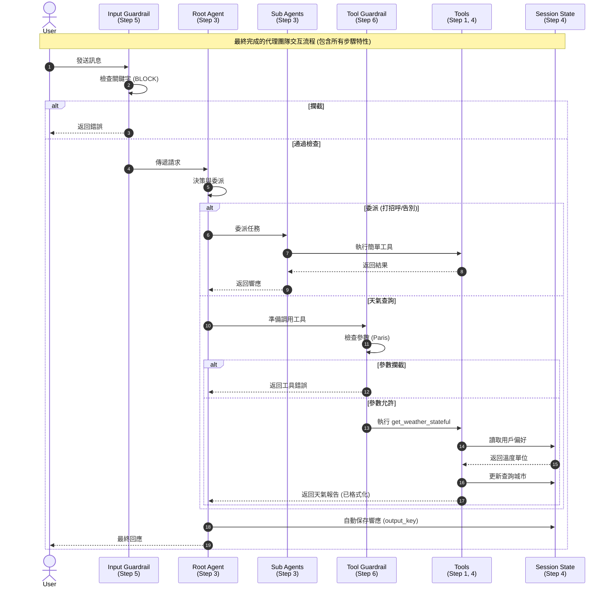

# 使用 ADK 構建您的第一個智慧代理團隊：進階天氣機器人

> 🔔 `更新日期：2026-02-08`
>
> 🔗 `資料來源`：https://google.github.io/adk-docs/tutorials/agent-team/

分享至：

本教程擴展自 [Agent Development Kit](https://google.github.io/adk-docs/get-started/) 的 [快速入門範例](https://google.github.io/adk-docs/get-started/quickstart/)。現在，您已準備好深入探索並構建一個更複雜的**多代理系統**。

我們將著手構建一個**天氣機器人代理團隊**，在簡單的基礎上逐步增加進階功能。從一個可以查詢天氣的單一代理開始，我們將逐步添加以下功能：

- 利用不同的 AI 模型（Gemini、GPT、Claude）。
- 為不同任務設計專門的子代理（如打招呼和告別）。
- 在代理之間實現智慧委派。
- 使用持久化的對話狀態賦予代理記憶。
- 使用回調（callbacks）實施關鍵的安全防護欄（safety guardrails）。

**為什麼選擇天氣機器人團隊？**

這個案例雖然看似簡單，但提供了一個實用且易於理解的畫布，用於探索構建複雜、真實代理應用程序所必需的核心 ADK 概念。您將學習如何組織交互、管理狀態、確保安全，並協調多個 AI 「大腦」協同工作。

**ADK 是什麼？**

提醒一下，ADK 是一個 Python 框架，旨在簡化由大型語言模型（LLM）驅動的應用程序的開發。它為創建能夠推理、計畫、利用工具、與用戶動態交互並在團隊中有效協作的代理提供了強大的構件。

**在本進階教程中，您將掌握：**

- ✅ **工具定義與使用：** 編寫 Python 函數（`tools`），賦予代理特定能力（如獲取數據），並指導代理如何有效使用它們。
- ✅ **多 LLM 靈活性：** 通過 LiteLLM 集成，配置代理使用各種領先的 LLM（Gemini、GPT-4o、Claude Sonnet），讓您能為每個任務選擇最佳模型。
- ✅ **代理委派與協作：** 設計專門的子代理，並實現用戶請求到團隊中最合適代理的自動路由（`auto flow`）。
- ✅ **記憶的會話狀態：** 利用 `Session State` 和 `ToolContext` 使代理能夠記住跨對話輪次的資訊，從而實現更具上下文的交互。
- ✅ **回調的安全防護欄：** 實施 `before_model_callback` 和 `before_tool_callback` 來根據預定義規則檢查、修改或攔截請求/工具使用，增強應用程序的安全性和控制力。

**預期最終狀態：**

完成本教程後，您將構建一個功能齊全的多代理天氣機器人系統。該系統不僅能提供天氣資訊，還能處理社交禮儀、記住上次查詢的城市，並在定義的安全邊界內運行，所有這一切都使用 ADK 進行協調。

**先決條件：**

- ✅ **紮實的 Python 編程理解。**
- ✅ **熟悉大型語言模型（LLM）、API 和代理的概念。**
- ❗ **關鍵：完成 ADK 快速入門教程或具備同等的 ADK 基礎知識（Agent、Runner、SessionService、基本 Tool 使用）。** 本教程直接建立在這些概念之上。
- ✅ **API 金鑰**，用於您打算使用的 LLM（例如，Google AI Studio 用於 Gemini，OpenAI 平臺，Anthropic 主控台）。

______________________________________________________________________

**執行環境注意事項：**

本教程適用於交互式筆記本環境，如 Google Colab、Colab Enterprise 或 Jupyter 筆記本。請記住以下幾點：

- **運行異步代碼：** 筆記本環境處理異步代碼的方式不同。您會看到使用 `await`（適用於事件循環已在運行的情況，常見於筆記本）或 `asyncio.run()`（通常在作為獨立 `.py` 腳本運行或在特定筆記本設置中需要）的範例。代碼塊為這兩種情況都提供了指導。
- **手動 Runner/Session 設置：** 涉及顯式創建 `Runner` 和 `SessionService` 實例。展示這種方法是因為它讓您可以對代理的執行生命週期、會話管理和狀態持久化進行細粒度控制。

**替代方案：使用 ADK 的內置工具（Web UI / CLI / API 伺服器）**

如果您更喜歡使用 ADK 的標準工具自動處理 runner 和會話管理的設置，可以在[此處](https://github.com/google/adk-docs/tree/main/examples/python/tutorial/agent_team/adk-tutorial)找到為該目的組織的等效代碼。該版本旨在直接使用 `adk web`（用於 Web UI）、`adk run`（用於 CLI 交互）或 `adk api_server`（用於公開 API）等命令運行。請遵循該替代資源中提供的 `README.md` 說明。

______________________________________________________________________

**準備好構建您的代理團隊了嗎？讓我們開始吧！**

### 教程概覽與系統交互圖

為了幫助您理解本教程的學習路徑以及最終構建的系統如何運作，我們提供了以下的可視化流程圖與步驟摘要。

#### 1. 最終代理團隊交互邏輯 (Sequence Diagram)

此圖展示了在完成所有步驟後，您的天氣機器人團隊如何處理用戶請求，包括狀態管理、委派機制以及安全防護欄的運作。



#### 2. 步驟開發指南

下表總結了本教程的各個開發階段，幫助您追蹤進度與核心概念。

| 步驟 | 標題 | 說明 | 重點摘要 / 涉及技術 |
| :--- | :--- | :--- | :--- |
| **Step 0** | 設置與安裝 | 安裝 ADK、LiteLLM 並配置 API 金鑰。 | `pip install`, `os.environ`, API Keys setup |
| **Step 1** | 基礎天氣查詢代理 | 建立第一個單一功能的代理，包含工具定義。 | `Agent`, `Tool` (Function), `Runner`, `InMemorySessionService` |
| **Step 2** | 多模型支援 (LiteLLM) | 配置代理使用不同的 LLM (Gemini, GPT, Claude)。 | `LiteLlm` wrapper, Multi-model flexibility |
| **Step 3** | 代理團隊與委派 | 建立專門的子代理並實現自動路由委派。 | `sub_agents`, Auto-delegation, `instruction` for routing |
| **Step 4** | 會話狀態與記憶 | 引入狀態管理，讓代理記住偏好與歷史。 | `Session State`, `ToolContext`, `output_key` |
| **Step 5** | 輸入防護欄 (Callback) | 在模型處理前檢查並攔截用戶輸入。 | `before_model_callback`, `CallbackContext`, `LlmRequest` |
| **Step 6** | 工具防護欄 (Callback) | 在工具執行前檢查並驗證參數。 | `before_tool_callback`, Argument Validation, `BaseTool` |

---
> **注意：** 本教程適用於 adk 1.0.0 及以上版本

```python
# @title 步驟 0：設置與安裝
# 安裝 ADK 和 LiteLLM 以支持多模型

# 安裝 Google ADK 庫
!pip install google-adk -q
# 安裝 LiteLLM 庫以支援多種模型
!pip install litellm -q

print("安裝完成。")
```

```python
# @title 導入必要的庫
import os
import asyncio
from google.adk.agents import Agent
from google.adk.models.lite_llm import LiteLlm # 用於多模型支持
from google.adk.sessions import InMemorySessionService
from google.adk.runners import Runner
from google.genai import types # 用於創建消息內容/部分

import warnings
# 忽略所有警告
warnings.filterwarnings("ignore")

import logging
# 設置日誌級別為錯誤
logging.basicConfig(level=logging.ERROR)

print("庫導入完成。")
```

```python
# @title 配置 API 金鑰（請替換為您的實際金鑰！）

# --- 重要提示：請將占位符替換為您的真實 API 金鑰 ---

# Gemini API 金鑰（從 Google AI Studio 獲取：https://aistudio.google.com/app/apikey）
os.environ["GOOGLE_API_KEY"] = "YOUR_GOOGLE_API_KEY" # <--- 替換

# [選填]
# OpenAI API 金鑰（從 OpenAI 平臺獲取：https://platform.openai.com/api-keys）
os.environ['OPENAI_API_KEY'] = 'YOUR_OPENAI_API_KEY' # <--- 替換

# [選填]
# Anthropic API 金鑰（從 Anthropic 主控台獲取：https://console.anthropic.com/settings/keys）
os.environ['ANTHROPIC_API_KEY'] = 'YOUR_ANTHROPIC_API_KEY' # <--- 替換

# --- 驗證金鑰（選填檢查） ---
print("API 金鑰設置情況：")
print(f"Google API 金鑰已設置：{'是' if os.environ.get('GOOGLE_API_KEY') and os.environ['GOOGLE_API_KEY'] != 'YOUR_GOOGLE_API_KEY' else '否（請替換占位符！）'}")
print(f"OpenAI API 金鑰已設置：{'是' if os.environ.get('OPENAI_API_KEY') and os.environ['OPENAI_API_KEY'] != 'YOUR_OPENAI_API_KEY' else '否（請替換占位符！）'}")
print(f"Anthropic API 金鑰已設置：{'是' if os.environ.get('ANTHROPIC_API_KEY') and os.environ['ANTHROPIC_API_KEY'] != 'YOUR_ANTHROPIC_API_KEY' else '否（請替換占位符！）'}")

# 配置 ADK 直接使用 API 金鑰（在此多模型設置中不使用 Vertex AI）
os.environ["GOOGLE_GENAI_USE_VERTEXAI"] = "False"


# @markdown **安全提示：** 最佳實踐是安全地管理 API 金鑰（例如，使用 Colab Secrets 或環境變量），而不是直接將它們硬編碼在筆記本中。請替換上面的占位符字符串。
```

```python
# --- 為方便使用定義模型常量 ---

# 更多受支持的模型可參考此處：https://ai.google.dev/gemini-api/docs/models#model-variations
MODEL_GEMINI_2_5_FLASH = "gemini-2.5-flash"

# 更多受支持的模型可參考此處：https://docs.litellm.ai/docs/providers/openai#openai-chat-completion-models
MODEL_GPT_4O = "openai/gpt-4.1" # 您也可以嘗試：gpt-4.1-mini, gpt-4o 等。

# 更多受支持的模型可參考此處：https://docs.litellm.ai/docs/providers/anthropic
MODEL_CLAUDE_SONNET = "anthropic/claude-sonnet-4-20250514" # 您也可以嘗試：claude-opus-4-20250514, claude-3-7-sonnet-20250219 等

print("\n環境配置完成。")
```

______________________________________________________________________

## 步驟 1：您的第一個代理 - 基礎天氣查詢

讓我們從構建天氣機器人的基本組件開始：一個能夠執行特定任務——查詢天氣資訊的單一代理。這涉及創建兩個核心部分：

1. **工具（Tool）：** 一個 Python 函數，賦予代理獲取天氣數據的*能力*。
2. **代理（Agent）：** AI 「大腦」，負責理解用戶請求，知道自己擁有天氣工具，並決定何時以及如何使用它。

______________________________________________________________________

**1. 定義工具 (`get_weather`)**

在 ADK 中，**工具**是賦予代理除文本生成之外具體能力的構件。它們通常是執行特定操作的常規 Python 函數，例如調用 API、查詢數據庫或執行計算。

我們的第一個工具將提供一個*模擬（mock）*天氣報告。這讓我們可以專注於代理結構，而暫時不需要外部 API 金鑰。稍後，您可以輕鬆地將此模擬函數替換為調用真實天氣服務的函數。

**核心概念：文檔字符串（Docstrings）至關重要！** 代理的 LLM 嚴重依賴函數的**文檔字符串**來理解：

- 工具*做什麼*。
- *何時*使用它。
- 它需要*哪些參數*（`city: str`）。
- 它返回*什麼資訊*。

**最佳實踐：** 為您的工具編寫清晰、具體且準確的文檔字符串。這對於 LLM 正確使用工具至關重要。

```python
# @title 定義 get_weather 工具
def get_weather(city: str) -> dict:
    """檢索指定城市的當前天氣報告。

    參數：
        city (str): 城市的名稱（例如 "New York", "London", "Tokyo"）。

    返回：
        dict: 包含天氣資訊的字典。
              包含一個 'status' 鍵（'success' 或 'error'）。
              如果為 'success'，則包含一個具有天氣詳情的 'report' 鍵。
              如果為 'error'，則包含一個 'error_message' 鍵。
    """
    # 記錄工具執行情況
    print(f"--- 工具：為城市調用 get_weather：{city} ---")
    # 基礎格式化
    city_normalized = city.lower().replace(" ", "")

    # 模擬天氣數據庫
    mock_weather_db = {
        "newyork": {"status": "success", "report": "紐約的天氣晴朗，氣溫為 25°C。"},
        "london": {"status": "success", "report": "倫敦多雲，氣溫為 15°C。"},
        "tokyo": {"status": "success", "report": "東京正在下小雨，氣溫為 18°C。"},
    }

    if city_normalized in mock_weather_db:
        return mock_weather_db[city_normalized]
    else:
        return {"status": "error", "error_message": f"抱歉，我沒有 '{city}' 的天氣資訊。"}

# 示例工具使用（選填測試）
print(get_weather("New York"))
print(get_weather("Paris"))
```

______________________________________________________________________

**2. 定義代理 (`weather_agent`)**

現在，讓我們創建**代理**本身。ADK 中的 `Agent` 負責協調用戶、LLM 和可用工具之間的交互。

我們使用幾個關鍵參數對其進行配置：

- `name`: 此代理的唯一標識符（例如 "weather_agent_v1"）。
- `model`: 指定要使用的 LLM（例如 `MODEL_GEMINI_2_5_FLASH`）。我們將從特定的 Gemini 模型開始。
- `description`: 代理總體目標的簡明摘要。當其他代理稍後需要決定是否將任務委派給*此*代理時，這變得至關重要。
- `instruction`: 對 LLM 如何表現、其人格設定、其目標以及具體*如何及何時*利用其分配的 `tools` 的詳細指導。
- `tools`: 代理允許使用的實際 Python 工具函數列表（例如 `[get_weather]`）。

**最佳實踐：** 提供清晰且具體的 `instruction` 提示。指令越詳細，LLM 就越能理解其角色以及如何有效地使用其工具。如果需要，請明確說明錯誤處理。

**最佳實踐：** 選擇具描述性的 `name` 和 `description` 值。這些在 ADK 內部使用，對於自動委派（稍後介紹）等功能至關重要。

```python
# @title 定義天氣代理
# 使用之前定義的模型常量之一
AGENT_MODEL = MODEL_GEMINI_2_5_FLASH # 從 Gemini 開始

weather_agent = Agent(
    name="weather_agent_v1",
    model=AGENT_MODEL, # 可以是 Gemini 的字符串或 LiteLlm 對象
    description="提供特定城市的天氣資訊。",
    instruction="你是一個樂於助人的天氣助手。"
                "當用戶詢問特定城市的天氣時，"
                "使用 'get_weather' 工具查找資訊。"
                "如果工具返回錯誤，請禮貌地告知用戶。"
                "如果工具成功，請清晰地呈現天氣報告。",
    tools=[get_weather], # 直接傳遞函數
)

print(f"代理 '{weather_agent.name}' 已使用模型 '{AGENT_MODEL}' 創建。")
```

______________________________________________________________________

**3. 設置 Runner 和 Session Service**

要管理對話並執行代理，我們還需要兩個組件：

- `SessionService`: 負責管理不同用戶和會話的對話歷史記錄和狀態。`InMemorySessionService` 是一個簡單的實現，將所有內容存儲在記憶體中，適用於測試和簡單應用。它跟蹤交換的消息。我們將在步驟 4 中進一步探索狀態持久化。
- `Runner`: 協調交互流程的引擎。它接收用戶輸入，將其路由到適當的代理，根據代理邏輯管理對 LLM 和工具的調用，通過 `SessionService` 處理會話更新，並產生代表交互進度的事件。

```python
# @title 設置會話服務和 Runner

# --- 會話管理 ---
# 核心概念：SessionService 存儲對話歷史和狀態。
# InMemorySessionService 是本教程中簡單的、非持久化的存儲。
session_service = InMemorySessionService()

# 定義用於標識交互上下文的常量
APP_NAME = "weather_tutorial_app"
USER_ID = "user_1"
SESSION_ID = "session_001" # 為簡單起見使用固定 ID

# 創建對話發生的特定會話
session = await session_service.create_session(
    app_name=APP_NAME,
    user_id=USER_ID,
    session_id=SESSION_ID
)
print(f"會話已創建：App='{APP_NAME}', User='{USER_ID}', Session='{SESSION_ID}'")

# --- 或者 ---

# 如果作為標準 Python 腳本（.py 文件）運行，請取消註釋以下行：

# async def init_session(app_name:str,user_id:str,session_id:str) -> InMemorySessionService:
#     session = await session_service.create_session(
#         app_name=app_name,
#         user_id=user_id,
#         session_id=session_id
#     )
#     print(f"會話已創建：App='{app_name}', User='{user_id}', Session='{session_id}'")
#     return session
#
# session = asyncio.run(init_session(APP_NAME,USER_ID,SESSION_ID))

# --- Runner ---
# 核心概念：Runner 協調代理執行循環。
runner = Runner(
    agent=weather_agent, # 我們想要運行的代理
    app_name=APP_NAME,   # 將運行與我們的應用關聯起來
    session_service=session_service # 使用我們的會話管理器
)
print(f"已為代理 '{runner.agent.name}' 創建 Runner。")
```

______________________________________________________________________

**4. 與代理交互**

我們需要一種方式向代理發送消息並接收其響應。由於 LLM 調用和工具執行可能需要時間，ADK 的 `Runner` 異步運行。

我們將定義一個 `async` 輔助函數 (`call_agent_async`)，它會：

1. 獲取用戶查詢字符串。
2. 將其包裝成 ADK `Content` 格式。
3. 調用 `runner.run_async`，提供用戶/會話上下文和新消息。
4. 迭代 runner 產生的**事件（Events）**。事件代表代理執行中的步驟（例如，請求工具調用、接收工具結果、LLM 中間想法、最終響應）。
5. 使用 `event.is_final_response()` 識別並列印**最終響應**事件。

**為什麼使用 `async`？** 與 LLM 交互以及可能的工具（如外部 API）是 I/O 密集型操作。使用 `asyncio` 允許程序有效地處理這些操作，而不會阻塞執行。

```python
# @title 定義代理交互函數

from google.genai import types # 用於創建消息內容/部分

async def call_agent_async(query: str, runner, user_id, session_id):
  """向代理發送查詢並列印最終響應。"""
  print(f"\n>>> 用戶查詢：{query}")

  # 以 ADK 格式準備用戶消息
  content = types.Content(role='user', parts=[types.Part(text=query)])

  final_response_text = "代理未產生最終響應。" # 默認值

  # 核心概念：run_async 執行代理邏輯並產生事件。
  # 我們迭代事件以找到最終答案。
  async for event in runner.run_async(user_id=user_id, session_id=session_id, new_message=content):
      # 您可以取消註釋下一行以查看執行期間的所有事件
      # print(f"  [Event] Author: {event.author}, Type: {type(event).__name__}, Final: {event.is_final_response()}, Content: {event.content}")

      # 核心概念：is_final_response() 標記該輪對話的總結性消息。
      if event.is_final_response():
          if event.content and event.content.parts:
             # 假設第一個部分中包含文本響應
             final_response_text = event.content.parts[0].text
          elif event.actions and event.actions.escalate: # 處理潛在的錯誤/升級
             final_response_text = f"代理已升級：{event.error_message or '無特定消息。'}"
          # 如果需要，在此處添加更多檢查（例如，特定的錯誤代碼）
          break # 找到最終響應後停止處理事件

  print(f"<<< 代理響應：{final_response_text}")
```

______________________________________________________________________

**5. 運行對話**

最後，讓我們通過向代理發送幾個查詢來測試我們的設置。我們將 `async` 調用包裝在主 `async` 函數中，並使用 `await` 運行它。

觀察輸出：

- 查看用戶查詢。
- 注意當代理使用工具時出現的 `--- 工具：為城市調用 get_weather... ---` 日誌。
- 觀察代理的最終響應，包括它如何處理天氣數據不可用的情況（對於巴黎）。

```python
# @title 運行初始對話

# 我們需要一個異步函數來等待我們的交互輔助函數
async def run_conversation():
    await call_agent_async("倫敦的天氣怎麼樣？",
                                       runner=runner,
                                       user_id=USER_ID,
                                       session_id=SESSION_ID)

    await call_agent_async("那巴黎呢？",
                                       runner=runner,
                                       user_id=USER_ID,
                                       session_id=SESSION_ID) # 預期會有工具的錯誤消息

    await call_agent_async("告訴我紐約的天氣",
                                       runner=runner,
                                       user_id=USER_ID,
                                       session_id=SESSION_ID)

# 在異步上下文（如 Colab/Jupyter）中使用 await 執行對話
await run_conversation()

# --- 或者 ---

# 如果作為標準 Python 腳本（.py 文件）運行，請取消註釋以下行：
# import asyncio
# if __name__ == "__main__":
#     try:
#         asyncio.run(run_conversation())
#     except Exception as e:
#         print(f"發生錯誤：{e}")
```

______________________________________________________________________

恭喜！您已成功構建您的第一個 ADK 代理並與之交互。它理解用戶請求，使用工具查找資訊，並根據工具結果做出適當響應。

在下一步中，我們將探索如何輕鬆切換驅動此代理的底層語言模型。

## 步驟 2：使用 LiteLLM 實現多模型支援 [選填]

在步驟 1 中，我們構建了一個由特定 Gemini 模型驅動的功能性天氣代理。雖然有效，但現實世界的應用通常受益於使用*不同*大型語言模型（LLM）的靈活性。為什麼？

- **性能：** 某些模型在特定任務（如編碼、推理、創意寫作）方面表現出色。
- **成本：** 不同模型的價格點各異。
- **功能：** 模型提供多樣化的功能、上下文窗口大小和微調選項。
- **可用性/冗餘：** 擁有替代方案可確保即使一家提供商出現問題，您的應用程序仍能正常運行。

ADK 通過集成 [**LiteLLM**](https://github.com/BerriAI/litellm) 庫，使在模型之間切換變得天衣無縫。LiteLLM 作為超過 100 種不同 LLM 的統一介面。

**在此步驟中，我們將：**

1. 學習如何配置 ADK `Agent`，使用 `LiteLlm` 包裝器來調用來自 OpenAI (GPT) 和 Anthropic (Claude) 等提供商的模型。
2. 定義、配置（具有各自的會話和 runner）並立即測試我們的天氣代理實例，每個實例都由不同的 LLM 支援。
3. 與這些不同的代理交互，觀察它們響應中可能存在的差異，即使使用的是同一個底層工具。

______________________________________________________________________

**1. 導入 `LiteLlm`**

我們在初始設置（步驟 0）中導入了這個組件，它是多模型支援的關鍵：

```python
# @title 1. 導入 LiteLlm
from google.adk.models.lite_llm import LiteLlm
```

**2. 定義並測試多模型代理**

我們不只是傳遞模型名稱字符串（默認使用 Google 的 Gemini 模型），而是將所需的模型標識符字符串包裝在 `LiteLlm` 類中。

- **核心概念：`LiteLlm` 包裝器：** `LiteLlm(model="provider/model_name")` 語法告訴 ADK 通過 LiteLLM 庫將此代理的請求路由到指定的模型提供商。

確保您已在步驟 0 中配置了 OpenAI 和 Anthropic 必要的 API 金鑰。我們將使用之前定義的 `call_agent_async` 函數（現在接受 `runner`、`user_id` 和 `session_id`）在設置完成後立即與每個代理交互。

下面的每個代碼塊都將：

- 使用特定的 LiteLLM 模型（`MODEL_GPT_4O` 或 `MODEL_CLAUDE_SONNET`）定義代理。
- 專門為該代理的測試運行創建一個*新的、獨立的* `InMemorySessionService` 和會話。這可以使對話歷史在演示中保持隔離。
- 創建一個為特定代理及其會話服務配置的 `Runner`。
- 立即調用 `call_agent_async` 發送查詢並測試代理。

**最佳實踐：** 使用模型名稱常量（如步驟 0 中定義的 `MODEL_GPT_4O`、`MODEL_CLAUDE_SONNET`）以避免拼寫錯誤並使代碼更易於管理。

**錯誤處理：** 我們將代理定義包裝在 `try...except` 塊中。如果缺少特定提供商的 API 金鑰或金鑰無效，這可以防止整個代碼單元格失敗，從而允許教程繼續使用*已配置*的模型。

首先，讓我們創建並測試使用 OpenAI GPT-4o 的代理。

```python
# @title 定義並測試 GPT 代理

# 確保環境中已定義步驟 1 中的 'get_weather' 函數。
# 確保之前已定義 'call_agent_async'。

# --- 使用 GPT-4o 的代理 ---
weather_agent_gpt = None # 初始化為 None
runner_gpt = None      # 將 runner 初始化為 None

try:
    weather_agent_gpt = Agent(
        name="weather_agent_gpt",
        # 關鍵變化：包裝 LiteLLM 模型標識符
        model=LiteLlm(model=MODEL_GPT_4O),
        description="提供天氣資訊（使用 GPT-4o）。",
        instruction="你是一個由 GPT-4o 驅動的樂於助人的天氣助手。"
                    "對於城市天氣請求，請使用 'get_weather' 工具。"
                    "根據工具的輸出狀態，清晰地呈現成功的報告或禮貌的錯誤消息。",
        tools=[get_weather], # 重用同一個工具
    )
    print(f"代理 '{weather_agent_gpt.name}' 已使用模型 '{MODEL_GPT_4O}' 創建。")

    # InMemorySessionService 是本教程中簡單的、非持久化的存儲。
    session_service_gpt = InMemorySessionService() # 創建專用服務

    # 定義用於標識交互上下文的常量
    APP_NAME_GPT = "weather_tutorial_app_gpt" # 此測試的唯一應用名稱
    USER_ID_GPT = "user_1_gpt"
    SESSION_ID_GPT = "session_001_gpt" # 為簡單起見使用固定 ID

    # 創建對話發生的特定會話
    session_gpt = await session_service_gpt.create_session(
        app_name=APP_NAME_GPT,
        user_id=USER_ID_GPT,
        session_id=SESSION_ID_GPT
    )
    print(f"會話已創建：App='{APP_NAME_GPT}', User='{USER_ID_GPT}', Session='{SESSION_ID_GPT}'")

    # 創建特定於此代理及其會話服務的 runner
    runner_gpt = Runner(
        agent=weather_agent_gpt,
        app_name=APP_NAME_GPT,       # 使用特定應用名稱
        session_service=session_service_gpt # 使用特定會話服務
        )
    print(f"已為代理 '{runner_gpt.agent.name}' 創建 Runner。")

    # --- 測試 GPT 代理 ---
    print("\n--- 正在測試 GPT 代理 ---")
    # 確保 call_agent_async 使用正確的 runner, user_id, session_id
    await call_agent_async(query = "東京的天氣怎麼樣？",
                           runner=runner_gpt,
                           user_id=USER_ID_GPT,
                           session_id=SESSION_ID_GPT)
    # --- 或者 ---

    # 如果作為標準 Python 腳本（.py 文件）運行，請取消註釋以下行：
    # import asyncio
    # if __name__ == "__main__":
    #     try:
    #         asyncio.run(call_agent_async(query = "東京的天氣怎麼樣？",
    #                      runner=runner_gpt,
    #                       user_id=USER_ID_GPT,
    #                       session_id=SESSION_ID_GPT)
    #     except Exception as e:
    #         print(f"發生錯誤：{e}")

except Exception as e:
    print(f"❌ 無法創建或運行 GPT 代理 '{MODEL_GPT_4O}'。請檢查 API 金鑰和模型名稱。錯誤：{e}")
```

接下來，我們將對 Anthropic 的 Claude Sonnet 執行相同的操作。

```python
# @title 定義並測試 Claude 代理

# 確保環境中已定義步驟 1 中的 'get_weather' 函數。
# 確保之前已定義 'call_agent_async'。

# --- 使用 Claude Sonnet 的代理 ---
weather_agent_claude = None # 初始化為 None
runner_claude = None      # 將 runner 初始化為 None

try:
    weather_agent_claude = Agent(
        name="weather_agent_claude",
        # 關鍵變化：包裝 LiteLLM 模型標識符
        model=LiteLlm(model=MODEL_CLAUDE_SONNET),
        description="提供天氣資訊（使用 Claude Sonnet）。",
        instruction="你是一個由 Claude Sonnet 驅動的樂於助人的天氣助手。"
                    "對於城市天氣請求，請使用 'get_weather' 工具。"
                    "分析工具的字典輸出（'status', 'report'/'error_message'）。"
                    "清晰地呈現成功的報告或禮貌的錯誤消息。",
        tools=[get_weather], # 重用同一個工具
    )
    print(f"代理 '{weather_agent_claude.name}' 已使用模型 '{MODEL_CLAUDE_SONNET}' 創建。")

    # InMemorySessionService 是本教程中簡單的、非持久化的存儲。
    session_service_claude = InMemorySessionService() # 創建專用服務

    # 定義用於標識交互上下文的常量
    APP_NAME_CLAUDE = "weather_tutorial_app_claude" # 唯一應用名稱
    USER_ID_CLAUDE = "user_1_claude"
    SESSION_ID_CLAUDE = "session_001_claude" # 為簡單起見使用固定 ID

    # 創建對話發生的特定會話
    session_claude = await session_service_claude.create_session(
        app_name=APP_NAME_CLAUDE,
        user_id=USER_ID_CLAUDE,
        session_id=SESSION_ID_CLAUDE
    )
    print(f"會話已創建：App='{APP_NAME_CLAUDE}', User='{USER_ID_CLAUDE}', Session='{SESSION_ID_CLAUDE}'")

    # 創建特定於此代理及其會話服務的 runner
    runner_claude = Runner(
        agent=weather_agent_claude,
        app_name=APP_NAME_CLAUDE,       # 使用特定應用名稱
        session_service=session_service_claude # 使用特定會話服務
        )
    print(f"已為代理 '{runner_claude.agent.name}' 創建 Runner。")

    # --- 測試 Claude 代理 ---
    print("\n--- 正在測試 Claude 代理 ---")
    # 確保 call_agent_async 使用正確的 runner, user_id, session_id
    await call_agent_async(query = "請告訴我倫敦的天氣。",
                           runner=runner_claude,
                           user_id=USER_ID_CLAUDE,
                           session_id=SESSION_ID_CLAUDE)

    # --- 或者 ---

    # 如果作為標準 Python 腳本（.py 文件）運行，請取消註釋以下行：
    # import asyncio
    # if __name__ == "__main__":
    #     try:
    #         asyncio.run(call_agent_async(query = "請告訴我倫敦的天氣。",
    #                      runner=runner_claude,
    #                       user_id=USER_ID_CLAUDE,
    #                       session_id=SESSION_ID_CLAUDE)
    #     except Exception as e:
    #         print(f"發生錯誤：{e}")


except Exception as e:
    print(f"❌ 無法創建或運行 Claude 代理 '{MODEL_CLAUDE_SONNET}'。請檢查 API 金鑰和模型名稱。錯誤：{e}")
```

仔細觀察這兩個代碼塊的輸出。您應該看到：

1. 每個代理（`weather_agent_gpt`, `weather_agent_claude`）都成功創建（如果 API 金鑰有效）。
2. 為每個代理設置了專用的會話和 runner。
3. 每個代理在處理查詢時都正確識別出需要使用 `get_weather` 工具（您將看到 `--- 工具：為城市調用 get_weather... ---` 日誌）。
4. **底層工具邏輯**保持一致，始終返回我們的模擬數據。
5. 然而，每個代理產生的**最終文本響應**在措辭、語氣或格式上可能略有不同。這是因為指令提示是由不同的 LLM（GPT-4o 與 Claude Sonnet）解釋和執行的。

這一步演示了 ADK + LiteLLM 提供的強大功能和靈活性。您可以輕鬆嘗試和部署使用各種 LLM 的代理，同時保持核心應用邏輯（工具、基本代理結構）的一致性。

在下一步中，我們將超越單個代理，構建一個代理之間可以相互委派任務的小型團隊！

______________________________________________________________________

## 步驟 3：構建代理團隊 - 打招呼與告別的委派

在步驟 1 和 2 中，我們構建並實驗了僅專注於天氣查詢的單個代理。雖然對於特定任務有效，但現實世界的應用通常涉及處理更廣泛的用戶交互。我們*可以*繼續向單個天氣代理添加更多工具和複雜指令，但這會很快變得難以管理且效率低下。

更強大的方法是構建一個**代理團隊**。這涉及：

1. 創建多個**專門的代理**，每個代理都為特定能力設計（例如，一個負責天氣，一個負責打招呼，一個負責計算）。
2. 指定一個**根代理**（或協調器）來接收初始用戶請求。
3. 賦予根代理根據用戶意圖將請求**委派**給最合適的專門子代理的能力。

**為什麼構建代理團隊？**

- **模組化：** 易於開發、測試和維護單個代理。
- **專業化：** 每個代理都可以針對其特定任務進行微調（指令、模型選擇）。
- **可擴展性：** 通過添加新代理來增加新功能更簡單。
- **效率：** 允許對更簡單的任務（如打招呼）使用可能更簡單/更便宜的模型。

**在此步驟中，我們將：**

1. 定義用於處理打招呼 (`say_hello`) 和告別 (`say_goodbye`) 的簡單工具。
2. 創建兩個新的專門子代理：`greeting_agent` 和 `farewell_agent`。
3. 更新我們的主天氣代理 (`weather_agent_v2`) 作為**根代理**。
4. 為根代理配置其子代理，實現**自動委派**。
5. 通過向根代理發送不同類型的請求來測試委派流程。

______________________________________________________________________

**1. 為子代理定義工具**

首先，讓我們創建簡單的 Python 函數，作為我們新專家代理的工具。請記住，清晰的文檔字符串對於使用它們的代理至關重要。

```python
# @title 為打招呼和告別代理定義工具
from typing import Optional # 確保導入 Optional

# 如果獨立運行此步驟，請確保步驟 1 中的 'get_weather' 可用。
# def get_weather(city: str) -> dict: ... (來自步驟 1)

def say_hello(name: Optional[str] = None) -> str:
    """提供簡單的打招呼。如果提供了姓名，將會被使用。

    參數：
        name (str, 選填): 要打招呼的人的姓名。如果未提供，則默認為通用打招呼。

    返回：
        str: 友好的打招呼消息。
    """
    if name:
        greeting = f"你好，{name}！"
        print(f"--- 工具：調用 say_hello，姓名：{name} ---")
    else:
        greeting = "你好呀！" # 如果姓名為 None 或未顯式傳遞，則使用默認打招呼
        print(f"--- 工具：調用 say_hello，未指定特定姓名 (name_arg_value: {name}) ---")
    return greeting

def say_goodbye() -> str:
    """提供簡單的告別消息以結束對話。"""
    print(f"--- 工具：調用 say_goodbye ---")
    return "再見！祝你有美好的一天。"

print("打招呼和告別工具已定義。")

# 選填自測
print(say_hello("Alice"))
print(say_hello()) # 測試無參數（應使用默認的 "你好呀！"）
print(say_hello(name=None)) # 測試姓名顯式為 None（應使用默認的 "你好呀！"）
```

______________________________________________________________________

**2. 定義子代理（打招呼與告別）**

現在，為我們的專家創建 `Agent` 實例。注意它們高度集中的 `instruction` 以及關鍵的、清晰的 `description`。`description` 是*根代理*用來決定*何時*委派給這些子代理的主要資訊。

**最佳實踐：** 子代理的 `description` 欄位應準確且簡明地總結其特定能力。這對於有效的自動委派至關重要。

**最佳實踐：** 子代理的 `instruction` 欄位應針對其有限的範圍量身定制，告訴它們確切該做什麼以及*不該*做什麼（例如，「你*唯一的*任務是...」）。


```python
# @title 定義打招呼和告別子代理

# 如果您想使用 Gemini 以外的模型，請確保導入 LiteLlm 並設置 API 金鑰（來自步驟 0/2）
# from google.adk.models.lite_llm import LiteLlm
# 應定義 MODEL_GPT_4O, MODEL_CLAUDE_SONNET 等。
# 否則，繼續使用：model = MODEL_GEMINI_2_5_FLASH

# --- 打招呼代理 ---
greeting_agent = None
try:
    greeting_agent = Agent(
        # 為簡單任務使用可能不同/更便宜的模型
        model = MODEL_GEMINI_2_5_FLASH,
        # model=LiteLlm(model=MODEL_GPT_4O), # 如果您想嘗試其他模型
        name="greeting_agent",
        instruction="你是打招呼代理。你唯一的任務是向用戶提供友好的打招呼。"
                    "使用 'say_hello' 工具生成打招呼。"
                    "如果用戶提供了姓名，請確保將其傳遞給工具。"
                    "不要參與任何其他對話或任務。",
        description="使用 'say_hello' 工具處理簡單的打招呼。", # 對委派至關重要
        tools=[say_hello],
    )
    print(f"✅ 代理 '{greeting_agent.name}' 已使用模型 '{greeting_agent.model}' 創建。")
except Exception as e:
    print(f"❌ 無法創建打招呼代理。請檢查 API 金鑰 ({greeting_agent.model})。錯誤：{e}")

# --- 告別代理 ---
farewell_agent = None
try:
    farewell_agent = Agent(
        # 可以使用相同或不同的模型
        model = MODEL_GEMINI_2_5_FLASH,
        # model=LiteLlm(model=MODEL_GPT_4O), # 如果您想嘗試其他模型
        name="farewell_agent",
        instruction="你是告別代理。你唯一的任務是提供禮貌的告別消息。"
                    "當用戶表示他們要離開或結束對話時，請使用 'say_goodbye' 工具。"
                    "（例如，使用像 '掰掰'、'再見'、'謝謝，再見'、'回頭見' 之類的詞）。"
                    "不要執行任何其他操作。",
        description="使用 'say_goodbye' 工具處理簡單的告別。", # 對委派至關重要
        tools=[say_goodbye],
    )
    print(f"✅ 代理 '{farewell_agent.name}' 已使用模型 '{farewell_agent.model}' 創建。")
except Exception as e:
    print(f"❌ 無法創建告別代理。請檢查 API 金鑰 ({farewell_agent.model})。錯誤：{e}")
```

______________________________________________________________________

**3. 定義帶有子代理的根代理 (天氣代理 v2)**

現在，我們升級我們的 `weather_agent`。關鍵變化是：

- 添加 `sub_agents` 參數：我們傳遞一個包含剛剛創建的 `greeting_agent` 和 `farewell_agent` 實例的列表。
- 更新 `instruction`：我們明確告訴根代理其子代理以及何時應將任務委派給它們。

**核心概念：自動委派（Auto Flow）** 通過提供 `sub_agents` 列表，ADK 實現了自動委派。當根代理收到用戶查詢時，其 LLM 不僅考慮其自身的指令和工具，還考慮每個子代理的 `description`。如果 LLM 確定某個查詢與子代理描述的能力（例如，「處理簡單的打招呼」）更吻合，它將自動生成一個特殊的內部操作，在該輪對話中將*控制權轉移*給該子代理。然後，子代理使用其自身的模型、指令和工具處理查詢。

**最佳實踐：** 確保根代理的指令清楚地指導其委派決策。按名稱提及子代理，並描述應發生委派的情況。

```python
# @title 定義帶有子代理的根代理

# 在定義根代理之前，確保子代理已成功創建。
# 同時確保原始 'get_weather' 工具已定義。
root_agent = None
runner_root = None # 初始化 runner

if greeting_agent and farewell_agent and 'get_weather' in globals():
    # 讓我們為根代理使用性能強大的 Gemini 模型來處理協調
    root_agent_model = MODEL_GEMINI_2_5_FLASH

    weather_agent_team = Agent(
        name="weather_agent_v2", # 給它一個新的版本名稱
        model=root_agent_model,
        description="主協調代理。處理天氣請求，並將打招呼/告別委派給專家。",
        instruction="你是一個協調團隊的主天氣代理。你的主要責任是提供天氣資訊。"
                    "僅針對特定的天氣請求（例如 '倫敦的天氣'）使用 'get_weather' 工具。"
                    "你有專門的子代理："
                    "1. 'greeting_agent'：處理像 '嗨'、'你好' 之類的簡單打招呼。將這些請求委派給它。"
                    "2. 'farewell_agent'：處理像 '掰掰'、'再見' 之類的簡單告別。將這些請求委派給它。"
                    "分析用戶的查詢。如果是打招呼，委派給 'greeting_agent'。如果是告別，委派給 'farewell_agent'。"
                    "如果是天氣請求，使用 'get_weather' 自己處理。"
                    "對於其他任何事情，做出適當的回應或說明你無法處理。",
        tools=[get_weather], # 根代理仍需要天氣工具來執行其核心任務
        # 關鍵變化：在此處鏈接子代理！
        sub_agents=[greeting_agent, farewell_agent]
    )
    print(f"✅ 根代理 '{weather_agent_team.name}' 已使用模型 '{root_agent_model}' 創建，子代理包括：{[sa.name for sa in weather_agent_team.sub_agents]}")

else:
    print("❌ 無法創建根代理，因為一個或多個子代理初始化失敗或缺少 'get_weather' 工具。")
    if not greeting_agent: print(" - 缺少打招呼代理。")
    if not farewell_agent: print(" - 缺少告別代理。")
    if 'get_weather' not in globals(): print(" - 缺少 get_weather 函數。")
```

______________________________________________________________________

**4. 與代理團隊互動**

現在我們已經定義了帶有專門子代理的根代理 (`weather_agent_team` - *注意：請確保此變量名與前一個代碼塊中定義的名稱匹配，例如 `# @title 定義帶有子代理的根代理` 中可能命名為 `root_agent`*)，讓我們測試一下委派機制。

以下代碼塊將：

1. 定義一個異步函數 `run_team_conversation`。
2. 在此函數內部，專門為此次測試運行創建一個*新的、專用的* `InMemorySessionService` 和特定會話 (`session_001_agent_team`)。這可以隔離對話歷史以測試團隊動態。
3. 創建一個 `Runner` (`runner_agent_team`)，配置為使用我們的 `weather_agent_team`（根代理）和專用會話服務。
4. 使用我們更新後的 `call_agent_async` 函數向 `runner_agent_team` 發送不同類型的查詢（打招呼、天氣請求、告別）。我們顯式地為此次特定測試傳遞 runner、用戶 ID 和會話 ID。
5. 立即執行 `run_team_conversation` 函數。

我們預期如下流程：

1. 「你好呀！」查詢發送到 `runner_agent_team`。
2. 根代理 (`weather_agent_team`) 接收查詢，並根據其指令和 `greeting_agent` 的描述委派任務。
3. `greeting_agent` 處理查詢，調用其 `say_hello` 工具並生成響應。
4. 「紐約的天氣怎麼樣？」查詢*不*會被委派，由根代理使用其 `get_weather` 工具直接處理。
5. 「謝謝，再見！」查詢被委派給 `farewell_agent`，後者使用其 `say_goodbye` 工具。

```python
# @title 與代理團隊互動
import asyncio # 確保導入 asyncio

# 確保已定義根代理（例如前一個單元格中的 'weather_agent_team' 或 'root_agent'）。
# 確保已定義 call_agent_async 函數。

# 在定義對話函數之前檢查根代理變量是否存在
root_agent_var_name = 'root_agent' # 來自步驟 3 指南的默認名稱
if 'weather_agent_team' in globals(): # 檢查用戶是否使用了此名稱
    root_agent_var_name = 'weather_agent_team'
elif 'root_agent' not in globals():
    print("⚠️ 未找到根代理 ('root_agent' 或 'weather_agent_team')。無法定義 run_team_conversation。")
    # 分配一個虛擬值以防止稍後運行代碼塊時發生 NameError
    root_agent = None # 或設置一個標誌來阻止執行

# 僅在根代理存在時定義並運行
if root_agent_var_name in globals() and globals()[root_agent_var_name]:
    # 定義對話邏輯的主異步函數。
    # 此函數內部的 'await' 關鍵字對於異步操作是必需的。
    async def run_team_conversation():
        print("\n--- 正在測試代理團隊委派 ---")
        session_service = InMemorySessionService()
        APP_NAME = "weather_tutorial_agent_team"
        USER_ID = "user_1_agent_team"
        SESSION_ID = "session_001_agent_team"
        session = await session_service.create_session(
            app_name=APP_NAME, user_id=USER_ID, session_id=SESSION_ID
        )
        print(f"會話已創建：App='{APP_NAME}', User='{USER_ID}', Session='{SESSION_ID}'")

        actual_root_agent = globals()[root_agent_var_name]
        runner_agent_team = Runner( # 或使用 InMemoryRunner
            agent=actual_root_agent,
            app_name=APP_NAME,
            session_service=session_service
        )
        print(f"已為代理 '{actual_root_agent.name}' 創建 Runner。")

        # --- 使用 await 進行交互（在 async def 內是正確的） ---
        await call_agent_async(query = "你好呀！",
                               runner=runner_agent_team,
                               user_id=USER_ID,
                               session_id=SESSION_ID)
        await call_agent_async(query = "紐約的天氣怎麼樣？",
                               runner=runner_agent_team,
                               user_id=USER_ID,
                               session_id=SESSION_ID)
        await call_agent_async(query = "謝謝，再見！",
                               runner=runner_agent_team,
                               user_id=USER_ID,
                               session_id=SESSION_ID)

    # --- 執行 `run_team_conversation` 異步函數 ---
    # 根據您的環境選擇以下方法之一。
    # 注意：這可能需要所使用模型的 API 金鑰！

    # 方法 1：直接 await（筆記本/異步 REPL 默認）
    # 如果您的環境支持頂層 await（如 Colab/Jupyter 筆記本），
    # 這意味著事件循環已經在運行，因此您可以直接 await 該函數。
    print("嘗試使用 'await' 執行（筆記本默認）...")
    await run_team_conversation()

    # 方法 2：asyncio.run（用於標準 Python 腳本 [.py]）
    # 如果從終端作為標準 Python 腳本運行此代碼，
    # 腳本上下文是同步的。需要 `asyncio.run()` 來
    # 創建和管理事件循環以執行您的異步函數。
    # 要使用此方法：
    # 1. 註釋掉上面的 `await run_team_conversation()` 行。
    # 2. 取消註釋以下塊：
    """
    import asyncio
    if __name__ == "__main__": # 確保僅在直接執行腳本時運行
        print("使用 'asyncio.run()' 執行（用於標準 Python 腳本）...")
        try:
            # 這會創建一個事件循環，運行您的異步函數，並關閉循環。
            asyncio.run(run_team_conversation())
        except Exception as e:
            print(f"發生錯誤：{e}")
    """

else:
    # 如果之前未找到根代理變量，則列印此消息
    print("\n⚠️ 跳過代理團隊對話執行，因為根代理在之前的步驟中未成功定義。")
```

______________________________________________________________________

仔細觀察輸出日誌，尤其是 `--- 工具：... 被調用 ---` 消息。您應該觀察到：

- 對於 「你好呀！」，調用了 `say_hello` 工具（表示由 `greeting_agent` 處理）。
- 對於 「紐約的天氣怎麼樣？」，調用了 `get_weather` 工具（表示由根代理處理）。
- 對於 「謝謝，再見！」，調用了 `say_goodbye` 工具（表示由 `farewell_agent` 處理）。

這證實了**自動委派**成功！根代理在其指令和子代理 `description` 的引導下，正確地將用戶請求路由到了團隊中合適的專家代理。

您現在已經構建了一個由多個協作代理組成的應用程序。這種模組化設計是構建更複雜、更強大代理系統的基礎。在下一步中，我們將讓代理能夠使用會話狀態記住跨輪次的資訊。

## 步驟 4：使用會話狀態添加記憶與個性化

到目前為止，我們的代理團隊可以通過委派處理不同的任務，但每次交互都是全新的——代理在會話中沒有過去對話或用戶偏好的記憶。為了創造更複雜且具備上下文意識的體驗，代理需要**記憶**。ADK 通過**會話狀態（Session State）**提供此功能。

**什麼是會話狀態？**

- 它是一個與特定用戶會話（由 `APP_NAME`、`USER_ID`、`SESSION_ID` 標識）關聯的 Python 字典 (`session.state`)。
- 它在該會話的*多個對話輪次中*持久化資訊。
- 代理和工具可以讀取和寫入此狀態，使它們能夠記住細節、調整行為並提供個性化響應。

**代理如何與狀態交互：**

1. **`ToolContext`（主要方法）：** 工具可以接受一個 `ToolContext` 對象（如果聲明為最後一個參數，ADK 會自動提供）。此對象通過 `tool_context.state` 提供對會話狀態的直接訪問，允許工具在執行*期間*讀取偏好或保存結果。
2. **`output_key`（自動保存代理響應）：** 可以為 `Agent` 配置 `output_key="your_key"`。ADK 隨後會自動將代理在該輪中的最終文本響應保存到 `session.state["your_key"]` 中。

**在此步驟中，我們將通過以下方式增強我們的天氣機器人團隊：**

1. 使用一個**新的** `InMemorySessionService` 來演示隔離的狀態。
2. 使用用戶偏好的 `temperature_unit` 初始化會話狀態。
3. 創建一個具備狀態意識的天氣工具版本 (`get_weather_stateful`)，它通過 `ToolContext` 讀取此偏好並調整其輸出格式（攝氏度/華氏度）。
4. 更新根代理以使用此具備狀態意識的工具，並為其配置 `output_key` 以自動將其最終天氣報告保存到會話狀態。
5. 運行對話，觀察初始狀態如何影響工具、手動狀態更改如何改變隨後行為，以及 `output_key` 如何持久化代理的響應。

______________________________________________________________________

**1. 初始化新的會話服務與狀態**

為了清楚地演示狀態管理而不受之前步驟的干擾，我們將實例化一個新的 `InMemorySessionService`。我們還將創建一個帶有初始狀態的會話，定義用戶首選的溫度單位。

```python
# @title 1. 初始化新的會話服務與狀態

# 導入必要的會話組件
from google.adk.sessions import InMemorySessionService

# 為此狀態演示創建一個新的 InMemorySessionService 實例
session_service_stateful = InMemorySessionService()
print("✅ 已為狀態演示創建新的 InMemorySessionService。")

# 為本教程的這一部分定義一個新的會話 ID
SESSION_ID_STATEFUL = "session_state_demo_001"
USER_ID_STATEFUL = "user_state_demo"

# 定義初始狀態數據 - 用戶最初偏好攝氏度 (Celsius)
initial_state = {
    "user_preference_temperature_unit": "Celsius"
}

# 創建會話，提供初始狀態
session_stateful = await session_service_stateful.create_session(
    app_name=APP_NAME, # 使用一致的應用名稱
    user_id=USER_ID_STATEFUL,
    session_id=SESSION_ID_STATEFUL,
    state=initial_state # <<< 在創建期間初始化狀態
)
print(f"✅ 已為用戶 '{USER_ID_STATEFUL}' 創建會話 '{SESSION_ID_STATEFUL}'。")

# 驗證初始狀態是否正確設置
retrieved_session = await session_service_stateful.get_session(app_name=APP_NAME,
                                                         user_id=USER_ID_STATEFUL,
                                                         session_id = SESSION_ID_STATEFUL)
print("\n--- 初始會話狀態 ---")
if retrieved_session:
    print(retrieved_session.state)
else:
    print("錯誤：無法檢索會話。")
```

______________________________________________________________________

**2. 創建具備狀態意識的天氣工具 (`get_weather_stateful`)**

現在，我們創建一個新版本的天氣工具。其關鍵特點是接受 `tool_context: ToolContext`，這允許它訪問 `tool_context.state`。它將讀取 `user_preference_temperature_unit` 並相應地格式化溫度。

- **核心概念：`ToolContext`** 此對象是連接工具邏輯與會話上下文的橋樑，包括讀取和寫入狀態變量。如果將其定義為工具函數的最後一個參數，ADK 會自動注入。
- **最佳實踐：** 讀取狀態時，使用 `dictionary.get('key', default_value)` 來處理鍵可能尚不存在的情況，確保工具不會崩潰。


```python
from google.adk.tools.tool_context import ToolContext

def get_weather_stateful(city: str, tool_context: ToolContext) -> dict:
    """檢索天氣，並根據會話狀態轉換溫度單位。"""
    print(f"--- 工具：為 {city} 調用 get_weather_stateful ---")

    # --- 從狀態中讀取偏好 ---
    # 默認為攝氏度 (Celsius)
    preferred_unit = tool_context.state.get("user_preference_temperature_unit", "Celsius")
    print(f"--- 工具：正在讀取狀態 'user_preference_temperature_unit'：{preferred_unit} ---")

    city_normalized = city.lower().replace(" ", "")

    # 模擬天氣數據（內部始終以攝氏度存儲）
    mock_weather_db = {
        "newyork": {"temp_c": 25, "condition": "晴朗"},
        "london": {"temp_c": 15, "condition": "多雲"},
        "tokyo": {"temp_c": 18, "condition": "小雨"},
    }

    if city_normalized in mock_weather_db:
        data = mock_weather_db[city_normalized]
        temp_c = data["temp_c"]
        condition = data["condition"]

        # 根據狀態偏好格式化溫度
        if preferred_unit == "Fahrenheit":
            temp_value = (temp_c * 9/5) + 32 # 計算華氏度
            temp_unit = "°F"
        else: # 默認為攝氏度
            temp_value = temp_c
            temp_unit = "°C"

        report = f"{city.capitalize()} 的天氣是 {condition}，氣溫為 {temp_value:.0f}{temp_unit}。"
        result = {"status": "success", "report": report}
        print(f"--- 工具：以 {preferred_unit} 生成報告。結果：{result} ---")

        # 寫回狀態的示例（對於此工具是選填的）
        tool_context.state["last_city_checked_stateful"] = city
        print(f"--- 工具：已更新狀態 'last_city_checked_stateful'：{city} ---")

        return result
    else:
        # 處理未找到城市的情況
        error_msg = f"抱歉，我沒有 '{city}' 的天氣資訊。"
        print(f"--- 工具：未找到城市 '{city}'。 ---")
        return {"status": "error", "error_message": error_msg}

print("✅ 具備狀態意識的 'get_weather_stateful' 工具已定義。")
```

______________________________________________________________________

**3. 重新定義子代理並更新根代理**

為了確保這一步是自洽的並能正確構建，我們首先重新定義 `greeting_agent` 和 `farewell_agent`，使其與步驟 3 完全一致。然後，我們定義新的根代理 (`weather_agent_v4_stateful`)：

- 它使用新的 `get_weather_stateful` 工具。
- 它包含用於委派的打招呼和告別子代理。
- **關鍵在於**，它設置了 `output_key="last_weather_report"`，這會自動將其最終天氣響應保存到會話狀態。

```python
# @title 3. 重新定義子代理並使用 output_key 更新根代理

# 確保必要的導入：Agent, LiteLlm, Runner
from google.adk.agents import Agent
from google.adk.models.lite_llm import LiteLlm
from google.adk.runners import Runner
# 確保已定義工具 'say_hello', 'say_goodbye'（來自步驟 3）
# 確保已定義模型常量 MODEL_GPT_4O, MODEL_GEMINI_2_5_FLASH 等

# --- 重新定義打招呼代理（來自步驟 3） ---
greeting_agent = None
try:
    greeting_agent = Agent(
        model=MODEL_GEMINI_2_5_FLASH,
        name="greeting_agent",
        instruction="你是打招呼代理。你唯一的任務是使用 'say_hello' 工具提供友好的打招呼。不做其他任何事情。",
        description="使用 'say_hello' 工具處理簡單的打招呼。",
        tools=[say_hello],
    )
    print(f"✅ 代理 '{greeting_agent.name}' 已重新定義。")
except Exception as e:
    print(f"❌ 無法重新定義打招呼代理。錯誤：{e}")

# --- 重新定義告別代理（來自步驟 3） ---
farewell_agent = None
try:
    farewell_agent = Agent(
        model=MODEL_GEMINI_2_5_FLASH,
        name="farewell_agent",
        instruction="你是告別代理。你唯一的任務是使用 'say_goodbye' 工具提供禮貌的告別消息。不要執行任何其他操作。",
        description="使用 'say_goodbye' 工具處理簡單的告別。",
        tools=[say_goodbye],
    )
    print(f"✅ 代理 '{farewell_agent.name}' 已重新定義。")
except Exception as e:
    print(f"❌ 無法重新定義告別代理。錯誤：{e}")

# --- 定義更新後的根代理 ---
root_agent_stateful = None
runner_root_stateful = None # 初始化 runner

# 在創建根代理之前檢查先決條件
if greeting_agent and farewell_agent and 'get_weather_stateful' in globals():

    root_agent_model = MODEL_GEMINI_2_5_FLASH # 選擇協調模型

    root_agent_stateful = Agent(
        name="weather_agent_v4_stateful", # 新版本名稱
        model=root_agent_model,
        description="主代理：提供天氣（具備狀態意識的單位），委派打招呼/告別，將報告保存到狀態。",
        instruction="你是主天氣代理。你的工作是使用 'get_weather_stateful' 提供天氣。"
                    "工具將根據存儲在狀態中的用戶偏好來格式化溫度。"
                    "將簡單的打招呼委派給 'greeting_agent'，告別委派給 'farewell_agent'。"
                    "僅處理天氣請求、打招呼和告別。",
        tools=[get_weather_stateful], # 使用具備狀態意識的工具
        sub_agents=[greeting_agent, farewell_agent], # 包含子代理
        output_key="last_weather_report" # <<< 自動保存代理的最終天氣響應
    )
    print(f"✅ 根代理 '{root_agent_stateful.name}' 已使用具備狀態意識的工具和 output_key 創建。")

    # --- 為此根代理和新會話服務創建 Runner ---
    runner_root_stateful = Runner(
        agent=root_agent_stateful,
        app_name=APP_NAME,
        session_service=session_service_stateful # 使用新的狀態會話服務
    )
    print(f"✅ 已為使用狀態會話服務的狀態根代理 '{runner_root_stateful.agent.name}' 創建 Runner。")

else:
    print("❌ 無法創建狀態根代理。缺少先決條件。")
    if not greeting_agent: print(" - 缺少 greeting_agent 定義。")
    if not farewell_agent: print(" - 缺少 farewell_agent 定義。")
    if 'get_weather_stateful' not in globals(): print(" - 缺少 get_weather_stateful 工具。")
```

______________________________________________________________________

**4. 互動並測試狀態流程**

現在，讓我們執行一個旨在測試狀態交互的對話，使用與我們的狀態代理和 `session_service_stateful` 關聯的 `runner_root_stateful`。我們將使用之前定義的 `call_agent_async` 函數，確保傳遞正確的 runner、用戶 ID (`USER_ID_STATEFUL`) 和會話 ID (`SESSION_ID_STATEFUL`)。

對話流程將是：

1. **查詢天氣（倫敦）：** `get_weather_stateful` 工具應讀取第 1 部分中初始化的會話狀態中的初始 「Celsius」 偏好。根代理的最終響應（攝氏度天氣報告）應通過 `output_key` 配置保存到 `state['last_weather_report']`。
2. **手動更新狀態：** 我們將*直接修改*存儲在 `InMemorySessionService` 實例 (`session_service_stateful`) 中的狀態。
   - **為什麼直接修改？** `session_service.get_session()` 方法返回會話的一個*副本*。修改該副本不會影響後續代理運行中使用的狀態。對於此次使用 `InMemorySessionService` 的測試場景，我們訪問內部 `sessions` 字典，將 `user_preference_temperature_unit` 的*實際*存儲狀態值更改為 「Fahrenheit」。*注意：在實際應用程序中，狀態更改通常由工具或代理邏輯返回 `EventActions(state_delta=...)` 觸發，而不是直接手動更新。*
3. **再次查詢天氣（紐約）：** `get_weather_stateful` 工具現在應從狀態中讀取更新後的 「Fahrenheit」 偏好，並相應地轉換溫度。根代理的*新*響應（華氏度天氣）將由於 `output_key` 而覆蓋 `state['last_weather_report']` 中的先前值。
4. **向代理打招呼：** 驗證委派給 `greeting_agent` 的功能在狀態操作下仍能正常工作。此交互將成為此次運行中由 `output_key` 保存的*最後一個*響應。
5. **檢查最終狀態：** 對話結束後，我們最後一次檢索會話（獲取副本）並列印其狀態，以確認 `user_preference_temperature_unit` 確實是 「Fahrenheit」，觀察由 `output_key` 保存的最終值（在本次運行中將是打招呼消息），並查看工具寫入的 `last_city_checked_stateful` 值。

```python
# @title 4. 交互以測試狀態流程和 output_key
import asyncio # 確保導入 asyncio

# 確保前一個單元格中的狀態 runner (runner_root_stateful) 可用
# 確保已定義 call_agent_async, USER_ID_STATEFUL, SESSION_ID_STATEFUL, APP_NAME

if 'runner_root_stateful' in globals() and runner_root_stateful:
    # 定義狀態對話邏輯的主異步函數。
    # 此函數內部的 'await' 關鍵字對於異步操作是必需的。
    async def run_stateful_conversation():
        print("\n--- 正在測試狀態：溫度單位轉換與 output_key ---")

        # 1. 查詢天氣（使用初始狀態：攝氏度）
        print("--- 第一輪：請求倫敦天氣（預期攝氏度） ---")
        await call_agent_async(query= "倫敦的天氣怎麼樣？",
                               runner=runner_root_stateful,
                               user_id=USER_ID_STATEFUL,
                               session_id=SESSION_ID_STATEFUL
                              )

        # 2. 手動將狀態偏好更新為華氏度 - 直接修改存儲
        print("\n--- 手動更新狀態：將單位設置為華氏度 ---")
        try:
            # 直接訪問內部存儲 - 這是特定於 InMemorySessionService 的測試方法
            # 注意：在生產環境中使用持久化服務（數據庫, VertexAI）時，您
            # 通常會通過代理操作或特定的服務 API 更新狀態，
            # 而不是直接操作內部存儲。
            stored_session = session_service_stateful.sessions[APP_NAME][USER_ID_STATEFUL][SESSION_ID_STATEFUL]
            stored_session.state["user_preference_temperature_unit"] = "Fahrenheit"
            # 選填：如果邏輯依賴時間戳，您可能還想更新時間戳
            # import time
            # stored_session.last_update_time = time.time()
            print(f"--- 存儲的會話狀態已更新。當前 'user_preference_temperature_unit'：{stored_session.state.get('user_preference_temperature_unit', '未設置')} ---")
        except KeyError:
            print(f"--- 錯誤：無法從內部存儲中檢索會話 '{SESSION_ID_STATEFUL}' 以更新狀態。請檢查 ID 以及會話是否已創建。 ---")
        except Exception as e:
             print(f"--- 更新內部會話狀態時出錯：{e} ---")

        # 3. 再次查詢天氣（工具現在應使用華氏度）
        # 這也將通過 output_key 更新 'last_weather_report'
        print("\n--- 第二輪：請求紐約天氣（預期華氏度） ---")
        await call_agent_async(query= "告訴我紐約的天氣。",
                               runner=runner_root_stateful,
                               user_id=USER_ID_STATEFUL,
                               session_id=SESSION_ID_STATEFUL
                              )

        # 4. 測試基礎委派（應仍能工作）
        # 這將再次更新 'last_weather_report'，覆蓋紐約的天氣報告
        print("\n--- 第三輪：發送打招呼 ---")
        await call_agent_async(query= "嗨！",
                               runner=runner_root_stateful,
                               user_id=USER_ID_STATEFUL,
                               session_id=SESSION_ID_STATEFUL
                              )

    # --- 執行 `run_stateful_conversation` 異步函數 ---
    # 根據您的環境選擇以下方法之一。

    # 方法 1：直接 await（筆記本/異步 REPL 默認）
    # 如果您的環境支持頂層 await（如 Colab/Jupyter 筆記本），
    # 這意味著事件循環已經在運行，因此您可以直接 await 該函數。
    print("嘗試使用 'await' 執行（筆記本默認）...")
    await run_stateful_conversation()

    # 方法 2：asyncio.run（用於標準 Python 腳本 [.py]）
    # 如果從終端作為標準 Python 腳本運行此代碼，
    # 腳本上下文是同步的。需要 `asyncio.run()` 來
    # 創建和管理事件循環以執行您的異步函數。
    # 要使用此方法：
    # 1. 註釋掉上面的 `await run_stateful_conversation()` 行。
    # 2. 取消註釋以下塊：
    """
    import asyncio
    if __name__ == "__main__": # 確保僅在直接執行腳本時運行
        print("使用 'asyncio.run()' 執行（用於標準 Python 腳本）...")
        try:
            # 這會創建一個事件循環，運行您的異步函數，並關閉循環。
            asyncio.run(run_stateful_conversation())
        except Exception as e:
            print(f"發生錯誤：{e}")
    """

    # --- 對話後檢查最終會話狀態 ---
    # 此塊在任一執行方法完成後運行。
    print("\n--- 正在檢查最終會話狀態 ---")
    final_session = await session_service_stateful.get_session(app_name=APP_NAME,
                                                         user_id= USER_ID_STATEFUL,
                                                         session_id=SESSION_ID_STATEFUL)
    if final_session:
        # 使用 .get() 安全訪問可能缺失的鍵
        print(f"最終偏好：{final_session.state.get('user_preference_temperature_unit', '未設置')}")
        print(f"最終最後天氣報告 (來自 output_key)：{final_session.state.get('last_weather_report', '未設置')}")
        print(f"最終最後查詢城市 (由工具寫入)：{final_session.state.get('last_city_checked_stateful', '未設置')}")
        # 列印完整狀態以供詳細查看
        # print(f"完整狀態字典：{final_session.state}")
    else:
        print("\n❌ 錯誤：無法檢索最終會話狀態。")

else:
    print("\n⚠️ 跳過狀態測試對話。狀態根代理 runner ('runner_root_stateful') 不可用。")
```

______________________________________________________________________

通過查看對話流程和最終會話狀態列印輸出，您可以確認：

- **狀態讀取：** 天氣工具 (`get_weather_stateful`) 正確從狀態中讀取了 `user_preference_temperature_unit`，最初對倫敦使用 「Celsius」。
- **狀態更新：** 直接修改成功地將存儲的偏好更改為 「Fahrenheit」。
- **狀態讀取（已更新）：** 工具隨後在被詢問紐約天氣時讀取了 「Fahrenheit」 並執行了轉換。
- **工具狀態寫入：** 工具通過 `tool_context.state` 成功地將 `last_city_checked_stateful`（第二次天氣查詢後的 「New York」）寫入狀態。
- **委派：** 對於 「嗨！」 的委派到 `greeting_agent` 在狀態修改後仍能正常工作。
- **`output_key`：** `output_key="last_weather_report"` 成功保存了根代理在*每一輪*（根代理最終響應時）中的*最終*響應。在本次序列中，最後一個響應是打招呼消息（「你好呀！」），因此覆蓋了狀態鍵中的天氣報告。
- **最終狀態：** 最終檢查證實偏好持久化為 「Fahrenheit」。

您現在已成功集成了會話狀態，通過 `ToolContext` 實現了代理行為個性化，手動操作了 `InMemorySessionService` 的狀態以進行測試，並觀察了 `output_key` 如何提供一種簡單的機制將代理的最後響應保存到狀態。這種對狀態管理的基礎理解對於我們在後續步驟中使用回調實施安全防護欄至關重要。

______________________________________________________________________

## 步驟 5：添加安全 - 使用 `before_model_callback` 的輸入防護欄

我們的代理團隊功能正變得越來越強大，能夠記住偏好並有效使用工具。然而，在現實場景中，我們通常需要安全機制，在潛在的問題請求到達核心大型語言模型（LLM）*之前*就對其進行控制。

ADK 提供**回調（Callbacks）**——允許您掛接到代理執行生命週期中特定點的函數。`before_model_callback` 對於輸入安全特別有用。

**什麼是 `before_model_callback`？**

- 它是您定義的一個 Python 函數，ADK 會在代理將其編譯後的請求（包括對話歷史、指令和最新的用戶消息）發送到基礎 LLM *之前*執行它。
- **目的：** 檢查請求，在必要時對其進行修改，或根據預定義規則完全攔截它。

**常見用例：**

- **輸入驗證/過濾：** 檢查用戶輸入是否符合標準或包含不允許的內容（如 PII 或關鍵詞）。
- **防護欄：** 防止有害、離題或違反政策的請求被 LLM 處理。
- **動態提示修改：** 在發送前將即時資訊（例如來自會話狀態）添加到 LLM 請求上下文中。

**它是如何運行的：**

1. 定義一個接受 `callback_context: CallbackContext` 和 `llm_request: LlmRequest` 的函數。

   - `callback_context`: 提供對代理資訊、會話狀態 (`callback_context.state`) 等的訪問。
   - `llm_request`: 包含發送給 LLM 的完整負載（`contents`, `config`）。

2. 在函數內部：

   - **檢查：** 查看 `llm_request.contents`（特別是最後一條用戶消息）。
   - **修改（謹慎使用）：** 您*可以*更改 `llm_request` 的部分內容。
   - **攔截（防護欄）：** 返回一個 `LlmResponse` 對象。ADK 將立即發回此響應，*跳過*該輪的 LLM 調用。
   - **允許：** 返回 `None`。ADK 繼續使用（可能已修改的）請求調用 LLM。

**在此步驟中，我們將：**

1. 定義一個 `before_model_callback` 函數 (`block_keyword_guardrail`)，檢查用戶輸入中是否包含特定的關鍵詞 (「BLOCK」)。
2. 更新我們的狀態根代理（步驟 4 中的 `weather_agent_v4_stateful`）以使用此回調。
3. 創建一個與此更新後的代理關聯的新 runner，但使用*同一個狀態會話服務*以保持狀態連續性。
4. 通過發送正常請求和包含關鍵詞的請求來測試防護欄。

______________________________________________________________________

**1. 定義防護欄回調函數**

此函數將檢查 `llm_request` 內容中的最後一條用戶消息。如果發現 「BLOCK」（不區分大小寫），它將構造並返回一個 `LlmResponse` 以攔截流程；否則，它返回 `None` 以繼續。

```python
# @title 1. 定義 before_model_callback 防護欄

# 確保必要的導入可用
from google.adk.agents.callback_context import CallbackContext
from google.adk.models.llm_request import LlmRequest
from google.adk.models.llm_response import LlmResponse
from google.genai import types # 用於創建響應內容
from typing import Optional

def block_keyword_guardrail(
    callback_context: CallbackContext, llm_request: LlmRequest
) -> Optional[LlmResponse]:
    """
    檢查最新的用戶消息中是否包含 'BLOCK'。如果發現，攔截 LLM 調用
    並返回預定義的 LlmResponse。否則，返回 None 以繼續執行。
    """
    # 獲取正在被攔截模型調用的代理名稱
    agent_name = callback_context.agent_name
    print(f"--- 回調：block_keyword_guardrail 正在為代理運行：{agent_name} ---")

    # 從請求歷史記錄中提取最新的用戶消息文本
    last_user_message_text = ""
    if llm_request.contents:
        # 查找角色為 'user' 的最新消息
        for content in reversed(llm_request.contents):
            if content.role == 'user' and content.parts:
                # 為簡單起見，假設文本在第一個部分中
                if content.parts[0].text:
                    last_user_message_text = content.parts[0].text
                    break # 找到最後一條用戶消息文本

    print(f"--- 回調：正在檢查最後一條用戶消息：'{last_user_message_text[:100]}...' ---") # 記錄前 100 個字元

    # --- 防護欄邏輯 ---
    keyword_to_block = "BLOCK"
    if keyword_to_block in last_user_message_text.upper(): # 不區分大小寫的檢查
        print(f"--- 回調：發現 '{keyword_to_block}'。攔截 LLM 調用！ ---")
        # 選填：在狀態中設置標誌以記錄攔截事件
        callback_context.state["guardrail_block_keyword_triggered"] = True
        print(f"--- 回調：已設置狀態 'guardrail_block_keyword_triggered'：True ---")

        # 構造並返回一個 LlmResponse 以停止流程並發回此響應
        return LlmResponse(
            content=types.Content(
                role="model", # 模仿代理的角度返回響應
                parts=[types.Part(text=f"我無法處理此請求，因為它包含被禁止的關鍵詞 '{keyword_to_block}'。")],
            )
            # 注意：如果需要，您也可以在此處設置 error_message 欄位
        )
    else:
        # 未發現關鍵詞，允許請求繼續發送給 LLM
        print(f"--- 回調：未發現關鍵詞。允許為 {agent_name} 調用 LLM。 ---")
        return None # 返回 None 表示 ADK 應正常繼續

print("✅ block_keyword_guardrail 函數已定義。")
```

______________________________________________________________________

**2. 更新根代理以使用回調**

我們重新定義根代理，添加 `before_model_callback` 參數並指向我們新的防護欄函數。我們將給它一個新的版本名稱以示區別。

*重要提示：* 如果當前環境中沒有之前的子代理 (`greeting_agent`, `farewell_agent`) 和狀態工具 (`get_weather_stateful`)，我們需要在本上下文中重新定義它們，確保根代理定義可以訪問其所有組件。

```python
# @title 2. 使用 before_model_callback 更新根代理


# --- 重新定義子代理（確保它們存在於此上下文中） ---
greeting_agent = None
try:
    # 使用定義的模型常量
    greeting_agent = Agent(
        model=MODEL_GEMINI_2_5_FLASH,
        name="greeting_agent", # 保持原名以保證一致性
        instruction="你是打招呼代理。你唯一的任務是使用 'say_hello' 工具提供友好的打招呼。不做其他任何事情。",
        description="使用 'say_hello' 工具處理簡單的打招呼。",
        tools=[say_hello],
    )
    print(f"✅ 子代理 '{greeting_agent.name}' 已重新定義。")
except Exception as e:
    print(f"❌ 無法重新定義打招呼代理。請檢查模型/API 金鑰 ({greeting_agent.model})。錯誤：{e}")

farewell_agent = None
try:
    # 使用定義的模型常量
    farewell_agent = Agent(
        model=MODEL_GEMINI_2_5_FLASH,
        name="farewell_agent", # 保持原名
        instruction="你是告別代理。你唯一的任務是使用 'say_goodbye' 工具提供禮貌的告別消息。不要執行任何其他操作。",
        description="使用 'say_goodbye' 工具處理簡單的告別。",
        tools=[say_goodbye],
    )
    print(f"✅ 子代理 '{farewell_agent.name}' 已重新定義。")
except Exception as e:
    print(f"❌ 無法重新定義告別代理。請檢查模型/API 金鑰 ({farewell_agent.model})。錯誤：{e}")


# --- 定義帶有回調的根代理 ---
root_agent_model_guardrail = None
runner_root_model_guardrail = None

# 在繼續之前檢查所有組件
if greeting_agent and farewell_agent and 'get_weather_stateful' in globals() and 'block_keyword_guardrail' in globals():

    # 使用定義的模型常量
    root_agent_model = MODEL_GEMINI_2_5_FLASH

    root_agent_model_guardrail = Agent(
        name="weather_agent_v5_model_guardrail", # 為清晰起見使用新版本名稱
        model=root_agent_model,
        description="主代理：處理天氣、委派打招呼/告別，包含輸入關鍵詞防護欄。",
        instruction="你是主天氣代理。使用 'get_weather_stateful' 提供天氣資訊。"
                    "將簡單的打招呼委派給 'greeting_agent'，將告別委派給 'farewell_agent'。"
                    "僅處理天氣請求、打招呼和告別。",
        tools=[get_weather_stateful],
        sub_agents=[greeting_agent, farewell_agent], # 引用重新定義的子代理
        output_key="last_weather_report", # 保留步驟 4 中的 output_key
        before_model_callback=block_keyword_guardrail # <<< 分配防護欄回調
    )
    print(f"✅ 根代理 '{root_agent_model_guardrail.name}' 已帶有 before_model_callback 創建。")

    # --- 使用同一個狀態會話服務為此代理創建 Runner ---
    # 確保步驟 4 中的 session_service_stateful 存在
    if 'session_service_stateful' in globals():
        runner_root_model_guardrail = Runner(
            agent=root_agent_model_guardrail,
            app_name=APP_NAME, # 使用一致的 APP_NAME
            session_service=session_service_stateful # <<< 使用步驟 4 中的服務
        )
        print(f"✅ 已為防護欄代理 '{runner_root_model_guardrail.agent.name}' 創建 Runner，使用狀態會話服務。")
    else:
        print("❌ 無法創建 runner。缺少步驟 4 中的 'session_service_stateful'。")

else:
    print("❌ 無法創建帶有模型防護欄的根代理。一個或多個先決條件缺失或初始化失敗：")
    if not greeting_agent: print("   - 打招呼代理")
    if not farewell_agent: print("   - 告別代理")
    if 'get_weather_stateful' not in globals(): print("   - 'get_weather_stateful' 工具")
    if 'block_keyword_guardrail' not in globals(): print("   - 'block_keyword_guardrail' 回調")
```

______________________________________________________________________

**3. 互動以測試防護欄**

讓我們測試防護欄的行為。我們將使用與步驟 4 相同的會話 (`SESSION_ID_STATEFUL`)，以展示狀態在這些更改中得以持久化。

1. 發送正常的天氣請求（應通過防護欄並執行）。
2. 發送包含 「BLOCK」 的請求（應被回調攔截）。
3. 發送打招呼（應通過根代理的防護欄，被委派並正常執行）。

```python
# @title 3. 互動以測試模型輸入防護欄
import asyncio # 確保導入 asyncio

# 確保防護欄代理的 runner 可用
if 'runner_root_model_guardrail' in globals() and runner_root_model_guardrail:
    # 定義防護欄測試對話的主異步函數。
    # 此函數內部的 'await' 關鍵字對於異步操作是必需的。
    async def run_guardrail_test_conversation():
        print("\n--- 正在測試模型輸入防護欄 ---")

        # 為帶有回調的代理使用 runner 以及現有的狀態會話 ID
        # 定義一個 lambda 輔助函數以實現更整潔的交互調用
        interaction_func = lambda query: call_agent_async(query,
                                                         runner_root_model_guardrail,
                                                         USER_ID_STATEFUL, # 使用現有用戶 ID
                                                         SESSION_ID_STATEFUL # 使用現有會話 ID
                                                        )
        # 1. 正常請求（回調允許，應使用之前狀態更改後的華氏度）
        print("--- 第一輪：請求倫敦天氣（預期允許，華氏度） ---")
        await interaction_func("倫敦的天氣怎麼樣？")

        # 2. 包含被禁止關鍵詞的請求（回調攔截）
        print("\n--- 第二輪：包含禁止關鍵詞的請求（預期被攔截） ---")
        await interaction_func("BLOCK 關於東京天氣的請求") # 回調應捕捉到 "BLOCK"

        # 3. 正常打招呼（回調允許根代理，發生委派）
        print("\n--- 第三輪：發送打招呼（預期允許） ---")
        await interaction_func("再次你好")

    # --- 執行 `run_guardrail_test_conversation` 異步函數 ---
    # 根據您的環境選擇以下方法之一。

    # 方法 1：直接 await（筆記本/異步 REPL 默認）
    # 如果您的環境支持頂層 await（如 Colab/Jupyter 筆記本），
    # 這意味著事件循環已經在運行，因此您可以直接 await 該函數。
    print("嘗試使用 'await' 執行（筆記本默認）...")
    await run_guardrail_test_conversation()

    # 方法 2：asyncio.run（用於標準 Python 腳本 [.py]）
    # 如果從終端作為標準 Python 腳本運行此代碼，
    # 腳本上下文是同步的。需要 `asyncio.run()` 來
    # 創建和管理事件循環以執行您的異步函數。
    # 要使用此方法：
    # 1. 註釋掉上面的 `await run_guardrail_test_conversation()` 行。
    # 2. 取消註釋以下塊：
    """
    import asyncio
    if __name__ == "__main__": # 確保僅在直接執行腳本時運行
        print("使用 'asyncio.run()' 執行（用於標準 Python 腳本）...")
        try:
            # 這會創建一個事件循環，運行您的異步函數，並關閉循環。
            asyncio.run(run_guardrail_test_conversation())
        except Exception as e:
            print(f"發生錯誤：{e}")
    """

    # --- 防護欄測試後檢查最終會話狀態 ---
    # 此塊在任一執行方法完成後運行。
    # 選填：檢查狀態中由回調設置的觸發標誌
    print("\n--- 正在檢查最終會話狀態（防護欄測試後） ---")
    # 使用與此狀態會話關聯的會話服務實例
    final_session = await session_service_stateful.get_session(app_name=APP_NAME,
                                                         user_id=USER_ID_STATEFUL,
                                                         session_id=SESSION_ID_STATEFUL)
    if final_session:
        # 使用 .get() 安全訪問
        print(f"防護欄觸發標誌：{final_session.state.get('guardrail_block_keyword_triggered', '未設置（或為 False）')}")
        print(f"最後天氣報告：{final_session.state.get('last_weather_report', '未設置')}") # 如果成功，應為倫敦天氣
        print(f"溫度單位：{final_session.state.get('user_preference_temperature_unit', '未設置')}") # 應為華氏度
        # print(f"完整狀態字典：{final_session.state}")
    else:
        print("\n❌ 錯誤：無法檢索最終會話狀態。")

else:
    print("\n⚠️ 跳過模型防護欄測試。Runner ('runner_root_model_guardrail') 不可用。")
```

______________________________________________________________________

觀察執行流程：

1. **倫敦天氣：** 回調為 `weather_agent_v5_model_guardrail` 運行，檢查消息，列印 「未發現關鍵詞。允許調用 LLM。」，並返回 `None`。代理繼續，調用 `get_weather_stateful` 工具（使用步驟 4 中更改狀態後的 「Fahrenheit」 偏好），並返回天氣。此響應通過 `output_key` 更新 `last_weather_report`。
2. **BLOCK 請求：** 回調再次為 `weather_agent_v5_model_guardrail` 運行，檢查消息，發現 「BLOCK」，列印 「攔截 LLM 調用！」，設置狀態標誌，並返回預定義的 `LlmResponse`。該輪代理的底層 LLM *從未被調用*。用戶看到回調的攔截消息。
3. **再次你好：** 回調為 `weather_agent_v5_model_guardrail` 運行，允許請求。根代理隨後委派給 `greeting_agent`。*注意：根代理上定義的 `before_model_callback` 不會自動應用於子代理。* `greeting_agent` 正常執行，調用其 `say_hello` 工具並返回打招呼。

您已成功實現了輸入安全層！`before_model_callback` 提供了一種強大的機制，可以在昂貴或潛在風險的 LLM 調用發生之前實施規則並控制代理行為。接下來，我們將應用類似的概念來為工具使用本身添加防護欄。

## 步驟 6：添加安全 - 工具參數防護欄 (`before_tool_callback`)

在步驟 5 中，我們添加了一個防護欄，用於在請求到達 LLM *之前*檢查並可能攔截用戶輸入。現在，我們將添加另一層控制，發生在 LLM 決定使用工具*之後*，但該工具實際執行*之前*。這對於驗證 LLM 想要傳遞給工具的*參數*非常有用。

ADK 為此精確目的提供了 `before_tool_callback`。

**什麼是 `before_tool_callback`？**

- 它是在特定工具函數運行*之前*執行的 Python 函數，發生在 LLM 請求使用該工具並確定參數之後。
- **目的：** 驗證工具參數，根據特定輸入阻止工具執行，動態修改參數，或實施資源使用策略。

**常見用例：**

- **參數驗證：** 檢查 LLM 提供的參數是否有效、是否在允許範圍內，或是否符合預期格式。
- **資源保護：** 防止工具使用可能產生高昂成本、訪問受限數據或導致意外副作用的輸入被調用（例如，針對某些參數攔截 API 調用）。
- **動態參數修改：** 在工具運行之前，根據會話狀態或其他上下文資訊調整參數。

**它是如何運行的：**

1. 定義一個接受 `tool: BaseTool`、`args: Dict[str, Any]` 和 `tool_context: ToolContext` 的函數。

   - `tool`: 即將被調用的工具對象（檢查 `tool.name`）。
   - `args`: LLM 為工具生成的參數字典。
   - `tool_context`: 提供對會話狀態 (`tool_context.state`)、代理資訊等的訪問。

2. 在函數內部：

   - **檢查：** 查看 `tool.name` 和 `args` 字典。
   - **修改：** *直接*更改 `args` 字典中的值。如果您返回 `None`，工具將使用這些修改後的參數運行。
   - **攔截/覆蓋（防護欄）：** 返回一個**字典**。ADK 將此字典視為工具調用的*結果*，完全*跳過*原始工具函數的執行。該字典理想情況下應與它所攔截的工具預期的返回格式相匹配。
   - **允許：** 返回 `None`。ADK 繼續執行實際的工具函數，使用（可能已修改的）參數。

**在此步驟中，我們將：**

1. 定義一個 `before_tool_callback` 函數 (`block_paris_tool_guardrail`)，專門檢查 `get_weather_stateful` 工具是否被調用，參數城市為 「Paris」。
2. 如果檢測到 「Paris」，回調將攔截工具執行並返回自定義錯誤字典。
3. 更新我們的根代理 (`weather_agent_v6_tool_guardrail`)，以同時包含 `before_model_callback` 和這個新的 `before_tool_callback`。
4. 為此代理創建一個新 runner，使用相同的狀態會話服務。
5. 通過請求允許城市的以及被攔截城市 (「Paris」) 的天氣來測試流程。

______________________________________________________________________

**1. 定義工具防護欄回調函數**

此函數針對 `get_weather_stateful` 工具。它檢查 `city` 參數。如果是 「Paris」，它將返回一個看起來像工具自身錯誤響應的錯誤字典。否則，它通過返回 `None` 允許工具運行。

```python
# @title 1. 定義 before_tool_callback 防護欄

# 確保必要的導入可用
from google.adk.tools.base_tool import BaseTool
from google.adk.tools.tool_context import ToolContext
# 用於類型提示
from typing import Optional, Dict, Any

def block_paris_tool_guardrail(
    tool: BaseTool, args: Dict[str, Any], tool_context: ToolContext
) -> Optional[Dict]:
    """
    檢查 'get_weather_stateful' 是否被調用於 'Paris'。
    如果是，攔截工具執行並返回特定的錯誤字典。
    否則，通過返回 None 允許工具調用繼續進行。
    """
    tool_name = tool.name
    # 嘗試調用工具的代理
    agent_name = tool_context.agent_name
    print(f"--- 回調：block_paris_tool_guardrail 正在工具 '{tool_name}' 中為代理 '{agent_name}' 運行 ---")
    print(f"--- 回調：正在檢查參數：{args} ---")

    # --- 防護欄邏輯 ---
    # 匹配 FunctionTool 使用的函數名
    target_tool_name = "get_weather_stateful"
    blocked_city = "paris"

    # 檢查是否為目標工具，且城市參數與被禁止城市匹配
    if tool_name == target_tool_name:
        city_argument = args.get("city", "") # 安全獲取 'city' 參數
        if city_argument and city_argument.lower() == blocked_city:
            print(f"--- 回調：檢測到禁止城市 '{city_argument}'。攔截工具執行！ ---")
            # 選填更新狀態
            tool_context.state["guardrail_tool_block_triggered"] = True
            print(f"--- 回調：已設置狀態 'guardrail_tool_block_triggered'：True ---")

            # 返回一個與工具預期錯誤輸出格式匹配的字典
            # 此字典成為工具的結果，跳過實際的工具運行。
            return {
                "status": "error",
                "error_message": f"政策限制：目前已通過工具防護欄禁用 '{city_argument.capitalize()}' 的天氣查詢。"
            }
        else:
             print(f"--- 回調：城市 '{city_argument}' 允許用於工具 '{tool_name}'。 ---")
    else:
        print(f"--- 回調：工具 '{tool_name}' 不是目標工具。允許執行。 ---")


    # 如果上述檢查均未返回字典，則允許工具執行
    print(f"--- 回調：允許工具 '{tool_name}' 繼續。 ---")
    return None # 返回 None 允許實際的工具函數運行

print("✅ block_paris_tool_guardrail 函數已定義。")
```

______________________________________________________________________

**2. 更新根代理以使用這兩個回調**

我們再次重新定義根代理 (`weather_agent_v6_tool_guardrail`)，這一次將 `before_tool_callback` 參數與步驟 5 中的 `before_model_callback` 一起添加。

*自洽執行說明：* 與步驟 5 類似，在定義此代理之前，請確保所有先決條件（子代理、工具、`before_model_callback`）都已在執行上下文中定義或可用。

```python
# @title 2. 更新根代理以同時包含兩個回調 (自洽版)

# --- 確保先決條件已定義 ---
# (包括或確保執行以下定義：Agent, LiteLlm, Runner, ToolContext,
#  MODEL 常量, say_hello, say_goodbye, greeting_agent, farewell_agent,
#  get_weather_stateful, block_keyword_guardrail, block_paris_tool_guardrail)

# --- 重新定義子代理（確保它們存在於此上下文中） ---
greeting_agent = None
try:
    # 使用定義的模型常量
    greeting_agent = Agent(
        model=MODEL_GEMINI_2_5_FLASH,
        name="greeting_agent", # 保持原名以保證一致性
        instruction="你是打招呼代理。你唯一的任務是使用 'say_hello' 工具提供友好的打招呼。不做其他任何事情。",
        description="使用 'say_hello' 工具處理簡單的打招呼。",
        tools=[say_hello],
    )
    print(f"✅ 子代理 '{greeting_agent.name}' 已重新定義。")
except Exception as e:
    print(f"❌ 無法重新定義打招呼代理。請檢查模型/API 金鑰 ({greeting_agent.model})。錯誤：{e}")

farewell_agent = None
try:
    # 使用定義的模型常量
    farewell_agent = Agent(
        model=MODEL_GEMINI_2_5_FLASH,
        name="farewell_agent", # 保持原名
        instruction="你是告別代理。你唯一的任務是使用 'say_goodbye' 工具提供禮貌的告別消息。不要執行任何其他操作。",
        description="使用 'say_goodbye' 工具處理簡單的告別。",
        tools=[say_goodbye],
    )
    print(f"✅ 子代理 '{farewell_agent.name}' 已重新定義。")
except Exception as e:
    print(f"❌ 無法重新定義告別代理。請檢查模型/API 金鑰 ({farewell_agent.model})。錯誤：{e}")

# --- 定義同時帶有兩個回調的根代理 ---
root_agent_tool_guardrail = None
runner_root_tool_guardrail = None

if ('greeting_agent' in globals() and greeting_agent and
    'farewell_agent' in globals() and farewell_agent and
    'get_weather_stateful' in globals() and
    'block_keyword_guardrail' in globals() and
    'block_paris_tool_guardrail' in globals()):

    root_agent_model = MODEL_GEMINI_2_5_FLASH

    root_agent_tool_guardrail = Agent(
        name="weather_agent_v6_tool_guardrail", # 新版本名稱
        model=root_agent_model,
        description="主代理：處理天氣、委派，包含輸入和工具防護欄。",
        instruction="你是主天氣代理。使用 'get_weather_stateful' 提供天氣資訊。"
                    "將打招呼委派給 'greeting_agent'，將告別委派給 'farewell_agent'。"
                    "僅處理天氣、打招呼和告別。",
        tools=[get_weather_stateful],
        sub_agents=[greeting_agent, farewell_agent],
        output_key="last_weather_report",
        before_model_callback=block_keyword_guardrail, # 保留模型防護欄
        before_tool_callback=block_paris_tool_guardrail # <<< 添加工具防護欄
    )
    print(f"✅ 根代理 '{root_agent_tool_guardrail.name}' 已同時帶有兩個回調創建。")

    # --- 創建 Runner，使用同一個狀態會話服務 ---
    if 'session_service_stateful' in globals():
        runner_root_tool_guardrail = Runner(
            agent=root_agent_tool_guardrail,
            app_name=APP_NAME,
            session_service=session_service_stateful # <<< 使用步驟 4/5 中的服務
        )
        print(f"✅ 已為工具防護欄代理 '{runner_root_tool_guardrail.agent.name}' 創建 Runner，使用狀態會話服務。")
    else:
        print("❌ 無法創建 runner。缺少步驟 4/5 中的 'session_service_stateful'。")

else:
    print("❌ 無法創建帶有工具防護欄的根代理。缺少先決條件。")
```

______________________________________________________________________

**3. 互動以測試工具防護欄**

讓我們測試交互流程，同樣使用來自前面步驟的同一個狀態會話 (`SESSION_ID_STATEFUL`)。

1. 請求 「紐約」 天氣：通過兩個回調，工具執行（使用狀態中的華氏度偏好）。
2. 請求 「巴黎」 天氣：通過 `before_model_callback`。LLM 決定調用 `get_weather_stateful(city='Paris')`。`before_tool_callback` 攔截，阻止工具，並返回錯誤字典。代理轉達此錯誤。
3. 請求 「倫敦」 天氣：通過兩個回調，工具正常執行。

```python
# @title 3. 互動以測試工具參數防護欄
import asyncio # 確保導入 asyncio

# 確保工具防護欄代理的 runner 可用
if 'runner_root_tool_guardrail' in globals() and runner_root_tool_guardrail:
    # 定義工具防護欄測試對話的主異步函數。
    # 此函數內部的 'await' 關鍵字對於異步操作是必需的。
    async def run_tool_guardrail_test():
        print("\n--- 正在測試工具參數防護欄 (攔截 'Paris') ---")

        # 為帶有兩個回調的代理使用 runner 以及現有的狀態會話
        # 定義一個 lambda 輔助函數以實現更整潔的交互調用
        interaction_func = lambda query: call_agent_async(query,
                                                         runner_root_tool_guardrail,
                                                         USER_ID_STATEFUL, # 使用現有用戶 ID
                                                         SESSION_ID_STATEFUL # 使用現有會話 ID
                                                        )
        # 1. 允許的城市（應通過兩個回調，使用華氏度狀態）
        print("--- 第一輪：請求紐約天氣（預期允許） ---")
        await interaction_func("紐約的天氣怎麼樣？")

        # 2. 被攔截的城市（應通過模型回調，但被工具回調攔截）
        print("\n--- 第二輪：請求巴黎天氣（預期被工具防護欄攔截） ---")
        await interaction_func("那巴黎呢？") # 工具回調應攔截此請求

        # 3. 另一個允許的城市（應再次正常工作）
        print("\n--- 第三輪：請求倫敦天氣（預期允許） ---")
        await interaction_func("告訴我倫敦的天氣。")

    # --- 執行 `run_tool_guardrail_test` 異步函數 ---
    # 根據您的環境選擇以下方法之一。

    # 方法 1：直接 await（筆記本/異步 REPL 默認）
    # 如果您的環境支持頂層 await（如 Colab/Jupyter 筆記本），
    # 這意味著事件循環已經在運行，因此您可以直接 await 該函數。
    print("嘗試使用 'await' 執行（筆記本默認）...")
    await run_tool_guardrail_test()

    # 方法 2：asyncio.run（用於標準 Python 腳本 [.py]）
    # 如果從終端作為標準 Python 腳本運行此代碼，
    # 腳本上下文是同步的。需要 `asyncio.run()` 來
    # 創建和管理事件循環以執行您的異步函數。
    # 要使用此方法：
    # 1. 註釋掉上面的 `await run_tool_guardrail_test()` 行。
    # 2. 取消註釋以下塊：
    """
    import asyncio
    if __name__ == "__main__": # 確保僅在直接執行腳本時運行
        print("使用 'asyncio.run()' 執行（用於標準 Python 腳本）...")
        try:
            # 這會創建一個事件循環，運行您的異步函數，並關閉循環。
            asyncio.run(run_tool_guardrail_test())
        except Exception as e:
            print(f"發生錯誤：{e}")
    """

    # --- 防護欄測試後檢查最終會話狀態 ---
    # 此塊在任一執行方法完成後運行。
    # 選填：檢查狀態中的工具攔截觸發標誌
    print("\n--- 正在檢查最終會話狀態（工具防護欄測試後） ---")
    # 使用與此狀態會話關聯的會話服務實例
    final_session = await session_service_stateful.get_session(app_name=APP_NAME,
                                                         user_id=USER_ID_STATEFUL,
                                                         session_id= SESSION_ID_STATEFUL)
    if final_session:
        # 使用 .get() 安全訪問
        print(f"工具防護欄觸發標誌：{final_session.state.get('guardrail_tool_block_triggered', '未設置（或為 False）')}")
        print(f"最後天氣報告：{final_session.state.get('last_weather_report', '未設置')}") # 如果成功，應為倫敦天氣
        print(f"溫度單位：{final_session.state.get('user_preference_temperature_unit', '未設置')}") # 應為華氏度
        # print(f"完整狀態字典：{final_session.state}")
    else:
        print("\n❌ 錯誤：無法檢索最終會話狀態。")

else:
    print("\n⚠️ 跳過工具防護欄測試。Runner ('runner_root_tool_guardrail') 不可用。")
```

______________________________________________________________________

分析輸出：

1. **紐約：** `before_model_callback` 允許請求。LLM 請求 `get_weather_stateful`。`before_tool_callback` 運行，檢查參數 (`{'city': 'New York'}`)，發現不是 「Paris」，列印 「允許工具...」 並返回 `None`。實際的 `get_weather_stateful` 函數執行，從狀態中讀取 「Fahrenheit」，並返回天氣報告。代理轉達此報告，並通過 `output_key` 保存。
2. **巴黎：** `before_model_callback` 允許請求。LLM 請求 `get_weather_stateful(city='Paris')`。`before_tool_callback` 運行，檢查參數，檢測到 「Paris」，列印 「攔截工具執行！」，設置狀態標誌，並返回錯誤字典 `{'status': 'error', 'error_message': '政策限制...'}`。實際的 `get_weather_stateful` 函數**從未被執行**。代理接收到錯誤字典，*如同它是工具的輸出一樣*，並基於該錯誤消息構建響應。
3. **倫敦：** 行為與紐約類似，通過兩個回調並成功執行工具。新的倫敦天氣報告覆蓋了狀態中的 `last_weather_report`。

您現在增加了一個關鍵的安全層，不僅控制*什麼內容*到達 LLM，還控制代理的工具如何根據 LLM 生成的具體參數被使用。像 `before_model_callback` 和 `before_tool_callback` 這樣的回調對於構建強大、安全且符合政策的代理應用程序至關重要。

______________________________________________________________________

## 結論：您的代理團隊已準備就緒！

恭喜！您已成功完成從構建單個基礎天氣代理到使用代理開發套件 (ADK) 構造複雜多代理團隊的旅程。

**讓我們回顧一下您的成就：**

- 您從一個配備單一工具 (`get_weather`) 的**基礎代理**開始。
- 您探索了 ADK 使用 LiteLLM 的**多模型靈活性**，使用 Gemini、GPT-4o 和 Claude 等不同的 LLM 運行相同的核心邏輯。
- 您通過創建專門的子代理 (`greeting_agent`, `farewell_agent`) 並實現根代理的**自動委派**，實踐了**模組化**。
- 您使用**會話狀態**賦予了代理**記憶**，使它們能夠記住用戶偏好 (`temperature_unit`) 和過去的交互 (`output_key`)。
- 您使用 `before_model_callback`（攔截特定的輸入關鍵詞）和 `before_tool_callback`（根據城市 「Paris」 等參數攔截工具執行）實現了關鍵的**安全防護欄**。

通過構建這個進階的天氣機器人團隊，您獲得了核心 ADK 概念的實踐經驗，這些概念對於開發複雜、智慧的應用程序至關重要。

**核心要點：**

- **代理與工具：** 定義能力和推理的基本構件。清晰的指令和文檔字符串至關重要。
- **Runner 與會話服務：** 協調代理執行並維護對話上下文的引擎和記憶管理系統。
- **委派：** 設計多代理團隊可以實現專業化、模組化，並更好地管理複雜任務。代理 `description` 是自動流程的關鍵。
- **會話狀態 (`ToolContext`, `output_key`)：** 對於創建具備上下文意識、個性化且多輪次的對話代理至關重要。
- **回調 (`before_model`, `before_tool`)：** 用於在關鍵操作（LLM 調用或工具執行）*之前*實施安全、驗證、政策強制執行和動態修改的強大掛鉤。
- **靈活性 (`LiteLlm`)：** ADK 賦予您為任務選擇最佳 LLM 的能力，平衡性能、成本和功能。

**下一步該做什麼？**

您的天氣機器人團隊是一個很好的起點。以下是一些進一步探索 ADK 並增強應用程序的想法：

1. **真實天氣 API：** 將 `get_weather` 工具中的 `mock_weather_db` 替換為對真實天氣 API（如 OpenWeatherMap, WeatherAPI）的調用。
2. **更複雜的狀態：** 在會話狀態中存儲更多用戶偏好（例如，首選地點、通知設置）或對話摘要。
3. **優化委派：** 嘗試不同的根代理指令或子代理描述，以微調委派邏輯。您可以添加一個 「預報 (forecast)」 代理嗎？
4. **進階回調：**
   - 使用 `after_model_callback` 在 LLM 生成響應*之後*可能對其進行重新格式化或淨化。
   - 使用 `after_tool_callback` 處理或記錄工具返回的結果。
   - 為代理級別的進入/退出邏輯實現 `before_agent_callback` 或 `after_agent_callback`。
5. **錯誤處理：** 改進代理處理工具錯誤或意外 API 響應的方式。也許可以在工具內添加重試邏輯。
6. **持久化會話存儲：** 探索 `InMemorySessionService` 之外的替代方案，以持久化存儲會話狀態（例如，使用 Firestore 或 Cloud SQL 等數據庫——需要自定義實現或未來的 ADK 集成）。
7. **串流 UI：** 將您的代理團隊與 Web 框架集成（如 FastAPI，如 ADK 串流快速入門所示），以創建即時聊天介面。

代理開發套件為構建複雜的 LLM 驅動應用程序提供了堅實的基礎。通過掌握本教程中涵蓋的概念——工具、狀態、委派和回調——您已準備好應對日益複雜的代理系統。

祝您開發愉快！
