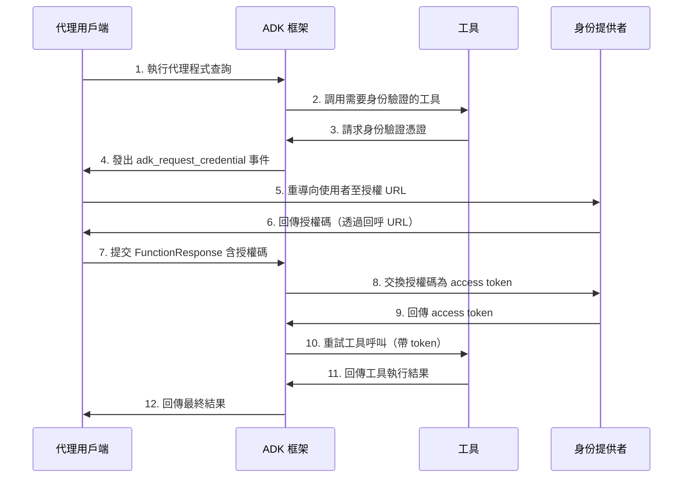
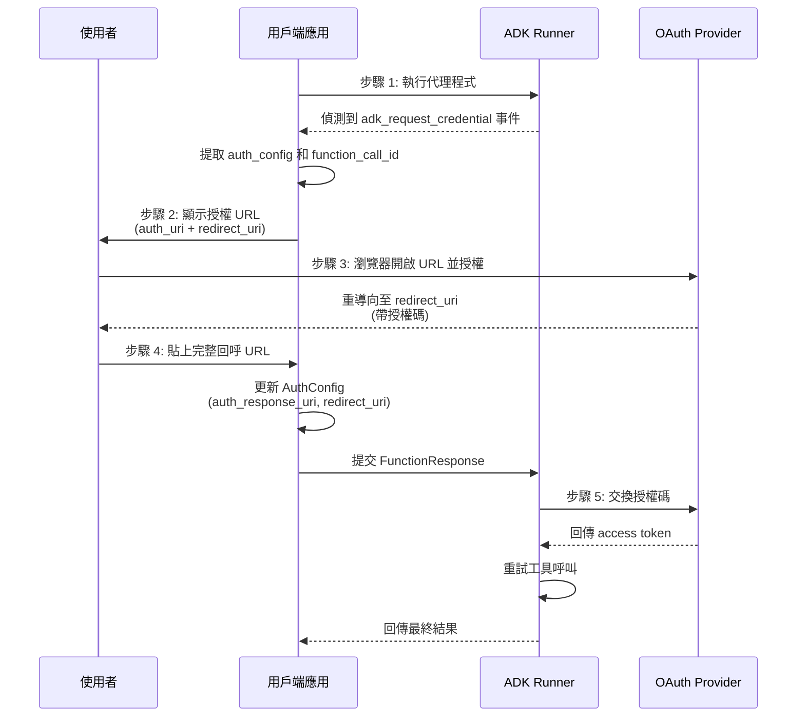
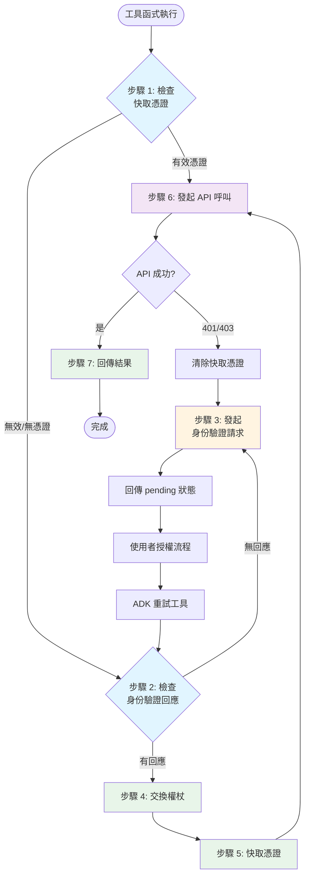

# 使用工具進行身份驗證
🔔 `更新日期：2026-01-13`

[`ADK 支援`: `Python v0.1.0`]

許多工具需要存取受保護的資源（如 Google 日曆中的使用者資料、Salesforce 記錄等）並需要進行身份驗證。ADK 提供了一套系統來安全地處理各種身份驗證方法。

## 📋 重點整理

| 項目 | 說明 |
|------|------|
| **主要目的** | 安全處理工具存取受保護資源時的身份驗證 |
| **支援協定** | API Key、HTTP Bearer、OAuth 2.0、OpenID Connect、Service Account |
| **核心組件** | `AuthScheme`（定義如何接收憑證）、`AuthCredential`（初始憑證資訊） |
| **自動化功能** | 自動交換初始憑證為可用 access token |
| **互動流程** | 支援 OAuth consent 等需要使用者互動的流程 |
| **安全建議** | 使用加密儲存敏感憑證、生產環境採用專用秘密管理服務 |

## 核心組件說明

### 1. AuthScheme
定義 API 期望如何接收身份驗證憑證（例如，作為標頭中的 API 金鑰或 OAuth 2.0 Bearer 權杖）。ADK 支援與 OpenAPI 3.0 相同的身份驗證方案類型。

**支援的類別：**
- `APIKey` - API 金鑰驗證
- `HTTPBearer` - HTTP Bearer Token
- `OAuth2` - OAuth 2.0 協定
- `OpenIdConnectWithConfig` - OpenID Connect

> 📚 詳細說明請參閱 [OpenAPI 文件：身份驗證](https://swagger.io/docs/specification/v3_0/authentication/)

### 2. AuthCredential
保存*啟動*身份驗證程序所需的*初始*資訊（例如，應用程式的 OAuth 用戶端 ID/金鑰、API 金鑰值）。

**支援的類型：**
- `API_KEY` - API 金鑰
- `OAUTH2` - OAuth 2.0
- `OPEN_ID_CONNECT` - OpenID Connect
- `SERVICE_ACCOUNT` - 服務帳戶
- `HTTP` - HTTP 驗證

### 身份驗證流程概覽



一般流程涉及在設定工具時提供這些詳細資訊。接著，ADK 會嘗試在工具發起 API 呼叫之前，自動將初始憑證交換為可用的憑證（如 access token）。對於需要使用者互動的流程（如 OAuth consent），則會觸發涉及代理用戶端（Agent Client）應用程式的特定互動程序。

## 支援的初始憑證類型

| 憑證類型 | 說明 | 是否需要交換 | 使用場景 |
|---------|------|------------|---------|
| **API_KEY** | 簡單的金鑰/值身份驗證 | ❌ 否 | 公開 API、簡單驗證需求 |
| **HTTP** | 基本驗證或 Bearer 權杖 | ❌ 否（若為 Bearer）<br>⚠️ 不支援（若為基本驗證） | 已取得的權杖場景 |
| **OAUTH2** | 標準 OAuth 2.0 流程 | ✅ 是 | 需要用戶端 ID、金鑰、範圍<br>觸發使用者同意流程 |
| **OPEN_ID_CONNECT** | OpenID Connect 身份驗證 | ✅ 是 | 類似 OAuth2<br>需要設定和使用者互動 |
| **SERVICE_ACCOUNT** | Google Cloud 服務帳戶 | ✅ 是 | JSON 金鑰或應用程式預設憑證<br>交換為 Bearer 權杖 |

| 工具類型 | 設定方式 | 參數 |
|---------|---------|------|
| **RestApiTool / OpenAPIToolset** | 初始化期間傳遞參數 | `auth_scheme`、`auth_credential` |
| **GoogleApiToolSet** | 使用工具集特定方法 | 例如：`configure_auth(client_id, client_secret)` |
| **APIHubToolset / ApplicationIntegrationToolset** | 初始化期間傳遞參數 | `auth_scheme`、`auth_credential` |

* **APIHubToolset / ApplicationIntegrationToolset**：如果在 API Hub 管理的 API 或由 Application Integration 提供的 API 需要身份驗證，請在初始化期間傳遞 `auth_scheme` 和 `auth_credential`。

> [!WARNING] 警告
    將存取權杖（尤其是重新整理權杖）等敏感憑證直接儲存在工作階段狀態（session state）中，可能會根據您的工作階段儲存後端（`SessionService`）和整體應用程式安全狀況帶來安全風險。
>
>    *   **`InMemorySessionService`**：適用於測試和開發，但當程序結束時資料會遺失。由於是暫時性的，風險較低。
>    *   **資料庫/持久化儲存**：**強烈建議在將權杖資料儲存到資料庫之前對其進行加密**。請使用強健的加密函式庫（如 `cryptography`）並安全地管理加密金鑰（例如使用金鑰管理服務）。
>    *   **安全機密金鑰存放區**：對於生產環境，將敏感憑證儲存在專用的機密金鑰管理員（如 Google Cloud Secret Manager 或 HashiCorp Vault）中是**最受推薦的方法**。您的工具可以選擇僅在工作階段狀態中儲存短效的存取權杖或安全引用（而非重新整理權杖本身），並在需要時從安全存放區獲取必要的機密金鑰。
>
---

## 旅程 1：使用具備身份驗證功能的工具建構代理程式應用程式

本節重點介紹在代理程式應用程式中使用需要身份驗證的現有工具（如來自 `RestApiTool / OpenAPIToolset`、`APIHubToolset`、`GoogleApiToolSet` 的工具）。您的主要責任是設定工具並處理互動式身份驗證流程（如果工具需要）的用戶端部分。

### 1. 設定具備身份驗證功能的工具

將需要身份驗證的工具新增到代理程式時，您需要提供其要求的 `AuthScheme` 和應用程式的初始 `AuthCredential`。

**A. 使用基於 OpenAPI 的工具集（`OpenAPIToolset`、`APIHubToolset` 等）**

在工具集初始化期間傳遞方案和憑證。工具集會將其套用於所有產生的工具。以下是在 ADK 中建立具備身份驗證功能工具的幾種方式。

<details>
<summary>API Key</summary>

```py
from google.adk.tools.openapi_tool.auth.auth_helpers import token_to_scheme_credential
from google.adk.tools.openapi_tool.openapi_spec_parser.openapi_toolset import OpenAPIToolset

# 建立需要 API 金鑰的方案和憑證
auth_scheme, auth_credential = token_to_scheme_credential(
    "apikey", "query", "apikey", "YOUR_API_KEY_STRING"
)
# 初始化 OpenAPI 工具集
sample_api_toolset = OpenAPIToolset(
    spec_str="...",  # 在此填入 OpenAPI 規格字串
    spec_str_type="yaml",
    auth_scheme=auth_scheme,
    auth_credential=auth_credential,
)
```
</details>

<details>
<summary>OAuth2</summary>

```py
from google.adk.tools.openapi_tool.openapi_spec_parser.openapi_toolset import OpenAPIToolset
from fastapi.openapi.models import OAuth2
from fastapi.openapi.models import OAuthFlowAuthorizationCode
from fastapi.openapi.models import OAuthFlows
from google.adk.auth import AuthCredential
from google.adk.auth import AuthCredentialTypes
from google.adk.auth import OAuth2Auth

# 定義 OAuth2 身份驗證方案
auth_scheme = OAuth2(
    flows=OAuthFlows(
        authorizationCode=OAuthFlowAuthorizationCode(
            authorizationUrl="https://accounts.google.com/o/oauth2/auth",
            tokenUrl="https://oauth2.googleapis.com/token",
            scopes={
                "https://www.googleapis.com/auth/calendar": "calendar scope"
            },
        )
    )
)
# 定義初始 OAuth2 憑證（用戶端 ID 和金鑰）
auth_credential = AuthCredential(
    auth_type=AuthCredentialTypes.OAUTH2,
    oauth2=OAuth2Auth(
        client_id=YOUR_OAUTH_CLIENT_ID,
        client_secret=YOUR_OAUTH_CLIENT_SECRET
    ),
)

# 使用身份驗證資訊建立 Google 日曆工具集
calendar_api_toolset = OpenAPIToolset(
    spec_str=google_calendar_openapi_spec_str, # 在此填入 openapi 規格
    spec_str_type='yaml',
    auth_scheme=auth_scheme,
    auth_credential=auth_credential,
)
```
</details>

<details>
<summary>Service Account</summary>

```py
from google.adk.tools.openapi_tool.auth.auth_helpers import service_account_dict_to_scheme_credential
from google.adk.tools.openapi_tool.openapi_spec_parser.openapi_toolset import OpenAPIToolset

# 從 JSON 載入服務帳戶憑證
service_account_cred = json.loads(service_account_json_str)
# 將服務帳戶字典轉換為 ADK 方案與憑證
auth_scheme, auth_credential = service_account_dict_to_scheme_credential(
    config=service_account_cred,
    scopes=["https://www.googleapis.com/auth/cloud-platform"],
)
# 建立工具集
sample_toolset = OpenAPIToolset(
    spec_str=sa_openapi_spec_str, # 在此填入 openapi 規格
    spec_str_type='json',
    auth_scheme=auth_scheme,
    auth_credential=auth_credential,
)
```
</details>

<details>
<summary>OpenID connect</summary>

```py
from google.adk.auth.auth_schemes import OpenIdConnectWithConfig
from google.adk.auth.auth_credential import AuthCredential, AuthCredentialTypes, OAuth2Auth
from google.adk.tools.openapi_tool.openapi_spec_parser.openapi_toolset import OpenAPIToolset

# 定義 OpenID Connect 方案
auth_scheme = OpenIdConnectWithConfig(
    authorization_endpoint=OAUTH2_AUTH_ENDPOINT_URL,
    token_endpoint=OAUTH2_TOKEN_ENDPOINT_URL,
    scopes=['openid', 'YOUR_OAUTH_SCOPES"]
)
# 定義初始 OIDC 憑證
auth_credential = AuthCredential(
    auth_type=AuthCredentialTypes.OPEN_ID_CONNECT,
    oauth2=OAuth2Auth(
        client_id="...",
        client_secret="...",
    )
)

# 建立工具集
userinfo_toolset = OpenAPIToolset(
    spec_str=content, # 填入實際規格
    spec_str_type='yaml',
    auth_scheme=auth_scheme,
    auth_credential=auth_credential,
)
```
</details>

**B. 使用 Google API 工具集 (Toolsets)（例如 `calendar_tool_set`）**

這些工具集通常具有專用的設定方法。

提示：關於如何建立 Google OAuth 用戶端 ID 和金鑰，請參閱本指南：[獲取您的 Google API 用戶端 ID](https://developers.google.com/identity/gsi/web/guides/get-google-api-clientid#get_your_google_api_client_id)

```py
# 範例：設定 Google 日曆工具
from google.adk.tools.google_api_tool import calendar_tool_set

client_id = "YOUR_GOOGLE_OAUTH_CLIENT_ID.apps.googleusercontent.com"
client_secret = "YOUR_GOOGLE_OAUTH_CLIENT_SECRET"

# 使用此工具集類型特定的配置方法
calendar_tool_set.configure_auth(
    client_id=oauth_client_id, client_secret=oauth_client_secret
)

# agent = LlmAgent(..., tools=calendar_tool_set.get_tool('calendar_tool_set'))
```

身份驗證請求流程（工具請求身份驗證憑證）的時序圖如下所示：


### 2. 處理互動式 OAuth/OIDC 流程（用戶端）

如果工具需要使用者登入/同意（通常是 OAuth 2.0 或 OIDC），ADK 框架會暫停執行並發信號給您的 **代理用戶端 (Agent Client)** 應用程式。

#### 兩種執行情境比較

| 執行方式 | 情境 1：直接執行 | 情境 2：透過 API 端點 |
|---------|----------------|-------------------|
| **執行方法** | 程序內調用 `runner.run_async` | 透過 `/run` 或 `/run_sse` 端點 |
| **應用場景** | UI 後端、CLI 應用程式、Spark 作業 | 分離式前後端架構 |
| **事件格式** | 記憶體中的物件 | HTTP 回應中的序列化 JSON |
| **伺服器部署** | 同一程序 | 可同伺服器或不同伺服器 |

> 💡 **注意**：情境 2 是情境 1 的特例，因為 `/run` 或 `/run_sse` 端點內部也會調用 `runner.run_async`。主要差異在於調用方式和事件傳遞格式。

#### 用戶端處理流程



以下章節重點介紹第一種情況，您應該能夠非常直觀地將其對應到第二種情況。如有必要，我們也會描述處理第二種情況時的一些差異。

以下是用戶端應用程式的逐步程序：

**步驟 1：執行代理程式並偵測身份驗證請求**

* 使用 `runner.run_async` 啟動代理程式互動。
* 迭代產出的事件。
* 尋找名稱特殊的特定函式呼叫事件：`adk_request_credential`。此事件發出需要使用者互動的信號。您可以使用輔助函式來識別此事件並提取必要的資訊。（對於第二種情況，邏輯類似。您從 http 回應中反序列化事件）。

```py

# runner = Runner(...)
# session = await session_service.create_session(...)
# content = types.Content(...) # 使用者的初始查詢

print("\n正在執行代理程式...")
events_async = runner.run_async(
    session_id=session.id, user_id='user', new_message=content
)

auth_request_function_call_id, auth_config = None, None

async for event in events_async:
    # 使用輔助函式檢查特定的身份驗證請求事件
    if (auth_request_function_call := get_auth_request_function_call(event)):
        print("--> 代理程式要求身份驗證。")
        # 儲存稍後回應所需的 ID
        if not (auth_request_function_call_id := auth_request_function_call.id):
            raise ValueError(f'無法從函式呼叫中取得 ID：{auth_request_function_call}')
        # 取得包含 auth_uri 等資訊的 AuthConfig
        auth_config = get_auth_config(auth_request_function_call)
        break # 暫時停止處理事件，需要使用者互動

if not auth_request_function_call_id:
    print("\n不需要身份驗證或代理程式已結束。")
    # return # 或處理接收到的最終回應

```

*輔助函式 `helpers.py`：*

```py
from google.adk.events import Event
from google.adk.auth import AuthConfig # 匯入必要類型
from google.genai import types

def get_auth_request_function_call(event: Event) -> types.FunctionCall:
    # 從事件中取得特殊的身份驗證請求函式呼叫
    if not event.content or not event.content.parts:
        return
    for part in event.content.parts:
        if (
            part
            and part.function_call
            and part.function_call.name == 'adk_request_credential'
            and event.long_running_tool_ids
            and part.function_call.id in event.long_running_tool_ids
        ):

            return part.function_call

def get_auth_config(auth_request_function_call: types.FunctionCall) -> AuthConfig:
    # 從身份驗證請求函式呼叫的參數中提取 AuthConfig 物件
    if not auth_request_function_call.args or not (auth_config := auth_request_function_call.args.get('authConfig')):
        raise ValueError(f'無法從函式呼叫中取得身份驗證配置：{auth_request_function_call}')
    if isinstance(auth_config, dict):
        auth_config = AuthConfig.model_validate(auth_config)
    elif not isinstance(auth_config, AuthConfig):
        raise ValueError(f'無法取得身份驗證配置，{auth_config} 不是 AuthConfig 的實例。')
    return auth_config
```

**步驟 2：重新導向使用者進行授權**

* 從上一步提取的 `auth_config` 中獲取授權 URL (`auth_uri`)。
* **至關重要的是，將您的應用程式的** `redirect_uri` 作為查詢參數附加到此 `auth_uri`。此 `redirect_uri` 必須預先在您的 OAuth 提供者處註冊（例如：[Google Cloud 控制台](https://developers.google.com/identity/protocols/oauth2/web-server#creatingcred)、[Okta 管理面板](https://developer.okta.com/docs/guides/sign-into-web-app-redirect/spring-boot/main/#create-an-app-integration-in-the-admin-console)）。
* 引導使用者前往此完整的 URL（例如，在他們的瀏覽器中開啟）。

```py
# （接續偵測到需要身份驗證之後）

if auth_request_function_call_id and auth_config:
    # 從 AuthConfig 中取得基礎授權 URL
    base_auth_uri = auth_config.exchanged_auth_credential.oauth2.auth_uri

    if base_auth_uri:
        redirect_uri = 'http://localhost:8000/callback' # 必須與您的 OAuth 用戶端應用程式設定相符
        # 附加 redirect_uri（在生產環境中請使用 urlencode）
        auth_request_uri = base_auth_uri + f'&redirect_uri={redirect_uri}'
        # 現在您需要將終端使用者重新導向到此 auth_request_uri，或要求他們在瀏覽器中開啟它
        # 此 auth_request_uri 應由對應的身份驗證提供者提供服務，終端使用者應登入並授權您的應用程式存取其資料
        # 接著，身份驗證提供者會將終端使用者重新導向到您提供的 redirect_uri
        # 下一步：從使用者（或您的網頁伺服器處理常式）取得此回呼 URL
    else:
         print("錯誤：在 auth_config 中找不到身份驗證 URI。")
         # 處理錯誤

```

**步驟 3. 處理重新導向回呼（用戶端）：**

* 您的應用程式必須有一種機制（例如 `redirect_uri` 處的網頁伺服器路由），以便在使用者向提供者授權應用程式後接收使用者。
* 提供者會將使用者重新導向到您的 `redirect_uri`，並將 `authorization_code`（以及可能的 `state`、`scope`）作為查詢參數附加到 URL。
* 從此傳入請求中擷取**完整的回呼 URL**。
* （此步驟發生在主代理程式執行迴圈之外，位於您的網頁伺服器或等效的回呼處理常式中。）

**步驟 4. 將身份驗證結果傳回 ADK（用戶端）：**

* 一旦您有了完整的回呼 URL（包含授權碼），請檢索在用戶端步驟 1 中儲存的 `auth_request_function_call_id` 和 `auth_config` 物件。
* 將擷取到的回呼 URL 設定到 `exchanged_auth_credential.oauth2.auth_response_uri` 欄位中。同時確保 `exchanged_auth_credential.oauth2.redirect_uri` 包含您使用的重新導向 URI。
* 建立一個包含 `types.Part` 和 `types.FunctionResponse` 的 `types.Content` 物件。
      * 將 `name` 設定為 `"adk_request_credential"`。（注意：這是 ADK 繼續身份驗證的特殊名稱。請勿使用其他名稱。）
      * 將 `id` 設定為您儲存的 `auth_request_function_call_id`。
      * 將 `response` 設定為*序列化後*（例如 `.model_dump()`）的更新版 `AuthConfig` 物件。
* 對同一個工作階段**再次**調用 `runner.run_async`，並將此 `FunctionResponse` 內容作為 `new_message` 傳遞。

```py
# （接續使用者互動之後）

    # 模擬獲取回呼 URL（例如從使用者貼上或網頁處理常式獲取）
    auth_response_uri = await get_user_input(
        f'請在此貼上完整的回呼 URL：\n> '
    )
    auth_response_uri = auth_response_uri.strip() # 清理輸入

    if not auth_response_uri:
        print("未提供回呼 URL。正在中止。")
        return

    # 使用回呼詳細資訊更新接收到的 AuthConfig
    auth_config.exchanged_auth_credential.oauth2.auth_response_uri = auth_response_uri
    # 同時包含所使用的 redirect_uri，因為權杖交換可能需要它
    auth_config.exchanged_auth_credential.oauth2.redirect_uri = redirect_uri

    # 建構 FunctionResponse Content 物件
    auth_content = types.Content(
        role='user', # 傳送 FunctionResponse 時角色可以是 'user'
        parts=[
            types.Part(
                function_response=types.FunctionResponse(
                    id=auth_request_function_call_id,       # 連結到原始請求
                    name='adk_request_credential', # 框架特殊的函式名稱
                    response=auth_config.model_dump() # 傳回 *更新後* 的 AuthConfig
                )
            )
        ],
    )

    # --- 恢復執行 ---
    print("\n正在將身份驗證詳細資訊提交回代理程式...")
    events_async_after_auth = runner.run_async(
        session_id=session.id,
        user_id='user',
        new_message=auth_content, # 將 FunctionResponse 傳回
    )
```
工具函式身份驗證流程


#### 實作步驟總覽

| 步驟 | 動作 | 說明 |
|-----|------|------|
| **步驟 1** | 檢查快取憑證 | 從 `tool_context.state` 檢查是否有有效的快取憑證 |
| **步驟 2** | 檢查身份驗證回應 | 調用 `tool_context.get_auth_response()` 檢查用戶端回應 |
| **步驟 3** | 發起身份驗證請求 | 調用 `tool_context.request_credential()` 啟動 OAuth 流程 |
| **步驟 4** | 交換權杖 | ADK 自動將授權碼交換為 access token |
| **步驟 5** | 快取憑證 | 將獲得的憑證儲存至 `tool_context.state` |
| **步驟 6** | 發起 API 呼叫 | 使用有效憑證調用受保護的 API |
| **步驟 7** | 回傳結果 | 處理並回傳 API 結果給 LLM |

### # --- 處理最終代理程式輸出 ---
    print("\n--- 身份驗證後的代理程式回應 ---")
    async for event in events_async_after_auth:
        # 正常處理事件，預期此時工具呼叫將成功
        print(event) # 列印完整事件以供檢查

> [!NOTE] 注意：使用恢復（Resume）功能進行授權回應
    如果您的 ADK 代理程式工作流設定了 [恢復 (Resume)](../agent-runtime/resume.md) 功能，您還必須在身份驗證回應中包含調用 ID (`invocation_id`) 參數。您提供的調用 ID 必須與產生身份驗證請求的調用相同，否則系統會以該身份驗證回應啟動一個新的調用。如果您的代理程式使用恢復功能，請考慮在身份驗證請求中包含調用 ID 作為參數，以便將其包含在身份驗證回應中。有關使用恢復功能的更多詳細資訊，請參閱 [恢復停止的代理程式](../agent-runtime/resume.md)。

**步驟 5：ADK 處理權杖交換和工具重試並獲取工具結果**

* ADK 接收到 `adk_request_credential` 的 `FunctionResponse`。
* 它使用更新後的 `AuthConfig`（包含帶有代碼的回呼 URL）中的資訊，與提供者的權杖端點執行 OAuth **權杖交換**，從而獲取存取權杖（以及可能的重新整理權杖）。
* ADK 內部會透過將這些權杖設定在工作階段狀態中，使權杖變為可用。
* ADK **自動重試**原始工具呼叫（最初因缺少身份驗證而失敗的那個呼叫）。
* 這一次，工具會找到有效的權杖（透過 `tool_context.get_auth_response()`）並成功執行具備身份驗證功能的 API 呼叫。
* 代理程式接收到來自工具的實際結果，並為使用者產生最終回應。

---

身份驗證回應流程（代理用戶端傳回身份驗證回應且 ADK 重試工具呼叫）的時序圖如下所示：


## 旅程 2：建構需要身份驗證的自定義工具 (`FunctionTool`)

本節重點介紹在建立新的 ADK 工具時，如何在自定義 Python 函式*內部*實作身份驗證邏輯。我們將以 `FunctionTool` 為例。

### 先決條件

您的函式簽章*必須*包含 [`tool_context: ToolContext`](./index.md#工具上下文-tool-context)。ADK 會自動插入此物件，提供對狀態和身份驗證機制的存取。

```py
from google.adk.tools import FunctionTool, ToolContext
from typing import Dict

def my_authenticated_tool_function(param1: str, ..., tool_context: ToolContext) -> dict:
    # ... 您的邏輯 ...
    pass

my_tool = FunctionTool(func=my_authenticated_tool_function)

```

### 工具函式內的身份驗證邏輯

在您的函式中實作以下步驟：

**步驟 1：檢查快取且有效的憑證：**

在您的工具函式中，首先檢查此工作階段先前執行時是否已儲存有效的憑證（例如存取/重新整理權杖）。當前工作階段的憑證應儲存在 `tool_context.invocation_context.session.state`（一個狀態字典）中。透過檢查 `tool_context.invocation_context.session.state.get(credential_name, None)` 來確認現有憑證是否存在。

```py
from google.oauth2.credentials import Credentials
from google.auth.transport.requests import Request

# 在您的工具函式內部
TOKEN_CACHE_KEY = "my_tool_tokens" # 選擇一個唯一的金鑰
SCOPES = ["scope1", "scope2"] # 定義需要的範圍

creds = None
cached_token_info = tool_context.state.get(TOKEN_CACHE_KEY)
if cached_token_info:
    try:
        # 從快取的資訊載入憑證
        creds = Credentials.from_authorized_user_info(cached_token_info, SCOPES)
        # 如果憑證無效且已過期但有重新整理權杖，則進行重新整理
        if not creds.valid and creds.expired and creds.refresh_token:
            creds.refresh(Request())
            tool_context.state[TOKEN_CACHE_KEY] = json.loads(creds.to_json()) # 更新快取
        elif not creds.valid:
            creds = None # 無效，需要重新驗證
            tool_context.state[TOKEN_CACHE_KEY] = None
    except Exception as e:
        print(f"載入/重新整理快取憑證時發生錯誤：{e}")
        creds = None
        tool_context.state[TOKEN_CACHE_KEY] = None

if creds and creds.valid:
    # 跳至步驟 5：發起具備身份驗證功能的 API 呼叫
    pass
else:
    # 繼續步驟 2...
    pass

```

**步驟 2：檢查來自用戶端的身份驗證回應**

* 如果步驟 1 沒有產出有效的憑證，請檢查用戶端是否剛透過調用 `exchanged_credential = tool_context.get_auth_response()` 完成了互動流程。
* 這會傳回由用戶端傳回的更新後 `exchanged_credential` 物件（在 `auth_response_uri` 中包含回呼 URL）。

```py
# 使用在工具中設定的 auth_scheme 和 auth_credential。
# exchanged_credential: AuthCredential | None

exchanged_credential = tool_context.get_auth_response(AuthConfig(
  auth_scheme=auth_scheme,
  raw_auth_credential=auth_credential,
))
# 如果 exchanged_credential 不為 None，則表示身份驗證回應中已有交換後的憑證。
if exchanged_credential:
   # ADK 已經為我們交換了存取權杖
        access_token = exchanged_credential.oauth2.access_token
        refresh_token = exchanged_credential.oauth2.refresh_token
        creds = Credentials(
            token=access_token,
            refresh_token=refresh_token,
            token_uri=auth_scheme.flows.authorizationCode.tokenUrl,
            client_id=auth_credential.oauth2.client_id,
            client_secret=auth_credential.oauth2.client_secret,
            scopes=list(auth_scheme.flows.authorizationCode.scopes.keys()),
        )
    # 將權杖快取在工作階段狀態中並呼叫 API，跳至步驟 5
```

**步驟 3：發起身份驗證請求**

如果找不到有效的憑證（步驟 1）且沒有身份驗證回應（步驟 2），則工具需要啟動 OAuth 流程。定義 `AuthScheme` 和初始 `AuthCredential` 並調用 `tool_context.request_credential()`。傳回一個指示需要授權的回應。

```py
# 使用在工具中設定的 auth_scheme 和 auth_credential。

  tool_context.request_credential(AuthConfig(
    auth_scheme=auth_scheme,
    raw_auth_credential=auth_credential,
  ))
  return {'pending': true, 'message': '等待使用者身份驗證。'}

# 透過設定 request_credential，ADK 會偵測到待處理的身份驗證事件。它會暫停執行並要求終端使用者登入。
```

**步驟 4：將授權碼交換為權杖**

ADK 會自動產生 OAuth 授權 URL 並將其呈現給您的代理用戶端應用程式。您的代理用戶端應用程式應遵循旅程 1 中所述的相同方式，將使用者重新導向至授權 URL（附加 `redirect_uri`）。一旦使用者跟隨授權 URL 完成登入流程，且 ADK 從代理用戶端應用程式中提取身份驗證回呼 URL，它就會自動解析授權碼並產生身份驗證權杖。在下一次工具呼叫時，步驟 2 中的 `tool_context.get_auth_response` 將包含一個有效的憑證，供後續 API 呼叫使用。

**步驟 5：快取獲得的憑證**

在成功從 ADK 獲得權杖（步驟 2）或如果權杖仍然有效（步驟 1）後，**請立即**使用您的快取金鑰將新的 `Credentials` 物件儲存在 `tool_context.state` 中（序列化，例如 JSON）。

```py
# 在您的工具函式內部，獲得 'creds'（無論是重新整理的還是新交換的）之後
# 快取新/重新整理的權杖
tool_context.state[TOKEN_CACHE_KEY] = json.loads(creds.to_json())
print(f"DEBUG: 已將權杖快取/更新至金鑰：{TOKEN_CACHE_KEY}")
# 繼續步驟 6（發起 API 呼叫）

```

**步驟 6：發起具備身份驗證功能的 API 呼叫**

* 一旦您有了有效的 `Credentials` 物件（來自步驟 1 或步驟 4 的 `creds`），請使用適當的用戶端函式庫（例如 `googleapiclient`、`requests`）發起對受保護 API 的實際呼叫。傳遞 `credentials=creds` 參數。
* 包含錯誤處理，特別是對於 `HttpError` 401/403，這可能意味著權杖在呼叫之間過期或被撤銷。如果您收到此類錯誤，請考慮清除快取的權杖（`tool_context.state.pop(...)`）並可能再次傳回 `auth_required` 狀態以強制重新驗證。

```py
# 在您的工具函式內部，使用有效的 'creds' 物件
# 在繼續之前確保 creds 有效
if not creds or not creds.valid:
   return {"status": "error", "error_message": "沒有有效的憑證，無法繼續。"}

try:
   service = build("calendar", "v3", credentials=creds) # 範例
   api_result = service.events().list(...).execute()
   # 繼續步驟 7
except Exception as e:
   # 處理 API 錯誤（例如檢查 401/403，可能清除快取並重新請求身份驗證）
   print(f"錯誤：API 呼叫失敗：{e}")
   return {"status": "error", "error_message": f"API 呼叫失敗：{e}"}
```

**步驟 7：傳回工具結果**

* 在成功的 API 呼叫之後，將結果處理成對 LLM 有用的字典格式。
* **至關重要的是，包含數據。**

```py
# 在您的工具函式內部，API 呼叫成功後
    processed_result = [...] # 為 LLM 處理 api_result
    return {"status": "success", "data": processed_result}

```

> [!TIP] 程式碼範例：

<details>
<summary>Tools and Agent</summary>

```py title="tools_and_agent.py"
import os

from google.adk.auth.auth_schemes import OpenIdConnectWithConfig
from google.adk.auth.auth_credential import AuthCredential, AuthCredentialTypes, OAuth2Auth
from google.adk.tools.openapi_tool.openapi_spec_parser.openapi_toolset import OpenAPIToolset
from google.adk.agents.llm_agent import LlmAgent

# --- 身份驗證配置 (Authentication Configuration) ---
# 此部分配置代理人如何使用 OpenID Connect (OIDC) 處理身份驗證，
# 這通常是建立在 OAuth 2.0 之上的圖層。

# 使用 OpenID Connect 定義身份驗證方案。
# 此物件告知 ADK *如何* 執行 OIDC/OAuth2 流程。
# 它需要特定於您的身份提供者 (IDP) 的詳細資訊，例如 Google OAuth、Okta、Auth0 等。
# 注意：請將範例中的 Okta URL 和憑證替換為您實際的 IDP 詳細資訊。
# 以下所有欄位皆為必填，可從您的 IDP 取得。
auth_scheme = OpenIdConnectWithConfig(
    # IDP 的授權端點 URL，使用者將被重導向至此處進行登入。
    authorization_endpoint="https://your-endpoint.okta.com/oauth2/v1/authorize",
    # IDP 的權杖端點 URL，在此處將授權碼交換為權杖 (Token)。
    token_endpoint="https://your-token-endpoint.okta.com/oauth2/v1/token",
    # 您的應用程式向 IDP 請求的範圍 (權限)。
    # 'openid' 是 OIDC 的標準範圍。'profile' 和 'email' 用於請求使用者設定檔資訊。
    scopes=['openid', 'profile', "email"]
)

# 為您的特定應用程式定義身份驗證憑證。
# 此物件持有您的應用程式在 OAuth2 流程中用於向 IDP 識別自身身份的客戶端識別碼 (Client ID) 和金鑰 (Secret)。
# !! 安全警告：避免在生產環境程式碼中硬編碼金鑰。 !!
# !! 請改用環境變數或秘密管理系統 (Secret Management System)。 !!
auth_credential = AuthCredential(
  auth_type=AuthCredentialTypes.OPEN_ID_CONNECT,
  oauth2=OAuth2Auth(
    client_id="CLIENT_ID",
    client_secret="CIENT_SECRET",
  )
)


# --- 從 OpenAPI 規格配置工具集 (Toolset Configuration) ---
# 此部分定義了代理人可以使用的範例工具集，並使用了上述步驟中設定的身份驗證。
# 此範例工具集使用的端點受 Okta 保護，需要透過 OpenID Connect 流程來獲取終端使用者憑證。
with open(os.path.join(os.path.dirname(__file__), 'spec.yaml'), 'r', encoding='utf-8') as f:
    spec_content = f.read()

userinfo_toolset = OpenAPIToolset(
   spec_str=spec_content,
   spec_str_type='yaml',
   # ** 至關重要：將身份驗證方案和憑證與這些工具關聯起來。 **
   # 這會告知 ADK 這些工具需要定義好的 OIDC/OAuth2 流程。
   auth_scheme=auth_scheme,
   auth_credential=auth_credential,
)

# --- 代理人配置 (Agent Configuration) ---
# 配置並建立主要的 LLM 代理人。
root_agent = LlmAgent(
    model='gemini-2.0-flash',
    name='enterprise_assistant',
    instruction='協助使用者整合多個企業系統，包括檢索可能需要身份驗證的使用者資訊。',
    tools=userinfo_toolset.get_tools(),
)

# --- 準備就緒 ---
# 現在 `root_agent` 已配置了受 OIDC/OAuth2 身份驗證保護的工具。
# 當代理人嘗試使用其中一個工具時，如果階段 (Session) 中尚無有效的憑證，
# ADK 框架將自動觸發由 `auth_scheme` 和 `auth_credential` 定義的身份驗證流程。
# 隨後的互動流程將引導使用者完成登入過程並處理權杖交換，
# 並自動將交換後的權杖附加到工具定義的端點請求中。
```
</details>

<details>
<summary>Agent CLI</summary>

```py title="agent_cli.py"
import asyncio
from dotenv import load_dotenv
from google.adk.artifacts.in_memory_artifact_service import InMemoryArtifactService
from google.adk.runners import Runner
from google.adk.sessions import InMemorySessionService
from google.genai import types

from .helpers import is_pending_auth_event, get_function_call_id, get_function_call_auth_config, get_user_input
from .tools_and_agent import root_agent

load_dotenv()

agent = root_agent

async def async_main():
    """
    編排代理人互動與身份驗證流程的主要非同步函式。
    """
    # --- 步驟 1: 服務初始化 ---
    # 使用記憶體內 (in-memory) 服務進行會話 (Session) 和成品 (Artifact) 存儲（適用於展示/測試）。
    session_service = InMemorySessionService()
    artifacts_service = InMemoryArtifactService()

    # 建立一個新的使用者會話以維護對話狀態。
    session = session_service.create_session(
        state={},  # 會話特定資料的可選狀態字典
        app_name='my_app', # 應用程式識別碼
        user_id='user' # 使用者識別碼
    )

    # --- 步驟 2: 初始使用者查詢 ---
    # 定義使用者的初始請求。
    query = '顯示我的使用者資訊'
    print(f"使用者: {query}")

    # 將查詢格式化為 ADK 執行器 (Runner) 預期的內容 (Content) 結構。
    content = types.Content(role='user', parts=[types.Part(text=query)])

    # 初始化 ADK 執行器
    runner = Runner(
        app_name='my_app',
        agent=agent,
        artifact_service=artifacts_service,
        session_service=session_service,
    )

    # --- 步驟 3: 發送查詢並處理潛在的驗證請求 ---
    print("\n正在執行帶有初始查詢的代理人...")
    events_async = runner.run_async(
        session_id=session.id, user_id='user', new_message=content
    )

    # 用於在發生身份驗證請求時存儲詳細資訊的變數。
    auth_request_event_id, auth_config = None, None

    # 迭代第一次執行產生的事件。
    async for event in events_async:
        # 檢查此事件是否為特定的 'adk_request_credential' 函式呼叫。
        if is_pending_auth_event(event):
            print("--> 代理人要求身份驗證。")
            auth_request_event_id = get_function_call_id(event)
            auth_config = get_function_call_auth_config(event)
            # 一旦找到並處理了驗證請求，就退出此迴圈。
            # 我們需要在此處暫停執行，以獲取使用者輸入進行身份驗證。
            break


    # 如果在處理完所有事件後未檢測到身份驗證請求，則退出。
    if not auth_request_event_id or not auth_config:
        print("\n此查詢不需要身份驗證，或處理已完成。")
        return # 退出主函式

    # --- 步驟 4: 手動身份驗證步驟 (模擬 OAuth 2.0 流程) ---
    # 此部分模擬 OAuth 2.0 流程中的使用者互動部分。
    # 在實際的 Web 應用程式中，這將涉及瀏覽器重導向。

    # 定義重導向 URI (Redirect URI)。這 *必須* 與您的應用程式在 OAuth 提供者處註冊的 URI 之一相匹配。
    # 提供者在使用者核准請求後會將使用者送回此處。
    redirect_uri = 'http://localhost:8000/dev-ui' # 本地開發範例

    # 構建使用者必須造訪的授權 URL。
    # 這通常包括提供者的授權端點 URL、客戶端 ID、請求的範圍、回應類型（例如 'code'）以及重導向 URI。
    # 此處我們從 ADK 提供的 AuthConfig 中檢索基本授權 URI 並附加 redirect_uri。
    # 注意：強健的實作應使用 urlencode 並可能添加 state、scope 等。
    auth_request_uri = (
        auth_config.exchanged_auth_credential.oauth2.auth_uri
        + f'&redirect_uri={redirect_uri}' # 簡單串接；請確保查詢參數格式正確
    )

    print("\n--- 需要使用者操作 ---")
    # 提示使用者造訪授權 URL、登入、授予權限，
    # 然後貼上他們被重導向回來的 *完整* URL（其中包含授權碼）。
    auth_response_uri = await get_user_input(
        f'1. 請在瀏覽器中開啟此 URL 以進行登入：\n   {auth_request_uri}\n\n'
        f'2. 成功登入並授權後，您的瀏覽器將被重導向。\n'
        f'   請從瀏覽器的網址列複製 *整個* URL。\n\n'
        f'3. 在此處貼上複製的 URL 並按 Enter 鍵：\n\n> '
    )

    # --- 步驟 5: 為代理人準備身份驗證回應 ---
    # 使用從使用者處收集的資訊更新 AuthConfig 物件。
    # ADK 框架需要完整的回應 URI（包含驗證碼）和原始重導向 URI，
    # 以在內部完成 OAuth 權杖交換過程。
    auth_config.exchanged_auth_credential.oauth2.auth_response_uri = auth_response_uri
    auth_config.exchanged_auth_credential.oauth2.redirect_uri = redirect_uri

    # 構建一個 FunctionResponse 內容物件以發送回代理人/執行器。
    # 此回應明確針對稍早透過 ID 識別的 'adk_request_credential' 函式呼叫。
    auth_content = types.Content(
        role='user',
        parts=[
            types.Part(
                function_response=types.FunctionResponse(
                    # 至關重要：使用儲存的 ID 將此回應連結到原始請求。
                    id=auth_request_event_id,
                    # 我們正在回應的函式呼叫的特殊名稱。
                    name='adk_request_credential',
                    # 包含所有必要身份驗證詳細資訊的負載 (Payload)。
                    response=auth_config.model_dump(),
                )
            )
        ],
    )

    # --- 步驟 6: 使用身份驗證恢復執行 ---
    print("\n正在將身份驗證詳細資訊提交回代理人...")
    # 再次執行代理人，這次提供 `auth_content` (FunctionResponse)。
    # ADK 執行器會攔截此內容，處理 'adk_request_credential' 回應
    # （執行權杖交換、存儲憑證），然後允許代理人重試原本需要身份驗證的工具呼叫，
    # 此時呼叫將帶著嵌入的有效存取權杖成功執行。
    events_async = runner.run_async(
        session_id=session.id,
        user_id='user',
        new_message=auth_content, # 提供準備好的驗證回應
    )

    # 處理並列印身份驗證完成後代理人的最終事件。
    # 此串流現在應包含來自工具的實際結果（例如：使用者資訊）。
    print("\n--- 身份驗證後的代理人回應 ---")
    async for event in events_async:
        print(event)


if __name__ == '__main__':
  asyncio.run(async_main())
```
</details>

<details>
<summary>Helper</summary>

```py title="helpers.py"
from google.adk.auth import AuthConfig
from google.adk.events import Event
import asyncio

# --- 輔助函式 (Helper Functions) ---
async def get_user_input(prompt: str) -> str:
    """
    在主控台中非同步提示使用者輸入。

    使用 asyncio 的事件迴圈和 run_in_executor 來避免在等待同步的 `input()` 時
    阻塞主非同步執行執行緒。

    參數：
        prompt: 要顯示給使用者的訊息。

    傳回：
        使用者輸入的字串。
    """
    loop = asyncio.get_event_loop()
    # 在執行緒池 (executor) 管理的獨立執行緒中執行阻塞的 `input()` 函式。
    return await loop.run_in_executor(None, input, prompt)


def is_pending_auth_event(event: Event) -> bool:
    """
    檢查 ADK 事件是否代表請求使用者身份驗證憑證。

    當工具需要尚未滿足的身份驗證時，ADK 框架會發出一個特定的函式呼叫 ('adk_request_credential')。

    參數：
        event: 要檢查的 ADK Event 物件。

    傳回：
        如果事件是 'adk_request_credential' 函式呼叫則為 True，否則為 False。
    """
    # 安全地檢查巢狀屬性，以避免在事件結構不完整時出錯。
    return (
        event.content
        and event.content.parts
        and event.content.parts[0] # 假設函式呼叫位於第一個部分
        and event.content.parts[0].function_call
        # 表示來自 ADK 框架驗證請求的特定函式名稱。
        and event.content.parts[0].function_call.name == 'adk_request_credential'
    )


def get_function_call_id(event: Event) -> str:
    """
    從 ADK 事件中提取函式呼叫的唯一 ID。

    此 ID 對於將函式 *回應* (Response) 關聯回代理人發起以請求驗證憑證的特定函式 *呼叫* (Call) 至關重要。

    參數：
        event: 包含函式呼叫的 ADK Event 物件。

    傳回：
        函式呼叫的唯一識別碼字串。

    引發：
        ValueError: 如果在事件結構中找不到函式呼叫 ID。
    """
    # 導覽事件結構以尋找函式呼叫 ID。
    if (
        event
        and event.content
        and event.content.parts
        and event.content.parts[0]
        and event.content.parts[0].function_call
        and event.content.parts[0].function_call.id
    ):
        return event.content.parts[0].function_call.id
    # 如果缺少 ID，則引發錯誤，表示事件格式不符合預期。
    raise ValueError(f'無法從事件中獲取函式呼叫 ID：{event}')


def get_function_call_auth_config(event: Event) -> AuthConfig:
    """
    從 'adk_request_credential' 事件中提取身份驗證配置詳細資訊。

    用戶端應使用此 AuthConfig 來填寫必要的身份驗證詳細資訊（如 OAuth 代碼和狀態），
    並將其發送回 ADK 以繼續 OAuth 權杖交換。

    參數：
        event: 包含 'adk_request_credential' 呼叫的 ADK Event 物件。

    傳回：
        一個填充了函式呼叫參數詳細資訊的 AuthConfig 物件。

    引發：
        ValueError: 如果在事件中找不到 'auth_config' 參數。
    """
    if (
        event
        and event.content
        and event.content.parts
        and event.content.parts[0]
        and event.content.parts[0].function_call
        and event.content.parts[0].function_call.args
        and event.content.parts[0].function_call.args.get('auth_config')
    ):
        # 使用參數中提供的字典重建 AuthConfig 物件。
        # ** 運算子將字典解包為建構函式的關鍵字參數。
        return AuthConfig(
            **event.content.parts[0].function_call.args.get('auth_config')
        )
    raise ValueError(f'無法從事件中獲取驗證配置 (auth config)：{event}')
```
</details>

<details>
<summary>Spec</summary>

```yaml
openapi: 3.0.1
info:
  title: Okta 使用者資訊 API
  version: 1.0.0
  description: |-
    根據有效的 Okta OIDC 存取權杖檢索使用者個人資料資訊的 API。
    身份驗證透過與 Okta 的 OpenID Connect 處理。
  contact:
    name: API 支援
    email: support@example.com
servers:
  - url: <替換為您的伺服器名稱>
    description: 生產環境
paths:
  /okta-jwt-user-api:
    get:
      summary: 取得已驗證的使用者資訊
      description: |-
        獲取使用者的個人資料詳細資訊
      operationId: getUserInfo
      tags:
        - 使用者個人資料
      security:
        - okta_oidc:
            - openid
            - email
            - profile
      responses:
        '200':
          description: 成功擷取使用者資訊。
          content:
            application/json:
              schema:
                type: object
                properties:
                  sub:
                    type: string
                    description: 使用者的主體識別碼 (Subject ID)。
                    example: "abcdefg"
                  name:
                    type: string
                    description: 使用者的全名。
                    example: "Example LastName"
                  locale:
                    type: string
                    description: 使用者的語言區域，例如 en-US 或 en_US。
                    example: "en_US"
                  email:
                    type: string
                    format: email
                    description: 使用者的主要電子郵件地址。
                    example: "username@example.com"
                  preferred_username:
                    type: string
                    description: 使用者的偏好使用者名稱（通常是電子郵件）。
                    example: "username@example.com"
                  given_name:
                    type: string
                    description: 使用者的名字。
                    example: "Example"
                  family_name:
                    type: string
                    description: 使用者的姓氏。
                    example: "LastName"
                  zoneinfo:
                    type: string
                    description: 使用者的時區，例如 America/Los_Angeles。
                    example: "America/Los_Angeles"
                  updated_at:
                    type: integer
                    format: int64
                    description: 使用者個人資料最後更新的時間戳記（Unix 紀元時間）。
                    example: 1743617719
                  email_verified:
                    type: boolean
                    description: 指示使用者的電子郵件地址是否已驗證。
                    example: true
                required:
                  - sub
                  - name
                  - locale
                  - email
                  - preferred_username
                  - given_name
                  - family_name
                  - zoneinfo
                  - updated_at
                  - email_verified
        '401':
          description: 未授權。提供的 Bearer 權杖缺失、無效或已過期。
          content:
            application/json:
              schema:
                $ref: '#/components/schemas/Error'
        '403':
          description: 禁止存取。提供的權杖不具備存取此資源所需的範圍或權限。
          content:
            application/json:
              schema:
                $ref: '#/components/schemas/Error'
components:
  securitySchemes:
    okta_oidc:
      type: openIdConnect
      description: 透過 Okta 使用 OpenID Connect 進行身份驗證。需要 Bearer 存取權杖。
      openIdConnectUrl: https://your-endpoint.okta.com/.well-known/openid-configuration
  schemas:
    Error:
      type: object
      properties:
        code:
          type: string
          description: 錯誤代碼。
        message:
          type: string
          description: 人類可讀的錯誤訊息。
      required:
        - code
        - message
```
</details>

---
### 工具函式身份驗證流程


#### 實作步驟總覽

| 步驟 | 動作 | 說明 |
|-----|------|------|
| **步驟 1** | 檢查快取憑證 | 從 `tool_context.state` 檢查是否有有效的快取憑證 |
| **步驟 2** | 檢查身份驗證回應 | 調用 `tool_context.get_auth_response()` 檢查用戶端回應 |
| **步驟 3** | 發起身份驗證請求 | 調用 `tool_context.request_credential()` 啟動 OAuth 流程 |
| **步驟 4** | 交換權杖 | ADK 自動將授權碼交換為 access token |
| **步驟 5** | 快取憑證 | 將獲得的憑證儲存至 `tool_context.state` |
| **步驟 6** | 發起 API 呼叫 | 使用有效憑證調用受保護的 API |
| **步驟 7** | 回傳結果 | 處理並回傳 API 結果給 LLM |