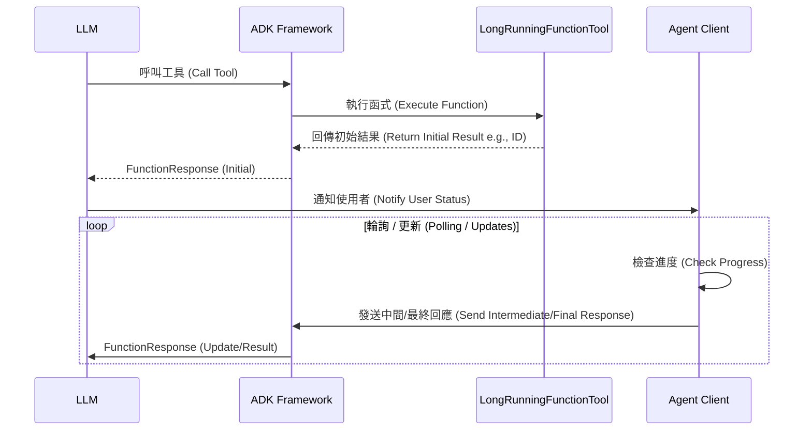
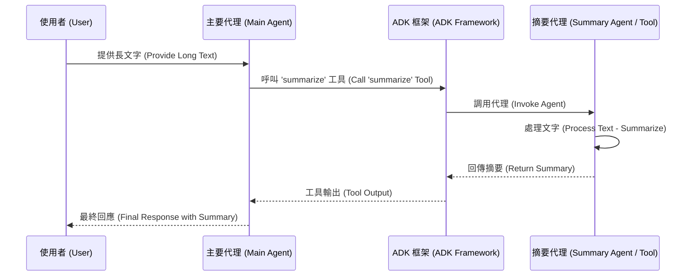

# 功能工具

> 🔔 `更新日期：2026-01-23`
>
> 🔗 `資料來源`：https://google.github.io/adk-docs/tools-custom/function-tools/

[`ADK 支援`: `Python v0.1.0` | `Typescript v0.2.0` | `Go v0.1.0` | `Java v0.1.0`]

當預建的 ADK 工具無法滿足您的需求時，您可以建立自訂的 *功能工具 (function tools)*。建立功能工具讓您能夠建立量身打造的功能，例如連接到專有資料庫或實作獨特的演算法。
例如，一個名為 `myfinancetool` 的功能工具，可能是一個計算特定財務指標的函式。ADK 也支援長時間執行函式，因此如果該計算需要一段時間，代理 (Agent) 可以繼續處理其他任務。

ADK 提供幾種建立功能工具的方式，每種都適合不同的複雜度和控制層級：

*  [功能工具](#功能工具-function-tool)
*  [長時間執行功能工具](#長時間執行功能工具-long-running-function-tools)
*  [代理即工具](#代理即工具-agent-as-a-tool)

## 功能工具 (Function Tool)

將 Python 函式轉換為工具是將自訂邏輯整合到代理中的直接方式。當您將函式指派給代理的 `tools` 清單時，框架會`自動`將其包裝為 `FunctionTool`。

### 運作方式

ADK 框架會自動檢查您的 Python 函式的簽章——包含其名稱`docstring`參數、型別提示和預設值——以產生結構描述 (schema)。LLM 使用此結構描述來了解工具的用途、何時使用它以及它需要什麼引數。

### 定義函式簽章

定義良好的函式簽章對於讓 LLM 正確使用您的工具至關重要。

#### 參數

##### 必要參數 (Required Parameters)

<details>
<summary>必要參數說明</summary>

> Python

參數如果具有型別提示但**沒有預設值**，則被視為**必要**。LLM 在呼叫工具時必須為此引數提供值。參數的描述取自函式的 docstring。

範例：必要參數
```python
# 取得指定城市和單位的天氣資訊
def get_weather(city: str, unit: str):
    """
    取得指定單位中某個城市的天氣。

    Args:
        city (str): 城市名稱。
        unit (str): 溫度單位，'Celsius' (攝氏) 或 'Fahrenheit' (華氏)。
    """
    # ADK 會自動使用此 docstring 來產生工具的描述 (schema) 給 LLM
    # ... 函式邏輯 ...
    # 回傳包含天氣報告的字典
    # 建議回傳字典格式，以便 LLM 更好地理解結構化數據
    return {"status": "success", "report": f"{city} 的天氣是晴天。"}
```
在此範例中，`city` 和 `unit` 都是強制的。如果 LLM 試圖在沒有其中之一的情況下呼叫 `get_weather`，ADK 會回傳錯誤給 LLM，提示它更正呼叫。

> Go

在 Go 中，您使用 struct 標籤來控制 JSON 結構描述。兩個主要的標籤是 `json` 和 `jsonschema`。

如果 struct 欄位在 `json` 標籤中**沒有** `omitempty` 或 `omitzero` 選項，則該參數被視為**必要**。

`jsonschema` 標籤用於提供引數的描述。這對於 LLM 了解引數的用途至關重要。

範例：必要參數
```go
// GetWeatherParams 定義 getWeather 工具的引數。
type GetWeatherParams struct {
    // 此欄位為必要 (沒有 "omitempty")。
    // jsonschema 標籤提供參數描述，這對於 LLM 理解如何使用此參數至關重要。
    Location string `json:"location" jsonschema:"城市和州，例如 San Francisco, CA"`

    // 此欄位也是必要。
    Unit     string `json:"unit" jsonschema:"溫度單位，'celsius' (攝氏) 或 'fahrenheit' (華氏)"`
}
```
在此範例中，`location` 和 `unit` 都是強制的。

</details>

##### 選擇性參數 (Optional Parameters)

<details>
<summary>選擇性參數說明</summary>

> Python

參數如果您提供**預設值**，則被視為**選擇性**。這是定義選擇性引數的標準 Python 方式。您也可以使用 `typing.Optional[SomeType]` 或 `| None` 語法 (Python 3.10+) 將參數標記為選擇性。

範例：選擇性參數
```python
# 搜尋航班，可選擇是否包含彈性天數
def search_flights(destination: str, departure_date: str, flexible_days: int = 0):
    """
    搜尋航班。

    Args:
        destination (str): 目的地城市。
        departure_date (str): 預計出發日期。
        flexible_days (int, optional): 搜尋的彈性天數。預設為 0。
    """
    # 具有預設值的參數會被 ADK 視為選擇性參數 (Optional)
    # ... 函式邏輯 ...
    # 如果指定了彈性天數
    if flexible_days > 0:
        return {"status": "success", "report": f"找到前往 {destination} 的彈性航班。"}
    # 如果沒有指定彈性天數
    return {"status": "success", "report": f"找到 {departure_date} 前往 {destination} 的航班。"}
```
在此，`flexible_days` 是選擇性的。LLM 可以選擇提供它，但不是必要的。

> Go

如果 struct 欄位在 `json` 標籤中有 `omitempty` 或 `omitzero` 選項，則該參數被視為**選擇性**。

範例：選擇性參數
```go
// GetWeatherParams 定義 getWeather 工具的引數。
type GetWeatherParams struct {
    // Location 是必要的。
    Location string `json:"location" jsonschema:"城市和州，例如 San Francisco, CA"`

    // Unit 是選擇性的。
    // 使用 omitempty 標籤將欄位標記為選擇性
    Unit string `json:"unit,omitempty" jsonschema:"溫度單位，'celsius' (攝氏) 或 'fahrenheit' (華氏)"`

    // Days 是選擇性的。
    // 使用 omitzero 標籤將欄位標記為選擇性
    Days int `json:"days,omitzero" jsonschema:"要回傳的預報天數 (預設為 1)"`
}
```
在此，`unit` 和 `days` 是選擇性的。LLM 可以選擇提供它們，但不是必要的。

</details>

##### 使用 `typing.Optional` 的選擇性參數
您也可以使用 `typing.Optional[SomeType]` 或 `| None` 語法 (Python 3.10+) 將參數標記為選擇性。這表示參數可以是 `None`。當結合 `None` 的預設值時，它的行為就像標準的選擇性參數。

```python
from typing import Optional

# 建立使用者設定檔，簡介為選擇性
def create_user_profile(username: str, bio: Optional[str] = None):
    """
    建立新的使用者設定檔。

    Args:
        username (str): 使用者的唯一使用者名稱。
        bio (str, optional): 使用者的簡短簡介。預設為 None。
    """
    # 使用 Optional[str] = None 也會被視為選擇性參數
    # ... 函式邏輯 ...
    # 如果有提供簡介
    if bio:
        return {"status": "success", "message": f"已建立 {username} 的設定檔並包含簡介。"}
    # 如果沒有簡介
    return {"status": "success", "message": f"已建立 {username} 的設定檔。"}
```

##### 可變參數 (`*args` 和 `**kwargs`)
雖然您可以在函式簽章中包含 `*args` (可變位置引數) 和 `**kwargs` (可變關鍵字引數) 用於其他目的，但在產生給 LLM 的工具結構描述時，它們會被 **ADK 框架忽略**。LLM 不會意識到它們，也無法傳遞引數給它們。最好依賴明確定義的參數來獲取您期望從 LLM 接收的所有資料。

#### 回傳型別 (Return Type)

功能工具的首選回傳型別在 Python 中是 **dictionary (字典)**，在 Java 中是 **Map**，在 TypeScript 中是 **object (物件)**。這讓您能夠以鍵值對 (key-value pairs) 結構化回應，為 LLM 提供上下文和清晰度。如果您的函式回傳字典以外的型別，框架會自動將其包裝在一個名為 **"result"** 的單一鍵值字典中。

努力使您的回傳值盡可能具描述性。*例如，*與其回傳數字錯誤代碼，不如回傳一個包含人類可讀解釋的 "error_message" 鍵值的字典。**請記住是 LLM**，而不是程式碼，需要理解結果。作為最佳實務，在您的回傳字典中包含一個 "status" 鍵值來指示整體結果 (例如 "success"、"error"、"pending")，為 LLM 提供關於操作狀態的明確訊號。

#### 文件字串 (Docstrings)

您函式的 docstring 作為工具的**描述**並發送給 LLM。因此，撰寫良好且全面的 docstring 對於讓 LLM 了解如何有效使用工具至關重要。清楚解釋函式的目的、參數的意義以及預期的回傳值。

### 在工具之間傳遞資料

當代理按順序呼叫多個工具時，您可能需要將資料從一個工具傳遞到另一個工具。推薦的做法是使用 session state 中的 `temp:` 前綴。

工具可以將資料寫入 `temp:` 變數，後續的工具可以讀取它。此資料僅在目前的調用 (invocation) 中可用，之後會被丟棄。

> [!NOTE] 共享調用上下文 (Shared Invocation Context)
    單一代理回合 (turn) 中的所有工具呼叫共享相同的 `InvocationContext`。這意味著它們也共享相同的臨時 (`temp:`) 狀態，這就是資料如何在它們之間傳遞的方式。

### 範例

<details>
<summary>範例說明</summary>

> Python

此工具是一個 Python 函式，用於獲取給定股票代碼/符號的股價。

<u>注意</u>：在使用此工具之前，您需要 `pip install yfinance` 程式庫。

```python
from google.adk.agents import Agent
from google.adk.runners import Runner
from google.adk.sessions import InMemorySessionService
from google.genai import types

import yfinance as yf


APP_NAME = "stock_app"
USER_ID = "1234"
SESSION_ID = "session1234"

# 定義獲取股價的函式
def get_stock_price(symbol: str):
    """
    取得給定代號的當前股價。

    Args:
        symbol (str): 股票代號 (例如 "AAPL", "GOOG")。

    Returns:
        float: 當前股價，如果發生錯誤則回傳 None。
    """
    try:
        # 使用 yfinance 獲取股票數據
        stock = yf.Ticker(symbol)
        historical_data = stock.history(period="1d")
        # 檢查是否獲取到數據
        if not historical_data.empty:
            current_price = historical_data['Close'].iloc[-1]
            return current_price
        else:
            return None
    except Exception as e:
        print(f"取得 {symbol} 股價時發生錯誤: {e}")
        return None

# 初始化代理並配置工具
stock_price_agent = Agent(
    model='gemini-2.0-flash',
    name='stock_agent',
    instruction= '你是一個檢索股價的代理。如果提供了股票代號，請獲取當前價格。如果只提供了公司名稱，請先執行 Google 搜尋以找到正確的股票代號，然後再獲取股價。如果提供的股票代號無效或無法檢索數據，請通知使用者找不到股價。',
    description='此代理專門檢索即時股價。給定股票代號 (例如 AAPL, GOOG, MSFT) 或股票名稱，使用工具和可靠的數據來源提供最新的價格。',
    tools=[get_stock_price], # 您可以直接將 Python 函式加入 tools 清單；它們會自動被包裝為 FunctionTools。
)


# 設定 Session 和 Runner
async def setup_session_and_runner():
    session_service = InMemorySessionService()
    # 建立新的 session
    session = await session_service.create_session(app_name=APP_NAME, user_id=USER_ID, session_id=SESSION_ID)
    # 建立 runner 來管理代理執行
    runner = Runner(agent=stock_price_agent, app_name=APP_NAME, session_service=session_service)
    return session, runner

# 代理互動邏輯
async def call_agent_async(query):
    content = types.Content(role='user', parts=[types.Part(text=query)])
    session, runner = await setup_session_and_runner()
    # 非同步執行代理
    events = runner.run_async(user_id=USER_ID, session_id=SESSION_ID, new_message=content)

    # 處理事件流
    async for event in events:
        if event.is_final_response():
            final_response = event.content.parts[0].text
            print("Agent Response: ", final_response)

# 注意：在 Colab 中，您可以直接在頂層使用 `await`。
# 如果將此程式碼作為獨立的 Python 腳本執行，您需要使用 asyncio.run() 或自行管理事件迴圈。
await call_agent_async("stock price of GOOG")
```

此工具的回傳值將被包裝到字典中。

```json
{"result": "$123"}
```

> Typescript

此工具檢索股價的模擬值。

```typescript
import {Content, Part, createUserContent} from '@google/genai';
import {
    stringifyContent,
    FunctionTool,
    InMemoryRunner,
    LlmAgent,
} from '@google/adk';
import {z} from 'zod';

// 定義取得股價的函式
async function getStockPrice({ticker}: {ticker: string}): Promise<Record<string, unknown>> {
    console.log(`正在取得 ${ticker} 的股價`);
    // 在真實場景中，您會從 API 獲取股價
    const price = (Math.random() * 1000).toFixed(2);
    return {price: `$${price}`};
}

async function main() {
    // 使用 Zod 定義工具參數的結構描述 (schema)
    const getStockPriceSchema = z.object({
        ticker: z.string().describe('要查詢的股票代號。'),
    });

    // 從函式與結構描述建立 FunctionTool
    const stockPriceTool = new FunctionTool({
        name: 'getStockPrice',
        description: '取得股票的當前價格。',
        parameters: getStockPriceSchema,
        execute: getStockPrice, // 這裡傳入實際取得股價的函式
    });

    // 定義將使用該工具的代理
    const stockAgent = new LlmAgent({
        name: 'stock_agent',
        model: 'gemini-2.5-flash',
        instruction: '您可以取得公司的股價。',
        tools: [stockPriceTool], // 將剛剛建立的工具加入代理
    });

    // 建立代理的 runner
    const runner = new InMemoryRunner({agent: stockAgent});

    // 建立新的 session
    const session = await runner.sessionService.createSession({
        appName: runner.appName,
        userId: 'test-user',
    });

    // 建立使用者輸入內容
    const userContent: Content = createUserContent('GOOG 的股價是多少？');

    // 執行代理並取得回應
    const response = [];
    for await (const event of runner.runAsync({
        userId: session.userId,
        sessionId: session.id,
        newMessage: userContent,
    })) {
        response.push(event); // 收集所有事件
    }

    // 輸出代理的最終回應
    const finalResponse = response[response.length - 1];
    if (finalResponse?.content?.parts?.length) {
        // 將回應內容轉為字串並印出
        console.log(stringifyContent(finalResponse));
    }
}

main();
```

此工具的回傳值將是一個物件。

```json
For input `GOOG`: {"price": 2800.0, "currency": "USD"}
```

> Go

此工具檢索股價的模擬值。

```go
import (
    "google.golang.org/adk/agent"
    "google.golang.org/adk/agent/llmagent"
    "google.golang.org/adk/model/gemini"
    "google.golang.org/adk/runner"
    "google.golang.org/adk/session"
    "google.golang.org/adk/tool"
    "google.golang.org/adk/tool/functiontool"
    "google.golang.org/genai"
)

package main

import (
    "context"
    "fmt"
    "log"
    "strings"

    "google.golang.org/adk/agent"
    "google.golang.org/adk/agent/llmagent"
    "google.golang.org/adk/model/gemini"
    "google.golang.org/adk/runner"
    "google.golang.org/adk/session"
    "google.golang.org/adk/tool"
    "google.golang.org/adk/tool/agenttool"
    "google.golang.org/adk/tool/functiontool"

    "google.golang.org/genai"
)

// mockStockPrices 提供簡單的記憶體內股價資料庫
// 以模擬真實世界的股票數據 API。這讓範例能夠
// 演示工具功能而無需進行外部網路呼叫。
var mockStockPrices = map[string]float64{
    "GOOG": 300.6,
    "AAPL": 123.4,
    "MSFT": 234.5,
}

// getStockPriceArgs 定義傳遞給 getStockPrice 工具的引數結構描述。
// 使用 struct 是 Go ADK 中的推薦方法，因為它提供了強型別和對預期輸入的清晰驗證。
type getStockPriceArgs struct {
    Symbol string `json:"symbol" jsonschema:"股票代號，例如 GOOG"`
}

// getStockPriceResults 定義 getStockPrice 工具的輸出結構描述。
type getStockPriceResults struct {
    Symbol string  `json:"symbol"`
    Price  float64 `json:"price,omitempty"`
    Error  string  `json:"error,omitempty"`
}

// getStockPrice 是一個從 mockStockPrices map 中檢索給定股票代號的股價的工具。
// 它演示了函式如何被代理用作工具。
// 如果找到代號，它回傳包含代號及其價格的 struct。否則，它回傳帶有錯誤訊息的 struct。
func getStockPrice(ctx tool.Context, input getStockPriceArgs) (getStockPriceResults, error) {
    symbolUpper := strings.ToUpper(input.Symbol)
    if price, ok := mockStockPrices[symbolUpper]; ok {
        fmt.Printf("工具: 找到 %s 的價格: %f\n", input.Symbol, price)
        return getStockPriceResults{Symbol: input.Symbol, Price: price}, nil
    }
    return getStockPriceResults{}, fmt.Errorf("找不到代號的數據")
}

// createStockAgent 初始化並配置一個 LlmAgent。
// 此代理配備了 getStockPrice 工具，並被指示
// 如何回應使用者關於股價的查詢。它使用
// Gemini 模型來理解使用者意圖並決定何時使用其工具。
func createStockAgent(ctx context.Context) (agent.Agent, error) {
    stockPriceTool, err := functiontool.New(
        functiontool.Config{
            Name:        "get_stock_price",
            Description: "檢索給定代號的當前股價。",
        },
        getStockPrice)
    if err != nil {
        return nil, err
    }

    model, err := gemini.NewModel(ctx, "gemini-2.5-flash", &genai.ClientConfig{})

    if err != nil {
        log.Fatalf("無法建立模型: %v", err)
    }

    return llmagent.New(llmagent.Config{
        Name:        "stock_agent",
        Model:       model,
        Instruction: "你是一個檢索股價的代理。如果提供了股票代號，請獲取當前價格。如果只提供了公司名稱，請先執行 Google 搜尋以找到正確的股票代號，然後再獲取股價。如果提供的股票代號無效或無法檢索數據，請通知使用者找不到股價。",
        Description: "此代理專門檢索即時股價。給定股票代號 (例如 AAPL, GOOG, MSFT) 或股票名稱，使用工具和可靠的數據來源提供最新的價格。",
        Tools: []tool.Tool{
            stockPriceTool,
        },
    })
}

// userID 和 appName 是用來識別使用者與應用程式的常數，
// 在整個 session 期間用於日誌、追蹤與狀態管理。
const (
    userID  = "example_user_id"
    appName = "example_app"
)

// callAgent 負責協調代理的執行流程，
// 包含服務初始化、建立 session、使用 runner 管理代理生命週期，
// 並串流代理回應到主控台，同時處理執行過程中的錯誤。
func callAgent(ctx context.Context, a agent.Agent, prompt string) {
    sessionService := session.InMemoryService()
    // 建立新的 session 以進行代理互動
    session, err := sessionService.Create(ctx, &session.CreateRequest{
        AppName: appName,
        UserID:  userID,
    })
    if err != nil {
        log.Fatalf("建立 session 服務失敗: %v", err)
    }
    config := runner.Config{
        AppName:        appName,
        Agent:          a,
        SessionService: sessionService,
    }

    // 建立 runner 以管理代理執行
    r, err := runner.New(config)

    if err != nil {
        log.Fatalf("建立 runner 失敗: %v", err)
    }

    sessionID := session.Session.ID()

    userMsg := &genai.Content{
        Parts: []*genai.Part{
            genai.NewPartFromText(prompt),
        },
        Role: string(genai.RoleUser),
    }

    // 執行代理並串流回應
    for event, err := range r.Run(ctx, userID, sessionID, userMsg, agent.RunConfig{
        StreamingMode: agent.StreamingModeNone,
    }) {
        if err != nil {
            fmt.Printf("\nAGENT_ERROR: %v\n", err)
        } else {
            for _, p := range event.Content.Parts {
                fmt.Print(p.Text)
            }
        }
    }
}

// RunAgentSimulation 作為範例進入點，
// 建立 stock agent 並模擬多組使用者互動，
// 展示代理對不同查詢（包含成功與失敗查詢）的回應。
func RunAgentSimulation() {
    // 建立 stock agent
    agent, err := createStockAgent(context.Background())
    if err != nil {
        panic(err)
    }

    fmt.Println("Agent created:", agent.Name())

    prompts := []string{
        "查詢 GOOG 的股價",
        "查詢 MSFT 的股價?",
        "查詢不存在的公司 XYZ 的股價?",
    }

    // 依序模擬不同 prompt 的代理互動
    for _, prompt := range prompts {
        fmt.Printf("\nPrompt: %s\nResponse: ", prompt)
        callAgent(context.Background(), agent, prompt)
        fmt.Println("\n---")
    }
}

// createSummarizerAgent 建立一個專門用於摘要文字的代理。
func createSummarizerAgent(ctx context.Context) (agent.Agent, error) {
    model, err := gemini.NewModel(ctx, "gemini-2.5-flash", &genai.ClientConfig{})
    if err != nil {
        return nil, err
    }
    return llmagent.New(llmagent.Config{
        Name:        "SummarizerAgent",
        Model:       model,
        Instruction: "你是一位專家摘要者。請接收使用者輸入並提供簡潔摘要。",
        Description: "摘要文字的代理。",
    })
}

// createMainAgent 建立主要代理，並將 summarizer agent 作為工具注入。
func createMainAgent(ctx context.Context, tools ...tool.Tool) (agent.Agent, error) {
    model, err := gemini.NewModel(ctx, "gemini-2.5-flash", &genai.ClientConfig{})
    if err != nil {
        return nil, err
    }
    return llmagent.New(llmagent.Config{
        Name:  "MainAgent",
        Model: model,
        Instruction: "你是一位樂於助人的助手。如果被要求摘要長文字，請使用 'summarize' 工具。取得摘要後，請以「這是文字的摘要：」呈現給使用者。",
        Description: "可委派任務的主要代理。",
        Tools:       tools,
    })
}

// RunAgentAsToolSimulation 展示代理即工具 (Agent-as-a-Tool) 模式，
// 先建立摘要代理，再將其包裝為工具注入主代理，最後模擬摘要長文字的互動流程。
func RunAgentAsToolSimulation() {
    ctx := context.Background()

    // 1. 建立工具代理（摘要者）
    summarizerAgent, err := createSummarizerAgent(ctx)
    if err != nil {
        log.Fatalf("建立摘要代理失敗: %v", err)
    }

    // 2. 將工具代理包裝為 AgentTool
    summarizeTool := agenttool.New(summarizerAgent, &agenttool.Config{
        SkipSummarization: true,
    })

    // 3. 建立主代理並注入 AgentTool
    mainAgent, err := createMainAgent(ctx, summarizeTool)
    if err != nil {
        log.Fatalf("建立主代理失敗: %v", err)
    }

    // 4. 執行主代理，模擬摘要長文字
    prompt := `
        請為我摘要這段文字：
        量子計算代表了一種根本不同的計算方法，利用量子力學的奇異原理來處理資訊。
        與依賴代表 0 或 1 的位元的古典電腦不同，量子電腦使用量子位元 (qubits)，它們可以處於疊加狀態——有效地同時是 0、1 或兩者的組合。
        此外，量子位元可以糾纏在一起，這意味著無論距離多遠，它們的命運都是相互交織的，從而允許複雜的相關性。這種平行性和互連性賦予量子電腦解決特定類型的極其複雜問題的潛力——例如藥物發現、材料科學、複雜系統優化和破解某些類型的密碼學——其速度甚至比最強大的古典超級電腦所能達到的還要快得多，儘管該技術仍主要處於發展階段。
    `
    fmt.Printf("\nPrompt: %s\nResponse: ", prompt)
    callAgent(context.Background(), mainAgent, prompt)
    fmt.Println("\n---")
}

func main() {
    fmt.Println("嘗試執行代理模擬...")
    RunAgentSimulation()
    fmt.Println("\n嘗試執行代理即工具 (Agent-as-a-Tool) 模擬...")
    RunAgentAsToolSimulation()
}

```

此工具的回傳值將是一個 `getStockPriceResults` 實例。

```json
For input `{"symbol": "GOOG"}`: {"price":300.6,"symbol":"GOOG"}
```

> Java

此工具檢索股價的模擬值。

```java
import com.google.adk.agents.LlmAgent;
import com.google.adk.events.Event;
import com.google.adk.runner.InMemoryRunner;
import com.google.adk.sessions.Session;
import com.google.adk.tools.Annotations.Schema;
import com.google.adk.tools.FunctionTool;
import com.google.genai.types.Content;
import com.google.genai.types.Part;
import io.reactivex.rxjava3.core.Flowable;
import java.util.HashMap;
import java.util.Map;

public class StockPriceAgent {

    private static final String APP_NAME = "stock_agent";
    private static final String USER_ID = "user1234";

    // 各種股票功能的模擬數據
    // 注意：這是一個模擬實作。在真實的 Java 應用程式中，
    // 您會使用金融數據 API 或程式庫。
    private static final Map<String, Double> mockStockPrices = new HashMap<>();

    static {
            mockStockPrices.put("GOOG", 1.0);
            mockStockPrices.put("AAPL", 1.0);
            mockStockPrices.put("MSFT", 1.0);
    }

    @Schema(description = "檢索給定代號的當前股價。")
    public static Map<String, Object> getStockPrice(
        @Schema(description = "股票代號 (例如 \"AAPL\", \"GOOG\")",
        name = "symbol")
        String symbol) {

        try {
            if (mockStockPrices.containsKey(symbol.toUpperCase())) {
                double currentPrice = mockStockPrices.get(symbol.toUpperCase());
                System.out.println("工具: 找到 " + symbol + " 的價格: " + currentPrice);
                return Map.of("symbol", symbol, "price", currentPrice);
            } else {
                return Map.of("symbol", symbol, "error", "No data found for symbol");
            }
        } catch (Exception e) {
            return Map.of("symbol", symbol, "error", e.getMessage());
        }
    }

    public static void callAgent(String prompt) {
        // 從 Java 方法建立 FunctionTool
        FunctionTool getStockPriceTool = FunctionTool.create(StockPriceAgent.class, "getStockPrice");

        LlmAgent stockPriceAgent =
            LlmAgent.builder()
                .model("gemini-2.0-flash")
                .name("stock_agent")
                .instruction(
                    "你是一個檢索股價的代理。如果提供了股票代號，請獲取當前價格。如果只提供了公司名稱，請先執行 Google 搜尋以找到正確的股票代號，然後再獲取股價。如果提供的股票代號無效或無法檢索數據，請通知使用者找不到股價。")
                .description(
                    "此代理專門檢索即時股價。給定股票代號 (例如 AAPL, GOOG, MSFT) 或股票名稱，使用工具和可靠的數據來源提供最新的價格。")
                .tools(getStockPriceTool) // Add the Java FunctionTool
                // 建立 InMemoryRunner
                InMemoryRunner runner = new InMemoryRunner(stockPriceAgent, APP_NAME);
                // InMemoryRunner 會自動建立 session service。使用該 service 建立 session
                Session session = runner.sessionService().createSession(APP_NAME, USER_ID).blockingGet();
                Content userMessage = Content.fromParts(Part.fromText(prompt));

                // 執行代理
                Flowable<Event> eventStream = runner.runAsync(USER_ID, session.id(), userMessage);

                // 串流事件回應
                eventStream.blockingForEach(
                    event -> {
                        if (event.finalResponse()) {
                            // 印出代理的最終回應內容
                            System.out.println(event.stringifyContent());
                        }
                    });
    }

    public static void main(String[] args) {
        callAgent("stock price of GOOG");
        callAgent("What's the price of MSFT?");
        callAgent("Can you find the stock price for an unknown company XYZ?");
    }
}
```

此工具的回傳值將被包裝到 Map<String, Object> 中。

```json
For input `GOOG`: {"symbol": "GOOG", "price": "1.0"}
```

</details>

### 最佳實務

雖然您在定義函式時有相當大的靈活性，但請記住，簡單性可以提高 LLM 的可用性。請考慮以下準則：

* **參數越少越好：** 盡量減少參數數量以降低複雜度。
* **簡單的資料型別：** 盡可能偏好基本資料型別如 `str` 和 `int`，而不是自訂類別。
* **有意義的名稱：** 函式的名稱和參數名稱顯著影響 LLM 如何解讀和利用工具。選擇能清楚反映函式目的及其輸入意義的名稱。避免使用像 `do_stuff()` 或 `beAgent()` 這樣的通用名稱。
* **為平行執行而建構：** 當執行多個工具時，透過建構非同步操作來改善函式呼叫效能。有關啟用工具平行執行的資訊，請參閱 [透過平行執行提升工具效能](performance.md)。

## 長時間執行功能工具 (Long Running Function Tools)

此工具旨在幫助您啟動和管理在代理工作流程操作之外處理的任務，這些任務需要大量的處理時間，且不會阻礙代理的執行。此工具是 `FunctionTool` 的子類別。

當使用 `LongRunningFunctionTool` 時，您的函式可以啟動長時間執行的操作，並選擇性地回傳一個 **初始結果**，例如長時間執行操作的 ID。一旦調用了長時間執行功能工具，代理執行器 (agent runner) 會暫停代理執行，並讓代理客戶端 (agent client) 決定是否繼續或等待直到長時間執行操作完成。代理客戶端可以查詢長時間執行操作的進度，並送回中間或最終回應。然後代理可以繼續處理其他任務。一個例子是「人在迴路 (human-in-the-loop)」場景，其中代理在繼續任務之前需要人工批准。

> [!WARNING] 警告：執行處理
    長時間執行功能工具旨在幫助您啟動和*管理*長時間執行的任務作為代理工作流程的一部分，但***不是執行***實際的、長時間的任務。
    對於需要大量時間才能完成的任務，您應該實作一個單獨的伺服器來執行該任務。

> [!TIP] 提示：平行執行
    根據您正在建構的工具類型，設計非同步操作可能是比建立長時間執行工具更好的解決方案。
    如需更多資訊，請參閱 [透過平行執行提升工具效能](./performance.md)。

### 運作方式

在 Python 中，您使用 `LongRunningFunctionTool` 包裝函式。在 Java 中，您將方法名稱傳遞給 `LongRunningFunctionTool.create()`。在 TypeScript 中，您實例化 `LongRunningFunctionTool` 類別。

1. **啟動：** 當 LLM 呼叫工具時，您的函式會啟動長時間執行的操作。

2. **初始更新：** 您的函式應選擇性地回傳初始結果 (例如長時間執行操作 ID)。ADK 框架獲取結果並將其打包在 `FunctionResponse` 中送回給 LLM。這讓 LLM 能夠通知使用者 (例如狀態、完成百分比、訊息)。然後代理執行結束 / 暫停。

3. **繼續或等待：** 在每次代理執行完成後。代理客戶端可以查詢長時間執行操作的進度，並決定是否繼續代理執行並帶有中間回應 (以更新進度) 或等待直到獲取最終回應。代理客戶端應將中間或最終回應送回給代理以進行下一次執行。

4. **框架處理：** ADK 框架管理執行。它將代理客戶端發送的中間或最終 `FunctionResponse` 發送給 LLM，以產生使用者友善的訊息。

#### 下面的序列圖說明了此流程：


### 建立工具

定義您的工具函式並使用 `LongRunningFunctionTool` 類別包裝它：

<details>
<summary>建立長時間執行工具範例</summary>

> Python

```python
# 1. 定義長時間執行函式
def ask_for_approval(
    purpose: str, amount: float
) -> dict[str, Any]:
    """請求報帳批准。"""
    # 建立批准票據
    # 發送通知給批准者，並附上票據連結
    return {'status': 'pending', 'approver': 'Sean Zhou', 'purpose' : purpose, 'amount': amount, 'ticket-id': 'approval-ticket-1'}

def reimburse(purpose: str, amount: float) -> str:
    """償還金額給員工。"""
    # 發送報帳請求給付款供應商
    return {'status': 'ok'}

# 2. 使用 LongRunningFunctionTool 包裝函式
long_running_tool = LongRunningFunctionTool(func=ask_for_approval)
```

> TypeScript

```typescript
// 1. 定義長時間執行函式
function askForApproval(args: {purpose: string; amount: number}) {
    /**
     * 請求報帳批准。
     */
    // 建立批准票據
    // 發送通知給批准者，並附上票據連結
    return {
        "status": "pending",
        "approver": "Sean Zhou",
        "purpose": args.purpose,
        "amount": args.amount,
        "ticket-id": "approval-ticket-1",
    };
}

// 2. 使用長時間執行函式實例化 LongRunningFunctionTool 類別
const longRunningTool = new LongRunningFunctionTool({
    name: "ask_for_approval",
    description: "請求報帳批准。",
    parameters: z.object({
        purpose: z.string().describe("報帳的目的。"),
        amount: z.number().describe("報帳金額。"),
    }),
    execute: askForApproval,
});
```

> Go

```go
import (
    "google.golang.org/adk/agent"
    "google.golang.org/adk/agent/llmagent"
    "google.golang.org/adk/model/gemini"
    "google.golang.org/adk/tool"
    "google.golang.org/adk/tool/functiontool"
    "google.golang.org/genai"
)

// CreateTicketArgs 定義我們長時間執行工具的引數。
type CreateTicketArgs struct {
    Urgency string `json:"urgency" jsonschema:"票據的緊急程度。"`
}

// CreateTicketResults 定義我們長時間執行工具的 *初始* 輸出。
type CreateTicketResults struct {
    Status   string `json:"status"`
    TicketId string `json:"ticket_id"`
}

// createTicketAsync 模擬長時間執行票據建立任務的 *啟動*。
func createTicketAsync(ctx tool.Context, args CreateTicketArgs) (CreateTicketResults, error) {
    log.Printf("工具執行: 'create_ticket_long_running' 被呼叫，緊急程度: %s (Call ID: %s)\n", args.Urgency, ctx.FunctionCallID())

    // "產生" 一個票據 ID 並在初始回應中回傳它。
    ticketID := "TICKET-ABC-123"
    log.Printf("動作: 已產生票據 ID: %s (Call ID: %s)\n", ticketID, ctx.FunctionCallID())

    // 在真實應用程式中，您會儲存 FunctionCallID 和 ticketID 之間的關聯
    // 以便稍後處理非同步回應。
    return CreateTicketResults{
        Status:   "started",
        TicketId: ticketID,
    }, nil
}

func createTicketAgent(ctx context.Context) (agent.Agent, error) {
    ticketTool, err := functiontool.New(
        functiontool.Config{
            Name:        "create_ticket_long_running",
            Description: "建立具有指定緊急程度的新支援票據。",
        },
        createTicketAsync,
    )
    if err != nil {
        return nil, fmt.Errorf("無法建立長時間執行工具: %w", err)
    }

    model, err := gemini.NewModel(ctx, "gemini-2.5-flash", &genai.ClientConfig{})
    if err != nil {
        return nil, fmt.Errorf("無法建立模型: %v", err)
    }

    return llmagent.New(llmagent.Config{
        Name:        "ticket_agent",
        Model:       model,
        Instruction: "你是一個協助建立支援票據的助手。在每次互動時提供票據的狀態。",
        Tools:       []tool.Tool{ticketTool},
    })
}
```

> Java

```java
import com.google.adk.agents.LlmAgent;
import com.google.adk.tools.LongRunningFunctionTool;
import java.util.HashMap;
import java.util.Map;

public class ExampleLongRunningFunction {

  // 定義您的長時間執行函式。
  // 請求報帳批准。
    public static Map<String, Object> askForApproval(String purpose, double amount) {
        // 模擬建立票據並發送通知
        System.out.println(
            "Simulating ticket creation for purpose: " + purpose + ", amount: " + amount);

        // 發送通知給批准者，並附上票據連結
        Map<String, Object> result = new HashMap<>();
        result.put("status", "pending");
        result.put("approver", "Sean Zhou");
        result.put("purpose", purpose);
        result.put("amount", amount);
        result.put("ticket-id", "approval-ticket-1");
        return result;
    }

    public static void main(String[] args) throws NoSuchMethodException {
        // 將方法傳遞給 LongRunningFunctionTool.create
        LongRunningFunctionTool approveTool =
            LongRunningFunctionTool.create(ExampleLongRunningFunction.class, "askForApproval");

        // 將工具包含在代理中
        LlmAgent approverAgent =
            LlmAgent.builder()
                // ...
                .tools(approveTool)
                .build();
    }
}
```

</details>

### 中間 / 最終結果更新

代理客戶端接收到帶有長時間執行函式呼叫的事件，並檢查票據的狀態。然後代理客戶端可以發送中間或最終回應以更新進度。框架將此值 (即使是 None) 打包進發送回 LLM 的 `FunctionResponse` 內容中。

> [!NOTE] 注意：具有恢復 (Resume) 功能的長時間執行函式回應
    如果您的 ADK 代理工作流程配置了 [恢復 (Resume)](/adk-docs/runtime/resume/) 功能，您還必須在長時間執行函式回應中包含調用 ID (`invocation_id`) 參數。您提供的調用 ID 必須與產生長時間執行函式請求的調用相同，否則系統將以該回應啟動新的調用。如果您的代理使用恢復功能，請考慮將調用 ID 作為參數包含在您的長時間執行函式請求中，以便它可以隨回應一起包含。有關使用恢復功能的更多詳細資訊，請參閱 [恢復已停止的代理](/adk-docs/runtime/resume/)。

> [!TIP] 僅適用於 Java ADK
> 當使用功能工具傳遞 `ToolContext` 時，請確保以下其中一項為真：
> * Schema 隨 ToolContext 參數在函式簽章中傳遞，例如：
>   ```java
>   @com.google.adk.tools.Annotations.Schema(name = "toolContext") ToolContext toolContext
>   ```
> 或者
>
> * mvn 編譯器外掛設定了以下 `-parameters` 旗標
>
>   ```xml
>    <build>
>        <plugins>
>           <plugin>
>                <groupId>org.apache.maven.plugins</groupId>
>                <artifactId>maven-compiler-plugin</artifactId>
>                <version>3.14.0</version> <!-- or newer -->
>                <configuration>
>                    <compilerArgs>
>                        <arg>-parameters</arg>
>                    </compilerArgs>
>                </configuration>
>            </plugin>
>        </plugins>
>    </build>
>    ```
>    此限制是暫時的，將會被移除。

<details>
<summary>中間/最終結果更新範例</summary>

> Python

```python
# Agent Interaction
async def call_agent_async(query):

    def get_long_running_function_call(event: Event) -> types.FunctionCall:
        # 輔助函式：從事件中獲取長時間執行函式呼叫
        # Helper: Get the long running function call from the event
        if not event.long_running_tool_ids or not event.content or not event.content.parts:
            return
        for part in event.content.parts:
            if (
                part
                and part.function_call
                and event.long_running_tool_ids
                and part.function_call.id in event.long_running_tool_ids
            ):
                return part.function_call

    def get_function_response(event: Event, function_call_id: str) -> types.FunctionResponse:
        # 輔助函式：獲取指定 ID 的函式呼叫的函式回應
        # Helper: Get the function response for the function call with specified id.
        if not event.content or not event.content.parts:
            return
        for part in event.content.parts:
            if (
                part
                and part.function_response
                and part.function_response.id == function_call_id
            ):
                return part.function_response

    # 1. 初始化使用者內容
    content = types.Content(role='user', parts=[types.Part(text=query)])
    # 2. 設定 Session 和 Runner
    session, runner = await setup_session_and_runner()

    print("\n執行代理中...")
    # 3. 啟動代理
    events_async = runner.run_async(
        session_id=session.id, user_id=USER_ID, new_message=content
    )


    long_running_function_call, long_running_function_response, ticket_id = None, None, None
    async for event in events_async:
        # 4. 監控事件流，檢查長時間執行的工具呼叫
        # 使用輔助函式檢查特定的請求事件
        if not long_running_function_call:
            long_running_function_call = get_long_running_function_call(event)
        else:
            # 5. 一旦識別到呼叫，檢查回應
            _potential_response = get_function_response(event, long_running_function_call.id)
            if _potential_response: # 只有在獲得非 None 回應時才更新
                long_running_function_response = _potential_response
                ticket_id = long_running_function_response.response['ticket-id']
        if event.content and event.content.parts:
            if text := ''.join(part.text or '' for part in event.content.parts):
                print(f'[{event.author}]: {text}')


    if long_running_function_response:
        # 6. 如果長時間執行功能已啟動 (有 ticket_id)，則繼續處理
        # 透過 ticket_id 查詢對應票據的狀態
        # 送回中間 / 最終回應 (模擬批准狀態)
        updated_response = long_running_function_response.model_copy(deep=True)
        updated_response.response = {'status': 'approved'}

        # 7. 將更新後的狀態送回代理
        async for event in runner.run_async(
          session_id=session.id, user_id=USER_ID, new_message=types.Content(parts=[types.Part(function_response = updated_response)], role='user')
        ):
            if event.content and event.content.parts:
                if text := ''.join(part.text or '' for part in event.content.parts):
                    print(f'[{event.author}]: {text}')
```

> TypeScript

```typescript
// 1. 定義長時間執行函式
function askForApproval(args: {purpose: string; amount: number}) {
    /**
     * 請求報帳批准。
     */
    // 建立批准票據
    // 發送通知給批准者，並附上票據連結
    return {
        "status": "pending",
        "approver": "Sean Zhou",
        "purpose": args.purpose,
        "amount": args.amount,
        "ticket-id": "approval-ticket-1",
    };
}

// 2. 使用長時間執行函式實例化 LongRunningFunctionTool 類別
const longRunningTool = new LongRunningFunctionTool({
    name: "ask_for_approval",
    description: "請求報帳批准。",
    parameters: z.object({
        purpose: z.string().describe("報帳的目的。"),
        amount: z.number().describe("報帳金額。"),
    }),
    execute: askForApproval,
});

// 定義償還金額的函式
function reimburse(args: {purpose: string; amount: number}) {
    /**
     * 償還金額給員工。
     */
    // 發送報帳請求給付款供應商
    return {status: "ok"};
}

// 使用 FunctionTool 包裝償還函式
const reimburseTool = new FunctionTool({
    name: "reimburse",
    description: "償還金額給員工。",
    parameters: z.object({
        purpose: z.string().describe("報帳的目的。"),
        amount: z.number().describe("報帳金額。"),
    }),
    execute: reimburse,
});

// 3. 在代理中使用工具
const reimbursementAgent = new LlmAgent({
    model: "gemini-2.5-flash",
    name: "reimbursement_agent",
    instruction: `
            你是一個負責處理員工報帳流程的代理。如果金額小於 100 美元，你將自動批准報帳。

            如果金額大於 100 美元，你將請求經理批准。如果經理批准，你將呼叫 reimburse() 將金額償還給員工。如果經理拒絕，你將通知員工拒絕事宜。
        `,
    tools: [reimburseTool, longRunningTool],
});

const APP_NAME = "human_in_the_loop";
const USER_ID = "1234";
const SESSION_ID = "session1234";

// Session 與 Runner 設定
async function setupSessionAndRunner() {
    const sessionService = new InMemorySessionService();
    const session = await sessionService.createSession({
        appName: APP_NAME,
        userId: USER_ID,
        sessionId: SESSION_ID,
    });
    const runner = new Runner({
        agent: reimbursementAgent,
        appName: APP_NAME,
        sessionService: sessionService,
    });
    return {session, runner};
}

function getLongRunningFunctionCall(event: Event): FunctionCall | undefined {
  // 從事件中獲取長時間執行函式呼叫
    if (
        !event.longRunningToolIds ||
        !event.content ||
        !event.content.parts?.length
    ) {
        return;
    }
    for (const part of event.content.parts) {
        if (
            part &&
            part.functionCall &&
            event.longRunningToolIds &&
            part.functionCall.id &&
            event.longRunningToolIds.includes(part.functionCall.id)
        ) {
            return part.functionCall;
        }
    }
}

function getFunctionResponse(
  event: Event,
  functionCallId: string
): FunctionResponse | undefined {
    // 獲取指定 ID 的函式呼叫的函式回應。
    if (!event.content || !event.content.parts?.length) {
        return;
    }
    for (const part of event.content.parts) {
        if (
            part &&
            part.functionResponse &&
            part.functionResponse.id === functionCallId
        ) {
            return part.functionResponse;
        }
    }
}

// Agent Interaction
async function callAgentAsync(query: string) {
    let longRunningFunctionCall: FunctionCall | undefined;
    let longRunningFunctionResponse: FunctionResponse | undefined;
    let ticketId: string | undefined;
    const content: Content = createUserContent(query);
    const {session, runner} = await setupSessionAndRunner();

    console.log("\n執行代理中...");
    const events = runner.runAsync({
        sessionId: session.id,
        userId: USER_ID,
        newMessage: content,
    });

    for await (const event of events) {
        // 使用輔助函式檢查特定的請求事件
        if (!longRunningFunctionCall) {
            longRunningFunctionCall = getLongRunningFunctionCall(event);
        } else {
        const _potentialResponse = getFunctionResponse(
            event,
            longRunningFunctionCall.id!
        );
        if (_potentialResponse) {
            // 只有在獲得非 None 回應時才更新
            longRunningFunctionResponse = _potentialResponse;
            ticketId = (
                longRunningFunctionResponse.response as {[key: string]: any}
            )[`ticket-id`];
        }
        }
        const text = stringifyContent(event);
        if (text) {
            console.log(`[${event.author}]: ${text}`);
        }
    }

    if (longRunningFunctionResponse) {
        // 透過 ticket_id 查詢對應票據的狀態
        // 送回中間 / 最終回應
        const updatedResponse = JSON.parse(
            JSON.stringify(longRunningFunctionResponse)
        );
        updatedResponse.response = {status: "approved"};
        for await (const event of runner.runAsync({
            sessionId: session.id,
            userId: USER_ID,
            newMessage: createUserContent(JSON.stringify({functionResponse: updatedResponse})),
        })) {
        const text = stringifyContent(event);
            if (text) {
                console.log(`[${event.author}]: ${text}`);
            }
        }
    }
}

async function main() {
    // 不需要批准的報帳
    await callAgentAsync("Please reimburse 50$ for meals");
    // 需要批准的報帳
    await callAgentAsync("Please reimburse 200$ for meals");
}

main();
```

> Go

以下範例演示了一個多回合工作流程。首先，使用者要求代理建立票據。代理呼叫長時間執行工具，客戶端捕獲 `FunctionCall` ID。然後客戶端透過發送後續的 `FunctionResponse` 訊息回代理來模擬非同步工作完成，以提供票據 ID 和最終狀態。

```go
// runTurn 執行與代理的單一回合，並回傳捕獲的 function call ID。
func runTurn(ctx context.Context, r *runner.Runner, sessionID, turnLabel string, content *genai.Content) string {
    var funcCallID atomic.Value // 安全地儲存找到的 ID。

    fmt.Printf("\n--- %s ---\n", turnLabel)
    for event, err := range r.Run(ctx, userID, sessionID, content, agent.RunConfig{
        StreamingMode: agent.StreamingModeNone,
    }) {
        if err != nil {
            fmt.Printf("\n代理錯誤: %v\n", err)
            continue
        }
        // 為清晰起見列印事件摘要。
        printEventSummary(event, turnLabel)

        // 從事件中捕獲 function call ID。
        for _, part := range event.Content.Parts {
            if fc := part.FunctionCall; fc != nil {
                if fc.Name == "create_ticket_long_running" {
                    funcCallID.Store(fc.ID)
                }
            }
        }
    }

    if id, ok := funcCallID.Load().(string); ok {
        return id
    }
    return ""
}

func main() {
    ctx := context.Background()
    ticketAgent, err := createTicketAgent(ctx)
    if err != nil {
        log.Fatalf("無法建立代理: %v", err)
    }

    // 設定 runner 和 session。
    sessionService := session.InMemoryService()
    session, err := sessionService.Create(ctx, &session.CreateRequest{AppName: appName, UserID: userID})
    if err != nil {
        log.Fatalf("無法建立 session: %v", err)
    }
    r, err := runner.New(runner.Config{AppName: appName, Agent: ticketAgent, SessionService: sessionService})
    if err != nil {
        log.Fatalf("無法建立 runner: %v", err)
    }

    // --- 回合 1: 使用者請求建立票據。 ---
    initialUserMessage := genai.NewContentFromText("Create a high urgency ticket for me.", genai.RoleUser)
    funcCallID := runTurn(ctx, r, session.Session.ID(), "回合 1: 使用者請求", initialUserMessage)
    if funcCallID == "" {
        log.Fatal("錯誤: 工具 'create_ticket_long_running' 未在回合 1 中被呼叫。")
    }
    fmt.Printf("動作: 已捕獲 FunctionCall ID: %s\n", funcCallID)

    // --- 回合 2: 應用程式提供票據的最終狀態。 ---
    // 在真實應用程式中，ticketID 會使用 funcCallID 從資料庫中檢索。
    // 在此範例中，我們使用相同的 ID。
    ticketID := "TICKET-ABC-123"
    willContinue := false // 信號表示這是最終回應。
    ticketStatusResponse := &genai.FunctionResponse{
        Name: "create_ticket_long_running",
        ID:   funcCallID,
        Response: map[string]any{
            "status":    "approved",
            "ticket_id": ticketID,
        },
        WillContinue: &willContinue,
    }
    appResponseWithStatus := &genai.Content{
        Role:  string(genai.RoleUser),
        Parts: []*genai.Part{{FunctionResponse: ticketStatusResponse}},
    }
    runTurn(ctx, r, session.Session.ID(), "回合 2: 應用程式提供票據狀態", appResponseWithStatus)
    fmt.Println("長時間執行函式成功完成。")
}

// printEventSummary 以可讀性高的方式列印代理與 LLM 互動摘要。
// 這有助於除錯與理解每個回合的事件流程。
func printEventSummary(event *session.Event, turnLabel string) {
    for _, part := range event.Content.Parts {
        // 檢查是否為文字內容，若是則印出。
        if part.Text != "" {
            fmt.Printf("[%s][%s_文字]: %s\n", turnLabel, event.Author, part.Text)
        }
        // 檢查是否為函式呼叫內容，若是則印出詳細資訊。
        if fc := part.FunctionCall; fc != nil {
            fmt.Printf("[%s][%s_函式呼叫]: %s(%v) ID: %s\n", turnLabel, event.Author, fc.Name, fc.Args, fc.ID)
        }
    }
}
```

> Java

```java
import com.google.adk.agents.LlmAgent;
import com.google.adk.events.Event;
import com.google.adk.runner.InMemoryRunner;
import com.google.adk.runner.Runner;
import com.google.adk.sessions.Session;
import com.google.adk.tools.Annotations.Schema;
import com.google.adk.tools.LongRunningFunctionTool;
import com.google.adk.tools.ToolContext;
import com.google.common.collect.ImmutableList;
import com.google.common.collect.ImmutableMap;
import com.google.genai.types.Content;
import com.google.genai.types.FunctionCall;
import com.google.genai.types.FunctionResponse;
import com.google.genai.types.Part;
import java.util.Optional;
import java.util.UUID;
import java.util.concurrent.atomic.AtomicReference;
import java.util.stream.Collectors;

/**
 * 長時間執行功能工具範例 (LongRunningFunctionTool) - Java
 *
 * 本範例展示如何在 Java ADK 中實作長時間執行的工具 (如建立支援票據)，
 * 並模擬多回合的代理互動流程。
 */
public class LongRunningFunctionExample {

    // 使用者 ID
    private static String USER_ID = "user123";

    /**
     * 長時間執行的票據建立工具。
     *
     * @param urgency     票據的緊急程度 (如 'high', 'medium', 'low')
     * @param toolContext ADK 注入的工具上下文 (用於取得 functionCallId 等)
     */
    @Schema(
            name = "create_ticket_long_running",
            description = """
                    建立具有指定緊急程度的新支援票據。
                    緊急程度範例：'high'、'medium' 或 'low'。
                    票據建立為長時間執行程序，建立完成後會提供票據 ID。
            """)
    public static void createTicketAsync(
            @Schema(
                            name = "urgency",
                            description =
                                    "新票據的緊急程度，例如 'high'、'medium' 或 'low'。")
                    String urgency,
            @Schema(name = "toolContext") // 確保 ADK 能注入 ToolContext
                    ToolContext toolContext) {
        System.out.printf(
                "TOOL_EXEC: 'create_ticket_long_running' 被呼叫，緊急程度: %s (呼叫 ID: %s)%n",
                urgency, toolContext.functionCallId().orElse("N/A"));
    }

    public static void main(String[] args) {
        // 建立代理，並註冊長時間執行工具
        LlmAgent agent =
                LlmAgent.builder()
                        .name("ticket_agent")
                        .description("透過長時間任務建立票據的代理。")
                        .model("gemini-2.0-flash")
                        .tools(
                                ImmutableList.of(
                                        LongRunningFunctionTool.create(
                                                LongRunningFunctionExample.class, "createTicketAsync")))
                        .build();

        // 建立 Runner 與 Session
        Runner runner = new InMemoryRunner(agent);
        Session session =
                runner.sessionService().createSession(agent.name(), USER_ID, null, null).blockingGet();

        // --- 回合 1: 使用者請求建立票據 ---
        System.out.println("\n--- 回合 1: 使用者請求 ---");
        Content initialUserMessage =
                Content.fromParts(Part.fromText("請幫我建立一張高優先權的支援票據。"));

        AtomicReference<String> funcCallIdRef = new AtomicReference<>();
        runner
                .runAsync(USER_ID, session.id(), initialUserMessage)
                .blockingForEach(
                        event -> {
                            printEventSummary(event, "T1");
                            // 捕獲第一次相關的 function call ID
                            if (funcCallIdRef.get() == null) {
                                event.content().flatMap(Content::parts).orElse(ImmutableList.of()).stream()
                                        .map(Part::functionCall)
                                        .flatMap(Optional::stream)
                                        .filter(fc -> "create_ticket_long_running".equals(fc.name().orElse("")))
                                        .findFirst()
                                        .flatMap(FunctionCall::id)
                                        .ifPresent(funcCallIdRef::set);
                            }
                        });

        if (funcCallIdRef.get() == null) {
            System.out.println("錯誤：回合 1 未呼叫 'create_ticket_long_running' 工具。");
            return;
        }
        System.out.println("動作：已捕獲 FunctionCall ID: " + funcCallIdRef.get());

        // --- 回合 2: 應用程式提供 ticket_id (模擬工具完成) ---
        System.out.println("\n--- 回合 2: 應用程式提供 ticket_id ---");
        String ticketId = "TICKET-" + UUID.randomUUID().toString().substring(0, 8).toUpperCase();
        FunctionResponse ticketCreatedFuncResponse =
                FunctionResponse.builder()
                        .name("create_ticket_long_running")
                        .id(funcCallIdRef.get())
                        .response(ImmutableMap.of("ticket_id", ticketId))
                        .build();
        Content appResponseWithTicketId =
                Content.builder()
                        .parts(
                                ImmutableList.of(
                                        Part.builder().functionResponse(ticketCreatedFuncResponse).build()))
                        .role("user")
                        .build();

        runner
                .runAsync(USER_ID, session.id(), appResponseWithTicketId)
                .blockingForEach(event -> printEventSummary(event, "T2"));
        System.out.println("動作：已將 ticket_id " + ticketId + " 傳送給代理。");

        // --- 回合 3: 應用程式提供票據狀態更新 ---
        System.out.println("\n--- 回合 3: 應用程式提供票據狀態 ---");
        FunctionResponse ticketStatusFuncResponse =
                FunctionResponse.builder()
                        .name("create_ticket_long_running")
                        .id(funcCallIdRef.get())
                        .response(ImmutableMap.of("status", "approved", "ticket_id", ticketId))
                        .build();
        Content appResponseWithStatus =
                Content.builder()
                        .parts(
                                ImmutableList.of(Part.builder().functionResponse(ticketStatusFuncResponse).build()))
                        .role("user")
                        .build();

        runner
                .runAsync(USER_ID, session.id(), appResponseWithStatus)
                .blockingForEach(event -> printEventSummary(event, "T3_FINAL"));
        System.out.println("長時間執行工具已成功完成。");
    }

    /**
     * 列印事件摘要，包含文字內容與函式呼叫資訊。
     *
     * @param event     事件物件
     * @param turnLabel 回合標籤 (如 "T1", "T2")
     */
    private static void printEventSummary(Event event, String turnLabel) {
        event
                .content()
                .ifPresent(
                        content -> {
                            // 印出文字內容
                            String text =
                                    content.parts().orElse(ImmutableList.of()).stream()
                                            .map(part -> part.text().orElse(""))
                                            .filter(s -> !s.isEmpty())
                                            .collect(Collectors.joining(" "));
                            if (!text.isEmpty()) {
                                System.out.printf("[%s][%s_文字]: %s%n", turnLabel, event.author(), text);
                            }
                            // 印出函式呼叫資訊
                            content.parts().orElse(ImmutableList.of()).stream()
                                    .map(Part::functionCall)
                                    .flatMap(Optional::stream)
                                    .findFirst()
                                    .ifPresent(
                                            fc ->
                                                    System.out.printf(
                                                            "[%s][%s_函式呼叫]: %s(%s) ID: %s%n",
                                                            turnLabel,
                                                            event.author(),
                                                            fc.name().orElse("N/A"),
                                                            fc.args().orElse(ImmutableMap.of()),
                                                            fc.id().orElse("N/A")));
                        });
    }
}
```

</details>

Python 完整範例：檔案處理模擬

```python
import asyncio
from typing import Any
from google.adk.agents import Agent
from google.adk.events import Event
from google.adk.runners import Runner
from google.adk.tools import LongRunningFunctionTool
from google.adk.sessions import InMemorySessionService
from google.genai import types


# 1. 定義長時間執行函式
def ask_for_approval(
    purpose: str, amount: float
) -> dict[str, Any]:
    """請求報帳批准。"""
    # 建立批准票據
    # 發送通知給批准者，並附上票據連結
    return {'status': 'pending', 'approver': 'Sean Zhou', 'purpose' : purpose, 'amount': amount, 'ticket-id': 'approval-ticket-1'}

def reimburse(purpose: str, amount: float) -> str:
    """償還金額給員工。"""
    # 發送報帳請求給付款供應商
    return {'status': 'ok'}

# 2. 使用 LongRunningFunctionTool 包裝函式
long_running_tool = LongRunningFunctionTool(func=ask_for_approval)

# 3. 在代理中使用工具
file_processor_agent = Agent(
    # 使用與 function calling 相容的模型
    model="gemini-2.0-flash",
    name='reimbursement_agent',
    instruction="""
      你是一個負責處理員工報帳流程的代理。如果金額小於 100 美元，你將自動批准報帳。

      如果金額大於 100 美元，你將請求經理批准。如果經理批准，你將呼叫 reimburse() 將金額償還給員工。如果經理拒絕，你將通知員工拒絕事宜。
    """,
    tools=[reimburse, long_running_tool]
)


APP_NAME = "human_in_the_loop"
USER_ID = "1234"
SESSION_ID = "session1234"

# Session and Runner
async def setup_session_and_runner():
    session_service = InMemorySessionService()
    session = await session_service.create_session(app_name=APP_NAME, user_id=USER_ID, session_id=SESSION_ID)
    runner = Runner(agent=file_processor_agent, app_name=APP_NAME, session_service=session_service)
    return session, runner

    # 代理互動範例
    async def call_agent_async(query):
        # 取得事件中的長時間執行函式呼叫
        def get_long_running_function_call(event: Event) -> types.FunctionCall:
            # 如果事件中沒有長時間執行工具 ID 或內容，則回傳 None
            if not event.long_running_tool_ids or not event.content or not event.content.parts:
                return
            # 檢查每個 part 是否有 function_call 且其 id 屬於 long_running_tool_ids
            for part in event.content.parts:
                if (
                    part
                    and part.function_call
                    and event.long_running_tool_ids
                    and part.function_call.id in event.long_running_tool_ids
                ):
                    return part.function_call

        # 取得指定 function_call_id 的函式回應
        def get_function_response(event: Event, function_call_id: str) -> types.FunctionResponse:
            # 如果事件內容不存在則回傳 None
            if not event.content or not event.content.parts:
                return
            # 檢查每個 part 是否有 function_response 且其 id 符合
            for part in event.content.parts:
                if (
                    part
                    and part.function_response
                    and part.function_response.id == function_call_id
                ):
                    return part.function_response

        # 建立使用者輸入內容
        content = types.Content(role='user', parts=[types.Part(text=query)])
        # 初始化 session 與 runner
        session, runner = await setup_session_and_runner()

        print("\n執行代理中...")
        # 啟動代理非同步事件流
        events_async = runner.run_async(
            session_id=session.id, user_id=USER_ID, new_message=content
        )

        # 初始化變數
        long_running_function_call, long_running_function_response, ticket_id = None, None, None
        # 監控事件流
        async for event in events_async:
            # 第一次遇到長時間執行工具呼叫時，取得 function_call
            if not long_running_function_call:
                long_running_function_call = get_long_running_function_call(event)
            else:
                # 取得對應 function_call 的回應
                _potential_response = get_function_response(event, long_running_function_call.id)
                if _potential_response:  # 只有在獲得非 None 回應時才更新
                    long_running_function_response = _potential_response
                    ticket_id = long_running_function_response.response['ticket-id']
            # 印出事件中的文字內容
            if event.content and event.content.parts:
                if text := ''.join(part.text or '' for part in event.content.parts):
                    print(f'[{event.author}]: {text}')

        # 如果已取得長時間執行工具的回應，模擬批准流程
        if long_running_function_response:
            # 透過 ticket_id 查詢對應票據的狀態
            # 送回中間 / 最終回應（這裡直接模擬批准）
            updated_response = long_running_function_response.model_copy(deep=True)
            updated_response.response = {'status': 'approved'}
            # 再次執行代理，傳遞批准狀態
            async for event in runner.run_async(
              session_id=session.id, user_id=USER_ID, new_message=types.Content(parts=[types.Part(function_response = updated_response)], role='user')
            ):
                if event.content and event.content.parts:
                    if text := ''.join(part.text or '' for part in event.content.parts):
                        print(f'[{event.author}]: {text}')


# 注意：在 Colab 中，您可以直接在頂層使用 'await'。
# 如果將此程式碼作為獨立的 Python 腳本執行，您需要使用 asyncio.run() 或管理事件迴圈。

# 不需要批准的報帳
# asyncio.run(call_agent_async("Please reimburse 50$ for meals"))
await call_agent_async("Please reimburse 50$ for meals") # 對於 Notebooks，取消註解此行並註解上一行
# 需要批准的報帳
# asyncio.run(call_agent_async("Please reimburse 200$ for meals"))
await call_agent_async("Please reimburse 200$ for meals") # 對於 Notebooks，取消註解此行並註解上一行
```

#### 此範例的關鍵面向

* **`LongRunningFunctionTool`**：包裝提供的方法/函式；框架處理發送產生的更新和作為連續 FunctionResponses 的最終回傳值。

* **代理指示 (Agent instruction)**：指示 LLM 使用工具並理解傳入的 FunctionResponse 串流 (進度 vs. 完成) 以進行使用者更新。

* **最終回傳**：函式回傳最終結果字典，該字典在結束的 FunctionResponse 中發送以指示完成。

## 代理即工具 (Agent-as-a-Tool)

這個強大的功能讓您能夠透過將系統中的其他代理作為工具呼叫，來利用它們的能力。代理即工具 (Agent-as-a-Tool) 使您能夠調用另一個代理來執行特定任務，有效地**委派責任**。這在概念上類似於建立一個 Python 函式來呼叫另一個代理，並使用該代理的回應作為函式的回傳值。

### 與子代理 (Sub-agents) 的主要差異

區分代理即工具 (Agent-as-a-Tool) 與子代理 (Sub-Agent) 很重要。

* **代理即工具 (Agent-as-a-Tool)：** 當代理 A 將代理 B 作為工具呼叫時 (使用代理即工具)，代理 B 的答案會被**傳回**給代理 A，代理 A 接著總結答案並產生回應給使用者。代理 A 保留控制權並繼續處理未來的使用者輸入。

* **子代理 (Sub-agent)：** 當代理 A 將代理 B 作為子代理呼叫時，回答使用者的責任完全**轉移給代理 B**。代理 A 實際上已退出迴路。所有後續的使用者輸入都將由代理 B 回答。

### 用法

要將代理作為工具使用，請使用 AgentTool 類別包裝代理。

<details>
<summary>用法範例</summary>

> Python

```python
# 將 agent_b 包裝為工具
tools=[AgentTool(agent=agent_b)]
```

> TypeScript

```typescript
// 將 agentB 包裝為工具
tools: [new AgentTool({agent: agentB})]
```

> Go

```go
// 建立新的代理工具
agenttool.New(agent, &agenttool.Config{...})
```

> Java

```java
// 建立代理工具
AgentTool.create(agent)
```

</details>

### 客製化

`AgentTool` 類別提供以下屬性用於客製化其行為：

* **skip_summarization: bool:** 如果設定為 True，框架將**略過**工具代理回應的 **LLM 基礎總結**。當工具的回應已經格式良好且不需要進一步處理時，這很有用。

<details>
<summary>範例</summary>

> Python

```python
from google.adk.agents import Agent
from google.adk.runners import Runner
from google.adk.sessions import InMemorySessionService
from google.adk.tools.agent_tool import AgentTool
from google.genai import types

APP_NAME="summary_agent"
USER_ID="user1234"
SESSION_ID="1234"

# 定義摘要代理
summary_agent = Agent(
    model="gemini-2.0-flash",
    name="summary_agent",
    instruction="""你是一位專家摘要者。請閱讀以下文字並提供簡潔的摘要。""",
    description="摘要文字的代理",
)

# 定義主代理，並使用 summary_agent 作為工具
root_agent = Agent(
    model='gemini-2.0-flash',
    name='root_agent',
    instruction="""你是一位樂於助人的助手。當使用者提供文字時，使用 'summary_agent' 工具產生摘要。始終將使用者的訊息完全照原樣轉發給 'summary_agent' 工具，不要自行修改或摘要。將工具的回應呈現給使用者。""",
    # 使用 AgentTool 包裝 summary_agent，並啟用 skip_summarization
    tools=[AgentTool(agent=summary_agent, skip_summarization=True)]
)

# Session and Runner
async def setup_session_and_runner():
    session_service = InMemorySessionService()
    session = await session_service.create_session(app_name=APP_NAME, user_id=USER_ID, session_id=SESSION_ID)
    runner = Runner(agent=root_agent, app_name=APP_NAME, session_service=session_service)
    return session, runner


# Agent Interaction
async def call_agent_async(query):
    content = types.Content(role='user', parts=[types.Part(text=query)])
    session, runner = await setup_session_and_runner()
    # 執行主代理
    events = runner.run_async(user_id=USER_ID, session_id=SESSION_ID, new_message=content)

    async for event in events:
        # 接收最終回應
        if event.is_final_response():
            final_response = event.content.parts[0].text
            print("Agent Response: ", final_response)


long_text = """量子計算代表了一種根本不同的計算方法，利用量子力學的奇異原理來處理資訊。
與依賴代表 0 或 1 的位元的古典電腦不同，量子電腦使用量子位元 (qubits)，它們可以處於疊加狀態——有效地同時是 0、1 或兩者的組合。
此外，量子位元可以糾纏在一起，這意味著無論距離多遠，它們的命運都是相互交織的，從而允許複雜的相關性。
這種平行性和互連性賦予量子電腦解決特定類型的極其複雜問題的潛力——例如藥物發現、材料科學、複雜系統優化和破解某些類型的密碼學——
其速度甚至比最強大的古典超級電腦所能達到的還要快得多，儘管該技術仍主要處於發展階段。"""

# 注意：在 Colab 中，您可以直接在頂層使用 `await`。
# 如果將此程式碼作為獨立的 Python 腳本執行，您需要使用 `asyncio.run()` 或自行管理事件迴圈。
await call_agent_async(long_text)
```

> TypeScript

```typescript
import {
  AgentTool,
  InMemoryRunner,
  LlmAgent,
} from '@google/adk';
import {Part, createUserContent} from '@google/genai';

/**
 * 此範例演示如何將代理用作工具。
 */
async function main() {
  // 定義將用作工具的摘要代理
  const summaryAgent = new LlmAgent({
    name: 'summary_agent',
    model: 'gemini-2.5-flash',
    description: '摘要文字的代理',
    instruction:
      '你是一位專家摘要者。請閱讀以下文字並提供簡潔的摘要。',
  });

  // 定義使用摘要代理作為工具的主要代理。
  // skipSummarization 設為 true，因此 main_agent 將直接輸出
  // summary_agent 的結果，而無需進一步處理。
  const mainAgent = new LlmAgent({
    name: 'main_agent',
    model: 'gemini-2.5-flash',
    instruction:
      "你是一位樂於助人的助手。當使用者提供文字時，使用 'summary_agent' 工具產生摘要。始終將使用者的訊息完全照原樣轉發給 'summary_agent' 工具，不要自行修改或摘要。將工具的回應呈現給使用者。",
    tools: [new AgentTool({agent: summaryAgent, skipSummarization: true})],
  });

  const appName = 'agent-as-a-tool-app';
  const runner = new InMemoryRunner({agent: mainAgent, appName});

  const longText = `量子計算代表了一種根本不同的計算方法，利用量子力學的奇異原理來處理資訊。
與依賴代表 0 或 1 的位元的古典電腦不同，量子電腦使用量子位元 (qubits)，它們可以處於疊加狀態——有效地同時是 0、1 或兩者的組合。
此外，量子位元可以糾纏在一起，這意味著無論距離多遠，它們的命運都是相互交織的，從而允許複雜的相關性。這種平行性和互連性賦予量子電腦解決特定類型的極其複雜問題的潛力——例如藥物發現、材料科學、複雜系統優化和破解某些類型的密碼學——其速度甚至比最強大的古典超級電腦所能達到的還要快得多，儘管該技術仍主要處於發展階段。`;

  // 在執行代理前先建立 session
  await runner.sessionService.createSession({
    appName,
    userId: 'user1',
    sessionId: 'session1',
  });

  // 使用長文字執行代理，進行摘要
  const events = runner.runAsync({
    userId: 'user1',
    sessionId: 'session1',
    newMessage: createUserContent(longText),
  });

  // 印出代理的最終回應
  console.log('代理回應：');
  for await (const event of events) {
    // 檢查事件內容是否有 parts
    if (event.content?.parts?.length) {
        // 尋找是否有 functionResponse（即工具的回應）
        const responsePart = event.content.parts.find((p: Part) => p.functionResponse);
        if (responsePart && responsePart.functionResponse) {
            // 印出 functionResponse 的回應內容
            console.log(responsePart.functionResponse.response);
        }
    }
  }
}

main();
```

> Go

```go
import (
    "google.golang.org/adk/agent"
    "google.golang.org/adk/agent/llmagent"
    "google.golang.org/adk/model/gemini"
    "google.golang.org/adk/tool"
    "google.golang.org/adk/tool/agenttool"
    "google.golang.org/genai"
)

// createSummarizerAgent 建立一個唯一目的是摘要文字的代理。
func createSummarizerAgent(ctx context.Context) (agent.Agent, error) {
    model, err := gemini.NewModel(ctx, "gemini-2.5-flash", &genai.ClientConfig{})
    if err != nil {
        return nil, err
    }
    return llmagent.New(llmagent.Config{
        Name:        "SummarizerAgent",
        Model:       model,
        Instruction: "你是一位專家摘要者。接收使用者的輸入並提供簡潔的摘要。",
        Description: "摘要文字的代理。",
    })
}

// createMainAgent 建立將使用摘要代理作為工具的主要代理。
func createMainAgent(ctx context.Context, tools ...tool.Tool) (agent.Agent, error) {
    model, err := gemini.NewModel(ctx, "gemini-2.5-flash", &genai.ClientConfig{})
    if err != nil {
        return nil, err
    }
    return llmagent.New(llmagent.Config{
        Name:  "MainAgent",
        Model: model,
        Instruction: "你是一位樂於助人的助手。如果被要求摘要長文字，使用 'summarize' 工具。" +
            "獲得摘要後，透過說 '這是文字的摘要：' 來將其呈現給使用者。",
        Description: "可以委派任務的主要代理。",
        Tools:       tools,
    })
}

func RunAgentAsToolSimulation() {
    ctx := context.Background()

    // 1. 建立工具代理 (摘要者)
    summarizerAgent, err := createSummarizerAgent(ctx)
    if err != nil {
        log.Fatalf("無法建立摘要代理: %v", err)
    }

    // 2. 將工具代理包裝在 AgentTool 中
    summarizeTool := agenttool.New(summarizerAgent, &agenttool.Config{
        SkipSummarization: true,
    })

    // 3. 建立主要代理並提供 AgentTool
    mainAgent, err := createMainAgent(ctx, summarizeTool)
    if err != nil {
        log.Fatalf("無法建立主要代理: %v", err)
    }

    // 4. 執行主要代理
    prompt := `
        請為我摘要這段文字：
        量子計算代表了一種根本不同的計算方法，利用量子力學的奇異原理來處理資訊。
        與依賴代表 0 或 1 的位元的古典電腦不同，量子電腦使用量子位元 (qubits)，它們可以處於疊加狀態——有效地同時是 0、1 或兩者的組合。
        此外，量子位元可以糾纏在一起，這意味著無論距離多遠，它們的命運都是相互交織的，從而允許複雜的相關性。這種平行性和互連性賦予量子電腦解決特定類型的極其複雜問題的潛力——例如藥物發現、材料科學、複雜系統優化和破解某些類型的密碼學——其速度甚至比最強大的古典超級電腦所能達到的還要快得多，儘管該技術仍主要處於發展階段。
    `
    fmt.Printf("\n提示: %s\n回應: ", prompt)
    callAgent(context.Background(), mainAgent, prompt)
    fmt.Println("\n---")
}
```

> Java

```java
import com.google.adk.agents.LlmAgent;
import com.google.adk.events.Event;
import com.google.adk.runner.InMemoryRunner;
import com.google.adk.sessions.Session;
import com.google.adk.tools.AgentTool;
import com.google.genai.types.Content;
import com.google.genai.types.Part;
import io.reactivex.rxjava3.core.Flowable;

public class AgentToolCustomization {

  private static final String APP_NAME = "summary_agent";
  private static final String USER_ID = "user1234";

  public static void initAgentAndRun(String prompt) {

    LlmAgent summaryAgent =
        LlmAgent.builder()
            .model("gemini-2.0-flash")
            .name("summaryAgent")
            .instruction(
                "你是一位專家摘要者。請閱讀以下文字並提供簡潔的摘要。")
            .description("摘要文字的代理")
            .build();

    // 定義 root_agent
    LlmAgent rootAgent =
        LlmAgent.builder()
            .model("gemini-2.0-flash")
            .name("rootAgent")
            .instruction(
                "你是一位樂於助人的助手。當使用者提供文字時，始終使用 'summaryAgent' 工具產生摘要。始終將使用者的訊息完全照原樣轉發給 'summaryAgent' 工具，不要自行修改或摘要。將工具的回應呈現給使用者。")
            .description("助手代理")
            .tools(AgentTool.create(summaryAgent, true)) // 將 skipSummarization 設為 true
            .build();

    // 建立 InMemoryRunner
    InMemoryRunner runner = new InMemoryRunner(rootAgent, APP_NAME);
    // InMemoryRunner 自動建立 session service。使用該 service 建立 session
    Session session = runner.sessionService().createSession(APP_NAME, USER_ID).blockingGet();
    Content userMessage = Content.fromParts(Part.fromText(prompt));

    // 執行代理
    Flowable<Event> eventStream = runner.runAsync(USER_ID, session.id(), userMessage);

    // 串流事件回應
    eventStream.blockingForEach(
        event -> {
          if (event.finalResponse()) {
            System.out.println(event.stringifyContent());
          }
        });
  }

  public static void main(String[] args) {
    String longText =
        """
            量子計算代表了一種根本不同的計算方法，
            利用量子力學的奇異原理來處理資訊。與依賴代表 0 或 1 的位元的古典電腦不同，
            量子電腦使用量子位元 (qubits)，它們可以處於疊加狀態——有效地
            同時是 0、1 或兩者的組合。此外，量子位元可以糾纏在一起，
            這意味著無論距離多遠，它們的命運都是相互交織的，從而允許複雜的相關性。這種平行性和
            互連性賦予量子電腦解決特定類型的極其複雜問題的潛力——例如
            藥物發現、材料科學、複雜系統優化和破解某些類型的密碼學——其速度
            甚至比最強大的古典超級電腦所能達到的還要快得多，儘管該技術仍主要處於發展階段。""";

    initAgentAndRun(longText);
  }
}
```

</details>

### 運作方式

1. 當 `main_agent` 接收到長文字時，其指示告訴它使用 'summarize' 工具來處理長文字。
2. 框架識別出 'summarize' 是一個包裝 `summary_agent` 的 `AgentTool`。
3. 在幕後，`main_agent` 會以長文字作為輸入呼叫 `summary_agent`。
4. `summary_agent` 會根據其指示處理文字並產生摘要。
5. **`summary_agent` 的回應隨後被傳回給 `main_agent`。**
6. `main_agent` 接著可以取得摘要並制定給使用者的最終回應 (例如，「這是文字的摘要：...」)



## 重點摘要

- **核心概念**：
  - **功能工具 (Function Tool)**：將程式碼函式 (如 Python 函式) 包裝為代理可使用的工具。
  - **長時間執行功能工具 (Long Running Function Tool)**：處理耗時任務，支援非同步執行與狀態更新，避免阻塞代理。
  - **代理即工具 (Agent-as-a-Tool)**：將一個代理包裝為另一個代理的工具，實現任務委派與模組化。

- **關鍵技術**：
  - **自動 Schema 產生**：ADK 自動解析函式簽章 (名稱、參數、型別提示、Docstrings) 生成 LLM 可理解的工具描述。
  - **結構化回傳**：建議使用字典 (Dictionary/Map) 作為回傳型別，提供結構化數據與狀態。
  - **Session 狀態傳遞**：利用 `temp:` 前綴在工具間共享臨時數據。

- **重要結論**：
  - 自訂工具極大地擴展了代理的能力，使其能與外部系統、專有數據庫互動。
  - 對於複雜或耗時的操作，應優先考慮長時間執行工具或非同步設計，以保持代理的響應能力。
  - 代理即工具模式促進了代理的專業化分工，單一代理專注於協調，特定任務由子代理完成。

- **行動項目**：
  - 確保函式具有清晰的型別提示和詳細的 Docstrings，以便 LLM 正確理解和使用。
  - 設計工具回傳值時，包含 `status` 等元數據以輔助 LLM 判斷執行結果。
  - 在需要人工介入或長時間處理的場景中，實作長時間執行功能工具。
