# 透過並行執行提升工具效能

🔔 `更新日期：2026-01-13`

[`ADK 支援`: `Python v1.10.0`]

從 Agent Development Kit (ADK) Python 1.10.0 版本開始，框架會嘗試並行執行 Agent 請求的 [函式工具 (Function Tools)](./overview.md)。這種行為可以顯著提升 Agent 的效能和響應速度，特別是對於依賴多個外部 API 或執行長時間任務的 Agent。

例如，如果您有 3 個工具各耗時 2 秒，透過並行執行，總執行時間將接近 2 秒，而不是 6 秒。

### 工具執行流程對比

```mermaid
gantt
    title 工具執行效能對比 (循序 vs 並行)
    dateFormat  X
    axisFormat %s秒

    section 循序執行 (Sequential)
    工具 A           :a1, 0, 2s
    工具 B           :a2, after a1, 2s
    工具 C           :a3, after a2, 2s

    section 並行執行 (Parallel)
    工具 A           :b1, 0, 2s
    工具 B           :b2, 0, 2s
    工具 C           :b3, 0, 2s
```



並行執行函式工具在以下情境中特別有用：

-   **研究任務：** Agent 在進入下一個工作流階段之前，需要從多個來源收集資訊。
-   **API 調用：** Agent 獨立訪問多個 API，例如使用多家航空公司的 API 搜尋可用航班。
-   **發佈與通訊任務：** 當 Agent 需要透過多個獨立管道或向多個接收者發佈訊息或進行通訊時。

然而，您的自定義工具必須具備 **非同步 (Asynchronous)** 執行支援，才能啟用此效能改進。本指南將說明 ADK 中並行工具執行的運作方式，以及如何建構您的工具以充分利用此處理功能。

> [!WARNING] Warning
    在一組工具函式調用中，任何使用 **同步處理 (Synchronous Processing)** 的 ADK 工具都會阻塞其他工具的並行執行，即使其他工具支援並行執行也是如此。

## 建構支援並行的工具

透過將工具函式定義為非同步函式來啟用並行執行。在 Python 程式碼中，這意味著使用 `async def` 和 `await` 語法，這允許 ADK 在 `asyncio` 事件迴圈中同時執行它們。

以下部分顯示了為並行處理和非同步操作構建的 Agent 工具範例。

### HTTP 網路請求範例

以下程式碼範例展示了如何修改 `get_weather()` 函式以非同步運作，並允許並行執行：

```python
# 引入 aiohttp 用於非同步 HTTP 請求
import aiohttp

async def get_weather(city: str) -> dict:
    # 使用 async with 確保 session 正確關閉
    async with aiohttp.ClientSession() as session:
        # 非同步發送 GET 請求
        async with session.get(f"http://api.weather.com/{city}") as response:
            # 等待並解析 JSON 回應內容
            return await response.json()
```

### 資料庫調用範例

以下程式碼範例展示了如何編寫一個非同步運作的資料庫調用函式：

```python
# 假設使用 asyncpg 進行非同步 PostgreSQL 操作
import asyncpg

async def query_database(query: str) -> list:
    # 建立非同步資料庫連線
    async with asyncpg.connect("postgresql://...") as conn:
        # 非同步執行查詢並獲取結果
        return await conn.fetch(query)
```

### 長迴圈的讓渡 (Yielding) 行為範例

當工具正在處理多個請求或許多長時間運行的請求時，請考慮添加讓渡程式碼以允許其他工具執行，如下列程式碼範例所示：

```python
import asyncio

async def process_data(data: list) -> dict:
    results = []
    for i, item in enumerate(data):
        # 關鍵讓渡點：等待非同步處理單一項目，此時會交出控制權
        processed = await process_item(item)
        results.append(processed)

        # 針對長迴圈，手動添加週期性讓渡點
        if i % 100 == 0:
            # 暫停 0 秒，強迫事件迴圈切換到其他任務
            await asyncio.sleep(0)
    return {"results": results}
```

> [!TIP] Important
    使用 `asyncio.sleep()` 進行暫停，以避免阻塞其他函式的執行。

### 密集型操作的執行緒池 (Thread Pools) 範例

執行計算密集型 (CPU-bound) 函式時，請考慮建立執行緒池以更好地管理可用的運算資源：

```python
import asyncio
from concurrent.futures import ThreadPoolExecutor

async def cpu_intensive_tool(data: list) -> dict:
    # 獲取當前的事件迴圈
    loop = asyncio.get_event_loop()

    # 使用 ThreadPoolExecutor 處理 CPU 密集型工作，避免阻塞主執行緒
    with ThreadPoolExecutor() as executor:
        # 將耗時運算放入執行緒池中執行，並非同步等待結果
        result = await loop.run_in_executor(
            executor,
            expensive_computation, # 耗時的計算函式
            data
        )
    return {"result": result}
```

### 程序分塊 (Process Chunking) 範例

在處理長列表或大量數據時，可以結合執行緒池技術與分塊處理，並在塊與塊之間讓渡處理時間：

```python
import asyncio
from concurrent.futures import ThreadPoolExecutor

async def process_large_dataset(dataset: list) -> dict:
    results = []
    chunk_size = 1000 # 定義每一塊的大小

    # 將大數據集切割成小塊進行處理
    for i in range(0, len(dataset), chunk_size):
        chunk = dataset[i:i + chunk_size]

        # 在執行緒池中處理該數據塊
        loop = asyncio.get_event_loop()
        with ThreadPoolExecutor() as executor:
            chunk_result = await loop.run_in_executor(
                executor, process_chunk, chunk
            )

        results.extend(chunk_result)

        # 在不同數據塊的處理間隙，交出控制權供其他任務使用
        await asyncio.sleep(0)

    return {"total_processed": len(results), "results": results}
```

## 編寫支援並行的 Prompt 和工具描述

在為 AI 模型建構 Prompt 時，請考慮明確指定或暗示並行執行函式調用。

### Prompt 範例
引導模型並行使用工具：

```none
當用戶詢問多項資訊時，務必並行 (Parallel) 調用函式。

範例：
- 「獲取倫敦的天氣和美金對歐元的匯率」→ 同時調用這兩個函式。
- 「比較 A 城市與 B 城市」→ 並行調用 get_weather、get_population、get_distance。
- 「分析多支股票」→ 為每支股票並行調用 get_stock_price。

應優先選擇多個特定的函式調用，而非單一複雜的調用。
```

### 工具描述範例
提示透過並行執行提升效率：

```python
async def get_weather(city: str) -> dict:
    """獲取單一城市的當前天氣。

    此函式已針對並行執行進行優化 - 可針對不同城市多次調用。

    參數:
        city: 城市名稱，例如：'London', 'New York'

    回傳:
        包含溫度、天氣狀況、濕度的天氣數據
    """
    await asyncio.sleep(2)  # 模擬 API 調用
    return {"city": city, "temp": 72, "condition": "sunny"}
```

## 後續步驟

有關為 Agent 構建工具和函式調用的更多資訊，請參閱 [函式工具 (Function Tools)](./overview.md)。
如需利用並行處理的工具詳細範例，請參閱 [adk-python](https://github.com/google/adk-python/tree/main/contributing/samples/parallel_functions) 存儲庫中的範例。

---

## 重點摘要

- **核心概念**：
  - **並行執行 (Parallel Execution)**：ADK v1.10.0+ 支援同時執行多個工具請求，顯著減少總耗時。
  - **非同步驅動 (Async-Driven)**：必須使用 `async def` 與 `await` 語法定義工具。
  - **避免阻塞 (Non-blocking)**：單個同步工具會阻塞整個事件迴圈，抵消並行優勢。

- **關鍵技術**：
  - **asyncio**：Python 的非同步 I/O 框架。
  - **aiohttp**：用於非同步 HTTP 請求。
  - **ThreadPoolExecutor**：將 CPU 密集型任務移出主迴圈以避免阻塞。
  - **Yielding (asyncio.sleep(0))**：在長運算或迴圈中釋放控制權。

- **重要結論**：
  - 將工具設計為非同步是提升 Agent 效能的最有效手段。
  - 良好的 Prompt 工程可以引導 LLM 觸發多個獨立的函式調用，從而發揮並行效能。
  - 對於 CPU 密集型任務，必須使用執行緒池而非純非同步函式。

- **行動項目**：
  - [ ] 檢查現有的自定義工具，將同步代碼遷移至 `async`/`await`。
  - [ ] 在工具描述中加入並行執行優化的說明。
  - [ ] 更新系統 Prompt，明確指示模型在處理多個查詢時應並行調用工具。
  - [ ] 在長迴圈邏輯中加入 `await asyncio.sleep(0)` 讓渡點。
