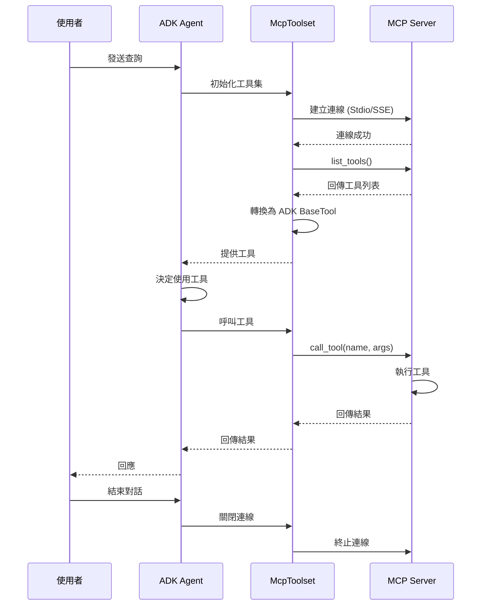
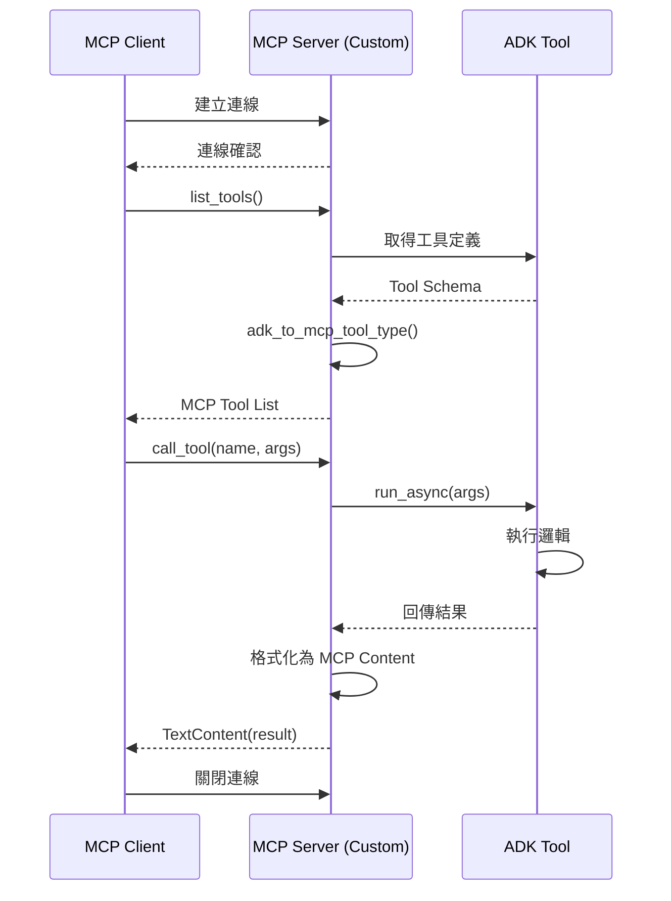
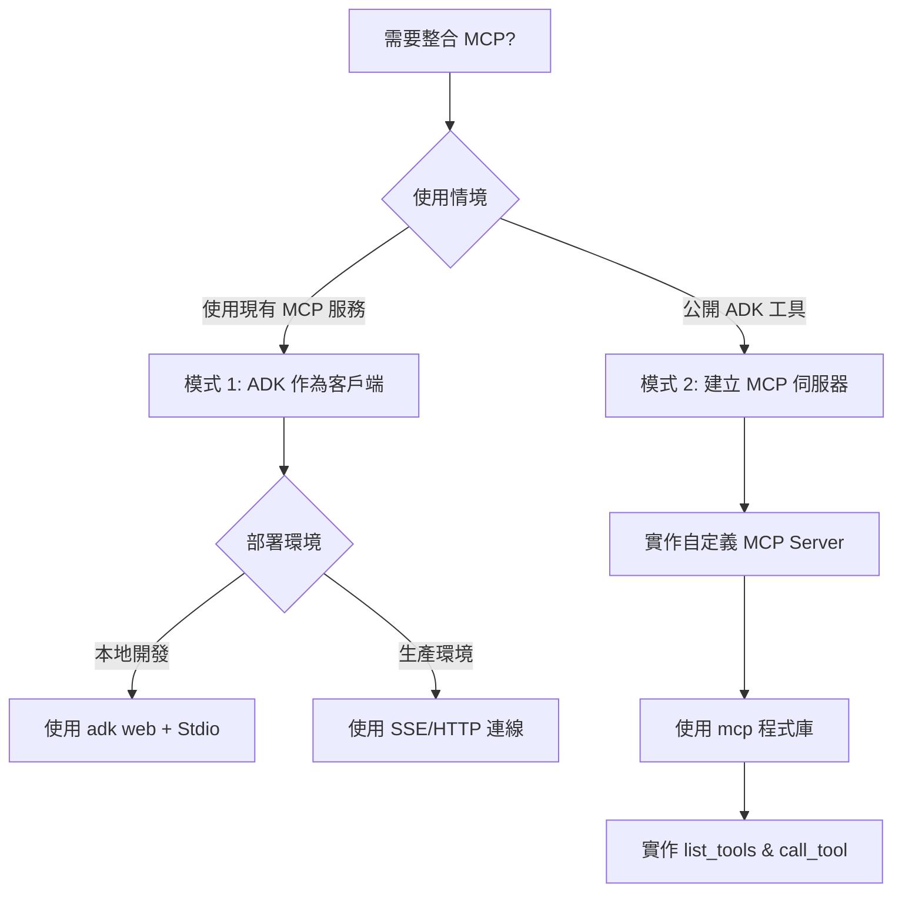
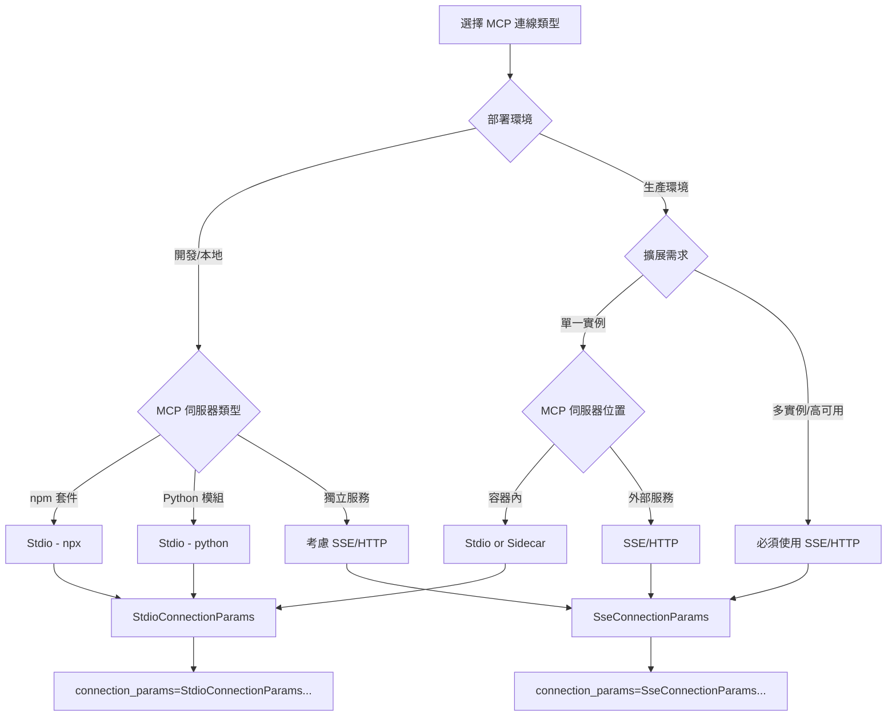

# 模型上下文協定 (Model Context Protocol) 工具

🔔 `更新日期：2026-01-13`

[`ADK 支援`: `Python v0.1.0` | `Typescript v0.2.0` | `Go v0.1.0` | `Java v0.1.0`]

本指南將引導您透過兩種方式將模型上下文協定 (MCP) 與 ADK 整合。

## 什麼是模型上下文協定 (MCP)？

模型上下文協定 (MCP) 是一個開放標準，旨在標準化大型語言模型 (LLM)（如 Gemini 和 Claude）與外部應用程式、數據源及工具之間的通訊。您可以將其視為一種通用的連接機制，簡化了 LLM 獲取上下文、執行操作以及與各種系統互動的方式。

MCP 遵循客戶端-伺服器架構，定義了 **數據** (resources)、**互動式範本** (prompts) 以及 **可執行的功能** (tools) 如何由 **MCP 伺服器** 公開，並由 **MCP 客戶端**（可能是 LLM 主機應用程式或 AI 代理）使用。

本指南涵蓋了兩種主要的整合模式：

1. **在 ADK 中使用現有的 MCP 伺服器：** ADK 代理作為 MCP 客戶端，利用外部 MCP 伺服器提供的工具。
2. **透過 MCP 伺服器公開 ADK 工具：** 建立一個封裝了 ADK 工具的 MCP 伺服器，使任何 MCP 客戶端都能存取這些工具。

### MCP 整合流程時序圖

#### 模式 1：ADK 作為 MCP 客戶端



#### 模式 2：透過 MCP 伺服器公開 ADK 工具



## 先決條件

在開始之前，請確保您已完成以下設定：

* **設定 ADK：** 遵循快速入門中的標準 ADK [設定說明](../get-started/index.md)。
* **安裝/更新 Python/Java：** MCP 需要 Python 3.9 或更高版本，或者 Java 17 或更高版本。
* **設定 Node.js 和 npx：** **(僅限 Python)** 許多社群 MCP 伺服器以 Node.js 套件形式發佈並使用 `npx` 執行。如果您尚未安裝，請安裝 Node.js（包含 npx）。詳情請參閱 [https://nodejs.org/en](https://nodejs.org/en)。
* **驗證安裝：** **(僅限 Python)** 確認在啟動的虛擬環境中，`adk` 和 `npx` 已包含在您的 PATH 中：

```shell
# 兩個指令都應該印出執行檔的路徑。
which adk
which npx
```

## 1. 在 `adk web` 中將 MCP 伺服器與 ADK 代理搭配使用（ADK 作為 MCP 客戶端）

本節說明如何將來自外部 MCP (Model Context Protocol) 伺服器的工具整合到您的 ADK 代理中。當您的 ADK 代理需要使用由公開 MCP 介面的現有服務提供的功能時，這是 **最常見** 的整合模式。您將看到如何將 `McpToolset` 類別直接新增到代理的 `tools` 列表中，進而實現與 MCP 伺服器的無縫連接、發現其工具，並將其提供給您的代理使用。這些範例主要集中在 `adk web` 開發環境內的互動。

### `McpToolset` 類別

`McpToolset` 類別是 ADK 整合來自 MCP 伺服器之工具的主要機制。當您在代理的 `tools` 列表中包含一個 `McpToolset` 實例時，它會自動處理與指定 MCP 伺服器的互動。其運作方式如下：

1.  **連線管理 (Connection Management)：** 在初始化時，`McpToolset` 會建立並管理與 MCP 伺服器的連線。這可以是一個本地伺服器行程（使用 `StdioConnectionParams` 透過標準輸入/輸出進行通訊）或一個遠端伺服器（使用 `SseConnectionParams` 進行伺服器傳送事件 (Server-Sent Events)）。當代理或應用程式終止時，工具集也會處理該連線的順利關閉。
2.  **工具發現與適應 (Tool Discovery & Adaptation)：** 連線後，`McpToolset` 會向 MCP 伺服器查詢其可用工具（透過 `list_tools` MCP 方法）。然後它將這些發現的 MCP 工具架構轉換為與 ADK 相容的 `BaseTool` 實例。
3.  **公開給代理 (Exposure to Agent)：** 這些適應後的工具隨後會提供給您的 `LlmAgent` 使用，就像它們是原生 ADK 工具一樣。
4.  **代理工具調用 (Proxying Tool Calls)：** 當您的 `LlmAgent` 決定使用其中一個工具時，`McpToolset` 會透明地將調用（使用 `call_tool` MCP 方法）代理到 MCP 伺服器，發送必要的參數，並將伺服器的回應傳回給代理。
5.  **過濾（選用） (Filtering (Optional))：** 您可以在建立 `McpToolset` 時使用 `tool_filter` 參數，從 MCP 伺服器中選擇特定的工具子集，而不是將所有工具都公開給您的代理。

以下範例展示了如何在 `adk web` 開發環境中使用 `McpToolset`。對於需要對 MCP 連線生命週期進行更細粒度控制，或者不使用 `adk web` 的場景，請參閱本頁稍後的「在 `adk web` 之外的自定義代理中使用 MCP 工具」章節。

#### McpToolset 核心功能對照表

| 功能 | 說明 | 參數/方法 |
|------|------|----------|
| **連線管理** | 建立與維護 MCP 伺服器連線 | `StdioConnectionParams` / `SseConnectionParams` |
| **工具發現** | 自動查詢可用工具 | 內部呼叫 `list_tools` MCP 方法 |
| **架構轉換** | MCP 工具轉為 ADK BaseTool | `adk_to_mcp_tool_type()` |
| **工具過濾** | 選擇性公開特定工具 | `tool_filter=['tool1', 'tool2']` |
| **代理調用** | 轉發工具執行請求 | 內部呼叫 `call_tool` MCP 方法 |
| **生命週期管理** | 自動清理連線資源 | `await toolset.close()` |

### 範例 1：檔案系統 MCP 伺服器

這個 Python 範例展示了如何連接到提供檔案系統操作的本地 MCP 伺服器。

#### 步驟 1：使用 `McpToolset` 定義您的代理

建立一個 `agent.py` 檔案（例如，在 `./adk_agent_samples/mcp_agent/agent.py` 中）。`McpToolset` 直接在 `LlmAgent` 的 `tools` 列表中實例化。

*   **重要：** 將 `args` 列表中的 `"/path/to/your/folder"` 替換為 MCP 伺服器可以存取的本地系統上實際資料夾的 **絕對路徑**。
*   **重要：** 將 `.env` 檔案放置在 `./adk_agent_samples` 目錄的父目錄中。

```python
# ./adk_agent_samples/mcp_agent/agent.py
import os # 路徑操作所需
from google.adk.agents import LlmAgent
from google.adk.tools.mcp_tool import McpToolset
from google.adk.tools.mcp_tool.mcp_session_manager import StdioConnectionParams
from mcp import StdioServerParameters

# 如果可能，最好動態定義路徑，或確保使用者了解需要絕對路徑。
# 在此範例中，我們將建構一個相對於此檔案的路徑，
# 假設 '/path/to/your/folder' 與 agent.py 位於同一目錄。
# 如果您的設定需要，請將此處替換為實際的絕對路徑。
TARGET_FOLDER_PATH = os.path.join(os.path.dirname(os.path.abspath(__file__)), "/path/to/your/folder")
# 確保 TARGET_FOLDER_PATH 是 MCP 伺服器的絕對路徑。
# 如果您建立了 ./adk_agent_samples/mcp_agent/your_folder，

root_agent = LlmAgent(
    model='gemini-2.0-flash',
    name='filesystem_assistant_agent',
    instruction='協助使用者管理其檔案。您可以列出檔案、讀取檔案等。',
    tools=[
        McpToolset(
            connection_params=StdioConnectionParams(
                server_params = StdioServerParameters(
                    command='npx',
                    args=[
                        "-y",  # npx 的參數，用於自動確認安裝
                        "@modelcontextprotocol/server-filesystem",
                        # 重要：這必須是 npx 程序可以存取的資料夾的絕對路徑。
                        # 替換為您系統上的有效絕對路徑。
                        # 例如："/Users/youruser/accessible_mcp_files"
                        # 或使用動態建構的絕對路徑：
                        os.path.abspath(TARGET_FOLDER_PATH),
                    ],
                ),
            ),
            # 選用：過濾從 MCP 伺服器公開哪些工具
            # tool_filter=['list_directory', 'read_file']
        )
    ],
)
```


#### 步驟 2：建立 `__init__.py` 檔案

確保在與 `agent.py` 相同的目錄中有一個 `__init__.py`，使其成為 ADK 可發現的 Python 套件。

```python
# ./adk_agent_samples/mcp_agent/__init__.py
from . import agent
```

#### 步驟 3：執行 `adk web` 並互動

在終端機中導覽至 `mcp_agent` 的父目錄（例如 `adk_agent_samples`）並執行：

```shell
cd ./adk_agent_samples # 或您的等效父目錄
adk web
```

> [!NOTE] Windows 使用者須知
    當遇到 `_make_subprocess_transport NotImplementedError` 時，請考慮改用 `adk web --no-reload`。


一旦 ADK Web UI 在瀏覽器中載入：

1.  從代理下拉選單中選擇 `filesystem_assistant_agent`。
2.  嘗試以下提示詞：
    *   "列出目前目錄中的檔案。"
    *   "你可以讀取名為 sample.txt 的檔案嗎？"（假設您在 `TARGET_FOLDER_PATH` 中建立了它）。
    *   "`another_file.md` 的內容是什麼？"

您應該會看到代理與 MCP 檔案系統伺服器互動，伺服器的回應（檔案列表、檔案內容）會透過代理轉發。如果 `npx` 程序輸出到 stderr，`adk web` 控制台（執行指令的終端機）也可能顯示相關日誌。


對於 Java，請參考以下範例來定義一個初始化 `McpToolset` 的代理：

```java
package agents;

import com.google.adk.JsonBaseModel;
import com.google.adk.agents.LlmAgent;
import com.google.adk.agents.RunConfig;
import com.google.adk.runner.InMemoryRunner;
import com.google.adk.tools.mcp.McpTool;
import com.google.adk.tools.mcp.McpToolset;
import com.google.adk.tools.mcp.McpToolset.McpToolsAndToolsetResult;
import com.google.genai.types.Content;
import com.google.genai.types.Part;
import io.modelcontextprotocol.client.transport.ServerParameters;

import java.util.List;
import java.util.concurrent.CompletableFuture;

public class McpAgentCreator {

    /**
     * 初始化 McpToolset，使用 stdio 從 MCP 伺服器檢索工具，
     * 使用這些工具建立 LlmAgent，向代理發送提示詞，
     * 並確保關閉工具集。
     * @param args 命令列參數（未使用）。
     */
    public static void main(String[] args) {
        // 注意：如果資料夾位於 home 之外，您可能會遇到權限問題
        String yourFolderPath = "~/path/to/folder";

        ServerParameters connectionParams = ServerParameters.builder("npx")
                .args(List.of(
                        "-y",
                        "@modelcontextprotocol/server-filesystem",
                        yourFolderPath
                ))
                .build();

        try {
            CompletableFuture<McpToolsAndToolsetResult> futureResult =
                    McpToolset.fromServer(connectionParams, JsonBaseModel.getMapper());

            McpToolsAndToolsetResult result = futureResult.join();

            try (McpToolset toolset = result.getToolset()) {
                List<McpTool> tools = result.getTools();

                LlmAgent agent = LlmAgent.builder()
                        .model("gemini-2.0-flash")
                        .name("enterprise_assistant")
                        .description("協助使用者存取其檔案系統的代理")
                        .instruction(
                                "協助使用者存取其檔案系統。您可以列出目錄中的檔案。"
                        )
                        .tools(tools)
                        .build();

                System.out.println("代理已建立：" + agent.name());

                InMemoryRunner runner = new InMemoryRunner(agent);
                String userId = "user123";
                String sessionId = "1234";
                String promptText = "這個目錄中有哪些檔案 - " + yourFolderPath + "？";

                // 首先明確建立工作階段
                try {
                    // 如果建構函式中未指定，InMemoryRunner 的 appName 預設為 agent.name()
                    runner.sessionService().createSession(runner.appName(), userId, null, sessionId).blockingGet();
                    System.out.println("工作階段已建立：" + sessionId + "，使用者：" + userId);
                } catch (Exception sessionCreationException) {
                    System.err.println("建立工作階段失敗：" + sessionCreationException.getMessage());
                    sessionCreationException.printStackTrace();
                    return;
                }

                Content promptContent = Content.fromParts(Part.fromText(promptText));

                System.out.println("\n正在向代理發送提示詞：\"" + promptText + "\"...\n");

                runner.runAsync(userId, sessionId, promptContent, RunConfig.builder().build())
                        .blockingForEach(event -> {
                            System.out.println("收到事件：" + event.toJson());
                        });
            }
        } catch (Exception e) {
            System.err.println("發生錯誤：" + e.getMessage());
            e.printStackTrace();
        }
    }
}
```

假設一個資料夾包含三個名為 `first`、`second` 和 `third` 的檔案，成功的響應將如下所示：

```shell
# 收到事件：包含列出目錄的函式調用
Event received: {"id":"163a449e-691a-48a2-9e38-8cadb6d1f136","invocationId":"e-c2458c56-e57a-45b2-97de-ae7292e505ef","author":"enterprise_assistant","content":{"parts":[{"functionCall":{"id":"adk-388b4ac2-d40e-4f6a-bda6-f051110c6498","args":{"path":"~/home-test"},"name":"list_directory"}}],"role":"model"},"actions":{"stateDelta":{},"artifactDelta":{},"requestedAuthConfigs":{}},"timestamp":1747377543788}

# 收到事件：包含函式響應，列出檔案
Event received: {"id":"8728380b-bfad-4d14-8421-fa98d09364f1","invocationId":"e-c2458c56-e57a-45b2-97de-ae7292e505ef","author":"enterprise_assistant","content":{"parts":[{"functionResponse":{"id":"adk-388b4ac2-d40e-4f6a-bda6-f051110c6498","name":"list_directory","response":{"text_output":[{"text":"[FILE] first\n[FILE] second\n[FILE] third"}]}}}],"role":"user"},"actions":{"stateDelta":{},"artifactDelta":{},"requestedAuthConfigs":{}},"timestamp":1747377544679}

# 收到事件：代理生成的最終文字回應
Event received: {"id":"8fe7e594-3e47-4254-8b57-9106ad8463cb","invocationId":"e-c2458c56-e57a-45b2-97de-ae7292e505ef","author":"enterprise_assistant","content":{"parts":[{"text":"There are three files in the directory: first, second, and third."}],"role":"model"},"actions":{"stateDelta":{},"artifactDelta":{},"requestedAuthConfigs":{}},"timestamp":1747377544689}
```

對於 Typescript，您可以按如下方式定義初始化 `MCPToolset` 的代理：

```typescript
import 'dotenv/config';
import {LlmAgent, MCPToolset} from "@google/adk";

// 將此處替換為您設定的實際絕對路徑。
const TARGET_FOLDER_PATH = "/path/to/your/folder";

export const rootAgent = new LlmAgent({
    model: "gemini-2.5-flash",
    name: "filesystem_assistant_agent",
    instruction: "協助使用者管理其檔案。您可以列出檔案、讀取檔案等。",
    tools: [
        // 若要過濾工具，請將工具名稱列表作為第二個參數
        // 傳遞給 MCPToolset 建構函式。
        // 例如：new MCPToolset(connectionParams, ['list_directory', 'read_file'])
        new MCPToolset(
            {
                type: "StdioConnectionParams",
                serverParams: {
                    command: "npx",
                    args: [
                        "-y",
                        "@modelcontextprotocol/server-filesystem",
                        // 重要：這必須是 npx 程序可以存取的資料夾的絕對路徑。
                        // 替換為您系統上的有效絕對路徑。
                        // 例如："/Users/youruser/accessible_mcp_files"
                        TARGET_FOLDER_PATH,
                    ],
                },
            }
        )
    ],
});
```

### 範例 2：Google Maps MCP 伺服器

這個範例展示了如何連接到 Google Maps MCP 伺服器。

#### 步驟 1：獲取 API 金鑰並啟用 API

1.  **Google Maps API 金鑰：** 遵循 [使用 API 金鑰](https://developers.google.com/maps/documentation/javascript/get-api-key#create-api-keys) 中的說明獲取 Google Maps API 金鑰。
2.  **啟用 API：** 在您的 Google Cloud 專案中，確保已啟用以下 API：
    *   Directions API
    *   Routes API
    有關說明，請參閱 [Google Maps Platform 使用入門](https://developers.google.com/maps/get-started#enable-api-sdk) 文件。

#### 步驟 2：使用 Google Maps 的 `McpToolset` 定義您的代理

修改您的 `agent.py` 檔案（例如，在 `./adk_agent_samples/mcp_agent/agent.py` 中）。將 `YOUR_GOOGLE_MAPS_API_KEY` 替換為您獲取的實際 API 金鑰。

```python
# ./adk_agent_samples/mcp_agent/agent.py
import os
from google.adk.agents import LlmAgent
from google.adk.tools.mcp_tool import McpToolset
from google.adk.tools.mcp_tool.mcp_session_manager import StdioConnectionParams
from mcp import StdioServerParameters

# 從環境變數中檢索 API 金鑰或直接插入。
# 使用環境變數通常更安全。
# 確保在執行 'adk web' 的終端機中設置了此環境變數。
# 例如：export GOOGLE_MAPS_API_KEY="YOUR_ACTUAL_KEY"
google_maps_api_key = os.environ.get("GOOGLE_MAPS_API_KEY")

if not google_maps_api_key:
    # 備用方案或直接分配用於測試 - 不建議用於生產環境
    google_maps_api_key = "YOUR_GOOGLE_MAPS_API_KEY_HERE" # 如果不使用環境變數則替換
    if google_maps_api_key == "YOUR_GOOGLE_MAPS_API_KEY_HERE":
        print("警告：未設置 GOOGLE_MAPS_API_KEY。請將其設置為環境變數或在腳本中設置。")
        # 如果金鑰至關重要且未找到，您可能需要引發錯誤或退出。

root_agent = LlmAgent(
    model='gemini-2.0-flash',
    name='maps_assistant_agent',
    instruction='使用 Google Maps 工具協助使用者進行地圖繪製、路線導航和地點查找。',
    tools=[
        McpToolset(
            connection_params=StdioConnectionParams(
                server_params = StdioServerParameters(
                    command='npx',
                    args=[
                        "-y",
                        "@modelcontextprotocol/server-google-maps",
                    ],
                    # 將 API 金鑰作為環境變數傳遞給 npx 程序
                    # 這是 Google Maps MCP 伺服器預期金鑰的方式。
                    env={
                        "GOOGLE_MAPS_API_KEY": google_maps_api_key
                    }
                ),
            ),
            # 如果需要，您可以過濾特定的地圖工具：
            # tool_filter=['get_directions', 'find_place_by_id']
        )
    ],
)
```

#### 步驟 3：確保 `__init__.py` 存在

如果您在範例 1 中建立了此檔案，可以跳過此步驟。否則，請確保在 `./adk_agent_samples/mcp_agent/` 目錄中有一個 `__init__.py`：

```python
# ./adk_agent_samples/mcp_agent/__init__.py
from . import agent
```

#### 步驟 4：執行 `adk web` 並互動

1.  **設置環境變數（建議）：**
    在執行 `adk web` 之前，最好在終端機中將您的 Google Maps API 金鑰設置為環境變數：

    ```shell
    export GOOGLE_MAPS_API_KEY="YOUR_ACTUAL_GOOGLE_MAPS_API_KEY"
    ```
    將 `YOUR_ACTUAL_GOOGLE_MAPS_API_KEY` 替換為您的金鑰。

2.  **執行 `adk web`**：
    導覽至 `mcp_agent` 的父目錄（例如 `adk_agent_samples`）並執行：

    ```shell
    cd ./adk_agent_samples # 或您的等效父目錄
    adk web
    ```

3.  **在 UI 中互動**：
    *   選擇 `maps_assistant_agent`。
    *   嘗試以下提示詞：
        *   "規劃從 GooglePlex 到 SFO 的路線。"
        *   "尋找 Golden Gate Park 附近的咖啡店。"
        *   "從法國巴黎到德國柏林的路線是什麼？"

您應該會看到代理使用 Google Maps MCP 工具提供路線導航或基於位置的資訊。


對於 Java，請參考以下範例來定義一個初始化 `McpToolset` 的代理：

```java
package agents;

import com.google.adk.JsonBaseModel;
import com.google.adk.agents.LlmAgent;
import com.google.adk.agents.RunConfig;
import com.google.adk.runner.InMemoryRunner;
import com.google.adk.tools.mcp.McpTool;
import com.google.adk.tools.mcp.McpToolset;
import com.google.adk.tools.mcp.McpToolset.McpToolsAndToolsetResult;


import com.google.genai.types.Content;
import com.google.genai.types.Part;

import io.modelcontextprotocol.client.transport.ServerParameters;

import java.util.List;
import java.util.Map;
import java.util.Collections;
import java.util.HashMap;
import java.util.concurrent.CompletableFuture;
import java.util.Arrays;

public class MapsAgentCreator {

    /**
     * 為 Google Maps 初始化 McpToolset，檢索工具，
     * 建立 LlmAgent，發送地圖相關提示詞，並關閉工具集。
     * @param args 命令列參數（未使用）。
     */
    public static void main(String[] args) {
        // TODO: 替換為您的實際 Google Maps API 金鑰，且該專案已啟用 Places API。
        String googleMapsApiKey = "YOUR_GOOGLE_MAPS_API_KEY";

        Map<String, String> envVariables = new HashMap<>();
        envVariables.put("GOOGLE_MAPS_API_KEY", googleMapsApiKey);

        ServerParameters connectionParams = ServerParameters.builder("npx")
                .args(List.of(
                        "-y",
                        "@modelcontextprotocol/server-google-maps"
                ))
                .env(Collections.unmodifiableMap(envVariables))
                .build();

        try {
            CompletableFuture<McpToolsAndToolsetResult> futureResult =
                    McpToolset.fromServer(connectionParams, JsonBaseModel.getMapper());

            McpToolsAndToolsetResult result = futureResult.join();

            try (McpToolset toolset = result.getToolset()) {
                List<McpTool> tools = result.getTools();

                LlmAgent agent = LlmAgent.builder()
                        .model("gemini-2.0-flash")
                        .name("maps_assistant")
                        .description("地圖助手")
                        .instruction("使用可用工具協助使用者進行地圖繪製和路線導航。")
                        .tools(tools)
                        .build();

                System.out.println("代理已建立：" + agent.name());

                InMemoryRunner runner = new InMemoryRunner(agent);
                String userId = "maps-user-" + System.currentTimeMillis();
                String sessionId = "maps-session-" + System.currentTimeMillis();

                String promptText = "請告訴我離麥迪遜廣場花園最近的藥局路線。";

                try {
                    runner.sessionService().createSession(runner.appName(), userId, null, sessionId).blockingGet();
                    System.out.println("工作階段已建立：" + sessionId + "，使用者：" + userId);
                } catch (Exception sessionCreationException) {
                    System.err.println("建立工作階段失敗：" + sessionCreationException.getMessage());
                    sessionCreationException.printStackTrace();
                    return;
                }

                Content promptContent = Content.fromParts(Part.fromText(promptText))

                System.out.println("\n正在向代理發送提示詞：\"" + promptText + "\"...\n");

                runner.runAsync(userId, sessionId, promptContent, RunConfig.builder().build())
                        .blockingForEach(event -> {
                            System.out.println("收到事件：" + event.toJson());
                        });
            }
        } catch (Exception e) {
            System.err.println("發生錯誤：" + e.getMessage());
            e.printStackTrace();
        }
    }
}
```

成功的響應將如下所示：

```shell
# 收到事件：代理提供的文字回應
Event received: {"id":"1a4deb46-c496-4158-bd41-72702c773368","invocationId":"e-48994aa0-531c-47be-8c57-65215c3e0319","author":"maps_assistant","content":{"parts":[{"text":"好的。我看到了一些選擇。最近的是位於 5 Pennsylvania Plaza, New York, NY 10001, United States 的 CVS Pharmacy。您需要導航路線嗎？\n"}],"role":"model"},"actions":{"stateDelta":{},"artifactDelta":{},"requestedAuthConfigs":{}},"timestamp":1747380026642}
```

對於 TypeScript，請參考以下範例來定義一個初始化 `MCPToolset` 的代理：

```typescript
import 'dotenv/config';
import {LlmAgent, MCPToolset} from "@google/adk";

// 從環境變數中檢索 API 金鑰。
// 確保在執行 'adk web' 的終端機中設置了此環境變數。
// 例如：export GOOGLE_MAPS_API_KEY="YOUR_ACTUAL_KEY"
const googleMapsApiKey = process.env.GOOGLE_MAPS_API_KEY;
if (!googleMapsApiKey) {
    throw new Error('未提供 GOOGLE_MAPS_API_KEY，請執行 "export GOOGLE_MAPS_API_KEY=YOUR_ACTUAL_KEY" 以新增。');
}

export const rootAgent = new LlmAgent({
    model: "gemini-2.5-flash",
    name: "maps_assistant_agent",
    instruction: "使用 Google Maps 工具協助使用者進行地圖繪製、路線導航和地點查找。",
    tools: [
        new MCPToolset(
            {
                type: "StdioConnectionParams",
                serverParams: {
                    command: "npx",
                    args: [
                        "-y",
                        "@modelcontextprotocol/server-google-maps",
                    ],
                    // 將 API 金鑰作為環境變數傳遞給 npx 程序
                    // 這是 Google Maps MCP 伺服器預期金鑰的方式。
                    env: {
                        "GOOGLE_MAPS_API_KEY": googleMapsApiKey
                    }
                },
            },
            // 如果需要，您可以過濾特定的地圖工具：
            // ['get_directions', 'find_place_by_id']
        )
    ],
});
```

成功的響應將如下所示：

```shell
# 收到事件：包含地點資訊的響應
Event received: {"id":"1a4deb46-c496-4158-bd41-72702c773368","invocationId":"e-48994aa0-531c-47be-8c57-65215c3e0319","author":"maps_assistant","content":{"parts":[{"text":"好的。我看到了一些選擇。最近的是位於 5 Pennsylvania Plaza, New York, NY 10001, United States 的 CVS Pharmacy。您需要導航路線嗎？\n"}],"role":"model"},"actions":{"stateDelta":{},"artifactDelta":{},"requestedAuthConfigs":{}},"timestamp":1747380026642}
```

## 2. 使用 ADK 工具構建 MCP 伺服器 (MCP 伺服器公開 ADK)

此模式允許您封裝現有的 ADK 工具，並將其提供給任何標準 MCP 客戶端應用程式。本節中的範例透過自建的 MCP 伺服器公開 ADK 的 `load_web_page` 工具。

### 步驟摘要

您將使用 `mcp` 程式庫建立一個標準的 Python MCP 伺服器應用程式。在此伺服器中，您將：

1.  實例化您想要公開的 ADK 工具（例如 `FunctionTool(load_web_page)`）。
2.  實作 MCP 伺服器的 `@app.list_tools()` 處理程序以宣告 ADK 工具。這涉及使用 `google.adk.tools.mcp_tool.conversion_utils` 中的 `adk_to_mcp_tool_type` 工具將 ADK 工具定義轉換為 MCP 架構。
3.  實作 MCP 伺服器的 `@app.call_tool()` 處理程序。此處理程序將：
    *   接收來自 MCP 客戶端的工具調用請求。
    *   識別請求是否針對您封裝的 ADK 工具。
    *   執行 ADK 工具的 `.run_async()` 方法。
    *   將 ADK 工具的結果格式化為符合 MCP 標準的響應（例如 `mcp.types.TextContent`）。

### 先決條件

在與您的 ADK 安裝相同的 Python 環境中安裝 MCP 伺服器程式庫：

```shell
pip install mcp
```

### 步驟 1：建立 MCP 伺服器腳本

為您的 MCP 伺服器建立一個新的 Python 檔案，例如 `my_adk_mcp_server.py`。

### 步驟 2：實作伺服器邏輯

將以下程式碼新增到 `my_adk_mcp_server.py`。此腳本設置了一個公開 ADK `load_web_page` 工具的 MCP 伺服器。

```python
# my_adk_mcp_server.py
import asyncio
import json
import os
from dotenv import load_dotenv

# MCP 伺服器導入
from mcp import types as mcp_types # 使用別名以避免衝突
from mcp.server.lowlevel import Server, NotificationOptions
from mcp.server.models import InitializationOptions
import mcp.server.stdio # 用於作為 stdio 伺服器運行

# ADK 工具導入
from google.adk.tools.function_tool import FunctionTool
from google.adk.tools.load_web_page import load_web_page # 範例 ADK 工具
# ADK <-> MCP 轉換工具
from google.adk.tools.mcp_tool.conversion_utils import adk_to_mcp_tool_type

# --- 加載環境變數（如果 ADK 工具需要，例如 API 金鑰） ---
load_dotenv() # 如果需要，在相同目錄下建立 .env 檔案

# --- 準備 ADK 工具 ---
# 實例化您想要公開的 ADK 工具。
# 此工具將被封裝並由 MCP 伺服器調用。
print("正在初始化 ADK load_web_page 工具...")
adk_tool_to_expose = FunctionTool(load_web_page)
print(f"ADK 工具 '{adk_tool_to_expose.name}' 已初始化，準備透過 MCP 公開。")
# --- ADK 工具準備結束 ---

# --- MCP 伺服器設置 ---
print("正在建立 MCP 伺服器實例...")
# 使用 mcp.server 程式庫建立一個命名的 MCP 伺服器實例
app = Server("adk-tool-exposing-mcp-server")

# 實作 MCP 伺服器的處理程序以列出可用工具
@app.list_tools()
async def list_mcp_tools() -> list[mcp_types.Tool]:
    """列出此伺服器公開之工具的 MCP 處理程序。"""
    print("MCP 伺服器：收到 list_tools 請求。")
    # 將 ADK 工具的定義轉換為 MCP 工具架構格式
    mcp_tool_schema = adk_to_mcp_tool_type(adk_tool_to_expose)
    print(f"MCP 伺服器：宣告工具：{mcp_tool_schema.name}")
    return [mcp_tool_schema]

# 實作 MCP 伺服器的處理程序以執行工具調用
@app.call_tool()
async def call_mcp_tool(
    name: str, arguments: dict
) -> list[mcp_types.Content]: # MCP 使用 mcp_types.Content
    """執行 MCP 客戶端請求之工具調用的 MCP 處理程序。"""
    print(f"MCP 伺服器：收到針對 '{name}' 的 call_tool 請求，參數：{arguments}")

    # 檢查請求的工具名稱是否與我們封裝的 ADK 工具匹配
    if name == adk_tool_to_expose.name:
        try:
            # 執行 ADK 工具的 run_async 方法。
            # 注意：此處 tool_context 為 None，因為此 MCP 伺服器
            # 在完整的 ADK Runner 調用之外執行 ADK 工具。
            # 如果 ADK 工具需要 ToolContext 功能（如狀態或驗證），
            # 這種直接調用可能需要更複雜的處理。
            adk_tool_response = await adk_tool_to_expose.run_async(
                args=arguments,
                tool_context=None,
            )
            print(f"MCP 伺服器：ADK 工具 '{name}' 已執行。響應：{adk_tool_response}")

            # 將 ADK 工具的響應（通常是字典）格式化為符合 MCP 的格式。
            # 在此，我們將響應字典序列化為 TextContent 內的 JSON 字串。
            # 根據 ADK 工具的輸出和客戶端需求調整格式。
            response_text = json.dumps(adk_tool_response, indent=2)
            # MCP 預期一個 mcp_types.Content 部分的列表
            return [mcp_types.TextContent(type="text", text=response_text)]

        except Exception as e:
            print(f"MCP 伺服器：執行 ADK 工具 '{name}' 時出錯：{e}")
            # 以 MCP 格式返回錯誤訊息
            error_text = json.dumps({"error": f"執行工具 '{name}' 失敗：{str(e)}"})
            return [mcp_types.TextContent(type="text", text=error_text)]
    else:
        # 處理對未知工具的調用
        print(f"MCP 伺服器：此伺服器找不到/未公開工具 '{name}'。")
        error_text = json.dumps({"error": f"此伺服器未實作工具 '{name}'。"})
        return [mcp_types.TextContent(type="text", text=error_text)]

# --- MCP 伺服器運行器 ---
async def run_mcp_stdio_server():
    """運行 MCP 伺服器，監聽標準輸入/輸出上的連線。"""
    # 使用 mcp.server.stdio 程式庫中的 stdio_server 上下文管理器
    async with mcp.server.stdio.stdio_server() as (read_stream, write_stream):
        print("MCP Stdio 伺服器：正在與客戶端開始握手...")
        await app.run(
            read_stream,
            write_stream,
            InitializationOptions(
                server_name=app.name, # 使用上方定義的伺服器名稱
                server_version="0.1.0",
                capabilities=app.get_capabilities(
                    # 定義伺服器功能 - 選項請參閱 MCP 文件
                    notification_options=NotificationOptions(),
                    experimental_capabilities={},
                ),
            ),
        )
        print("MCP Stdio 伺服器：運行迴圈已結束或客戶端已斷開連線。")

if __name__ == "__main__":
    print("正在啟動 MCP 伺服器以透過 stdio 公開 ADK 工具...")
    try:
        asyncio.run(run_mcp_stdio_server())
    except KeyboardInterrupt:
        print("\nMCP 伺服器 (stdio) 已由使用者停止。")
    except Exception as e:
        print(f"MCP 伺服器 (stdio) 遇到錯誤：{e}")
    finally:
        print("MCP 伺服器 (stdio) 程序正在退出。")
# --- MCP 伺服器結束 ---
```

### 步驟 3：使用 ADK 代理測試您的自定義 MCP 伺服器

現在，建立一個 ADK 代理，它將作為您剛剛構建的 MCP 伺服器的客戶端。此 ADK 代理將使用 `McpToolset` 連接到您的 `my_adk_mcp_server.py` 腳本。

建立一個 `agent.py`（例如，在 `./adk_agent_samples/mcp_client_agent/agent.py` 中）：

```python
# ./adk_agent_samples/mcp_client_agent/agent.py
import os
from google.adk.agents import LlmAgent
from google.adk.tools.mcp_tool import McpToolset
from google.adk.tools.mcp_tool.mcp_session_manager import StdioConnectionParams
from mcp import StdioServerParameters

# 重要：將此處替換為 my_adk_mcp_server.py 腳本的絕對路徑
PATH_TO_YOUR_MCP_SERVER_SCRIPT = "/path/to/your/my_adk_mcp_server.py" # <<< 替換

if PATH_TO_YOUR_MCP_SERVER_SCRIPT == "/path/to/your/my_adk_mcp_server.py":
    print("警告：未設置 PATH_TO_YOUR_MCP_SERVER_SCRIPT。請在 agent.py 中更新它。")
    # 如果路徑至關重要，可選擇引發錯誤

root_agent = LlmAgent(
    model='gemini-2.0-flash',
    name='web_reader_mcp_client_agent',
    instruction="使用 'load_web_page' 工具獲取使用者提供之 URL 的內容。",
    tools=[
        McpToolset(
            connection_params=StdioConnectionParams(
                server_params = StdioServerParameters(
                    command='python3', # 執行 MCP 伺服器腳本的命令
                    args=[PATH_TO_YOUR_MCP_SERVER_SCRIPT], # 參數是腳本的路徑
                )
            )
            # tool_filter=['load_web_page'] # 選用：確保僅加載特定工具
        )
    ],
)
```

並在同一目錄下建立一個 `__init__.py`：

```python
# ./adk_agent_samples/mcp_client_agent/__init__.py
from . import agent
```

**運行測試：**

1.  **啟動您的自定義 MCP 伺服器（選用，用於單獨觀察）：**
    您可以在一個終端機中直接運行 `my_adk_mcp_server.py` 以查看其日誌：

    ```shell
    python3 /path/to/your/my_adk_mcp_server.py
    ```
    它將印出 "正在啟動 MCP 伺服器..." 並等待。如果 `StdioConnectionParams` 中的 `command` 設置為執行它，則 ADK 代理（透過 `adk web` 運行）將連接到此程序。
    *（或者，當代理初始化時，`McpToolset` 會自動將此伺服器腳本作為子程序啟動）。*

2.  **為客戶端代理運行 `adk web`：**
    導覽至 `mcp_client_agent` 的父目錄（例如 `adk_agent_samples`）並執行：

    ```shell
    cd ./adk_agent_samples # 或您的等效父目錄
    adk web
    ```

3.  **在 ADK Web UI 中互動：**
    *   選擇 `web_reader_mcp_client_agent`。
    *   嘗試提示詞，例如："載入來自 https://example.com 的內容"

ADK 代理 (`web_reader_mcp_client_agent`) 將使用 `McpToolset` 啟動並連接到您的 `my_adk_mcp_server.py`。您的 MCP 伺服器將收到 `call_tool` 請求，執行 ADK `load_web_page` 工具，並返回結果。ADK 代理隨後會轉發此資訊。您應該會在 ADK Web UI（及其終端機）中看到日誌，如果您單獨運行了 `my_adk_mcp_server.py`，也可能在其終端機中看到日誌。

此範例展示了 ADK 工具如何封裝在 MCP 伺服器中，使其可供更廣泛的符合 MCP 標準的客戶端存取，而不僅僅是 ADK 代理。

請參閱 [文件](https://modelcontextprotocol.io/quickstart/server#core-mcp-concepts)，嘗試搭配 Claude Desktop 使用。

## 在 `adk web` 之外的自定義代理中使用 MCP 工具

如果您符合以下情況，則本節與您相關：

* 您正在使用 ADK 開發自己的代理
* 並且，您 **不使用** `adk web`
* 並且，您透過自己的 UI 公開代理

使用 MCP 工具需要與使用一般工具不同的設置，因為 MCP 工具的規範是從遠端運行或在另一個程序中運行的 MCP 伺服器非同步獲取的。

以下範例修改自上方的「範例 1：檔案系統 MCP 伺服器」。主要區別在於：

1. 您的工具和代理是非同步建立的
2. 您需要正確管理退出堆疊 (exit stack)，以便在與 MCP 伺服器的連線關閉時，正確銷毀您的代理和工具。

```python
# agent.py (根據需要修改 get_tools_async 和其他部分)
# ./adk_agent_samples/mcp_agent/agent.py
import os
import asyncio
from dotenv import load_dotenv
from google.genai import types
from google.adk.agents.llm_agent import LlmAgent
from google.adk.runners import Runner
from google.adk.sessions import InMemorySessionService
from google.adk.artifacts.in_memory_artifact_service import InMemoryArtifactService # 選用
from google.adk.tools.mcp_tool import McpToolset
from google.adk.tools.mcp_tool.mcp_session_manager import StdioConnectionParams
from mcp import StdioServerParameters

# 從父目錄的 .env 檔案加載環境變數
# 放置在頂部附近，在使用 API 金鑰等環境變數之前
load_dotenv('../.env')

# 確保 TARGET_FOLDER_PATH 是 MCP 伺服器的絕對路徑。
TARGET_FOLDER_PATH = os.path.join(os.path.dirname(os.path.abspath(__file__)), "/path/to/your/folder")

# --- 步驟 1：代理定義 ---
async def get_agent_async():
  """建立一個配備有來自 MCP 伺服器之工具的 ADK 代理。"""
  toolset = McpToolset(
      # 使用 StdioConnectionParams 進行本地程序通訊
      connection_params=StdioConnectionParams(
          server_params = StdioServerParameters(
            command='npx', # 運行伺服器的命令
            args=["-y",    # 指令參數
                "@modelcontextprotocol/server-filesystem",
                TARGET_FOLDER_PATH],
          ),
      ),
      tool_filter=['read_file', 'list_directory'] # 選用：過濾特定工具
      # 對於遠端伺服器，您將改用 SseConnectionParams：
      # connection_params=SseConnectionParams(url="http://remote-server:port/path", headers={...})
  )

  # 在代理中使用
  root_agent = LlmAgent(
      model='gemini-2.0-flash', # 根據可用性調整模型名稱
      name='enterprise_assistant',
      instruction='協助使用者存取其檔案系統',
      tools=[toolset], # 將 MCP 工具提供給 ADK 代理
  )
  return root_agent, toolset

# --- 步驟 2：主要執行邏輯 ---
async def async_main():
  session_service = InMemorySessionService()
  # 此範例可能不需要構件服務 (Artifact service)
  artifacts_service = InMemoryArtifactService()

  session = await session_service.create_session(
      state={}, app_name='mcp_filesystem_app', user_id='user_fs'
  )

  # TODO: 將查詢更改為與您指定的資料夾相關的內容。
  # 例如："列出 'documents' 子資料夾中的檔案" 或 "讀取檔案 'notes.txt'"
  query = "列出 tests 資料夾中的檔案"
  print(f"使用者查詢：'{query}'")
  content = types.Content(role='user', parts=[types.Part(text=query)])

  root_agent, toolset = await get_agent_async()

  runner = Runner(
      app_name='mcp_filesystem_app',
      agent=root_agent,
      artifact_service=artifacts_service, # 選用
      session_service=session_service,
  )

  print("正在運行代理...")
  events_async = runner.run_async(
      session_id=session.id, user_id=session.user_id, new_message=content
  )

  async for event in events_async:
    print(f"收到事件：{event}")

  # 清理工作由代理框架自動處理
  # 但您也可以在需要時手動關閉：
  print("正在關閉 MCP 伺服器連線...")
  await toolset.close()
  print("清理完成。")

if __name__ == '__main__':
  try:
    asyncio.run(async_main())
  except Exception as e:
    print(f"發生錯誤：{e}")
```


## 📋 重點整理

### MCP 與 ADK 整合的關鍵概念

| 概念 | 說明 |
|------|------|
| **MCP 協定** | 標準化 LLM 與外部系統通訊的開放協定 |
| **McpToolset** | ADK 中將 MCP 工具橋接為原生工具的類別 |
| **連線模式** | Stdio (本地程序) 或 SSE/HTTP (遠端服務) |
| **工具轉換** | 自動將 MCP 架構轉換為 ADK BaseTool |
| **具狀態連線** | MCP 維持持久連線，需注意部署影響 |

### 使用時機快速參考



### 兩種整合模式比較

| 特性 | 模式 1: ADK 作為 MCP 客戶端 | 模式 2: 公開 ADK 工具 |
|------|-------------------------|--------------------|
| **使用情境** | 需要使用外部 MCP 服務提供的功能 | 讓其他 MCP 客戶端使用 ADK 工具 |
| **主要類別** | `McpToolset` | 自定義 MCP Server (使用 `mcp` 程式庫) |
| **工具流向** | MCP Server → ADK Agent | ADK Tool → MCP Client |
| **適用範例** | 檔案系統、Google Maps 服務 | 封裝 `load_web_page` 等 ADK 工具 |
| **部署考量** | 需管理連線生命週期 | 需獨立部署 MCP 伺服器 |
| **開發難度** | 簡單 (直接使用 `McpToolset`) | 中等 (需實作伺服器邏輯) |

## 關鍵注意事項

在使用 MCP 和 ADK 時，請記住以下幾點：

* **協定 vs. 程式庫：** MCP 是一項協定規範，定義了通訊規則。ADK 是一個用於構建代理的 Python 程式庫/框架。McpToolset 透過在 ADK 框架內實作 MCP 協定的客戶端來橋接兩者。相反，在 Python 中構建 MCP 伺服器需要使用 model-context-protocol 程式庫。

* **ADK 工具 vs. MCP 工具：**

    * ADK 工具 (BaseTool, FunctionTool, AgentTool 等) 是 Python 物件，設計用於直接在 ADK 的 LlmAgent 和 Runner 內使用。
    * MCP 工具是由 MCP 伺服器根據協定架構公開的功能。McpToolset 使這些工具對於 LlmAgent 來說看起來就像 ADK 工具。

* **非同步性質：** ADK 和 MCP Python 程式庫都大量基於 asyncio Python 程式庫。工具實作和伺服器處理程序通常應該是非同步函式。

* **具狀態的工作階段 (MCP)：** MCP 在客戶端和伺服器實例之間建立具狀態的持久連線。這與典型的無狀態 REST API 不同。

    * **部署：** 這種具狀態性質可能為擴展和部署帶來挑戰，特別是對於處理大量使用者的遠端伺服器。原始的 MCP 設計通常假設客戶端和伺服器位於同一位置。管理這些持久連線需要仔細的基礎架構考慮（例如：負載平衡、工作階段親和性）。
    * **ADK McpToolset：** 管理此連線生命週期。範例中顯示的退出堆疊模式對於確保在 ADK 代理完成時正確終止連線（以及可能的伺服器程序）至關重要。

## 部署具備 MCP 工具的代理

將使用 MCP 工具的 ADK 代理部署到 Cloud Run、GKE 或 Vertex AI Agent Engine 等生產環境時，您需要考慮 MCP 連線在容器化和分散式環境中將如何運作。

### 關鍵部署要求：同步代理定義

**⚠️ 重要：** 部署具備 MCP 工具的代理時，代理及其 McpToolset 必須在您的 `agent.py` 檔案中 **同步** 定義。雖然 `adk web` 允許非同步建立代理，但部署環境要求同步實例化。

```python
# ✅ 正確：用於部署的同步代理定義
import os
from google.adk.agents.llm_agent import LlmAgent
from google.adk.tools.mcp_tool import McpToolset
from google.adk.tools.mcp_tool.mcp_session_manager import StdioConnectionParams
from mcp import StdioServerParameters

_allowed_path = os.path.dirname(os.path.abspath(__file__))

root_agent = LlmAgent(
    model='gemini-2.0-flash',
    name='enterprise_assistant',
    instruction=f'協助使用者存取其檔案系統。允許的目錄：{_allowed_path}',
    tools=[
        McpToolset(
            connection_params=StdioConnectionParams(
                server_params=StdioServerParameters(
                    command='npx',
                    args=['-y', '@modelcontextprotocol/server-filesystem', _allowed_path],
                ),
                timeout=5,  # 配置適當的超時時間
            ),
            # 生產環境中為了安全而過濾工具
            tool_filter=[
                'read_file', 'read_multiple_files', 'list_directory',
                'directory_tree', 'search_files', 'get_file_info',
                'list_allowed_directories',
            ],
        )
    ],
)
```

> Python

```python
# ❌ 錯誤：非同步模式在部署中無法運作
async def get_agent():  # 這在部署中無效
    toolset = await create_mcp_toolset_async()
    return LlmAgent(tools=[toolset])
```

### 快速部署指令

#### Vertex AI Agent Engine

```bash
uv run adk deploy agent_engine \
  --project=<your-gcp-project-id> \
  --region=<your-gcp-region> \
  --staging_bucket="gs://<your-gcs-bucket>" \
  --display_name="My MCP Agent" \
  ./path/to/your/agent_directory
```

#### Cloud Run

```bash
uv run adk deploy cloud_run \
  --project=<your-gcp-project-id> \
  --region=<your-gcp-region> \
  --service_name=<your-service-name> \
  ./path/to/your/agent_directory
```

### 部署模式

#### 部署模式比較表

| 模式 | 優點 | 缺點 | 最佳使用情境 |
|------|------|------|------------|
| **Stdio (自足式)** | • 設置簡單<br>• 程序隔離<br>• 在容器中運作良好 | • 程序開銷大<br>• 不適合大規模 | • 開發環境<br>• 單租戶部署<br>• 簡單 MCP 伺服器 |
| **Streamable HTTP (遠端)** | • 基於網絡<br>• 具擴展性<br>• 可處理多客戶端 | • 需要網絡基礎設施<br>• 驗證複雜 | • 生產部署<br>• 多租戶系統<br>• 外部 MCP 服務 |
| **Sidecar (GKE)** | • 共享命名空間<br>• 低延遲<br>• 資源隔離 | • 需要 Kubernetes<br>• 配置複雜 | • 微服務架構<br>• 需要資源隔離<br>• GKE 部署 |

#### 模式 1：自足式 Stdio MCP 伺服器

對於可以封裝為 npm 套件或 Python 模組的 MCP 伺服器（如 `@modelcontextprotocol/server-filesystem`），您可以將其直接包含在代理容器中：

**容器要求：**

```dockerfile
# npm 型 MCP 伺服器的範例
FROM python:3.13-slim

# 為 MCP 伺服器安裝 Node.js 和 npm
RUN apt-get update && apt-get install -y nodejs npm && rm -rf /var/lib/apt/lists/*

# 安裝您的 Python 依賴項
COPY requirements.txt .
RUN pip install -r requirements.txt

# 複製您的代理程式碼
COPY . .

# 您的代理現在可以使用 StdioConnectionParams 配合 'npx' 指令
CMD ["python", "main.py"]
```

**代理配置：**

```python
# 這在容器中可行，因為 npx 和 MCP 伺服器運行在相同環境中
McpToolset(
    connection_params=StdioConnectionParams(
        server_params=StdioServerParameters(
            command='npx',
            args=["-y", "@modelcontextprotocol/server-filesystem", "/app/data"],
        ),
    ),
)
```

#### 模式 2：遠端 MCP 伺服器 (Streamable HTTP)

對於需要擴展性的生產部署，請將 MCP 伺服器部署為獨立服務並透過 Streamable HTTP 連接：

**MCP 伺服器部署 (Cloud Run)：**

```python
# deploy_mcp_server.py - 使用 Streamable HTTP 的獨立 Cloud Run 服務
import contextlib
import logging
from collections.abc import AsyncIterator
from typing import Any

import anyio
import click
import mcp.types as types
from mcp.server.lowlevel import Server
from mcp.server.streamable_http_manager import StreamableHTTPSessionManager
from starlette.applications import Starlette
from starlette.routing import Mount
from starlette.types import Receive, Scope, Send

logger = logging.getLogger(__name__)

def create_mcp_server():
    """建立並配置 MCP 伺服器。"""
    app = Server("adk-mcp-streamable-server")

    @app.call_tool()
    async def call_tool(name: str, arguments: dict[str, Any]) -> list[types.ContentBlock]:
        """處理來自 MCP 客戶端的工具調用。"""
        # 範例工具實作 - 替換為您實際的 ADK 工具
        if name == "example_tool":
            result = arguments.get("input", "No input provided")
            return [
                types.TextContent(
                    type="text",
                    text=f"Processed: {result}"
                )
            ]
        else:
            raise ValueError(f"Unknown tool: {name}")

    @app.list_tools()
    async def list_tools() -> list[types.Tool]:
        """列出可用工具。"""
        return [
            types.Tool(
                name="example_tool",
                description="用於演示的範例工具",
                inputSchema={
                    "type": "object",
                    "properties": {
                        "input": {
                            "type": "string",
                            "description": "要處理的輸入文字"
                        }
                    },
                    "required": ["input"]
                }
            )
        ]

    return app

def main(port: int = 8080, json_response: bool = False):
    """主伺服器函式。"""
    logging.basicConfig(level=logging.INFO)

    app = create_mcp_server()

    # 建立具有無狀態模式的會話管理器以實現擴展性
    session_manager = StreamableHTTPSessionManager(
        app=app,
        event_store=None,
        json_response=json_response,
        stateless=True,  # 對於 Cloud Run 擴展性至關重要
    )

    async def handle_streamable_http(scope: Scope, receive: Receive, send: Send) -> None:
        await session_manager.handle_request(scope, receive, send)

    @contextlib.asynccontextmanager
    async def lifespan(app: Starlette) -> AsyncIterator[None]:
        """管理會話管理器生命週期。"""
        async with session_manager.run():
            logger.info("MCP Streamable HTTP 伺服器已啟動！")
            try:
                yield
            finally:
                logger.info("MCP 伺服器關閉中...")

    # 建立 ASGI 應用程式
    starlette_app = Starlette(
        debug=False,  # 生產環境設置為 False
        routes=[
            Mount("/mcp", app=handle_streamable_http),
        ],
        lifespan=lifespan,
    )

    import uvicorn
    uvicorn.run(starlette_app, host="0.0.0.0", port=port)

if __name__ == "__main__":
    main()
```

**遠端 MCP 的代理配置：**

```python
# 您的 ADK 代理透過 Streamable HTTP 連接到遠端 MCP 服務
McpToolset(
    connection_params=StreamableHTTPConnectionParams(
        url="https://your-mcp-server-url.run.app/mcp",
        headers={"Authorization": "Bearer your-auth-token"}
    ),
)
```

#### 模式 3：Sidecar MCP 伺服器 (GKE)

在 Kubernetes 環境中，您可以將 MCP 伺服器部署為 sidecar 容器：

```yaml
# deployment.yaml - 具有 MCP sidecar 的 GKE
apiVersion: apps/v1
kind: Deployment
metadata:
  name: adk-agent-with-mcp
spec:
  template:
    spec:
      containers:
      # 主要 ADK 代理容器
      - name: adk-agent
        image: your-adk-agent:latest
        ports:
        - containerPort: 8080
        env:
        - name: MCP_SERVER_URL
          value: "http://localhost:8081"

      # MCP 伺服器 sidecar
      - name: mcp-server
        image: your-mcp-server:latest
        ports:
        - containerPort: 8081
```

### 連線管理考量因素

#### Stdio 連線
- **優點：** 設置簡單、程序隔離、在容器中運作良好
- **缺點：** 程序開銷大、不適合大規模部署
- **最佳用途：** 開發、單租戶部署、簡單的 MCP 伺服器

#### SSE/HTTP 連線
- **優點：** 基於網絡、具擴展性、可以處理多個客戶端
- **缺點：** 需要網絡基礎設施、驗證複雜
- **最佳用途：** 生產部署、多租戶系統、外部 MCP 服務

#### 連線類型選擇決策流程



### 生產部署檢查清單

將具有 MCP 工具的代理部署到生產環境時：

**✅ 連線生命週期**
- 確保使用 exit_stack 模式正確清理 MCP 連線
- 為連線建立和請求配置適當的超時時間
- 針對暫時性連線失敗實作重試邏輯

**✅ 資源管理**
- 監控 stdio MCP 伺服器的記憶體使用情況（每個都會生成一個程序）
- 為 MCP 伺服器程序配置適當的 CPU/記憶體限制
- 考慮為遠端 MCP 伺服器使用連線池

**✅ 安全性**
- 為遠端 MCP 連線使用驗證標頭
- 限制 ADK 代理與 MCP 伺服器之間的網絡存取
- **使用 `tool_filter` 過濾 MCP 工具以限制公開的功能**
- 驗證 MCP 工具輸入以防止注入攻擊
- 為檔案系統 MCP 伺服器使用限制性的檔案路徑（例如：`os.path.dirname(os.path.abspath(__file__))`）
- 考慮為生產環境使用唯讀工具過濾器

**✅ 監控與可觀測性**
- 記錄 MCP 連線建立和拆除事件
- 監控 MCP 工具執行時間和成功率
- 為 MCP 連線失敗設置警報

**✅ 擴展性**
- 對於高流量部署，偏好遠端 MCP 伺服器而非 stdio
- 如果使用具狀態的 MCP 伺服器，請配置會話親和性
- 考慮 MCP 伺服器連線限制並實作斷路器

### 環境特定配置

#### Cloud Run

```python
# 用於 MCP 配置的 Cloud Run 環境變數
import os

# 檢測 Cloud Run 環境
if os.getenv('K_SERVICE'):
    # 在 Cloud Run 中使用遠端 MCP 伺服器
    mcp_connection = SseConnectionParams(
        url=os.getenv('MCP_SERVER_URL'),
        headers={'Authorization': f"Bearer {os.getenv('MCP_AUTH_TOKEN')}"}
    )
else:
    # 在本地開發中使用 stdio
    mcp_connection = StdioConnectionParams(
        server_params=StdioServerParameters(
            command='npx',
            args=["-y", "@modelcontextprotocol/server-filesystem", "/tmp"]
        )
    )

McpToolset(connection_params=mcp_connection)
```

#### GKE

```python
# GKE 特定的 MCP 配置
# 使用集群內的服務發現來尋找 MCP 伺服器
McpToolset(
    connection_params=SseConnectionParams(
        url="http://mcp-service.default.svc.cluster.local:8080/sse"
    ),
)
```

#### Vertex AI Agent Engine

```python
# Agent Engine 託管部署
# 偏好輕量級、自足式的 MCP 伺服器或外部服務
McpToolset(
    connection_params=SseConnectionParams(
        url="https://your-managed-mcp-service.googleapis.com/sse",
        headers={'Authorization': 'Bearer $(gcloud auth print-access-token)'}
    ),
)
```

### 排除部署問題

**常見的 MCP 部署問題：**

1. **Stdio 程序啟動失敗**

   ```python
   # 調試 stdio 連線問題
   McpToolset(
       connection_params=StdioConnectionParams(
           server_params=StdioServerParameters(
               command='npx',
               args=["-y", "@modelcontextprotocol/server-filesystem", "/app/data"],
               # 新增環境調試
               env={'DEBUG': '1'}
           ),
       ),
   )
   ```

2. **網絡連接問題**

   ```python
   # 測試遠端 MCP 連通性
   import aiohttp

   async def test_mcp_connection():
       async with aiohttp.ClientSession() as session:
           async with session.get('https://your-mcp-server.com/health') as resp:
               print(f"MCP 伺服器健康狀況：{resp.status}")
   ```

3. **資源耗盡**
   - 使用 stdio MCP 伺服器時監控容器記憶體使用情況
   - 在 Kubernetes 部署中設置適當的限制
   - 為資源密集型操作使用遠端 MCP 伺服器

## 進一步資源

* [模型上下文協定文件 (Model Context Protocol Documentation)](https://modelcontextprotocol.io/ )
* [MCP 規範 (MCP Specification)](https://modelcontextprotocol.io/specification/)
* [MCP Python SDK 與範例](https://github.com/modelcontextprotocol/)
