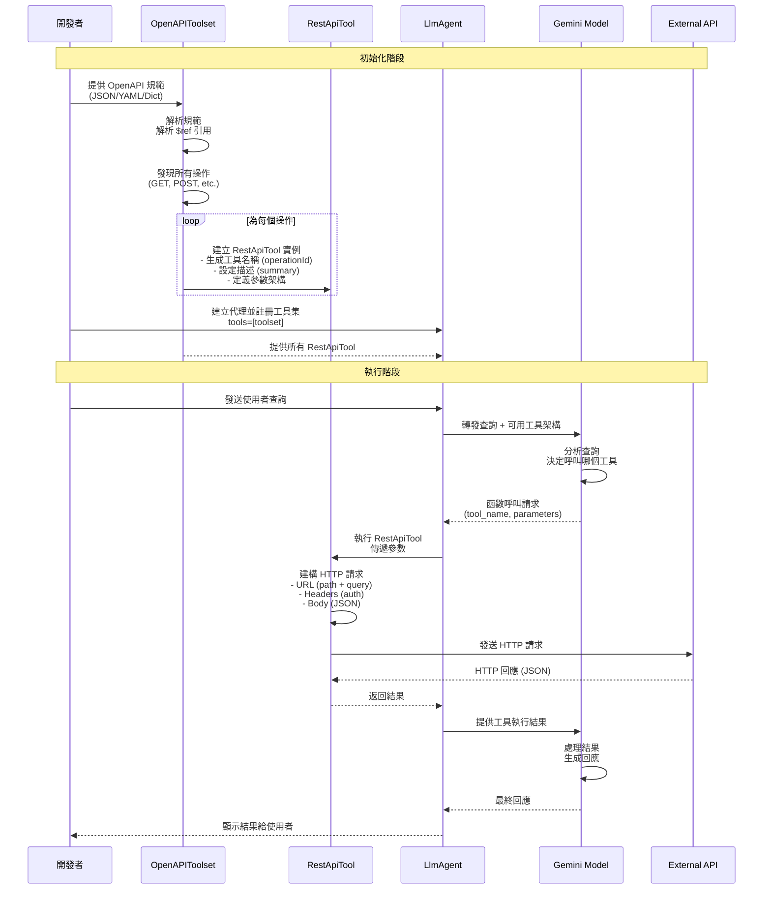

# 使用 OpenAPI 整合 REST API

> 🔔 `更新日期：2026-01-23`
>
> 🔗 `資料來源`：https://google.github.io/adk-docs/tools-custom/openapi-tools/

[`ADK 支援`: `Python v0.1.0`]

ADK 透過從 [OpenAPI 規範 (v3.x)](https://swagger.io/specification/) 自動生成可呼叫的工具，簡化了與外部 REST API 的互動。這消除了為每個 API 端點手動定義單個函數工具的需求。

> [!TIP] 核心優勢
    使用 `OpenAPIToolset` 從現有的 API 文件（OpenAPI 規範）立即建立代理工具（`RestApiTool`），使代理能夠無縫呼叫您的網路服務。

## 📋 快速參考

### 核心概念

| 項目 | 說明 |
|------|------|
| **目的** | 將現有的 REST API 快速整合到 ADK 代理中 |
| **輸入** | OpenAPI 3.x 規範（JSON/YAML） |
| **自動化** | 自動為每個 API 操作生成可呼叫工具 |
| **免除** | 無需手動為每個端點編寫函數工具 |
| **支援** | 路徑/查詢/標頭參數、請求主體、身分驗證 |

### 主要優勢

- ✅ **快速整合**：從 OpenAPI 規範自動生成所有工具
- ✅ **標準化**：遵循 OpenAPI 3.x 標準，相容性高
- ✅ **自動架構**：根據規範自動生成 `FunctionDeclaration`
- ✅ **內建驗證**：支援 API Key、OAuth 等身分驗證機制
- ✅ **完整支援**：處理各種 HTTP 方法和參數類型

### 適用場景

- ✓ 需要整合現有的 REST API（已有 OpenAPI 規範）
- ✓ API 端點數量多，手動定義工具耗時
- ✓ 希望自動同步 API 變更（更新規範即可）
- ✓ 需要快速建立 API 互動原型

## 關鍵組件

* **`OpenAPIToolset`**：這是您將使用的主要類別。您使用 OpenAPI 規範對其進行初始化，它負責解析和生成工具。
* **`RestApiTool`**：此類別代表單個可呼叫的 API 操作（例如 `GET /pets/{petId}` 或 `POST /pets`）。`OpenAPIToolset` 為規範中定義的每個操作建立一個 `RestApiTool` 實例。

### 組件比較表

| 組件 | 職責 | 輸入 | 輸出 |
|------|------|------|------|
| **OpenAPIToolset** | 解析 OpenAPI 規範並生成工具 | OpenAPI 規範（JSON/YAML/Dict） | 多個 `RestApiTool` 實例 |
| **RestApiTool** | 執行單一 API 操作 | LLM 提供的參數 | HTTP API 回應（JSON） |

## 運作方式

當您使用 `OpenAPIToolset` 時，過程涉及以下主要步驟：

1. **初始化與解析 (Initialization & Parsing)**：
    * 您可以將 OpenAPI 規範以 Python 字典、JSON 字串或 YAML 字串的形式提供給 `OpenAPIToolset`。
    * 工具集內部會解析規範，解析任何內部引用 (`$ref`) 以了解完整的 API 結構。

2. **操作發現 (Operation Discovery)**：
    * 它會識別規範中 `paths` 物件內定義的所有有效 API 操作（例如 `GET`、`POST`、`PUT`、`DELETE`）。

3. **工具生成 (Tool Generation)**：
    * 對於每個發現的操作，`OpenAPIToolset` 會自動建立對應的 `RestApiTool` 實例。
    * **工具名稱 (Tool Name)**：衍生自規範中的 `operationId`（轉換為 `snake_case`，最多 60 個字元）。如果缺少 `operationId`，則根據方法和路徑生成名稱。
    * **工具描述 (Tool Description)**：使用操作中的 `summary` 或 `description` 提供給 LLM。
    * **API 詳細資訊 (API Details)**：內部存儲所需的 HTTP 方法、路徑、伺服器基礎 URL、參數（路徑、查詢、標頭、cookie）和請求主體架構。

4. **`RestApiTool` 功能**：每個生成的 `RestApiTool`：
    * **架構生成 (Schema Generation)**：根據操作的參數和請求主體動態建立 `FunctionDeclaration`。此架構告訴 LLM 如何呼叫工具（預期哪些參數）。
    * **執行 (Execution)**：當被 LLM 呼叫時，它使用 LLM 提供的參數和來自 OpenAPI 規範的詳細資訊建構正確的 HTTP 請求（URL、標頭、查詢參數、主體）。它處理身分驗證（如果已配置）並使用 `requests` 函式庫執行 API 呼叫。
    * **回應處理 (Response Handling)**：將 API 回應（通常是 JSON）返回給代理流程。

5. **身分驗證 (Authentication)**：您可以在初始化 `OpenAPIToolset` 時配置全域身分驗證（例如 API 金鑰或 OAuth - 詳見 [身分驗證](./authentication.md)）。此身分驗證配置會自動套用到所有生成的 `RestApiTool` 實例。

### 完整流程時序圖



## 使用工作流程

按照以下步驟將 OpenAPI 規範整合到您的代理中：

### 整合步驟總覽

| 步驟 | 動作 | 關鍵參數/方法 | 說明 |
|:----:|------|--------------|------|
| 1️⃣ | **獲取規範** | `.json`, `.yaml`, URL | 取得 OpenAPI 規範文件 |
| 2️⃣ | **實例化工具集** | `OpenAPIToolset()`<br/>`spec_str`/`spec_dict`<br/>`spec_str_type`<br/>`auth_scheme`<br/>`auth_credential` | 建立工具集並配置身分驗證 |
| 3️⃣ | **新增至代理** | `LlmAgent(tools=[toolset])` | 註冊所有生成的工具 |
| 4️⃣ | **指導代理** | `instruction` | 告知代理可用的 API 功能 |
| 5️⃣ | **執行代理** | `Runner.run_async()` | 讓 LLM 自動呼叫工具 |

### 詳細步驟

1. **獲取規範**：獲取您的 OpenAPI 規範文件（例如，從 `.json` 或 `.yaml` 文件載入，從 URL 抓取）。
2. **實例化工具集**：建立 `OpenAPIToolset` 實例，傳遞規範內容和類型（`spec_str`/`spec_dict`，`spec_str_type`）。如果 API 需要，請提供身分驗證詳細資訊（`auth_scheme`，`auth_credential`）。

    ```python
    from google.adk.tools.openapi_tool.openapi_spec_parser.openapi_toolset import OpenAPIToolset

    # 使用 JSON 字串的範例
    openapi_spec_json = '...' # 您的 OpenAPI JSON 字串
    toolset = OpenAPIToolset(spec_str=openapi_spec_json, spec_str_type="json")

    # 使用字典的範例
    # openapi_spec_dict = {...} # 您作為字典的 OpenAPI 規範
    # toolset = OpenAPIToolset(spec_dict=openapi_spec_dict)
    ```

3. **新增至代理**：將獲取的工具包含在您的 `LlmAgent` 的 `tools` 列表中。

    ```python
    from google.adk.agents import LlmAgent

    my_agent = LlmAgent(
        name="api_interacting_agent",
        model="gemini-2.0-flash", # 或您偏好的模型
        tools=[toolset], # 傳遞工具集
        # ... 其他代理配置 ...
    )
    ```

4. **指導代理**：更新代理的指令，告知其新的 API 功能以及它可以使用的工具名稱（例如 `list_pets`、`create_pet`）。從規範生成的工具描述也將幫助 LLM。
5. **執行代理**：使用 `Runner` 執行您的代理。當 LLM 確定需要呼叫其中一個 API 時，它將生成一個針對適當 `RestApiTool` 的函數呼叫，然後該工具將自動處理 HTTP 請求。

## 範例

此範例演示了從簡單的 Pet Store OpenAPI 規範（使用 `httpbin.org` 進行模擬回應）生成工具，並透過代理與其進行互動。

> [!TIP] 程式碼範例：Pet Store API

```python
# ===================================================================
# OpenAPI 工具範例：寵物商店 API 整合
# ===================================================================
# 此範例展示如何使用 OpenAPIToolset 從 OpenAPI 規範自動生成工具，
# 並透過 ADK 代理與 REST API 進行互動。
# ===================================================================

import asyncio
import uuid  # 用於生成唯一的 session ID
from dotenv import load_dotenv

from google.adk.agents import LlmAgent
from google.adk.runners import Runner
from google.adk.sessions import InMemorySessionService
from google.genai import types

# --- 導入 OpenAPI 工具 ---
from google.adk.tools.openapi_tool.openapi_spec_parser.openapi_toolset import OpenAPIToolset

# --- 載入環境變數 ---
# 如果 ADK 工具需要環境變數（例如 API 金鑰），請在同目錄建立 .env 檔案
load_dotenv()

# --- 常數定義 ---
APP_NAME_OPENAPI = "openapi_petstore_app"
USER_ID_OPENAPI = "user_openapi_1"
SESSION_ID_OPENAPI = f"session_openapi_{uuid.uuid4()}"  # 生成唯一的 session ID
AGENT_NAME_OPENAPI = "petstore_manager_agent"
GEMINI_MODEL = "gemini-2.0-flash"

# --- OpenAPI 規範範例（JSON 字串格式）---
# 這是一個基本的寵物商店 API 範例，使用 httpbin.org 作為模擬伺服器
# httpbin.org 會回傳請求的參數，方便測試與驗證
openapi_spec_string = """
{
    "openapi": "3.0.0",
    "info": {
        "title": "簡易寵物商店 API（模擬）",
        "version": "1.0.1",
        "description": "一個用於管理商店寵物的 API，回應採用 httpbin 模擬。"
    },
    "servers": [
        {
            "url": "https://httpbin.org",
            "description": "模擬伺服器（httpbin.org）"
        }
    ],
    "paths": {
        "/get": {
            "get": {
                "summary": "列出所有寵物（模擬）",
                "operationId": "listPets",
                "description": "模擬回傳寵物清單。使用 httpbin 的 /get 端點回傳查詢參數。",
                "parameters": [
                    {
                        "name": "limit",
                        "in": "query",
                        "description": "回傳的寵物數量上限",
                        "required": false,
                        "schema": { "type": "integer", "format": "int32" }
                    },
                    {
                         "name": "status",
                         "in": "query",
                         "description": "依狀態篩選寵物",
                         "required": false,
                         "schema": { "type": "string", "enum": ["available", "pending", "sold"] }
                    }
                ],
                "responses": {
                    "200": {
                        "description": "寵物清單（回傳查詢參數）。",
                        "content": { "application/json": { "schema": { "type": "object" } } }
                    }
                }
            }
        },
        "/post": {
            "post": {
                "summary": "建立寵物（模擬）",
                "operationId": "createPet",
                "description": "模擬新增寵物。使用 httpbin 的 /post 端點回傳請求主體。",
                "requestBody": {
                    "description": "要新增的寵物物件",
                    "required": true,
                    "content": {
                        "application/json": {
                            "schema": {
                                "type": "object",
                                "required": ["name"],
                                "properties": {
                                    "name": {"type": "string", "description": "寵物名稱"},
                                    "tag": {"type": "string", "description": "寵物標籤（選填）"}
                                }
                            }
                        }
                    }
                },
                "responses": {
                    "201": {
                        "description": "寵物建立成功（回傳請求主體）。",
                        "content": { "application/json": { "schema": { "type": "object" } } }
                    }
                }
            }
        },
        "/get?petId={petId}": {
            "get": {
                "summary": "查詢特定寵物資訊（模擬）",
                "operationId": "showPetById",
                "description": "模擬回傳指定寵物 ID 的資訊。使用 httpbin 的 /get 端點。",
                "parameters": [
                    {
                        "name": "petId",
                        "in": "path",
                        "description": "實際上會以查詢參數傳遞給 httpbin /get",
                        "required": true,
                        "schema": { "type": "integer", "format": "int64" }
                    }
                ],
                "responses": {
                    "200": {
                        "description": "寵物資訊（回傳查詢參數）",
                        "content": { "application/json": { "schema": { "type": "object" } } }
                    },
                    "404": { "description": "找不到寵物（模擬）" }
                }
            }
        }
    }
}
"""

# --- 建立 OpenAPIToolset ---
# OpenAPIToolset 會自動解析 OpenAPI 規範並為每個操作建立對應的 RestApiTool
petstore_toolset = OpenAPIToolset(
    spec_str=openapi_spec_string,  # OpenAPI 規範（JSON 字串）
    spec_str_type='json',  # 規範格式類型（'json' 或 'yaml'）
    # httpbin.org 不需要身分驗證，因此不需要 auth_scheme 和 auth_credential
)

# --- 代理定義 ---
# 建立一個 LLM 代理，使用從 OpenAPI 規範生成的工具
root_agent = LlmAgent(
    name=AGENT_NAME_OPENAPI,
    model=GEMINI_MODEL,
    tools=[petstore_toolset],  # 傳遞工具集，將自動註冊所有生成的 RestApiTool
    instruction="""你是一位寵物商店助理，透過 API 管理寵物。
    請使用可用的工具來完成使用者的請求。
    當建立寵物時，請確認 API 回傳的細節。
    當列出寵物時，請說明所使用的篩選條件（如 limit 或 status）。
    當查詢特定寵物 ID 時，請說明你查詢的 ID。
    """,
    description="使用從 OpenAPI 規範自動生成的工具來管理寵物商店。"
)

# --- Session 和 Runner 設定 ---
async def setup_session_and_runner():
    """
    設定 session 服務和 runner

    建立記憶體內 session 服務並初始化 runner，
    用於管理代理的執行狀態和對話歷史。

    Returns:
        Runner: 配置完成的 runner 實例
    """
    session_service_openapi = InMemorySessionService()
    runner_openapi = Runner(
        agent=root_agent,
        app_name=APP_NAME_OPENAPI,
        session_service=session_service_openapi,
    )
    # 建立一個新的 session 來儲存對話歷史
    await session_service_openapi.create_session(
        app_name=APP_NAME_OPENAPI,
        user_id=USER_ID_OPENAPI,
        session_id=SESSION_ID_OPENAPI,
    )
    return runner_openapi

# --- 代理互動函數 ---
async def call_openapi_agent_async(query, runner_openapi):
    """
    非同步呼叫 OpenAPI 代理

    此函數展示如何與代理互動，並追蹤執行過程中的事件：
    - 函數呼叫事件：代理決定使用哪個工具及參數
    - 函數回應事件：工具執行後的回應
    - 最終回應事件：代理給使用者的最終答覆

    Args:
        query (str): 使用者的查詢內容
        runner_openapi (Runner): Runner 實例
    """
    print("\n--- Running OpenAPI Pet Store Agent ---")
    print(f"Query: {query}")

    # 將使用者查詢包裝成 Content 物件
    content = types.Content(role='user', parts=[types.Part(text=query)])
    final_response_text = "代理尚未提供最終文字回應。"

    try:
        # 非同步執行代理，逐步處理事件流
        async for event in runner_openapi.run_async(
                user_id=USER_ID_OPENAPI,
                session_id=SESSION_ID_OPENAPI,
                new_message=content
        ):
            # 選用：詳細事件日誌（除錯用）
            # print(f"  除錯事件: Author={event.author}, Type={'Final' if event.is_final_response() else 'Intermediate'}, Content={str(event.content)[:100]}...")

            # 檢查是否有函數呼叫事件（代理決定使用工具）
            if event.get_function_calls():
                    call = event.get_function_calls()[0]
                    print(f"  代理動作: 呼叫函數 '{call.name}'，參數 {call.args}")

            # 檢查是否有函數回應事件（工具執行完成）
            elif event.get_function_responses():
                    response = event.get_function_responses()[0]
                    print(f"  代理動作: 收到 '{response.name}' 的回應")
                    # 選用：顯示工具回應詳細內容
                    # print(f"  工具回應片段: {str(response.response)[:200]}...")

            # 檢查是否為最終回應（代理給使用者的答覆）
            elif event.is_final_response() and event.content and event.content.parts:
                    # 擷取最終文字回應
                    final_response_text = event.content.parts[0].text.strip()

        print(f"代理最終回應: {final_response_text}")

    except Exception as e:
        print(f"代理執行過程發生錯誤: {e}")
        import traceback
        traceback.print_exc()  # 印出完整錯誤追蹤資訊
    print("-" * 30)
```