# 使用 Agent Starter Pack 部署至 Agent Engine

> 🔔 `更新日期：2026-01-27`
>
> 🔗 `資料來源`： https://google.github.io/adk-docs/deploy/agent-engine/asp/

此部署程序描述了如何使用 [Agent Starter Pack](https://github.com/GoogleCloudPlatform/agent-starter-pack) (ASP) 和 ADK 命令列介面 (CLI) 工具執行部署。使用 ASP 部署到 Agent Engine 執行階段是一條加速路徑，您應該僅將其用於 _*開發和測試*_。ASP 工具配置的 Google Cloud 資源並非執行 ADK 代理程式工作流所嚴格必需的，在生產部署中使用之前，您應該徹底審查該配置。

本部署指南使用 ASP 工具將專案範本套用到現有專案、添加部署成品，並為您的代理程式專案做好部署準備。這些說明展示了如何使用 ASP 為部署 ADK 專案所需的服務配置 Google Cloud 專案，如下所示：

- [先決條件](#先決條件)：設定 Google Cloud 帳戶、專案並安裝所需的軟體。
- [準備您的 ADK 專案](#準備您的-adk-專案)：修改現有的 ADK 專案文件以準備部署。
- [連接到您的 Google Cloud 專案](#連接到您的-google-cloud-專案)：將您的開發環境連接到 Google Cloud 和您的 Google Cloud 專案。
- [部署您的 ADK 專案](#部署您的-adk-專案)：在您的 Google Cloud 專案中配置所需服務並上傳您的 ADK 專案程式碼。

有關測試已部署代理程式的信息，請參閱 [測試已部署的代理程式](test.md)。有關使用 Agent Starter Pack 及其命令列工具的更多信息，請參閱 [CLI 參考](https://googlecloudplatform.github.io/agent-starter-pack/cli/enhance.html) 和 [開發指南](https://googlecloudplatform.github.io/agent-starter-pack/guide/development-guide.html)。

### 先決條件

您需要配置以下資源才能使用此部署路徑：

- **Google Cloud 帳戶**：具有以下項目的管理員訪問權限：
  - **Google Cloud 專案**：一個已[啟用計費](https://cloud.google.com/billing/docs/how-to/modify-project)的空 Google Cloud 專案。有關創建專案的信息，請參閱 [創建和管理專案](https://cloud.google.com/resource-manager/docs/creating-managing-projects)。
- **Python 環境**：[ASP 專案](https://googlecloudplatform.github.io/agent-starter-pack/guide/getting-started.html)支援的 Python 版本。
- **uv 工具**：管理 Python 開發環境並運行 ASP 工具。有關安裝詳細信息，請參閱 [安裝 uv](https://docs.astral.sh/uv/getting-started/installation/)。
- **Google Cloud CLI 工具**：gcloud 命令列介面。有關安裝詳細信息，請參閱 [Google Cloud 命令列介面](https://cloud.google.com/sdk/docs/install)。
- **Make 工具**：構建自動化工具。此工具是大多數基於 Unix 系統的一部分，有關安裝詳細信息，請參閱 [Make 工具](https://www.gnu.org/software/make/) 文件。

### 準備您的 ADK 專案

當您將 ADK 專案部署到 Agent Engine 時，您需要一些額外的文件來支持部署操作。以下 ASP 命令會備份您的專案，然後為部署目的向您的專案添加文件。

這些說明假設您有一個現有的 ADK 專案正在進行部署修改。如果您沒有 ADK 專案，或者想使用測試專案，請完成 Python [快速入門](../../get-started/python.md) 指南，該指南會創建一個 [multi_tool_agent](https://github.com/google/adk-docs/tree/main/examples/python/snippets/get-started/multi_tool_agent) 專案。以下說明以 `multi_tool_agent` 專案為例。

要準備您的 ADK 專案以部署到 Agent Engine：

1.  在開發環境的終端機視窗中，導航到包含代理程式資料夾的**父目錄**。例如，如果您的專案結構是：

    ```text
    your-project-directory/
    ├── multi_tool_agent/
    │   ├── __init__.py
    │   ├── agent.py
    │   └── .env
    ```

    導航到 `your-project-directory/`

2.  運行 ASP `enhance` 命令以將部署所需的檔案添加到您的專案中，可參考 [`enhance` 命令詳細說明](#enhance-命令詳細說明-按功能分類)。

    ```shell
    # 使用 uvx 執行 agent-starter-pack 的 enhance 命令
    # --adk 表示針對 ADK 專案進行增強
    # -d agent_engine 指定部署目標為 agent_engine
    uvx agent-starter-pack enhance --adk -d agent_engine
    ```

3.  按照 ASP 工具的說明進行操作。通常情況下，您可以對所有問題接受預設答案。但是，對於 **GCP region**（GCP 區域）選項，請確保選擇 Agent Engine [支援的區域](https://docs.cloud.google.com/agent-builder/locations#supported-regions-agent-engine)之一。

成功完成此過程後，工具會顯示以下訊息：

```text
> Success! Your agent project is ready.
```

> [!TIP] "注意"
ASP 工具在運行時可能會顯示連接到 Google Cloud 的提醒，但在這個階段*不要求*連接。

有關 ASP 對您的 ADK 專案所做更改的更多資訊，請參閱 [您的 ADK 專案變更](#您的-adk-專案變更)。

### 連接到您的 Google Cloud 專案

在部署 ADK 專案之前，您必須連接到 Google Cloud 和您的專案。登錄您的 Google Cloud 帳戶後，您應該驗證您的部署目標專案是否可從您的帳戶中看到，並且它已被配置為您當前的專案。

要連接到 Google Cloud 並列出您的專案：

1.  在開發環境的終端機視窗中，登錄您的 Google Cloud 帳戶：

    ```shell
    # 登錄並取得應用程式預設憑證 (Application Default Credentials)
    gcloud auth application-default login
    ```

1.  使用 Google Cloud 專案 ID 設置您的目標專案：

    ```shell
    # 將當前 gcloud 配置的專案設置為您的專案 ID
    gcloud config set project your-project-id-xxxxx
    ```

1.  驗證您的 Google Cloud 目標專案已設置：

    ```shell
    # 獲取目前配置中的專案 ID 值以進行確認
    gcloud config get-value project
    ```

成功連接到 Google Cloud 並設置您的雲端專案 ID 後，您就可以準備將 ADK 專案檔案部署到 Agent Engine 了。

### 部署您的 ADK 專案

使用 ASP 工具時，您是分階段部署的。在第一階段，您運行一個 `make` 命令，該命令會配置在 Agent Engine 上運行 ADK 工作流所需的服務。在第二階段，該工具會將您的專案程式碼上傳到 Agent Engine 服務，並在託管環境中運行。

> [!WARNING] "重要"
*在執行這些步驟之前，請確保您的 Google Cloud 目標部署專案已設置為您當前的專案*。`make backend` 命令在執行部署時會使用您當前設置的 Google Cloud 專案。有關設置和檢查當前專案的信息，請參閱 [連接到您的 Google Cloud 專案](#連接到您的-google-cloud-專案)。

要將 ADK 專案部署到 Google Cloud 專案中的 Agent Engine：

1.  在終端機視窗中，確保您處於包含代理程式資料夾的父目錄（例如 `your-project-directory/`）。

2.  通過運行以下 ASP make 命令，將更新後的本地專案程式碼部署到 Google Cloud 開發環境：

    ```shell
    # 執行 Makefile 中的 backend 目標以開始部署流程
    make backend
    ```

一旦此過程成功完成，您應該能夠與運行在 Google Cloud Agent Engine 上的代理程式進行交互。有關測試已部署代理程式的詳細信息，請參閱 [測試已部署的代理程式](test.md)。

### 您的 ADK 專案變更

ASP 工具會向您的專案添加更多檔案以進行部署。下面的程序在修改現有專案檔案之前會對其進行備份。本指南使用 [multi_tool_agent](https://github.com/google/adk-docs/tree/main/examples/python/snippets/get-started/multi_tool_agent) 專案作為參考示例。原始專案開始時具有以下檔案結構：

```text
multi_tool_agent/
├─ __init__.py
├─ agent.py
└─ .env
```

運行 ASP enhance 命令添加 Agent Engine 部署資訊後，新結構如下：

```text
multi-tool-agent/
├─ app/                 # 核心應用程式程式碼
│   ├─ agent.py         # 主要代理程式邏輯
│   ├─ agent_engine_app.py # Agent Engine 應用程式邏輯
│   └─ utils/           # 工具函數和輔助程式
├─ .cloudbuild/         # Google Cloud Build 的 CI/CD 管線配置
├─ deployment/          # 基礎設施和部署腳本
├─ notebooks/           # 用於原型設計和評估的 Jupyter notebooks
├─ tests/               # 單元測試、整合測試和負載測試
├─ Makefile             # 常用命令的 Makefile
├─ GEMINI.md            # AI 輔助開發指南
└─ pyproject.toml       # 專案依賴項和配置
```
---
### `enhance` 命令詳細說明

#### 1. CLI 參數總覽（表格）

| 參數                     | 短參數    | 長參數                              | 型別 / 選項                                          | 說明                                         |
| ---------------------- | ------ | -------------------------------- | ------------------------------------------------ | ------------------------------------------ |
| 專案名稱                   | `-n`   | `--name`                         | TEXT                                             | 專案名稱，用於樣板變數（預設為當前目錄名稱）                     |
| 基底樣板                   | `-bt`  | `--base-template`                | TEXT                                             | 指定要套用的樣板；用於覆蓋 remote 樣板預設                  |
| Agent 目錄               | `-dir` | `--agent-directory`              | TEXT                                             | 指定 Agent 程式碼存放資料夾名稱                        |
| 部署目標                   | `-d`   | `--deployment-target`            | `agent_engine` / `cloud_run`                     | 要部署至哪種執行環境                                 |
| CI/CD Runner           |        | `--cicd-runner`                  | `google_cloud_build` / `github_actions` / `skip` | 自動化部署工具（或略過）                               |
| 最小專案                   | `-p`   | `--prototype`                    | flag                                             | 只產生最精簡的專案（無 CI/CD / Infra）                 |
| 加入資料 Ingestion         | `-i`   | `--include-data-ingestion`       | flag                                             | 是否建立資料引入流程（需要搭配 datastore）                 |
| 資料存放類型                 | `-ds`  | `--datastore`                    | `vertex_ai_search` / `vertex_ai_vector_search`   | 指定文件儲存/搜索方式                                |
| Session 類型             |        | `--session-type`                 | `in_memory` / `cloud_sql` / `agent_engine`       | 設定對話 Session 狀態儲存方式                        |
| Debug 模式               |        | `--debug`                        | flag                                             | 打開 debug logging                           |
| 自動確認                   | `-y`   | `--auto-approve` / `--yes`       | flag                                             | 跳過認證/確認提示                                  |
| GCP Region             |        | `--region`                       | TEXT                                             | 指定部署到哪個 GCP region                         |
| 跳過檢查                   | `-s`   | `--skip-checks`                  | flag                                             | 略過 GCP / Vertex AI prerequisite 驗證步驟       |
| Agent Garden           | `-ag`  | `--agent-garden`                 | flag                                             | 啟用 Agent Garden 自動化設定                      |
| Google API Key         | `-k`   | `--google-api-key` / `--api-key` | TEXT                                             | 使用 Google AI Studio API Key（不使用 Vertex AI） |
| Base Template Shortcut |        | `--adk`                          | flag                                             | 快速等同於 `--base-template adk_base`           |
| 幫助                     |        | `--help`                         | flag                                             | 顯示 CLI 幫助                                  |

#### 2. 參數決策圖（Mermaid）

```mermaid
flowchart TD
    start([開始])

    start --> A{"是否要快速 PoC / 本地試驗？"}
    A -->|Yes| PoC["使用 --prototype"]
    A -->|No| B

    PoC --> PoC_end([結束])

    B --> C{"是否包含資料 Ingestion / RAG？"}
    C -->|Yes| IncludeIngestion["加上 --include-data-ingestion"]
    C -->|No| D

    IncludeIngestion --> Datastore{"選擇資料儲存方式"}
    Datastore -->|Vector Search| Vec["--datastore vertex_ai_vector_search"]
    Datastore -->|Search| Search["--datastore vertex_ai_search"]
    Vec --> D
    Search --> D

    D --> E{"部署目標？"}
    E -->|Agent Engine| TargetAgent["--deployment-target agent_engine"]
    E -->|Cloud Run| TargetCloud["--deployment-target cloud_run"]

    TargetAgent --> F
    TargetCloud --> F

    F --> G{"是否要 CI/CD？"}
    G -->|GitHub| GH["--cicd-runner github_actions"]
    G -->|Cloud Build| GCB["--cicd-runner google_cloud_build"]
    G -->|Skip| SkipCI["--cicd-runner skip"]

    GH --> H
    GCB --> H
    SkipCI --> H

    H --> I{"Session 儲存方式？"}
    I -->|Cloud SQL| CloudSQL["--session-type cloud_sql"]
    I -->|In Memory| InMem["--session-type in_memory"]
    I -->|Agent Engine| AGEnt["--session-type agent_engine"]

    CloudSQL --> J
    InMem --> J
    AGEnt --> J

    J --> K{"是否要指定 GCP Region？"}
    K -->|Yes| Region["--region <region>"]
    K -->|No| NoRegion[不設定]

    Region --> L
    NoRegion --> L

    L --> M{"略過環境檢查？"}
    M -->|Yes| SkipChecks["--skip-checks"]
    M -->|No| NoSkipChecks

    SkipChecks --> N
    NoSkipChecks --> N

    N --> O{"是否自動同意？"}
    O -->|Yes| AutoYes["--auto-approve"]
    O -->|No| NoAuto

    AutoYes --> P
    NoAuto --> P

    P --> Q{"是否使用 API Key？"}
    Q -->|Yes| APIKey["--google-api-key <key>"]
    Q -->|No| NoAPI

    APIKey --> R
    NoAPI --> R

    R --> S{"是否啟用 Agent Garden？"}
    S -->|Yes| AG["--agent-garden"]
    S -->|No| NoAG

    AG --> End([結束])
    NoAG --> End([結束])
```


---
#### 3. FAQ / 使用情境與建議

##### 3.1 PoC / 快速實驗

如果僅想快速產出專案結構、測試 Agent 行為：

```
agent-starter-pack init \
  --prototype \
  --skip-checks
```

不包含：
* CI/CD
* Infra

> **適合本地開發、測試用途**。

##### 3.2 輸出 Production-ready Agent（含 CI/CD & Infra）

```
agent-starter-pack init \
  --name my-ai-agent \
  --deployment-target cloud_run \
  --cicd-runner github_actions \
  --include-data-ingestion \
  --datastore vertex_ai_vector_search \
  --session-type cloud_sql \
  --region asia-east1 \
  --auto-approve \
  --debug
```
> 此組合適合：
✔ Cloud Run 正式部署
✔ GitHub CI/CD 管線
✔ RAG 文件搜索
✔ Cloud SQL Session 管理

##### 3.3 Vertex AI Agent Engine 部署

若想使用 Vertex AI 的 fully managed Agent Engine Runtime（內建 scalability & observability）：

```
agent-starter-pack init \
  --name agent-engine-prod \
  --deployment-target agent_engine \
  --cicd-runner google_cloud_build \
  --session-type agent_engine \
  --auto-approve
```

> Vertex AI Agent Engine 是 Vertex AI 旗下的托管 agent 平台，可簡化部署＆運維。

---

##### 3.4 API Key 模式（不走 Vertex AI）

若在專案中使用 Google AI Studio 或其他 API Key 基礎模型（不需要 Vertex AI 身份驗證）：

```
agent-starter-pack init \
  --google-api-key YOUR_KEY \
  --name my-api-agent
```

> 此模式會用 `.env` 產生 API Key placeholder。

#### 4. 參數相依性與注意事項

| 條件                 | 關係                              |
| ------------------ | ------------------------------- |
| `--datastore`      | 必須搭配 `--include-data-ingestion` |
| `--prototype`      | 會跳過 CI/CD + Infra               |
| `--google-api-key` | 代表不使用 Vertex AI                 |
| `--adk`            | 等同 `--base-template adk_base`   |


#### 5. 相關背景（補充）

Agent Starter Pack 是一套用於快速建立 **生產等級 GenAI Agents** 的工具套件，提供：

- ✔ 預建 agent 模板
- ✔ 部署（Cloud Run / Vertex AI Agent Engine）選項
- ✔ CI/CD 與 observability 規劃
- ✔ 可擴充資料 Ingestion / RAG Pipeline support

---
有關更多資訊，請參閱更新後的 ADK 專案資料夾中的 _README.md_ 檔案。有關使用 Agent Starter Pack 的更多資訊，請參閱 [開發指南](https://googlecloudplatform.github.io/agent-starter-pack/guide/development-guide.html)。

## 測試已部署的代理程式

完成 ADK 代理程式部署後，您應該在其新的託管環境中測試工作流。有關測試部署到 Agent Engine 的 ADK 代理程式的更多資訊，請參閱 [在 Agent Engine 中測試已部署的代理程式](test.md)。
