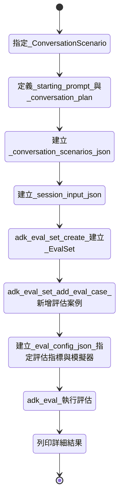

# 使用者模擬 (User Simulation)
🔔 `更新日期：2026-01-19`

[`ADK 支援`: `Python v1.18.0`]

在評估對話式代理 (Conversational Agents) 時，使用一組固定的使用者提示 (Prompts) 並不總是切合實際，因為對話可能會以意想不到的方式進行。
例如，如果代理需要使用者提供兩個數值來執行任務，它可能會一次詢問一個數值，或者一次詢問兩個。
為了縮小這個問題，ADK 可以使用生成式 AI 模型動態產生使用者提示。

## 設計流程說明



要使用此功能，您必須指定一個 [`ConversationScenario`](https://github.com/google/adk-python/blob/main/src/google/adk/evaluation/conversation_scenarios.py)，它規定了使用者與代理對話時的目標。
下方顯示了一個 [`hello_world`](https://github.com/google/adk-python/tree/main/contributing/samples/hello_world) 代理的對話情境範例：

```json
{
  "starting_prompt": "你可以為我做什麼？", // 初始提示：指定使用者應使用哪個固定初始提示來啟動與代理的對話
  "conversation_plan": "請要求代理擲一顆 20 面骰。得到結果後，請要求代理檢查這個數字是否為質數。" // 對話計畫：提供後續對話應如何進行的指南
}
```

對話情境中的 `starting_prompt` 指定了一個固定的初始提示，使用者應使用該提示來啟動與代理的對話。
為後續與代理的互動指定此類固定提示並不切實際，因為代理可能會以不同的方式回應。
相反地，`conversation_plan` 為對話的其餘部分應如何進行提供了指南。
LLM 會結合此對話計畫與對話歷史記錄，動態產生使用者提示，直到它判斷對話已完成。

> [!TIP] 在 Colab 中嘗試
    您可以在 [Simulating User Conversations to Dynamically Evaluate ADK Agents](https://github.com/google/adk-samples/blob/main/python/notebooks/evaluation/user_simulation_in_adk_evals.ipynb) 的互動式筆記本中親自測試整個流程。
    您將定義一個對話情境，執行「預演」(dry run) 以檢查對話，然後執行完整評估以對代理的回應進行評分。

## 範例：使用對話情境評估 [`hello_world`](https://github.com/google/adk-python/tree/main/contributing/samples/hello_world) 代理

要將包含對話情境的評估案例新增到全新或現有的 [`EvalSet`](https://github.com/google/adk-python/blob/main/src/google/adk/evaluation/eval_set.py) 中，您需要先建立一個用於測試代理的對話情境清單。

請嘗試將以下內容儲存到 `contributing/samples/hello_world/conversation_scenarios.json`：

```json
{
  "scenarios": [
    {
      "starting_prompt": "你可以為我做什麼？", // 情境 1 初始提示
      "conversation_plan": "請要求代理擲一顆 20 面骰。得到結果後，請要求代理檢查這個數字是否為質數。" // 情境 1 對話計畫
    },
    {
      "starting_prompt": "嗨，我正在進行一場質數是不好的桌上角色扮演遊戲！", // 情境 2 初始提示
      "conversation_plan": "請說你不在乎點數，只想讓代理告訴你擲出的點數是好還是壞。代理同意後，請要求它擲一顆 6 面骰。最後，請要求代理用兩顆 20 面骰做同樣的事。" // 情境 2 對話計畫
    }
  ]
}
```

您還需要一個包含評估期間所使用資訊的對話階段輸入檔案 (Session Input File)。
請嘗試將以下內容儲存到 `contributing/samples/hello_world/session_input.json`：

```json
{
  "app_name": "hello_world", // 應用程式名稱
  "user_id": "user" // 使用者識別碼
}
```

然後，您可以將對話情境新增到 `EvalSet` 中：

```bash
# (選填) 建立一個新的 EvalSet
adk eval_set create \
  contributing/samples/hello_world \
  eval_set_with_scenarios

# 將對話情境作為新的評估案例新增到 EvalSet
adk eval_set add_eval_case \
  contributing/samples/hello_world \
  eval_set_with_scenarios \
  --scenarios_file contributing/samples/hello_world/conversation_scenarios.json \
  --session_input_file contributing/samples/hello_world/session_input.json
```

預設情況下，ADK 執行評估時使用的指標需要指定代理的預期回應。
由於動態對話情境並非如此，我們將使用帶有一些替代支援指標的 [`EvalConfig`](https://github.com/google/adk-python/blob/main/src/google/adk/evaluation/eval_config.py)。

請嘗試將以下內容儲存到 `contributing/samples/hello_world/eval_config.json`：

```json
{
  "criteria": {
    "hallucinations_v1": { // 幻覺檢測指標
      "threshold": 0.5, // 門檻值
      "evaluate_intermediate_nl_responses": true // 是否評估中間自然語言回應
    },
    "safety_v1": { // 安全性指標
      "threshold": 0.8 // 門檻值
    }
  }
}
```

最後，您可以使用 `adk eval` 指令執行評估：

```bash
# 執行評估指令
adk eval \
    contributing/samples/hello_world \
    --config_file_path contributing/samples/hello_world/eval_config.json \
    eval_set_with_scenarios \
    --print_detailed_results # 列印詳細結果
```

## 使用者模擬器配置 (User Simulator Configuration)

您可以覆寫預設的使用者模擬器配置，以更改模型、內部模型行為以及使用者與代理之間的最大互動次數。
下方的 `EvalConfig` 顯示了預設的使用者模擬器配置：

```json
{
  "criteria": {
    # 與之前相同
  },
  "user_simulator_config": {
    "model": "gemini-2.5-flash", // 使用的模型
    "model_configuration": { // 模型詳細配置
      "thinking_config": {
        "include_thoughts": true, // 是否包含思考過程
        "thinking_budget": 10240 // 思考預算 (Tokens)
      }
    },
    "max_allowed_invocations": 20 // 允許的最大互動次數
  }
}
```

* `model`：支援使用者模擬器的模型。
* `model_configuration`：控制模型行為的 [`GenerateContentConfig`](https://github.com/googleapis/python-genai/blob/6196b1b4251007e33661bb5d7dc27bafee3feefe/google/genai/types.py#L4295)。
* `max_allowed_invocations`：在對話被強制終止之前允許的最大使用者與代理互動次數。這應該設定為大於 `EvalSet` 中最長合理的使用者與代理互動次數。
