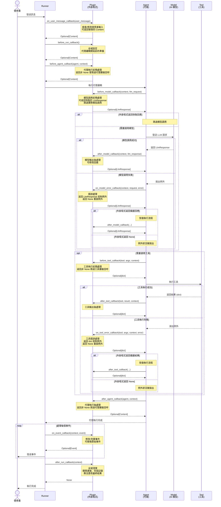

# 外掛程式 (Plugins)

> 🔔 `更新日期：2026-03-09`
>
> 🔗 `資料來源`：https://google.github.io/adk-docs/plugins/

[`ADK 支援`: `Python v1.7.0`]

在代理開發套件 (ADK) 中，外掛程式 (Plugin) 是一個自定義程式碼模組，可以透過回呼掛鉤 (callback hooks) 在代理工作流生命週期的各個階段執行。您可以使用外掛程式來實現適用於整個代理工作流的功能。外掛程式的一些典型應用如下：

- **記錄與追蹤 (Logging and tracing)**：建立代理、工具和生成式 AI 模型活動的詳細記錄，以便進行調錯和效能分析。
- **策略強制執行 (Policy enforcement)**：實作安全防護欄，例如檢查使用者是否獲授權使用特定工具，並在沒有權限時阻止其執行的函數。
- **監控與指標 (Monitoring and metrics)**：收集並匯出權杖 (token) 使用量、執行時間和調用次數等指標到監控系統，例如 Prometheus 或 [Google Cloud Observability](https://cloud.google.com/stackdriver/docs) (原名 Stackdriver)。
- **回應快取 (Response caching)**：檢查請求是否曾被發出，以便返回快取的回應，從而跳過昂貴或耗時的 AI 模型或工具調用。
- **請求或回應修改 (Request or response modification)**：動態地為 AI 模型提示 (prompts) 增加資訊，或標準化工具輸出回應。

> [!TIP] 將外掛程式用於安全功能
在實作安全防護欄和策略時，使用 ADK 外掛程式比使用回呼 (Callbacks) 具有更好的模組化和靈活性。如需更多詳細資訊，請參閱 [安全防護欄的回呼與外掛程式](../safety-and-security/index.md#安全護欄的回呼與插件)。

> [!TIP] ADK 整合
如需 ADK 的預建外掛程式和其他整合清單，請參閱 [工具與整合](../tools-and-integrations/index.md)。

## 外掛程式是如何運作的？

ADK 外掛程式繼承自 `BasePlugin` 類別，並包含一個或多個 `callback` 方法，指示外掛程式應在代理生命週期的哪個階段執行。您可以透過在代理的 `Runner` 類別中註冊外掛程式來將其整合到代理中。如需關於如何在代理應用程式中觸發外掛程式及其觸發位置的更多資訊，請參閱 [外掛程式回呼掛鉤](#外掛程式回呼掛鉤)。

外掛程式功能建立在 [回呼 (Callbacks)](../callbacks/index.md) 之上，這是 ADK 可擴展架構的關鍵設計元素。典型的代理回呼是針對 *單一代理、單一工具* 進行 *特定任務* 的配置，而外掛程式則是在 `Runner` 上註冊 *一次*，其回呼會 *全域地* 應用於該運行器管理的每個代理、工具和 LLM 調用。外掛程式讓您可以將相關的回呼函數封裝在一起，以便在整個工作流中使用。這使得外掛程式成為實作橫跨整個代理應用程式功能的理想解決方案。

## 預建外掛程式

ADK 包含多個外掛程式，您可以立即將其加入到您的代理工作流中：

- [**反思與重試工具 (Reflect and Retry Tools)**](../tools-and-integrations/integrations/reflect-and-retry.md)：追蹤工具故障並智慧地重試工具請求。
- [**BigQuery 分析 (BigQuery Analytics)**](../tools-and-integrations/integrations/bigquery-agent-analytics.md)：使用 BigQuery 啟用代理記錄與分析。
- [**內容過濾器 (Context Filter)**](https://github.com/google/adk-python/blob/main/src/google/adk/plugins/context_filter_plugin.py)：過濾生成式 AI 內容以減少其大小。
- [**全域指令 (Global Instruction)**](https://github.com/google/adk-python/blob/main/src/google/adk/plugins/global_instruction_plugin.py)：在應用程式層級提供全域指令功能的外掛程式。
- [**將檔案儲存為成品 (Save Files as Artifacts)**](https://github.com/google/adk-python/blob/main/src/google/adk/plugins/save_files_as_artifacts_plugin.py)：將使用者訊息中包含的檔案儲存為成品 (Artifacts)。
- [**記錄 (Logging)**](https://github.com/google/adk-python/blame/main/src/google/adk/plugins/logging_plugin.py)：在每個代理工作流回呼點記錄重要資訊。

## 定義與註冊外掛程式

本節說明如何定義外掛程式類別，並將其註冊為代理工作流的一部分。如需完整的程式碼範例，請參閱儲存庫中的 [外掛程式基礎 (Plugin Basic)](https://github.com/google/adk-python/tree/main/contributing/samples/plugin_basic)。

### 建立外掛程式類別

首先繼承 `BasePlugin` 類別並新增一個或多個 `callback` 方法，如下列程式碼範例所示：

<details>
<summary>範例說明</summary>

> Python

`count_plugin.py`
```py
from google.adk.agents.base_agent import BaseAgent
from google.adk.agents.callback_context import CallbackContext
from google.adk.models.llm_request import LlmRequest
from google.adk.plugins.base_plugin import BasePlugin

class CountInvocationPlugin(BasePlugin):
    """一個計算代理和工具調用次數的自定義外掛程式。"""

    def __init__(self) -> None:
        """使用計數器初始化外掛程式。"""
        super().__init__(name="count_invocation")
        self.agent_count: int = 0
        self.tool_count: int = 0
        self.llm_request_count: int = 0

    async def before_agent_callback(
        self, *, agent: BaseAgent, callback_context: CallbackContext
    ) -> None:
        """計算代理執行次數。"""
        self.agent_count += 1
        print(f"[Plugin] 代理執行次數: {self.agent_count}")

    async def before_model_callback(
        self, *, callback_context: CallbackContext, llm_request: LlmRequest
    ) -> None:
        """計算 LLM 請求次數。"""
        self.llm_request_count += 1
        print(f"[Plugin] LLM 請求次數: {self.llm_request_count}")
```

> typescript

`count_plugin.ts`
```typescript
import { BaseAgent, BasePlugin, Context } from "@google/adk";
import type { LlmRequest, LlmResponse } from "@google/adk";
import type { Content } from "@google/genai";

/**
 * 一個計算代理和工具調用次數的自定義外掛程式。
 */
export class CountInvocationPlugin extends BasePlugin {
    public agentCount = 0;
    public toolCount = 0;
    public llmRequestCount = 0;

    constructor() {
        super("count_invocation");
    }

    /**
     * 計算代理執行次數。
     */
    async beforeAgentCallback(
        agent: BaseAgent,
        context: Context
    ): Promise<Content | undefined> {
        this.agentCount++;
        console.log(`[Plugin] 代理執行次數: ${this.agentCount}`);
        return undefined;
    }

    /**
     * 計算 LLM 請求次數。
     */
    async beforeModelCallback(
        context: Context,
        llmRequest: LlmRequest
    ): Promise<LlmResponse | undefined> {
        this.llmRequestCount++;
        console.log(`[Plugin] LLM 請求次數: ${this.llmRequestCount}`);
        return undefined;
    }
}
```

> java

`CountInvocationPlugin.java`
```java
import com.google.adk.agents.BaseAgent;
import com.google.adk.agents.CallbackContext;
import com.google.adk.models.LlmRequest;
import com.google.adk.models.LlmResponse;
import com.google.adk.plugins.BasePlugin;
import com.google.genai.types.Content;
import io.reactivex.rxjava3.core.Maybe;

/** 一個計算代理和工具調用次數的自定義外掛程式。 */
public class CountInvocationPlugin extends BasePlugin {
  public int agentCount = 0;
  public int toolCount = 0;
  public int llmRequestCount = 0;

  public CountInvocationPlugin() {
    super("count_invocation");
  }

  /** 計算代理執行次數。 */
  @Override
  public Maybe<Content> beforeAgentCallback(BaseAgent agent, CallbackContext callbackContext) {
    agentCount++;
    System.out.println("[Plugin] 代理執行次數: " + agentCount);
    return Maybe.empty();
  }

  /** 計算 LLM 請求次數。 */
  @Override
  public Maybe<LlmResponse> beforeModelCallback(
      CallbackContext callbackContext, LlmRequest.Builder llmRequest) {
    llmRequestCount++;
    System.out.println("[Plugin] LLM 請求次數: " + llmRequestCount);
    return Maybe.empty();
  }
}
```

</details>

此範例程式碼實作了 `before_agent_callback` 和 `before_model_callback` 的回呼，用以計算代理生命週期中這些任務的執行次數。

### 註冊外掛程式類別

在代理初始化期間，透過 `Runner` 類別的 `plugins` 參數註冊您的外掛程式類別以進行整合。您可以使用此參數指定多個外掛程式。下列程式碼範例顯示如何將前一節定義的 `CountInvocationPlugin` 外掛程式註冊到一個簡單的 ADK 代理中。

<details>
<summary>範例說明</summary>

> Python

```py
from google.adk.runners import InMemoryRunner
from google.adk import Agent
from google.adk.tools.tool_context import ToolContext
from google.genai import types
import asyncio

# 匯入外掛程式。
from .count_plugin import CountInvocationPlugin

async def hello_world(tool_context: ToolContext, query: str):
    print(f'Hello world: 查詢內容為 [{query}]')

    root_agent = Agent(
        model='gemini-2.0-flash',
        name='hello_world',
        description='列印 hello world 與使用者查詢內容。',
        instruction="""使用 hello_world 工具來列印 hello world 和使用者查詢內容。
        """,
        tools=[hello_world],
    )

async def main():
    """代理的主要進入點。"""
    prompt = 'hello world'
    runner = InMemoryRunner(
        agent=root_agent,
        app_name='test_app_with_plugin',

        # 在此處新增您的外掛程式。您可以新增多個外掛程式。
        plugins=[CountInvocationPlugin()],
    )

    # 其餘部分與啟動一般 ADK 運行器相同。
    session = await runner.session_service.create_session(
        user_id='user',
        app_name='test_app_with_plugin',
    )

    async for event in runner.run_async(
        user_id='user',
        session_id=session.id,
        new_message=types.Content(
            role='user', parts=[types.Part.from_text(text=prompt)]
        )
    ):
        print(f'** 收到來自 {event.author} 的事件')

if __name__ == "__main__":
    asyncio.run(main())
```

> typescript

```typescript
import { InMemoryRunner, LlmAgent, FunctionTool } from "@google/adk";
import type { Content } from "@google/genai";
import { z } from "zod";

// 匯入外掛程式。
import { CountInvocationPlugin } from "./count_plugin.ts";

const HelloWorldInput = z.object({
    query: z.string().describe("要列印的查詢字串。"),
});

async function helloWorld({ query }: z.infer<typeof HelloWorldInput>): Promise<{ result: string }> {
    const output = `Hello world: 查詢內容為 [${query}]`;
    console.log(output);
    // 工具應返回字串或相容於 JSON 的物件
    return { result: output };
}

const helloWorldTool = new FunctionTool({
    name: "hello_world",
    description: "列印 hello world 與使用者查詢內容。",
    parameters: HelloWorldInput,
    execute: helloWorld,
});

const rootAgent = new LlmAgent({
    model: "gemini-2.5-flash", // 從您的 Python 程式碼保留
    name: "hello_world",
    description: "列印 hello world 與使用者查詢內容。",
    instruction: `使用 hello_world 工具來列印 hello world 和使用者查詢內容。`,
    tools: [helloWorldTool],
});

/**
* 代理的主要進入點。
*/
async function main(): Promise<void> {
    const prompt = "hello world";
    const runner = new InMemoryRunner({
        agent: rootAgent,
        appName: "test_app_with_plugin",

        // 在此處新增您的外掛程式。您可以新增多個外掛程式。
        plugins: [new CountInvocationPlugin()],
    });

    // 其餘部分與啟動一般 ADK 運行器相同。
    const session = await runner.sessionService.createSession({
        userId: "user",
        appName: "test_app_with_plugin",
    });

    // runAsync 在 TypeScript 中返回非同步可迭代串流
    const runStream = runner.runAsync({
        userId: "user",
        sessionId: session.id,
        newMessage: {
        role: "user",
        parts: [{ text: prompt }],
        },
    });

    // 使用 'for await...of' 迴圈走訪非同步串流
    for await (const event of runStream) {
        console.log(`** 收到來自 ${event.author} 的事件`);
    }
}

main();
```

> java

```java
import com.google.adk.agents.LlmAgent;
import com.google.adk.runner.InMemoryRunner;
import com.google.adk.sessions.Session;
import com.google.adk.tools.Annotations.Schema;
import com.google.adk.tools.FunctionTool;
import com.google.genai.types.Content;
import com.google.genai.types.Part;
import java.util.Collections;
import java.util.List;
import java.util.Map;

// 匯入外掛程式。
// import com.example.CountInvocationPlugin;

public class Main {

  public static class HelloTool {
    @Schema(name = "hello_world", description = "列印 hello world 與使用者查詢內容。")
    public static Map<String, Object> helloWorld(
        @Schema(name = "query", description = "要列印的查詢字串。") String query) {
      String output = "Hello world: 查詢內容為 [" + query + "]";
      System.out.println(output);
      return Map.of("result", output);
    }
  }

  public static void main(String[] args) {
    LlmAgent rootAgent = LlmAgent.builder()
        .model("gemini-2.0-flash")
        .name("hello_world")
        .description("列印 hello world 與使用者查詢內容。")
        .instruction("使用 hello_world 工具來列印 hello world 和使用者查詢內容。")
        .tools(FunctionTool.create(HelloTool.class, "helloWorld"))
        .build();

    // 在此處新增您的外掛程式。您可以新增多個外掛程式。
    InMemoryRunner runner = new InMemoryRunner(
        rootAgent,
        "test_app_with_plugin",
        Collections.singletonList(new CountInvocationPlugin())
    );

    // 其餘部分與啟動一般 ADK 運行器相同。
    Session session = runner.sessionService().createSession(
        "test_app_with_plugin",
        "user"
    ).blockingGet();

    String prompt = "hello world";
    Content newContent = Content.builder()
        .role("user")
        .parts(List.of(Part.builder().text(prompt).build()))
        .build();

    runner.runAsync(
        "user",
        session.id(),
        newContent
    ).blockingForEach(event -> {
         if (event.author() != null) {
            System.out.println("** 收到來自 " + event.author() + " 的事件");
        }
    });
  }
}
```

</details>

### 使用外掛程式執行代理

如同往常般執行外掛程式。下列顯示如何執行命令列：

```sh
# 執行 Python 程式碼
python3 -m path.to.main.py
```

```sh
# 執行 TypeScript 程式碼
npx ts-node path.to.main.ts
```

```sh
# 執行 Java 程式碼
./mvnw -q clean compile exec:java -Dexec.mainClass="com.example.Main"
```

先前所述之代理輸出應如下所示：

```text
[Plugin] 代理執行次數: 1
[Plugin] LLM 請求次數: 1
** 收到來自 hello_world 的事件
Hello world: 查詢內容為 [hello world]
** 收到來自 hello_world 的事件
[Plugin] LLM 請求次數: 2
** 收到來自 hello_world 的事件
```

如需更多關於執行 ADK 代理的資訊，請參閱 [快速入門](../get-started/index.md) 指南。

## 使用外掛程式建立工作流

外掛程式回呼掛鉤是一種實作邏輯的機制，用於攔截、修改甚至控制代理的執行生命週期。每個掛鉤都是外掛程式類別中的特定方法，您可以實作這些方法以便在關鍵時刻執行程式碼。您可以根據掛鉤的返回值選擇兩種操作模式：

- **觀察 (To Observe)**：實作一個沒有返回值 (`None`) 的掛鉤。這種方法適用於記錄或收集指標等任務，因為它允許代理的工作流在不受干擾的情況下進入下一步。例如，您可以在外掛程式中使用 `after_tool_callback` 來記錄每個工具的結果以進行調錯。
- **干預 (To Intervene)**：實作一個掛鉤並返回一個值。這種方法會中斷工作流。`Runner` 會停止處理，跳過任何後續外掛程式和原本預定的動作（如模型調用），並使用外掛程式回呼的返回值作為結果。常見的使用案例是實作 `before_model_callback` 以返回快取的 `LlmResponse`，從而避免冗餘且昂貴的 API 調用。
- **修改 (To Amend)**：實作一個掛鉤並修改 `Context` 物件。這種方法允許您修改要執行模組的內容資料，而不會中斷該模組的執行。例如，為模型物件執行添加額外的、標準化的提示文字。

**注意**：外掛程式層級的回呼函數優先於在物件層級實作的回呼。這種行為意味著任何外掛程式回呼程式碼都會在任何代理、模型或工具物件回呼執行 *之前* 執行。此外，如果外掛程式層級的代理回呼返回任何值（而非空 `None` 回應），則代理、模型或工具層級的回呼將 *不會執行* (被跳過)。

外掛程式設計建立了程式碼執行的層級結構，並將全域關注點與本地代理邏輯分離。外掛程式是您建置的有狀態 *模組*，例如 `PerformanceMonitoringPlugin`，而回呼掛鉤則是該模組中執行的特定 *函數*。此架構與標準代理回呼有以下幾個根本性的不同：

- **範疇 (Scope)**：外掛程式掛鉤是 *全域性* 的。您在 `Runner` 上註冊一次外掛程式，其掛鉤就會普遍應用於它管理的每個代理、模型和工具。相比之下，代理回呼是 *本地性* 的，針對特定代理實體單獨配置。
- **執行順序 (Execution Order)**：外掛程式具有 *優先權*。對於任何給定的事件，外掛程式掛鉤總是在任何對應的代理回呼之前執行。此系統行為使得外掛程式成為實作安全性策略、通用快取和整個應用程式一致性記錄等橫切功能的正確架構選擇。

### 代理回呼與外掛程式

如前一節所述，外掛程式與代理回呼之間存在一些功能上的相似之處。下表詳細比較了外掛程式與代理回呼之間的差異。

|                      | **外掛程式 (Plugins)**                                                           | **代理回呼 (Agent Callbacks)**                                                          |
| -------------------- | --------------------------------------------------------------------- | ---------------------------------------------------------------------------- |
| **範疇 (Scope)**            | **全域**：應用於 `Runner` 中的所有代理/工具/LLM。           | **本地**：僅應用於配置它們的特定代理實體。 |
| **主要使用案例** | **橫向功能**：記錄、策略、監控、全域快取。 | **特定代理邏輯**：修改單一代理的行為或狀態。 |
| **配置方式**    | 在 `Runner` 上配置一次。                                       | 在每個 `BaseAgent` 實體上分別配置。                         |
| **執行順序**  | 外掛程式回呼在代理回呼 **之前** 執行。                      | 代理回呼在外掛程式回呼 **之後** 執行。                              |

## 外掛程式回呼掛鉤

您可以透過在外掛程式類別中定義的回呼函數來定義何時調用外掛程式。當收到使用者訊息時、在 `Runner`、`Agent`、`Model` 或 `Tool` 被調用前後、發生 `Events` 時，以及當 `Model` 或 `Tool` 發生錯誤時，均可使用回呼。這些回呼包括並優先於在代理、模型和工具類別中定義的任何回呼。

下圖說明了您在代理工作流中可以附加並執行外掛程式功能的各個回呼點：


**圖 1.** 具有外掛程式回呼掛鉤位置的 ADK 代理工作流示意圖。


下列章節將詳細介紹外掛程式可用的回呼掛鉤。

- [使用者訊息回呼](#使用者訊息回呼)
- [運行器啟動回呼](#運行器啟動回呼)
- [代理執行回呼](#代理執行回呼)
- [模型回呼](#模型回呼)
- [工具回呼](#工具回呼)
- [運行器結束回呼](#運行器結束回呼)

### 使用者訊息回呼

*使用者訊息回呼* (`on_user_message_callback`) 發生在使用者發送訊息時。`on_user_message_callback` 是第一個執行的掛鉤，讓您有機會檢查或修改初始輸入。

- **執行時機**：此回呼在 `runner.run()` 之後立即發生，且在任何其他處理之前。
- **用途**：第一個檢查或修改使用者原始輸入的機會。
- **流程控制**：返回一個 `types.Content` 物件以 **替換** 使用者的原始訊息。

下列程式碼範例顯示此回呼的基本語法：

<details>
<summary>範例說明</summary>

> Python

```py
async def on_user_message_callback(
    self,
    *,
    invocation_context: InvocationContext,
    user_message: types.Content,
) -> Optional[types.Content]:
    # 您在此處的實作
```

> typescript

```typescript
async onUserMessageCallback(
    invocationContext: InvocationContext,
    user_message: Content
): Promise<Content | undefined> {
  // 您在此處的實作
}
```

> java

```java
@Override
public Maybe<Content> onUserMessageCallback(
  InvocationContext invocationContext, Content userMessage) {
  // 您在此處的實作
  return Maybe.empty();
}
```

</details>

### 運行器啟動回呼

*運行器啟動回呼* (`before_run_callback`) 發生在 `Runner` 物件接收可能已被修改的使用者訊息並準備執行時。`before_run_callback` 在此觸發，允許在任何代理邏輯開始之前進行全域設定。

- **執行時機**：在調用 `runner.run()` 後立即執行，且在任何其他處理之前。
- **用途**：第一個檢查或修改使用者原始輸入的機會。
- **流程控制**：返回一個 `types.Content` 物件以 **替換** 使用者的原始訊息。

下列程式碼範例顯示此回呼的基本語法：

<details>
<summary>範例說明</summary>

> Python

```py
async def before_run_callback(
    self, *, invocation_context: InvocationContext
) -> Optional[types.Content]:
    # 您在此處的實作
```

> typescript

```typescript
async beforeRunCallback(invocationContext: InvocationContext): Promise<Content | undefined> {
  // 您在此處的實作
}
```

> java

```java
@Override
public Maybe<Content> beforeRunCallback(InvocationContext invocationContext) {
  // 您在此處的實作
  return Maybe.empty();
}
```

</details>

### 代理執行回呼

*代理執行回呼* (`before_agent`, `after_agent`) 發生在 `Runner` 物件調用代理時。`before_agent_callback` 在代理主要工作開始前立即執行。主要工作涵蓋代理處理請求的整個過程，其中可能涉及調用模型或工具。在代理完成所有步驟並準備好結果後，`after_agent_callback` 就會執行。

**注意**：實作這些回呼的外掛程式會在代理層級的回呼執行 *之前* 執行。此外，如果外掛程式層級的代理回呼返回除 `None` 或 null 以外的任何回應，則代理層級的回呼將 *不會執行* (被跳過)。

如需關於作為代理物件一部分定義的代理回呼之更多資訊，請參閱 [回呼類型](../callbacks/types-of-callbacks.md#代理生命週期回調-agent-lifecycle-callbacks)。

### 模型回呼

模型回呼 **(`before_model`, `after_model`, `on_model_error`)** 在模型物件執行前後發生。外掛程式功能也支援在發生錯誤時的回呼，詳情如下：

- 如果代理需要調用 AI 模型，`before_model_callback` 會先執行。
- 如果模型調用成功，`after_model_callback` 接著執行。
- 如果模型調用因例外狀況而失敗，則會觸發 `on_model_error_callback`，以便進行優雅的回復。

**注意**：實作 **`before_model`** 和 **`after_model`** 回呼方法的外掛程式會在模型層級的回呼執行 *之前* 執行。此外，如果外掛程式層級的模型回呼返回除 `None` 或 null 以外的任何回應，則模型層級的回呼將 *不會執行* (被跳過)。

#### 模型錯誤時回呼細節

僅外掛程式功能支援模型物件的錯誤時回呼，其運作方式如下：

- **執行時機**：當模型調用期間拋出例外狀況時。
- **常見使用案例**：優雅的錯誤處理、記錄特定錯誤，或返回備援回應，例如「AI 服務目前無法使用」。
- **流程控制**：
  - 返回一個 `LlmResponse` 物件以 **抑制例外狀況** 並提供備援結果。
  - 返回 `None` 以允許原始例外狀況被拋出。

**註**：如果模型物件的執行返回 `LlmResponse`，系統將恢復執行流程，並正常觸發 `after_model_callback`。

下列程式碼範例顯示此回呼的基本語法：

<details>
<summary>範例說明</summary>

> Python

```py
async def on_model_error_callback(
    self,
    *,
    callback_context: CallbackContext,
    llm_request: LlmRequest,
    error: Exception,
) -> Optional[LlmResponse]:
    # 您在此處的實作
```

> typescript

```typescript
async onModelErrorCallback(
    context: Context,
    llmRequest: LlmRequest,
    error: Error
): Promise<LlmResponse | undefined> {
    // 您在此處的實作
}
```

> java

```java
@Override
public Maybe<LlmResponse> onModelErrorCallback(
  CallbackContext callbackContext, LlmRequest.Builder llmRequest, Throwable error) {
  // 您在此處的實作
  return Maybe.empty();
}
```

</details>

### 工具回呼

外掛程式的工具回呼 **(`before_tool`, `after_tool`, `on_tool_error`)** 在工具執行前後或發生錯誤時發生。外掛程式功能也支援在發生錯誤時的回呼，詳情如下：

- 當代理執行工具時，`before_tool_callback` 會先執行。
- 如果工具執行成功，`after_tool_callback` 接著執行。
- 如果工具拋出例外狀況，則會觸發 `on_tool_error_callback`，讓您有機會處理失敗。如果 `on_tool_error_callback` 返回一個字典 (dict)，則 `after_tool_callback` 將正常觸發。

**注意**：實作這些回呼的外掛程式會在工具層級的回呼執行 *之前* 執行。此外，如果外掛程式層級的工具回呼返回除 `None` 或 null 以外的任何回應，則工具層級的回呼將 *不會執行* (被跳過)。

#### 工具錯誤時回呼細節

僅外掛程式功能支援工具物件的錯誤時回呼，其運作方式如下：

- **執行時機**：在工具的 `run` 方法執行期間拋出例外狀況時。
- **用途**：捕捉特定的工具例外狀況（如 `APIError`）、記錄失敗，並向 LLM 返回使用者友好的錯誤訊息。
- **流程控制**：返回一個 `dict` 以 **抑制例外狀況** 並提供備援結果。返回 `None` 以允許原始例外狀況被拋出。

**註**：透過返回一個 `dict`，這將恢復執行流程，並正常觸發 `after_tool_callback`。

下列程式碼範例顯示此回呼的基本語法：

<details>
<summary>範例說明</summary>

> Python

```py
async def on_tool_error_callback(
    self,
    *,
    tool: BaseTool,
    tool_args: dict[str, Any],
    tool_context: ToolContext,
    error: Exception,
) -> Optional[dict]:
    # 您在此處的實作
```

> typescript

```typescript
async onToolErrorCallback(
    tool: BaseTool,
    toolArgs: { [key: string]: any },
    context: Context,
    error: Error
): Promise<{ [key:string]: any } | undefined> {
    // 您在此處的實作
}
```

> java

```java
@Override
public Maybe<Map<String, Object>> onToolErrorCallback(
  BaseTool tool, Map<String, Object> toolArgs, ToolContext toolContext, Throwable error) {
  // 您在此處的實作
  return Maybe.empty();
}
```

</details>

### 事件回呼

*事件回呼* (`on_event_callback`) 發生在代理產生輸出時，例如文字回應或工具調用結果，它會將其作為 `Event` 物件產出。`on_event_callback` 會針對每個事件觸發，讓您在事件串流傳輸到用戶端之前對其進行修改。

- **執行時機**：在代理產出 `Event` 之後，但在發送給使用者之前。一次代理執行可能會產生多個事件。
- **用途**：適用於修改或充實事件（例如增加元資料），或根據特定事件觸發副作用。
- **流程控制**：返回一個 `Event` 物件以 **替換** 原始事件。

下列程式碼範例顯示此回呼的基本語法：

<details>
<summary>範例說明</summary>

> Python

```py
async def on_event_callback(
    self, *, invocation_context: InvocationContext, event: Event
) -> Optional[Event]:
    # 您在此處的實作
```

> typescript

```typescript
async onEventCallback(
    invocationContext: InvocationContext,
    event: Event
): Promise<Event | undefined> {
    // 您在此處的實作
}
```

> java

```java
@Override
public Maybe<Event> onEventCallback(InvocationContext invocationContext, Event event) {
  // 您在此處的實作
  return Maybe.empty();
}
```

</details>

### 運行器結束回呼

*運行器結束回呼* **(`after_run_callback`)** 發生在代理完成整個過程且所有事件都已處理，`Runner` 完成其執行時。`after_run_callback` 是最後一個掛鉤，非常適合用於清理和最終報告。

- **執行時機**：在 `Runner` 完全完成請求的執行後。
- **用途**：適用於全域清理任務，例如關閉連接或完成記錄與指標資料。
- **流程控制**：此回呼僅用於拆卸 (teardown)，無法更改最終結果。

下列程式碼範例顯示此回呼的基本語法：

<details>
<summary>範例說明</summary>

> Python

```py
async def after_run_callback(
    self, *, invocation_context: InvocationContext
) -> Optional[None]:
    # 您在此處的實作
```

> typescript

```typescript
async afterRunCallback(invocationContext: InvocationContext): Promise<void> {
    // 您在此處的實作
}
```

> java

```java
@Override
public Completable afterRunCallback(InvocationContext invocationContext) {
  // 您在此處的實作
  return Completable.complete();
}
```

</details>

## 後續步驟

查看這些資源以瞭解如何開發外掛程式並將其應用於您的 ADK 專案：

- 如需更多 ADK 外掛程式程式碼範例，請參閱 [ADK Python 儲存庫](https://github.com/google/adk-python/tree/main/src/google/adk/plugins)。
- 如需關於將外掛程式應用於安全目的之資訊，請參閱 [安全防護欄的回呼與外掛程式](../safety-and-security/index.md#安全護欄的回呼與插件)。

## 外掛程式回呼整理
### 回呼掛鉤執行順序

```
使用者訊息 → 運行器啟動 → 代理執行(前) → 模型(前) → 模型(後/錯誤) → 工具(前) → 工具(後/錯誤) → 代理執行(後) → 事件回呼 → 運行器結束
```

### 回呼掛鉤詳細對照表

| 回呼名稱 | 方法名稱 | 執行時機 | 主要用途 | 返回值 | 流程控制效果 |
|---------|---------|---------|---------|-------|------------|
| **使用者訊息回呼** | `on_user_message_callback` | `runner.run()` 之後立即觸發，所有處理之前 | 檢查或修改使用者原始輸入 | `Optional[types.Content]` | 返回 `Content` 物件可**替換**使用者原始訊息 |
| **運行器啟動回呼** | `before_run_callback` | Runner 接收使用者訊息並準備執行時 | 全域設定，在任何代理邏輯開始前準備 | `Optional[types.Content]` | 返回 `Content` 物件可**替換**使用者訊息 |
| **代理執行前回呼** | `before_agent_callback` | 代理主要工作開始前立即執行 | 代理執行前的預處理 | `Optional[Content]` | 返回非 `None` 值會**跳過**代理層級回呼 |
| **代理執行後回呼** | `after_agent_callback` | 代理完成所有步驟並準備好結果後 | 代理執行後的後處理 | `Optional[Content]` | 返回非 `None` 值會**跳過**代理層級回呼 |
| **模型執行前回呼** | `before_model_callback` | AI 模型調用前 | 模型調用前的預處理、快取檢查 | `Optional[LlmResponse]` | 返回非 `None` 值會**跳過**模型調用和模型層級回呼 |
| **模型執行後回呼** | `after_model_callback` | 模型調用成功後 | 模型輸出的後處理 | `Optional[LlmResponse]` | 返回非 `None` 值會**跳過**模型層級回呼 |
| **模型錯誤回呼** | `on_model_error_callback` | 模型調用期間拋出例外狀況時 | 優雅的錯誤處理、記錄、返回備援回應 | `Optional[LlmResponse]` | 返回 `LlmResponse` 可**抑制例外狀況**並恢復執行流程 |
| **工具執行前回呼** | `before_tool_callback` | 工具執行前 | 工具執行前的預處理 | `Optional[dict]` | 返回非 `None` 值會**跳過**工具層級回呼 |
| **工具執行後回呼** | `after_tool_callback` | 工具執行成功後 | 工具輸出的後處理 | `Optional[dict]` | 返回非 `None` 值會**跳過**工具層級回呼 |
| **工具錯誤回呼** | `on_tool_error_callback` | 工具的 `run` 方法執行期間拋出例外狀況時 | 捕捉工具例外狀況、記錄失敗、返回友好錯誤訊息 | `Optional[dict]` | 返回 `dict` 可**抑制例外狀況**並恢復執行流程 |
| **事件回呼** | `on_event_callback` | 代理產出 Event 之後，發送給使用者之前 | 修改或充實事件、增加元資料 | `Optional[Event]` | 返回 `Event` 物件可**替換**原始事件 |
| **運行器結束回呼** | `after_run_callback` | Runner 完全完成請求的執行後 | 全域清理任務、記錄、關閉連接 | `Optional[None]` | 僅用於拆卸，**無法更改**最終結果 |

### 時序流程圖

本節提供完整的外掛程式生命週期執行時序圖，詳細描繪回呼掛鉤在代理工作流中的觸發時機、執行順序及流程控制邏輯。此圖涵蓋正常執行路徑與錯誤恢復機制，是理解外掛程式架構的核心參考。

#### 完整執行時序圖



#### 時序階段解析

外掛程式生命週期劃分為八個關鍵執行階段，每個階段具有明確的職責邊界與流程控制語義：

| 階段編號 | 階段名稱 | 技術職責 | 回呼掛鉤 |
|---------|---------|---------|---------|
| **Phase 1** | 使用者訊息攔截 | 輸入驗證、內容過濾、訊息轉換 | `on_user_message_callback` |
| **Phase 2** | 運行器初始化 | 全域狀態設定、連接池建立、資源預分配 | `before_run_callback` |
| **Phase 3** | 代理前置處理 | 執行上下文準備、策略注入、授權檢查 | `before_agent_callback` |
| **Phase 4** | 模型互動層 | 請求攔截、快取查詢、回應轉換、錯誤恢復 | `before_model_callback`<br/>`after_model_callback`<br/>`on_model_error_callback` |
| **Phase 5** | 工具執行層 | 參數驗證、執行監控、結果標準化、異常處理 | `before_tool_callback`<br/>`after_tool_callback`<br/>`on_tool_error_callback` |
| **Phase 6** | 代理後置處理 | 結果聚合、後處理邏輯、狀態保存 | `after_agent_callback` |
| **Phase 7** | 事件串流處理 | 事件轉換、元資料注入、選擇性過濾 | `on_event_callback` (多次) |
| **Phase 8** | 運行器終結 | 資源釋放、指標匯出、最終日誌寫入 | `after_run_callback` |

#### 架構特性與設計原則

##### 1. 執行優先權機制 (Execution Precedence)
外掛程式層級回呼具有**絕對優先權**，總是在物件層級回呼之前觸發。此設計確保橫切關注點（如安全、監控）能在業務邏輯執行前介入。

```
執行順序：Plugin Callback → (中斷檢查) → Object-Level Callback
```

##### 2. 流程控制語義 (Flow Control Semantics)
回呼函數的返回值決定後續執行路徑：

- **返回 None**：透傳模式，執行流程繼續
- **返回非 None 值**：短路模式，跳過後續處理並使用返回值作為結果

##### 3. 錯誤恢復策略 (Error Recovery Strategy)
錯誤回呼提供容錯機制，支援兩種處理模式：

- **抑制模式**：返回備援結果，恢復正常執行流程
- **重拋模式**：返回 None，允許例外狀況向上層傳播

##### 4. 全域作用域 (Global Scope)
外掛程式在 Runner 層級註冊一次，其回呼自動應用於：
- 所有代理實例 (All Agent Instances)
- 所有模型調用 (All Model Invocations)
- 所有工具執行 (All Tool Executions)

此設計實現了 **配置一次，全域生效** 的架構目標。

##### 5. 事件多路復用 (Event Multiplexing)
`on_event_callback` 採用迴圈調用模式，針對每個產出的事件獨立觸發，支援細粒度的事件處理邏輯。

### 回呼類型分類

#### 觀察型回呼 (Observe)
**特徵**：不返回值 (`None`)，不中斷工作流
**適用場景**：記錄、收集指標、監控
**範例**：在 `after_tool_callback` 中記錄工具執行結果

#### 干預型回呼 (Intervene)
**特徵**：返回值以中斷工作流，跳過後續處理
**適用場景**：快取機制、提前返回、授權檢查
**範例**：在 `before_model_callback` 中返回快取的 `LlmResponse`

#### 修改型回呼 (Amend)
**特徵**：修改 `Context` 物件但不中斷執行
**適用場景**：增強輸入、添加標準化內容
**範例**：為模型請求添加額外的系統提示

### 關鍵執行規則

1. **優先權**：外掛程式層級回呼**優先於**物件層級回呼執行
2. **跳過機制**：外掛程式回呼返回非 `None` 值時，物件層級回呼將被**跳過**
3. **錯誤恢復**：錯誤回呼返回值可抑制例外狀況並恢復正常執行流程
4. **全域範疇**：外掛程式在 `Runner` 上註冊一次，應用於所有代理/模型/工具

### 常見使用模式

| 使用案例 | 推薦回呼 | 實作方式 |
|---------|---------|---------|
| 記錄所有 LLM 請求 | `before_model_callback` | 觀察型，返回 `None` |
| 實作快取機制 | `before_model_callback` | 干預型，返回快取的 `LlmResponse` |
| 統一錯誤處理 | `on_model_error_callback`, `on_tool_error_callback` | 返回備援回應或記錄後重拋例外 |
| 使用者輸入驗證 | `on_user_message_callback` | 檢查後返回修改或原始訊息 |
| 添加標準提示 | `before_model_callback` | 修改型，在 Context 中添加內容後返回 `None` |
| 效能監控 | `before_agent_callback`, `after_agent_callback` | 觀察型，記錄時間戳並計算執行時間 |
| 清理資源 | `after_run_callback` | 關閉連接、寫入最終日誌 |
| 事件過濾/轉換 | `on_event_callback` | 返回修改後的 Event 或原始 Event |