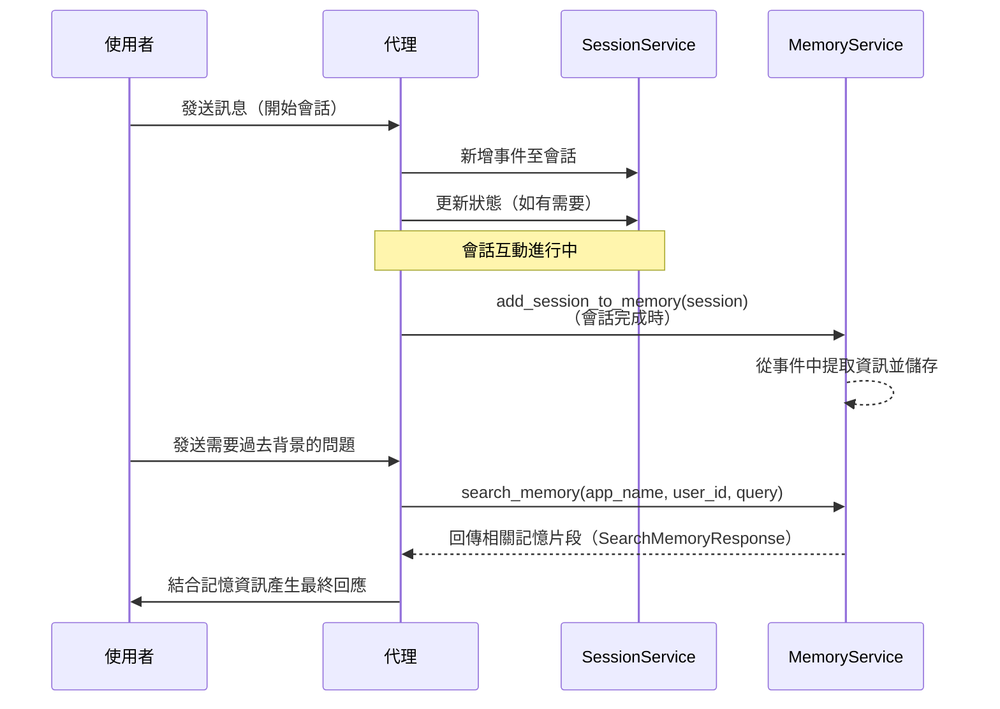

# 記憶 (Memory)：利用 `MemoryService` 實現長期知識

🔔 `更新日期：2026 年 1 月 5 日`

我們已經了解了 `Session` 如何針對*單次、進行中的對話*追蹤歷史記錄 (`events`) 和臨時數據 (`state`)。但如果代理 (Agent) 需要回想*過去*對話中的資訊該怎麼辦？這就是**長期知識 (Long-Term Knowledge)** 和 **`MemoryService`** 概念發揮作用的地方。

可以這樣思考：

- **`Session` / `State`**：就像您在特定聊天中的短期記憶。
- **長期知識 (`MemoryService`)**：就像代理可以諮詢的、可搜索的存檔或知識庫，可能包含來自許多過去聊天或其他來源的資訊。

## `MemoryService` 的角色

`BaseMemoryService` 定義了管理此類可搜索長期知識庫的介面。其主要職責為：

1. **攝取資訊 (`add_session_to_memory`)**：獲取（通常已完成的）`Session` 內容，並將相關資訊添加到長期知識庫中。
2. **搜索資訊 (`search_memory`)**：允許代理（通常透過 `Tool`）查詢知識庫，並根據搜索查詢檢索相關程式碼片段或上下文。

## 選擇合適的記憶服務

ADK 提供兩種不同的 `MemoryService` 實作方式，每種都針對不同的使用場景量身定制。請參考下表，決定最適合您代理的方案。

| **功能特性**     | **InMemoryMemoryService**                              | **VertexAiMemoryBankService**                                                                                                                                     |
| :--------------- | :----------------------------------------------------- | :---------------------------------------------------------------------------------------------------------------------------------------------------------------- |
| **持久性**       | 無（重啟後資料遺失）                                   | 是（由 Vertex AI 管理）                                                                                                                                           |
| **主要使用場景** | 原型設計、本地開發和簡單測試。                         | 從使用者對話中建立有意義、不斷進化的記憶。                                                                                                                        |
| **記憶提取**     | 存儲完整對話                                           | 從對話中提取 [有意義的資訊](https://cloud.google.com/vertex-ai/generative-ai/docs/agent-engine/memory-bank/generate-memories) 並將其與現有記憶合併（由 LLM 驅動） |
| **搜索能力**     | 基本關鍵字比對。                                       | 進階語義搜索。                                                                                                                                                    |
| **設定複雜度**   | 無，此為預設值。                                       | 低。需要在 Vertex AI 中建立 [Agent Engine](https://cloud.google.com/vertex-ai/generative-ai/docs/agent-engine/memory-bank/overview) 實例。                        |
| **依賴項**       | 無。                                                   | Google Cloud 專案、Vertex AI API                                                                                                                                  |
| **適用時機**     | 當您想在多個會話的聊天記錄中進行搜索以進行原型設計時。 | 當您希望您的代理能夠記住過去的互動並從中學習時。                                                                                                                  |

## 記憶體內記憶 (In-Memory Memory)

`InMemoryMemoryService` 將會話資訊儲存在應用程式的記憶體中，並針對搜索執行基本關鍵字比對。它無需設定，最適合不需要持久性的原型設計和簡單測試場景。

<details>
<summary>範例說明</summary>

> Python

```py
from google.adk.memory import InMemoryMemoryService
# 初始化記憶體內記憶服務
memory_service = InMemoryMemoryService()
```

> Go

```go
import (
  "google.golang.org/adk/memory"
  "google.golang.org/adk/session"
)

// 服務必須在運行器 (Runner) 之間共享，以便共享狀態和記憶。
sessionService := session.InMemoryService()
memoryService := memory.InMemoryService()
```

</details>

**範例：新增與搜索記憶**

本範例展示了使用 `InMemoryMemoryService` 的基本流程，為求簡潔採用此服務。

<details>
<summary>範例說明</summary>

> Python

```py
import asyncio
from google.adk.agents import LlmAgent
from google.adk.sessions import InMemorySessionService, Session
from google.adk.memory import InMemoryMemoryService # 匯入記憶服務 (MemoryService)
from google.adk.runners import Runner
from google.adk.tools import load_memory # 用於查詢記憶的工具
from google.genai.types import Content, Part

# --- 常數 ---
APP_NAME = "memory_example_app"
USER_ID = "mem_user"
MODEL = "gemini-2.0-flash" # 使用有效的模型

# --- 代理定義 ---
# 代理 1：用於擷取資訊的簡單代理
info_capture_agent = LlmAgent(
    model=MODEL,
    name="InfoCaptureAgent",
    instruction="確認使用者的陳述。",
)

# 代理 2：可以使用記憶的代理
memory_recall_agent = LlmAgent(
    model=MODEL,
    name="MemoryRecallAgent",
    instruction="回答使用者的問題。如果答案可能在過去的對話中，"
                "請使用 'load_memory' 工具。",
    tools=[load_memory] # 提供工具給代理
)

# --- 服務 ---
# 服務必須在運行器之間共享，以便共享狀態 and 記憶
session_service = InMemorySessionService()
memory_service = InMemoryMemoryService() # 演示使用記憶體內記憶

async def run_scenario():
    # --- 場景 ---

    # 輪次 1：在會話中擷取一些資訊
    print("--- 輪次 1：擷取資訊 ---")
    runner1 = Runner(
        # 從資訊擷取代理開始
        agent=info_capture_agent,
        app_name=APP_NAME,
        session_service=session_service,
        memory_service=memory_service # 提供記憶服務給 Runner
    )
    session1_id = "session_info"
    await runner1.session_service.create_session(app_name=APP_NAME, user_id=USER_ID, session_id=session1_id)
    user_input1 = Content(parts=[Part(text="我最喜歡的專案是 Project Alpha。")], role="user")

    # 執行代理
    final_response_text = "(無最終回應)"
    async for event in runner1.run_async(user_id=USER_ID, session_id=session1_id, new_message=user_input1):
        if event.is_final_response() and event.content and event.content.parts:
            final_response_text = event.content.parts[0].text
    print(f"代理 1 回應：{final_response_text}")

    # 獲取已完成的會話
    completed_session1 = await runner1.session_service.get_session(app_name=APP_NAME, user_id=USER_ID, session_id=session1_id)

    # 將此會話內容新增至記憶服務
    print("\n--- 正在將會話 1 新增至記憶 ---")
    await memory_service.add_session_to_memory(completed_session1)
    print("會話已新增至記憶。")

    # 輪次 2：在新會話中回想資訊
    print("\n--- 輪次 2：回想資訊 ---")
    runner2 = Runner(
        # 使用具備記憶工具的第二個代理
        agent=memory_recall_agent,
        app_name=APP_NAME,
        session_service=session_service, # 重用相同的服務
        memory_service=memory_service   # 重用相同的服務
    )
    session2_id = "session_recall"
    await runner2.session_service.create_session(app_name=APP_NAME, user_id=USER_ID, session_id=session2_id)
    user_input2 = Content(parts=[Part(text="我最喜歡的專案是什麼？")], role="user")

    # 執行第二個代理
    final_response_text_2 = "(無最終回應)"
    async for event in runner2.run_async(user_id=USER_ID, session_id=session2_id, new_message=user_input2):
        if event.is_final_response() and event.content and event.content.parts:
            final_response_text_2 = event.content.parts[0].text
    print(f"代理 2 回應：{final_response_text_2}")

# 要運行此範例，您可以使用以下程式碼片段：
# asyncio.run(run_scenario())

# await run_scenario()
```

> Go

```go
import (
    "context"
    "fmt"
    "log"
    "strings"

    "google.golang.org/adk/agent"
    "google.golang.org/adk/agent/llmagent"
    "google.golang.org/adk/memory"
    "google.golang.org/adk/model/gemini"
    "google.golang.org/adk/runner"
    "google.golang.org/adk/session"
    "google.golang.org/adk/tool"
    "google.golang.org/adk/tool/functiontool"
    "google.golang.org/genai"
)

const (
    appName = "go_memory_example_app" // 應用程式名稱
    userID  = "go_mem_user"           // 使用者 ID
    modelID = "gemini-2.5-pro"        // 使用的模型 ID
)

// Args 定義記憶搜索工具的輸入結構。
type Args struct {
    Query string `json:"query" jsonschema:"在記憶中搜索的查詢內容。"`
}

// Result 定義記憶搜索工具的輸出結構。
type Result struct {
    Results []string `json:"results"` // 搜索結果列表
}


// memorySearchToolFunc 是記憶搜索工具的實作函數。
// 此函數展示如何透過 tool.Context 存取記憶。
func memorySearchToolFunc(tctx tool.Context, args Args) (Result, error) {
    fmt.Printf("工具：正在搜索記憶，查詢內容：'%s'\n", args.Query)
    // SearchMemory 函數可透過 context 存取。
    searchResults, err := tctx.SearchMemory(context.Background(), args.Query)
    if err != nil {
        log.Printf("搜索記憶時發生錯誤：%v", err)
        return Result{}, fmt.Errorf("記憶搜索失敗")
    }

    var results []string
    // 從搜索結果中提取文字內容
    for _, res := range searchResults.Memories {
        if res.Content != nil {
            results = append(results, textParts(res.Content)...)
        }
    }
    return Result{Results: results}, nil
}

// 定義一個可以搜索記憶的工具。
var memorySearchTool = must(functiontool.New(
    functiontool.Config{
        Name:        "search_past_conversations",
        Description: "搜索過去的對話以獲取相關資訊。",
    },
    memorySearchToolFunc,
))


// 此範例展示如何在 Go ADK 中使用 MemoryService。
// 涵蓋兩個主要場景：
// 1. 將已完成的會話新增至記憶，並在新會話中回想。
// 2. 使用 tool.Context 從自定義工具內部搜索記憶。
func main() {
    ctx := context.Background()

    // --- 服務 ---
    // 服務必須在運行器之間共享，以便共享狀態和記憶。
    sessionService := session.InMemoryService()
    memoryService := memory.InMemoryService() // 此範例使用記憶體內記憶。

    // --- 場景 1：在一個會話中擷取資訊 ---
    fmt.Println("--- 輪次 1：擷取資訊 ---")
    infoCaptureAgent := must(llmagent.New(llmagent.Config{
        Name:        "InfoCaptureAgent",
        Model:       must(gemini.NewModel(ctx, modelID, nil)),
        Instruction: "確認使用者的陳述。",
    }))

    runner1 := must(runner.New(runner.Config{
        AppName:        appName,
        Agent:          infoCaptureAgent,
        SessionService: sessionService,
        MemoryService:  memoryService, // 將記憶服務提供給 Runner
    }))

    session1ID := "session_info"
    must(sessionService.Create(ctx, &session.CreateRequest{AppName: appName, UserID: userID, SessionID: session1ID}))

    userInput1 := genai.NewContentFromText("我最喜歡的專案是 Project Alpha。", "user")
    var finalResponseText string
    // 執行代理並處理事件
    for event, err := range runner1.Run(ctx, userID, session1ID, userInput1, agent.RunConfig{}) {
        if err != nil {
            log.Printf("代理 1 錯誤：%v", err)
            continue
        }
        // 擷取最終回應
        if event.Content != nil && !event.LLMResponse.Partial {
            finalResponseText = strings.Join(textParts(event.LLMResponse.Content), "")
        }
    }
    fmt.Printf("代理 1 回應：%s\n", finalResponseText)

    // 將已完成的會話新增至記憶服務
    fmt.Println("\n--- 正在將會話 1 新增至記憶 ---")
    resp, err := sessionService.Get(ctx, &session.GetRequest{AppName: appName, UserID: userID, SessionID: session1ID})
    if err != nil {
        log.Fatalf("無法取得已完成的會話：%v", err)
    }
    if err := memoryService.AddSession(ctx, resp.Session); err != nil {
        log.Fatalf("無法將會話新增至記憶：%v", err)
    }
    fmt.Println("會話已新增至記憶。")

    // --- 場景 2：在新會話中使用工具回想資訊 ---
    fmt.Println("\n--- 輪次 2：回想資訊 ---")

    memoryRecallAgent := must(llmagent.New(llmagent.Config{
        Name:        "MemoryRecallAgent",
        Model:       must(gemini.NewModel(ctx, modelID, nil)),
        Instruction: "回答使用者的問題。如果答案可能在過去的對話中，請使用 'search_past_conversations' 工具。",
        Tools:       []tool.Tool{memorySearchTool}, // 將工具提供給代理
    }))

    runner2 := must(runner.New(runner.Config{
        Agent:          memoryRecallAgent,
        AppName:        appName,
        SessionService: sessionService,
        MemoryService:  memoryService,
    }))

    session2ID := "session_recall"
    must(sessionService.Create(ctx, &session.CreateRequest{AppName: appName, UserID: userID, SessionID: session2ID}))
    userInput2 := genai.NewContentFromText("我最喜歡的專案是什麼？", "user")

    var finalResponseText2 string
    // 執行第二個代理並處理事件
    for event, err := range runner2.Run(ctx, userID, session2ID, userInput2, agent.RunConfig{}) {
        if err != nil {
            log.Printf("代理 2 錯誤：%v", err)
            continue
        }
        // 擷取最終回應
        if event.Content != nil && !event.LLMResponse.Partial {
            finalResponseText2 = strings.Join(textParts(event.LLMResponse.Content), "")
        }
    }
    fmt.Printf("代理 2 回應：%s\n", finalResponseText2)
}
```

</details>

### 在工具中搜索記憶

您還可以使用 `tool.Context` 從自定義工具內部搜索記憶。

<details>
<summary>範例說明</summary>

> Go

```go
// memorySearchToolFunc 是記憶搜索工具的實作函數。
// 此函數展示如何透過 tool.Context 存取記憶。
func memorySearchToolFunc(tctx tool.Context, args Args) (Result, error) {
    fmt.Printf("工具：正在搜索記憶，查詢內容：'%s'\n", args.Query)
    // SearchMemory 函數可透過 context 存取。
    searchResults, err := tctx.SearchMemory(context.Background(), args.Query)
    if err != nil {
        log.Printf("搜索記憶時發生錯誤：%v", err)
        return Result{}, fmt.Errorf("記憶搜索失敗")
    }

    var results []string
    // 從搜索結果中提取文字內容
    for _, res := range searchResults.Memories {
        if res.Content != nil {
            results = append(results, textParts(res.Content)...)
        }
    }
    return Result{Results: results}, nil
}

// 定義一個可以搜索記憶的工具。
var memorySearchTool = must(functiontool.New(
    functiontool.Config{
        Name:        "search_past_conversations",
        Description: "搜索過去的對話以獲取相關資訊。",
    },
    memorySearchToolFunc,
))
```

</details>

## Vertex AI Memory Bank

`VertexAiMemoryBankService` 將您的代理連接到 [Vertex AI Memory Bank](https://cloud.google.com/vertex-ai/generative-ai/docs/agent-engine/memory-bank/overview)，這是一項全託管的 Google Cloud 服務，為對話式代理提供複雜且持久的記憶功能。

### 運作原理

該服務處理兩個關鍵操作：

- **產生記憶：** 在對話結束時，您可以將會話事件發送到 Memory Bank，它會智慧地處理並將資訊儲存為「記憶」。
- **檢索記憶：** 您的代理程式碼可以針對 Memory Bank 發出搜索查詢，以檢索過去對話中的相關記憶。

### 先決條件

在使用此功能之前，您必須具備：

1.  **Google Cloud 專案：** 已啟用 Vertex AI API。
2.  **Agent Engine：** 您需要在 Vertex AI 中建立一個 Agent Engine。您不需要將代理部署到 Agent Engine Runtime 即可使用 Memory Bank。這將為您提供配置所需的 **Agent Engine ID**。
3.  **身份驗證：** 確保您的本地環境已通過身份驗證以存取 Google Cloud 服務。最簡單的方法是執行：
    ```bash
    gcloud auth application-default login
    ```
4.  **環境變數：** 服務需要您的 Google Cloud 專案 ID 和位置。請將它們設定為環境變數：
    ```bash
    export GOOGLE_CLOUD_PROJECT="您的專案ID"
    export GOOGLE_CLOUD_LOCATION="您的位置"
    ```

### 配置

要將代理連接到 Memory Bank，您可以在啟動 ADK 伺服器 (`adk web` 或 `adk api_server`) 時使用 `--memory_service_uri` 旗標。URI 格式必須為 `agentengine://<agent_engine_id>`。

```bash title="bash"
adk web path/to/your/agents_dir --memory_service_uri="agentengine://1234567890"
```

或者，您可以透過手動實例化 `VertexAiMemoryBankService` 並將其傳遞給 `Runner` 來配置代理使用 Memory Bank。

<details>
<summary>範例說明</summary>

> Python

```py
from google.adk.memory import VertexAiMemoryBankService

# 從 API 資源名稱中獲取 agent_engine_id
agent_engine_id = agent_engine.api_resource.name.split("/")[-1]

# 建立 VertexAiMemoryBankService 實例
memory_service = VertexAiMemoryBankService(
    project="PROJECT_ID",
    location="LOCATION",
    agent_engine_id=agent_engine_id
)

# 建立 Runner 並傳入記憶服務
runner = adk.Runner(
    ...
    memory_service=memory_service
)
```

</details>

## 在代理中使用記憶

配置記憶服務後，代理可以使用工具或回呼 (callback) 來檢索記憶。ADK 包含兩個內建的記憶檢索工具：

- `PreloadMemory`：在每一輪開始時一律檢索記憶（類似於回呼）。
- `LoadMemory`：當代理決定有幫助時檢索記憶。

**範例：**

<details>
<summary>範例說明</summary>

> Python

```python
from google.adk.agents import Agent
from google.adk.tools.preload_memory_tool import PreloadMemoryTool

# 建立具備 PreloadMemoryTool 的代理
agent = Agent(
    model=MODEL_ID,
    name='weather_sentiment_agent',
    instruction="...",
    tools=[PreloadMemoryTool()] # 預載記憶工具
)
```

</details>

要從會話中提取記憶，您需要呼叫 `add_session_to_memory`。例如，您可以透過回呼自動執行此操作：

<details>
<summary>範例說明</summary>

> Python

```python
from google import adk

# 自動將會話儲存到記憶的回呼函數
async def auto_save_session_to_memory_callback(callback_context):
    await callback_context._invocation_context.memory_service.add_session_to_memory(
        callback_context._invocation_context.session)

# 建立代理並配置回呼
agent = Agent(
    model=MODEL,
    name="Generic_QA_Agent",
    instruction="回答使用者的問題",
    tools=[adk.tools.preload_memory_tool.PreloadMemoryTool()],
    after_agent_callback=auto_save_session_to_memory_callback, # 設定代理後置回呼
)
```

</details>

## 進階概念

### 記憶在實踐中如何運作

內部的記憶工作流程涉及以下步驟：

1. **會話互動：** 使用者透過由 `SessionService` 管理的 `Session` 與代理進行互動。事件被新增，且狀態可能會更新。
2. **攝取到記憶：** 在某些時間點（通常當會話被視為完成或已產生重要資訊時），您的應用程式會呼叫 `memory_service.add_session_to_memory(session)`。這會從會話事件中提取相關資訊，並將其新增至長期知識庫（記憶體內字典或 Agent Engine Memory Bank）。
3. **後續查詢：** 在*另一個*（或同一個）會話中，使用者可能會提出需要過去背景資訊的問題（例如：「我們上週討論了關於專案 X 的什麼內容？」）。
4. **代理使用記憶工具：** 配備記憶檢索工具（如內建的 `load_memory` 工具）的代理辨識出需要過去的背景資訊。它呼叫該工具，提供搜索查詢（例如：「上週關於專案 X 的討論」）。
5. **執行搜索：** 該工具內部呼叫 `memory_service.search_memory(app_name, user_id, query)`。
6. **返回結果：** `MemoryService` 搜索其儲存庫（使用關鍵字比對或語義搜索），並返回相關片段作為 `SearchMemoryResponse`，其中包含 `MemoryResult` 物件列表（每個物件可能持有來自相關過去會話的事件）。
7. **代理使用結果：** 該工具將這些結果返回給代理，通常作為背景資訊或函數回應的一部分。代理隨後可以使用這些檢索到的資訊來制定給使用者的最終答案。

#### 記憶工作流程圖


### 代理可以存取多個記憶服務嗎？

- **透過標準配置：不可以。** 框架 (`adk web`, `adk api_server`) 設計為透過 `--memory_service_uri` 旗標一次配置一個單一記憶服務。然後將此單一服務提供給代理，並透過內建的 `self.search_memory()` 方法進行存取。從配置角度來看，對於該程序服務的所有代理，您只能選擇一個後端 (`InMemory`, `VertexAiMemoryBankService`)。

- **在您的代理程式碼中：是的，絕對可以。** 沒有什麼能阻止您直接在代理程式碼中手動匯入並實例化另一個記憶服務。這允許您在單個代理輪次中存取多個記憶來源。

例如，您的代理可以使用框架配置的 `InMemoryMemoryService` 來回想對話歷史，同時手動實例化 `VertexAiMemoryBankService` 以在技術手冊中查找資訊。

#### 範例：使用兩個記憶服務

以下是如何在代理程式碼中實作的方法：

<details>
<summary>範例說明</summary>

> Python

```python
from google.adk.agents import Agent
from google.adk.memory import InMemoryMemoryService, VertexAiMemoryBankService
from google.genai import types

class MultiMemoryAgent(Agent):
    def __init__(self, **kwargs):
        super().__init__(**kwargs)

        # 初始化框架提供的記憶服務 (假設為 InMemoryMemoryService)
        self.memory_service = InMemoryMemoryService()
        # 手動為文件查詢實例化第二個記憶服務
        self.vertexai_memorybank_service = VertexAiMemoryBankService(
            project="PROJECT_ID",
            location="LOCATION",
            agent_engine_id="AGENT_ENGINE_ID"
        )

    async def run(self, request: types.Content, **kwargs) -> types.Content:
        user_query = request.parts[0].text

        # 1. 使用框架提供的記憶服務搜索對話歷史
        #    (如果已配置，這將是 InMemoryMemoryService)
        conversation_context = await self.memory_service.search_memory(query=user_query)

        # 2. 使用手動建立的服務搜索文件知識庫
        document_context = await self.vertexai_memorybank_service.search_memory(query=user_query)

        # 合併來自兩個來源的背景資訊以產生更好的回應
        prompt = "從我們過去的對話中，我記得：\n"
        prompt += f"{conversation_context.memories}\n\n"
        prompt += "從技術手冊中，我發現：\n"
        prompt += f"{document_context.memories}\n\n"
        prompt += f"根據以上所有內容，這是我對 '{user_query}' 的回答："

        # 使用 LLM 產生回應
        return await self.llm.generate_content_async(prompt)
```

</details>
