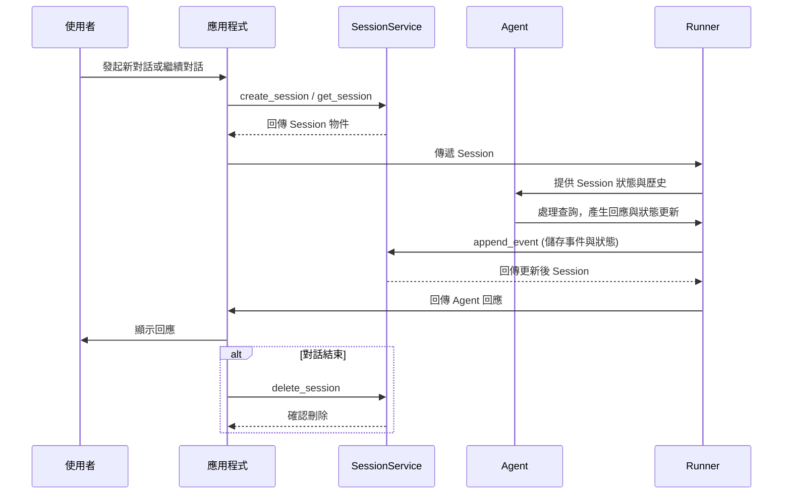

# 會話 (Session)：追蹤個別對話

> 🔔 `更新日期：2026-01-26`
>
> 🔗 `資料來源`：https://google.github.io/adk-docs/sessions/session/

[`ADK 支援`: `Python v0.1.0` | `Typescript v0.2.0` | `Go v0.1.0` | `Java v0.1.0`]

在介紹之後，讓我們深入探討 `Session`（會話）。回想一下「對話執行緒（conversation thread）」的概念。就像您不會從頭開始發送每一條簡訊一樣，代理（agent）需要關於持續互動的上下文。**`Session`** 是 ADK 專門設計用於追蹤和管理這些個別對話執行緒的物件。

## `Session` 物件

當使用者開始與您的代理互動時，`SessionService` 會建立一個 `Session` 物件 (`google.adk.sessions.Session`)。這個物件充當持有與該 *特定聊天執行緒* 相關的所有內容的容器。以下是其關鍵屬性：

*   **識別符 (`id`, `appName`, `userId`)：** 對話的唯一標籤。
    * `id`：*此特定* 對話執行緒的唯一識別符，對於稍後檢索它至關重要。一個 SessionService 物件可以處理多個 `Session`。此欄位識別我們指的是哪個特定的會話物件。例如："test_id_modification"。
    * `app_name`：識別此對話屬於哪個代理應用程式。例如："id_modifier_workflow"。
    * `userId`：將對話連結到特定使用者。
*   **歷史記錄 (`events`)：** 在此特定執行緒中發生的所有互動（`Event` 物件——使用者訊息、代理回應、工具操作）的按時間順序排列的序列。
*   **會話狀態 (`state`)：** 儲存僅與此特定、持續對話相關的臨時資料的地方。這充當互動期間代理的草稿筆記。我們將在下一節詳細介紹如何使用和管理 `state`。
*   **活動追蹤 (`lastUpdateTime`)：** 指示此對話執行緒中最後一次發生事件的時間戳記。

### 範例：檢查會話屬性

<details>
<summary>範例程式碼</summary>

> Python

```python
from google.adk.sessions import InMemorySessionService, Session

# 建立一個簡單的會話以檢查其屬性
temp_service = InMemorySessionService()
example_session = await temp_service.create_session(
    app_name="my_app",
    user_id="example_user",
    state={"initial_key": "initial_value"} # 狀態可以被初始化
)

print(f"--- 正在檢查會話屬性 ---")
print(f"ID (`id`):                {example_session.id}")
print(f"應用程式名稱 (`app_name`): {example_session.app_name}")
print(f"使用者 ID (`user_id`):         {example_session.user_id}")
print(f"狀態 (`state`):           {example_session.state}") # 注意：此處僅顯示初始狀態
print(f"事件 (`events`):         {example_session.events}") # 最初為空
print(f"最後更新時間 (`last_update_time`): {example_session.last_update_time:.2f}")
print(f"---------------------------------")

# 清理（此範例中為選擇性）
temp_service = await temp_service.delete_session(app_name=example_session.app_name,
                            user_id=example_session.user_id, session_id=example_session.id)
print("temp_service 的最終狀態 - ", temp_service)
```

> TypeScript

```typescript
import { InMemorySessionService } from "@google/adk";

// 建立一個簡單的會話以檢查其屬性
const tempService = new InMemorySessionService();
const exampleSession = await tempService.createSession({
    appName: "my_app",
    userId: "example_user",
    state: {"initial_key": "initial_value"} // 狀態可以被初始化
});

console.log("--- 正在檢查會話屬性 ---");
console.log(`ID ('id'):                ${exampleSession.id}`);
console.log(`應用程式名稱 ('appName'): ${exampleSession.appName}`);
console.log(`使用者 ID ('userId'):         ${exampleSession.userId}`);
console.log(`狀態 ('state'):           ${JSON.stringify(exampleSession.state)}`); // 注意：此處僅顯示初始狀態
console.log(`事件 ('events'):         ${JSON.stringify(exampleSession.events)}`); // 最初為空
console.log(`最後更新時間 ('lastUpdateTime'): ${exampleSession.lastUpdateTime}`);
console.log("---------------------------------");

// 清理（此範例中為選擇性）
const finalStatus = await tempService.deleteSession({
    appName: exampleSession.appName,
    userId: exampleSession.userId,
    sessionId: exampleSession.id
});
console.log("temp_service 的最終狀態 - ", finalStatus);
```

> Go

```go
appName := "my_go_app"
userID := "example_go_user"
initialState := map[string]any{"initial_key": "initial_value"}

// 建立一個會話以檢查其屬性。
createResp, err := inMemoryService.Create(ctx, &session.CreateRequest{
    AppName: appName,
    UserID:  userID,
    State:   initialState,
})

if err != nil {
    log.Fatalf("無法建立會話: %v", err)
}

exampleSession := createResp.Session

fmt.Println("\n--- 正在檢查會話屬性 ---")
fmt.Printf("ID (`ID()`): %s\n", exampleSession.ID())
fmt.Printf("應用程式名稱 (`AppName()`): %s\n", exampleSession.AppName())
// 要存取狀態，請呼叫 Get()。
val, _ := exampleSession.State().Get("initial_key")
fmt.Printf("狀態 (`State().Get()`):    initial_key = %v\n", val)

// 事件最初為空。
fmt.Printf("事件 (`Events().Len()`):  %d\n", exampleSession.Events().Len())
fmt.Printf("最後更新時間 (`LastUpdateTime()`): %s\n", exampleSession.LastUpdateTime().Format("2006-01-02 15:04:05"))
fmt.Println("---------------------------------")

// 清理會話。
err = inMemoryService.Delete(ctx, &session.DeleteRequest{
    AppName:   exampleSession.AppName(),
    UserID:    exampleSession.UserID(),
    SessionID: exampleSession.ID(),
})

if err != nil {
    log.Fatalf("無法刪除會話: %v", err)
}

fmt.Println("會話已成功刪除。")
```

> Java

```java
import com.google.adk.sessions.InMemorySessionService;
import com.google.adk.sessions.Session;
import java.util.concurrent.ConcurrentMap;
import java.util.concurrent.ConcurrentHashMap;

String sessionId = "123";
String appName = "example-app"; // 範例應用程式名稱
String userId = "example-user"; // 範例使用者識別碼
ConcurrentMap<String, Object> initialState = new ConcurrentHashMap<>(Map.of("newKey", "newValue"));
InMemorySessionService exampleSessionService = new InMemorySessionService();

// 建立會話
Session exampleSession = exampleSessionService.createSession(
    appName, userId, initialState, Optional.of(sessionId)).blockingGet();
System.out.println("會話建立成功。");

System.out.println("--- 正在檢查會話屬性 ---");
System.out.printf("ID (`id`): %s%n", exampleSession.id());
System.out.printf("應用程式名稱 (`appName`): %s%n", exampleSession.appName());
System.out.printf("使用者 ID (`userId`): %s%n", exampleSession.userId());
System.out.printf("狀態 (`state`): %s%n", exampleSession.state());
System.out.println("------------------------------------");


// 清理（此範例中為選擇性）
var unused = exampleSessionService.deleteSession(appName, userId, sessionId);
```

</details>

*(**注意：** 上面顯示的狀態僅是初始狀態。狀態更新是透過事件發生的，正如在「狀態 (State)」章節中所討論的那樣。)*

## 使用 `SessionService` 管理會話

如上所述，您通常不會直接建立或管理 `Session` 物件。相反地，您會使用 **`SessionService`**。此服務充當中央管理員，負責對話會話的整個生命週期。

其核心職責包括：

*   **啟動新對話：** 當使用者開始互動時，建立新的 `Session` 物件。
*   **恢復現有對話：** 檢索特定的 `Session`（使用其 ID），以便代理可以從中斷處繼續。
*   **儲存進度：** 將新的互動（`Event` 物件）附加到會話的歷史記錄中。這也是更新會話 `state` 的機制（更多內容請參見 `State` 章節）。
*   **列出對話：** 為特定使用者和應用程式尋找活動中的對話執行緒。
*   **清理：** 當對話完成或不再需要時，刪除 `Session` 物件及其相關資料。

## `SessionService` 實作方式

ADK 提供不同的 `SessionService` 實作方式，讓您可以選擇最適合您需求的儲存後端：

### `InMemorySessionService`

*   **運作方式：** 直接將所有會話資料儲存在應用程式的記憶體中。
*   **持久性：** 無。**如果應用程式重新啟動，所有對話資料都會遺失。**
*   **需求：** 不需要額外配置。
*   **最適用於：** 快速開發、本地測試、範例以及不需要長期持久性的場景。

<details>
<summary>範例程式碼</summary>

> Python

```python
from google.adk.sessions import InMemorySessionService
session_service = InMemorySessionService()
```

> TypeScript

```typescript
import { InMemorySessionService } from "@google/adk";
const sessionService = new InMemorySessionService();
```

> Go

```go
import "google.golang.org/adk/session"
inMemoryService := session.InMemoryService()
```

> Java

```java
import com.google.adk.sessions.InMemorySessionService;
InMemorySessionService exampleSessionService = new InMemorySessionService();
```
</details>


### `VertexAiSessionService`

[`ADK 支援`: `Python v0.1.0` | `Go v0.1.0` | `Java v0.1.0`]

*   **運作方式：** 透過 API 呼叫使用 Google Cloud Vertex AI 基礎設施進行會話管理。
*   **持久性：** 是。資料透過 [Vertex AI Agent Engine](https://google.github.io/adk-docs/deploy/agent-engine/) 進行可靠且可擴展的管理。
*   **需求：**
    *   一個 Google Cloud 專案 (`pip install vertexai`)
    *   一個可以由[此步驟](https://cloud.google.com/vertex-ai/docs/pipelines/configure-project#storage)配置的 Google Cloud 儲存貯體 (bucket)。
    *   一個可以按照[此教學](https://google.github.io/adk-docs/deploy/agent-engine/)設置的推理引擎 (Reasoning Engine) 資源名稱/識別碼。
    *   如果您沒有 Google Cloud 專案且想要嘗試 VertexAiSessionService，請參閱 [Vertex AI Express 模式](/adk-docs/tools/google-cloud/express-mode/)。
*   **最適用於：** 部署在 Google Cloud 上的可擴展生產應用程式，尤其是與其他 Vertex AI 功能整合時。

<details>
<summary>範例程式碼</summary>

> Python

```python
# 需求：pip install google-adk[vertexai]
# 加上 GCP 設置和身份驗證
from google.adk.sessions import VertexAiSessionService

PROJECT_ID = "your-gcp-project-id"
LOCATION = "us-central1"
# 與此服務搭配使用的 app_name 應為推理引擎 (Reasoning Engine) 的 ID 或名稱
REASONING_ENGINE_APP_NAME = "projects/your-gcp-project-id/locations/us-central1/reasoningEngines/your-engine-id"

session_service = VertexAiSessionService(project=PROJECT_ID, location=LOCATION)
# 呼叫服務方法時使用 REASONING_ENGINE_APP_NAME，例如：
# session_service = await session_service.create_session(app_name=REASONING_ENGINE_APP_NAME, ...)
```

> Go

```go
import "google.golang.org/adk/session"

// 2. VertexAIService
// 在執行之前，請確保您的環境已通過身份驗證：
// gcloud auth application-default login
// export GOOGLE_CLOUD_PROJECT="your-gcp-project-id"
// export GOOGLE_CLOUD_LOCATION="your-gcp-location"

modelName := "gemini-flash-latest" // 替換為您想要的模型
vertexService, err := session.VertexAIService(ctx, modelName)
if err != nil {
  log.Printf("無法初始化 VertexAIService（如果未設置 gcloud 專案，這是預期的）： %v", err)
} else {
  fmt.Println("成功初始化 VertexAIService。")
}
```

> Java

```java
// 請查看上面的需求集，隨後在您的 bashrc 文件中匯出以下內容：
// export GOOGLE_CLOUD_PROJECT=my_gcp_project
// export GOOGLE_CLOUD_LOCATION=us-central1
// export GOOGLE_API_KEY=my_api_key

import com.google.adk.sessions.VertexAiSessionService;
import java.util.UUID;

String sessionId = UUID.randomUUID().toString();
String reasoningEngineAppName = "123456789";
String userId = "u_123"; // 範例使用者識別碼
ConcurrentMap<String, Object> initialState = new
    ConcurrentHashMap<>(); // 此範例不需要初始狀態

VertexAiSessionService sessionService = new VertexAiSessionService();
Session mySession =
    sessionService
        .createSession(reasoningEngineAppName, userId, initialState, Optional.of(sessionId))
        .blockingGet();
```
</details>

### `DatabaseSessionService`

[`ADK 支援`: `Python v0.1.0` | `Go v0.1.0`]

*   **運作方式：** 連接到關聯式資料庫（例如 PostgreSQL、MySQL、SQLite），將會話資料持久化儲存在資料表中。
*   **持久性：** 是。資料在應用程式重新啟動後依然存在。
*   **需求：** 已配置的資料庫。
*   **最適用於：** 需要由您自己管理的可靠、持久儲存空間的應用程式。

```python
from google.adk.sessions import DatabaseSessionService
# 使用本地 SQLite 文件的範例：
# 注意：此實作需要非同步 (async) 資料庫驅動程式。
# 對於 SQLite，請使用 'sqlite+aiosqlite' 而不是 'sqlite' 以確保非同步相容性。
db_url = "sqlite+aiosqlite:///./my_agent_data.db"
session_service = DatabaseSessionService(db_url=db_url)
```

> [!WARNING] 非同步驅動程式需求
`DatabaseSessionService` 需要非同步 (async) 資料庫驅動程式。使用 SQLite 時，
您必須在連接字串中使用 `sqlite+aiosqlite` 而不是 `sqlite`。
對於其他資料庫（PostgreSQL、MySQL），請確保您使用的是非同步相容的
驅動程式，例如用於 PostgreSQL 的 `asyncpg` 或用於 MySQL 的 `aiomysql`。

> [!NOTE] ADK Python v1.22.0 中會話資料庫結構綱目 (schema) 變更\
會話資料庫的結構綱目在 ADK Python v1.22.0 中發生了變化，
這需要遷移會話資料庫。欲瞭解更多資訊，請參閱
[會話資料庫結構綱目遷移](/adk-docs/sessions/session/migrate/)。

## 會話生命週期


以下是 `Session` 和 `SessionService` 在對話輪次中如何協同工作的簡化流程：

1.  **開始或恢復：** 您的應用程式需要使用 `SessionService` 來 `create_session`（建立新聊天）或使用現有的會話 ID。
2.  **提供上下文：** `Runner` 從相應的服務方法獲取適當的 `Session` 物件，為代理提供對相應會話的 `state` 和 `events` 的存取權限。
3.  **代理處理：** 使用者向代理提出查詢。代理分析查詢以及可能的會話 `state` 和 `events` 歷史記錄以確定回應。
4.  **回應與狀態更新：** 代理產生回應（並可能標記要在 `state` 中更新的資料）。`Runner` 將其封裝為一個 `Event`。
5.  **儲存互動：** `Runner` 使用 `session` 和新的 `event` 作為參數呼叫 `sessionService.append_event(session, event)`。服務將 `Event` 新增到歷史記錄中，並根據事件中的資訊更新儲存中的會話 `state`。會話的 `last_update_time` 也會更新。
6.  **準備下一次：** 代理的回應發送給使用者。更新後的 `Session` 現在由 `SessionService` 儲存，準備好進行下一輪（下一輪會從步驟 1 重新開始循環，通常是在當前會話中繼續對話）。
7.  **結束對話：** 當對話結束時，您的應用程式呼叫 `sessionService.delete_session(...)` 以清理儲存的會話資料（如果不再需要）。

此循環強調了 `SessionService` 如何透過管理與每個 `Session` 物件相關聯的歷史記錄和狀態來確保對話的連續性。

---
### 會話生命週期時序圖


