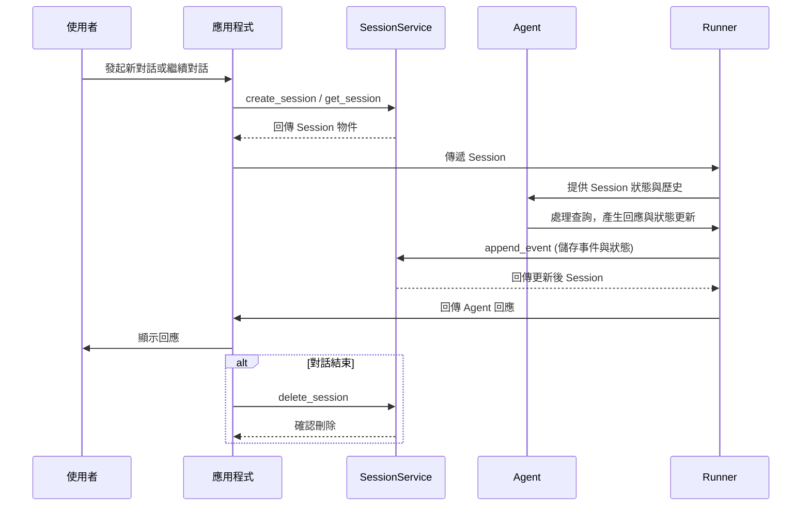

# 會話 (Session)：追蹤個別對話

🔔 `更新日期：2026 年 1 月 5 日`

在介紹完基礎概念後，讓我們深入了解 `Session`（會話）。請回想一下「對話執行緒 (Conversation Thread)」的概念。就像你發送簡訊時不會每次都從頭開始解釋背景一樣，AI 代理 (Agent) 也需要關於當前互動的上下文資訊。**`Session`** 是 ADK 專門設計用來追蹤與管理這些獨立對話執行緒的物件。

## `Session` 物件

當使用者開始與你的 Agent 互動時，`SessionService` 會建立一個 `Session` 物件 (`google.adk.sessions.Session`)。這個物件就像是一個容器，保存了與該*特定聊天執行緒*相關的所有資訊。其核心屬性如下：

- **識別資訊 (`id`, `appName`, `userId`)：** 該對話的唯一標籤。
  - `id`：*此特定*對話執行緒的唯一識別碼，對於稍後檢索對話至關重要。`SessionService` 物件可以處理多個 `Session`。此欄位識別我們指的是哪一個特定的會話物件。例如："test_id_modification"。
  - `app_name`：識別此對話屬於哪個 Agent 應用程式。例如："id_modifier_workflow"。
  - `userId`：將對話連結到特定使用者。
- **歷史紀錄 (`events`)：** 在此特定執行緒中發生的所有互動（`Event` 物件，包含使用者訊息、Agent 回應、工具執行動作）的時序序列。
- **會話狀態 (`state`)：** 儲存*僅*與此特定進行中對話相關的暫存資料。這在互動期間充當 Agent 的草稿紙。我們將在下一節詳細介紹如何使用和管理 `state`。
- **活動追蹤 (`lastUpdateTime`)：** 顯示此對話執行緒中最後一次發生事件的時間戳記。

> [!IMPORTANT] > **重點提示**：`Session` 是 ADK 處理「記憶」的最小單位。它將對話歷史與當前狀態封裝在一起，確保 Agent 能夠在多輪對話中維持一致性。

### 範例：查看 Session 屬性

<details>
<summary>
Python 範例
</summary>

```python
from google.adk.sessions import InMemorySessionService, Session

# 建立一個簡易會話以查看其屬性
temp_service = InMemorySessionService()
example_session = await temp_service.create_session(
    app_name="my_app",
    user_id="example_user",
    state={"initial_key": "initial_value"} # 可以初始化狀態
)

print(f"--- 檢視 Session 屬性 ---")
print(f"ID (`id`):                {example_session.id}")
print(f"應用程式名稱 (`app_name`): {example_session.app_name}")
print(f"使用者 ID (`user_id`):    {example_session.user_id}")
print(f"狀態 (`state`):           {example_session.state}") # 註：此處僅顯示初始狀態
print(f"事件 (`events`):          {example_session.events}") # 初始為空
print(f"最後更新 (`last_update_time`): {example_session.last_update_time:.2f}")
print(f"---------------------------------")

# 清理（此範例為選用）
temp_service = await temp_service.delete_session(app_name=example_session.app_name,
                            user_id=example_session.user_id, session_id=example_session.id)
print("temp_service 的最終狀態 - ", temp_service)
```

</details>

<details>

<summary>
TypeScript 範例
</summary>

```typescript
import { InMemorySessionService } from '@google/adk';

// 建立一個簡易會話以查看其屬性
const tempService = new InMemorySessionService();
const exampleSession = await tempService.createSession({
  appName: 'my_app',
  userId: 'example_user',
  state: { initial_key: 'initial_value' }, // 可以初始化狀態
});

console.log('--- 檢視 Session 屬性 ---');
console.log(`ID ('id'):                ${exampleSession.id}`);
console.log(`應用程式名稱 ('appName'): ${exampleSession.appName}`);
console.log(`使用者 ID ('userId'):    ${exampleSession.userId}`);
console.log(
  `狀態 ('state'):           ${JSON.stringify(exampleSession.state)}`
); // 註：此處僅顯示初始狀態
console.log(
  `事件 ('events'):         ${JSON.stringify(exampleSession.events)}`
); // 初始為空
console.log(`最後更新 ('lastUpdateTime'): ${exampleSession.lastUpdateTime}`);
console.log('---------------------------------');

// 清理（此範例為選用）
const finalStatus = await tempService.deleteSession({
  appName: exampleSession.appName,
  userId: exampleSession.userId,
  sessionId: exampleSession.id,
});
console.log('temp_service 的最終狀態 - ', finalStatus);
```

</details>

<details>

<summary>
Go 範例
</summary>

```go
appName := "my_go_app"
userID := "example_go_user"
initialState := map[string]any{"initial_key": "initial_value"}

// Create a session to examine its properties.
createResp, err := inMemoryService.Create(ctx, &session.CreateRequest{
AppName: appName,
UserID:  userID,
State:   initialState,
})
if err != nil {
log.Fatalf("Failed to create session: %v", err)
}
exampleSession := createResp.Session

fmt.Println("\n--- Examining Session Properties ---")
fmt.Printf("ID (`ID()`): %s\n", exampleSession.ID())
fmt.Printf("Application Name (`AppName()`): %s\n", exampleSession.AppName())
// To access state, you call Get().
val, _ := exampleSession.State().Get("initial_key")
fmt.Printf("State (`State().Get()`):    initial_key = %v\n", val)

// Events are initially empty.
fmt.Printf("Events (`Events().Len()`):  %d\n", exampleSession.Events().Len())
fmt.Printf("Last Update (`LastUpdateTime()`): %s\n", exampleSession.LastUpdateTime().Format("2006-01-02 15:04:05"))
fmt.Println("---------------------------------")

// Clean up the session.
err = inMemoryService.Delete(ctx, &session.DeleteRequest{
AppName:   exampleSession.AppName(),
UserID:    exampleSession.UserID(),
SessionID: exampleSession.ID(),
})
if err != nil {
log.Fatalf("Failed to delete session: %v", err)
}
fmt.Println("Session deleted successfully.")
```

</details>

<details>
<summary>
Java 範例
</summary>

```java
import com.google.adk.sessions.InMemorySessionService;
import com.google.adk.sessions.Session;
import java.util.concurrent.ConcurrentMap;
import java.util.concurrent.ConcurrentHashMap;

String sessionId = "123";
String appName = "example-app"; // 範例應用程式名稱
String userId = "example-user"; // 範例使用者 ID
ConcurrentMap<String, Object> initialState = new ConcurrentHashMap<>(Map.of("newKey", "newValue"));
InMemorySessionService exampleSessionService = new InMemorySessionService();

// 建立 Session
Session exampleSession = exampleSessionService.createSession(
    appName, userId, initialState, Optional.of(sessionId)).blockingGet();
System.out.println("Session 建立成功。");

System.out.println("--- 檢視 Session 屬性 ---");
System.out.printf("ID (`id`): %s%n", exampleSession.id());
System.out.printf("應用程式名稱 (`appName`): %s%n", exampleSession.appName());
System.out.printf("使用者 ID (`userId`): %s%n", exampleSession.userId());
System.out.printf("狀態 (`state`): %s%n", exampleSession.state());
System.out.println("------------------------------------");


// 清理（此範例為選用）
var unused = exampleSessionService.deleteSession(appName, userId, sessionId);
```

</details>

_(**註記：** 以上顯示的狀態僅為初始狀態。狀態更新是透過事件觸發的，詳見「狀態」章節。)_

## 使用 `SessionService` 管理會話

如上所述，你通常不會直接建立或管理 `Session` 物件。相反地，你會使用 **`SessionService`**。此服務扮演中央管理者的角色，負責對話會話的整個生命週期。

其核心職責包括：

| 主要職責     | 說明                                                                                     |
| ------------ | ---------------------------------------------------------------------------------------- |
| 啟動新對話   | 當使用者開始互動時，建立全新的 `Session` 物件。                                          |
| 恢復現有對話 | 檢索特定 `Session`（透過其 ID），以便 Agent 能從上次中斷的地方繼續。                     |
| 儲存進度     | 將新的互動（`Event` 物件）附加到會話歷史紀錄中，並更新會話 `state`（詳見「狀態」章節）。 |
| 列出對話     | 尋找特定使用者和應用程式的活動會話執行緒。                                               |
| 清理資料     | 當對話結束或不再需要時，刪除 `Session` 物件及其相關資料。                                |

## `SessionService` 實作方式

ADK 提供不同的 `SessionService` 實作方式，讓你可以根據需求選擇適合的儲存後端：

### 各種 SessionService 實作比較

| 服務類型               | 運作方式                                                  | 持久性 | 需求/設定                                                         | 適用場景                                  |
| ---------------------- | --------------------------------------------------------- | ------ | ----------------------------------------------------------------- | ----------------------------------------- |
| InMemorySessionService | 會話資料儲存在應用程式記憶體中                            | 無     | 無需額外設定                                                      | 快速開發、本地測試、範例演示              |
| VertexAiSessionService | 透過 API 使用 Google Cloud Vertex AI 基礎架構管理會話     | 有     | GCP 專案、Vertex AI Agent Engine、GCS 儲存桶、Reasoning Engine ID | 雲端大規模生產環境、需整合 Vertex AI 功能 |
| DatabaseSessionService | 連接關聯式資料庫（PostgreSQL/MySQL/SQLite）持久化會話資料 | 有     | 已設定資料庫、需非同步驅動程式（如 sqlite+aiosqlite, asyncpg 等） | 需自行管理且可靠的持久性儲存              |

---

### 詳細說明
1.  **`InMemorySessionService`**

- **運作方式：** 將所有會話資料直接儲存在應用程式的記憶體中。
- **持久性：** 無。**如果應用程式重新啟動，所有對話資料都會遺失。**
- **需求：** 無須額外設定。
- **適用場景：** 快速開發、本地測試、範例演示，以及不需要長期保存資料的情境。
- **實現方式**
  <details>
  <summary>
  範例程式碼
  </summary>

  > Python

  ```py
  from google.adk.sessions import InMemorySessionService
  session_service = InMemorySessionService()
  ```

  > TypeScript

  ```typescript
  import { InMemorySessionService } from '@google/adk';
  const sessionService = new InMemorySessionService();
  ```

  > Go

  ```go
  import "google.golang.org/adk/session"

  inMemoryService := session.InMemoryService()
  ```

  > Java

  ```java
  import com.google.adk.sessions.InMemorySessionService;
  InMemorySessionService exampleSessionService = new InMemorySessionService();
  ```

  </details >

2.  **`VertexAiSessionService`**

- **運作方式：** 透過 API 呼叫使用 Google Cloud Vertex AI 基礎架構進行會話管理。
- **持久性：** 有。資料透過 [Vertex AI Agent Engine](https://google.github.io/adk-docs/deploy/agent-engine/) 進行可靠且具擴充性的管理。
- **需求：**
  - Google Cloud 專案 (`pip install vertexai`)
  - 可供設定的 Google Cloud Storage 儲存桶，連結[參考](https://docs.cloud.google.com/vertex-ai/docs/pipelines/configure-project#storage)。
  - Reasoning Engine 資源名稱/ID，連結[參考](https://google.github.io/adk-docs/deploy/agent-engine/)。
  - 如果你沒有 Google Cloud 專案但想免費試用，請參閱[免費試用 Session 與 Memory](https://google.github.io/adk-docs/sessions/express-mode/)。
- **適用場景：** 部署在 Google Cloud 上的大規模生產環境應用程式，特別是需要與其他 Vertex AI 功能整合時。
- **實現方式**
   <details>
   <summary>
   範例程式碼
   </summary>

  > Python

  ```py
  # 需求: pip install google-adk[vertexai]
  # 加上 GCP 設定與驗證
  from google.adk.sessions import VertexAiSessionService

  PROJECT_ID = "your-gcp-project-id"
  LOCATION = "us-central1"
  # 與此服務搭配使用的 app_name 應為 Reasoning Engine ID 或名稱
  REASONING_ENGINE_APP_NAME = "projects/your-gcp-project-id/locations/us-central1/reasoningEngines/your-engine-id"

  session_service = VertexAiSessionService(project=PROJECT_ID, location=LOCATION)
  # 呼叫服務方法時使用 REASONING_ENGINE_APP_NAME，例如：
  # session_service = await session_service.create_session(app_name=REASONING_ENGINE_APP_NAME, ...)
  ```

  > Go

  ```go
  import "google.golang.org/adk/session"

  // 2. VertexAIService
  // 執行前，請確保環境已通過驗證：
  // gcloud auth application-default login
  // export GOOGLE_CLOUD_PROJECT="your-gcp-project-id"
  // export GOOGLE_CLOUD_LOCATION="your-gcp-location"

  modelName := "gemini-1.5-flash-001" // 替換為你想要的模型
  vertexService, err := session.VertexAIService(ctx, modelName)
  if err != nil {
  log.Printf("無法初始化 VertexAIService（如果未設定 gcloud 專案，這是預期的）：%v", err)
  } else {
  fmt.Println("成功初始化 VertexAIService。")
  }
  ```

  > Java

  ```java
  // 請參考上述需求，並在 bashrc 中導出以下變數：
  // export GOOGLE_CLOUD_PROJECT=my_gcp_project
  // export GOOGLE_CLOUD_LOCATION=us-central1
  // export GOOGLE_API_KEY=my_api_key

  import com.google.adk.sessions.VertexAiSessionService;
  import java.util.UUID;

  String sessionId = UUID.randomUUID().toString();
  String reasoningEngineAppName = "123456789";
  String userId = "u_123"; // 範例使用者 ID
  ConcurrentMap<String, Object> initialState = new
  ConcurrentHashMap<>(); // 此範例不需要初始狀態

  VertexAiSessionService sessionService = new VertexAiSessionService();
  Session mySession =
  sessionService
    .createSession(reasoningEngineAppName, userId, initialState, Optional.of(sessionId))
    .blockingGet();
  ```

  </details>

3.  **`DatabaseSessionService`**

- **運作方式：** 連接到關聯式資料庫（例如 PostgreSQL, MySQL, SQLite）將會話資料持久化儲存在資料表中。
- **持久性：** 有。資料在應用程式重啟後依然存在。
- **需求：** 已設定的資料庫。
- **適用場景：** 需要由你自己管理且可靠的持久性儲存應用程式。
- **實現方式**
   <details>
   <summary>
   範例程式碼
   </summary>

  ```py
  from google.adk.sessions import DatabaseSessionService
  # 使用本地 SQLite 檔案的範例：
  # 註：此實作需要非同步資料庫驅動程式。
  # 對於 SQLite，請使用 'sqlite+aiosqlite' 而非 'sqlite' 以確保非同步相容性。
  db_url = "sqlite+aiosqlite:///./my_agent_data.db"
  session_service = DatabaseSessionService(db_url=db_url)
  ```

  </details>

> [!WARNING]
> **非同步驅動程式需求**：`DatabaseSessionService` 需要非同步資料庫驅動程式。使用 SQLite 時，連線字串必須使用 `sqlite+aiosqlite`。其他資料庫請確保使用如 `asyncpg` (PostgreSQL) 或 `aiomysql` (MySQL) 等驅動。

選擇正確的 `SessionService` 是定義 Agent 對話歷史與暫存資料儲存及持久化方式的關鍵。

## 會話生命週期


以下是 `Session` 與 `SessionService` 在對話輪次中如何協作的簡化流程：

1.  **啟動或恢復：** 應用程式透過 `SessionService` 執行 `create_session`（新聊天）或使用現有的會話 ID。
2.  **提供上下文：** `Runner` 從服務方法取得適當的 `Session` 物件，讓 Agent 能夠存取對應的會話 `state` 與 `events`。
3.  **Agent 處理：** 使用者輸入查詢。Agent 分析查詢，並可能參考會話 `state` 與 `events` 歷史來決定回應。
4.  **回應與狀態更新：** Agent 產生回應（並可能標記需要更新至 `state` 的資料）。`Runner` 將其封裝為一個 `Event`。
5.  **儲存互動：** `Runner` 呼叫 `sessionService.append_event(session, event)`。服務將 `Event` 加入歷史紀錄，並根據事件內容更新儲存空間中的會話 `state`。同時更新 `last_update_time`。
6.  **準備下一輪：** Agent 的回應傳送給使用者。更新後的 `Session` 現在由 `SessionService` 儲存，準備好進行下一輪對話。
7.  **結束對話：** 當對話結束且不再需要資料時，應用程式呼叫 `sessionService.delete_session(...)` 進行清理。

### 會話生命週期序列圖



此循環說明了 `SessionService` 如何透過管理每個 `Session` 物件的歷史與狀態，來確保對話的連貫性。

## 參考資源

*  [Vertex AI Agent Engine](https://google.github.io/adk-docs/deploy/agent-engine/)
*  [Vertex AI Pipelines](https://docs.cloud.google.com/vertex-ai/docs/pipelines/configure-project#storage)
*  [免費試用 Session 與 Memory](https://google.github.io/adk-docs/sessions/express-mode/)
*  [Session 生命週期](https://google.github.io/adk-docs/assets/session_lifecycle.png)