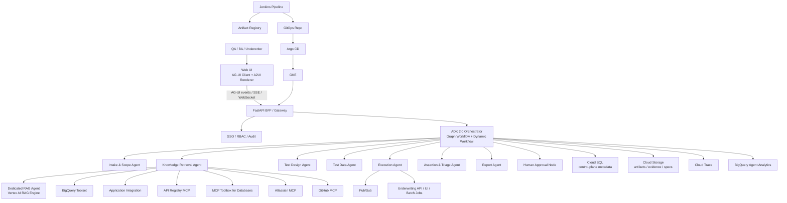

下面我把它設計成一個 **「以 ADK 2.0 為核心的軟體品質測試平台」**，專門服務保險核保系統的需求分析、測試設計、測試執行、結果判讀、缺陷回報與持續優化。先講一個最重要的前提：**ADK 2.0 的 graph workflows、dynamic workflows、human input 都還是 Alpha；A2A 仍是 Experimental；Tool Confirmation 是 Experimental；BigQuery Agent Analytics 與 Google Cloud API Registry integrations 仍是 Preview。** 所以這個平台很適合做成「可逐步開關、可回退、可分層隔離」的企業級架構，而不是把所有新能力一次塞進單一執行流程。([Google GitHub][1])

## 一、我建議的整體定位

這個平台不要做成單一 giant agent，而要做成 **FastAPI 控制平面 + ADK 工作流編排層 + GCP 資料/知識平面 + GitOps 交付平面**。ADK 的強項是把 agent、tools、sessions、callbacks/plugins、evaluation、deployment 串起來，ADK 2.0 則進一步用 graph workflow 讓流程可控、可分支、可加入 human-in-the-loop；對測試平台這類「要有審批、要可追溯、要可重跑」的場景特別合適。([Google GitHub][2])

## 二、參考架構圖

這張圖的核心意思很簡單：**AG-UI 負責人與 agent 的即時互動，A2UI 負責把 agent 回傳的結構化 JSON 變成卡片、表單、表格、圖表；FastAPI 當企業入口與治理邊界；ADK 2.0 workflow 負責測試流程編排；GCP 服務負責知識、資料、事件與觀測；Jenkins + ArgoCD 負責從程式碼到 GKE 的可審計交付。** AG-UI 本身就是處理 streaming events、client state 與雙向互動的協定；A2UI 則是 transport-agnostic 的 generative UI 規格，可透過 A2A、MCP、REST、WebSocket 等傳遞。FastAPI 適合同時提供 SSE 與 WebSocket；Jenkins Pipeline 與 Jenkinsfile 支援 pipeline-as-code；Argo CD 則是 Kubernetes 的 declarative GitOps CD。([Google GitHub][3])

## 三、四種協定 / 介面的分工

### 1. AG-UI：前端互動通道

AG-UI 用來承接「聊天、串流、狀態同步、使用者操作回饋」；前端可以是 React/CopilotKit 類型的 client，後端則由 FastAPI 直接發送 AG-UI 事件流。這一層只負責 **Agent ↔ User Interaction**。([Google GitHub][3])

### 2. A2UI：畫面元件輸出格式

A2UI 用來承接 agent 回傳的 **卡片、表單、圖表、表格**。它不是聊天通道，而是 UI payload 格式。最適合用在測試平台裡的「測試案例矩陣、覆蓋率儀表板、失敗摘要卡、審批表單」。([Google GitHub][4])

### 3. MCP：工具 / 資料 / Prompt 標準接法

MCP 是讓 agent 接外部系統的標準連接面，ADK 可以當 MCP client 用外部 server 的 tools，也能把 ADK 工具包成 MCP server。MCP 規格使用 JSON-RPC，標準 transport 包含 stdio 與 Streamable HTTP。這很適合接企業資料庫、知識庫、GitHub、Jira、Cloud APIs。([Google GitHub][5])

### 4. A2A：遠端專家代理協作

A2A 適合把某些專職能力獨立成遠端 agent，例如「RAG 專家 agent」「測試執行 agent」「缺陷歸因 agent」。ADK 可以把既有 agent 暴露成 A2A server，也可以消費 remote agent；agent card 則用來描述該 agent 的能力。若平台要做 streaming remote agents，建議啟用 A2A extension，以降低訊息重複、資料遺失與輸出誤分類問題。([Google GitHub][6])

---

## 四、平台核心設計重點

### 1. 編排層：Graph workflow 負責主流程，Dynamic workflow 負責長流程與重試

Graph workflow 很適合把測試平台主流程拆成 **需求解析 → 檢索 → 測試設計 → 測試資料 → 審批 → 執行 → 斷言 → 缺陷 → 報告** 這種明確節點；每個節點可以是 agent、tool、human input 或程式函式，而且節點之間用 Events 傳遞 output / message / state。對測試平台來說，這比單一 prompt agent 更可靠、更可審計。([Google GitHub][2])

Dynamic workflow 則更適合處理 **重跑、輪詢、等待人工審批、長時間批次測試、恢復執行**。它支援 loop、conditionals、async/await，而且有 automatic checkpointing，能在流程中斷後恢復。這對 UI 自動化、批次回歸測試、等待外部核保批次結果的場景非常實用。([Google GitHub][7])

### 2. 檢索層：RAG 與 BigQuery 分工，不要混成一個萬能 agent

**非結構化知識**（核保規則文件、SOP、API spec、測試規格、Confluence 頁面）放進 Vertex AI RAG Engine 或 Vertex AI Search；**結構化歷史資料**（歷次測試結果、缺陷、覆蓋率、執行紀錄）放 BigQuery。這樣可以把「文件型知識檢索」和「分析型資料查詢」拆開。Vertex AI RAG Engine 的 `vertex_ai_rag_retrieval` 以及 Vertex AI Search tool 都有 **single-tool-per-agent limitation**，因此實作上應把它們做成 **專用 retrieval agent**，再用 graph node 或 A2A 接回主流程，而不是跟其他大量工具塞在同一個 agent。([Google GitHub][8])

BigQuery 這邊建議兩個用途並行：第一個是 **查詢歷次測試與缺陷資料**；第二個是 **相似案例檢索**。ADK 的 BigQueryToolset 可做 dataset/table discovery、`execute_sql`、異常偵測、自然語言資料洞察，也能透過 `WriteMode.BLOCKED` 直接把代理限制成只讀，避免測試平台 agent 直接改動分析資料。BigQuery 本身也支援 `VECTOR_SEARCH`。([Google GitHub][9])

### 3. 整合層：原生工具 + MCP + Application Integration 三線並行

原生 GCP 工具建議直接用 ADK integrations，例如 BigQuery、Vertex AI RAG Engine、Pub/Sub、Cloud Trace。若你要讓 agent 動態發現 Google Cloud 服務，則可透過 Google Cloud API Registry 以 MCP server 形式暴露 Cloud APIs。若要連保險公司既有核心系統、Jira、SAP、ServiceNow 或 on-prem 服務，Application Integration 會比自己逐一包工具更省事，因為它支援 100+ connectors，還支援 federated search。若重點是資料庫與資料平台，則用 MCP Toolbox for Databases，比自己維護連線池與驗證要穩定。([Google GitHub][10])

### 4. 技能層：用 Skills 管提示詞與專業能力，而不是把規則堆在 system prompt

ADK Skills 是這個平台的關鍵。Skills 允許把能力拆成 **L1 metadata、L2 instructions、L3 resources**，並且按需載入，以降低 context window 浪費。官方結構就是 `SKILL.md + references/ + assets/ + scripts/`。對核保測試平台，我建議至少拆成這幾組 skill：
`underwriting_rule_interpreter`、`test_design_boundary_equivalence`、`api_contract_assertion`、`pii_guardrail`、`defect_ticket_writer`、`a2ui_report_renderer`。([Google GitHub][11])

我建議把提示詞管理庫設計成兩層：
第一層是 **skills/**，放 agent 執行時要動態載入的專業知識；
第二層是 **prompts/**，放固定版本的 system prompt、rubrics、A2UI response templates、eval rubrics。
版本控制全部進 Git，並把 `prompt_version / skill_version / model_version` 寫入 Cloud SQL 與 BigQuery，讓每次測試結果可以完整追溯到當時的 agent 行為版本。這一段是我的實作建議。

### 5. 安全層：plugin 優先、callback 補位、HITL 負責最後閘門

官方文件明確建議：做安全護欄時，**Plugins 比 Callbacks 更適合做跨 agent 的 reusable policy**；Callbacks 則適合 agent-specific 的 before/after 檢查。對這個平台來說，plugin 應做「資料分級、環境分級、工具白名單、PII policy、審批政策」；callback 則做「某個 agent 專屬的參數檢核」。此外，ADK 2.0 的 human input node 不需要 AI model 參與，所以比把審批交給 LLM 更可預測；Tool Confirmation 則適合做工具層級的 yes/no 或 structured approval。([Google GitHub][12])

### 6. 觀測與評估：把 agent 自己也當成被測系統

這個平台不只測「核保系統」，也要測「測試 agent 自己」。ADK evaluation 已有 `tool_trajectory_avg_score`、response quality、hallucinations、safety、user simulation；其中 tool trajectory 對測試平台尤其重要，因為你會希望代理每次都遵循正確的流程順序。觀測層則建議同時上 BigQuery Agent Analytics 與 Cloud Trace：前者把 agent 事件寫進 BigQuery，還包含 tool provenance 與 HITL tracing；後者用 OpenTelemetry compatible tracing 幫你看哪個節點最慢、哪個工具最常失敗。([Google GitHub][13])

---

## 五、GCP 服務分工建議

### Cloud Storage

放 **測試規格文件、API Swagger/OpenAPI、螢幕截圖、執行錄影、log bundle、報告 PDF、匯出的 evidence 包**。Cloud Storage 是 managed object storage，適合 artifacts 與大型檔案。([Google Cloud Documentation][14])

### Cloud SQL

放 **控制平面資料**：`test_request`、`test_run`、`approval_task`、`environment_profile`、`prompt_registry`、`skill_registry`、`defect_link`。Cloud SQL 是 fully managed relational database，對審批、追蹤、審計、報表關聯最合適。([Google Cloud Documentation][15])

### BigQuery

放 **分析平面資料**：`run_events`、`assertion_results`、`coverage_metrics`、`failure_clusters`、`historical_defects_embeddings`、`agent_eval_results`。這裡要承接 ADK BigQuery Agent Analytics 與你的自定義測試結果寫入。BigQuery 也很適合做趨勢分析、相似缺陷檢索與回歸風險排序。([Google GitHub][16])

### Vertex AI / Vertex AI RAG Engine

用於 **模型推理 + 企業知識檢索**。如果你要 enterprise-grade model hosting，可把 model endpoint 直接交給 ADK 的 `model` 參數；如果要做文件型 RAG，就把核保規則、流程文件、產品說明、歷次缺陷根因報告建成 RAG corpus。([Google GitHub][17])

### Pub/Sub

用於 **長流程解耦**：例如觸發批次測試、接收外部系統完成事件、將執行狀態推送到 worker。ADK 也已有 PubSubToolset。([Google GitHub][18])

---

## 六、保險核保測試案例：詳細流程設計

以下我用一個假設案例來說明。
**被測系統：** `POST /underwriting/evaluate`
**假設規則：**

1. 年齡 > 60 或保額 ≥ 1,500 萬，需要進一步人工審核。
2. 吸菸 + 高血壓病史不得自動核准。
3. 缺少健康問卷欄位時，API 應回傳 validation error。
4. 回應要帶 decision、reason_codes、rule_reference、audit_id。

這些規則本身是案例假設，用來展示平台怎麼運作。

### 流程 1：需求輸入與 Session 建立

QA、BA 或核保產品經理在前端輸入測試目標，例如：
「請為 45 歲、吸菸、有高血壓、保額 1,500 萬的核保案例，產生完整 API 測試與邊界測試，並檢查 decision、reason_codes、audit_id 是否正確。」

前端用 AG-UI 傳送請求；FastAPI 建立 `test_request`、`session_id`、`run_id`，把使用者身分、環境、資料分級寫入控制平面。ADK Session 會保留這次互動的 events 與 state，供後續節點共用。([Google GitHub][3])

### 流程 2：Intake Agent 做範圍解析

`Intake Agent` 做三件事：

1. 判斷是 API 測試、規則測試、回歸測試，還是端到端測試。
2. 抽取產品、核保因子、風險欄位、預期輸出欄位。
3. 把這些結果寫入 workflow `state`，成為後續節點共享資料。

在 ADK 2.0 裡，這一步最適合做成 graph node，因為資料會透過 Event 的 `output/state` 傳給下游。([Google GitHub][19])

### 流程 3：Knowledge Retrieval Agent 組裝測試上下文

這一步不是只查文件，而是做 **雙檢索**：

第一條線查 **RAG corpus**：抓核保規則、產品說明、API 規格、SOP、例外處理規則。
第二條線查 **BigQuery**：抓相似歷史缺陷、過去測試失敗模式、相似風險因子的案例。

如果要查 Jira/Confluence，接 Atlassian MCP；如果要查核心系統或其他企業應用，接 Application Integration；如果要查資料庫 schema 或對照表，接 MCP Toolbox for Databases。由於 Vertex AI RAG/Search tool 存在單工具限制，我建議把這一步做成 **Dedicated Retrieval Agent**，主流程只接它的結果。([Google GitHub][8])

### 流程 4：Test Design Agent 產生測試案例矩陣

`Test Design Agent` 會套用 skills 與提示詞庫，輸出一份結構化測試矩陣。建議至少生成這幾類案例：

* **主案例**：45 歲、吸菸、高血壓、保額 1,500 萬，預期 `decision = REFER`。
* **邊界案例 A**：保額 14,999,999，驗證是否仍遵循疾病條件而非金額條件。
* **邊界案例 B**：保額 15,000,000，驗證人工審核門檻。
* **負向案例**：缺少健康問卷欄位，預期 validation error。
* **一致性案例**：decision、reason_codes、rule_reference、audit_id 四者是否一致。
* **回歸案例**：抓過去相似 defect 的 3～5 筆模式重放。

這一段的關鍵不是「寫出測試步驟」，而是把 **測試 oracle 也一起產生**：預期 decision、預期 reason_codes、預期資料庫 side effects、預期 event、預期 UI 顯示。這是平台的價值所在。Skills 的好處是把核保規則理解、邊界分析、API 斷言分別模組化，不必把所有規則塞進一大段 prompt。([Google GitHub][11])

### 流程 5：Test Data Agent 生成測試資料

`Test Data Agent` 依照需求產出測試 payload、對照資料與必要的 mock/fixture。這一步要特別做三件事：

1. **只用合成資料或已遮罩資料**。
2. 若需要映射對照表（產品代碼、核保規則版本、風險等級），透過 MCP Toolbox / Database tool 查只讀資料。
3. 若測試會碰到真實外部寫入動作，先進 HITL。

BigQueryToolset 可以設成 `WriteMode.BLOCKED`；GitHub MCP 也能用 `X-MCP-Readonly: true`。因此平台的預設策略應該是 **read-only by default**。([Google GitHub][9])

### 流程 6：Human Approval Node / Tool Confirmation

對保險場景，下面幾種狀況必須停下來等人：

* 要切換到 UAT / pre-prod。
* 要讀取高敏資料欄位。
* 要建立或更新 Jira/GitHub 工單。
* 要執行可能改動資料的 setup / cleanup。

這裡我建議 **主流程用 Human Input Node**，因為它本身就設計成 workflow 裡的 HITL 節點，且不依賴模型；**工具層用 Tool Confirmation**，例如在「真的要建立 Jira Ticket 嗎？」時做 yes/no 或 structured approval。([Google GitHub][20])

### 流程 7：Execution Agent 執行測試

`Execution Agent` 不是單一執行器，而是 orchestration agent，底下可再拆：

* `ApiExecutor`：呼叫核保 API。
* `DbValidator`：查核對照表、審計資料或事件落地狀況。
* `EventValidator`：檢查 Pub/Sub 或 downstream event。
* `UiValidator`：若有前台核保畫面，再做 UI 驗證。

若執行時間較長，這一段建議做成 dynamic workflow，因為會碰到等待、輪詢、分支與 checkpoint recovery。([Google GitHub][7])

### 流程 8：Assertion & Triage Agent 做結果判讀

這一步是整個平台最重要的「智慧斷言」層。它不只比對 HTTP status，而是綜合：

* 實際回應欄位
* 規則文件檢索片段
* 歷史相似案例
* event / audit log
* 可能的 side effects

然後輸出：

* 是否通過
* 失敗類型（規則錯、資料錯、欄位錯、環境錯、flake）
* 根因假說
* 建議 defect owner

如果 failure pattern 與歷史 defect 高相似，就直接標記「疑似回歸」。這一層建議把結果寫 BigQuery，後續才能做 defect clustering 與 release risk ranking。這部分屬於平台設計建議。

### 流程 9：Defect Agent 自動建立 Jira / GitHub 工作項目

若 triage 結果是高信心 defect：

* 用 Atlassian MCP 建 Jira issue，附上規則引用、測試 payload、失敗 evidence、trace link。
* 若是 code-facing 團隊，也可用 GitHub MCP 連 issue / PR / code scanning。
* 若還不到自動開單門檻，就先產生 A2UI defect draft card，讓 QA 一鍵確認後再送出。

Atlassian MCP 支援 Jira/Confluence 搜尋與 issue 管理；GitHub MCP 可讀 repo、issue、PR，也可設定只讀模式。([Google GitHub][21])

### 流程 10：Report Agent 以 A2UI 呈現成果

最後由 `Report Agent` 輸出 A2UI JSON，前端渲染成：

* 測試總結卡
* 覆蓋率表格
* 失敗分類圖
* 缺陷卡片
* 審批按鈕
* 規則引用區塊

AG-UI 負責把執行過程中的中間事件串流給前端，例如 `planning...`、`retrieving...`、`approval_required...`、`running...`、`failed...`、`report_ready...`；A2UI 則負責最終的 rich widgets。([Google GitHub][3])

---

## 七、這個案例的實際輸出會長怎樣

對上述核保案例，平台應至少產出以下 5 類成果：

### 1. 測試案例集

例如：

* TC-001 主案例：吸菸 + 高血壓 + 1,500 萬 → `REFER`
* TC-002 邊界：1,499 萬 → 驗證是否仍因疾病條件而 `REFER`
* TC-003 欄位缺漏：無健康問卷 → `400/422`
* TC-004 一致性：`reason_codes` 與 `rule_reference` 必須對齊
* TC-005 審計：`audit_id` 必須寫入審計資料表或事件

### 2. 測試資料包

* applicant payload JSON
* 對照表查詢結果
* 預期 response schema
* 斷言腳本

### 3. 執行證據

* request / response
* trace id
* screenshots / HAR / logs
* DB query result snapshots
* rule citation snippets

### 4. 缺陷草稿或正式工單

* defect title
* suspected root cause
* impacted rules
* reproduction steps
* evidence bundle URL

### 5. 管理儀表板

* 本次測試覆蓋規則數
* 回歸風險分數
* 高風險失敗數
* 歷史相似 defect 連結
* 是否需要人工覆核

這些輸出本身是我的平台設計建議；其中 A2UI 最適合承接卡片/表格/圖表這類成果。([Google GitHub][4])

---

## 八、安全性與治理設計

### 1. 預設只讀

資料查詢型 agent 全部預設 read-only。BigQuery 用 `WriteMode.BLOCKED`；GitHub MCP 用 `X-MCP-Readonly: true`；資料庫類查詢工具也應用 MCP Toolbox 的受控認證與參數綁定，並把敏感參數藏在模型不可見的 bound params。([Google GitHub][9])

### 2. 憑證策略

在 GKE 上一律走 **ADC / Workload Identity**，不要把 service account key 檔塞進容器。BigQueryToolset 與 MCP Toolbox 都支援這種模式。([Google GitHub][9])

### 3. Guardrails 分層

* **System instruction**：限制模型輸出風格、禁止敏感內容。
* **Plugin**：跨 agent 的 PII / environment / action policy。
* **Callback**：單一 agent 的參數前檢。
* **HITL / Tool Confirmation**：最後人工閘門。([Google GitHub][22])

### 4. 版本隔離

若組織裡同時有 ADK 1.x 與 2.0，**session / memory / eval storage 不可混用**。實作上就把 GCS bucket、BigQuery dataset、Cloud SQL schema 分開。([Google GitHub][1])

---

## 九、CI/CD 與部署方式

你指定 Jenkins + ArgoCD，我會這樣落地：

### Jenkins：負責 Build/Test/Package

Jenkins Pipeline 本身就是 pipeline-as-code，建議所有流程寫進 `Jenkinsfile`，讓 agent code、skills、prompts、eval sets、deployment manifests 一起進 code review。([Jenkins][23])

建議 stages：

1. `lint_and_unit_test`
2. `agent_smoke_test`
3. `adk_eval_suite`
4. `security_scan`
5. `build_container`
6. `push_artifact_registry`
7. `update_gitops_repo`

### ArgoCD：負責 Kubernetes GitOps 部署

Argo CD 是 Kubernetes 的 declarative GitOps CD，適合管 dev / uat / prod 三環境。你可以把 FastAPI、worker、UI、config、secrets、CronJobs 全部宣告成 manifests/Helm/Kustomize，由 ArgoCD 對齊 desired state 與 live state。([Argo CD][24])

### GKE：作為執行底座

因為你要 FastAPI + Jenkins + ArgoCD，GKE 會比 Cloud Run 更自然。ADK 官方也把 GKE 定位成「需要更多部署控制」時的選項。([Google GitHub][25])

### Sync Waves：控制部署順序

ArgoCD 可用 sync phases / sync waves 先後部署：

* wave 0：namespace、CRDs、base config
* wave 1：DB migration / secret references
* wave 2：FastAPI backend / ADK orchestrator
* wave 3：workers / async executors
* wave 4：frontend
* wave 5：post-sync smoke tests

這樣能確保依賴順序正確。([Argo CD][26])

---

## 十、實作上的關鍵取捨

### 我建議先這樣做

**Phase 1：** 先用 local sub-agents + graph workflow，把 RAG、BigQuery、AG-UI、A2UI、BigQuery Analytics、Cloud Trace 跑起來。
**Phase 2：** 再把專職 retrieval / execution / triage agent 拆成 remote A2A agents。
**Phase 3：** 最後才導入閉環優化：ADK eval、user simulation、optimize、回歸風險模型。

原因很簡單：ADK 2.0 graph / dynamic workflow 很適合主流程，但 A2A、tool confirmation、部分 integrations 仍在 experimental / preview 階段，應該用漸進式 rollout。([Google GitHub][1])

### 我最推薦的落地組合

若你要一個「可實作、可治理、可審計」的版本，我會選：

* **前端**：React + CopilotKit 類 AG-UI client + A2UI renderer
* **後端**：FastAPI
* **編排**：ADK 2.0 Graph Workflow + Dynamic Workflow
* **模型**：Vertex AI hosted model
* **知識檢索**：Dedicated RAG Agent + Vertex AI RAG Engine
* **分析資料**：BigQuery
* **控制資料**：Cloud SQL
* **Artifacts**：Cloud Storage
* **企業整合**：Application Integration + MCP Toolbox + Atlassian MCP + GitHub MCP
* **觀測**：Cloud Trace + BigQuery Agent Analytics
* **部署**：GKE + Jenkins + ArgoCD

這樣的好處是：**前台互動、後台流程、資料平面、審批治理、部署管線都有清楚邊界**，而且每一層都能單獨替換或擴充。([Google GitHub][3])

---

## 一句話總結

這個平台最好的設計不是「一個會聊天的測試機器人」，而是：

**用 FastAPI 當企業入口，ADK 2.0 workflow 當測試編排核心，AG-UI/A2UI 當互動介面，BigQuery + RAG + Storage + Database 當知識與證據平面，再用 Jenkins + ArgoCD + GKE 把它變成可治理的保險核保測試平台。**

下一則可直接接著做 **「FastAPI + ADK 專案目錄結構」** 與 **「agent / skills / prompts / tables 命名範本」**。

[1]: https://google.github.io/adk-docs/2.0/ "https://google.github.io/adk-docs/2.0/"
[2]: https://google.github.io/adk-docs/workflows/ "https://google.github.io/adk-docs/workflows/"
[3]: https://google.github.io/adk-docs/integrations/ag-ui/ "https://google.github.io/adk-docs/integrations/ag-ui/"
[4]: https://google.github.io/adk-docs/integrations/a2ui/ "https://google.github.io/adk-docs/integrations/a2ui/"
[5]: https://google.github.io/adk-docs/mcp/ "https://google.github.io/adk-docs/mcp/"
[6]: https://google.github.io/adk-docs/a2a/ "https://google.github.io/adk-docs/a2a/"
[7]: https://google.github.io/adk-docs/workflows/dynamic/ "https://google.github.io/adk-docs/workflows/dynamic/"
[8]: https://google.github.io/adk-docs/integrations/vertex-ai-rag-engine/ "https://google.github.io/adk-docs/integrations/vertex-ai-rag-engine/"
[9]: https://google.github.io/adk-docs/integrations/bigquery/ "https://google.github.io/adk-docs/integrations/bigquery/"
[10]: https://google.github.io/adk-docs/integrations/api-registry/ "https://google.github.io/adk-docs/integrations/api-registry/"
[11]: https://google.github.io/adk-docs/skills/ "https://google.github.io/adk-docs/skills/"
[12]: https://google.github.io/adk-docs/plugins/ "https://google.github.io/adk-docs/plugins/"
[13]: https://google.github.io/adk-docs/evaluate/criteria/ "https://google.github.io/adk-docs/evaluate/criteria/"
[14]: https://docs.cloud.google.com/storage/docs/introduction "https://docs.cloud.google.com/storage/docs/introduction"
[15]: https://docs.cloud.google.com/sql/docs/introduction "https://docs.cloud.google.com/sql/docs/introduction"
[16]: https://google.github.io/adk-docs/integrations/bigquery-agent-analytics/ "https://google.github.io/adk-docs/integrations/bigquery-agent-analytics/"
[17]: https://google.github.io/adk-docs/agents/models/vertex/ "https://google.github.io/adk-docs/agents/models/vertex/"
[18]: https://google.github.io/adk-docs/integrations/pubsub/ "https://google.github.io/adk-docs/integrations/pubsub/"
[19]: https://google.github.io/adk-docs/workflows/data-handling/ "https://google.github.io/adk-docs/workflows/data-handling/"
[20]: https://google.github.io/adk-docs/workflows/human-input/ "https://google.github.io/adk-docs/workflows/human-input/"
[21]: https://google.github.io/adk-docs/integrations/atlassian/ "https://google.github.io/adk-docs/integrations/atlassian/"
[22]: https://google.github.io/adk-docs/safety/ "https://google.github.io/adk-docs/safety/"
[23]: https://www.jenkins.io/doc/book/pipeline/ "https://www.jenkins.io/doc/book/pipeline/"
[24]: https://argo-cd.readthedocs.io/ "https://argo-cd.readthedocs.io/"
[25]: https://google.github.io/adk-docs/deploy/ "https://google.github.io/adk-docs/deploy/"
[26]: https://argo-cd.readthedocs.io/en/stable/user-guide/sync-waves/ "https://argo-cd.readthedocs.io/en/stable/user-guide/sync-waves/"
