下面我把原本的「參考架構圖」改寫成**依技術層分群、由上而下**的專案技術架構圖。重點是讓你一眼看出：

* 使用者從哪一層進來
* 前端 / 平台入口 / ADK 編排 / 資料與整合 / 被測系統 / 維運部署，各自屬於哪一層
* 每層的技術責任與主要元件

---

# 技術分層說明

## 1. 體驗層（Experience Layer）

給 QA、BA、核保人員、測試管理者使用的操作入口。

包含：

* AG-UI Client
* A2UI Renderer
* Web Portal / Dashboard

這層負責：

* 對話互動
* 測試任務提交
* 結果卡片 / 表格 / 報表呈現
* 人工審批操作

---

## 2. 應用接入層（Application Access Layer）

平台的統一入口與治理邊界。

包含：

* FastAPI Gateway / BFF
* SSO / IAM / RBAC
* Audit Logging
* API Rate Limit / Request Validation

這層負責：

* 驗證使用者身分
* 統一 API 入口
* 把前端請求轉成平台內部任務
* 控制權限與審計紀錄

---

## 3. Agent 編排層（ADK Orchestration Layer）

整個平台的核心控制層。

包含：

* ADK 2.0 Graph Workflow
* Dynamic Workflow
* Session Manager
* State / Event Handling
* Human-in-the-Loop Node
* Tool Confirmation

這層負責：

* 編排整體測試流程
* 管理 agent 間的節點流轉
* 控制分支、重試、等待審批
* 保存 session / state / event

---

## 4. 智能代理層（Agent Intelligence Layer）

把不同測試任務拆成專職代理。

包含：

* Intake Agent
* Retrieval Agent
* Test Design Agent
* Test Data Agent
* Execution Agent
* Assertion / Triage Agent
* Report Agent

這層負責：

* 理解需求
* 查找知識
* 生成測試案例
* 組裝測試資料
* 執行測試
* 判讀結果
* 輸出報告

---

## 5. 能力與協定層（Capability & Protocol Layer）

提供 agent 對外互通與能力擴充。

包含：

* Skills Library
* Prompt Registry
* MCP Tools
* A2A Remote Agents
* Plugins / Callbacks

這層負責：

* 管理提示詞與技能
* 接外部工具與系統
* 支援 agent-to-agent 協作
* 套用安全與治理規則

---

## 6. 資料與知識層（Data & Knowledge Layer）

平台的知識來源、執行資料、分析資料都放在這裡。

包含：

* Vertex AI / Vertex AI RAG Engine
* BigQuery
* Cloud SQL / Database
* Cloud Storage
* Prompt / Skill Repositories

這層負責：

* 文件檢索
* 歷史測試與缺陷分析
* 控制平面資料保存
* 報告與證據檔案保存

---

## 7. 企業整合層（Enterprise Integration Layer）

串接內外部業務系統與開發工具。

包含：

* Underwriting API / Core System
* Application Integration
* API Registry
* MCP Toolbox for Databases
* Jira / Confluence / GitHub
* Pub/Sub / Event Bus

這層負責：

* 呼叫被測系統
* 存取企業資料
* 建缺陷單
* 接收與發送事件

---

## 8. 平台維運層（Platform Ops Layer）

確保平台可部署、可觀測、可持續交付。

包含：

* Jenkins
* Argo CD
* GKE
* Artifact Registry
* Observability / Trace / Metrics / Logs
* Evaluation / Safety Guardrails

這層負責：

* CI/CD
* GitOps 部署
* 監控追蹤
* 模型與 agent 品質評估
* 安全治理

---

# 由上而下技術架構圖

```mermaid
flowchart TB

    %% 1 Experience Layer
    subgraph L1[1. 體驗層 Experience Layer]
        U1[QA / BA / 核保人員 / 測試管理者]
        UI1[AG-UI Client]
        UI2[A2UI Renderer]
        UI3[Web Portal / Dashboard]
        U1 --> UI1
        U1 --> UI2
        U1 --> UI3
    end

    %% 2 Access Layer
    subgraph L2[2. 應用接入層 Application Access Layer]
        API[FastAPI Gateway / BFF]
        AUTH[SSO / IAM / RBAC]
        AUDIT[Audit Logging / Request Validation]
    end

    %% 3 Orchestration Layer
    subgraph L3[3. ADK 編排層 Orchestration Layer]
        ORCH[ADK 2.0 Graph Workflow]
        DYN[Dynamic Workflow]
        SES[Session / State Manager]
        EVT[Events / Callbacks]
        HITL[Human-in-the-Loop]
        CONFIRM[Tool Confirmation]
    end

    %% 4 Agent Layer
    subgraph L4[4. 智能代理層 Agent Intelligence Layer]
        A1[Intake Agent]
        A2[Knowledge Retrieval Agent]
        A3[Test Design Agent]
        A4[Test Data Agent]
        A5[Execution Agent]
        A6[Assertion / Triage Agent]
        A7[Report Agent]
    end

    %% 5 Capability Layer
    subgraph L5[5. 能力與協定層 Capability & Protocol Layer]
        SKILL[Skills Library]
        PROMPT[Prompt Registry]
        MCP[MCP Tools]
        A2A[A2A Remote Agents]
        PLUGIN[Plugins / Safety Policies]
    end

    %% 6 Data Layer
    subgraph L6[6. 資料與知識層 Data & Knowledge Layer]
        VERTEX[Vertex AI / RAG Engine]
        BQ[BigQuery]
        SQL[Cloud SQL / Database]
        GCS[Cloud Storage]
        REPO[Prompt / Skill Repository]
    end

    %% 7 Integration Layer
    subgraph L7[7. 企業整合層 Enterprise Integration Layer]
        UW[Underwriting API / 核保核心系統]
        APPINT[Application Integration]
        APIREG[API Registry]
        DBTOOL[MCP Toolbox for Databases]
        PM[Jira / Confluence / GitHub]
        PUBSUB[Pub/Sub / Event Bus]
    end

    %% 8 Ops Layer
    subgraph L8[8. 平台維運層 Platform Ops Layer]
        JENKINS[Jenkins]
        ARGO[Argo CD]
        GKE[GKE]
        ARTI[Artifact Registry]
        OBS[Observability / Trace / Metrics / Logs]
        EVAL[Evaluation / Safety Guardrails]
    end

    %% top-down connections
    UI1 --> API
    UI2 --> API
    UI3 --> API

    API --> AUTH
    API --> AUDIT
    API --> ORCH

    ORCH --> DYN
    ORCH --> SES
    ORCH --> EVT
    ORCH --> HITL
    ORCH --> CONFIRM

    ORCH --> A1
    ORCH --> A2
    ORCH --> A3
    ORCH --> A4
    ORCH --> A5
    ORCH --> A6
    ORCH --> A7

    A1 --> SKILL
    A2 --> MCP
    A2 --> A2A
    A3 --> PROMPT
    A4 --> SKILL
    A5 --> MCP
    A6 --> PLUGIN
    A7 --> PROMPT

    SKILL --> REPO
    PROMPT --> REPO
    MCP --> VERTEX
    MCP --> BQ
    MCP --> SQL
    MCP --> GCS

    A2A --> APPINT
    MCP --> APIREG
    MCP --> DBTOOL

    A5 --> UW
    A5 --> PUBSUB
    A6 --> PM
    A7 --> GCS

    JENKINS --> ARTI
    JENKINS --> ARGO
    ARGO --> GKE
    GKE --> API
    GKE --> ORCH
    OBS --> ORCH
    OBS --> A5
    EVAL --> ORCH
```

---

# 架構閱讀方式

這張圖可以用 4 個主軸來理解。

## 第一條主軸：使用者互動流

`使用者 → AG-UI / A2UI → FastAPI → ADK Workflow`

意思是：

* 使用者從前端送出測試需求
* FastAPI 接住請求
* ADK workflow 開始編排整個測試流程

---

## 第二條主軸：Agent 執行流

`Orchestrator → Intake → Retrieval → Test Design → Test Data → Execution → Triage → Report`

意思是：

* 每一個 agent 只做一種專職工作
* 用 workflow 控制先後順序與條件分支
* 最後回到報告輸出

---

## 第三條主軸：資料與知識流

`Skills / Prompt / MCP / A2A → BigQuery / RAG / Storage / DB / 外部系統`

意思是：

* agent 本身不直接硬寫所有知識
* 透過 skills、prompt registry、MCP、A2A 去取用外部能力
* 讓平台具備可維護性與可擴充性

---

## 第四條主軸：交付與維運流

`Jenkins → Artifact Registry → Argo CD → GKE → Platform Runtime`

意思是：

* 程式碼提交後由 Jenkins 建置
* 映像檔推到 Artifact Registry
* Argo CD 依 GitOps 規則部署到 GKE
* 平台在 GKE 上執行並被監控

---

# 最後整理成一句話

這張「由上而下技術架構圖」的核心邏輯是：

**上層是人機互動，中層是 ADK 工作流與專職代理編排，下層是資料知識與企業整合，最底層則是 CI/CD、部署與維運治理。**

若你要，我下一步可以直接幫你畫成 **更正式的簡報版架構圖**，例如：

1. 管理層簡報版
2. 技術團隊實作版
3. 核保測試案例流程版
