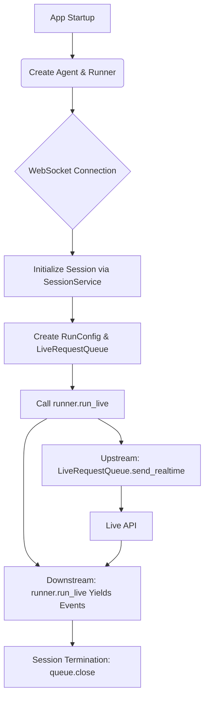

歡迎回到這份深度技術筆記。我是你們的資深技術導師。

在理解了雙向串流（Bidi-streaming）的運作本質後，我們必須進入實驗室，拆解驅動這一切的「積木」。在更大的核心技術脈絡下，Google 的代理程式開發套件（ADK）並非單一工具，而是一套精密的架構體系。它將複雜的 WebSocket 管理、狀態持久化與工具編排，解構成數個具備明確職責的**核心組件**。

這堂課，我們將深度剖析這些組件如何在架構中各司其職。

---

### 📌 ADK 架構組件學習地圖

1.  **四大核心基石**：`Agent`、`Runner`、`LiveRequestQueue` 與 `RunConfig` 的職責邊界。
2.  **執行態的靈魂：InvocationContext**：解構對話狀態的隱形載體。
3.  **持久化層：SessionService**：跨越連線限制的記憶管理。
4.  **組件互動邏輯**：從初始化到事件循環的實戰流向。

---

### 一、 ADK 組件職責對照表

在架構設計中，最重要的一點是區分「全域共享（Stateless）」與「會話特定（Stateful）」的組件。這直接影響了系統的擴展性與資源管理。

| 組件名稱 | 職責定義 | 生命週期與狀態 |
| :--- | :--- | :--- |
| **Agent** | 定義 AI 的人格、模型、特定指令與可用工具。 | **無狀態且可重用**：啟動時建立一次，供所有連線共享。 |
| **Runner** | 執行引擎，負責編排對話、管理狀態並提供 `run_live()` 介面。 | **全域共享**：在應用程式啟動時建立一次，管理多個並行會話。 |
| **LiveRequestQueue** | 訊息隊列，緩衝文字、音訊與控制訊號。 | **會話特定且有狀態**：每個對話必須新建，且結束時必須關閉。 |
| **RunConfig** | 宣告式配置，定義回應模態（TEXT/AUDIO）、VAD 與恢復功能。 | **會話特定**：可針對不同使用者或情境進行客製化配置。 |

---

### 二、 核心組件深度解析：從「定義」到「執行」

#### 1. Agent：AI 的大腦
Agent 是應用的核心，它不管理連線，只負責定義「該做什麼」。您可以配置特定的模型（如原生音訊模型）與工具（如 Google 搜尋）。

#### 2. LiveRequestQueue：上游訊息的守護者
這是 ADK 最關鍵的抽象之一。它是一個執行緒安全的非同步隊列，將複雜的 WebSocket 傳輸簡化為簡單的 API 方法：
*   `send_content()`：發送文字回合。
*   `send_realtime()`：發送音訊/影像/視訊 Blob。
*   `close()`：發送優雅關閉訊號。

#### 3. Runner 與 run_live()：對話的指揮家
Runner 負責將所有組件組合在一起。`run_live()` 是一個**非同步產生器**，它將底層 Live API 的事件轉化為應用程式可以輕鬆遍歷的 `Event` 物件。

#### 4. InvocationContext：隱形的執行狀態容器
**這代表什麼？** 在內部，每次呼叫 `run_live()` 都會建立一個 `InvocationContext`。它是隨對話移動的「筆記本」，記錄了 `invocation_id`、當前 `session` 狀態以及工具執行進度。雖然開發者通常不直接操作它，但它是實現多代理程式切換與狀態持久化的技術關鍵。

---

### 三、 邏輯具象化：組件互動時序圖

當您啟動一個雙向串流服務時，各組件的互動邏輯如下：


*(參考來源：)*

---

### 四、 代碼即真理：組件組合實戰

在來源資料的 FastAPI 範例中，我們可以清晰看到這四大組件是如何協同工作的：

```python
# [導師點評]：Phase 1 - 全域初始化
# 建立 SessionService 與 Runner，這在所有使用者間共享
session_service = InMemorySessionService()
runner = Runner(app_name=APP_NAME, agent=agent, session_service=session_service)

@app.websocket("/ws/{user_id}/{session_id}")
async def websocket_endpoint(websocket: WebSocket, user_id: str, session_id: str):
    await websocket.accept()

    # [導師點評]：Phase 2 - 會話特定初始化
    # 1. 根據模型類型決定 RunConfig (模態、自動恢復)
    run_config = RunConfig(
        streaming_mode=StreamingMode.BIDI,
        response_modalities=["AUDIO"] if is_native_audio else ["TEXT"],
        session_resumption=types.SessionResumptionConfig()
    )

    # 2. 獲取會話與建立特定的 LiveRequestQueue
    await session_service.get_session(app_name=APP_NAME, user_id=user_id, session_id=session_id)
    live_request_queue = LiveRequestQueue() # 每個對話必須是一個新隊列

    # [導師點評]：Phase 3 - 執行態編排
    # Runner.run_live() 將所有組件串接，啟動對話流
    async for event in runner.run_live(
        user_id=user_id,
        session_id=session_id,
        live_request_queue=live_request_queue,
        run_config=run_config,
    ):
        await websocket.send_text(event.model_dump_json(exclude_none=True))
```

---

### 五、 知識收斂與實戰總結

在架構層面，ADK 的設計理念是**關注點分離 (Separation of Concerns)**：
*   **前端/通訊層 (WebSocket/FastAPI)**：處理與客戶端的連線。
*   **架構層 (ADK)**：管理串流編排、狀態持久化與工具自動執行。
*   **智慧層 (Live API)**：處理實際的多模態 AI 推論。

**關鍵導師建議：**
*   **切勿重複使用 LiveRequestQueue**：來源資料明確警告，重複使用會導致訊息排序問題與狀態損壞。
*   **善用 SessionService**：如果您需要開發具備「記憶能力」的商業應用程式，請捨棄 `InMemorySessionService`，改用 `DatabaseSessionService`。
*   **理解 InvocationContext**：當您開發自定義工具或回呼時，這個上下文對象將是您存取工作階段狀態與控制對話流程的最強武器。

#ADKArchitecture #RunnerComponent #LiveRequestQueue #AgentFramework #InvocationContext

**延伸思考：** 在多代理程式的工作流中，`SequentialAgent` 如何利用這些組件實現透明的交接？答案在於同一個 `LiveRequestQueue` 會持續為序列中的所有代理程式服務。