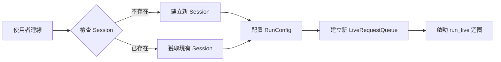

歡迎回到這份深度技術筆記。我是你們的資深技術導師。

在上一堂課中，我們完成了全域性的「階段 1：應用程式初始化」。現在，當一位使用者透過 WebSocket 撥通了連線，我們便正式進入了**階段 2：對話執行緒初始化 (Session Initialization)**。

如果說階段 1 是蓋好一棟大樓，階段 2 就是為每一位走進大樓的客人分配專屬的櫃檯與通訊設備。在這個階段，我們將圍繞著「記憶、策略、通道」這三個核心元素，建立起對話的基石。

### 📌 階段 2：對話執行緒初始化學習地圖

1.  **Session 的持久化邏輯**：區分長期記憶 (ADK Session) 與短期上下文 (Live API Session)。
2.  **RunConfig 的策略配置**：如何根據模型架構（原生音訊 vs. 半串聯）決定回應型態。
3.  **LiveRequestQueue 的唯一性**：為什麼它是「對話特定且有狀態」的守護者。
4.  **實戰模式：獲取或建立 (Get-or-Create)**：確保連線中斷後能無縫恢復的關鍵。

---

### 一、 邏輯具象化：初始化組件對照表

在階段 2 中，我們為每個使用者對話配置以下三個關鍵物件：

| 組件名稱             | 核心角色           | 技術特性                     | 生命週期                       |
| :------------------- | :----------------- | :--------------------------- | :----------------------------- |
| **ADK Session**      | **記憶 (Memory)**  | 持久化儲存對話歷史與狀態     | 跨越數小時、數天甚至數月       |
| **RunConfig**        | **策略 (Policy)**  | 定義回應模態、VAD 與恢復功能 | 對話特定，可依需求變動         |
| **LiveRequestQueue** | **通道 (Channel)** | 非同步訊息隊列，緩衝上行資料 | **單次對話專用**，嚴禁重複使用 |

#### 🔄 初始化作業邏輯圖



---

### 二、 核心技術：Session 的「長短時記憶」

**提問：** 「老師，為什麼 ADK 已經有 Session 了，Live API 還有一個自己的 Session？」

**解析：** 這是新手最容易混淆的地方。請記住這個導師準則：
*   **ADK Session** 是你的**長期硬碟**：它儲存在資料庫中，即使你重啟伺服器或過了好幾天，對話紀錄都在。
*   **Live API Session** 是模型的**短期快取**：它只存在於單次 `run_live()` 運作期間。當你呼叫 `live_request_queue.close()` 時，它就會消失。

**關鍵在於：** 當迴圈啟動時，ADK 會自動從你的「長期硬碟」讀取歷史紀錄，用來初始化模型的「短期快取」，實現對話的連續性。

---

### 三、 代碼即真理：FastAPI 實作註解

讓我們看看來源資料中具備生產級參考價值的初始化代碼。這段程式碼展示了如何根據模型架構自動適應配置：

```python
# [導師點評]：Phase 2 開始。這裡為每個 WebSocket 連線初始化環境。

@app.websocket("/ws/{user_id}/{session_id}")
async def websocket_endpoint(websocket: WebSocket, user_id: str, session_id: str):
    await websocket.accept()

    # 1. 策略配置 (RunConfig)
    # [關鍵邏輯]：檢測模型名稱以決定回應型態。
    # 原生音訊模型 (Native Audio) 僅支援 AUDIO 模式。
    model_name = agent.model
    is_native_audio = "native-audio" in model_name.lower()

    if is_native_audio:
        # 配置原生音訊專用功能
        run_config = RunConfig(
            streaming_mode=StreamingMode.BIDI,
            response_modalities=["AUDIO"],
            input_audio_transcription=types.AudioTranscriptionConfig(), # 啟用逐字稿
            output_audio_transcription=types.AudioTranscriptionConfig(),
            session_resumption=types.SessionResumptionConfig(), # 啟用自動重連
        )
    else:
        # 半串聯模型預設使用 TEXT 以獲得更快效能
        run_config = RunConfig(
            streaming_mode=StreamingMode.BIDI,
            response_modalities=["TEXT"],
            session_resumption=types.SessionResumptionConfig(),
        )

    # 2. 記憶獲取 (Get-or-Create Pattern)
    # [實戰提示]：先嘗試獲取，不存在則建立，這對「恢復對話」至關重要。
    session = await session_service.get_session(
        app_name=APP_NAME, user_id=user_id, session_id=session_id
    )
    if not session:
        await session_service.create_session(
            app_name=APP_NAME, user_id=user_id, session_id=session_id
        )

    # 3. 通道建立 (LiveRequestQueue)
    # [警告]：必須為每個對話建立新隊列，不可重用。
    live_request_queue = LiveRequestQueue()
```

---

### 四、 導師叮嚀：階段 2 的常見陷阱

在實戰場景中，有兩個地方你絕對不能出錯：

1.  **回應型態的不可逆性**：
    你必須在會話開始時就決定要 `TEXT` 還是 `AUDIO`。一旦初始化完成，你**無法在對話中途切換型態**。如果你需要原生音訊模型的音訊回應，但又想要文字紀錄，請務必像範例代碼一樣啟用「音訊逐字稿 (Audio Transcription)」功能。

2.  **佇列的「殭屍」問題**：
    `LiveRequestQueue` 是有狀態的。如果你在多個 `run_live()` 呼叫中重複使用同一個隊列，上一個對話殘留的「關閉訊號」或訊息會導致新對話立即崩潰或資料錯亂。記住：**一個對話，一個新隊列**。

---

### 💡 知識延伸與收斂

階段 2 的精髓在於**等冪性 (Idempotency)**。透過「獲取或建立」模式，你的應用程式在面對網路波動時會變得非常強韌：如果連線斷了，使用者重新連入，同樣的 `user_id` 和 `session_id` 會讓你找回之前的 `ADK Session`，讓對話歷史無縫接軌。

**實戰導向總結：**
*   **Session 定位**：區分持久儲存 (ADK) 與即時上下文 (Live API)。
*   **配置靈活性**：透過 `RunConfig` 宣告式地管理 VAD、逐字稿與模型模態。
*   **清理義務**：雖然隊列在階段 2 建立，但你必須在階段 4 確保它被關閉，以釋放並行會話配額。

🏷️ `session-management`, `run-config`, `live-request-queue`, `adk-architecture`, `bidi-streaming`

**下一課預告**：我們將進入最精彩的「階段 3：事件迴圈」，學習如何並行處理上游訊息與下游事件。