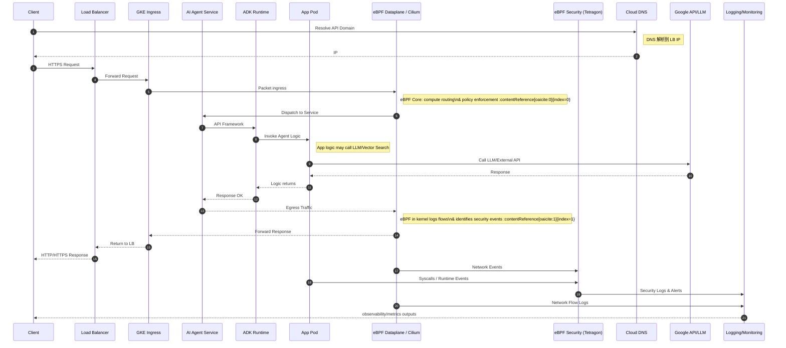

# 🏗 (eBPF AI Agent 安全技術架構設計) Technical Architecture: eBPF-Enhanced AI Agent Security

## 📖 摘要 (Abstract)
本章節深入技術細節，展示從 Client 到 GKE、再到 AI Agent 的完整流量與數據處理流程。重點說明 eBPF（Cilium 與 Tetragon）如何在不同層級（Network, Kernel, Application）介入，提供無縫的可觀測性與安全防護。

---

## 🕒 **整體流程時序圖 — Client → GKE → AI Agent → 回應**

---

## 🔍 **流程分段說明（強化觀點）**

### 1️⃣ **Client → DNS → LB**

* Client 先透過 DNS 查詢域名，得到負載平衡器的 IP。
* Cloud DNS 與 Cloud Load Balancing 組成邊界入口。

📌 **安全與可觀測性注意**

* 可結合 Cloud Armor 做 WAF 防護。
* 初次網路流量由 LB 解析後直接進入 GKE ingress。

---

### 2️⃣ **Ingress → eBPF Dataplane / Cilium（網路層處理）**

➡ **過程**

* 請求抵達 GKE Ingress 之後會透過 **eBPF Dataplane（如 Cilium / GKE Dataplane V2）** 進行網路路由決策與安全 policy 檢查。
* eBPF 核心在 Kernel 內核層執行高效能路由、ACL、Policy 及流量觀察。([Google Cloud Documentation](https://docs.cloud.google.com/kubernetes-engine/docs/concepts/dataplane-v2?utm_source=chatgpt.com))

📌 **重點**

* 網路流量經過 eBPF，不需要 Sidecar 或 iptables，效能高且可觀測。
* 可收集 Layer3/4 的 Flow events（例如連線建立、拒絕等）。([Google Cloud Documentation](https://docs.cloud.google.com/kubernetes-engine/docs/concepts/about-dpv2-observability?utm_source=chatgpt.com))

---

### 3️⃣ **Service → ADK → App**

* 請求進入應用後首先由 ADK 負責 Agent 框架層（例如 Coordinator / Planner / Executor）。
* ADK 將路由到正確的 Agent Logic，並調度 Task，例如 RAG 查詢、Tool Agent 呼叫。

📌 **輔助觀測**

* 在應用層可加入 tracing（OpenTelemetry），結合 eBPF 觀測資料做到全棧追蹤。

---

### 4️⃣ **App → 外部 API / 模型呼叫**

* App 可能會呼叫 LLM、Vector Search 等外部服務（如 Vertex AI Endpoint），完成自然語言處理和推理。

📌 **可觀測性補充**

* syscalls / DNS / 外部連線事件在 eBPF 映射下可以提供完整行為觀察。

---

### 5️⃣ **Response 透過 eBPF Path 送回 Client**

* 回應資料從 Pod 回到 Service，再經由 eBPF Dataplane 被推送回 GKE Ingress → LB → Client。

📌 **Network Flow Logging**

* 每個 flow event 在 eBPF dataplane 可被導出到 Logging System（如 Hubble / Cloud Logging）。

---

### 6️⃣ **eBPF Security / Tetragon 事件捕捉與 Policy Enforcement**

在該時序中，**Tetragon** 會在內核層：

* 捕捉 App 進程的 syscall、安全事件（ex: execve、file access、namespace changes）。([Medium](https://medium.com/%40nonickedgr/cilium-tetragon-next-generation-runtime-security-for-kubernetes-41cfee727503?utm_source=chatgpt.com))
* 可根據 Policy 決定是否執行阻斷行為（Runtime Enforcement）。([Tetragon](https://tetragon.io/?utm_source=chatgpt.com))
* 將事件與 Alert 送至 Logging/Monitoring Pipeline。

📌 **特點**

* 由於 eBPF 在 Kernel 層，即使 App 攻擊繞過應用層，仍可在系統層監控及防護。
* Security 與 Network Event 無縫關聯，可梳理完整請求時序與威脅模式。

---

### 7️⃣ **Aggregated Observability / Logging**

所有 eBPF 相關的安全 & network 日誌：

* 被輸出到集中式平台（Cloud Logging / BigQuery / SIEM）
* 可做後續 Alerting / Dashboard / AI Security Copilot 查詢

---

## 📌 **關鍵觀念整理（與 eBPF 的價值鏈結）**

| 阶段 | eBPF 的作用 |
| :--- | :--- |
| Ingress → Pod | 高效能網路決策與 Policy Enforcement |
| Pod 內 | Syscalls & Process-level 監控（Tetragon） |
| Response | 流量返送且被 log 與分析 |
| Logging/Alerting | 收斂事件作 Alert / 追蹤 |
| Policy Enforcement | 在 Kernel 層防止可疑行為 |

---

## 🔎 跨層可觀測性實現方式

📍 **Network Layer**

* Cilium / GKE Dataplane V2 透過 eBPF maps 決定 flow path（更快 & context-aware）([Google Cloud Documentation](https://docs.cloud.google.com/kubernetes-engine/docs/concepts/dataplane-v2?utm_source=chatgpt.com))

📍 **Security Event Layer**

* Tetragon 監控系統呼叫、進程事件、Network & File 活動，提供策略觸發與阻斷能力([Tetragon](https://tetragon.io/?utm_source=chatgpt.com))

📍 **Application Layer**

* 透過 APM / OTel metric + eBPF 辅助提升追蹤完整度

---

## 📌 實務建議（落地）

✔ 優先啟用 **GKE Dataplane V2 observability** + **Hubble** 以捕捉網路 flow。([Google Cloud](https://cloud.google.com/blog/products/containers-kubernetes/using-hubble-for-gke-dataplane-v2-observability?utm_source=chatgpt.com))
✔ 使用 **Tetragon Policy** 定義如 Syscall 探測、文件訪問策略。([Tetragon](https://tetragon.io/?utm_source=chatgpt.com))
✔ 將事件送入 Logging/ SIEM，並結合 AI Copilot 分析異常行為
