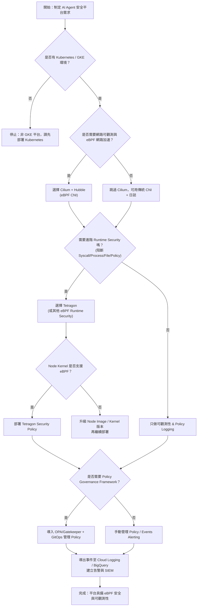

```mermaid
flowchart TD
    %% Root
    A["開始：制定 AI Agent 安全平台需求"] --> B{"是否有 Kubernetes / GKE 環境？"}

    %% Not GKE
    B -- "否" --> X1["停止：非 GKE 平台，請先部署 Kubernetes"]

    %% Yes GKE
    B -- "是" --> C{"是否需要網路可觀測與 eBPF 網路加速？"}

    C -- "是" --> D["選擇 Cilium + Hubble<br>(eBPF CNI)"]
    C -- "否" --> E["跳過 Cilium，可用傳統 CNI + 日誌"]

    %% After Cilium
    D --> F{"需要進階 Runtime Security 嗎？<br>(阻斷 Syscall/Process/File/Policy)"}
    E --> F

    %% Runtime
    F -- "是" --> G["選擇 Tetragon<br>(或其他 eBPF Runtime Security)"]
    F -- "否" --> H["只做可觀測性 & Policy Logging"]

    %% Kernel Support
    G --> I{"Node Kernel 是否支援 eBPF？"}
    I -- "是" --> J["部署 Tetragon Security Policy"]
    I -- "否" --> K["升級 Node Image / Kernel 版本<br>再繼續部署"]

    %% Policies Optional
    J --> L{"是否需要 Policy Governance Framework？"}
    H --> L
    L -- "是" --> M["導入 OPA/Gatekeeper + GitOps 管理 Policy"]
    L -- "否" --> N["手動管理 Policy / Events Alerting"]

    %% Monitoring & Logging
    M --> O["導出事件至 Cloud Logging / BigQuery<br>建立告警與 SIEM"]
    N --> O

    O --> P["完成：平台具備 eBPF 安全與可觀測性"]
```