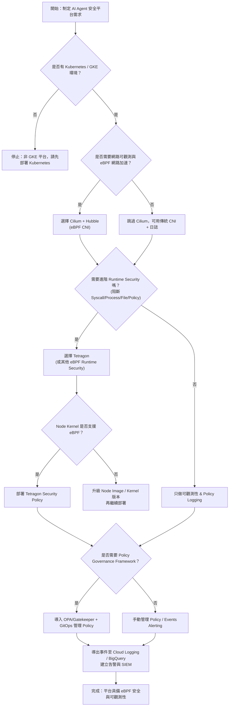

# 🗺 Strategic Planning: eBPF Adoption Decision Tree

## 📖 摘要 (Abstract)
本章節提供企業級的決策框架，協助評估導入 eBPF 安全平台的必要性與路徑。透過決策樹（Decision Tree）與關鍵評估點分析，引導團隊根據自身的基礎設施現況（如 GKE 環境）、安全需求（觀測 vs. 阻斷）與團隊能力，制定最合適的導入策略。

---

## 🌳 **決策樹概覽 (Decision Tree Overview)**

## 🔍 流程詳細說明

本決策樹協助團隊評估導入 eBPF 安全平台的必要性與執行路徑：

### 1. 環境檢核 (Kubernetes/GKE)
*   **決策點**: 確認基礎設施是否為 Kubernetes。
*   **說明**: eBPF 安全工具 (Cilium/Tetragon) 高度依賴 Kubernetes 的 Metadata (Pod, Namespace) 進行關聯。若非 K8s 環境，建議先進行容器化平台建置。

### 2. 網路需求評估 (Cilium)
*   **決策點**: 是否需要高效能網路轉發與 L3-L7 可觀測性？
*   **說明**:
    *   若需要取代 iptables 以獲得更高吞吐量，或需要 Hubble 的 Service Map，強烈建議啟用 **Cilium** (或使用 GKE Dataplane V2)。
    *   若僅需基本連線，可暫時跳過，但會失去部分網路層安全優勢（如 FQDN Filtering）。

### 3. 核心安全需求 (Tetragon)
*   **決策點**: 是否需要防範 Runtime 攻擊（如容器逃逸、未授權 Syscall）？
*   **說明**:
    *   若需達到「主動防禦」級別，必須導入 **Tetragon**。
    *   這是從「被動監控」跨入「即時阻斷」的關鍵分水嶺。

### 4. 核心版本相容性
*   **決策點**: Node Kernel 是否支援所需的 eBPF Hook？
*   **說明**: Tetragon 與 Cilium 對 Linux Kernel 版本有一定要求 (通常建議 5.4+ 或 GKE COS)。若使用舊版 Node Image，需先進行升級。

### 5. 政策治理 (Policy Governance)
*   **決策點**: 是否需要統一管理與審核安全策略？
*   **說明**: 當規則變多時，建議導入 **OPA/Gatekeeper** 或 **GitOps** 流程，將 Security Policy 視為程式碼 (Policy as Code) 進行版控與審核。

### 6. 觀測與告警整合
*   **最終目標**: 所有數據匯流至 SIEM 或 Cloud Logging。
*   **價值**: 形成閉環的資安監控體系，並可進一步結合 AI Agent 進行自動化分析。
