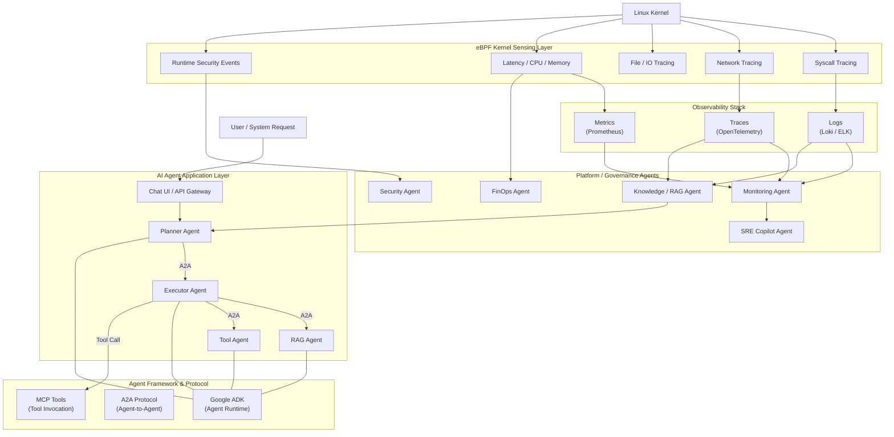
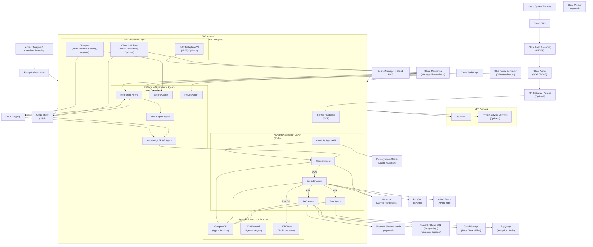

# eBPF-Enhanced AI Agent Security Platform (基於 GKE)

歡迎來到 **eBPF AI Agent 安全防禦平台** 設計文檔。本系列文章旨在協助雲原生團隊與資安工程師，從概念到實作，逐步打造一個基於 Linux Kernel 技術 (eBPF) 的深層觀測與防禦系統。

## 📖 專案簡介 (Introduction)

隨著 AI Agent 與微服務架構的普及，傳統的應用層監控 (Application Logs) 與邊界防禦 (WAF/Gateway) 已不足以應對現代資安威脅。Agent 內部的系統呼叫 (Syscalls)、檔案存取與非預期的網路連線，往往是傳統工具的盲區。

本專案利用 **eBPF (Extended Berkeley Packet Filter)** 技術，在不修改應用程式代碼的前提下，直接深入 Kernel 層級進行觀測與阻斷。結合 **Google Kubernetes Engine (GKE) Dataplane V2**、**Cilium** 與 **Tetragon**，我們能構建一個高效能、低干擾且具備實時防禦能力的次世代安全平台。

---

## 📂 完整文章導覽 (Article Series)

本系列文章依照「由淺入深、從概念到落地」的邏輯編排，建議依序閱讀：

### 1. 建立認知與共識
*   **[01. 5W1H 概念設計 (Concept)](./01-concept-5w1h.md)**
    *   **內容重點**: 深入探討「為什麼需要 eBPF？」分析 AI Agent 面臨的獨特安全挑戰，並以 5W1H 架構定義平台的核心價值與角色職責。
*   **[02. 內部推廣簡報 (Presentation)](./02-presentation-pitch.md)**
    *   **內容重點**: 提供給技術主管與團隊的溝通素材。透過直觀的比喻與互動問題，快速建立對「Kernel 層級防禦」的認知與共識。

### 2. 評估與架構設計
*   **[03. 導入評估決策樹 (Strategy)](./03-adoption-strategy.md)**
    *   **內容重點**: 提供決策流程圖，協助團隊評估現有環境是否適合導入 eBPF，以及如何根據需求（觀測 vs. 防禦）選擇合適的元件組合。
*   **[04. 系統架構與時序 (Architecture)](./04-architecture-workflow.md)**
    *   **內容重點**: 技術深潛章節。解析從 Client Request 到 Agent Response 的完整生命週期，詳述 eBPF 在 Ingress、Pod 及 Kernel 層的具體介入點與觀測價值。

### 3. 規劃與實作
*   **[05. 設計計劃與路線圖 (Roadmap)](./05-project-roadmap.md)**
    *   **內容重點**: 專案管理視角。定義三階段導入計畫（準備、基礎觀測、安全執行）、成功指標 (KPIs) 以及風險應對策略。
*   **[06. 部署實作指南 (Deployment)](./06-deployment-guide.md)**
    *   **內容重點**: Hands-on 實戰。提供完整的 Terraform 與 Helm 腳本，手把手教學如何建立 GKE 環境、安裝 Cilium/Tetragon 並部署基礎安全策略。

---

## 🏗 架構參考 (Architecture Diagrams)

### 核心架構圖

### GKE 部署架構

---

## 📚 參考資料彙整 (References)

以下是本系列文章中引用的官方文檔與技術資源，供進一步深入研究：

*   **基礎概念 (Concepts)**
    *   [Wikipedia: eBPF](https://en.wikipedia.org/wiki/EBPF)
    *   [eBPF.io: Applications & Use Cases](https://ebpf.io/zh-hant/applications/)
    *   [Wikipedia: Cilium](https://en.wikipedia.org/wiki/Cilium_%28computing%29)

*   **Google Cloud & GKE**
    *   [Google Cloud Blog: Bringing eBPF and Cilium to GKE](https://cloud.google.com/blog/products/containers-kubernetes/bringing-ebpf-and-cilium-to-google-kubernetes-engine)
    *   [GKE Documentation: Dataplane V2 Networking](https://docs.cloud.google.com/kubernetes-engine/docs/concepts/dataplane-v2)
    *   [GKE Documentation: Dataplane V2 Observability](https://docs.cloud.google.com/kubernetes-engine/docs/concepts/about-dpv2-observability)
    *   [Google Cloud Blog: Using Hubble for GKE Observability](https://cloud.google.com/blog/products/containers-kubernetes/using-hubble-for-gke-dataplane-v2-observability)

*   **Tetragon & Security**
    *   [Tetragon: Security Observability & Runtime Enforcement](https://tetragon.io/)
    *   [Tetragon Docs: Kubernetes Install Guide](https://tetragon.io/docs/getting-started/install-k8s/)
    *   [Is It Observable: Master Kubernetes Security with Tetragon](https://isitobservable.io/observability/kubernetes/master-kubernetes-security-with-tetragon)
    *   [Medium: Cilium Tetragon - Next-Gen Runtime Security](https://medium.com/@nonickedgr/cilium-tetragon-next-generation-runtime-security-for-kubernetes-41cfee727503)
