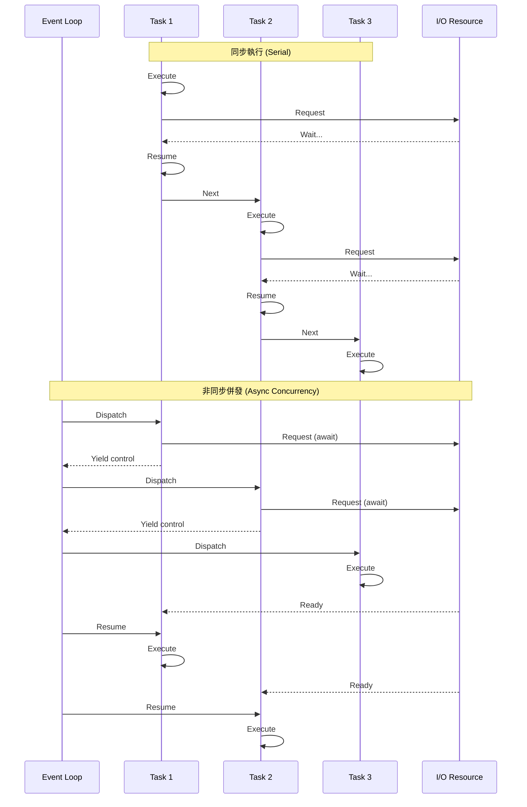

# 同步與非同步執行模型

在建構高效能的分散式系統時，開發者最常犯的錯誤之一就是混淆了「任務的執行模式」與「系統的吞吐量基礎」。作為一名架構師，我必須強調：**非同步編程並不是讓單個任務跑得更快，而是讓系統在相同的時間內處理更多的任務**。

以下將從實戰角度拆解同步與非同步範式的核心差異及其效能影響。

---

### 情境 1：針對 I/O 密集型任務優先選擇「協作式非同步」而非「同步阻塞」

#### 核心概念簡述
同步執行（Synchronous）遵循步進式邏輯，每一行代碼必須等待前一行完成後才能執行。這在處理 I/O 密集型任務（如調用 API、查詢資料庫）時會產生巨大的「阻塞」代價，導致 CPU 在等待硬體回傳數據時處於閒置狀態。

非同步編程（Asynchronous）則引入了「協作式多工（Cooperative Multitasking）」的概念：當某個任務進入等待（Wait）狀態時，它會主動讓出控制權，允許事件循環（Event Loop）調度其他任務運行。

#### 程式碼範例（Bad vs. Better）

```python
# Bad: 同步阻塞範式 - 任務必須排隊，總時長為所有請求的總和
import requests
import time

def fetch_all_sync(urls):
    results = []
    for url in urls:
        # 這裡會阻塞整個執行緒，CPU 在等待網路回傳時無所事事
        resp = requests.get(url)
        results.append(resp.status_code)
    return results

# Better: 非同步協作範式 - 任務重疊執行，總時長接近最慢的一個請求
import asyncio
import aiohttp

async def fetch_status(session, url):
    # 使用 await 明確標記暫停點，讓出控制權
    async with session.get(url) as response:
        return response.status

async def fetch_all_async(urls):
    async with aiohttp.ClientSession() as session:
        tasks = [fetch_status(session, url) for url in urls]
        # 同時啟動所有任務，實現併發
        return await asyncio.gather(*tasks)
```

#### 底層原理探討與權衡
*   **吞吐量差異**：在基準測試中，使用 `aiohttp` 的單個非同步進程每秒能處理約 1,500 個請求，而傳統的同步框架（如 Flask）即使啟動 8 個進程，每秒也僅能處理約 550 個請求。
*   **資源開銷**：同步模式通常依賴「多執行緒（Multithreading）」來處理併發，但執行緒的上下文切換（Context Switch）涉及作業系統層級的資源保存與恢復，成本極高。非同步則在單執行緒內切換，開銷極低。
*   **拇指法則**：如果系統限制因素是網路或磁碟（I/O-bound），請使用非同步。如果限制因素是運算能力（CPU-bound），非同步並無幫助，應考慮多進程並行。

---

### 情境 2：嚴格區分「併發 (Concurrency)」與「並行 (Parallelism)」以避免系統崩潰

#### 核心概念簡述
許多開發者誤以為 `asyncio` 能利用多核 CPU。事實上，**併發是關於「處理」很多事情，而並行是關於「同時做」很多事情**。

#### 執行模式對比表

| 特性 | 同步執行 (Sync) | 併發 (Concurrency - Async) | 並行 (Parallelism - Multiprocessing) |
| :--- | :--- | :--- | :--- |
| **執行緒數量** | 單個或多個 | 通常為單執行緒事件循環 | 多個進程，每個進程有獨立 GIL |
| **適用場景** | 簡單腳本 | 大量 I/O 等待 (如 Web 爬蟲) | 重度計算 (如 3D 渲染、矩陣運算) |
| **吞吐量影響** | 低（線性受限） | 極高（受限於 I/O 頻寬） | 高（受限於 CPU 核心數） |
| **複雜度** | 低 | 中（需處理協程狀態） | 高（需處理進程間通訊 IPC） |

#### 流程演示



### 延伸思考

**1️⃣ 問題一：非同步編程是否總是比同步編程快？**

**👆 回答：** 不一定。對於純粹的 CPU 密集型任務，非同步協程反而會因為事件循環的調度開銷而略微變慢。此外，如果非同步任務被切分得太細（如數百萬個微小任務），頻繁的上下文切換成本會抵消所有收益，甚至耗盡記憶體。

---

**2️⃣ 問題二：在非同步環境中調用同步函式庫會發生什麼事？**

**👆 回答：** 這是最致命的陷阱。如果在 `async def` 內部使用了像 `time.sleep()` 或 `requests.get()` 這樣的同步阻塞調用，整個事件循環都會被鎖死，導致系統中所有其他併發請求全部停擺。這種情況下，系統吞吐量會瞬間退化至同步水平。

---

**3️⃣ 問題三：如何處理那些沒有非同步版本的舊型 API？**

**👆 回答：** 應該使用 `run_in_executor` 或 `to_thread` 將阻塞任務委派給執行緒池（Thread Pool）處理。這樣可以避免阻塞主事件循環，維持系統整體的響應性。