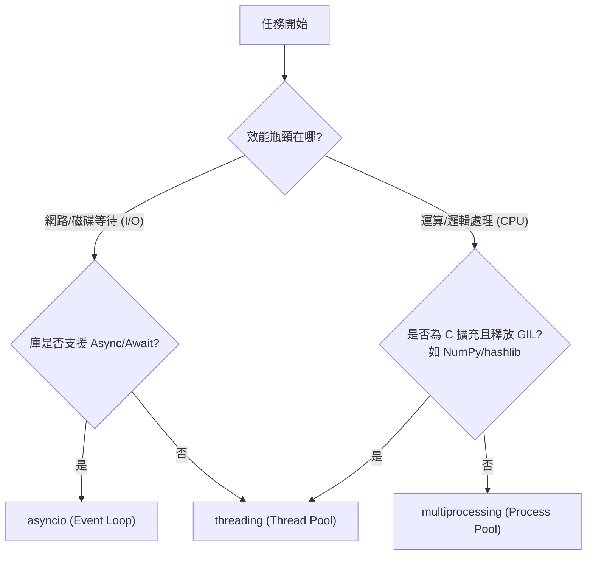

# 任務屬性判定與併發模型選擇

作為一名架構師，在設計併發系統時，最核心的挑戰在於識別任務的「限制因素」（Limiting Factor）。如果將計算密集型任務錯誤地放入非同步事件循環中，將會導致整個系統的停擺（Event Loop Starvation）；反之，對 I/O 密集型任務使用同步阻塞，則會浪費昂貴的硬體資源。

以下是針對任務屬性判定與併發模型選擇的進階實戰指南。

---

### 情境 1：識別任務的限制因素以決定技術棧

#### 核心概念簡述
判定任務類型的最簡單方法是觀察：**「如果提升哪項硬體效能，該任務會完成得更快？」**。如果提升 CPU 時脈能縮短時間，它是 CPU 密集型（CPU-bound）；如果提升網路頻寬或硬碟存取速度能縮短時間，它則是 I/O 密集型（I/O-bound）。

#### 程式碼範例（Bad vs. Better）

```python
# Bad: 混合任務屬性而未區分處理
# 在處理大量資料時，未考慮 I/O 等待與計算處理的比例，導致執行緒在閒置與忙碌間切換效率低下
def process_data_sync(urls):
    for url in urls:
        resp = requests.get(url)  # I/O 阻塞點
        data = analyze_complex_logic(resp.text) # CPU 密集運算點
        save_to_disk(data) # I/O 阻塞點

# Better: 根據屬性拆分並選擇模型
# 將 I/O 密集型（網路請求）與 CPU 密集型（複雜邏輯分析）解耦
async def fetch_and_analyze(urls):
    async with aiohttp.ClientSession() as session:
        # 使用 asyncio 處理 I/O 密集型任務 (網路獲取)
        tasks = [session.get(url) for url in urls]
        responses = await asyncio.gather(*tasks)

        # 使用 ProcessPoolExecutor 處理 CPU 密集型任務 (分析運算)
        with ProcessPoolExecutor() as pool:
            loop = asyncio.get_running_loop()
            results = await loop.run_in_executor(pool, analyze_logic, responses)
```

#### 底層原理探討與權衡
*   **為什麼 (Rationale)**：CPU 密集型任務（如計算 Pi 或複雜商業邏輯循環）受限於 Python 的「全域解釋器鎖（GIL）」，單執行緒模型無論如何切換都無法加速。I/O 密集型任務則大部分時間在等待網路卡或硬碟，這時釋放 CPU 控制權讓其他任務運行才是最優解。
*   **拇指法則 (Rule of Thumb)**：任何涉及網路呼叫（API）、資料庫查詢或文件讀寫的任務，優先考慮 `asyncio`。任何涉及影像處理、加解密或大數據矩陣運算的，強制使用多進程（Multiprocessing）。

---

### 情境 2：針對不同密集型任務嚴格隔離執行緒池與進程池

#### 核心概念簡述
開發者常犯的錯誤是在 `async def` 中呼叫同步阻塞庫（如 `requests`），這會直接凍結整個事件循環。若無法替換為非同步庫，必須將其委派給正確的執行器（Executor）。

#### 任務判定對比表

| 特性 | I/O 密集型 (I/O-bound) | CPU 密集型 (CPU-bound) |
| :--- | :--- | :--- |
| **主要限制** | 外部設備 (網路、磁碟) 的吞吐量 | CPU 核心數與時脈頻率 |
| **Python 限制** | GIL 會在 I/O 期間釋放 | 運算期間始終持有 GIL |
| **典型案例** | 獲取網頁、DB 查詢、讀取日誌 | 數據壓縮、機器學習推論、3D 渲染 |
| **最佳併發模型** | **asyncio** (單執行緒協作) | **multiprocessing** (多進程並行) |

#### 執行模型決策流程



---

### 情境 3：特殊案例判定——AI 推論屬性的動態切換

#### 核心概念簡述
這是一個特殊的現代開發情境：**AI 模型推論（Inference）**。本地運行的模型推論是計算密集型的，會阻塞 CPU/GPU；但若改為調用第三方 API（如 OpenAI），推論對於你的應用程式而言則變成了 I/O 密集型任務（等待網路回傳）。

#### 實戰案例
*   **情境 A (本地模型)**：你使用 `transformers` 載入模型推論。
    *   **判定**：CPU/Memory 密集型。
    *   **對策**：使用外部模型伺服器（如 vLLM）或在獨立進程中執行。
*   **情境 B (API 調用)**：你調用 Azure OpenAI。
    *   **判定**：I/O 密集型。
    *   **對策**：使用 `asyncio` 與 `StreamingResponse` 實現即時串流。

---

### 延伸思考

**1️⃣ 問題一**：在 `asyncio` 環境中處理數百萬個微小任務（如簡單的數學加法）是否划算？

**👆 回答**：不划算。非同步任務的「上下文切換」（Context Switch）雖然比執行緒輕量，但並非完全免費。如果任務運算量極小，頻繁的事件循環調度開銷（Yielding overhead）反而會讓總體效能低於同步執行。這時應考慮「批次處理」（Batch Processing）。

---

**2️⃣ 問題二**：為什麼 NumPy 這種計算密集的庫，有時卻建議使用執行緒而非進程？

**👆 回答**：這屬於「GIL 釋放例外」。許多高效能庫（NumPy, hashlib, scrypt）底層使用 C 語言編寫，在執行密集運算時會主動釋放 GIL。在這種情況下，使用多執行緒（Threading）可以省去多進程序列化數據（Pickle）的通訊成本，同時達到近似並行的效果。