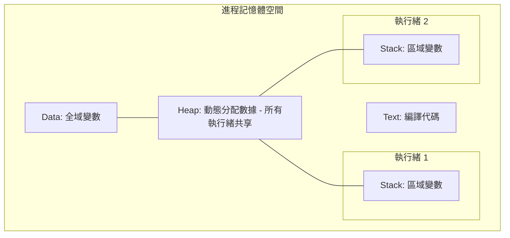

# 作業系統進程與執行緒資源管理

身為軟體架構師，理解作業系統（OS）如何管理資源，是撰寫高效能 Python 程式碼的基石。許多開發者在「什麼時候該用多進程（Multiprocessing）」與「什麼時候該用多執行緒（Multithreading）」之間掙扎，核心原因在於不理解底層的資源隔離邊界以及 Python 全域解釋器鎖（GIL）的運作機制。

以下將從實戰架構的角度，拆解進程與執行緒在資源管理上的底層運作。

---

### 情境 1：針對 CPU 密集型任務，跨越進程邊界以繞過 GIL

#### 核心概念簡述
進程（Process）是 OS 分配資源的最小單位。每個進程擁有獨立的記憶體空間，包含**文字區段（Text）**、**數據區段（Data）**、**堆積（Heap）**與**堆疊（Stack）**。在 CPython 模型下，單一進程受限於 GIL，同一時間僅能執行一條 Python 字節碼。若要實現真正的並行（Parallelism）運算，必須啟動多個進程，每個進程擁有獨立的 Python 解釋器與獨立的 GIL。

#### 程式碼範例（Bad vs. Better）

```python
# Bad: 在單一進程內使用多執行緒處理計算密集型任務 (如 Fibonacci)
# 由於 GIL 的存在，執行緒會序列化執行，且因管理開銷反而變慢
import threading

def fib(n):
    return n if n < 2 else fib(n-1) + fib(n-2)

t1 = threading.Thread(target=fib, args=(40,))
t2 = threading.Thread(target=fib, args=(40,))
t1.start(); t2.start()
t1.join(); t2.join()

# Better: 使用多進程實現真正並行
# 每個子進程在獨立的 CPU 核心上運行，互不干擾
import multiprocessing

p1 = multiprocessing.Process(target=fib, args=(40,))
p2 = multiprocessing.Process(target=fib, args=(40,))
p1.start(); p2.start()
p1.join(); p2.join()
```

#### 底層原理探討與權衡
*   **為什麼（Rationale）**：進程提供最強的隔離性。若一進程崩潰，不會影響主進程。但進程間的「上下文切換（Context Switching）」極其昂貴，因為 OS 必須保存並恢復整套記憶體映射與狀態資訊。
*   **拇指法則**：涉及重度循環、影像處理或矩陣運算時，優先選用 `multiprocessing`。
*   **例外情況**：若進程間需頻繁交換 GB 等級的大型數據，跨進程序列化（Pickling）的開銷可能會抵消並行帶來的效能提升。

---

### 情境 2：針對 I/O 密集型並發，利用執行緒共享堆積以減少開銷

#### 核心概念簡述
執行緒（Thread）是作業系統排程的最小單位，被視為「輕量級進程」。多個執行緒共享所屬進程的**堆積（Heap）**與**數據段（Data）**，但擁有私有的**堆疊（Stack）**。雖然 Python 受限於 GIL，但在執行網路請求或磁碟讀寫時，Python 會主動釋放 GIL，這使得多個執行緒能在此等待期間運行，實現併發（Concurrency）。

#### 程式碼範例（Bad vs. Better）

```python
# Bad: 為每個輕量級 I/O 任務建立獨立進程
# 建立進程與切換上下文的成本遠高於任務本身的價值
from multiprocessing import Process
import requests

def fetch(url):
    return requests.get(url).status_code

# Better: 使用執行緒池處理阻塞式 I/O
# 執行緒共享記憶體，且切換速度比進程快
from concurrent.futures import ThreadPoolExecutor

with ThreadPoolExecutor(max_workers=32) as executor:
    results = list(executor.map(fetch, urls))
```

#### 底層原理探討與權衡
*   **為什麼（Rationale）**：執行緒間切換較快，因為它們共享大部分資源，OS 僅需保存私有堆疊狀態。在 I/O 等待期間，CPU 處於閒置，切換執行緒可極大化硬體利用率。
*   **拇指法則**：處理 Web 爬蟲、API 整合或資料庫查詢等阻塞式 I/O 且無法改用非同步庫時，使用 `ThreadPoolExecutor`。

---

### 更多說明：進程與執行緒的底層差異比較

#### 進程記憶體佈局



#### 關鍵差異對比表

| 特性 | 進程 (Process) | 執行緒 (Thread) | Python asyncio (Coroutine) |
| :--- | :--- | :--- | :--- |
| **記憶體空間** | 獨立地址空間 | 共享進程空間 | 單執行緒共享 |
| **通訊成本** | 高 (需序列化/IPC) | 低 (直接讀取變數) | 極低 (同步函數呼叫) |
| **上下文切換** | 重型 (OS 負責) | 輕型 (OS 負責) | 極輕型 (應用層負責) |
| **Python GIL** | 每個進程一個 GIL | 所有執行緒共用一個 GIL | 受限於單一執行緒 GIL |
| **容錯性** | 強 (獨立隔離) | 弱 (一崩俱崩) | 弱 (單執行緒阻塞即全停) |

---

### 延伸思考

**1️⃣ 問題一**：既然執行緒能共享記憶體，為何我們還要擔心「執行緒安全」？

**👆 回答**：這正是多執行緒開發者的夢魘。由於共享堆積（Heap），當兩個執行緒同時修改同一個全局變數時（如 `counter += 1`），會發生「競態條件 (Race Condition)」。雖然 Python 字節碼執行是原子的，但複雜操作（如讀取、修改、寫回）在執行緒切換中可能被打斷。此時必須引入鎖（Lock）來同步，但鎖會強制並發變回序列化，降低效能。

---

**2️⃣ 問題二**：Python 的 `asyncio` 算是在什麼層級運作？

**👆 回答**：`asyncio` 採用「單執行緒事件循環」模型。它與執行緒不同，執行緒是由 OS 強制切換的「搶佔式多工（Preemptive Multitasking）」；而 `asyncio` 是由開發者明確定義暫停點的「協作式多工（Cooperative Multitasking）」。它在處理海量網路連接時，資源消耗遠低於為每個連接開一個執行緒。

---

**3️⃣ 問題三**：有哪些「CPU 密集型」庫其實可以使用執行緒而非進程？

**👆 回答**：這是一個重要的例外。部分高效能庫（如 `NumPy` 或 `hashlib` 的 `scrypt`）底層是由 C/Fortran 編寫，並在執行耗時運算時主動「釋放 GIL」。在這些特定情況下，使用多執行緒可以避開多進程序列化數據的開銷，同時達到並行的效果。