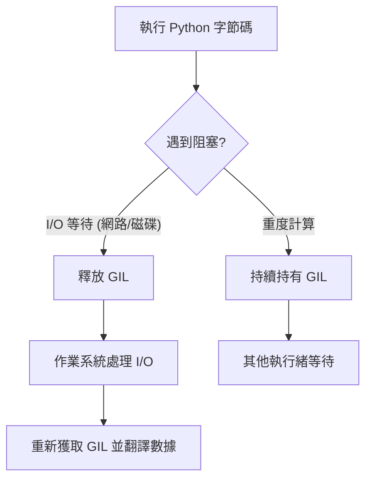

# Python 全域解釋器鎖 (GIL) 的資源約束與釋放機制

作為一名架構師，理解 Python 的全域解釋器鎖（Global Interpreter Lock, GIL）是設計高效能系統的必經之路。許多開發者誤以為多執行緒（Multithreading）能帶來並行運算，但在 CPython 中，GIL 確保了單個進程內同一時間僅有一個執行緒在執行 Python 字節碼。這對 CPU 密集型任務構成了硬性的效能天花板。

以下將深入分析 GIL 的約束邏輯、釋放機制以及在實戰中如何繞過這些限制。

---

### 情境 1：針對 CPU 密集型任務，嚴禁依賴多執行緒以避免效能退化

#### 核心概念簡述
GIL 的存在主要是為了內存管理（特別是引用計數）的執行緒安全。在 CPU 密集型任務中，多執行緒不僅無法並行，還會因為頻繁的鎖競爭（Lock Contention）與作業系統層級的上下文切換，導致總體執行時間甚至高於單執行緒。

#### 程式碼範例（Bad vs. Better）

```python
# Bad: 在單一進程內使用多執行緒處理計算密集任務 (如計算費氏數列)
# 由於 GIL 限制，執行緒會序列化執行，且因管理開銷反而更慢
import threading

def fib(n):
    return n if n < 2 else fib(n-1) + fib(n-2)

t1 = threading.Thread(target=fib, args=(40,))
t2 = threading.Thread(target=fib, args=(40,))
t1.start(); t2.start()
t1.join(); t2.join()

# Better: 使用多進程 (Multiprocessing) 實現真正並行
# 每個進程擁有獨立的 Python 解釋器與 GIL，可利用多核 CPU
import multiprocessing

p1 = multiprocessing.Process(target=fib, args=(40,))
p2 = multiprocessing.Process(target=fib, args=(40,))
p1.start(); p2.start()
p1.join(); p2.join()
```

#### 底層原理探討與權衡
*   **引用計數與安全**：CPython 使用引用計數來管理對象，這並非執行緒安全；GIL 防止多個執行緒同時操作計數，避免內存洩漏或崩潰。
*   **代價分析**：即使在多核機器上，單個 Python 進程的 CPU 負載也難以超過 100%，除非任務離開了解釋器環境。
*   **拇指法則**：處理重度循環、圖像渲染或數據壓縮時，請跨越進程邊界（Multiprocessing）。

---

### 情境 2：識別 I/O 阻塞點，利用 GIL 自動釋放機制提升吞吐量

#### 核心概念簡述
幸運的是，GIL 並非永遠被持有。當執行網路請求、讀取硬碟或等待使用者輸入時，Python 會發出低階系統調用，這些調用發生在 Python 執行緒之外，此時 GIL 會被釋放。這使得多執行緒在 I/O 密集型場景下仍然極具價值。

#### 執行模型與釋放行為

| 任務類型 | GIL 行為 | 最佳併發策略 | 效能預期 |
| :--- | :--- | :--- | :--- |
| **CPU 密集型** | 始終持有 | `multiprocessing` | 高（視 CPU 核心數而定） |
| **I/O 密集型** | 阻塞時釋放 | `asyncio` 或 `threading` | 高（大幅縮短等待時間） |
| **特定 C 擴展** | 內部主動釋放 | `threading` (如 NumPy) | 高（省去 IPC 開銷） |

#### 流程演示



---

### 更多說明：特定 C 函式庫的 GIL 豁免權

某些高效能函式庫（如 NumPy、hashlib 的 scrypt、Pillow）是用低階語言編寫的，它們在執行計算密集的任務時會主動釋放 GIL。
*   **NumPy**：在進行大型矩陣乘法時，計算是在編譯後的 C/Fortran 代碼中完成的，這允許真正的並行運算。
*   **hashlib**：對大於 2048 字節的數據進行雜湊運算時會釋放 GIL。
*   **策略建議**：如果你的應用高度依賴這些庫，使用多執行緒（Threading）可能比多進程更有效，因為它避免了昂貴的數據序列化（Pickling）開銷。

---

### 延伸思考

**1️⃣ 問題一**：Python 的 `asyncio` 能否解決 GIL 帶來的限制？

**👆 回答**：不能。`asyncio` 是一個「單執行緒」的事件循環模型，它雖然能透過協作式多工優化 I/O 等待，但依然受限於單個 GIL。它解決的是 I/O 效率問題，而非 CPU 並行問題。

---

**2️⃣ 問題二**：如果 GIL 在未來版本（如 PEP 703）中變成可選的，對現有架構有何影響？

**👆 回答**：移除 GIL（Free-threaded Python）將允許執行緒在多核上真正並行執行 Python 字節碼，但這也會帶來極高的同步開銷（需要細粒度的鎖）。對架構師而言，這意味著現有代碼中隱藏的「非原子性」操作（Race Conditions）將會大爆發，開發者必須更加謹慎地處理執行緒安全。目前階段，多進程依然是處理 CPU 工作負載最穩健的隔離手段。