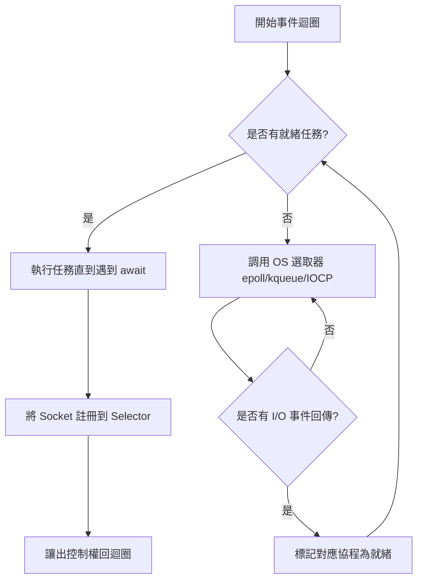

# 事件迴圈 (event loop) 的核心工作原理

在非同步程式設計的領域中，**事件迴圈 (Event Loop)** 是整個系統的心臟。身為架構師，理解其底層調度與 I/O 監聽機制，是從「會寫 code」晉升為「掌握效能」的關鍵分水嶺。

---

### 情境 1：嚴禁在事件迴圈中執行阻塞式 (Blocking) 調用

#### 核心概念簡述
事件迴圈在本質上是一個單執行緒的無限迴圈。它負責監控任務隊列，並在任務遇到 I/O 阻塞（如 `await`）時切換到下一個任務。如果你在 `async def` 中執行了傳統的同步阻塞函數（如 `time.sleep` 或 `requests.get`），整個迴圈會直接停擺，導致所有併發任務通通被卡死。

#### 程式碼範例 (Bad vs. Better)

```python
# ❌ Bad: 毀掉事件迴圈的作法
import asyncio
import time
import requests

async def fetch_data_bad():
    # 這裡使用了同步的 requests，它會佔用執行緒直到請求結束
    # 導致事件迴圈無法處理其他任務
    response = requests.get("https://example.com")
    return response.status_code

# ✅ Better: 擁抱非同步協作
import aiohttp

async def fetch_data_better():
    async with aiohttp.ClientSession() as session:
        # 使用非同步 Client，當發生網路等待時會主動讓出控制權 (Yield)
        async with session.get("https://example.com") as response:
            return response.status

async def main():
    # 啟動事件迴圈並掛載任務
    status = await fetch_data_better()
    print(f"Status: {status}")
```

#### 底層原理探討與權衡
事件迴圈的工作模式稱為**協作式多工 (Cooperative Multitasking)**。這與作業系統決定的「搶佔式多工」不同，任務必須主動聲明：「我現在要等 I/O 了，你們先跑」。

*   **為什麼不建議在協程中使用同步阻塞？** 因為 `asyncio` 只有一個執行緒在運作。同步調用不會將控制權交還給迴圈，這會造成「飢餓 (Starvation)」現象，其他就緒的協程即便資料已經到了，也沒辦法被處理。

#### 適用場景
*   **拇指法則**：如果函式庫不支援 `await`，通常代表它是阻塞的。
*   **例外情況**：如果必須使用阻塞庫，應將其封裝在 `run_in_executor` 中，交由執行緒池處理，而非直接跑在迴圈上。

---

### 情境 2：利用 Selector 實現高效的 I/O 監聽

#### 核心概念簡述
事件迴圈之所以強大，不在於它會「分身」，而在於它能與作業系統底層的**非阻塞 Socket (Non-blocking Sockets)** 溝通。透過 `selectors` 模組，迴圈能同時監控成千上萬個 Socket，而不需要消耗額外的 CPU 週期去輪詢。

#### 事件迴圈執行流程 (Mermaid)



#### 比較與整合表：作業系統通知機制

| 作業系統 | 通知系統 (Notification System) | 說明 |
| :--- | :--- | :--- |
| **Linux** | `epoll` | 現代 Linux 處理大規模併發的首選 |
| **macOS / FreeBSD** | `kqueue` | 高效的事件通知介面 |
| **Windows** | `IOCP` | I/O 完成埠，Windows 的高效異步方案 |

#### 底層原理探討與權衡
當你執行 `await loop.sock_recv(sock, n)` 時，`asyncio` 底層並不是真的在那裡傻等。它會利用 `selectors` 將該 Socket 的文件描述符 (file descriptor) 註冊到核心。

*   **優勢**：硬體級別的通知極其節省 CPU。應用程式只有在數據真正到達時才會被「喚醒」。
*   **限制**：這種模式主要針對 I/O 密集型任務。如果是運算密集型 (CPU-bound)，事件迴圈無法提供加速，因為 CPU 核心會被計算邏輯佔滿，無法進行任務切換。

---

### 延伸思考

**1️⃣ 問題一**：為什麼 `asyncio` 的效能有時會超過多執行緒？

**👆 回答**：執行緒的切換 (Context Switch) 是由作業系統強行介入的，涉及到儲存暫存器、切換記憶體映射等昂貴操作。而 `asyncio` 的切換發生在使用者空間，純粹是 Python 內部的生成器暫停與恢復，開銷極小。此外，單執行緒避免了複雜的鎖競爭 (Lock Contention)，大幅簡化了架構。

---

**2️⃣ 問題二**：如果一個任務永遠不 `await`，會發生什麼事？

**👆 回答**：該任務會成為「霸佔者」。由於迴圈是協作式的，如果任務中沒有掛起點（如 `await`），它會一直執行下去直到結束。這期間事件迴圈無法處理心跳偵測、網路逾時或其他請求，最終會導致整個服務看起來像「當機」了一樣。這就是為什麼在非同步開發中，「保持函數簡短且有足夠掛起點」是架構設計的黃金準則。