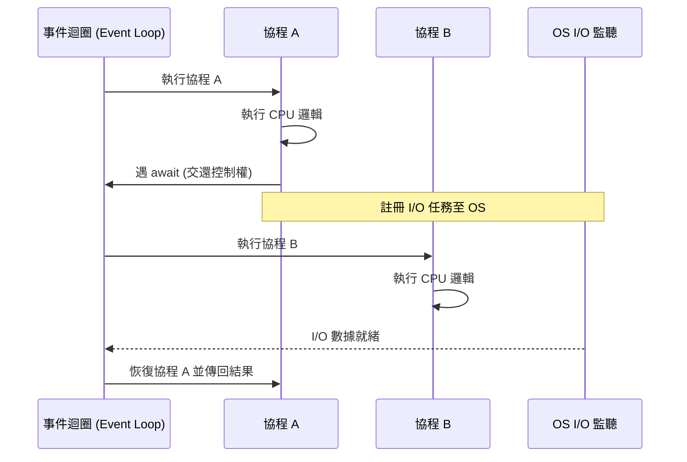

# 使用 async 和 await 定義與調用協程

在非同步開發的架構設計中，`async` 與 `await` 不僅僅是關鍵字，它們標誌著從傳統的「順序執行」思維轉向「協作式多工（Cooperative Multitasking）」的範式轉移。作為架構師，我們必須確保團隊理解這些語法背後的狀態機機制，以避免常見的效能陷阱。

---

### 情境 1：使用 `async def` 明確定義非同步邊界

#### 核心概念簡述
當你使用 `async def` 定義一個函式時，你並不是在建立一個普通的函式，而是在建立一個「協程函式（Coroutine Function）」。調用該函式不會立即執行代碼，而是返回一個「協程對象（Coroutine Object）」，這是一個封裝了待執行邏輯的狀態機。

#### 程式碼範例 (Bad vs. Better)

```python
# ❌ Bad: 使用傳統 def 嘗試進行非同步操作
import time

def fetch_data_sync():
    # 這會阻塞整個執行緒，事件迴圈無法切換任務
    time.sleep(1)
    return {"data": "sync"}

# ✅ Better: 使用 async def 定義協程
import asyncio

async def fetch_data_async():
    # 這裡的 await 是協作的起點，允許事件迴圈在等待時切換
    await asyncio.sleep(1)
    return {"data": "async"}
```

#### 底層原理探討與權衡
*   **為什麼（Rationale）**：`async def` 告訴 Python 編譯器該函式內部包含「掛起點」。這使得函式具備了暫停執行並在未來某個時刻恢復的能力，而不會占用系統執行緒資源。
*   **權衡**：協程雖然輕量，但如果你定義了 `async def` 卻內部全是同步阻塞代碼且沒有任何 `await`，這將毫無意義，甚至會因為額外的協程對象開銷而降低效能。

#### 適用場景
*   **拇指法則**：任何涉及 I/O 阻塞（網路、檔案、資料庫）的操作都應封裝在 `async def` 中。
*   **例外情況**：純計算密集型（CPU-bound）任務應保持同步，並透過執行緒池或進程池處理，而非直接在協程中執行。

---

### 情境 2：必須透過 `await` 驅動協程執行

#### 核心概念簡述
新手最常犯的錯誤是像調用普通函式一樣調用協程。記住：協程是懶惰的。如果你不 `await` 它，或者不將其交給事件迴圈（如 `asyncio.run()`），它的代碼永遠不會運行。

#### 程式碼範例 (Bad vs. Better)

```python
async def get_db_version():
    return "PostgreSQL 15"

# ❌ Bad: 像普通函式一樣調用
def process_bad():
    version = get_db_version()
    # version 此時是一個 <coroutine object>，而非字串
    print(f"Version: {version}")

# ✅ Better: 正確驅動協程
async def process_better():
    # await 會暫停當前協程，直到 get_db_version 返回結果
    version = await get_db_version()
    print(f"Version: {version}")
```

#### 底層原理探討與權衡
*   **為什麼（Rationale）**：`await` 語法會將控制權交還給事件迴圈 (Event Loop)。這是一個顯式的切換信號，確保單個執行緒能夠高效地管理成千上萬個併發任務。
*   **代價**：`await` 只能在 `async def` 內使用。這意味著「非同步具有傳染性」，一旦底層是非同步的，上層鏈條通常也必須是非同步的。

---

### 情境 3：嚴禁在協程中使用同步阻塞庫

#### 核心概念簡述
協程的效能基礎在於其「非阻塞」特性。在 `async def` 中使用 `time.sleep()` 或 `requests.get()` 是毀滅性的，因為它們會鎖死唯一的執行緒，導致所有其他併發協程全部停擺。

#### 比較與整合表：同步 vs. 非同步調用

| 類型 | 阻塞對象 | 併發能力 | 適用工具示例 |
| :--- | :--- | :--- | :--- |
| **同步阻塞 (Blocking)** | 整個執行緒/進程 | 無（順序執行） | `time.sleep`, `requests` |
| **非同步協作 (Non-blocking)** | 僅當前協程 | 高（單執行緒處理萬級併發）| `asyncio.sleep`, `aiohttp`|

#### 協程執行流程圖 (Mermaid)



---

### 延伸思考

**1️⃣ 問題一**：如果我在協程中呼叫了一個沒有 `await` 的普通 `def` 函式，會發生什麼事？

**👆 回答**：該函式會正常執行。如果它是純計算（如字串處理），這是沒問題的；但如果它是阻塞的（如 `time.sleep`），它會佔用當前執行緒直至結束，期間事件迴圈無法運行其他任務。

---

**2️⃣ 問題二**：`asyncio.run()` 能在同一個執行緒中呼叫多次嗎？

**👆 回答**：不建議。`asyncio.run()` 應該作為應用程式的主入口點。它會建立新的事件迴圈並在結束時關閉它。在已經運行中的事件迴圈內呼叫 `asyncio.run()` 會導致錯誤。若需在協程內調用其他協程，請直接使用 `await`。