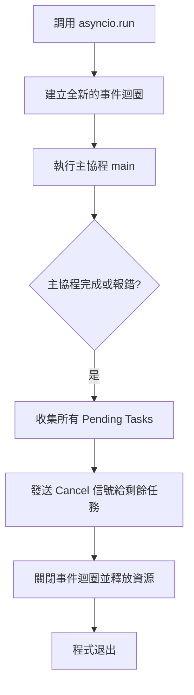

# `asyncio.run` 啟動機制

在現代非同步開發中，如何啟動事件迴圈（Event Loop）不僅是技術選擇，更是架構穩健性的體現。作為資深架構師，我始終堅持 Joshua Bloch 的原則：**API 應該易於使用且難以誤用**。在 Python 3.7 之前，我們常被瑣碎的迴圈生命週期管理困擾；而 `asyncio.run()` 的出現，正是為了將這些底層細節封裝，提供一個乾淨且安全的「單一進入點」,。

---

### 情境 1：優先使用 `asyncio.run()` 封裝迴圈生命週期

#### 核心概念簡述
`asyncio.run()` 是現代非同步程式碼的標準啟動方法。它不只是啟動一個協程，還承擔了完整的管家職責：建立新的事件迴圈、運行主協程直到完成、取消所有剩餘的任務、並在最後關閉迴圈,。這種封裝極大地減少了資源洩漏（如未關閉的 socket 或檔案描述符）的風險。

#### 程式碼範例 (Bad vs. Better)

```python
import asyncio

async def main():
    await asyncio.sleep(1)
    print("AI 服務初始化完成")

# ❌ Bad: 手動管理生命週期（遺漏清理步驟且過於瑣碎）
# 在早期版本 (3.4-3.6) 這是標準做法，但在現代架構中屬於反模式
loop = asyncio.get_event_loop()
try:
    loop.run_until_complete(main())
finally:
    # 這裡常被開發者遺忘，且無法自動取消在背景運行的 pending tasks
    loop.close()

# ✅ Better: 簡潔且安全的進入點（Python 3.7+ 推薦做法）
if __name__ == "__main__":
    # 一行代碼解決迴圈建立、運行與自動清理,
    asyncio.run(main())
```

#### 底層原理探討與權衡
*   **為什麼（Rationale）**：手動管理 `get_event_loop()` 容易導致狀態汙染。如果一個腳本多次建立、停止、再啟動迴圈，可能會留下殘留的異步任務或異常狀態。`asyncio.run()` 強制在每次調用時都建立一個全新的迴圈，並在結束時徹底清理，確保了環境的「冪等性」與純淨,。
*   **任務清理機制**：當 `main()` 結束時，`asyncio.run()` 會收集所有仍在 pending 的任務（例如在背景運行的監控協程），主動發送取消信號並等待它們優雅退出,。

#### 適用場景
*   **拇指法則**：它是所有獨立 asyncio 應用程式（如 CLI 工具、數據處理腳本）的唯一最高級啟動點。
*   **例外情況**：如果你的程式碼運行在已經提供事件迴圈的環境中（如 FastAPI 伺服器內部或某些 Jupyter Notebook），則不應再使用它，否則會觸發運行時錯誤,。

---

### 情境 2：嚴禁在協程內部或 ASGI 框架中嵌套調用 `asyncio.run()`

#### 核心概念簡述
`asyncio.run()` 的設計初衷是作為「頂層入口」，它不允許在同一個執行緒中已經存在運行中的事件迴圈時再次調用。這與現代 Web 框架（如 FastAPI, Starlette）的運作方式息息相關,。

#### 比較與整合表：啟動方法對比

| 特性 | 手動管理 (Legacy) | `asyncio.run()` (Modern) | ASGI 框架 (FastAPI/Django) |
| :--- | :--- | :--- | :--- |
| **迴圈生命週期** | 開發者自行 handle `close()` | 自動處理建立與關閉 | 框架透過伺服器 (Uvicorn) 管理 |
| **任務清理** | 需手動取消 pending tasks | 自動取消並清理 | 框架層級處理 |
| **適用範圍** | 庫開發或高度自定義環境 | 獨立腳本、CLI 應用 | Web API 與微服務架構 |

#### `asyncio.run()` 執行生命週期 (Mermaid)



#### 底層原理探討與權衡
*   **為什麼報錯？** 如果你在協程內調用 `asyncio.run()`，它會嘗試建立另一個新的事件迴圈，但 asyncio 原生不支持在單一執行緒中同時運行兩個迴圈。這會引發 `RuntimeError: asyncio.run() cannot be called from a running event loop`。
*   **Web 框架的整合**：像 Django Async Views 或 FastAPI，它們在底層已經透過 ASGI 伺服器啟動了迴圈,。在這些環境下，你只需定義 `async def` 並直接調用即可，無需手動啟動迴圈。

---

### 延伸思考

**1️⃣ 問題一**：如果我在協程中需要獲取當前的迴圈，該用什麼方法？

**👆 回答**：應優先使用 `asyncio.get_running_loop()`。與舊式的 `get_event_loop()` 不同，它保證只在迴圈運行時返回實例，如果沒有迴圈則會報錯。這符合資深架構師所追求的「行為可預測性」，能有效防止程式碼在不該異步的環境下運行。

---

**2️⃣ 問題二**：`asyncio.run()` 如何處理未捕獲的異常？

**👆 回答**：它的行為與同步程式碼類似，異常會向上傳遞並打印 traceback。但關鍵在於，即便發生異常，`asyncio.run()` 仍會堅持執行清理動作，取消所有正在運行的背景任務並關閉迴圈，這避免了死鎖或資源被長期佔用的慘劇。