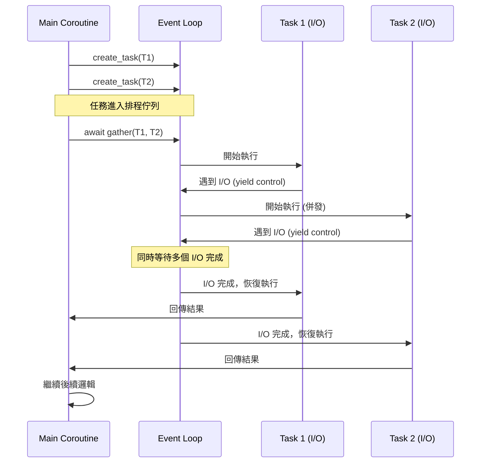

# asyncio 任務排程器

這是一份關於如何高效運用 `asyncio.create_task` 的實戰指南。作為一名架構師，我始終強調：**「語法只是工具，理解其背後的調度機制才是寫出高性能併發程式碼的關鍵。」**

### 情境 1：優先使用 `asyncio.create_task` 實現非阻塞的併發排程

#### 核心概念簡述
在 `asyncio` 中，僅僅呼叫 `async def` 定義的協程（Coroutine）並不會開始執行，它只會回傳一個協程物件。如果你直接使用 `await`，該協程會立即「阻塞」當前的執行流，直到該任務完成。若要實現真正的併發，必須將協程包裝成 `Task`，這會通知事件迴圈（Event Loop）盡快排程執行該任務，並立即回傳控制權。

#### 程式碼範例 (Bad vs. Better)

```python
# Bad: 序列執行 (Sequential Execution)
# 雖然使用了 async/await，但行為與同步代碼無異，總共耗時約 2 秒
async def fetch_data_bad():
    res1 = await delay(1)  # 暫停並等待 1 秒
    res2 = await delay(1)  # 再暫停並等待 1 秒
    return [res1, res2]

# Better: 併發排程 (Concurrent Scheduling)
# 利用 create_task 立即排程，總共耗時約 1 秒
async def fetch_data_better():
    # 建立 Task 會立即將協程排入事件迴圈的任務佇列
    task1 = asyncio.create_task(delay(1))
    task2 = asyncio.create_task(delay(1))

    # 此時兩個任務已在後台併發運行
    res1 = await task1
    res2 = await task2
    return [res1, res2]
```

#### 底層原理探討與權衡
`asyncio.create_task` 的本質是將協程封裝為 `Task` 物件，這是一種特殊的 `Future`。
*   **優點**：它允許主程式在等待 I/O 的同時繼續執行其他邏輯（例如 UI 渲染或處理其他請求）。
*   **權衡**：過度建立細小的 Task 會增加事件迴圈上下文切換（Context Switch）的開銷。如果任務是運算密集型（CPU-bound），`create_task` 並不能提供效能增長，反而會阻塞整個事件迴圈。

---

### 情境 2：在大規模併發時，避免「邊建立邊等待」模式

#### 核心概念簡述
新手常犯的錯誤是在迴圈中建立 Task 後立即 `await`，這會導致併發失效，變成序列執行。正確做法是先「批量排程」，再「統一等待」。

#### 程式碼範例 (Bad vs. Better)

```python
# Bad: 在 Comprehension 中直接 await，導致併發失敗
async def process_urls_bad(urls):
    # 這會一個接一個執行，效率極低
    results = [await asyncio.create_task(fetch(u)) for u in urls]
    return results

# Better: 批量建立 Task，再使用 gather 統一等待
async def process_urls_better(urls):
    # 第一步：建立所有任務（非阻塞排程）
    tasks = [asyncio.create_task(fetch(u)) for u in urls]

    # 第二步：併發等待結果並保持順序
    results = await asyncio.gather(*tasks)
    return results
```

#### 適用場景
*   **拇指法則 (Rule of Thumb)**：當你需要同時發出多個獨立的網絡請求或數據庫查詢時，應始終採用「先建立、後 gather」的模式。
*   **例外情況**：如果後續任務依賴於前一個任務的結果（例如先登入獲取 Token，再請求數據），則必須使用序列的 `await`。

---

### 加強內容：併發執行流程圖與比較表

#### 事件迴圈處理併發 Task 的機制



#### 任務管理方式比較表

| 方式 | 特性 | 錯誤處理 | 適用場景 |
| :--- | :--- | :--- | :--- |
| `await coro()` | 序列執行，簡單直觀 | 異常立即拋出 | 具有前後依賴關係的任務 |
| `asyncio.create_task()` | 手動排程，具備 Task 句柄 | 若未 await，異常可能被遺漏 | 需要精細控制單一任務（如取消任務） |
| `asyncio.gather()` | 高階封裝，批量併發執行 | 可集中處理或忽略異常 | 多個獨立任務，且需依序獲取結果 |

---

### 延伸思考

**1️⃣ 問題一**：如果我不 `await` 一個 `create_task` 建立的任務，會發生什麼事？

**👆 回答**：該任務仍會在事件迴圈中執行，但這是不良實踐。首先，你無法獲取它的回傳值；其次，如果該任務拋出異常且未被檢索（unretrieved），Python 會拋出警告警告該異常未被處理，甚至在 Task 物件被垃圾回收時才顯示，這會讓調試變得極其困難。

---

**2️⃣ 問題二**：`asyncio.create_task` 真的能實現多核心平行運算嗎？

**👆 回答**：不能。`asyncio` 是**單執行緒**的併發模型。它的併發是基於非阻塞 I/O 的「切換」，而非平行。如果你需要利用多核心處理計算密集型任務（如圖片處理或大規模計算），必須結合 `loop.run_in_executor` 使用 `ProcessPoolExecutor`。

---

**3️⃣ 問題三**：在 FastAPI 這樣的框架中，我該如何善用併發？

**👆 回答**：在 FastAPI 處理請求時，若需要從多個外部 API（如 OpenAI 或數據庫）獲取數據，應將這些請求封裝為 Task 並併發執行。此外，對於耗時長且不需要立即回傳結果的邏輯，可以使用 FastAPI 內建的 `BackgroundTasks`，它在底層也是基於事件迴圈或執行緒池來管理任務的。