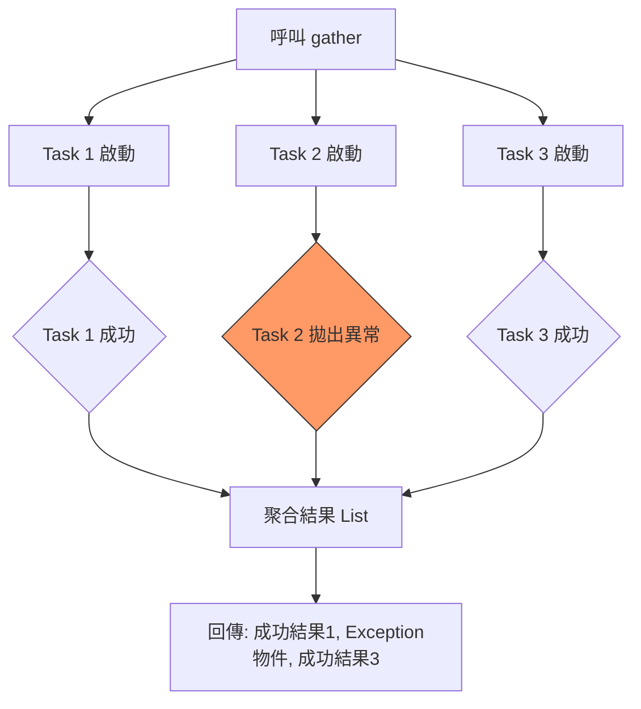

# asyncio.gather 任務聚合器

這是在開發高性能非同步系統時，關於如何運用 `asyncio.gather()` 整合任務與聚合結果的實戰指南。作為架構師，我始終認為：**「併發不只是為了速度，更是為了在資源受限的環境下優雅地處理異質任務。」**
### 情境 1：將序列化的 I/O 請求重構為併發聚合模式

#### 核心概念簡述
當你需要從多個來源（如多個 REST API 或資料庫查詢）獲取數據時，新手最常見的錯誤是使用 `for` 迴圈搭配 `await`。這會導致任務「序列化」執行，總耗時是所有任務的加總。`asyncio.gather()` 允許你傳入一組 awaitable 物件（如協程），它會自動將協程包裝成 Task 並在事件迴圈中啟動。這能讓原本需要數十秒的任務，在理論上縮減至最慢的一個任務所需的時間。

#### 程式碼範例 (Bad vs. Better)

```python
# Bad: 序列執行 (Sequential)
# 總耗時 = 請求 1 + 請求 2 + ... + 請求 N
async def fetch_all_sequential(urls, session):
    results = []
    for url in urls:
        # 這裡會阻塞，直到當前請求完成才會發出下一個
        res = await fetch_status(url, session)
        results.append(res)
    return results

# Better: 使用 gather 進行併發聚合
# 總耗時 ≈ 最慢的一個請求
async def fetch_all_concurrent(urls, session):
    # 建立協程物件列表（此時尚未開始執行）
    tasks = [fetch_status(url, session) for url in urls]

    # gather 會自動將其排入排程並併發執行
    # 結果會以 list 形式回傳
    results = await asyncio.gather(*tasks)
    return results
```

#### 底層原理探討與權衡
`asyncio.gather()` 的核心優勢在於**結果順序性**。儘管任務在後台可能是無序完成的（例如任務 B 比任務 A 先完成），但 `gather` 保證回傳的結果列表順序與你傳入的 awaitable 順序完全一致。
*   **優點**：大幅提升 throughput（吞吐量），實驗顯示在大量 Web 請求下效能可提升超過 30 倍。
*   **權衡**：`gather` 會等到**所有**任務都完成後才回傳。如果你需要「完成一個處理一個」，應考慮使用 `as_completed`。

---

### 情境 2：精確控制異質任務中的異常傳遞策略

#### 核心概念簡述
在併發環境下，錯誤處理是決定系統健壯性的關鍵。`gather` 提供了一個關鍵參數 `return_exceptions`。預設情況下 (`False`)，一旦其中一個任務拋出異常，`gather` 會立即向外拋出該異常，但**其他已啟動的任務不會被取消**。這往往會導致結果處理的混亂。

#### 程式碼範例 (Bad vs. Better)

```python
# Bad: 預設異常處理 (return_exceptions=False)
# 如果 task1 失敗，你將拿不到 task2 的成功結果，且 task2 仍在背景跑
async def handle_badly():
    try:
        res = await asyncio.gather(fail_task(), success_task())
    except Exception as e:
        print(f"只抓到第一個失敗: {e}")

# Better: 收集所有結果，包含異常物件
async def handle_robustly():
    results = await asyncio.gather(
        fail_task(),
        success_task(),
        return_exceptions=True
    )
    # result 列表中會包含成功的結果與 Exception 物件
    successful_results = [r for r in results if not isinstance(r, Exception)]
    errors = [r for r in results if isinstance(r, Exception)]
    return successful_results
```

#### 適用場景
*   **拇指法則 (Rule of Thumb)**：如果你的多個併發任務是「獨立且非關鍵」的（例如收集多個不同來源的資訊），應設定 `return_exceptions=True` 以確保局部失敗不影響整體結果收集。
*   **例外情況**：如果這是一組「全有或全無」的原子操作，則應保留預設值並在 `except` 塊中明確執行取消邏輯。

---

### 加強內容：任務執行與異常行為對照

#### 併發聚合流程圖 (return_exceptions=True)



#### 異常策略對比表

| 特性 | `return_exceptions=False` (預設) | `return_exceptions=True` |
| :--- | :--- | :--- |
| **首個異常發生時** | 立即將異常向外拋出給 `await` 者 | 不拋出，將異常視為結果存入 list |
| **其他未完任務** | 繼續執行，不會被取消 | 繼續執行，直到完成 |
| **回傳值類型** | `List[Result]` (若全成功) | `List[Union[Result, Exception]]` |
| **適合場景** | 原子性操作，任一失敗即視為整體失敗 | 批次處理，容許部分任務失敗 |

---

### 延伸思考

**1️⃣ 問題一**：`asyncio.gather()` 可以限制併發數量（例如一次最多跑 10 個）嗎？

**👆 回答**：不可以。`gather` 會一次性啟動所有傳入的 awaitable。如果你需要限制併發（例如避免資料庫連線爆掉或觸發 API Rate Limit），必須結合使用 `asyncio.Semaphore`。

---

**2️⃣ 問題二**：傳給 `gather` 的列表包含重複的 Task 物件會怎樣？

**👆 回答**：`asyncio.gather` 是冪等的（Idempotent）。同一個 Task 如果被傳入多次，它只會被執行一次，但其結果會在回傳的 list 中出現多次，對應於你傳入的位置。

---

**3️⃣ 問題三**：如果我需要「失敗一個就取消全部」，`gather` 是最好的選擇嗎？

**👆 回答**：不是最好的。雖然你可以手動捕獲異常並取消 pending tasks，但 Python 3.11 引入的 `asyncio.TaskGroup` 提供了更現代的「結構化併發」解決方案，當一個子任務失敗時，它會自動取消其他所有任務。