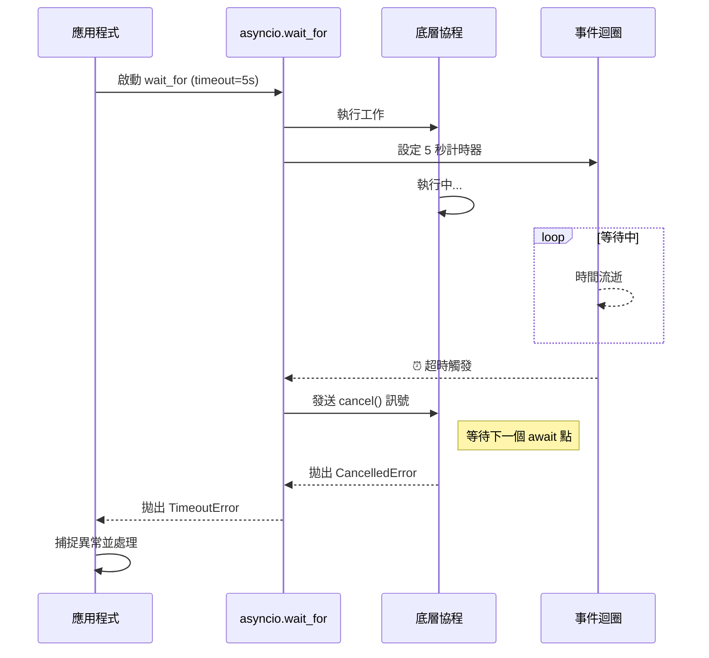

# 協程超時管理

這是在構建高可用非同步系統時，關於如何運用 `asyncio.wait_for` 進行超時控制的深度實戰指南。身為架構師，我始終堅持一個原則：**「任何與外部系統（網路、資料庫、檔案）的交互，若沒有設置超時邊界，就是對系統穩定性的蓄意破壞。」**,

### 情境 1：永遠為不可控的 I/O 任務設置超時邊界

#### 核心概念簡述
非同步程式最常見的陷阱是「永久懸掛」。當你 `await` 一個網路請求時，如果遠端伺服器崩潰且未正確關閉連接，你的協程將無限期等待，這會導致系統資源（如記憶體、檔案描述符）被緩慢耗盡,。`asyncio.wait_for` 的核心作用是為協程加上一個「定時炸彈」，一旦時間耗盡，它會強制拋出 `TimeoutError` 並試圖取消該任務,。

#### 程式碼範例 (Bad vs. Better)

```python
# Bad: 無保護的等待
# 如果遠端伺服器掛起，這個協程會永遠占用資源
async def fetch_risky_data(url):
    response = await aiohttp_request(url) # 可能永遠不會返回
    return response

# Better: 使用 wait_for 強制設置生存週期
async def fetch_safe_data(url):
    try:
        # 設定 5 秒超時邊界
        response = await asyncio.wait_for(aiohttp_request(url), timeout=5.0)
        return response
    except asyncio.TimeoutError:
        print(f"警告：請求 {url} 已超時，任務已自動取消。")
        return None
```

#### 底層原理探討與權衡
`asyncio.wait_for` 不僅僅是個計時器。當發生超時時，它會向底層任務發送一個 `cancel()` 訊號。
*   **關鍵機制**：任務只有在下一個 `await` 點（例如等待 Socket 讀寫）才會感知到取消請求並拋出 `CancelledError`。
*   **權衡**：如果被包裝的任務內部正在執行「純計算」的 Python 程式碼（CPU-bound）而沒有 `await` 點，超時通知會被延遲，直到程式碼回到非同步調度器手中。

---

### 情境 2：使用 `asyncio.shield` 保護必須完成的關鍵操作

#### 核心概念簡述
有時你會遇到一種矛盾：你想在超時後立即回應使用者「處理太久了」，但你卻不希望底層的操作被取消（例如：資料庫寫入或重要的清理動作）。預設情況下，`wait_for` 會取消超時的任務。此時，你需要 `asyncio.shield` 來作為「護盾」，讓調度器認為超時發生了，但底層任務仍能在後台默默跑完,。

#### 程式碼範例 (Bad vs. Better)

```python
# Bad: 超時導致數據不一致
# 如果寫入資料庫超時，任務被取消，可能導致部分更新失敗
async def save_data_risky(data):
    await asyncio.wait_for(db_commit(data), timeout=1.0)

# Better: 即使超時，也要保證背景任務執行完畢
async def save_data_robust(data):
    task = asyncio.create_task(db_commit(data))
    try:
        # 使用 shield 保護任務不被 wait_for 的超時取消訊號干擾
        await asyncio.wait_for(asyncio.shield(task), timeout=1.0)
    except asyncio.TimeoutError:
        print("系統提示：寫入操作較慢，我們將在背景繼續處理，您可以先行離開。")
        # 這裡 task 依然在執行，不會因為 wait_for 的 Timeout 而中斷
        await task
```

#### 適用場景
*   **拇指法則 (Rule of Thumb)**：任何具有「副作用」且必須保證完整性（All-or-nothing）的任務，若需掛載超時控制，應優先考慮配合 `shield` 使用。
*   **例外情況**：純粹的資料讀取（Read-only）任務不需要 `shield`，超時後直接取消是最省資源的做法。

---

### 加強內容：超時處理機制對比

#### wait_for 的超時取消流程



#### 超時工具特性比較表

| 工具 | 超時後是否取消任務 | 是否拋出異常 | 適用場景 |
| :--- | :--- | :--- | :--- |
| `asyncio.wait_for` | **是** | 拋出 `TimeoutError` | 單一任務的嚴格限制 |
| `asyncio.wait` | **否** (需手動處理) | 不拋出異常，返回 sets | 批量任務部分超時處理 |
| `asyncio.shield` | **否** (護盾保護) | 依賴外層封裝 | 關鍵寫入操作防護 |

---

### 延伸思考

**1️⃣ 問題一**：為什麼我用了 `wait_for` 設定 1 秒超時，但一個計算 Fibonacci 數列的函數還是跑了 10 秒才停？

**👆 回答**：因為 `asyncio` 是「協作式多工」。`wait_for` 的取消訊號必須在任務「暫停（yield control）」時才能傳入。如果你的函數正在做密集的 CPU 計算且沒有 `await` 或 `asyncio.sleep(0)`，它就不會釋放控制權給事件迴圈，計時器也就無法中斷它,。對於 CPU 密集型任務，你應該使用 `ProcessPoolExecutor`,。

---

**2️⃣ 問題二**：在製作爬蟲時，`wait_for` 設定在 `gather` 裡面好，還是外面好？

**👆 回答**：這取決於你的目的。如果你希望「整個批次任務」不能超過 30 秒，則應放在 `gather` 外面；如果你希望「每一個單獨請求」不能超過 5 秒，則應為每個協程分別包裝 `wait_for`。通常建議在單個請求層級做超時控制，這能避免單一慢速網站拖累整個批次進度。

---

**3️⃣ 問題三**：`asyncio.wait_for` 的超時時間設定為 0 會發生什麼事？

**👆 回答**：設定為 0 會導致該協程在事件迴圈的下一次迭代中立即被取消（如果它沒有立即完成）。這有時被用來檢查一個協程是否能立即產生結果而不進入等待狀態。但在生產環境中，這通常被視為邏輯錯誤，應避免使用硬編碼的 0 作為超時。