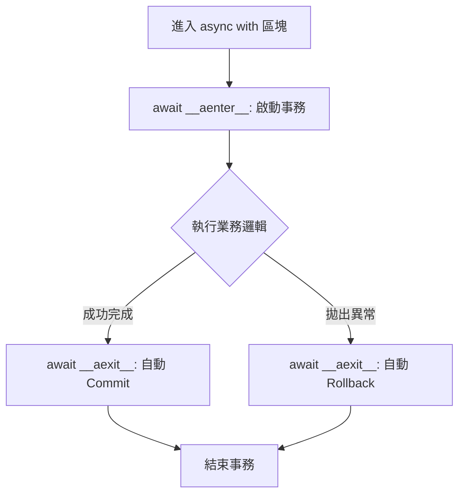

# 非同步 context managers

在非同步程式設計中，資源管理（如資料庫連線、網路通訊協定、檔案描述符）的健壯性是區分資深與資淺開發者的關鍵指標。如同 Joshua Bloch 在 *Effective Java* 中強調 `try-with-resources` 的重要性，在 Python 非同步生態系中，`async with` 指令是確保資源不洩漏、程式不鎖死的標準工具。

---

### 情境 1：優先使用 `async with` 封裝非同步資源的生命週期

在處理需要明確開啟與關閉的資源（如 `aiohttp.ClientSession` 或資料庫連線）時，手動呼叫 `close()` 是極其危險的。如果程式在執行中拋出異常，清理程式碼可能永遠不會被觸發，導致資源洩漏。

#### 核心概念簡述
非同步 Context Manager 是實作了 `__aenter__` 與 `__aexit__` 這兩個協程（Coroutine）方法的類別。它們允許你在獲取或釋放資源時進行 I/O 操作（例如：等待網路握手完成或清空緩衝區），這是在標準 `with` 語句中無法實現的。

#### 程式碼範例

```python
# Bad: 手動管理資源，容易漏掉 close() 或在異常時洩漏
session = aiohttp.ClientSession()
try:
    response = await session.get("https://example.com")
    # 處理回應...
finally:
    await session.close() # 若在此之前發生不可預期的錯誤，可能導致連線殘留

# Better: 使用 async with 自動管理
async with aiohttp.ClientSession() as session:
    async with session.get("https://example.com") as response:
        status = response.status
        # 區塊結束後，session 會透過 __aexit__ 自動且安全地釋放連線資源
```

#### 底層原理探討與權衡
當進入 `async with` 區塊時，程式會 `await` `__aenter__` 的結果；離開區塊（無論是正常結束或因異常中斷）時，則會 `await` `__aexit__`。
*   **優勢**：異常安全性（Exception Safety）。即使在處理資料時發生錯誤，非同步關閉邏輯（如 `drain` 緩衝區）仍保證會執行。
*   **權衡**：如果你管理的資源本身是同步的（不涉及 I/O），使用 `async with` 會增加不必要的事件循環調度開銷。

---

### 情境 2：利用 `async with` 實作非同步事務（Transactions）管理

資料庫操作中，事務的「原子性」必須得到保證。使用非同步 Context Manager 可以確保在操作失敗時自動回滾（Rollback），在成功時自動提交（Commit）。

#### 核心概念簡述
許多非同步資料庫驅動（如 `asyncpg` 或 `SQLAlchemy`）都將事務封裝在 `async with` 中。這不僅減少了樣板程式碼，更避免了開發者忘記 `commit` 導致資料未持久化的低階錯誤。

#### 程式碼範例

```python
# Bad: 需要手動判斷 commit/rollback，邏輯散亂
tr = connection.transaction()
await tr.start()
try:
    await connection.execute("INSERT INTO brands (name) VALUES ($1)", "NewBrand")
    await tr.commit()
except Exception:
    await tr.rollback()
    raise

# Better: 聲明式管理
# async with 會在發生異常時自動觸發 rollback
async with connection.transaction():
    await connection.execute("INSERT INTO brands (name) VALUES ($1)", "NewBrand")
    # 如果執行到此沒拋錯，退出時自動 commit
```

#### 流程說明
以下是 `async with` 處理資料庫事務的邏輯流：



---

### 情境 3：檔案 I/O 必須使用非同步封裝以避免事件循環阻塞

標準的 `with open(...)` 會阻塞整個執行緒（Thread），因為它是同步的硬碟操作。在高效能非同步服務中，這會導致其他所有連線被暫停。

#### 核心概念簡述
非同步檔案庫（如 `aiofiles`）提供了 `async with` 介面，透過在執行緒池中執行檔案操作來模擬非同步行為，從而保證事件循環的流暢性。

#### 程式碼範例

```python
# Bad: 阻塞事件循環
def upload_file(data):
    with open("data.txt", "w") as f: # 這裡會卡住整個事件循環
        f.write(data)

# Better: 使用非同步 Context Manager
async def upload_file_async(data):
    import aiofiles
    async with aiofiles.open("data.txt", mode="w") as f:
        await f.write(data) # 寫入時會 cede 控制權給事件循環處理其他請求
```

#### 比較與整合表
| 特性 | 標準 `with` (同步) | `async with` (非同步) |
| :--- | :--- | :--- |
| **適用場景** | CPU 密集或記憶體物件處理 | I/O 密集 (網路、資料庫、大型檔案) |
| **執行緒狀態** | 獲取資源時會阻塞執行緒 | 獲取資源時可暫停協程，讓其他任務運行 |
| **自定義實作** | `__enter__`, `__exit__` | `__aenter__`, `__aexit__` (皆為協程) |
| **典型範例** | 處理 JSON、本地小檔案 | `aiohttp`, `asyncpg`, `aiofiles` |

---

### 拇指法則 (Rule of Thumb)
*   **凡是有 I/O 參與的資源獲取，皆應尋找非同步版本並使用 `async with`**。
*   **例外情況**：如果資源的 `close()` 是立即完成且不涉及系統呼叫（例如關閉一個記憶體內部的緩存物件），則不一定需要 `async with`。

---

### 延伸思考

**1️⃣ 問題一**：如果我在 `async with` 區塊內忘記寫 `await` 會發生什麼事？

**👆 回答**：這是一個常見陷阱。如果你在該區塊內呼叫了一個協程但沒有 `await` 它，該任務會被建立（作為一個協程物件）但不會被執行。有些資源管理器在 `__aexit__` 中會檢查是否有掛起的任務，但在大多數情況下，這會導致你的程式行為變得不可預測（例如：回應已發送，但資料庫還沒寫入）。

---

**2️⃣ 問題二**：`async with` 與 `asyncio.Lock` 結合使用的場景為何？

**👆 回答**：當你需要保護「非同步關鍵區段（Critical Section）」時，例如在兩個 `await` 之間修改共享資料。使用 `async with lock:` 可以確保只有一個協程能在一段時間內操作該資源，且在操作完成或報錯後自動釋放鎖，防止死鎖（Deadlock）。這比手動 `lock.acquire()` 更安全，因為它利用了 Context Manager 的異常清理機制。