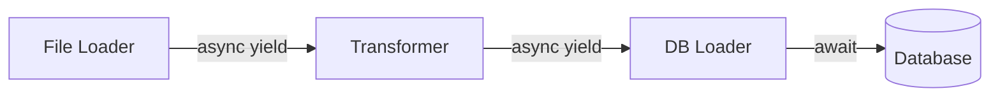

# 非同步迭代器與生成器

在處理大規模數據集或實時數據流（如 LLM 的 Token 輸出）時，記憶體管理是軟體架構中最脆弱的一環。資深開發者知道，將數百萬條數據一次性載入記憶體（`fetch_all`）無異於在系統中埋下炸彈。Python 的非同步迭代器與生成器（`async for` 與 `async yield`）提供了「惰性求值（Lazy Evaluation）」的優雅手段，確保程式在處理長序列時依然保持低記憶體足跡與高回應性。

---

### 情境 1：優先使用非同步生成器串流大數據，而非一次性載入

當你從資料庫或外部 API 獲取大量資料時，傳統做法會導致記憶體瞬間飆升，甚至引發 OOM（Out of Memory）錯誤。

#### 核心概念簡述
非同步生成器（Async Generator）是使用了 `async def` 且包含 `yield` 的函式。它不返回完整的列表，而是每當迭代器請求下一個元素時，才非同步地產生資料。

#### 程式碼範例

```python
# Bad: 一次性拉取所有資料，若有百萬行會耗盡記憶體
async def fetch_all_users(connection):
    # fetch 將所有結果存入內存列表
    users = await connection.fetch("SELECT * FROM large_user_table")
    for user in users:
        process(user)

# Better: 使用非同步生成器進行串流處理
async def stream_users(connection):
    # 使用 cursor 開啟伺服器端游標，每次僅抓取少量（如 50 筆）到內存
    async with connection.transaction():
        async for user in connection.cursor("SELECT * FROM large_user_table"):
            yield user # 惰性產生每一筆資料

# 使用端
async for user in stream_users(conn):
    await process(user) # 處理完一個才取下一個
```

#### 底層原理探討與權衡
*   **記憶體效率**：非同步游標（Cursor）會在後台進行預取（Prefetch），例如 `asyncpg` 預設預取 50 筆，這在保持網路傳輸效率與降低記憶體壓力之間取得了平衡。
*   **事件迴圈友好**：`async for` 在每一次循環的間隙都會讓出控制權給事件迴圈，確保其他並發任務（如 API 請求）不會被長耗時的資料處理給卡死。

---

### 情境 2：利用 `async yield` 實作非同步數據管道（Pipes and Filters）

在數據工程中，將數據提取、轉換、加載（ETL）拆解為獨立的過濾器（Filters）是提升可維護性的關鍵。

#### 核心概念簡述
非同步生成器可以像樂高積木一樣組合。一個生成器的輸出可以作為下一個生成器的輸入，形成一個高效的非同步數據流管道。

#### 程式碼範例

```python
# Better: 實作可組合的非同步管道

async def data_loader(file_path):
    """提取：非同步讀取大檔案"""
    async with aiofiles.open(file_path, mode='r') as f:
        async for line in f:
            yield line #

async def data_transformer(it):
    """轉換：清洗數據"""
    async for item in it:
        clean_item = item.strip().upper()
        if clean_item:
            yield clean_item #

# 組裝管道
loader = data_loader("huge_data.txt")
pipeline = data_transformer(loader)

async for data in pipeline:
    await save_to_db(data)
```

#### 流程說明 (Pipes and Filters)



---

### 情境 3：處理 LLM 的串流 Token 輸出 (Real-time Streaming)

在 AI 應用中，等待 LLM 生成完整段落再顯示會造成嚴重的延遲感。使用非同步生成器可以實作 Token 級別的實時回應。

#### 核心概念簡述
透過設置 `stream=True`，模型供應商（如 OpenAI）會返回一個非同步產生器，這允許前端透過 SSE（Server-Sent Events）或 WebSocket 即時渲染內容。

#### 程式碼範例

```python
# Better: 實作 Token 串流傳輸
async def get_llm_stream(prompt):
    response = await client.chat.completions.create(
        model="gpt-4o",
        messages=[{"role": "user", "content": prompt}],
        stream=True # 啟用串流模式
    )
    async for chunk in response:
        content = chunk.choices.delta.content
        if content:
            yield f"data: {content}\n\n" # 符合 SSE 規範的輸出
```

#### 比較與整合表
| 特性 | 同步生成器 (`yield`) | 非同步生成器 (`async yield`) |
| :--- | :--- | :--- |
| **宣告方式** | `def func()` | `async def func()` |
| **迭代方式** | `for x in gen` | `async for x in gen` |
| **核心機制** | 暫停當前函式執行 | 暫停當前協程，交回控制權給事件迴圈 |
| **適用場景** | 本地文件處理、純 CPU 計算 | 串流資料庫查詢、Socket 讀取、LLM 輸出 |

---

### 拇指法則 (Rule of Thumb)
*   **凡是處理「外部來源」的序列數據（資料庫、網路、大檔案），一律優先考慮非同步迭代器**。
*   **例外情況**：如果數據量極小（如配置列表）或對延遲要求極致（微秒級且無 I/O），同步迭代器更具優勢，因為它省去了協程調度的開銷。

---

### 延伸思考

**1️⃣ 問題一**：如果在 `async for` 循環中忘記寫 `async` 會發生什麼？

**👆 回答**：Python 會拋出 `TypeError: 'async_generator' object is not iterable`。這是因為非同步生成器對應的是 `__anext__` 方法（返回 awaitable），而標準 `for` 循環尋找的是同步的 `__next__` 方法。

---

**2️⃣ 問題二**：如何手動取出非同步迭代器的下一個值？

**👆 回答**：不能使用內建的 `next()`。必須使用 `anext()` 函式（Python 3.10+）並對其進行 `await`，例如：`item = await anext(async_gen_obj)`。這反映了非同步數據的本質：你無法保證數據何時「準備好」，因此必須等待。