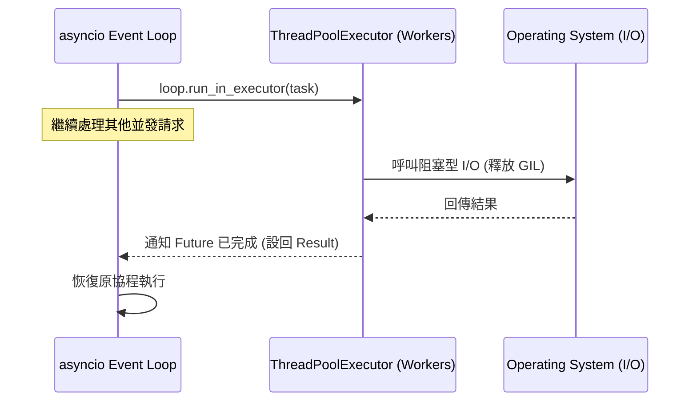

# 使用 thread_pool_executor 處理阻塞性 I/O

在非同步架構的演進中，我們常面臨一個尷尬的現實：並非所有庫都是「非同步原生」的。許多歷史悠久且穩定的庫（如 `requests`、`psycopg2` 或某些圖片處理庫）仍採用阻塞性 I/O 模型。作為架構師，我們必須建立一座橋樑，讓這些同步組件能在非同步的事件循環中和諧共存，而不至於凍結整個系統。

---

### 情境 1：嚴禁在 `async def` 中直接呼叫阻塞型同步函數

當你在一個非同步協程中直接呼叫 `requests.get()` 或 `time.sleep()` 時，你正在犯下非同步編程中最嚴重的錯誤：**阻塞事件循環 (Blocking the Event Loop)**。

#### 核心概念簡述
`asyncio` 是單執行緒運行的。事件循環就像是一個高效的調度員，如果其中一個協程執行了耗時的同步 I/O，調度員就會被卡住，導致其他並發任務（如正在處理的 HTTP 請求）全部掛起。

#### 程式碼範例

```python
# ❌ Bad: 在非同步環境中使用同步阻塞庫，會導致事件循環掛起
import asyncio
import requests

async def fetch_data_bad(url):
    # requests.get 是阻塞的，這會卡死整個 Event Loop
    response = requests.get(url)
    return response.status_code

# ✅ Better: 委派給執行緒池執行
async def fetch_data_better(url):
    loop = asyncio.get_running_loop()
    # 將同步呼叫委派給 ThreadPoolExecutor，Event Loop 仍能自由運作
    response = await loop.run_in_executor(None, requests.get, url)
    return response.status_code
```

#### 底層原理探討與權衡
*   **為什麼這樣有效？** 雖然 Python 有 GIL（全域解釋器鎖），但當執行緒進行底層系統呼叫（如網路 I/O）時，GIL 會被釋放。這意味著當執行緒在等待伺服器回應時，其他執行緒（包括 Event Loop 所在的執行緒）可以繼續執行 Python 字節碼。
*   **權衡**：執行緒的創建與切換成本比協程高得多。如果可以，優先選擇 `aiohttp` 這類非同步原生庫；若無選擇，才使用 `ThreadPoolExecutor`。

---

### 情境 2：使用 `run_in_executor` 整合遺留系統的同步庫

當你必須與不支援 `async/await` 的舊代碼或第三方 SDK 整合時，執行緒池是你的救星。

#### 核心概念簡述
`loop.run_in_executor` 接收一個執行緒池實例（如果傳入 `None` 則使用預設執行緒池）與一個可呼叫對象。它會返回一個 `Future`，讓你可以用 `await` 語法來「非同步地」等待同步結果。

#### 程式碼範例

```python
import asyncio
from concurrent.futures import ThreadPoolExecutor
import requests

def legacy_sync_task(data):
    # 假設這是一個複雜且阻塞的 legacy SDK 呼叫
    return requests.post("https://api.legacy.com/data", data=data).json()

async def main():
    # 拇指法則：對於 I/O 密集型，執行緒數可略多於 CPU 核心數
    with ThreadPoolExecutor(max_workers=20) as pool:
        loop = asyncio.get_running_loop()

        # 將同步任務封裝為非同步 Task
        tasks = [
            loop.run_in_executor(pool, legacy_sync_task, f"item_{i}")
            for i in range(5)
        ]

        # 使用熟悉的 asyncio API 併發等待
        results = await asyncio.gather(*tasks)
        print(results)
```

#### 流程說明 (Event Loop 委派模式)



---

### 情境 3：在 Python 3.9+ 中使用 `asyncio.to_thread` 簡化語法

如果你的專案環境較新，官方提供了更優雅的封裝方式，讓你不再需要手動獲取 `loop` 或處理 `functools.partial`。

#### 核心概念簡述
`asyncio.to_thread` 是 Python 3.9 引入的高階 API。它會自動在預設的執行緒池中執行同步函數，並返回一個協程。

#### 程式碼範例

```python
# ✅ Better: 現代化、簡潔的橋接方式 (Python 3.9+)
import asyncio
import requests

async def modern_bridge(url):
    # 底層依然是使用預設的 ThreadPoolExecutor
    # 語法更貼近自然語言：將此操作「轉向執行緒」執行
    response = await asyncio.to_thread(requests.get, url)
    return response.status_code
```

#### 比較與整合表：同步庫 vs 非同步庫

| 特性 | 同步庫 (requests / psycopg2) | 非同步庫 (aiohttp / asyncpg) |
| :--- | :--- | :--- |
| **底層機制** | 阻塞式 Sockets | 非阻塞式 Sockets |
| **併發手段** | 必須搭配 `ThreadPoolExecutor` | 原生 `await` 支援 |
| **資源開銷** | 較高（需 OS 執行緒與上下文切換） | 極低（協程調度） |
| **代碼複雜度** | 需手動管理執行緒池與同步點 | 代碼結構線性且易讀 |

---

### 拇指法則 (Rule of Thumb)
1.  **優先選用協程原生庫**（如 `aiohttp`, `asyncpg`）。
2.  **若同步庫無法避免**，務必使用 `asyncio.to_thread` (3.9+) 或 `run_in_executor`。
3.  **執行緒池大小**：Python 預設為 `min(32, os.cpu_count() + 4)`。對於高併發網路 I/O，可手動調大；對於 CPU 密集型，應改用 `ProcessPoolExecutor`。

---

### 延伸思考

**1️⃣ 問題一**：為什麼不能用執行緒池來處理純計算（CPU 密集型）的任務？

**👆 回答**：雖然阻塞 I/O 會釋放 GIL，但純計算任務會一直佔用 GIL。在多執行緒環境下，即便有 8 個核心，計算任務依然會因為 GIL 而被序列化執行，導致執行緒切換開銷反而讓速度變慢。計算任務必須使用 `ProcessPoolExecutor` 來利用多個 CPU 核心。

---

**2️⃣ 問題二**：在執行緒池中執行的任務，可以使用 `asyncio.Lock` 進行同步嗎？

**👆 回答**：**絕對不行**。`asyncio.Lock` 是為單執行緒協程設計的，並非執行緒安全 (Not thread-safe)。如果你在多個 OS 執行緒中存取共用資源，必須使用 `threading.Lock` 或是 `concurrent.futures` 提供的同步原語。