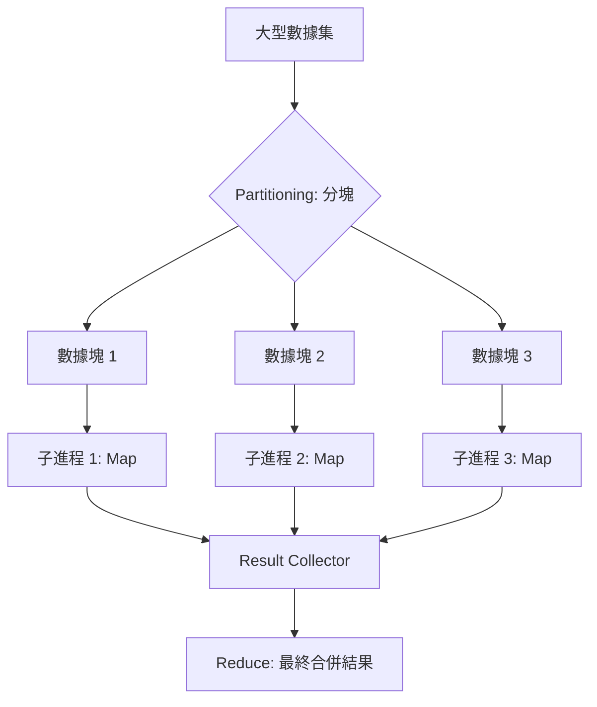

# 使用 ProcessPoolExecutor 處理計算密集任務

在非同步架構中，最容易讓開發者栽跟頭的陷阱就是試圖在協程（Coroutine）中處理重度計算（如大型矩陣運算、圖像處理或複雜的加密演算法）。由於 Python 的全域解釋器鎖（GIL）限制，一個進程（Process）一次只能執行一個字節碼指令。如果你在協程中跑計算任務，整個事件循環（Event Loop）會被凍結，導致服務完全失去回應。作為架構師，我們必須利用「進程級別」的並行（Parallelism）來徹底繞過這個物理限制。

---

### 情境 1：嚴禁在事件循環中執行 CPU 密集型運算

許多開發者誤以為只要加上 `async def`，複雜的數學運算就會自動變快。事實上，這只會讓你的系統在運算期間「心跳停止」。

#### 核心概念簡述
當 CPU 忙於執行耗時的 Python 代碼時，它無法切換回事件循環去處理網路 I/O。這就是所謂的「計算阻塞」。解決方案是將任務外包給獨立的作業系統進程，每個進程擁有自己的 Python 解釋器和獨立的 GIL。

#### 程式碼範例

```python
# ❌ Bad: 在協程中直接執行重度計算，會卡死 Event Loop
async def process_large_data_bad(data):
    # 假設這是耗時 5 秒的運算
    result = sum(i * i for i in range(10**7))
    return result

# ✅ Better: 將計算任務委派給 ProcessPoolExecutor
import asyncio
from concurrent.futures import ProcessPoolExecutor

def heavy_computation(data):
    # 純同步的計算邏輯
    return sum(i * i for i in range(10**7))

async def main():
    loop = asyncio.get_running_loop()
    # 使用進程池，充分利用多核 CPU 效能
    with ProcessPoolExecutor() as pool:
        result = await loop.run_in_executor(pool, heavy_computation, "some_data")
        print(f"結果: {result}")
```

#### 底層原理探討與權衡
*   **為什麼這樣有效？** `run_in_executor` 會將任務交給進程池中的子進程。由於子進程運行在不同的 CPU 核心上，它們可以與主進程並行執行，且不會競爭同一個 GIL。
*   **權衡**：跨進程通訊涉及「序列化（Pickling）」。將大型物件傳送給子進程或從中取回結果會產生額外的 I/O 與 CPU 開銷。

---

### 情境 2：根據物理核心數合理配置進程池規模

過度配置進程池（Spawn too many processes）並不會讓你的程式更快，反而會因為頻繁的上下文切換（Context Switching）與記憶體開銷而導致效能下降。

#### 核心概念簡述
進程是「重量級」的。每個進程都有獨立的記憶體空間，頻繁創建與銷毀進程是極大的浪費。我們應該根據 CPU 的實際核心數（Core Count）來建立長效的進程池。

#### 程式碼範例

```python
# ✅ Better: 根據硬體規格精準控制並行度
import os
from concurrent.futures import ProcessPoolExecutor

# 拇指法則：通常設為 CPU 核心數 (os.cpu_count())
# 如果核心數很多，可考慮保留 1-2 個給主進程與系統調度
MAX_WORKERS = os.cpu_count() or 1

async def parallel_task_manager():
    with ProcessPoolExecutor(max_workers=MAX_WORKERS) as executor:
        loop = asyncio.get_running_loop()
        # ... 提交任務
```

#### 比較與整合表
| 特性 | ThreadPoolExecutor (多執行緒) | ProcessPoolExecutor (多進程) |
| :--- | :--- | :--- |
| **並行能力** | 受限於 GIL，無法真正的 CPU 並行 | 繞過 GIL，實現真正的多核並行 |
| **資源開銷** | 低（共享記憶體空間） | 高（獨立記憶體空間） |
| **適用對象** | 阻塞性 I/O (requests, 舊版 DB 驅動) | 計算密集型 (數據處理, 加密, 矩陣) |
| **數據交換** | 直接存取變數（需注意執行緒安全） | 必須透過序列化 (Pickle) 傳輸 |

---

### 情境 3：使用進程池處理大數據時的數據分塊（Partitioning）策略

如果你有數百萬條數據要處理，一條一條傳送給子進程會讓序列化的開銷吃掉所有並行優勢。

#### 核心概念簡述
這就是 MapReduce 的思想：將大任務拆成若干「數據塊（Chunks）」，每塊包含數千條數據，一次性交給子進程處理。這能最小化主從進程間的溝通頻率。

#### 流程說明 (MapReduce 模式)



---

### 拇指法則 (Rule of Thumb)
1.  **計算密集型任務（如數據分析、機器學習推理）一律使用 `ProcessPoolExecutor`**。
2.  **進程池大小應與 `os.cpu_count()` 對齊**，避免過度競爭核心資源。
3.  **大數據處理需採用分塊（Chunking）策略**，以減少 Pickle 序列化的時間開銷。

---

### 延伸思考

**1️⃣ 問題一**：如果我的計算任務需要共享一個超大型的唯讀數據（如 10GB 的 Lookup Table），每個進程都載入一份會導致 OOM（記憶體溢出），該怎麼辦？

**👆 回答**：在 Unix 系統中，利用 `fork` 機制可以讓子進程共享父進程的記憶體頁（Copy-on-Write）。你可以先在父進程載入數據，再啟動進程池。更進階的做法是使用 `multiprocessing.shared_memory` 或 `Manager` 對象，這允許跨進程直接存取同一塊記憶體區域，而無需序列化。

---

**2️⃣ 問題二**：子進程中拋出的異常會發生什麼事？

**👆 回答**：這是一個極佳的健壯性問題。當子進程發生未捕獲的異常時，`run_in_executor` 返回的 `Future` 物件會封裝該異常。當你在主進程中 `await` 該任務時，異常會被重新拋出。架構師應務必在主進程中使用 `try...except` 捕獲這些來自遠方的錯誤，否則主程式可能會因為子進程的失敗而崩潰。