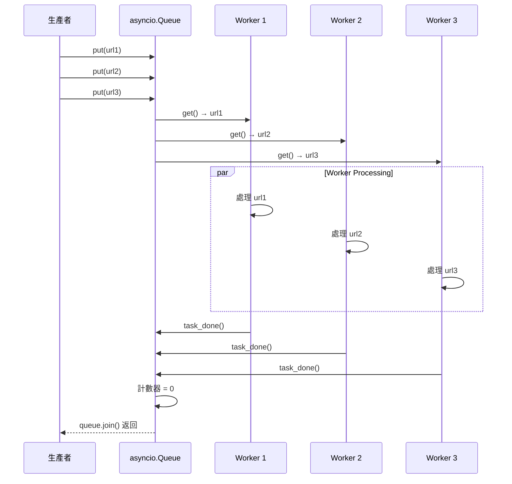

# 非同步隊列應用

在處理高併發的 I/O 密集型任務（如 Web 爬蟲或 AI 推論請求）時，開發者常犯的錯誤是「無限制地建立任務」。這會導致系統資源（記憶體、連接數）迅速耗盡。作為架構師，我始終主張使用 **生產者-消費者模型 (Producer-Consumer Pattern)** 來調節系統負載，確保服務的穩定性與可伸縮性。

---

### 情境 1：使用 `asyncio.Queue` 調節任務負載而非盲目併發

#### 核心概念簡述
非同步隊列（`asyncio.Queue`）本質上是一個先進先出（FIFO）的資料結構，它允許我們將「資料產生（生產者）」與「任務處理（消費者）」進行 **解耦**。透過限制隊列的大小（Bounded Queue）與固定數量的消費者（Worker），我們可以精確地控制系統對下游資源（如資料庫或第三方 API）的負載壓力和並發率。

#### 程式碼範例（Bad vs. Better）

```python
# Bad: 無限制地併發執行 (Unbounded Concurrency)
# 這會導致瞬間對伺服器發送 1000 個請求，可能觸發 Rate Limit 或記憶體溢出
async def bad_crawler(urls):
    tasks = [fetch_url(url) for url in urls]
    results = await asyncio.gather(*tasks) # 瞬間爆炸
    return results

# ---------------------------------------------------------

# Better: 使用生產者-消費者模型限制並發 (Load Regulation)
# 透過固定數量的 Worker，確保系統負載始終在可控範圍內
import asyncio

async def worker(name, queue):
    while True:
        # 消費者從隊列獲取任務
        url = await queue.get() #
        try:
            print(f"Worker {name} 正在處理: {url}")
            await fetch_url(url)
        finally:
            # 必須通知隊列該任務已完成，否則 join() 將永遠阻塞
            queue.task_done()

async def main(urls):
    # 建立一個容量有限的隊列 (Bounded Queue)
    queue = asyncio.Queue(maxsize=10)

    # 啟動 3 個 Worker 作為固定數量的消費者
    workers = [asyncio.create_task(worker(f"W-{i}", queue)) for i in range(3)]

    # 生產者將資料放入隊列
    for url in urls:
        await queue.put(url) # 若隊列滿了，生產者會在此暫停等待

    # 等待隊列中所有任務完成
    await queue.join() #

    # 關閉 Worker 任務
    for w in workers:
        w.cancel()
```

#### 底層原理探討與權衡
1.  **為什麼要 `task_done()` 與 `join()`？**
    `Queue.join()` 會阻塞直到隊列內部的計數器歸零。每當 `get()` 取出項目，計數器加 1；開發者必須手動呼叫 `task_done()` 讓計數器減 1。這是確保優雅關閉（Graceful Shutdown）與同步任務進度的核心機制。
2.  **記憶體與背壓（Backpressure）：**
    使用有界隊列（`maxsize > 0`）能產生「背壓」效果。當消費者處理不及時，生產者會在 `put()` 時被暫停，防止記憶體中積壓過多待處理數據，這在資料流處理中至關重要。

#### 負載調節模式比較

| 特性 | 直接建立 Task (`asyncio.gather`) | 非同步隊列 (`asyncio.Queue`) |
| :--- | :--- | :--- |
| **併發控制** | 難以精確控制 (除非使用 Semaphore) | 透過 Worker 數量精確控制 |
| **資源消耗** | 峰值壓力大，易導致 OOM | 穩定的資源消耗曲線 |
| **解耦程度** | 高度耦合（生產與執行同步） | 高度解耦（異步緩衝） |
| **適用場景** | 少量且已知數量的任務 | 持續輸入的串流任務或高負載調節 |

#### 流程演示



#### 適用場景
*   **拇指法則 (Rule of Thumb)**：當任務處理速度慢於數據產生速度，或需要限制第三方資源訪問頻率時，請務必使用 `asyncio.Queue`。
*   **例外情況**：如果任務數量極少且對反應速度（Latency）要求極高，直接建立 Task 的開銷可能較小，但需小心負載峰值。

---

### 延伸思考

**1️⃣ 問題一**：如果系統在處理隊列任務時突然崩潰，資料會丟失嗎？

**👆 回答**：是的。`asyncio.Queue` 是 **記憶體內 (In-memory)** 的數據結構，不具備持久化（Persistence）能力。如果應用程式崩潰或重新啟動，未完成的任務將永久丟失。在金融或訂單系統等「不可丟失」的情境下，應考慮使用分散式隊列（如 RabbitMQ, Redis, 或 Celery）。

---

**2️⃣ 問題二**：如何處理「插隊」需求？例如 VIP 用戶的請求需要優先處理。

**👆 回答**：應改用 `asyncio.PriorityQueue`。這類隊列會根據元素的權重進行排序（通常使用 `heapq` 實作），最小權重的元素會優先被取出。例如，可以用 `(1, "VIP任務")` 和 `(10, "普通任務")` 來區分優先級，確保重要任務不會被後方的普通任務阻塞。