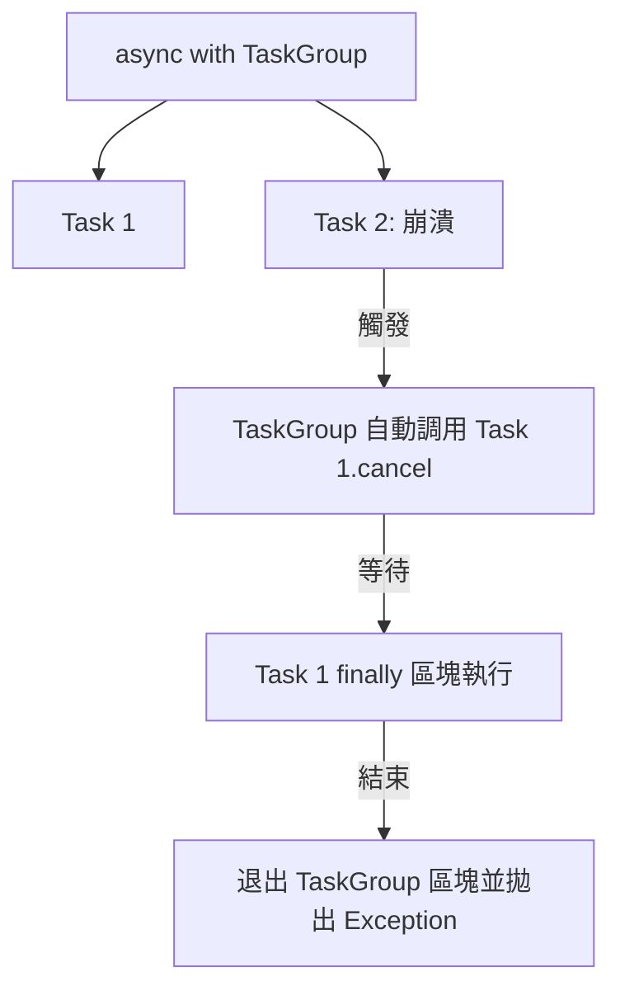

# 非同步任務取消與清理

在非同步架構中，任務取消（Cancellation）是一門精密的藝術。開發者常誤以為調用 `.cancel()` 就像拔掉電源一樣即時，但事實上，`asyncio` 的取消機制是高度協作的。如果處理不當，輕則資源洩漏（如未關閉的 Socket 或資料庫連接），重則導致系統狀態不一致。

---

### 情境 1：務必使用 `try...finally` 或 `async with` 確保資源清理

#### 核心概念簡述
當一個 Task 被取消時，`asyncio` 會在該任務下一個 `await` 表達式處拋出一個 `asyncio.CancelledError`。這意味著如果你的程式碼正在執行純計算邏輯或阻塞式的同步程式碼，取消信號將無法介入。為了確保任務終止時資源能被釋放，必須利用 `finally` 區塊來捕捉這最後的「遺言」。

#### 程式碼範例（Bad vs. Better）

```python
# Bad: 忽視取消後的清理 (Resource Leakage)
async def bad_task(url):
    # 如果任務在執行過程中被取消，connection 可能永遠不會被關閉
    connection = await open_connection(url)
    data = await connection.read()
    await process(data)
    await connection.close() # 若前面拋出 CancelledError，這行永遠跑不到

# ---------------------------------------------------------

# Better: 使用 try...finally 確保優雅終止 (Graceful Cleanup)
async def better_task(url):
    connection = await open_connection(url)
    try:
        data = await connection.read()
        await process(data)
    except asyncio.CancelledError:
        # 可以在此處記錄取消狀態
        print(f"任務 {url} 正在被取消，執行清理動作...")
        raise # ⚠️ 拇指法則：必須再次拋出，否則 Task 狀態會混亂
    finally:
        # 無論是成功還是被取消，確保釋放資源
        await connection.close()
        print(f"連接已關閉")
```

#### 底層原理探討與權衡
`CancelledError` 繼承自 `BaseException` 而非 `Exception`，這是為了防止它被通用的 `except Exception:` 區塊意外攔截。在 `finally` 區塊中執行的非同步清理動作（如 `await connection.close()`）是合法的，但要小心：如果清理過程又耗費太長時間，可能會導致整個應用程式關閉過程卡住。

---

### 情境 2：優先使用 `asyncio.wait_for` 實施強制的超時管控

#### 核心概念簡述
不要手動撰寫 `while` 迴圈來檢查時間並取消任務。`asyncio.wait_for` 封裝了「計時、拋出 TimeoutError、自動調用 .cancel()」的完整邏輯。這是防止任務變成「殭屍任務（Zombie Tasks）」的最有效手段。

#### 程式碼範例（Bad vs. Better）

```python
# Bad: 手動管理超時邏輯 (Verbose & Bug-prone)
async def manual_timeout(task_coro):
    task = asyncio.create_task(task_coro)
    start_time = time.time()
    while not task.done():
        if time.time() - start_time > 5.0:
            task.cancel() # 手動取消
        await asyncio.sleep(1)
    return await task

# ---------------------------------------------------------

# Better: 使用宣告式的 wait_for (Clean & Robust)
async def cleaner_timeout(task_coro):
    try:
        # 執行任務，若超過 5 秒則自動觸發 .cancel() 並拋出 TimeoutError
        result = await asyncio.wait_for(task_coro, timeout=5.0)
        return result
    except asyncio.TimeoutError:
        print("作業耗時過長，已自動發起取消動作")
        # 此時 task_coro 內部的 await 點會收到 CancelledError
```

#### 適用場景
*   **拇指法則**：任何涉及網路請求（HTTP、DB、Socket）的 Awaitable 都應該包裹在超時機制中。
*   **例外情況**：如果任務涉及到關鍵的資料寫入（如金融交易封裝），則需考慮使用 `asyncio.shield` 保護重要片段，避免中途腰斬。

---

### 情境 3：使用 `asyncio.TaskGroup` 實踐結構化併發（Structured Concurrency）

#### 核心概念簡述
在 Python 3.11+ 中，`TaskGroup` 引入了「結構化併發」的概念。它的運作邏輯像是一個安全網：如果群組中任何一個任務失敗，它會自動取消群組內所有其他仍在運行的任務，並等待所有資源清理完畢後才傳播異常。這避免了「孤兒任務」在背景漂浮的風險。

#### 併發管理模型對比表

| 特性 | `asyncio.gather` | `asyncio.TaskGroup` |
| :--- | :--- | :--- |
| **失敗處理** | 一個失敗，其他預設繼續跑 (除非手動取消) | 一個失敗，自動取消群組內所有剩餘任務 |
| **資源清理** | 需手動介入追蹤任務狀態 | Context Manager 自動處理 Cleanup 流程 |
| **代碼結構** | 較散亂，需處理結果清單順序 | 清晰的區塊範圍，語意明確 |

#### 流程演示



---

### 延伸思考

**1️⃣ 問題一**：如果我在 `finally` 區塊中又需要進行非同步操作（如向伺服器發送告警），但任務已經被取消了，這會發生什麼事？

**👆 回答**：這是一個經典挑戰。當 Task 被取消時，它處於 `cancelling` 狀態。在 `finally` 區塊中的 `await` 仍然可以工作，但如果該 `await` 遇到另一個取消信號或系統關閉，可能會再次拋出 `CancelledError`。如果你必須確保清理動作不被中斷，應在 `finally` 內使用 `asyncio.shield()` 保護該清理動作。

---

**2️⃣ 問題二**：`.cancel()` 被調用後，任務會立即停止執行嗎？

**👆 回答**：絕對不會。`.cancel()` 只是在任務上打一個標記。任務必須運行到下一個 `await` 點（例如 `await asyncio.sleep(0)` 或 `await socket.read()`），事件迴圈才有機會檢查該標記並注入 `CancelledError`。如果你的程式碼是一個死迴圈且內部沒有任何 `await` 點（如大量的數學計算），該任務將永遠無法被取消，並會阻塞整個事件迴圈。